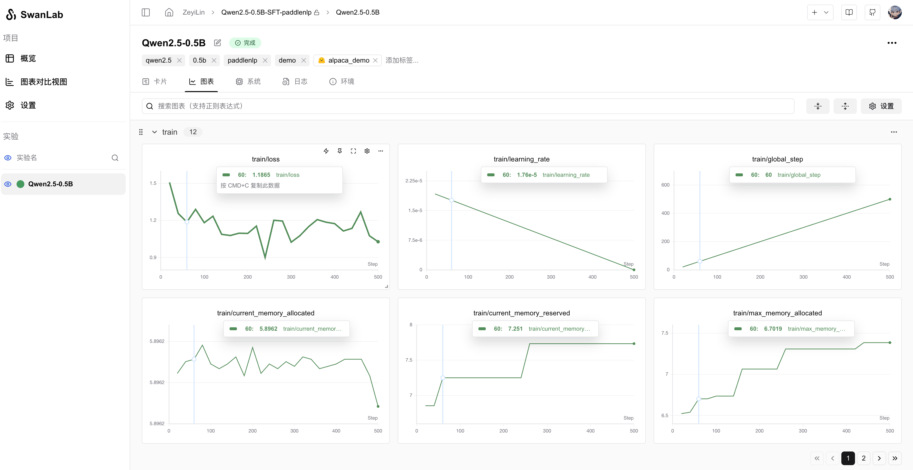

# PaddleNLP  

[PaddleNLP](https://github.com/PaddlePaddle/PaddleNLP) is a large language model (LLM) development toolkit based on the PaddlePaddle deep learning framework. It supports efficient large-scale model training, lossless compression, and high-performance inference on various hardware. PaddleNLP is designed for simplicity and极致 performance, empowering developers to achieve efficient industrial-level applications of large models.  

  

You can use `PaddleNLP` for rapid model training while leveraging SwanLab for experiment tracking and visualization.  

---  

## 1. Integrating SwanLabCallback  

```python  
from swanlab.integration.paddlenlp import SwanLabCallback  
```  

The `SwanLabCallback` is a logging class tailored for PaddleNLP.  

Configurable parameters for `SwanLabCallback` include:  

- `project`, `experiment_name`, `description`, and other parameters consistent with `swanlab.init`, used for initializing the SwanLab project.  
- Alternatively, you can create a project externally via `swanlab.init`, and the integration will log experiments to the externally created project.  


## 2. Passing to Trainer  

```python (1,7,12)  
from swanlab.integration.paddlenlp import SwanLabCallback  
from paddlenlp.trainer import TrainingArguments, Trainer  

...  

# Instantiate SwanLabCallback  
swanlab_callback = SwanLabCallback(project="paddlenlp-demo")  

trainer = Trainer(  
    ...  
    # Pass the callback via the `callbacks` parameter  
    callbacks=[swanlab_callback],  
)  

trainer.train()  
```  


## 3. Complete Example Code  

> Requires connectivity to the HuggingFace server to download the dataset.  

```python {8,19,28}  
"""  
Tested with:  
pip install paddlepaddle-gpu==3.0.0 -i https://www.paddlepaddle.org.cn/packages/stable/cu126/  
pip install paddlenlp==3.0.0b4  
"""  
from paddlenlp.trl import SFTConfig, SFTTrainer  
from datasets import load_dataset  
from swanlab.integration.paddlenlp import SwanLabCallback  

dataset = load_dataset("ZHUI/alpaca_demo", split="train")  

training_args = SFTConfig(  
    output_dir="Qwen/Qwen2.5-0.5B-SFT",  
    device="gpu",  
    per_device_train_batch_size=1,  
    logging_steps=20  
)  

swanlab_callback = SwanLabCallback(  
    project="Qwen2.5-0.5B-SFT-paddlenlp",  
    experiment_name="Qwen2.5-0.5B",  
)  

trainer = SFTTrainer(  
    args=training_args,  
    model="Qwen/Qwen2.5-0.5B-Instruct",  
    train_dataset=dataset,  
    callbacks=[swanlab_callback],  
)  
trainer.train()  
```  

---  

## 4. GUI Demonstration  

### Automatically Logged Hyperparameters:  
  

### Metrics Logging:  
  


## 5. Extension: Adding More Callbacks  

Imagine a scenario where you want the model to infer test samples at the end of each epoch and log the results with SwanLab. You can create a new class inheriting from `SwanLabCallback` and extend or override lifecycle functions. For example:  

```python  
class NLPSwanLabCallback(SwanLabCallback):  
    def on_epoch_end(self, args, state, control, **kwargs):  
        test_text_list = ["example1", "example2"]  
        log_text_list = []  
        for text in test_text_list:  
            result = model(text)  
            log_text_list.append(swanlab.Text(result))  

        swanlab.log({"Prediction": test_text_list}, step=state.global_step)  
```  

The above is a new callback class for NLP tasks, extending the `on_epoch_end` function, which executes at the end of each epoch during `transformers` training.  