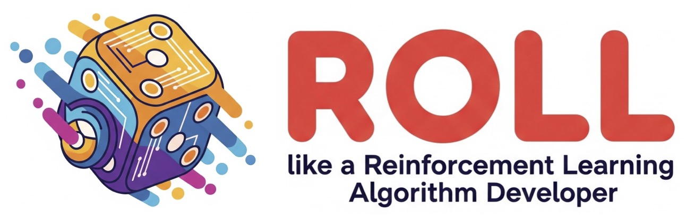

# ROLL

[ROLL](https://github.com/alibaba/ROLL) is an efficient and user-friendly reinforcement learning library specifically designed for Large Language Models (LLMs) that utilize large-scale GPU resources. It significantly enhances the performance of LLMs in key areas such as human preference alignment, complex reasoning, and multi-turn agent interaction scenarios.

ROLL employs a multi-role distributed architecture based on Ray to enable flexible resource allocation and heterogeneous task scheduling. It integrates cutting-edge technologies like Megatron-Core, SGLang, and vLLM to accelerate model training and inference.

Using SwanLab in ROLL is very straightforward—just configure a few parameters. For details, please refer to the `track_with: swanlab` section in [agentic_pipeline_config.yaml](https://github.com/alibaba/ROLL/blob/main/tests/pipeline/agentic_pipeline_config.yaml).

More details please refer to: [ROLL Official API Documentation - Configuring SwanLab](https://alibaba.github.io/ROLL/docs/User%20Guides/Tracker%20&%20Metrics/trackers_and_metrics#configuring-swanlab).