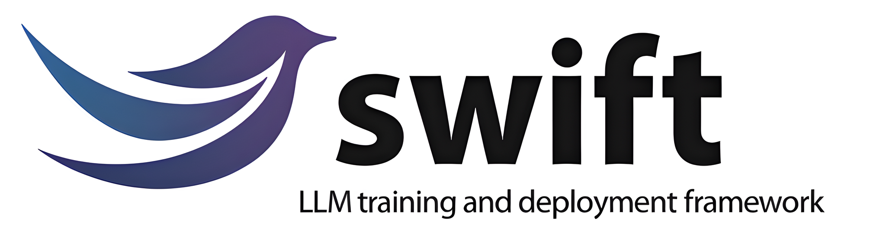
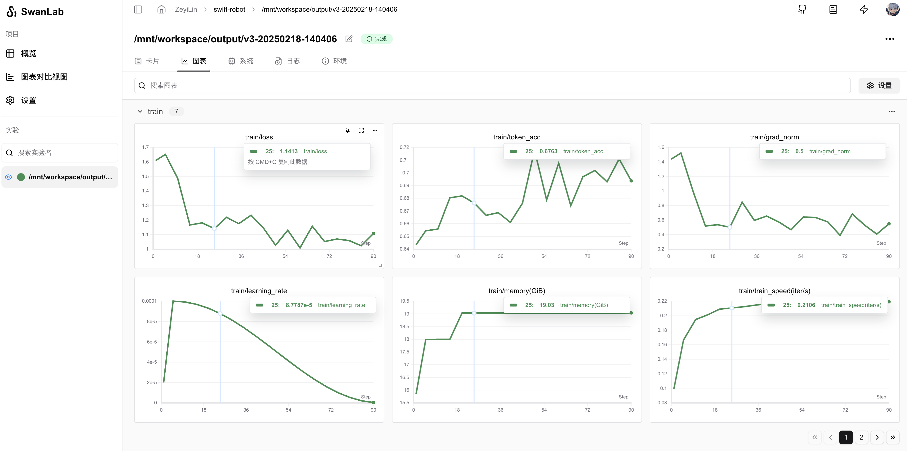
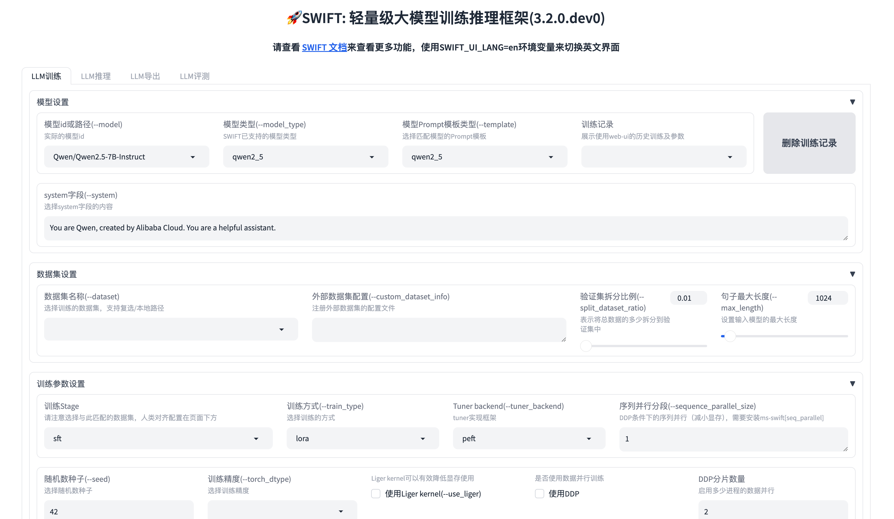
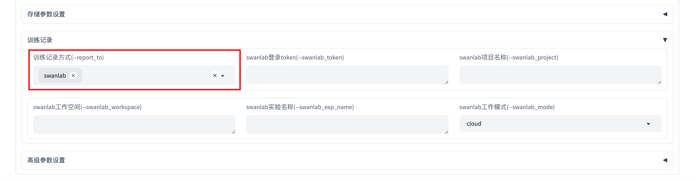
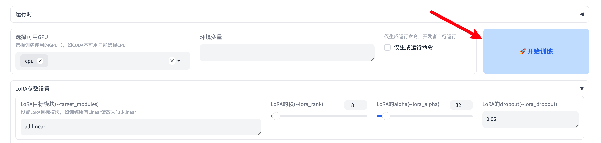
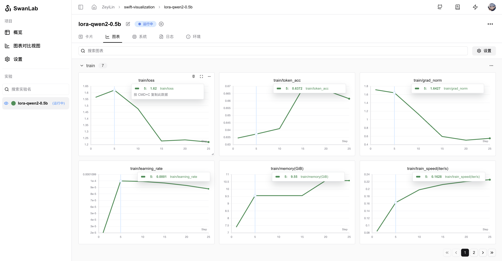

# Modelscope Swift

> SwanLab has been officially integrated with Swift, see: [#3142](https://github.com/modelscope/ms-swift/pull/3142)  
> Online Demo: [swift-robot](https://swanlab.cn/@ZeyiLin/swift-robot/runs/9lc9rmmwm4hh7ay1vkzd7/chart)

[Modelscope](https://modelscope.cn/)'s [Swift](https://github.com/modelscope/swift) is a framework that integrates model training, fine-tuning, inference, and deployment.



🍲 **ms-swift** is the official framework provided by the ModelScope community for fine-tuning and deploying large language models and multimodal large models. It currently supports training (pre-training, fine-tuning, human alignment), inference, evaluation, quantization, and deployment of **450+** large models and **150+** multimodal large models.

🍔 Additionally, ms-swift incorporates **state-of-the-art training techniques**, including **LoRA, QLoRA, Llama-Pro, LongLoRA, GaLore, Q-GaLore, LoRA+, LISA, DoRA, FourierFt, ReFT, UnSloth, and Liger** for lightweight training, as well as **DPO, GRPO, RM, PPO, KTO, CPO, SimPO, and ORPO** for human alignment training.

ms-swift supports accelerated inference, evaluation, and deployment modules using vLLM and LMDeploy, and supports model quantization using GPTQ, AWQ, and BNB. Furthermore, ms-swift provides a Gradio-based Web UI and a wealth of best practices.

You can use Swift for rapid model training while utilizing SwanLab for experiment tracking and visualization.

[[toc]]

## 0. Install ms-swift and swanlab

> Currently, ms-swift has not released the latest package (version 3.1.0 at the time of writing), so installation from source is required.

Install ms-swift from source:

```bash
git clone https://github.com/modelscope/swift.git
cd swift
pip install -e .
```

Install swanlab:

```bash
pip install swanlab
```

## 1. CLI Fine-tuning

You only need to add the `--report_to` and `--swanlab_project` parameters to the ms-swift CLI to use SwanLab for experiment tracking and visualization:

```bash
swift sft \
    ...
    --report_to swanlab \
    --swanlab_project swift-robot \
    ...
```

Below is an example of combining SwanLab with Swift's official CLI fine-tuning case (see the last part of the code):

```bash {29-30}
# 22GB
CUDA_VISIBLE_DEVICES=0 \
swift sft \
    --model Qwen/Qwen2.5-7B-Instruct \
    --train_type lora \
    --dataset 'AI-ModelScope/alpaca-gpt4-data-zh#500' \
              'AI-ModelScope/alpaca-gpt4-data-en#500' \
              'swift/self-cognition#500' \
    --torch_dtype bfloat16 \
    --num_train_epochs 1 \
    --per_device_train_batch_size 1 \
    --per_device_eval_batch_size 1 \
    --learning_rate 1e-4 \
    --lora_rank 8 \
    --lora_alpha 32 \
    --target_modules all-linear \
    --gradient_accumulation_steps 16 \
    --eval_steps 50 \
    --save_steps 50 \
    --save_total_limit 5 \
    --logging_steps 5 \
    --max_length 2048 \
    --output_dir output \
    --system 'You are a helpful assistant.' \
    --warmup_ratio 0.05 \
    --dataloader_num_workers 4 \
    --model_author swift \
    --model_name swift-robot \
    --report_to swanlab \
    --swanlab_project swift-robot
```

After running the command, you can view the training process on SwanLab:



Supported full parameters:

- `swanlab_token`: SwanLab's api-key
- `swanlab_project`: SwanLab project
- `swanlab_workspace`: Default is None, will use the username corresponding to the api-key
- `swanlab_exp_name`: Experiment name, can be empty, defaults to the value of --output_dir
- `swanlab_mode`: Optional cloud or local, cloud mode or local mode

## 2. WebUI Fine-tuning

Swift not only supports CLI fine-tuning but also provides a convenient **WebUI (web-based)** fine-tuning interface for developers. You can also start SwanLab tracking experiments within the WebUI.

Start WebUI:

```bash
swift web-ui
```

After starting, the browser will automatically open, displaying the fine-tuning interface (or visit http://localhost:7860/ ):



In the "Training Records" section below, select `swanlab` under `Training Record Method`:



You can also fill in more detailed swanlab parameters in other parts of the "Training Records" section, including:

- `swanlab_token`: SwanLab's api-key
- `swanlab_project`: SwanLab project
- `swanlab_workspace`: Default is None, will use the username corresponding to the api-key
- `swanlab_exp_name`: Experiment name, can be empty, defaults to the value of --output_dir
- `swanlab_mode`: Optional cloud or local, cloud mode or local mode

Then, click the "🚀 Start Training" button to start training and use SwanLab to track the experiment:



## 3. Python Code Fine-tuning

**3.1 Import SwanLabCallback**

Since `Swift`'s `trainer` integrates with `transformers`, you can directly use `swanlab`'s `SwanLabCallback` integrated with `huggingface`:

```python
from swanlab.integration.transformers import SwanLabCallback
```

SwanLabCallback can define parameters such as:

- project, experiment_name, description, etc., which are consistent with swanlab.init, used for initializing the SwanLab project. You can also create a project externally via swanlab.init, and the integration will record experiments to the project you created externally.

**3.2 Import Trainer**

```python {1,7,11}
from swanlab.integration.transformers import SwanLabCallback
from swift import Seq2SeqTrainer, Seq2SeqTrainingArguments

···

# Instantiate SwanLabCallback
swanlab_callback = SwanLabCallback(project="swift-visualization")

trainer = Seq2SeqTrainer(
    ...
    callbacks=[swanlab_callback],
    )

trainer.train()
```

**3.3 Using SwanLabCallback**

> Fine-tuning a Qwen2-0.5B model with LoRA

```python
from swanlab.integration.transformers import SwanLabCallback
from swift import Seq2SeqTrainer, Seq2SeqTrainingArguments
from swift.llm import get_model_tokenizer, load_dataset, get_template, EncodePreprocessor
from swift.utils import get_logger, find_all_linears, get_model_parameter_info, plot_images, seed_everything
from swift.tuners import Swift, LoraConfig
from swift.trainers import Seq2SeqTrainer, Seq2SeqTrainingArguments
from functools import partial
import os

logger = get_logger()
seed_everything(42)

# Hyperparameters for training
# model
model_id_or_path = 'Qwen/Qwen2.5-3B-Instruct'  # model_id or model_path
system = 'You are a helpful assistant.'
output_dir = 'output'

# dataset
dataset = ['AI-ModelScope/alpaca-gpt4-data-zh#500', 'AI-ModelScope/alpaca-gpt4-data-en#500',
           'swift/self-cognition#500']  # dataset_id or dataset_path
data_seed = 42
max_length = 2048
split_dataset_ratio = 0.01  # Split validation set
num_proc = 4  # The number of processes for data loading.
# The following two parameters are used to override the placeholders in the self-cognition dataset.
model_name = ['小黄', 'Xiao Huang']  # The Chinese name and English name of the model
model_author = ['魔搭', 'ModelScope']  # The Chinese name and English name of the model author

# lora
lora_rank = 8
lora_alpha = 32

# training_args
training_args = Seq2SeqTrainingArguments(
    output_dir=output_dir,
    learning_rate=1e-4,
    per_device_train_batch_size=1,
    per_device_eval_batch_size=1,
    gradient_checkpointing=True,
    weight_decay=0.1,
    lr_scheduler_type='cosine',
    warmup_ratio=0.05,
    logging_first_step=True,
    save_strategy='steps',
    save_steps=50,
    eval_strategy='steps',
    eval_steps=50,
    gradient_accumulation_steps=16,
    num_train_epochs=1,
    metric_for_best_model='loss',
    save_total_limit=5,
    logging_steps=5,
    dataloader_num_workers=1,
    data_seed=data_seed,
)

output_dir = os.path.abspath(os.path.expanduser(output_dir))
logger.info(f'output_dir: {output_dir}')

# Obtain the model and template, and add a trainable Lora layer on the model.
model, tokenizer = get_model_tokenizer(model_id_or_path)
logger.info(f'model_info: {model.model_info}')
template = get_template(model.model_meta.template, tokenizer, default_system=system, max_length=max_length)
template.set_mode('train')

target_modules = find_all_linears(model)
lora_config = LoraConfig(task_type='CAUSAL_LM', r=lora_rank, lora_alpha=lora_alpha,
                         target_modules=target_modules)
model = Swift.prepare_model(model, lora_config)
logger.info(f'lora_config: {lora_config}')

# Print model structure and trainable parameters.
logger.info(f'model: {model}')
model_parameter_info = get_model_parameter_info(model)
logger.info(f'model_parameter_info: {model_parameter_info}')

# Download and load the dataset, split it into a training set and a validation set,
# and encode the text data into tokens.
train_dataset, val_dataset = load_dataset(dataset, split_dataset_ratio=split_dataset_ratio, num_proc=num_proc,
        model_name=model_name, model_author=model_author, seed=data_seed)

logger.info(f'train_dataset: {train_dataset}')
logger.info(f'val_dataset: {val_dataset}')
logger.info(f'train_dataset[0]: {train_dataset[0]}')

train_dataset = EncodePreprocessor(template=template)(train_dataset, num_proc=num_proc)
val_dataset = EncodePreprocessor(template=template)(val_dataset, num_proc=num_proc)
logger.info(f'encoded_train_dataset[0]: {train_dataset[0]}')

# Print a sample
template.print_inputs(train_dataset[0])

# Get the trainer and start the training.
model.enable_input_require_grads()  # Compatible with gradient checkpointing

swanlab_callback = SwanLabCallback(
    project="swift-visualization",
    experiment_name="lora-qwen2-0.5b",
    description="Fine-tuning a Qwen2-0.5B model with LoRA"
)

trainer = Seq2SeqTrainer(
    model=model,
    args=training_args,
    data_collator=template.data_collator,
    train_dataset=train_dataset,
    eval_dataset=val_dataset,
    template=template,
    callbacks=[swanlab_callback],
)
trainer.train()

last_model_checkpoint = trainer.state.last_model_checkpoint
logger.info(f'last_model_checkpoint: {last_model_checkpoint}')
```

Visualization results after running:

