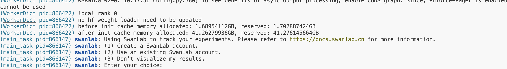
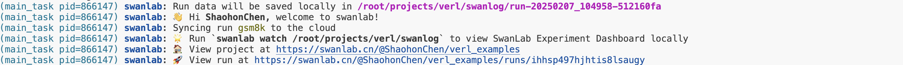
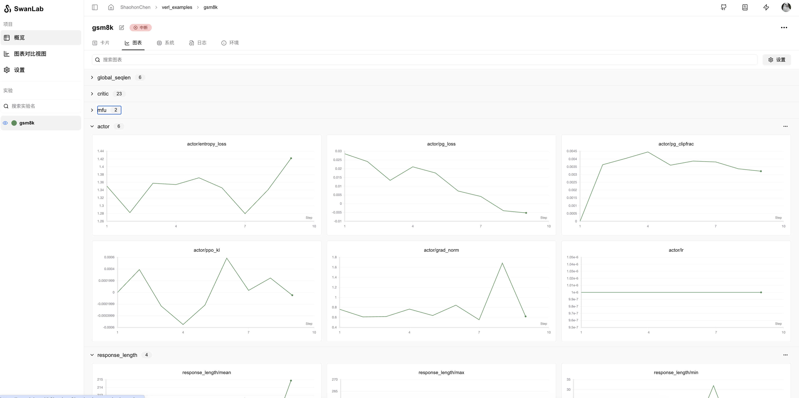

# Verl

[Verl](https://github.com/volcengine/verl) is a flexible, efficient, and production-ready reinforcement learning (RL) training framework designed for post-training of large language models (LLMs). It is open-sourced by the ByteDance Volcano Engine team and serves as the open-source implementation of the [HybridFlow](https://arxiv.org/abs/2409.19256) paper.

<div style="text-align: center;">
    
</div>

**verl is flexible and easy to use with:**

* **Easy extension of diverse RL algorithms:** The Hybrid programming model combines the strengths of single-controller and multi-controller paradigms to enable flexible representation and efficient execution of complex Post-Training dataflows. Allowing users to build RL dataflows in a few lines of code.

* **Seamless integration of existing LLM infra with modular APIs:** Decouples computation and data dependencies, enabling seamless integration with existing LLM frameworks, such as PyTorch FSDP, Megatron-LM and vLLM. Moreover, users can easily extend to other LLM training and inference frameworks.

* **Flexible device mapping and parallelism:** Supports various placement of models onto different sets of GPUs for efficient resource utilization and scalability across different cluster sizes.

Readily integration with popular HuggingFace models

**verl is fast with:**

* **State-of-the-art throughput:** By seamlessly integrating existing SOTA LLM training and inference frameworks, verl achieves high generation and training throughput.

* **Efficient actor model resharding with 3D-HybridEngine:** Eliminates memory redundancy and significantly reduces communication overhead during transitions between training and generation phases.

For more information, refer to the following links:

> * Verl GitHub Repository: [https://github.com/volcengine/verl](https://github.com/volcengine/verl)
> * Official Documentation: [https://verl.readthedocs.io/en/latest/index.html](https://verl.readthedocs.io/en/latest/index.html)
> * HybridFlow Paper: [https://arxiv.org/pdf/2409.19256v2](https://arxiv.org/pdf/2409.19256v2)

You can use Verl to quickly conduct large-scale model reinforcement learning training while using SwanLab for experiment tracking and visualization.

## Environment Setup

Required Environment:

* Python: Version >= 3.9

* CUDA: Version >= 12.1

Refer to the Verl official documentation for installation: [https://verl.readthedocs.io/en/latest/start/install.html](https://verl.readthedocs.io/en/latest/start/install.html)

Additionally, SwanLab needs to be installed:

```bash
pip install -U swanlab
```

## Usage

Take the example from the Verl official documentation: [Post-train a LLM using PPO with GSM8K dataset](https://verl.readthedocs.io/en/latest/start/quickstart.html).

You only need to add `trainer.logger=['swanlab']` to the experiment's launch command to choose SwanLab for experiment tracking.

**The complete test command is as follows:**

```bash {20}
PYTHONUNBUFFERED=1 python3 -m verl.trainer.main_ppo \
 data.train_files=$HOME/data/gsm8k/train.parquet \
 data.val_files=$HOME/data/gsm8k/test.parquet \
 data.train_batch_size=256 \
 data.val_batch_size=1312 \
 data.max_prompt_length=512 \
 data.max_response_length=256 \
 actor_rollout_ref.model.path=Qwen/Qwen2.5-0.5B-Instruct \
 actor_rollout_ref.actor.optim.lr=1e-6 \
 actor_rollout_ref.actor.ppo_mini_batch_size=64 \
 actor_rollout_ref.actor.ppo_micro_batch_size_per_gpu=4 \
 actor_rollout_ref.rollout.log_prob_micro_batch_size_per_gpu=8 \
 actor_rollout_ref.rollout.tensor_model_parallel_size=1 \
 actor_rollout_ref.rollout.gpu_memory_utilization=0.4 \
 actor_rollout_ref.ref.log_prob_micro_batch_size_per_gpu=4 \
 critic.optim.lr=1e-5 \
 critic.model.path=Qwen/Qwen2.5-0.5B-Instruct \
 critic.ppo_micro_batch_size_per_gpu=4 \
 algorithm.kl_ctrl.kl_coef=0.001 \
 trainer.logger=['console','swanlab'] \
 trainer.val_before_train=False \
 trainer.default_hdfs_dir=null \
 trainer.n_gpus_per_node=1 \
 trainer.nnodes=1 \
 trainer.save_freq=10 \
 trainer.test_freq=10 \
 trainer.total_epochs=15 2>&1 | tee verl_demo.log
```

:::info
If you need to set the project and experiment name, you can set `trainer.project_name` and `trainer.experiment_name`.  
For example:
```bash
PYTHONUNBUFFERED=1 python3 -m verl.trainer.main_ppo \
 ...
 trainer.project_name="verl_demo" \
 trainer.experiment_name="ppo" \
 ...
```
:::

If you are not logged into SwanLab when starting the training, the following prompt will appear.



Selecting **1 or 2** will enable cloud tracking mode. Follow the prompts to input the API from the official website to enable online tracking. You can view the training tracking results online. Selecting **3** will not upload training data and will use offline tracking.

Alternatively, you can log in or set the tracking mode via [environment variables](/api/environment-variable):

```bash
export SWANLAB_API_KEY=<Your API Key>           # Set the API for online tracking mode
export SWANLAB_LOG_DIR=<Set local log storage path>    # Set the local log storage path
export SWANLAB_MODE=<Set SwanLab's running mode>     # Includes four modes: cloud (default), cloud-only (only cloud tracking, no local file saving), local (local tracking mode), and disabled (no logging, used for debugging)
```

## Viewing Training Logs

After logging in, the following login information will be displayed:



Run the process, and you can view the training logs on the [SwanLab official website](https://swanlab.cn).



For more usage methods, refer to [SwanLab Viewing Results](https://docs.swanlab.cn/guide_cloud/experiment_track/view-result.html).

---

If you are using the local dashboard mode, you can open the local dashboard with the following command:

```bash
swanlab watch
```

For more details, refer to [SwanLab Offline Dashboard Mode](https://docs.swanlab.cn/guide_cloud/self_host/offline-board.html).

To set the port number on the server, refer to [Offline Dashboard Port Number](https://docs.swanlab.cn/api/cli-swanlab-watch.html#%E8%AE%BE%E7%BD%AEip%E5%92%8C%E7%AB%AF%E5%8F%A3%E5%8F%B7).


## Record Generated Text During Each Evaluation Round

If you wish to log the generated text to SwanLab during each evaluation round (`val`), simply add the line `trainer.log_val_generations=1` in the command:

```bash {5}
PYTHONUNBUFFERED=1 python3 -m verl.trainer.main_ppo \
 data.train_files=$HOME/data/gsm8k/train.parquet \
 data.val_files=$HOME/data/gsm8k/test.parquet \
 trainer.logger=['console','swanlab'] \
 trainer.log_val_generations=1 \
 ...
```

> If you want to generate multiple results per round of evaluation, such as 10 results, modify `trainer.log_val_generations=10` instead.

## Tips: Resume at the End

If you want to resume the experiment at the end of the training, you can set the environment variable `SWANLAB_RESUME` to `must` and `SWANLAB_RUN_ID` to the experiment ID.

```bash
export SWANLAB_RESUME=must
export SWANLAB_RUN_ID=<exp_id>
```