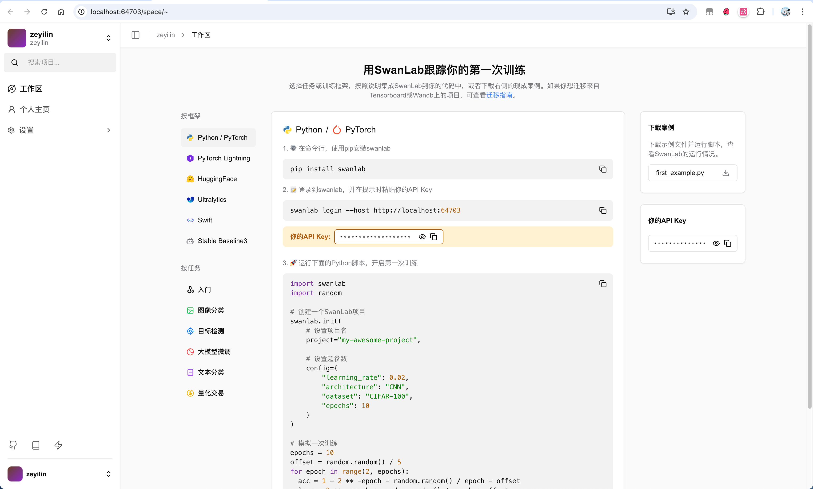

# Deploying with Docker

To deploy SwanLab Community Edition privately, follow the installation steps below.

## Prerequisites

> Before installing SwanLab, ensure your machine meets the following minimum system requirements:
> - CPU >= 2 cores
> - Memory >= 4GB

SwanLab Community Edition requires **Docker Compose** for installation and deployment. Refer to the table below to select the correct Docker and Compose versions based on your operating system.

**If Docker is already installed, skip this step.**

| Operating System | Software | Notes |
|------------------|----------|-------|
| macOS 10.14 or later | Docker Desktop | Configure the Docker VM to use at least 2 vCPUs and 8 GB of initial memory. Otherwise, installation may fail. For more details, refer to the [Docker Desktop for Mac Installation Guide](https://docs.docker.com/desktop/install/mac-install/). |
| Windows (with WSL 2 enabled) | Docker Desktop | We recommend storing source code and other Linux container-bound data in the Linux filesystem rather than the Windows filesystem. For more details, refer to the [Docker Desktop for Windows with WSL 2 Backend Installation Guide](https://docs.docker.com/desktop/setup/install/windows-install/#wsl-2-backend). |
| Linux | Docker 19.03 or later, Docker Compose 1.28 or later | For installation instructions, refer to the [Docker Installation Guide](https://docs.docker.com/engine/install/) and [Docker Compose Installation Guide](https://docs.docker.com/compose/install/). |

> If Docker is not installed, you can run the provided [installation script](https://docs.docker.com/desktop/install/mac-install/).

## 1. Clone the Repository

Clone the `self-hosted` repository using Git:

```bash
git clone https://github.com/SwanHubX/self-hosted.git
cd self-hosted
```

## 2. One-Click Installation

The default installation script is located at `docker/install.sh`. Execute it to install all required containers and perform initial configurations.

```bash
cd ./docker
./install.sh
```

The default script uses Tencent Cloud's image registry, ensuring fast download speeds in China.

If you prefer to use [DockerHub](https://hub.docker.com/) as the image registry, run the following script:

```bash
./install-dockerhub.sh
```

## 3. Activate the Primary Account

SwanLab Community Edition uses port `8000` by default. If using the default configuration, access it at: http://localhost:8000.

> If the community edition is deployed on a different port, open Docker Desktop, locate the port mapping for the `traefik` container (e.g., `64703:80`), and access `http://localhost:64703`.


Now, activate your primary account. Activation requires 1 License, which can be obtained for free from the [SwanLab Official Website](https://swanlab.cn) for personal use.

> Placeholder Image - Public Cloud Edition Setup - Apply for License

Once you have the License, return to the activation page, enter your username, password, confirm password, and License, then click "Activate" to complete the setup.



## 4. Start Your First Experiment

Log in using the Python SDK:

```bash
swanlab login --host <IP Address>
```

> If you have previously logged in and wish to re-login, use:  
> `swanlab login --host <IP Address> --relogin`.

Press Enter, enter your API Key, and complete the login. Your SwanLab experiments will now be uploaded to your private SwanLab instance by default.

---

Test Script:

```bash
import swanlab
import random

# Create a SwanLab project
swanlab.init(
    # Set project name
    project="my-awesome-project",
    
    # Set hyperparameters
    config={
        "learning_rate": 0.02,
        "architecture": "CNN",
        "dataset": "CIFAR-100",
        "epochs": 10
    }
)

# Simulate a training session
epochs = 10
offset = random.random() / 5
for epoch in range(2, epochs):
  acc = 1 - 2 ** -epoch - random.random() / epoch - offset
  loss = 2 ** -epoch + random.random() / epoch + offset

  # Log training metrics
  swanlab.log({"acc": acc, "loss": loss})

# [Optional] Complete the training, necessary in notebook environments
swanlab.finish()
```

View the experiment on the web after running:

