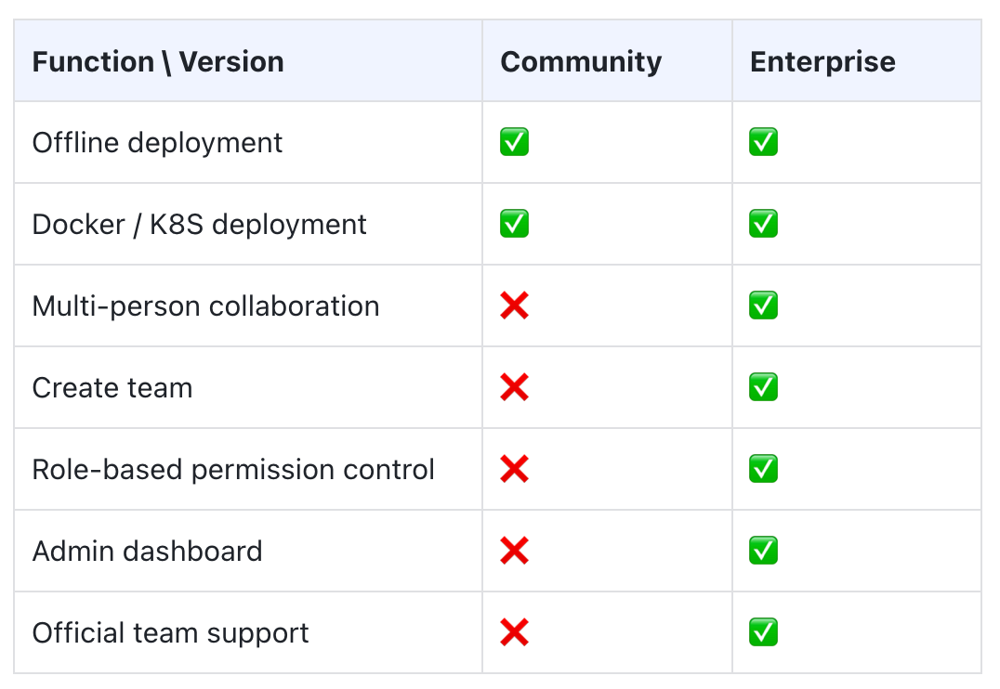

# Team / Enterprise plan

SwanLab offers an Enterprise Edition designed for organizations and companies that require **high performance**, **enhanced security**, and **dedicated support**.

## Get in Touch

If your organization is interested in our Enterprise features, please reach out to us via the following channels:

1. **Online Inquiry**: [Apply Now](https://rcnpx636fedp.feishu.cn/share/base/form/shrcnVS6JQjfXW3vEOvLdCITxfe)
2. **Email**: [contact@swanlab.cn](mailto:contact@swanlab.cn)

## Feature Comparison

The **Community Edition** is intended for individual use and does not include advanced features such as **multi-user collaboration, team creation, permission control, or management dashboards**. These limitations make it difficult to meet the experiment tracking and collaboration needs of AI labs, algorithm teams, and AI-driven enterprises.

For professional AI R&D teams, we provide **SwanLab Enterprise**. The primary differences between the Community and Enterprise editions are summarized in the table below:

