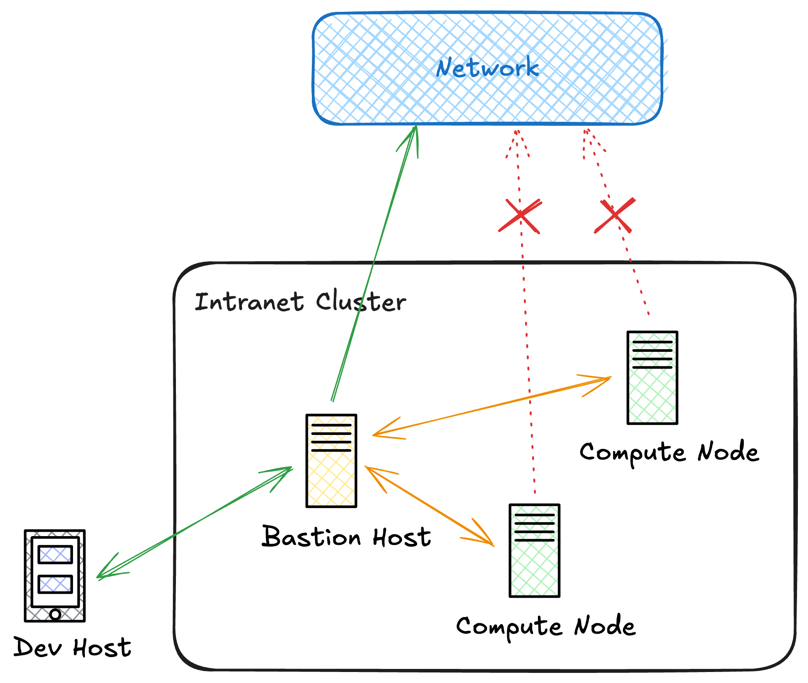

# Accessing SwanLab Cloud from Internal Computing Nodes

Typically, computing nodes in a computing cluster cannot connect to the internet, and external development machines must connect to computing nodes through a jump server. If you cannot connect to the public network, you won't be able to upload data to SwanLab Cloud. However, since the jump server acts as an "intermediary" that can connect to the internet, we can utilize it to proxy the computing nodes' connection to the public network environment.



We can use SSH proxy forwarding to enable computing nodes to connect to [SwanLab Cloud](https://swanlab.cn/).

## Enable Proxy Forwarding Network

> Ensure that your computing node can connect to the jump server via SSH

Execute the following command on the computing node to connect to the jump server:

```bash
ssh -D {port} {user}@{ip}
```

- `port` parameter is the port used for proxy forwarding, for example `2015`
- `user` and `ip` parameters are the username and internal IP address of the jump server

For example: `ssh -D 2015 hello@192.168.31.10`

After successfully connecting to the jump server, a SOCKS proxy tunnel is opened on the corresponding port. You can then configure the proxy by setting environment variables in the terminal, for example:

```bash
export http_proxy=socks5://127.0.0.1:{port} https_proxy=socks5://127.0.0.1:{port}
```

> Note: Replace the corresponding `port` with your configured port, the protocol is [socks5](https://en.wikipedia.org/wiki/SOCKS)

After configuration, you can test if you're correctly connected to the public network using the following command:

```bash
curl ipinfo.io
```

Once configured successfully, you can happily use SwanLab Cloud version 🥳.

Note that the SSH connection must not be disconnected, and closing the terminal session will cause the connection to drop. You can use [tmux](https://github.com/tmux/tmux/wiki) to keep the SSH connection command running in the background.

New terminal sessions require reconfiguring environment variables. Of course, you can write the above environment variable export commands into the `.bashrc` file to automatically set the environment variables each time a new terminal session is opened. For example:
```bash
echo "export http_proxy=socks5://127.0.0.1:{port}" >> ~/.bashrc
echo "export https_proxy=socks5://127.0.0.1:{port}" >> ~/.bashrc
```
> Note Replace '{port}' with the port you set

## Working Principle

The above implementation relies on [SSH Dynamic Port Forwarding](https://en.wikipedia.org/wiki/Port_forwarding#Dynamic_port_forwarding), which turns the SSH server into a SOCKS proxy server that applications on your computer can use as an intermediary to connect to remote servers.

> **Note:** The program must support SOCKS type proxies for you to be able to route traffic from that application using dynamic port forwarding.
