# Tencent Cloud App Deployment

Currently, the SwanLab self-hosted version is available on the Tencent Cloud App Market. Trainers are welcome to use it out-of-the-box through Tencent Cloud~

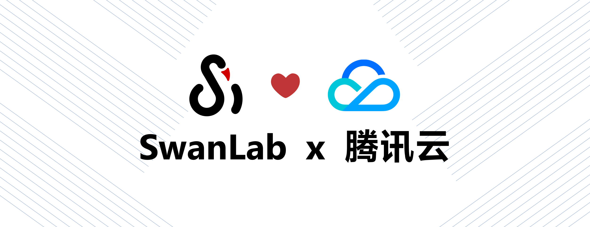

- [SwanLab Tencent Cloud App](https://app.cloud.tencent.com/detail/SPU_BHEEJEJCDD1984)

## Prerequisites

1. First, you need a Tencent Cloud account and ensure that the account has **permission to install cloud applications**, reference: [Tencent Cloud App Purchase & Installation Instruction](https://cloud.tencent.com/document/product/1689/113848)

2. In the [Tencent Cloud Console - VPC](https://console.cloud.tencent.com/vpc/vpc), create a default VPC to provide the target network for the cloud application.
Currently supported regions are as follows:
    - China Mainland: Nanjing; Beijing; Guangzhou; Chengdu; Shanghai; Chongqing
    - Other Regions: Hong Kong SAR; Singapore; Silicon Valley; Sao Paulo; Frankfurt


Taking the `Nanjing` region as an example, the CIDR and subnet can be modified as needed. The only required fields are `Name`, `Subnet Name`, and `Availability Zone`.

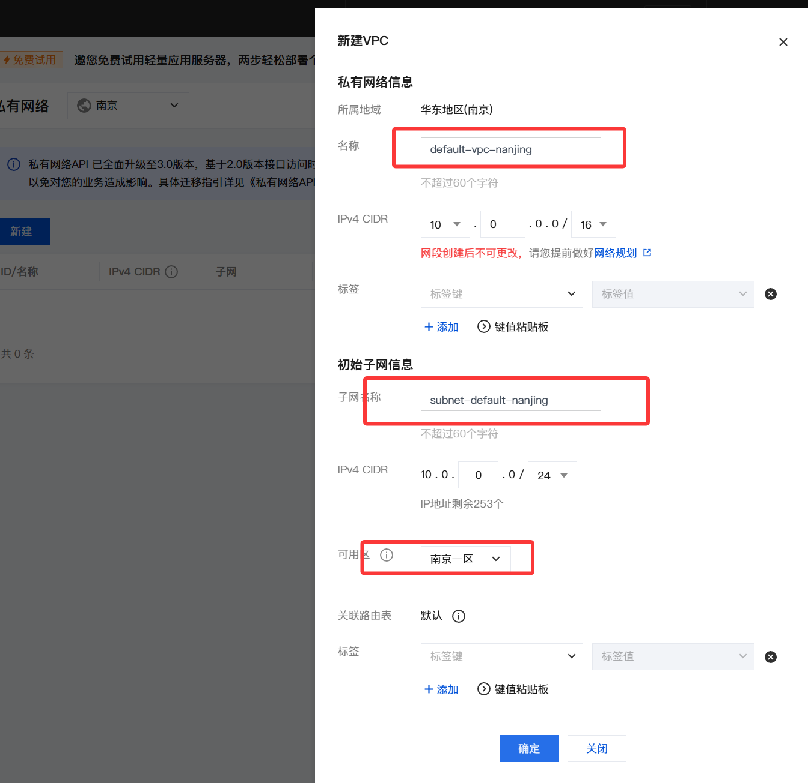


## Installation Tutorial


1. Go to the [SwanLab Tencent Cloud App](https://app.cloud.tencent.com/detail/SPU_BHEEJEJCDD1984) page,
check `I have read and agree to the "Tencent Cloud App Universal Product User Agreement"`, and click `Install App` to jump to the console interface.

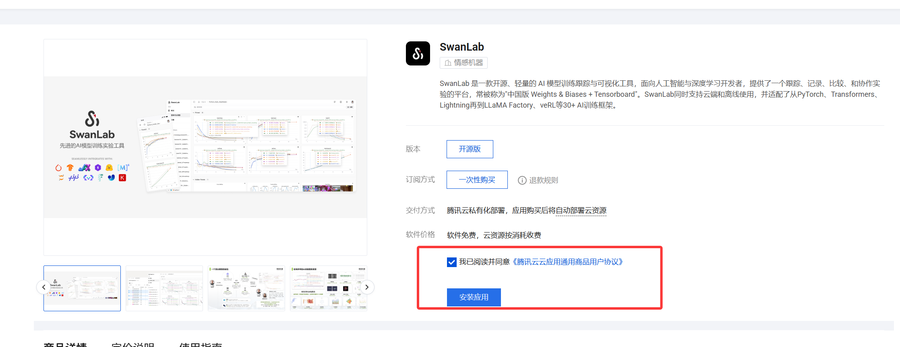

2. In the console interface, you only need to configure three cloud resource settings: `Target Network`, `Cloud Server Type`, and `Data Disk Size`:
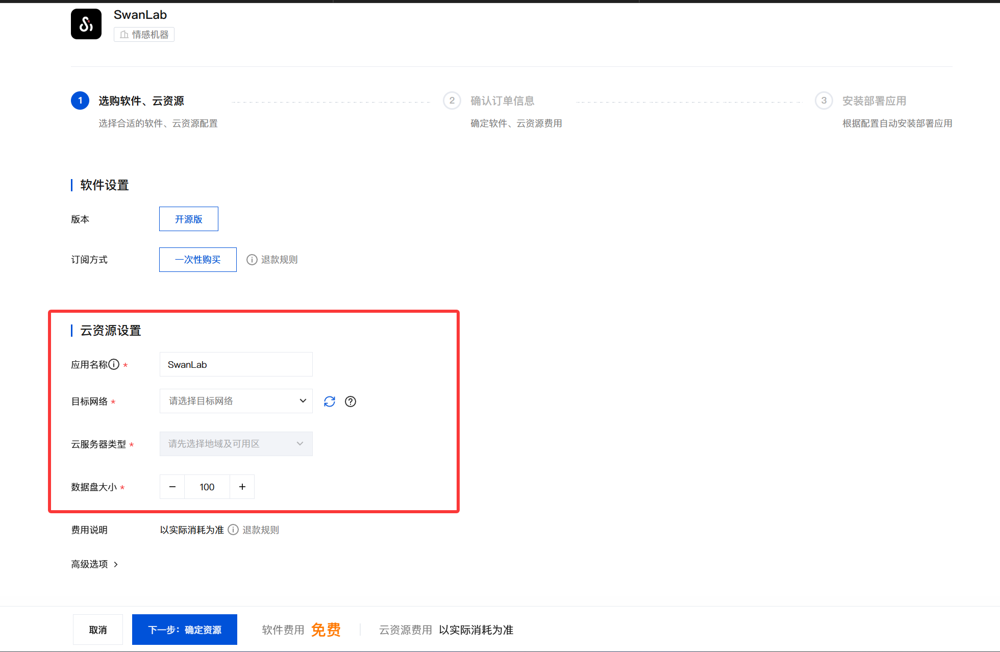

The meaning of each cloud resource is as follows:

| Configuration | Description | Requirements |
| ---- | ---- | ---- |
| Target Network | The region where the cloud service is hosted | You can choose based on the region where the `VPC` was previously created |
| Cloud Server Type | The cloud server instance configuration for hosting the `SwanLab` self-hosted version | Minimum configuration:<br>- vCPU: ≥ 4 cores<br>- Memory: ≥ 8GB<br>- System Storage Space: Default 40GB |
| Data Disk Size | The hard disk size used by the `SwanLab` self-hosted version to record experimental data | Default is `100GB`, minimum is `40GB` |

After configuring the cloud resources, click `Next: Confirm Resources`.

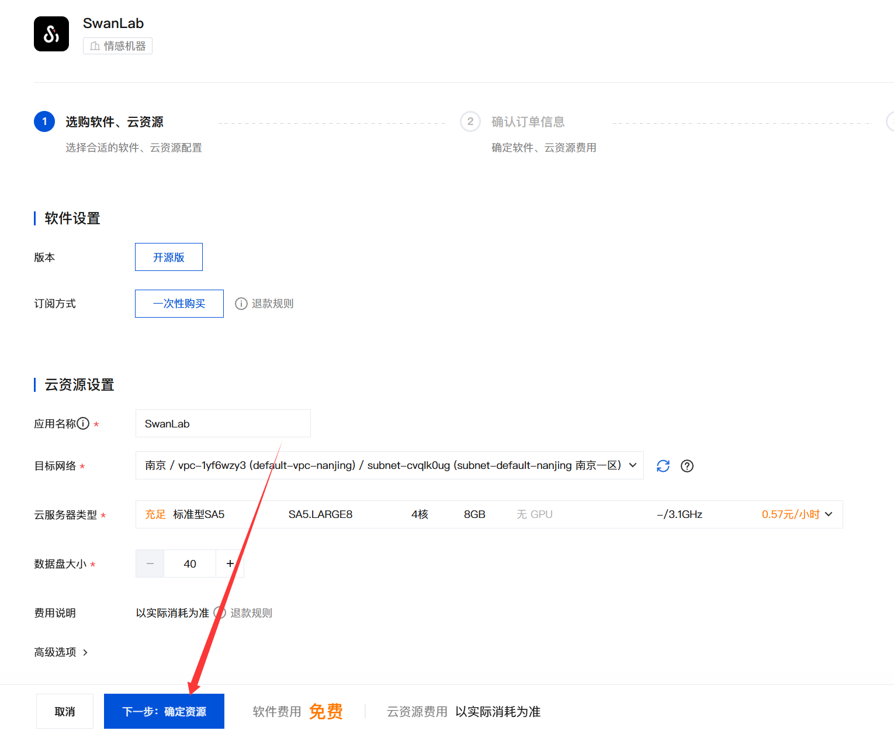

3. Next, you will enter the `Confirm Order Information` interface. Tencent Cloud will generate a bill based on the cloud resources selected in the previous step. At this time, you need to ensure that there is a certain balance in your Tencent Cloud account. After confirming that the order is correct, click `Allow service role to call other cloud service interfaces`, and click `Next: Install App`.


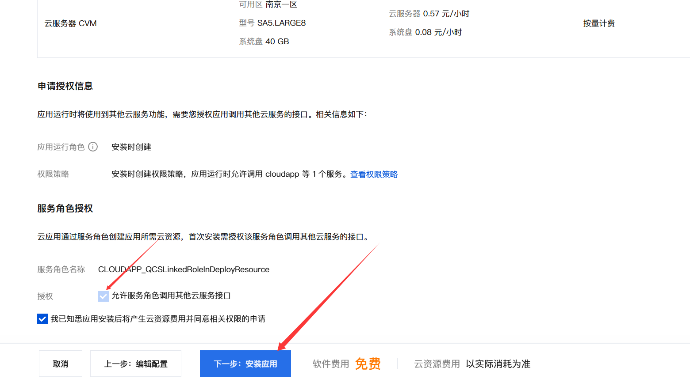

4. Next, you will enter the application installation interface. You need to wait for all resources to be created and started, which will take about 5 minutes.

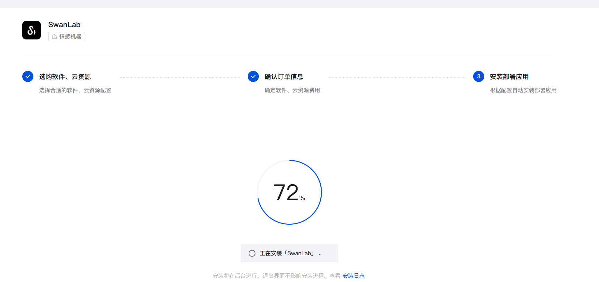

5. After completion, you can see the created cloud application in the Tencent Cloud console interface. Click `Open App` to use the self-hosted version of SwanLab.

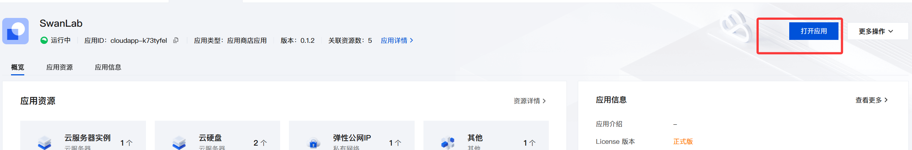


:::info Tip

After the application is created, if you open the application immediately, you may see a 404 page. This is because the cloud server instance needs to perform some container initialization operations after it is created. Wait 1~2 minutes before opening it.

:::

## Activate Main Account

Now, you can use the self-hosted version of SwanLab on Tencent Cloud.

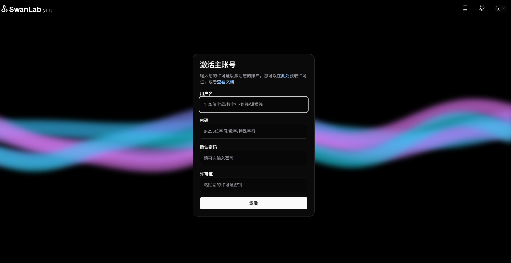

Individual users can apply for a free License on the [SwanLab official website](https://swanlab.cn), located in "Settings" - "Account and License".

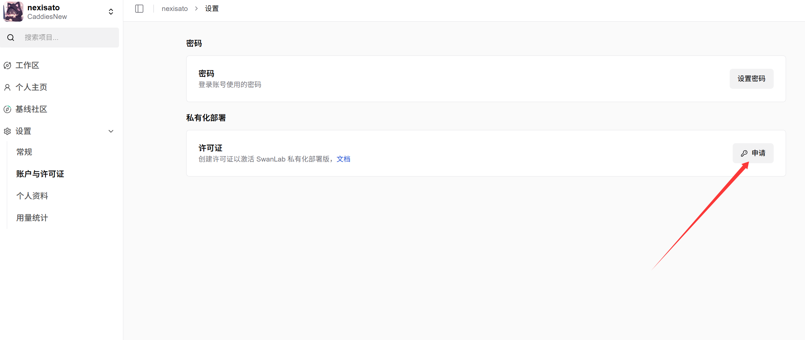

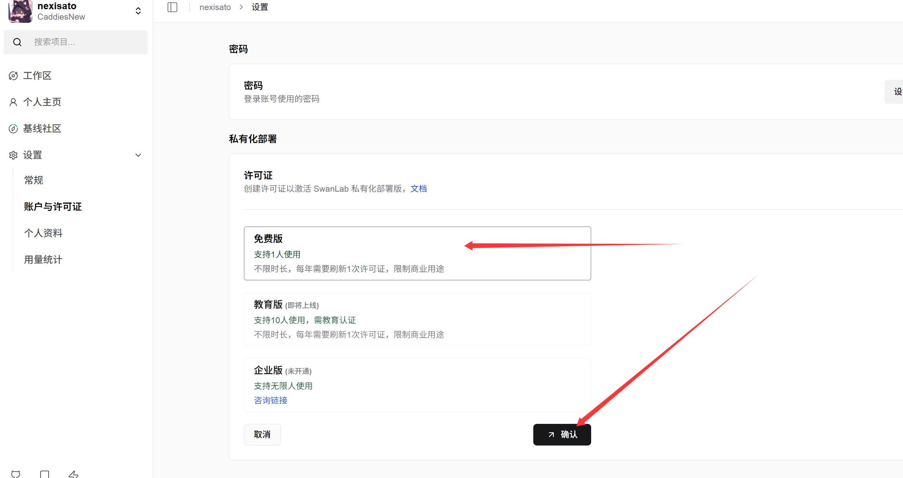

Enter your account, password, and License to activate the self-hosted version of SwanLab.

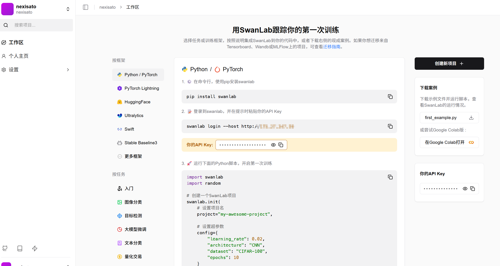

## Start Experiment

Log in with the Python SDK:

```bash
swanlab login --host <IP Address>
```

> If you have logged in to swanlab before and want to log in again, please use:
> `swanlab login --host <IP Address> --relogin`.

Press Enter, fill in the API Key to complete the login. After that, your SwanLab experiments will be uploaded to the privately deployed SwanLab by default.

---

Test script:

```python
import swanlab
import random

# Create a SwanLab project
swanlab.init(
    # Set project name
    project="my-awesome-project",
    
    # Set hyperparameters
    config={
        "learning_rate": 0.02,
        "architecture": "CNN",
        "dataset": "CIFAR-100",
        "epochs": 10
    }
)

# Simulate a training session
epochs = 10
offset = random.random() / 5
for epoch in range(2, epochs):
  acc = 1 - 2 ** -epoch - random.random() / epoch - offset
  loss = 2 ** -epoch + random.random() / epoch + offset

  # Log training metrics
  swanlab.log({"acc": acc, "loss": loss})

# [Optional] Finish training, this is necessary in a notebook environment
swanlab.finish()
```

After running, you can view the experiment on the webpage.

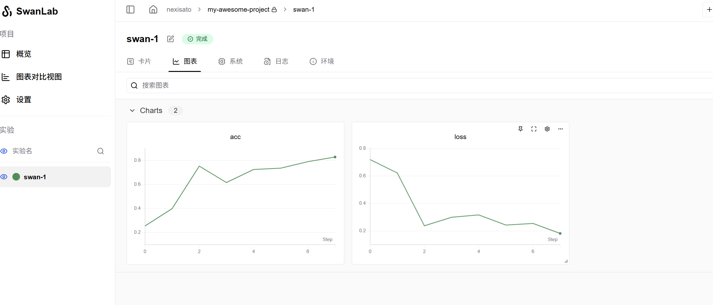


:::info Tip

If you no longer need to use it, please destroy the application in the [Tencent Cloud App Console](https://console.cloud.tencent.com/app) in time to avoid continued billing.

:::


