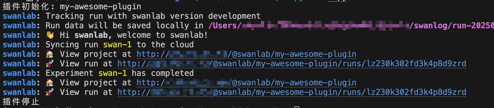
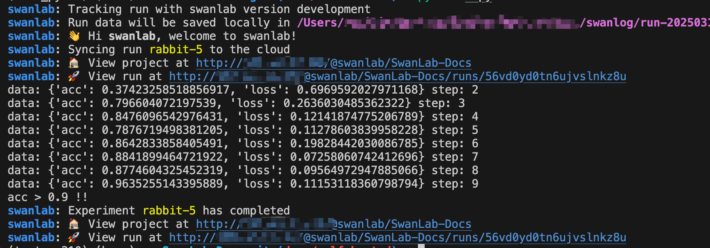

# Crafting Your Custom Plugin

We are thrilled to announce that starting from `swanlab>=0.5.0`, we have officially entered the era of plugins!

Plugins have been a topic of discussion since the inception of SwanLab. They not only enhance the functionality and openness of SwanLab but also offer a fresh perspective on what SwanLab can be —

SwanLab is not just a training tracking tool and experiment management platform; it can also serve as the **data core** during the training process (much like the Chrome core). The functions `swanlab.init` and `swanlab.log` take on new meanings.

---

We have defined three types of plugin modes for SwanLab:

- **`Python Library Plugin`**: Callback classes within the SwanLab Python library. Plugins are implemented by injecting code into SwanLab's lifecycle stages (e.g., `on_init`, `on_run`, `on_stop`, etc.).
- **`Open API Plugin`**: Plugins that leverage SwanLab's open APIs, combining API calls to achieve desired functionality.
- **`GUI Plugin`**: Plugins that utilize SwanLab's open frontend APIs to customize charts, tables, and other components.

::: warning 👋 Current Support
Currently, we support the `Python Library Plugin` type. Below, we will focus on how to create your own `Python Library Plugin`.
:::

## Understanding the SwanKitCallback Class

> Repository: [swanlab-toolkit](https://github.com/swanhubx/swanlab-toolkit)

The `SwanKitCallback` class is SwanLab's callback class. All plugins must inherit from this class.

```python
from swanlab.toolkit.callback import SwanKitCallback
```

The `SwanKitCallback` class defines all of SwanLab's lifecycle stages. You only need to override the lifecycle stages that interest you:

Common lifecycle stages include:

- `on_init`: Initialization stage, called when `swanlab.init` is executed.
- `before_init_experiment`: Called before initializing `SwanLabRun`.
- `on_run`: Called when `SwanLabRun` is fully initialized.
- `on_log`: Called every time `swanlab.log` is executed.
- `on_stop`: Stop stage, called when SwanLab stops.

For more lifecycle stages, refer to: [SwanKitCallback](https://github.com/SwanHubX/SwanLab/blob/main/swanlab/toolkit/callback.py)

## Implementing a Simple Plugin

Let's walk through an example to demonstrate how to implement a plugin.

```python
class MyPlugin(SwanKitCallback):
    def on_init(self, proj_name: str, workspace: str, logdir: str = None, *args, **kwargs):
        print(f"Plugin Initialized: {proj_name} {workspace} {logdir}")

    def on_stop(self, error: str = None, *args, **kwargs):
        print(f"Plugin Stopped: {error}")

    def __str__(self):
        return "MyPlugin"
```

This plugin is quite simple: it prints a message when `swanlab.init()` is called and another message when the process stops or `swanlab.finish()` is called.

Using this plugin in SwanLab is straightforward. Just pass an instance of the plugin to the `callbacks` parameter in `swanlab.init()`.

```python {14,16}
from swanlab.toolkit.callback import SwanKitCallback
import swanlab

class MyPlugin(SwanKitCallback):
    def on_init(self, proj_name: str, workspace: str, logdir: str = None, *args, **kwargs):
        print(f"Plugin Initialized: {proj_name} {workspace} {logdir}")

    def on_stop(self, error: str = None, *args, **kwargs):
        print(f"Plugin Stopped: {error}")

    def __str__(self):
        return "MyPlugin"

my_plugin = MyPlugin()

swanlab.init(callbacks=[my_plugin])
```

Executing the above code will display the following in the console:



## Example: Metric Printing and Alerting

Let's implement a plugin that prints metrics and sends an alert when the `acc` metric exceeds 0.9.

### 1. Defining the Plugin

> The `SwanKitCallback` class defines the `on_log` method, which is called every time `swanlab.log` is executed.

```python
class ThresholdPlugin(SwanKitCallback):
    def __init__(self, key: str, threshold: float = 0.9):
        self.key = key
        self.threshold = threshold

    def on_log(self, data: dict, step: Optional[int] = None, *args, **kwargs):
        print(f"data: {data} step: {step}")
        if data[self.key] > self.threshold:
            print(f"{self.key} > {self.threshold} !!")
```

### 2. Using the Plugin

```python
from swanlab.toolkit.callback import SwanKitCallback
from typing import Optional
import swanlab
import random

class ThresholdPlugin(SwanKitCallback):
    def __init__(self, key: str, threshold: float = 0.9):
        self.key = key
        self.threshold = threshold

    def on_log(self, data: dict, step: Optional[int] = None, *args, **kwargs):
        print(f"data: {data} step: {step}")
        if data[self.key] > self.threshold:
            print(f"{self.key} > {self.threshold} !!")

    def __str__(self):
        return "ThresholdPlugin"

threshold_plugin = ThresholdPlugin(key="acc", threshold=0.9)
swanlab.init(callbacks=[threshold_plugin])

# Simulating a training session
epochs = 10
offset = random.random() / 5
for epoch in range(2, epochs):
  acc = 1 - 2 ** -epoch - random.random() / epoch - offset
  loss = 2 ** -epoch + random.random() / epoch + offset

  # Logging training metrics
  swanlab.log({"acc": acc, "loss": loss}, step=epoch)
```

Executing the above code will display the following in the console:



## Learn More About Plugins

- [EmailCallback](/en/plugin/notification-email.md): Sends an email when training completes or an error occurs.
- [LarkCallback](/en/plugin/notification-lark.md): Sends a message to Lark when training completes or an error occurs.