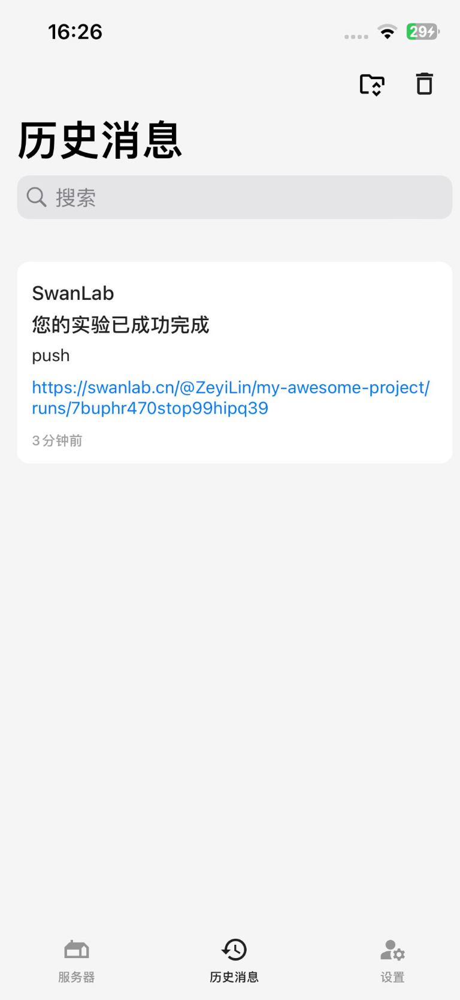

# Bark

[Bark](https://github.com/Finb/Bark) is a free, open-source message push service application designed specifically for iOS devices. Its core functionality is simple and pure: it allows you to send custom push notifications to your iPhone from any device or platform.

You can think of it as a "privately customized" push service, similar to IFTTT or Telegram Bot, but lighter, more focused on the notifications themselves, and with your data entirely under your control.

If you want to be notified via a Bark message as soon as training is complete or an error occurs, it is highly recommended that you use the Bark notification plugin.

:::warning Improving the Plugin
SwanLab plugins are open source. You can view the [Github source code](https://github.com/swanhubx/swanlab/blob/main/swanlab/plugin/notification.py). We welcome your suggestions and PRs!
:::

[[toc]]

## Prerequisites

1.  Open the Bark App.
2.  On the "Server" page, copy the URL (the URL format is `https://api.day.app/XXXXXXX`) and note it down.
3.  On the "Settings" page, copy the Device Token and note it down.

## Basic Usage

Using the Bark notification plugin is very simple. You just need to initialize a `BarkCallback` object and fill in the URL and Device Token from the prerequisites:

```python
from swanlab.plugin.notification import BarkCallback

bark_callback = BarkCallback(
    key='Your Device Token',
    url='Your URL',
)
```

Then, pass the `bark_callback` object into the `callbacks` parameter of `swanlab.init`:

```python
swanlab.init(callbacks=[bark_callback])
```

This way, when training finishes or an error occurs (triggering `swanlab.finish()`), you will receive a Bark message notification.



## Custom Alerts

You can also use the `send_msg` method of the `BarkCallback` object to send custom Bark messages.

This is useful for alerting you when certain metrics reach a specific threshold!

```python
if accuracy > 0.95:
    # Send a message in a custom scenario
    bark_callback.send_msg(
        content=f"Current Accuracy: {accuracy}",  # Notification content
    )
```

## Externally Registering a Plugin

<!--@include: ./shared-snippet.md-->

## Limitations

-   The training completion/exception notification for the Bark notification plugin uses the `on_stop` lifecycle callback of `SwanKitCallback`. Therefore, if your process is abruptly `kill`ed, or the training machine shuts down unexpectedly, the `on_stop` callback will not be triggered, resulting in the Bark notification not being sent.