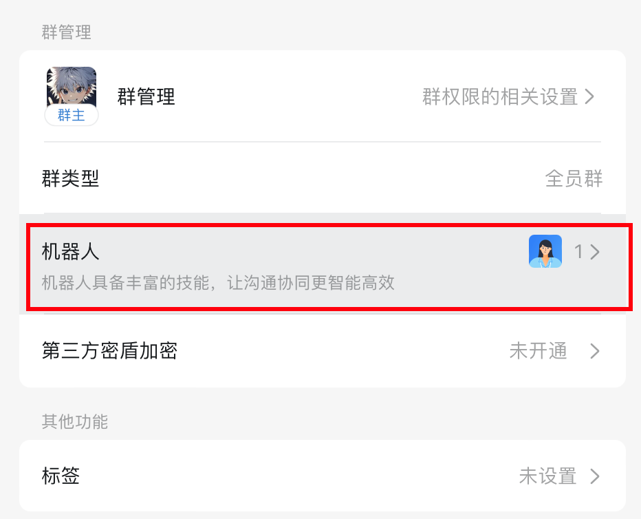
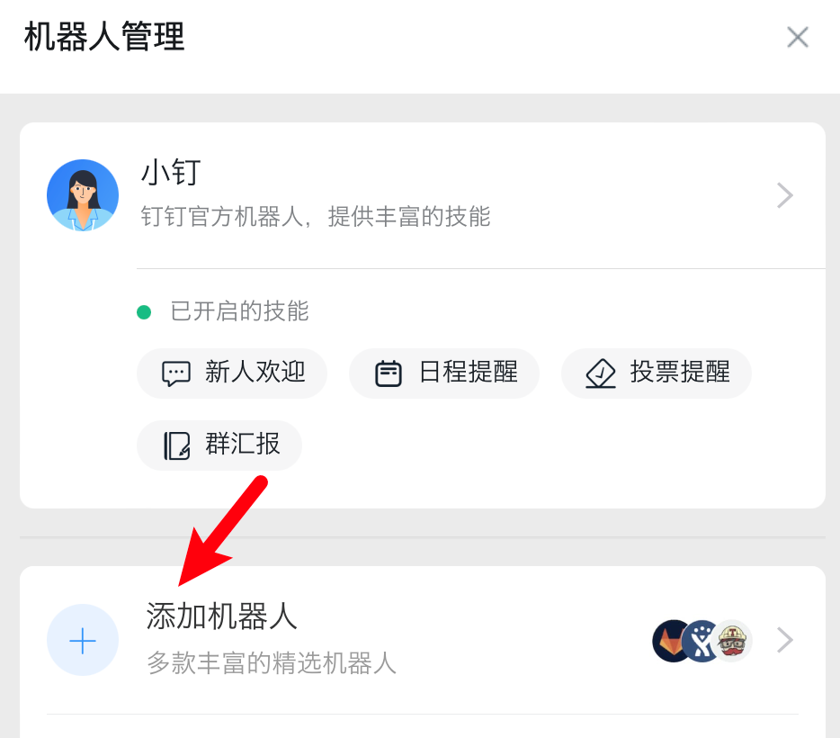
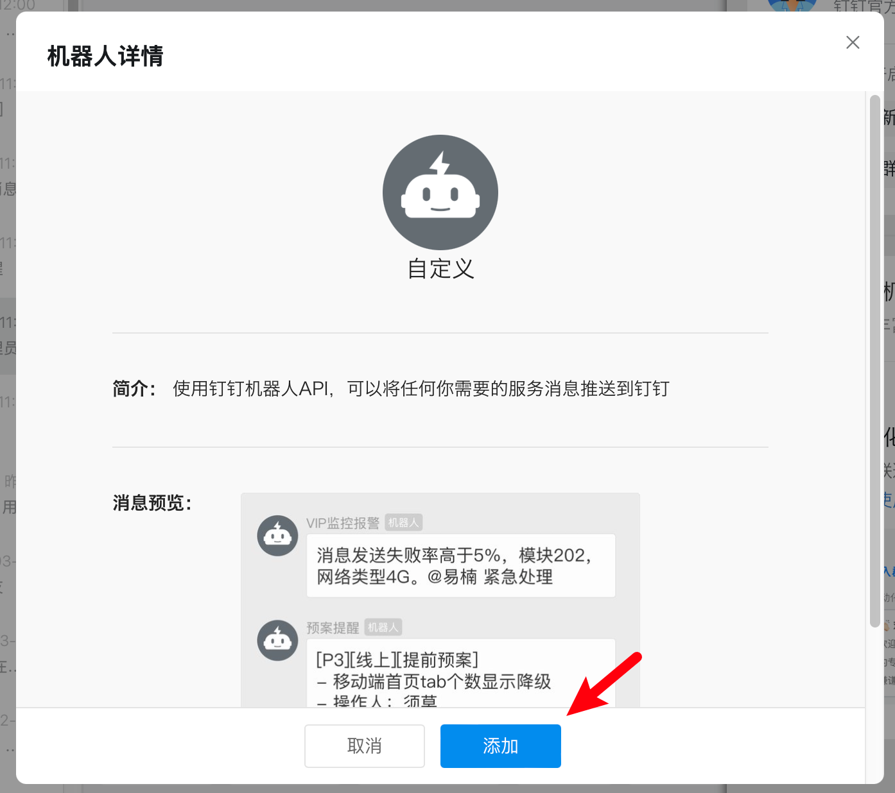
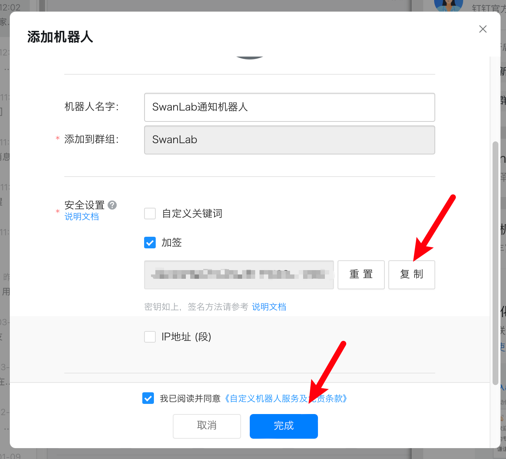
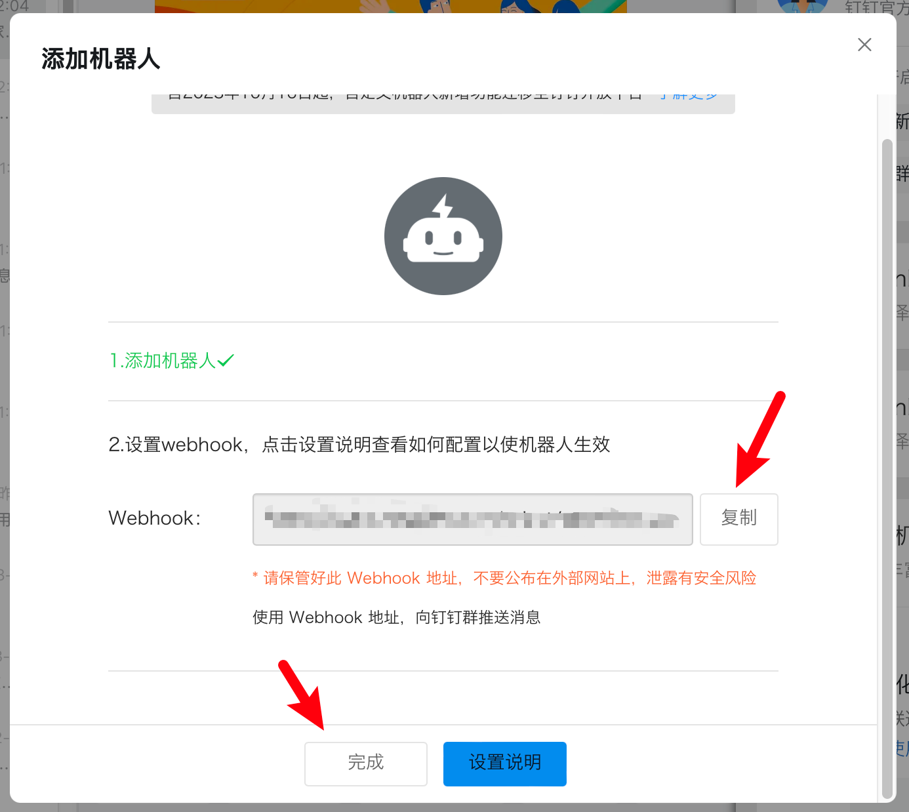
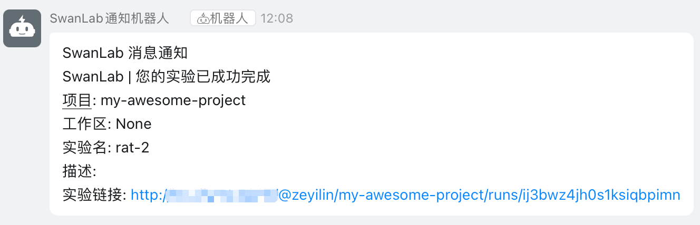

# DingTalk


If you wish to receive immediate notifications via [DingTalk](https://www.dingtalk.com/) when training completes or an error occurs, the DingTalk notification plugin is highly recommended.

:::warning Plugin Improvement
SwanLab plugins are open-source. You can view the [Github source code](https://github.com/swanhubx/swanlab/blob/main/swanlab/plugin/notification.py). Your suggestions and PRs are welcome!
:::

[[toc]]

## Preparation

1. In a DingTalk group (enterprise group), click the **"Settings"** button in the top right corner.


2. Scroll down and find **"Robots"**.



3. Click **"Add Robot"**.



4. Add a **"Custom Robot"**.




Check "Sign" and copy the token externally.



Copy the webhook and complete the robot creation:



At this point, your preparation is complete.

## Basic Usage

Using the DingTalk notification plugin is straightforward. Simply initialize a `DingTalkCallback` object:

```python
from swanlab.plugin.notification import DingTalkCallback

dingtalk_callback = DingTalkCallback(
    webhook_url="https://oapi.dingtalk.com/robot/xxxx", 
    secrets="xxxx",
)
```

Then pass the `dingtalk_callback` object into the `callbacks` parameter of `swanlab.init`:

```python
swanlab.init(callbacks=[dingtalk_callback])
```

This way, when training completes or an error occurs (triggering `swanlab.finish()`), you will receive a DingTalk notification.



## Custom Notifications

You can also use the `send_msg` method of the `DingTalkCallback` object to send custom DingTalk messages.

This is particularly useful for notifying you when certain metrics reach a specific threshold!

```python 
if accuracy > 0.95:
    # Custom scenario to send a message
    dingtalk_callback.send_msg(
        content=f"Current Accuracy: {accuracy}",  # Notification content
    )
```

## Limitations

• The training completion/error notifications of the DingTalk notification plugin use the `on_stop` lifecycle callback of `SwanKitCallback`. Therefore, if your process is abruptly `killed` or the training machine shuts down unexpectedly, the `on_stop` callback will not be triggered, resulting in no DingTalk notification being sent.

• A more robust solution is anticipated with the release of `SwanLab`'s `Platform Open API`.