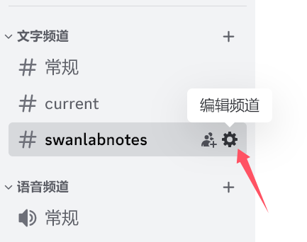
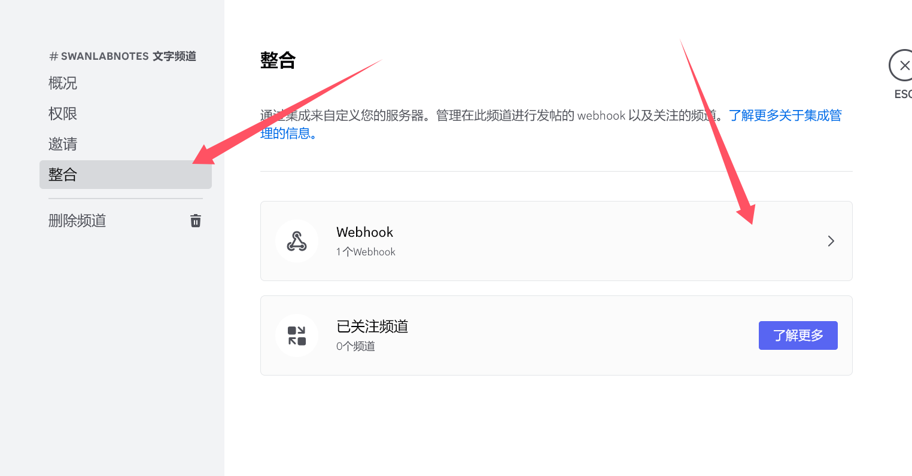
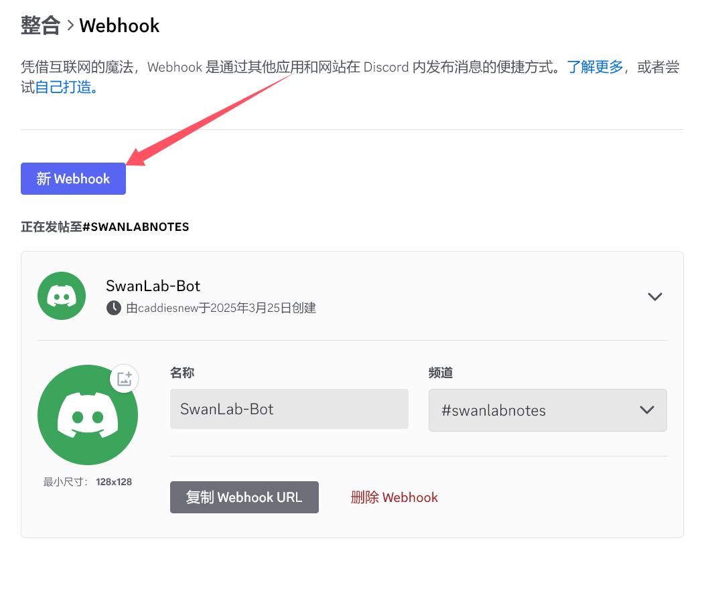
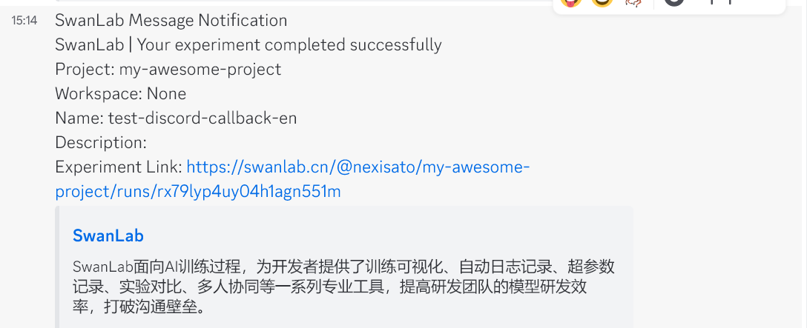

# Discord


If you wish to receive immediate [Discord](https://discord.com/) notifications upon training completion or errors, the Lark Notification plugin is highly recommended.

:::warning Improve the Plugin
SwanLab plugins are open-source. You can view the [Github source code](https://github.com/swanhubx/swanlab/blob/main/swanlab/plugin/notification.py). Suggestions and PRs are welcome!
:::

[[toc]]

## Preparation

::: info Reference
- [Discord-Intro-to-Webhooks](https://support.discord.com/hc/en-us/articles/228383668-Intro-to-Webhooks)
:::


1. Select the Discord channel on which you want to receive notifications of SwanLab events


2. Click the **「Edit Channel」** button corresponding to **「⚙️」** icon



3. Select  **「Inegrations」 -> 「Webhhook」** in the expanded menu list




4. Click  **「New Webhook」** card will automatically create a new webhook bot



5. Click **「Copy Webhook URL」**  button to obtain your webhook url


## Basic Usage

Using the Discord notification plugin is straightforward. Simply initialize a `DiscordCallback` object:

```python
from swanlab.plugin.notification import DiscordCallback

discord_callback = DiscordCallback(
    webhook_url='https://discord.com/api/webhooks/xxxxx/xxx', 
    language='zh'
)
```

Then pass the `discord_callback` object into the `callbacks` list parameter of `swanlab.init`:


```python
swanlab.init(callbacks=[discord_callback])
```

This way, when training completes or an error occurs (triggering `swanlab.finish()`), you will receive a Discord notification.





## Custom Notifications

You can also use the `send_msg` method of the `DiscordCallback` object to send custom Discord messages.

This is particularly useful for notifying you when certain metrics reach specific thresholds!


```python 
if accuracy > 0.95:
    # custom messages
    discord_callback.send_msg(
        content=f"Current Accuracy: {accuracy}",  
    )
```


## Limitations

• The training completion/error notification of the Discord notification plugin relies on the `on_stop` lifecycle callback of `SwanKitCallback`. Therefore, if your process is abruptly `killed` or the training machine shuts down unexpectedly, the `on_stop` callback will not be triggered, and no Discord notification will be sent.

• A more robust solution will be available with the launch of `SwanLab`'s `Platform Open API`. Stay tuned!