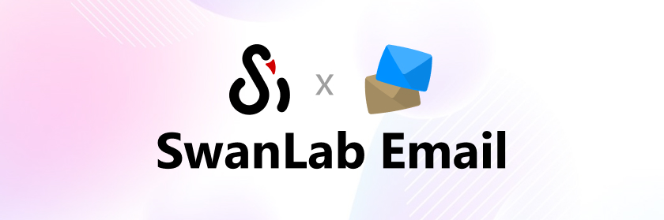
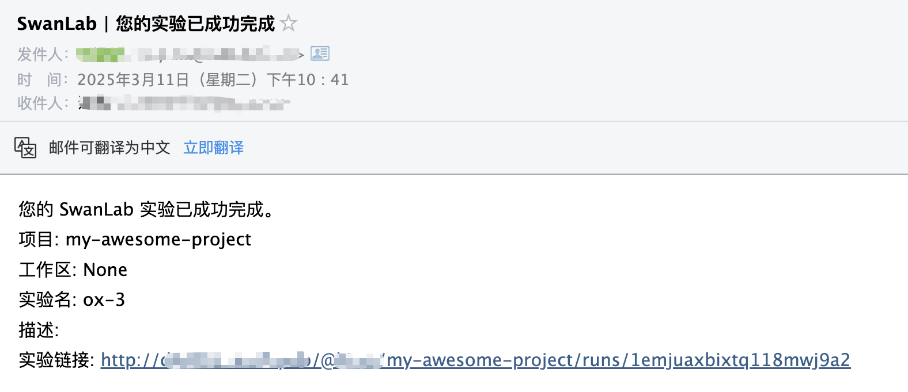

# Email Notification



If you wish to receive immediate email notifications upon training completion or errors, the `Email Notification` plugin is highly recommended.

:::warning Improve the Plugin
SwanLab plugins are open-source. You can view the [Github source code](https://github.com/swanhubx/swanlab/blob/main/swanlab/plugin/notification.py). Suggestions and PRs are welcome!
:::

[[toc]]

## Preparation

Before using the plugin, you need to enable **SMTP service** for your email. Taking QQ Mail as an example:

**Step 1: Access Email Settings**
- Go to the QQ Mail webpage, click the "Settings" at the top.
- In the settings menu, select the "Account" option.

**Step 2: Enable SMTP Service**
- Locate **"POP3/IMAP/SMTP/Exchange/CardDAV/CalDAV Service"**.
- Next to "Service Status," click **"Enable Service"**.
- After completing some identity verification steps, **enable the SMTP service**.
- (Important) Save the **authorization code** provided to you.

**Step 3: Record the Following Information**
- **SMTP Server Address**: smtp.qq.com
- **Port**: 465 (SSL encryption) or 587 (TLS encryption)
- **Sender Email**: Your full QQ email address (e.g., 123456789@qq.com)
- **Password**: Use the **authorization code** you just obtained, not your QQ Mail login password.

Other email services generally support SMTP and can follow similar steps to enable the service.

## Basic Usage

Using the email notification plugin is straightforward. Simply initialize an `EmailCallback` object:

```python
from swanlab.plugin.notification import EmailCallback

# Initialize the email notification plugin
email_callback = EmailCallback(
    sender_email="<Sender email, the one with SMTP service enabled>",
    receiver_email="<Receiver email, the one you want to receive notifications>",
    password="<Your authorization code>",
    smtp_server="<Your email server>",
    port=587,
    language="en",
)
```

Then pass the `email_callback` object into the `callbacks` parameter of `swanlab.init`:

```python
swanlab.init(callbacks=[email_callback])
```

This way, when training completes or an error occurs (triggering `swanlab.finish()`), you will receive an email notification.



## Custom Notifications

You can also use the `send_email` method of the `EmailCallback` object to send custom emails.

This is particularly useful for notifying you when certain metrics reach specific thresholds!

```python
if accuracy > 0.95:
    # Send a custom email
    swan_email.send_email(
        subject="SwanLab | Accuracy > 0.95",  # Email subject
        content=f"Current Accuracy: {accuracy}",  # Email content
    )
```

## Limitations

• The training completion/error notification of the email notification plugin relies on the `on_stop` lifecycle callback of `SwanKitCallback`. Therefore, if your process is abruptly `killed` or the training machine shuts down unexpectedly, the `on_stop` callback will not be triggered, and no email notification will be sent.

• A more robust solution will be available with the launch of `SwanLab`'s `Platform Open API`. Stay tuned!