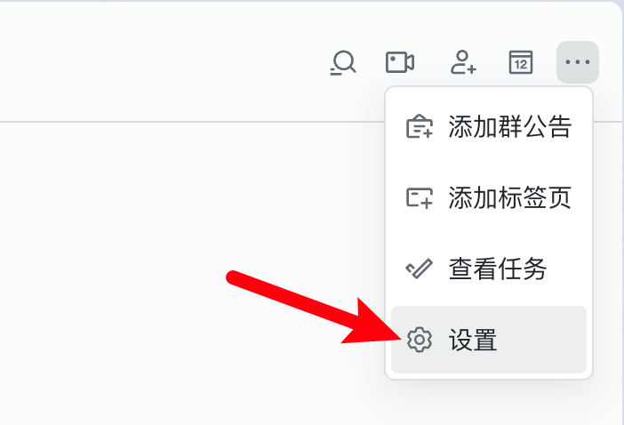
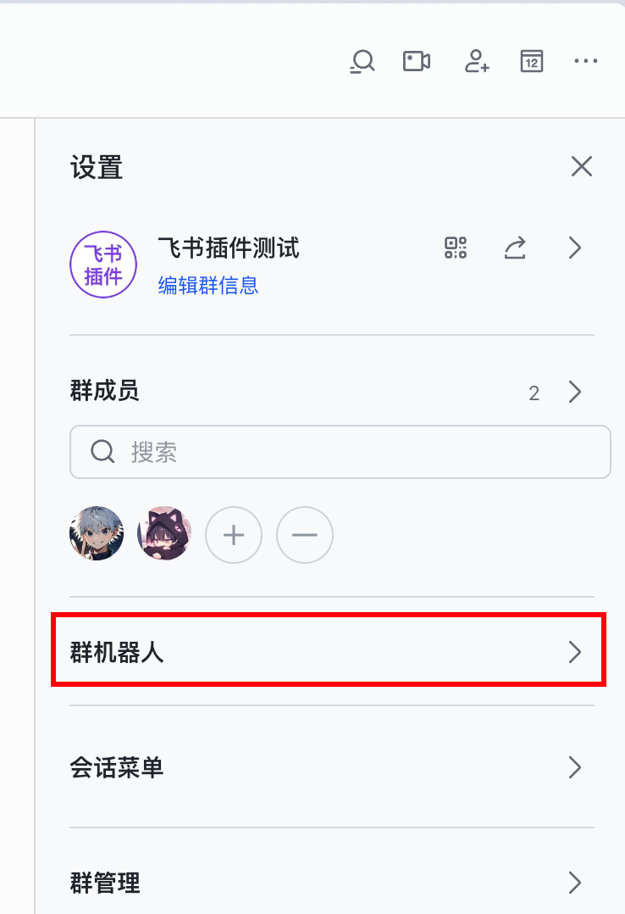
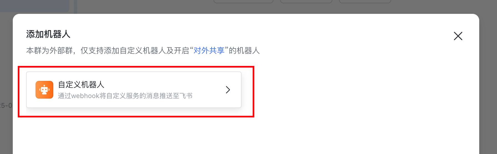
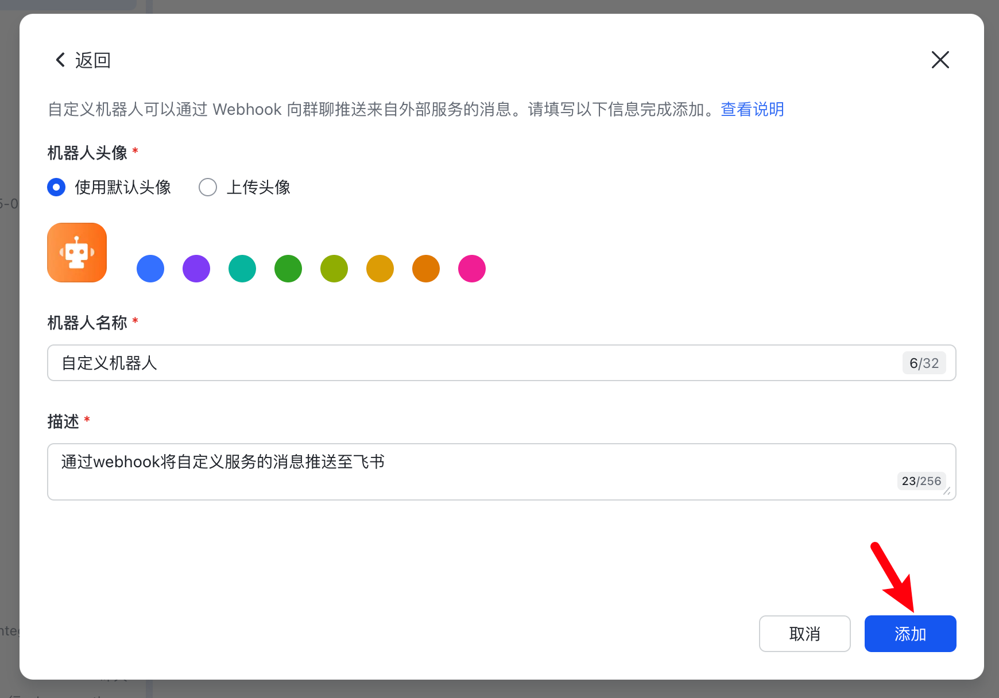
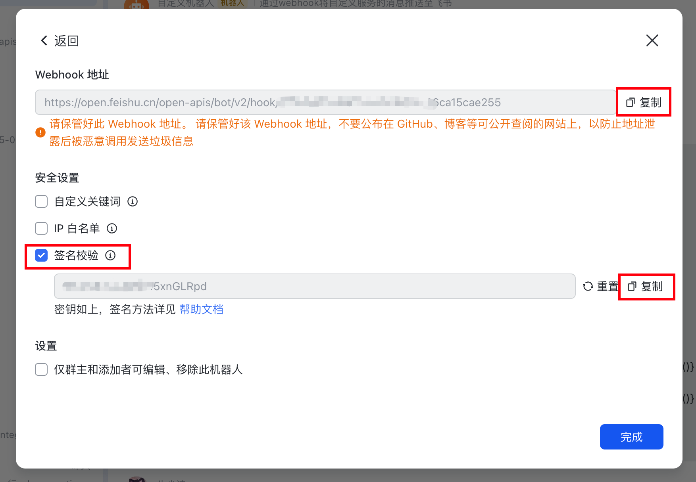
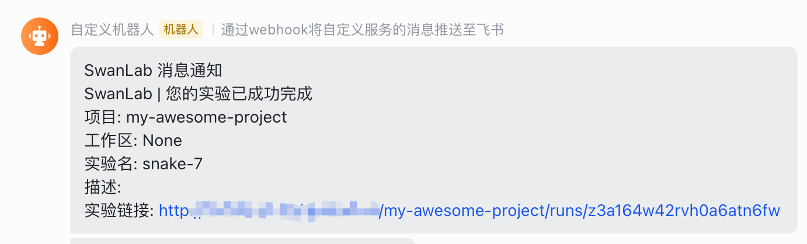

# Lark Notification


If you wish to receive immediate Lark notifications upon training completion or errors, the Lark Notification plugin is highly recommended.

:::warning Improve the Plugin
SwanLab plugins are open-source. You can view the [Github source code](https://github.com/swanhubx/swanlab/blob/main/swanlab/plugin/notification.py). Suggestions and PRs are welcome!
:::

[[toc]]

## Preparation

::: info Reference Documentation
• [Custom Bot API Guide](https://open.feishu.cn/document/client-docs/bot-v3/add-custom-bot?lang=zh-CN#f62e72d5)
• [Using Bots in Lark Groups](https://www.feishu.cn/hc/zh-CN/articles/360024984973-%E5%9C%A8%E7%BE%A4%E7%BB%84%E4%B8%AD%E4%BD%BF%E7%94%A8%E6%9C%BA%E5%99%A8%E4%BA%BA)
:::

1. In a Lark group, click the **"···" - "Settings"** in the top-right corner.



2. Click **"Group Bots"**.



3. Click **"Add Bot"**.


4. Add a **"Custom Bot"**.





5. Copy the **"Webhook URL"** and **"Signature"**.



At this point, your preparation is complete.

## Basic Usage

Using the Lark notification plugin is straightforward. Simply initialize a `LarkCallback` object:

```python
from swanlab.plugin.notification import LarkCallback

lark_callback = LarkCallback(
    webhook_url="https://open.larkoffice.com/open-apis/bot/v2/hook/xxxx", 
    secrets="xxxx",
)
```

Then pass the `lark_callback` object into the `callbacks` parameter of `swanlab.init`:

```python
swanlab.init(callbacks=[lark_callback])
```

This way, when training completes or an error occurs (triggering `swanlab.finish()`), you will receive a Lark notification.



## Custom Notifications

You can also use the `send_msg` method of the `LarkCallback` object to send custom Lark messages.

This is particularly useful for notifying you when certain metrics reach specific thresholds!

```python
if accuracy > 0.95:
    # Send a custom notification
    lark_callback.send_msg(
        content=f"Current Accuracy: {accuracy}",  # Notification content
    )
```

## Register plugins externally

<!--@include: ./shared-snippet.md-->

## Limitations

• The training completion/error notification of the Lark notification plugin relies on the `on_stop` lifecycle callback of `SwanKitCallback`. Therefore, if your process is abruptly `killed` or the training machine shuts down unexpectedly, the `on_stop` callback will not be triggered, and no Lark notification will be sent.

• A more robust solution will be available with the launch of `SwanLab`'s `Platform Open API`. Stay tuned!