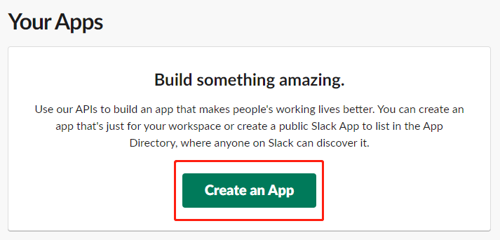
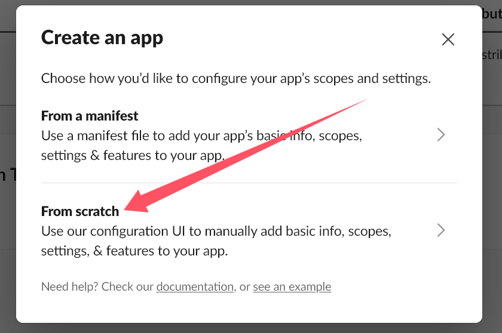
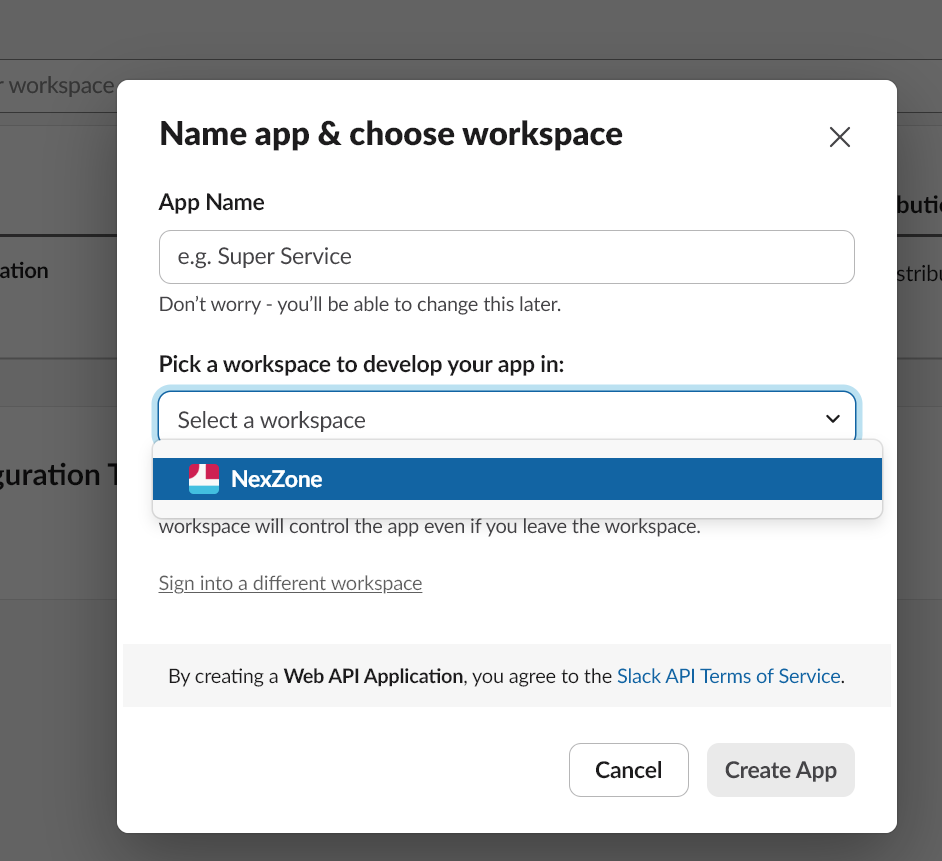
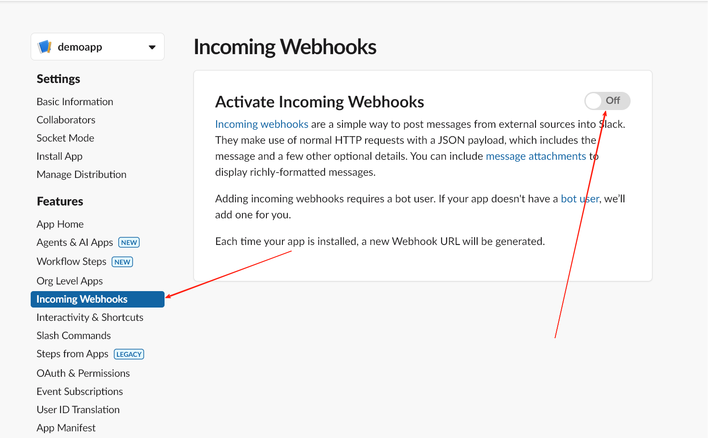
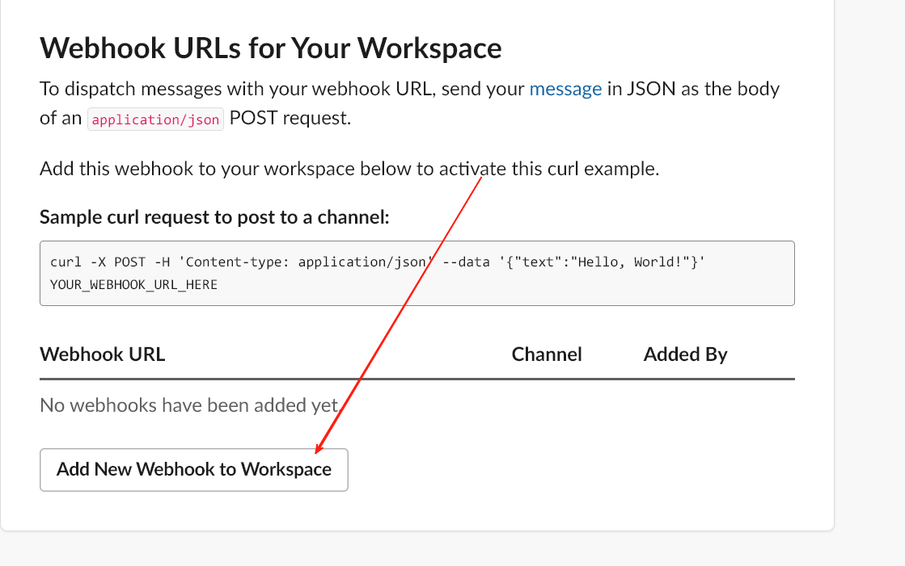
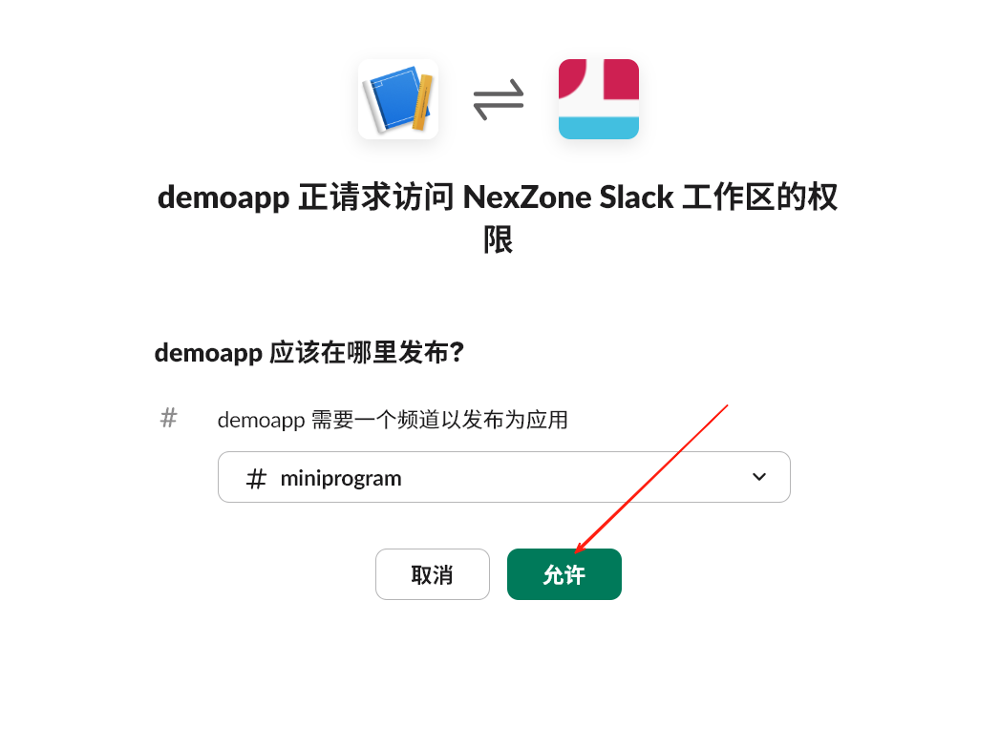
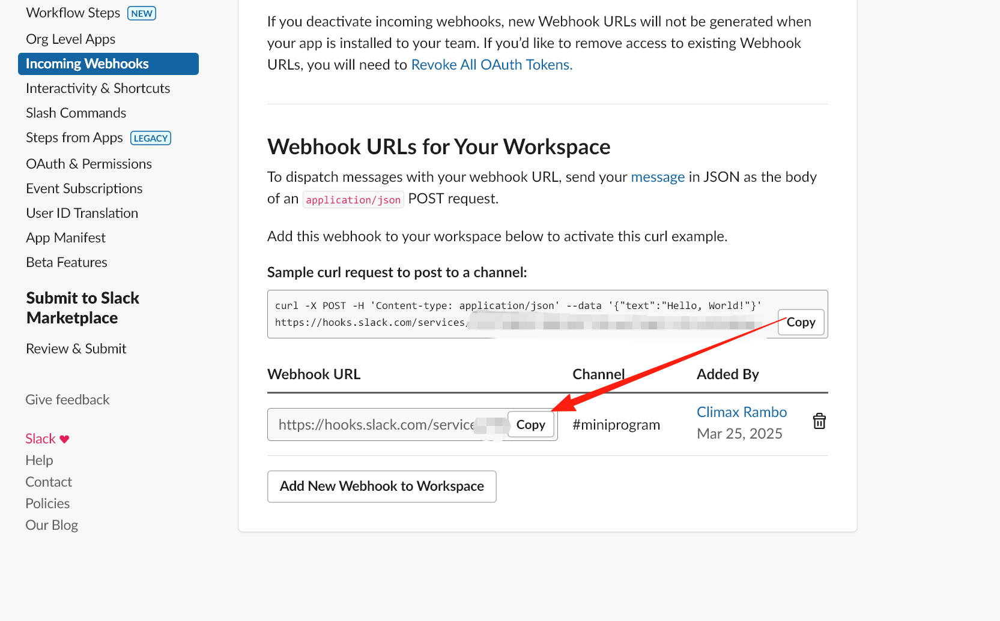
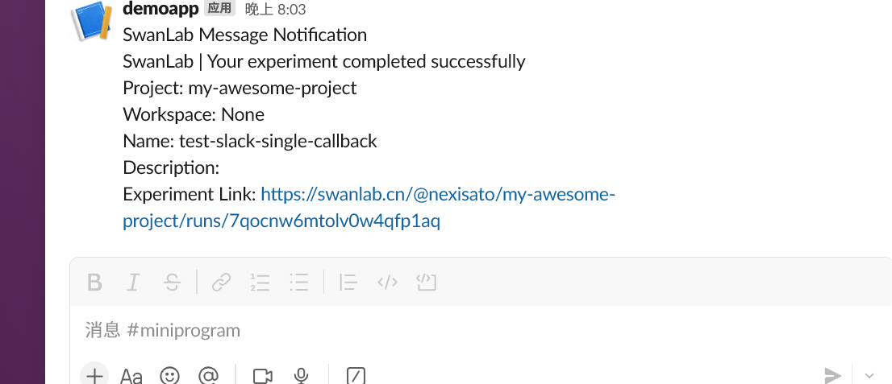

# Slack


If you wish to receive immediate [Slack](https://slack.com) notifications upon training completion or errors, the Slack Notification plugin is highly recommended.

:::warning Improve the Plugin
SwanLab plugins are open-source. You can view the [Github source code](https://github.com/swanhubx/swanlab/blob/main/swanlab/plugin/notification.py). Suggestions and PRs are welcome!
:::
[[toc]]

## 准备工作

::: info References
- [Slack-Sending messages using incoming webhooks](https://api.slack.com/messaging/webhooks)
- [TencentCloudDocs-Slack channel receive messages](https://cloud.tencent.com/document/product/1263/74219)
:::


1. Turn into the page of [Slack-API](https://api.slack.com/apps)，click **「Create an App」**




2. Click **「From scratch」** in the pop up window



3. Input **「App Name」** ，and select the workspace you want to send notification，then click **「Create App」**



4. Once into the App configuration menu，click **「Incoming Webhooks」**，and turn on the button **「Activate Incoming Webhooks」** ；



5. At the bottom of the page，click **「Add New Webhook to Workspace」** to add the APP into your workspace；




6. In the redirect page，select a channel the app needs to send notification，click **「Accept」**



7.Back to the APP configuration page，copy the Webhook URL of your app




## Basic Usage

Using the Discord notification plugin is straightforward. Simply initialize a `SlackCallback` object：

```python
from swanlab.plugin.notification import SlackCallback

slack_callback = SlackCallback(
    webhook_url='https://hooks.slack.com/services/xxxx/xxxx/xxxx', 
    language='zh'
)
```

Then pass the `slack_callback` object into the `callbacks` list parameter of `swanlab.init`:

```python
swanlab.init(callbacks=[slack_callback])
```

This way, when training completes or an error occurs (triggering `swanlab.finish()`), you will receive a Slack notification.




## Custom Notifications

You can also use the `send_msg` method of the `SlackCallback` object to send custom Slack messages.

This is particularly useful for notifying you when certain metrics reach specific thresholds!

```python 
if accuracy > 0.95:
    # custom messages
    slack_callback.send_msg(
        content=f"Current Accuracy: {accuracy}",  
    )
```


## Limitations

• The training completion/error notification of the Slack notification plugin relies on the `on_stop` lifecycle callback of `SwanKitCallback`. Therefore, if your process is abruptly `killed` or the training machine shuts down unexpectedly, the `on_stop` callback will not be triggered, and no Slack notification will be sent.

• A more robust solution will be available with the launch of `SwanLab`'s `Platform Open API`. Stay tuned!