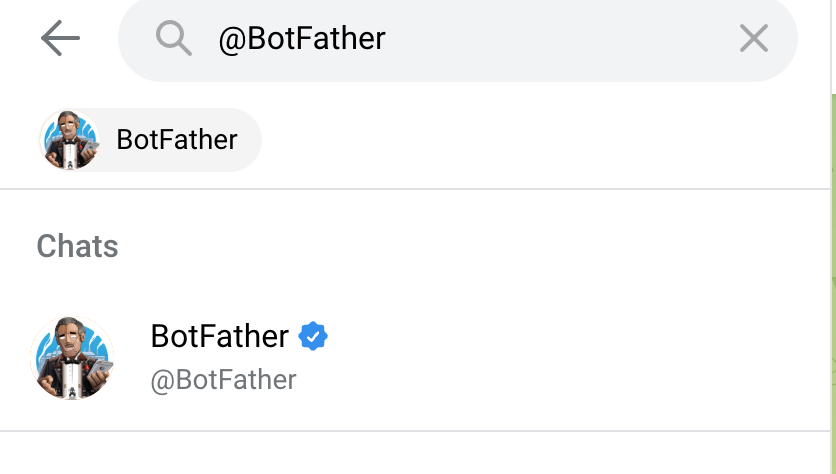
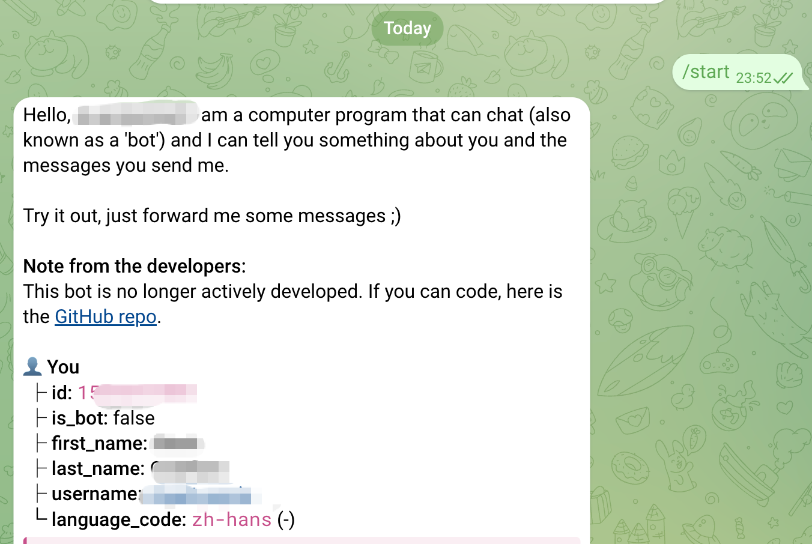
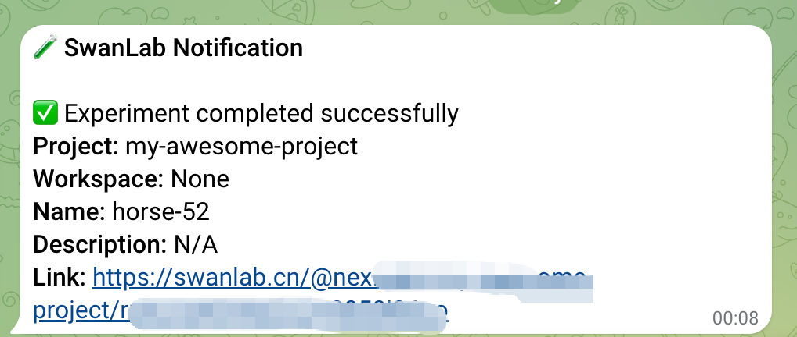

# Telegram

If you wish to receive immediate [Telegram](https://web.telegram.org) notifications upon training completion or errors, the Telegram Notification plugin is highly recommended.

:::warning Improve the Plugin
SwanLab plugins are open-source. You can view the [Github source code](https://github.com/swanhubx/swanlab/blob/main/swanlab/plugin/notification.py). Suggestions and PRs are welcome!
:::
[[toc]]

## Preparation

::: info References
- [Telegram-Bots: An introduction for developers](https://core.telegram.org/bots)
:::


1. In the Telegram search bar, enter `@BotFather`


2. In the chat window,  send the command `/newbot`. Follow the prompts to input the `name` and `username` respectively. Notes:
- The `name` is used to display the bot’s name in the message window.
- The `username` is for redirecting to Telegram channels, must end with `bot`, and cannot be duplicated with other bots.

You will receive a message as shown below. Copy and save the `token`.


3. In the Telegram search bar, enter `@getidsbot`. Send the command `/start` in the chat window to obtain the `chat_id`. The `chat_id` is the unique identifier of the user.



## Basic Usage

Using the Telegram notification plugin is straightforward. Simply initialize a `TelegramCallback` instance：

```python
from swanlab.plugin.notification import TelegramCallback

telegram_callback = TelegramCallback(
    bot_token="<YOUR_TELEGRAM_BOT_TOKEN>",
    chat_id="<YOUR_TELEGRAM_CHAT_ID>",
    language="en"
)
```

Then pass the `telegram_callback` object into the `callbacks` list parameter of `swanlab.init`:

```python
swanlab.init(callbacks=[telegram_callback])
```

In this way, you will receive a Telegram notification when training completes or an error occurs (triggering `swanlab.finish()`).




## Custom Notifications

You can also use the `send_msg` method of the `TelegramCallback` object to send custom Telegram messages.

This is particularly useful for notifying you when certain metrics reach specific thresholds!

```python 
if accuracy > 0.95:
    # custom messages
    telegram_callback.send_msg(
        content=f"Current Accuracy: {accuracy}",  
    )
```


## Limitations

• The training completion/error notification of the Telegram notification plugin relies on the `on_stop` lifecycle callback of `SwanKitCallback`. Therefore, if your process is abruptly `killed` or the training machine shuts down unexpectedly, the `on_stop` callback will not be triggered, and no Telegram notification will be sent.

• A more robust solution will be available with the launch of `SwanLab`'s `Platform Open API`. Stay tuned!