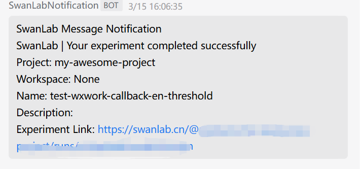

# WXWork Notification


If you wish to receive immediate [WXWork]((https://work.weixin.qq.com/)) notifications upon training completion or errors, the Lark Notification plugin is highly recommended.

:::warning Improve the Plugin
SwanLab plugins are open-source. You can view the [Github source code](https://github.com/swanhubx/swanlab/blob/main/swanlab/plugin/notification.py). Suggestions and PRs are welcome!
:::


[[toc]]

## Preparation

::: info 参考文档
- [WXWork-Group Robot Configuration Instruction](https://developer.work.weixin.qq.com/document/path/91770)
:::


1. In a WXWork group，click the  **「···」-「Add Group Robot」**


2. Click **「Add Bot」** in the poped up card


3. Continue to click  **「New Robot」**


4. Click **「Add Robot」** after naming your robot


5. Just need to copy the **「Webhook Url」** of your WXWork robot


## Basic Usage

Using the WXWork notification plugin is straightforward. Simply initialize a `WXWorkCallback` object:

```python
from swanlab.plugin.notification import WXWorkCallback

wxwork_callback = WXWorkCallback(
    webhook_url="https://qyapi.weixin.qq.com/cgi-bin/webhook/send?key=xxxx",
)
```

Then pass the `wxwork_callback` object into the `callbacks` list parameter of `swanlab.init`:

```python
swanlab.init(callbacks=[wxwork_callback])
```


This way, when training completes or an error occurs (triggering `swanlab.finish()`), you will receive a WXWork notification.





## Custom Notifications

You can also use the `send_msg` method of the `WXWorkCallback` object to send custom WXWork messages.

This is particularly useful for notifying you when certain metrics reach specific thresholds!


```python 
if accuracy > 0.95:
    # 自定义场景发送消息
    wxwork_callback.send_msg(
        content=f"Current Accuracy: {accuracy}",  # 通知内容
    )
```


## Limitations

• The training completion/error notification of the WXWork notification plugin relies on the `on_stop` lifecycle callback of `SwanKitCallback`. Therefore, if your process is abruptly `killed` or the training machine shuts down unexpectedly, the `on_stop` callback will not be triggered, and no WXWork notification will be sent.

• A more robust solution will be available with the launch of `SwanLab`'s `Platform Open API`. Stay tuned!