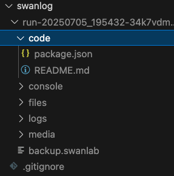

# File Logger

If you want to copy certain files to the log directory (the directory starting with "run") at the beginning of training, we highly recommend using the `LogdirFileWriter` plugin.

:::warning Improve Plugin
All SwanLab plugins are open-source. You can view the source code [here](https://github.com/SwanHubX/SwanLab/blob/main/swanlab/plugin/writer.py#L175) on GitHub. We welcome your suggestions and pull requests!
:::

## Plugin Usage

**1. Initialize LogdirFileWriter:**

```python
from swanlab.plugin.writer import LogdirFileWriter

logdirfile_writer = LogdirFileWriter(
    sub_dir="code",
    files=[
        "config.yaml",
        "README.md",
    ]
)
```

- If `sub_dir` is not `None`, a subdirectory named `sub_dir` will be created under the run directory to store the files.
- The `files` parameter specifies the list of files to be copied (also supports passing a single string).

**2. Pass the plugin to `swanlab.init`:**

```python
swanlab.init(
    ...
    callbacks=[logdirfile_writer]
)
```

After executing the code, the files specified in the `files` parameter will be copied to the corresponding run directory under the `logdir` path (or its subdirectory if `sub_dir` is set).

## Example Code

```python
from swanlab.plugin.writer import LogdirFileWriter
import swanlab

logdirfile_writer = LogdirFileWriter(
    sub_dir="code",
    file_path=["package.json", "README.md"],
)

swanlab.init(project="test-plugin", callbacks=[logdirfile_writer])

swanlab.log({"loss": 0.2, "acc": 0.9})
swanlab.finish()
```



## External Plugin Registration

<!--@include: ./shared-snippet.md-->