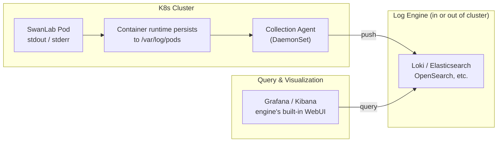

# Logging Guide

> This guide describes how to view logs and integrate logging for SwanLab self-hosted services on Kubernetes.

## 🔍 Quick Log Viewing

For live Pods, use `kubectl logs` to view and export each service Pod's runtime logs:

```bash
# Follow the current Pod's logs in real time (Ctrl+C to exit)
kubectl logs -n <YOUR_NAMESPACE> -f <POD_NAME> -c <CONTAINER_NAME>

# Export the current Pod's logs to a local file
kubectl logs -n <YOUR_NAMESPACE> <POD_NAME> -c <CONTAINER_NAME> > swanlab-<CONTAINER_NAME>.log

# Export logs from the previous crashed container (only available if the container has restarted, e.g. CrashLoopBackOff)
kubectl logs -n <YOUR_NAMESPACE> <POD_NAME> -c <CONTAINER_NAME> --previous > swanlab-<CONTAINER_NAME>-previous.log

# For large log volumes, only take the last 1000 lines / last 1 hour
kubectl logs -n <YOUR_NAMESPACE> <POD_NAME> -c <CONTAINER_NAME> --tail=1000 --since=1h
```

## ☁️ Cloud Logging Services

> 🚧 The configuration guide for cloud logging services (Alibaba Cloud SLS, Tencent Cloud CLS, Huawei Cloud LTS, etc.) is being written. Stay tuned.

## 🌐 Other Platforms

> 🚧 Being written. Stay tuned.

## 🛠️ Self-hosted Logging

For environments where cloud logging services are not available (e.g., offline data centers or data compliance requirements), you can integrate a self-hosted logging platform. Regardless of the log engine you choose, the log flow in K8s is the same:



How the flow works:

1. **Generation**: SwanLab services write logs to container stdout/stderr, and the container runtime persists them as `/var/log/pods/<namespace>_<pod>_<uid>/<container>/*.log` files on the node
2. **Collection**: A collection Agent (Alloy / Fluent Bit / Vector, etc.) runs as a DaemonSet on each node, reads incremental content from the log files, and parses metadata such as namespace, pod, and container into log labels
3. **Writing**: The Agent pushes logs to the log engine (Loki, OpenSearch, Elasticsearch, VictoriaLogs, etc.), which handles storage, indexing, and retention policies (TTL)
4. **Querying**: Use the log engine's visualization UI (Grafana, Kibana, or the engine's built-in WebUI) to search by labels (namespace / pod / level) and keywords

:::warning
A self-hosted solution requires you to prepare the following components. We recommend aligning their selection and deployment with public cloud logging services as much as possible:

- **Log collector**: a collection Agent running as a DaemonSet (e.g., Fluent Bit, Grafana Alloy, Vector)
- **Log engine**: the service responsible for storage, indexing, and querying (e.g., Loki, Elasticsearch, OpenSearch)
- **Persistent storage**: PVCs provisioned by the cluster's CSI storage plugin, or object storage
  :::
