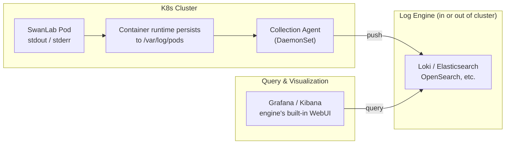

# Logging Guide

> This guide describes how to view logs and integrate logging for SwanLab self-hosted services on Kubernetes.

## 🔍 Quick Log Viewing

For live Pods, use `kubectl logs` to view and export each service Pod's runtime logs:

```bash
# Follow the current Pod's logs in real time (Ctrl+C to exit)
kubectl logs -n <YOUR_NAMESPACE> -f <POD_NAME> -c <CONTAINER_NAME>

# Export the current Pod's logs to a local file
kubectl logs -n <YOUR_NAMESPACE> <POD_NAME> -c <CONTAINER_NAME> > swanlab-<CONTAINER_NAME>.log

# Export logs from the previous crashed container (only available if the container has restarted, e.g. CrashLoopBackOff)
kubectl logs -n <YOUR_NAMESPACE> <POD_NAME> -c <CONTAINER_NAME> --previous > swanlab-<CONTAINER_NAME>-previous.log

# For large log volumes, only take the last 1000 lines / last 1 hour
kubectl logs -n <YOUR_NAMESPACE> <POD_NAME> -c <CONTAINER_NAME> --tail=1000 --since=1h
```

## ☁️ Integrating Cloud Logging Services

For persistent log storage, query, and analysis, we recommend integrating a public cloud logging service (this guide uses <span style="color: red"><strong>Alibaba Cloud SLS</strong></span> as the example; **Tencent Cloud CLS**, **Huawei Cloud LTS**, and similar platforms can be configured in a similar way). All SwanLab services output logs to container stdout/stderr with standard Pod labels (`app.kubernetes.io/service`), so integrating a cloud logging service **requires no changes to any SwanLab configuration**.

:::info
**How collection works**: Alibaba Cloud's collection component **LoongCollector** deploys a collection Agent on every node (_DaemonSet_). Collection rules are declared through the CRD resource `AliyunLogConfig`, which selects target containers by Pod labels, and logs are automatically written to SLS-managed storage. Other cloud vendors offer similar equivalent components (Tencent Cloud LogConfig, Huawei Cloud lts-config, etc.).
:::

### 1. Prerequisites

**Activate SLS**: Go to the [SLS console](https://sls.console.aliyun.com) and follow the prompts to activate the service on first use (pay-as-you-go billing; activation is free).

**Install the collection component (LoongCollector)**: Go to the ACK console → Cluster list → click the target cluster → **Component Management** in the left sidebar → search for `LoongCollector` → click **Install**:

- For Project, choose **Create a new Project**, or select an existing Project
- After installation, the cluster automatically registers the `aliyunlogconfigs` CRD and deploys a collection Agent on every node

:::tip
LoongCollector is the upgraded successor of the original `logtail` component. The two supersede each other and **cannot coexist in the same cluster**. Check which one you have with:

```bash
# Based on the output: logtail-ds is the legacy version, loongcollector-* is the new version
kubectl -n kube-system get ds | grep -iE "loongcollector|logtail"
```

`AliyunLogConfig` is used identically under both components, matching the steps in the rest of this guide. See [Logtail and LoongCollector compatibility notes](https://help.aliyun.com/zh/sls/logtail-and-loongcollector-compatibility)
:::

Confirm the component is ready:

```bash
kubectl -n kube-system get ds,deploy | grep -iE "loongcollector|logtail"
# The collection Agent's DaemonSet should have as many ready replicas as there are nodes, e.g.: ds/loongcollector-ds 4/4 (the DS name may vary slightly between versions)
```

**Check RBAC permissions**: `AliyunLogConfig` is a custom resource and is not covered by the built-in `admin`/`edit` roles. If your current user lacks permission, ask a cluster admin to create a Role in the target namespace (one-time operation):

```bash
kubectl auth can-i create aliyunlogconfigs.log.alibabacloud.com -n <YOUR_NAMESPACE>

# [Note] If this returns `no`, ask a cluster admin to run the following commands to create the log collection role permissions:
kubectl create role swanlab-logconfig-writer -n <YOUR_NAMESPACE> \
  --verb=create,get,list,watch,update,patch,delete \
  --resource=aliyunlogconfigs.log.alibabacloud.com
kubectl create rolebinding swanlab-logconfig-writer -n <YOUR_NAMESPACE> \
  --role=swanlab-logconfig-writer --user=<YOUR_USER>
```

### 2. Create Collection Configurations

All SwanLab business services write logs to container stdout/stderr with the label `app.kubernetes.io/service=<service name>`. Create one collection configuration per service (each service maps to its own Logstore, making it easy to set retention and query per service):

| Service | Description | Log content |
| ------ | ----------------- | ------------------------------------ |
| server | Core business API service | User request handling, business logic, API error stacks |
| house  | Metrics OLAP service | Experiment data writes and sync, background task execution |
| auth   | Authentication service | Login authentication, token validation, permission-related requests |

The three configurations are identical except for `metadata.name`, `logstore`, `configName`, and the label value. Before applying, replace the placeholders in the file (all marked with comments): `<YOUR_NAMESPACE>` is the namespace where SwanLab runs (must match every `K8sNamespaceRegex`); `<PROJECT_NAME>` is an optional target SLS Project — if omitted, logs are written to the cluster's default project `k8s-log-<cluster ID>`.

::: details Collection configuration template (swanlab-log.yaml)

```yaml
# Placeholders:
#   <YOUR_NAMESPACE>: the K8s namespace where SwanLab services run; must match each K8sNamespaceRegex below
#   <PROJECT_NAME>  : optional. Target SLS Project; set this to write to a custom Project
apiVersion: log.alibabacloud.com/v1alpha1
kind: AliyunLogConfig
metadata:
  name: swanlab-server
  namespace: <YOUR_NAMESPACE>
spec:
  project: <PROJECT_NAME> # Uncomment to write logs to a custom Project
  logstore: swanlab-server # Logstore, created automatically if it does not exist
  ttl: 7 # Log retention in days; adjust as needed
  shardCount: 2
  logtailConfig:
    configName: swanlab-server # Must match metadata.name
    inputType: plugin
    inputDetail:
      plugin:
        inputs:
          - type: service_docker_stdout
            detail:
              Stdout: true
              Stderr: true
              K8sNamespaceRegex: ^<YOUR_NAMESPACE>$ # The namespace must be explicitly restricted
              IncludeK8sLabel:
                app.kubernetes.io/service: server # Select the target service by label
---
apiVersion: log.alibabacloud.com/v1alpha1
kind: AliyunLogConfig
metadata:
  name: swanlab-house
  namespace: <YOUR_NAMESPACE>
spec:
  project: <PROJECT_NAME>
  logstore: swanlab-house
  ttl: 7
  shardCount: 2
  logtailConfig:
    configName: swanlab-house
    inputType: plugin
    inputDetail:
      plugin:
        inputs:
          - type: service_docker_stdout
            detail:
              Stdout: true
              Stderr: true
              K8sNamespaceRegex: ^<YOUR_NAMESPACE>$
              IncludeK8sLabel:
                app.kubernetes.io/service: house
---
apiVersion: log.alibabacloud.com/v1alpha1
kind: AliyunLogConfig
metadata:
  name: swanlab-auth
  namespace: <YOUR_NAMESPACE>
spec:
  project: <PROJECT_NAME>
  logstore: swanlab-auth
  ttl: 7
  shardCount: 2
  logtailConfig:
    configName: swanlab-auth
    inputType: plugin
    inputDetail:
      plugin:
        inputs:
          - type: service_docker_stdout
            detail:
              Stdout: true
              Stderr: true
              K8sNamespaceRegex: ^<YOUR_NAMESPACE>$
              IncludeK8sLabel:
                app.kubernetes.io/service: auth
```

:::

Apply and verify:

```bash
kubectl apply -f swanlab-log.yaml

# Check status; expected output is success
kubectl get aliyunlogconfig -n <YOUR_NAMESPACE>
```

Note: **`K8sNamespaceRegex` must be explicitly set** — leaving it out will mix in logs from services with the same labels in other namespaces

### 3. Verify

Wait about 1 minute, then open the corresponding project in the [SLS console](https://sls.console.aliyun.com) and verify that a `Logstore` has been created for each service.


:::tip
**Billing**: SLS bills separately for write volume, storage, indexing, and queries; the `ttl` retention period is the main cost-control lever. Deleting the CR only removes the collection configuration — Logstores and historical logs must be cleaned up manually in the SLS console.
:::

## 🌐 Other Platforms

The self-hosted service is not tied to any specific logging platform. It follows the standard **platform-managed collection Agent + declarative label-based selection + cloud logging service query** pattern:

| Platform | Collection Agent | Configuration | Log backend |
| ---------- | ---------------------------------------- | ------------------------------- | ------------------------ |
| Alibaba Cloud ACK | loongcollector (formerly logtail; mutually exclusive, pick one) | AliyunLogConfig CRD | SLS logging service |
| Tencent Cloud TKE | cls-agent | LogConfig CRD | CLS logging service |
| Huawei Cloud CCE | ICAgent | CCE console / LTS-side configuration | LTS logging service |
| Self-built cluster | Fluent Bit, Grafana Alloy, Vector | DaemonSet + ConfigMap (no CRD) | Loki, OpenSearch, ELK, etc. |

The integration steps are the same on every platform: **install the collection Agent → declare collection rules (CRD or config file) → select target containers by label → logs are written to the backend service**. Taking Tencent Cloud TKE as an example: after installing the cls-agent component, create a `LogConfig` CR that selects SwanLab services by the `app.kubernetes.io/service` label, and you can query logs in the CLS console — the workflow is exactly analogous to the Alibaba Cloud section above.

## 🛠️ Self-hosted Logging

For environments where cloud logging services are not available (e.g., offline data centers or data compliance requirements), you can integrate a self-hosted logging platform. Regardless of the log engine you choose, the log flow in K8s is the same:



How the flow works:

1. **Generation**: SwanLab services write logs to container stdout/stderr, and the container runtime persists them as `/var/log/pods/<YOUR_NAMESPACE>_<pod>_<uid>/<container>/*.log` files on the node
2. **Collection**: A collection Agent (Alloy / Fluent Bit / Vector, etc.) runs as a DaemonSet on each node, reads incremental content from the log files, and parses metadata such as namespace, pod, and container into log labels
3. **Writing**: The Agent pushes logs to the log engine (Loki, OpenSearch, Elasticsearch, VictoriaLogs, etc.), which handles storage, indexing, and retention policies (TTL)
4. **Querying**: Use the log engine's visualization UI (Grafana, Kibana, or the engine's built-in WebUI) to search by labels (namespace / pod / level) and keywords

:::warning
A self-hosted solution requires you to prepare the following components. We recommend aligning their selection and deployment with public cloud logging services as much as possible:

- **Log collector**: a collection Agent running as a DaemonSet (e.g., Fluent Bit, Grafana Alloy, Vector)
- **Log engine**: the service responsible for storage, indexing, and querying (e.g., Loki, Elasticsearch, OpenSearch)
- **Persistent storage**: PVCs provisioned by the cluster's CSI storage plugin
:::
