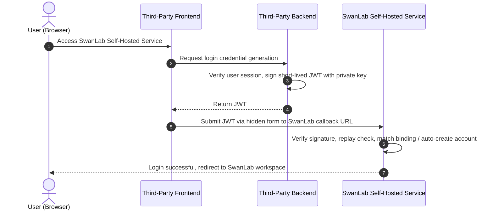

# Trusted Third-Party Login Configuration

This document describes how to configure a Trusted Third-Party (TRUSTED) Provider in a self-hosted SwanLab environment, and how a third-party platform can issue short-lived JWTs to initiate SwanLab login.

:::tip
**Applicable Scenario**: Suitable for integrating SwanLab into an internal training platform, allowing users logged into the internal platform to achieve seamless, password-free login redirection to the self-hosted SwanLab service.
:::

## 1. Feature Introduction

"Trusted Third-Party" (TRUSTED) is a simplified login method provided by SwanLab for trusted third-party platforms. It is intended for scenarios where a third-party platform <span style="color: red"><strong>does not possess OAuth2, OIDC, or SAML2 IdP capabilities, but can authenticate users itself and issue signed JWTs using an asymmetric key pair</strong></span>.

Trusted third-party login is initiated by the third-party platform:

1. The user has already completed authentication on the third-party platform.
2. The third-party platform's backend issues a short-lived, single-use JWT for the current user.
3. The third-party frontend submits the JWT to SwanLab Auth in a new window (accessing the self-hosted SwanLab service with the credential).
4. SwanLab verifies the JWT using the public key configured in the Provider and extracts the third-party user ID and username.
5. **Existing bound users are logged in directly**; **unbound users have a SwanLab account automatically created and bound, then log in**.



Trusted third-party login differs from other SSO protocols in the following ways:

- Only applicable to self-hosted environments.
- Only supports login; does not support account binding flows or Provider connection testing.
- Does not appear in SwanLab's public list of login methods.
- Does not invoke SSO Redirect endpoints; the third-party platform directly submits the JWT to the callback endpoint.
- The third-party platform cannot specify `state`, `action`, or custom SwanLab callback URLs.

### Role Division

The configuration and integration of trusted third-party login requires collaboration between the **SwanLab System Administrator** and the **Third-Party Platform Developers**:

| Role                                | Responsibilities                                                                                          |
| :---------------------------------- | :-------------------------------------------------------------------------------------------------------- |
| **SwanLab System Administrator**    | Confirm external access URL, configure Provider in admin console, set up public key and field mappings    |
| **Third-Party Platform Developers** | Generate signature key pair, implement backend JWT issuance, implement frontend popup and form submission |

::: tip Precondition
Before starting login redirection development and joint debugging, the SwanLab system administrator must first complete domain confirmation and create/enable the Trusted Third-Party Provider. Developers obtain the **Provider Name** (for constructing the Callback URL) and confirm the **Third-Party Platform Identifier (iss)** based on this configuration.
:::

## 2. Prerequisites

Before you begin, make sure that:

- You have deployed a self-hosted version that supports trusted third-party login.
- You have configured `global.settings.host` according to the [value configuration guide](https://docs.swanlab.cn/en/self_host/kubernetes/configuration.html#global-configuration-global).
- The third-party platform's backend can store the JWT private key securely.
- Clocks on both the third-party platform and SwanLab servers are synchronized.
- [Recommended] The self-hosted SwanLab service domain is served over HTTPS.

### 2.1 Configure the SwanLab External Access URL

After trusted third-party login succeeds, Auth redirects the user to the `/sso` route under the self-hosted SwanLab service domain. This address must be determined by the self-hosted deployment configuration and cannot be read from third-party requests.

Configure [`global.settings.host`](https://docs.swanlab.cn/en/self_host/kubernetes/configuration.html#global-configuration-global) in the `values.yaml` used by the self-hosted deployment scripts:

```yaml
global:
  settings:
    host: https://swanlab.example.com
...
```

`global.settings.host` should be set to the external gateway URL that users enter in their browsers to access SwanLab:

- Include `http://` or `https://`. HTTPS is required in production.
- Do not include `/api/auth`, `/sso`, or callback paths.

Examples:

```text
✅ Correct: https://swanlab.example.com
❌ Incorrect: https://swanlab.example.com/api/auth
❌ Incorrect: https://swanlab.example.com/sso
```

- If the domain is already configured, this step can be skipped.
- Once configured, update the deployment to apply the global configuration:

```bash
helm upgrade swanlab-self-hosted <PATH_TO_SELF_HOSTED_CHART> -f value.yaml -n <YOUR_NAMESPACE>
```

## 3. Configure the Trusted Third-Party Provider

### 3.1 Generate the Signature Key Pair

Trusted third-party login uses asymmetric cryptography. Generate a public/private key pair on a trusted server before configuring the Provider:

- The third-party platform retains the private key to sign JWTs.
- The SwanLab Provider stores the public key to verify JWTs.

::: info Execution Role & Environment

- **Execution Role**: Executed by **Third-Party Platform Developers** (or enterprise security team).
- **Execution Environment**: Must be executed in a **trusted, secure backend environment** of the third-party platform (such as production servers, bastion hosts, or enterprise KMS). Never generate or store private keys in client-side, browser, or frontend code.

:::

It is recommended to use an `RSA 2048-bit key` and the `RS256` algorithm. In a trusted server terminal, generate a PKCS#8 private key and corresponding public key using OpenSSL:

```bash
openssl genpkey \
  -algorithm RSA \
  -pkeyopt rsa_keygen_bits:2048 \
  -out trusted-private.pem

openssl pkey \
  -in trusted-private.pem \
  -pubout \
  -out trusted-public.pem
```

After generation:

- `trusted-private.pem`: Private key, must be strictly secured (e.g. in a Key Management Service) to sign JWT tokens.
- `trusted-public.pem`: Public key, to be filled into SwanLab Admin Console -> Trusted Third-Party Provider -> JWT Public Key field.
- Never store the private key in code repositories, frontend environment variables, browser storage, or logs.

Trusted third-party login supports the following algorithms:

- RSA: `RS256`, `RS384`, `RS512`
- ECDSA: `ES256`, `ES384`, `ES512`

HMAC algorithms with shared secrets (such as `HS256`) are not supported.

### 3.2 Create the Provider

1. Log in with a SwanLab administrator account, navigate to the **"Authentication"** management page, and select **"Add Provider" -> "Trusted Third-Party Login"**.


2. Fill in the Basic Configuration

| Field        | Required | Description                                                                                                                                                                                        |
| :----------- | :------- | :------------------------------------------------------------------------------------------------------------------------------------------------------------------------------------------------- |
| Name         | Yes      | Unique identifier for the Trusted Third-Party Provider. **Up to 25 characters, alphanumeric, underscores (\_), and hyphens (-) only**. Appears in the callback URL; avoid modifying after creation |
| Display Name | Yes      | Display name for administration and login flow. Will not appear as a public login button; used for management only                                                                                 |


3. Fill in the Trusted Third-Party Configuration

| Field                       | Required | Description                                                                                                                                           |
| :-------------------------- | :------- | :---------------------------------------------------------------------------------------------------------------------------------------------------- |
| Trusted Platform Identifier | Yes      | Stable identifier for the trusted third-party platform. Corresponds to the JWT `iss` claim; both must match exactly, otherwise verification will fail |
| JWT Public Key              | Yes      | RSA or ECDSA PEM public key used to verify the JWT signature. Must include complete `BEGIN PUBLIC KEY` and `END PUBLIC KEY` banners                   |


4. Configure User Field Mappings

User field mappings determine which claims in the JWT payload SwanLab reads to identify the third-party user identity.

| Field                | Required | Recommended | Description                                                                                                                                |
| :------------------- | :------- | :---------- | :----------------------------------------------------------------------------------------------------------------------------------------- |
| User Unique ID Field | Yes      | `sub`       | Claim in the decoded JWT payload corresponding to the third-party user's stable and unique ID                                              |
| Username Field       | Yes      | `username`  | Claim in the decoded JWT payload corresponding to the username, used as the default username when automatically creating a SwanLab account |


When using recommended settings, the JWT payload must contain at least `sub` and `username`:

```json
{
  "sub": "external-user-123", // Standard claim representing user unique identifier
  "username": "alice",        // Custom claim representing display username
  ...
}
```

Field mappings can use other names. For example, if configured as:

```text
User Unique ID Field: employee_id
Username Field: login_name
```

Then the business system's JWT payload must contain both `employee_id` and `login_name`:

```json
{
  "employee_id": "employee-123", // Unique identity identifier
  "login_name": "alice"          // Display username
  ...
}
```

- <span style="color: red"><strong>The User Unique ID must be globally unique within the Provider and remain unchanged even if the user changes their name, email, or department.</strong></span>

- To ensure **users do not need to modify their username upon first login**, the username field in the JWT payload should satisfy:
  - Contains only letters, numbers, underscores, and hyphens, with a length of up to 25 characters.
  - Has not been taken by another SwanLab user.

If the username is invalid or already taken, SwanLab will prompt the user to modify the username in a new window before creating the account.

5. Enable the Provider

After creating the Trusted Third-Party Provider, toggle its status to **"Enabled"** in the Provider list.

The Trusted Third-Party Provider **will not appear on SwanLab's general login page**, **nor does it offer a Provider test button or login entry logo configuration**. The display order only affects the Provider list in the admin console. Third-party platforms must initiate login actively via the callback URL.


## 4. Third-Party Platform Issues JWT

:::warning
📚 For JWT payload claim specifications, refer to: https://www.jwt.io/introduction
:::

### 4.1 Required JWT Content

JWT protected header example:

```json
{
  "alg": "RS256", // Signature algorithm
  "typ": "JWT" // Token type
}
```

JWT payload example:

```json
{
  "iss": "partner-platform", // Issuer (platform identifier)
  "sub": "external-user-123", // User unique identifier
  "username": "alice", // Username
  "iat": 1784000000, // Issued at (Unix timestamp in seconds)
  "exp": 1784000060, // Expiration time (Unix timestamp in seconds)
  "jti": "e39f79d8-faf5-4da8-8fc5-f9115d2e9568" // Token unique ID (replay prevention)
}
```

Field Requirements:

| Key        | Semantics                    | Required | Description                                                                                                               |
| :--------- | :--------------------------- | :------- | :------------------------------------------------------------------------------------------------------------------------ |
| `iss`      | Issuer (Platform Identifier) | Yes      | Must match the **"Trusted Platform Identifier"** configured in the SwanLab admin console exactly                          |
| `iat`      | Issued At                    | Yes      | JWT issue timestamp, Unix timestamp in seconds; cannot be later than the current time when the request arrives at SwanLab |
| `exp`      | Expiration Time              | Yes      | JWT expiration timestamp, Unix timestamp in seconds; must be later than `iat`, and `exp - iat <= 300` seconds             |
| `jti`      | Token Unique ID              | Yes      | Replay protection identifier; must be a non-empty string. Generate a fresh random value (UUID recommended) for each issue |
| `sub`      | User Unique Identifier       | Yes      | Default `sub`, determined by the Provider's "User Unique ID Field". Must stably and uniquely identify the user            |
| `username` | Username                     | Yes      | Default `username`, determined by the Provider's "Username Field". Value cannot be empty                                  |
| `nbf`      | Not Before                   | No       | If provided, states the JWT is not valid before this time; cannot be later than current SwanLab Auth server time          |

It is recommended to set JWT expiration to 60 seconds. The maximum valid interval accepted by Auth is 300 seconds.

Each combination of Provider, platform identifier, and `jti` can only be used successfully once. Submitting the same JWT again will return a credential-already-used error. If a request fails, issue a new JWT rather than reusing the old token.

### 4.2 Issue JWT on Third-Party Backend

::: warning Backend Execution Logic
The sample code below is **backend logic for the third-party platform**. It must run in a trusted backend server environment. The private key must never be exposed to the frontend browser or bundled into client-side code.
:::

JWT issuance logic resides in the third-party platform's backend service. Below is an example using `Node.js` and `jose`:

::: code-group

```ts [Node.js]
import { randomUUID } from "node:crypto";
import { readFile } from "node:fs/promises";
import { importPKCS8, SignJWT } from "jose";

const algorithm = "RS256";
const issuer = "partner-platform";

// The sample code reads the private key locally
// In production, ensure the backend service accesses the private key from a secure environment
const privateKeyPEM = await readFile("./trusted-private.pem", "utf8");
const privateKey = await importPKCS8(privateKeyPEM, algorithm);

export async function issueSwanLabToken(user: { id: string; username: string }) {
  const now = Math.floor(Date.now() / 1000);

  return new SignJWT({
    sub: user.id,
    username: user.username,
  })
    .setProtectedHeader({ alg: algorithm, typ: "JWT" })
    .setIssuer(issuer)
    .setIssuedAt(now)
    .setExpirationTime(now + 60)
    .setJti(randomUUID())
    .sign(privateKey);
}
```

:::

- If user mapping fields configured in SwanLab are not `sub` and `username`, modify the field names in the `SignJWT` payload accordingly.
- The third-party platform must verify that the user is currently authenticated before issuing a JWT. Never allow the browser to specify arbitrary third-party user IDs or usernames to request issuance.

## 5. Third-Party Platform Initiates Login

### 5.1 Callback URL

The callback URL format for the trusted third-party platform is:

```text
https://<SwanLab-External-Access-URL>/api/auth/sso/trusted/callback/<Provider-Name>
```

For example, if the SwanLab self-hosted domain is `https://swanlab.example.com` and the Provider Name is `partner-platform`:

```text
https://swanlab.example.com/api/auth/sso/trusted/callback/partner-platform
```

Callback request requirements:

- Request method must be `POST`.
- Content-Type is recommended to be `application/x-www-form-urlencoded`.
- Form field name must be `token`.
- Total request body size **cannot exceed 16 KiB**.
- Token must not be passed in URL query parameters.

### 5.2 Open SwanLab Using a Hidden Form

::: warning Frontend Execution Logic
The sample code below is **frontend logic for the third-party platform**, running in the user's browser. It is responsible for pre-opening a blank tab on click, requesting credentials from the backend, and submitting the token to SwanLab via a hidden form to achieve password-free login.
:::

After obtaining the newly issued JWT, the third-party frontend should synchronously open a blank window first, and then submit the token to that window via a hidden form. Pre-opening the window prevents it from being blocked by the browser's popup blocker after asynchronous requests complete.

::: code-group

```ts [Frontend (Browser)]
function submitToken(token: string, target: string) {
  const provider = "partner-platform";
  const form = document.createElement("form");
  const input = document.createElement("input");

  form.method = "POST";
  form.action = `https://swanlab.example.com/api/auth/sso/trusted/callback/${encodeURIComponent(provider)}`;
  form.enctype = "application/x-www-form-urlencoded";
  form.target = target;
  form.hidden = true;

  input.type = "hidden";
  input.name = "token";
  input.value = token;

  form.append(input);
  document.body.append(form);

  try {
    form.submit();
  } finally {
    form.remove();
  }
}

export async function startSwanLabLogin() {
  const target = `swanlab-trusted-${crypto.randomUUID()}`;
  // Must use window.open
  const popup = window.open("", target);

  if (!popup) throw new Error("The browser blocked the popup. Please allow popups for this site.");

  try {
    // This endpoint belongs to the third-party platform, which verifies the current logged-in user and issues the JWT
    const response = await fetch("/api/swanlab/trusted-token", {
      method: "POST",
      credentials: "same-origin",
    });
    if (!response.ok) throw new Error("Failed to obtain SwanLab login credential");

    const { token } = (await response.json()) as { token: string };
    submitToken(token, target);
  } catch (error) {
    popup.close();
    throw error;
  }
}
```

:::

Recommended button interaction flow:

1. User requests access to SwanLab.
2. Frontend immediately calls `window.open('', target)` to create the window.
3. Issue a short-lived JWT for the current user.
4. Upon successful receipt, submit the JWT to the new window via a hidden form.
5. If retrieval or submission fails, close the blank window and display an error message on the third-party platform.

::: warning Note
You must use `window.open` to open the new window, because SwanLab displays a "Close" button when login fails, which automatically closes windows opened via `window.open`.
:::

Do not pass tokens via URL query parameters:

```text
https://swanlab.example.com/api/auth/sso/trusted/callback/partner-platform?token=<jwt>
```

URLs can be preserved in browser history, access logs, proxy logs, and Referer headers.

### 5.3 Post-Login Account Behavior

SwanLab maintains binding relationships based on "Provider + Third-Party User Unique ID":

- Existing binding: Immediately establishes a SwanLab session and enters the SwanLab workspace.
- No binding: Automatically creates a SwanLab user with the mapped username (fails if license seats are insufficient), establishes the binding, and logs the user in.
- Invalid or duplicate username: Prompts the user to modify the username in a new window before creating the account.
- Bound SwanLab user is disabled: Rejects login and displays an account disabled message.

Upon successful login, SwanLab enters the user space by default. Business errors are displayed in the new window, and users can close the window and re-initiate login from the third-party platform.

## 6. Error Description and Troubleshooting

| Error                                               | Meaning                                                                                                     | Troubleshooting Suggestion                                                                       |
| :-------------------------------------------------- | :---------------------------------------------------------------------------------------------------------- | :----------------------------------------------------------------------------------------------- |
| Trusted third-party login configuration unavailable | Provider does not exist, is not enabled, protocol is not TRUSTED, or SwanLab Auth cannot read configuration | Check Provider name in callback URL, Provider status, and SwanLab Server/Auth connection         |
| Login credential invalid or expired                 | Token missing, signature verification failed, algorithm unsupported, `iss` mismatch, or time claims invalid | Re-issue token; check public/private keys, algorithm, `iss`, `iat`, `exp`, and server time sync  |
| Login credential already used                       | The same `jti` has already been submitted successfully                                                      | Generate a new `jti` and JWT for every login; do not retry old tokens                            |
| Unable to retrieve complete user info               | Required claim missing, empty, or unsupported data type                                                     | Check Provider field mappings and JWT payload; ensure user ID and username are non-empty strings |
| Login service temporarily unavailable               | Auth failed to record JWT consumption or Redis is temporarily unavailable                                   | Check Auth Redis connection; re-issue JWT once recovered                                         |

Common Issues:

### 6.1 HTTP 500 Returned After Submission

Check whether `global.settings.host` is correctly configured in `values.yaml` for self-hosted deployment, and whether upgrade scripts have been rerun after modification. This value must match the external gateway URL accessed by users.

### 6.2 Token Invalid Prompt

Check the following in order:

1. Whether JWT `alg` is an RSA/ECDSA algorithm supported by SwanLab.
2. Whether the Provider public key matches the third-party private key.
3. Whether the Provider trusted platform identifier matches the JWT `iss` exactly.
4. Whether `iat` and `exp` are Unix timestamps in seconds, not milliseconds.
5. Whether `exp` is greater than `iat`, and `exp - iat <= 300` seconds.
6. Whether the system clocks between the third-party server and SwanLab Auth are synchronized.
7. Whether the JWT contains a non-empty and unused `jti`.

### 6.3 User Still Prompted for Username on First Login

Check if the mapped username in the JWT:

- Contains only letters, numbers, underscores, and hyphens.
- Does not exceed 25 characters.
- Has not already been taken by another SwanLab user.

If third-party usernames do not satisfy SwanLab requirements, generate a compliant and stable SwanLab username claim when issuing the JWT, and map the Provider's "Username Field" to that claim.

### 6.4 Old Tokens Fail After Public Key Modification

The Provider currently stores only one active JWT public key. When updated, tokens signed with the old private key become immediately invalid. When rotating keys, coordinate the Provider update time with the third-party signing key switchover, and allow old tokens to expire quickly.

## 7. Security Considerations

- Trusted third-party login should only be deployed in explicitly trusted self-hosted environments.
- Private keys must be preserved in the third-party platform backend or dedicated KMS, never sent to SwanLab or client browsers.
- JWT is a short-lived login credential; protect it with password-grade security and never log full tokens.
- JWT is a Bearer Credential: the first entity to submit it successfully will assume the identity in the JWT. Only issue it dynamically after an authenticated user explicitly requests to enter SwanLab.
- Recommended JWT expiration is 60 seconds; maximum valid window is 300 seconds.
- Every issuance must generate a unique `jti`; consumed JWTs cannot be reused.
- The third-party platform must verify the user's active session before issuing a JWT, and never trust user identity parameters supplied directly by client browsers.
- Third-party token issuance endpoints must enforce session authentication, CSRF defense, and rate limiting.
- Never write private keys, JWTs, or sensitive user data to frontend logs, analytics trackers, or exception monitors.
- Both SwanLab and the third-party platform must enable HTTPS and maintain clock synchronization via NTP.
- The Provider's User ID mapping must use a permanent, stable, and non-reusable third-party user identifier.
