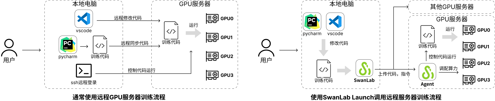

# Swanlab Launch使用文档（测试功能）

<div style="border:1px solid red; padding: 10px; background-color: #ffcccc;">
  <strong>警告：</strong> 目前该功能正在测试，请充分阅读下文档中的<strong>功能测试说明</strong>章节再使用该功能
</div>

## SwanLab Launch三分钟快速入门教程

本教程将以一个简单的一元二次函数回归任务来帮助读者了解如何使用**SwanLab Launch**功能。

**前置步骤，登录和获取key：**注册并登录[SwanLab](http://swanlab.cn/)，获取[API Key](https://swanlab.cn/settings/overview)

在本地安装swanlab（确保版本号为0.3.15及以上版本）

```bas
pip install -U swanlab
```

可以通过如下命令查看swanlab版本号

```bash
python -c "import swanlab;print(swanlab.__version__)"
# 0.3.15
```

**第一步，准备代码：**使用已经准备好的开源案例，使用git下载[SwanLab Launch测试代码](https://github.com/SwanHubX/SwanLabLaunchExample.git)，并进入到项目的根目录下：

```bash
# 下载项目
git clone https://github.com/SwanHubX/SwanLabLaunchExample.git
# 进入项目根目录
cd SwanLabLaunchExample
```

如果无法使用[Github](https://github.com)，可以在附录中找到完整的代码。

**第二步，云上运行代码：**使用**SwanLab Launch**功能执行训练的入口函数，命令如下

```bash
swanlab task launch -e <待运行的python脚本>
```

接下来SwanLab将会提示你是否将本地目录下的代码打包并上传到GPU服务器上（如下图），输入Y确认。


**SwanLab Launch**将会自动将本地代码打包，上传到GPU服务器，并启动训练。

**第三步，查看实验：**可以使用如下命令查看已开启的实验

```bash
swanlab task list
```

这将在端口中开启一个表格（如下图）,其中`Status`栏表示当前已开启的实验代码


也可以在[swanlab.cn](https://swanlab.cn)中查看到开始的实验


点击进入到Environments->System Hardwork，即可看到当前云上的服务器硬件


## 设计理念

**SwanLab Launch**功能目标是帮助AI研究者轻松高效的利用起多个不同的本地GPU服务>器，并且方便的规划自己的训练任务。因此**SwanLab Launch**专注于解决怎么让用户更方便的将训练快速部署到GPU服务器上。



通常使用远程GPU服务器完成训练需要进行三个步骤（见上图左）：

1. 本地编写代码
2. 同步到GPU服务器
3. 使用ssh开始实验

但如果你拥有的是一个多卡的GPU服务器，或者多个GPU服务器问题就会变得更麻烦，包括：

* 需要先查看哪个GPU是空闲的
* 如果新的服务器没安装环境需要配置环境
* 需要上传下载数据集
* 多节点实验需要在多个服务器上重复这些动作
* ...

使用**SwanLab Launch**功能只需要做如下几个操作（见上图右）：

1. GPU服务器后台运行**SwanLab Agent**
2. 在本地完成实验脚本撰写和制定环境依赖
3. 使用`swanlab task launch ...`命令部署到GPU服务器开始训练

SwanLab会自动完成本地代码打包上传、GPU服务器安装环境、根据GPU服务器的显卡空闲情况分配对应的GPU卡训练等工作。让研究人员不用去做烦琐的环境配置、查看服务器空闲情况等，可以专注于训练本身。

## SwanLab Launch命令

创建一个新文件夹并将数据集、训练代码放到当前文件夹中。也可以选择从现有项目、或者从[GitHub](https://github.com/)、[SwanHub](http://swanhub.co/)、[HuggingFace](https://huggingface.co/)中clone一个项目。

## SwanLab Agent安装（开发中）

<span style="color: red;">（等待补充）</span>

>目前该功能正在开发和测试，为了方便使用，SwanLab提供了云端免费的测试算力使用。可以直接通过`SwanLab Launch`使用云端算力运行和部署

## 工作过程和原理

<span style="color: red;">（等待补充）</span>

## 功能测试说明

:::info
强烈建议在使用本功能前[点击链接](s)加入到测试群当中，我们将会在群中第一时间回复解决可能遇到的问题。
:::

**SwanLab Launch**功能涉及将所需运行的代码和数据集上传到公有云服务器当中，我们尽力保障您的数据安全，但测试阶段仍有可能出现数据泄漏、丢失等风险，**请勿将重要数据上传至测试功能当中**。

**SwanLab Launch**功能的迭代依赖于社区用户的积极反馈，如果您遇到任何问题，欢迎积极联系我们。可以通过[Github Issue](https://github.com/SwanHubX/SwanLab/issues)，联系邮箱[zeyi.lin@swanhub.co](zeyi.lin@swanhub.co)和加入到[微信测试群](s)当中与我们直接交流。

为了方便测试的顺利进行，**SwanLab Launch**为参与测试的用户提供了免费的测试运行服务器，我们尽力满足每一位用户的测试和算力需求，但是由于团队资源有限和功能迭代，仍可能出现训练任务排队、训练被迫终止等情况。

## 致谢

🙏非常感谢愿意参与到功能测试的用户大大，我们将继续努力。

🙏非常感谢[新华三](https://www.h3c.com/cn/)为我们提供的算力支持。

## 附录

### 训练案例代码

第一步，在目录下创建一个空文件夹，并进入到文件夹中：

```bash
# Linux & Mac & Windows命令
mkdir SwanLabLaunchExample
```

第二步，在`SwanLabLaunchExample`文件夹中创建`train.py`，并粘贴如下训练代码

```python
################################
# File Name: train.py
################################

import torch
import torch.nn as nn
import torch.optim as optim
import swanlab
import logging

# 0. 初始化实验环境
swanlab.init("Launch-Example", experiment_name="test-remote")  # 初始化swanlab
device = "cuda"
if not torch.cuda.is_available():  # 判断是否存在显卡，不存在则报WARNING
    device = "cpu"
    logging.warning("CUDA IS NOT AVAILIABLE, use cpu instead")

# 1. 定义公式，目标是一个简单的二元一次函数，定义域和值域都为[0,1]
func = lambda x: (2 * x - 1) ** 2

# 2. 定义模型，3层神经网络（增大参数或者层数效果会更好些）
model = nn.Sequential(nn.Linear(1, 16), nn.Sigmoid(), nn.Linear(16, 1))
model = model.to(device)

# 3. 定义损失函数和优化器
criterion = nn.MSELoss().to(device)
optimizer = optim.AdamW(model.parameters(), lr=0.001)

# 4. 训练模型
iters = 8000
batch_num = 256
for i in range(iters):
    # 生成数据
    x = torch.rand(batch_num, 1)
    y = func(x)
    x, y = x.to(device), y.to(device)

    optimizer.zero_grad()  # 梯度清零
    outputs = model(x)  # 前向传播
    loss = criterion(outputs, y)  # 计算损失
    loss.backward()  # 反向传播
    optimizer.step()  # 更新参数

    if i % 5 == 0:
        print(f"Iter [{i+1}/{iters}], Loss: {loss.item():.4f}")
        swanlab.log({"loss": loss.item()}, step=i)

# 5. 验证模型
model.eval()
with torch.no_grad():
    sample_num = 101
    inputs = torch.linspace(0, 1, sample_num).unsqueeze(1).to(device)  # 从0到1线性采样
    outputs = func(inputs)
    predicts = model(inputs)
    # 绘制标注的图
    for i in range(sample_num):
        swanlab.log({"GroundTruth": outputs[i].item()}, step=i)
    # 绘制预测的图
    for i in range(sample_num):
        swanlab.log({"PredictFunc": predicts[i].item()}, step=i)
swanlab.finish()

```

第三步，在`SwanLabLaunchExample`文件夹中创建`requirements.txt`来指定运行环境，粘贴如下内容：

```txt
swanlab==0.3.14
torch==2.4.0
```
