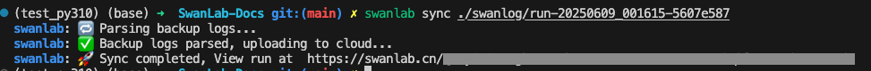

# swanlab sync

```bash
swanlab sync [options] [logdir]
```

| 选项 | 描述 |
| --- | --- |
| `-k`, `--api-key` | 用于身份验证的API密钥。如果未指定，将使用环境中的默认API密钥。如果指定，将使用此API密钥登录但不会保存密钥。|
| `-h`, `--host` | 同步日志的主机地址。如果未指定，将使用默认主机(`https://swanlab.cn`)。|
| `-w`, `--workspace` | 同步日志的工作空间。如果未指定，将使用默认工作空间。|
| `-p`, `--project` | 同步日志的项目。如果未指定，将使用默认项目。|


## 介绍

将本地日志，同步到SwanLab云端/私有化部署端。

## 命令行示例

找到你需要上传到云端的日志文件目录（默认是`swanlog`下的以`run-`开头的目录），然后执行命令：

```bash
swanlab sync ./swanlog/run-xxx
```

::: info
默认同步到的项目的是日志文件中记录的`project`，即跑该实验时设置的`project`。  
如果想要同步到其他项目，可以使用`-p`选项指定项目。
:::

看到下面的打印信息，则表示同步成功：




## Python代码示例

```python
import swanlab

swanlab.login(api_key="你的API Key")

swanlab.sync(
    dir_path="./swanlog/run-xxx",
    workspace="swanlab",
    project_name="sync_test",
)
```

## 批量上传

```bash
swanlab sync ./swanlog/run-*
```