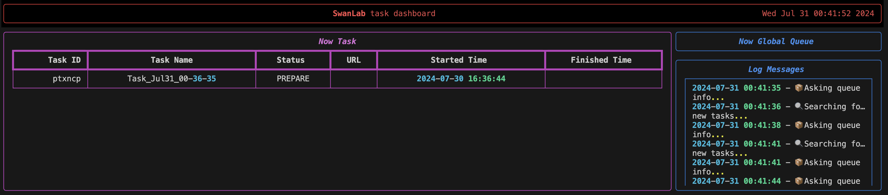
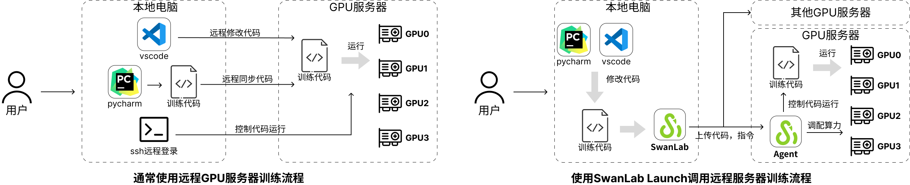
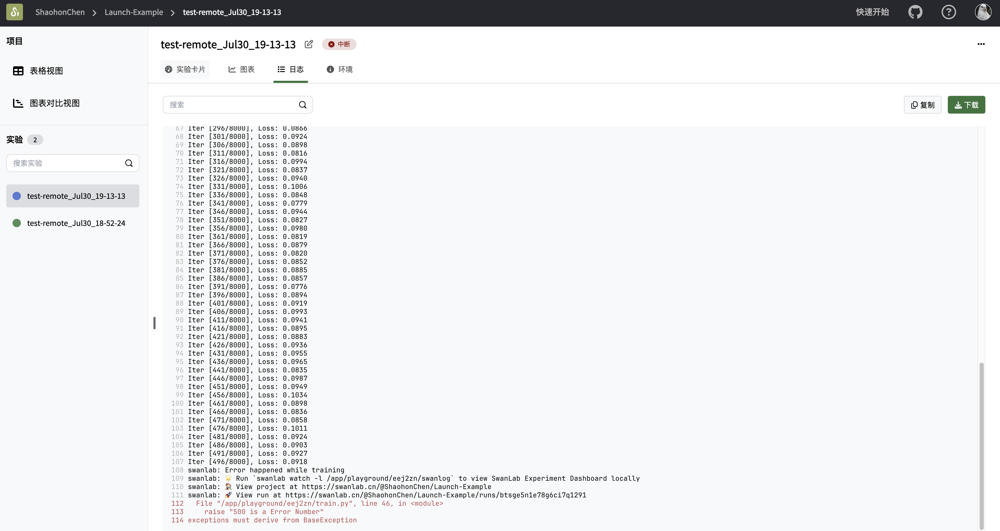

# SwanLab Task使用文档（Beta功能）

::: danger
<strong>警告：</strong> 目前该功能正在内测中，请充分阅读下文档中的 <strong>功能测试说明</strong> 章节再使用该功能。**内测的一些限制：**
1. 最大任务时长为4小时
2. 内测的更多信息请联系 <contact@swanlab.cn>, <zeyi.lin@swanhub.co>(产品经理邮箱)
:::

``` bash
swanlab task [OPTIONS]
```

| 选项 | 描述 |
| --- | --- |
| `launch -e <py file>` | 使用云端GPU服务器运行训练 |
| `list` | 查看开始的训练任务状态 |
| `search <task id>` | 查看某一特定任务的运行情况 |

详细使用方法请查[SwanLab Task命令](#swanlab-task命令)

## SwanLab Task三分钟快速入门教程

本教程将以一个简单的一元二次函数回归任务来帮助读者了解如何使用**SwanLab Task**功能。

### 前置步骤，登录和获取key

注册并登录[SwanLab](http://swanlab.cn/)，获取[API Key](https://swanlab.cn/settings/overview)

在本地安装swanlab（确保版本号为0.3.15及以上版本）

```bas
pip install -U swanlab
```

可以通过如下命令查看swanlab版本号

```bash
swanlab -v
# 0.3.15
```

### 第一步，准备代码

使用已经准备好的开源案例，使用git下载[SwanLab Task测试代码](https://github.com/SwanHubX/SwanLab-LaunchExample.git)，并进入到项目的根目录下

```bash
# 下载项目
git clone https://github.com/SwanHubX/SwanLab-LaunchExample.git
# 进入项目根目录
cd SwanLab-LaunchExample
```

如果无法使用[Github](https://github.com)，可以在[附录](#训练案例代码)中找到完整的代码。

### 第二步，云上运行代码

使用`swanlab task launch`执行训练的入口函数，命令如下：

```bash
swanlab task launch -e <待运行的python脚本>
```

接下来SwanLab将会提示你是否将本地目录下的代码打包并上传到GPU服务器上（如下图），输入`y`确认。


**SwanLab Task**将会自动将本地代码打包，上传到GPU服务器，并启动训练。

---

如果想跳过确认步骤，则在命令中添加`-y`参数：

```bash
swanlab task launch -y -e <待运行的python脚本>
```

这样将会直接执行打包上传操作。


### 第三步，查看实验

可以使用如下命令查看已开启的实验

```bash
swanlab task list
```

这将在端口中开启一个表格（如下图），最上面的一个为当前开启的实验。其中*Status*表示当前实验的状态，*PREPARE*表示该实验正在部署（其他状态可参考[swanlab task list](#swanlab-task-list)章节）。



当开始训练时（*Status*切换为*RUNNING*），可点击*URL*中的链接在[swanlab.cn](https://swanlab.cn)中查看到开始的实验。

:::info
仅当代码中包含使用`swanlab`进行在线实验指标跟踪时，才会自动获取和显示URL。

使用`swanlab`进行训练指标跟踪可参考[创建一个实验](../guide_cloud/experiment_track/create-experiment.md)
:::

可以通过在线看中查看到跟踪的实验指标


点击Logs即可查看到云端的终端输出信息


在swanlab云端实验看板界面（如下图）点击Environments->System Hardwork，即可看到当前云上的服务器硬件


关于调试、终止正在进行的实验等命令参考[SwanLab Task命令](#swanlab-task命令)

## 设计理念

**SwanLab Task**功能目标是帮助AI研究者轻松高效的利用起多个不同的本地GPU服务器，并且方便的规划自己的训练任务。因此**SwanLab Task**功能专注于解决怎么让用户更方便的将训练快速部署到GPU服务器上。



通常使用远程GPU服务器完成训练需要进行三个步骤（见上图左）：

1. 本地编写代码
2. 同步到GPU服务器
3. 使用ssh开始实验

但如果你拥有的是一个多卡的GPU服务器，或者多个GPU服务器问题就会变得更麻烦，包括：

* 需要先查看哪个GPU是空闲的
* 如果新的服务器没安装环境需要配置环境
* 需要上传下载数据集
* 多节点实验需要在多个服务器上重复这些动作
* ...

使用**SwanLab Task**功能只需要做如下几个操作（见上图右）：

1. GPU服务器后台运行**SwanLab Agent**
2. 在本地完成实验脚本撰写和制定环境依赖
3. 使用`swanlab task launch ...`命令部署到GPU服务器开始训练

SwanLab会自动完成本地代码打包上传、GPU服务器安装环境、根据GPU服务器的显卡空闲情况分配对应的GPU卡训练等工作。让研究人员不用去做烦琐的环境配置、查看服务器空闲情况等，可以专注于训练本身。

## SwanLab Task命令

:::warning
由于该功能尚在迭代，CLI命令和接口可能会随时变动。可以通过`swanlab task --help`来查看最新的命令。
:::

### swanlab task launch

```bash
swanlab task launch -e <启动训练的入口python脚本>
```

将文件夹下的任务打包、上传至远程GPU服务器，并且执行入口训练函数

### swanlab task list

```bash
swanlab task list
```

打印出已完成运行或者正在运行的实验（默认打印最新的10条）效果如下：


其中：

* **TASK ID**：任务的唯一标识
* **Task Name**：任务名称
* **URL**：swanlab在线实验日志跟踪的链接（仅实验脚本中设置了`swanlab.init`并且开启了云端同步实验数据）
* **Started Time**：实验开始部署时间
* **Finished Time**：实验完成时间

看板中的任务有三种状态：

* **QUEUING**：远程GPU繁忙，正在排队中
* **PREPARE**：正在部署远程环境
* **RUNNING**：正在运行训练
* **COMPLETED**：已经完成的任务
* **CRASHED**：环境部署失败或者代码错误

使用`ctrl+c`退出看板

### swanlab task search

```bash
swanlab task search <TASK_ID>
```

该命令用于。其中`TASK_ID`可通过[swanlab task list](#swanlab-task-list)查看，返回信息包含实验的开启结束时间，以及集群类型，执行环境等。

```bash
Task Info
Task Name: Task_Jul31_02-44-38
Python Version: python3.10
Entry File: train.py
Status: ✅ COMPLETED
Combo: RTX3090-1
Created At: 2024-07-30 18:44:40
Started At: 2024-07-30 18:45:02
Finished At: 2024-07-30 18:52:49
```

该命令也可以用于查看执行失败的任务（执行状态CRASHED的任务）报错信息。例如当我在[入门章节](#swanlab-task三分钟快速入门教程)的测试代码中中故意增加报错代码


对启动的该任务使用`swanlab task search <TASK_ID>`命令后，效果如下：


当然，也可以在该实验对应的[swanlab在线实验看板](https://swanlab.cn)中的log下查看报错信息：



## SwanLab Agent安装（开发中）

<span style="color: red;">（等待补充）</span>

>目前该功能正在开发和测试，为了方便使用，SwanLab提供了云端免费的测试算力使用。可以直接通过`SwanLab Task`使用云端算力运行和部署

## 工作过程和原理

<span style="color: red;">（等待补充）</span>

## 功能测试说明

:::info
强烈建议在使用本功能前[点击链接](https://geektechstudio.feishu.cn/wiki/Te1EwcLbrimD7Zk1fsrcCovanyg)加入到测试群当中，我们将会在群中第一时间回复解决可能遇到的问题。
:::

**SwanLab Task**功能涉及将所需运行的代码和数据集上传到公有云服务器当中，我们尽力保障您的数据安全，但测试阶段仍有可能出现数据泄漏、丢失等风险，**请勿将重要数据上传至测试功能当中**。

**SwanLab Task**功能的迭代依赖于社区用户的积极反馈，如果您遇到任何问题，欢迎积极联系我们。可以通过[Github Issue](https://github.com/SwanHubX/SwanLab/issues)，联系邮箱 <contact@swanlab.cn> 加入到[微信测试群](https://geektechstudio.feishu.cn/wiki/Te1EwcLbrimD7Zk1fsrcCovanyg)当中与我们直接交流。

为了方便测试的顺利进行，**SwanLab Task**为参与测试的用户提供了免费的测试运行服务器，我们尽力满足每一位用户的测试和算力需求，但是由于团队资源有限和功能迭代，仍可能出现训练任务排队、训练被迫终止等情况。

## 致谢

🙏非常感谢愿意参与到功能测试的用户大大，我们将继续努力。

🙏非常感谢[新华三](https://www.h3c.com/cn/)为我们提供的算力支持。

## 附录

### 训练案例代码

第一步，在目录下创建一个空文件夹，并进入到文件夹中：

```bash
# Linux & Mac & Windows命令
mkdir SwanLabLaunchExample
```

第二步，在`SwanLabLaunchExample`文件夹中创建`train.py`，并粘贴如下训练代码

```python
################################
# File Name: train.py
################################

import torch
import torch.nn as nn
import torch.optim as optim
import swanlab
import logging

# 0. 初始化实验环境
swanlab.init("Launch-Example", experiment_name="test-remote")  # 初始化swanlab
device = "cuda"
if not torch.cuda.is_available():  # 判断是否存在显卡，不存在则报WARNING
    device = "cpu"
    logging.warning("CUDA IS NOT AVAILIABLE, use cpu instead")

# 1. 定义公式，目标是一个简单的二元一次函数，定义域和值域都为[0,1]
func = lambda x: (2 * x - 1) ** 2

# 2. 定义模型，3层神经网络（增大参数或者层数效果会更好些）
model = nn.Sequential(nn.Linear(1, 16), nn.Sigmoid(), nn.Linear(16, 1))
model = model.to(device)

# 3. 定义损失函数和优化器
criterion = nn.MSELoss().to(device)
optimizer = optim.AdamW(model.parameters(), lr=0.001)

# 4. 训练模型
iters = 8000
batch_num = 256
for i in range(iters):
    # 生成数据
    x = torch.rand(batch_num, 1)
    y = func(x)
    x, y = x.to(device), y.to(device)

    optimizer.zero_grad()  # 梯度清零
    outputs = model(x)  # 前向传播
    loss = criterion(outputs, y)  # 计算损失
    loss.backward()  # 反向传播
    optimizer.step()  # 更新参数

    if i % 5 == 0:
        print(f"Iter [{i+1}/{iters}], Loss: {loss.item():.4f}")
        swanlab.log({"loss": loss.item()}, step=i)

# 5. 验证模型
model.eval()
with torch.no_grad():
    sample_num = 101
    inputs = torch.linspace(0, 1, sample_num).unsqueeze(1).to(device)  # 从0到1线性采样
    outputs = func(inputs)
    predicts = model(inputs)
    # 绘制标注的图
    for i in range(sample_num):
        swanlab.log({"GroundTruth": outputs[i].item()}, step=i)
    # 绘制预测的图
    for i in range(sample_num):
        swanlab.log({"PredictFunc": predicts[i].item()}, step=i)
swanlab.finish()

```

第三步，在`SwanLabLaunchExample`文件夹中创建`requirements.txt`来指定运行环境，粘贴如下内容：

```txt
swanlab==0.3.14
torch==2.4.0
```
