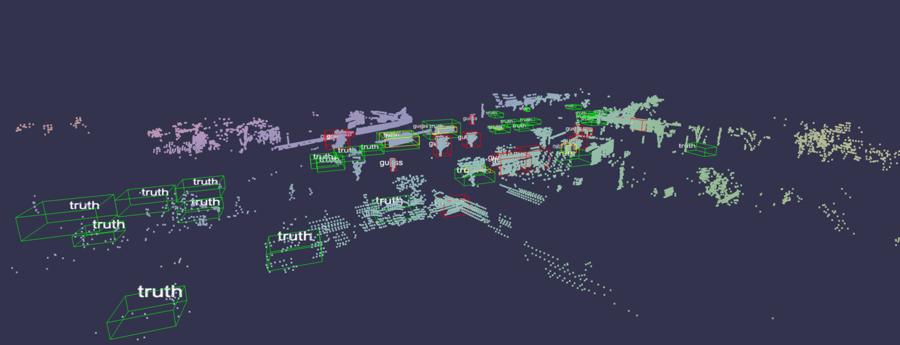

# swanlab.Object3D

[Github源代码](https://github.com/SwanHubX/SwanLab/blob/main/swanlab/data/modules/object3d/object3d.py)

| 参数        | 描述   |
|-----------|---------------|
| data | (Union[np.ndarray, str, Path]) 接收点云文件路径、numpy数组。Object3D类将判断接收的数据类型做相应的转换。                                      |              |
| caption   | (str) 3D对象的标签。用于在实验看板中展示3D对象时进行标记。                                                                                                                 |


## 介绍

对各种类型的点云数据做转换，以被`swanlab.log()`记录。



### 从文件/字典创建

::: warning 示例文件
data.swanlab.pts.json：[Google Drive下载](https://drive.google.com/file/d/1mFill-BXw3cirPHwIHndb1wNX4pWvSXb/view)
:::

文件的格式为`json`，内容格式如下：

```json
{
    "points": [
        [x1, y1, z1, r1, g1, b1],
        [x2, y2, z2, r2, g2, b2],
        ...
    ],
    // （可选）检测框，用于点云检测等任务，会框住对应位置
    "boxes": [
        {
            "color": [r, g, b],
            "corners": [[x1,y1,z1], ..., [x8,y8,z8]],
            // （可选）检测框的标签文本，会在视图中显示
            "label": "class_name",
            // （可选）置信度，会在视图中显示
            "score": 0.95,
        },
        ...
    ]
}
```

**json文件参数详细解释：**

* **`points`**：
    * 这是一个数组，用于存储3D点云数据。
    * 每个元素都是一个包含6个数值的数组 `[x, y, z, r, g, b]`，分别代表：
        * `x`, `y`, `z`：点的三维坐标。
        * `r`, `g`, `b`：点的颜色，分别代表红、绿、蓝三个通道的数值，通常取值范围为0-255。

* **`boxes`**（可选）：
    * 这是一个数组，用于存储3D检测框数据。
    * 每个元素都是一个对象，代表一个检测框，包含以下字段：
        * **`color`**：检测框的颜色，`[r, g, b]` 数组，代表红、绿、蓝三个通道的数值。
        * **`corners`**：检测框的八个顶点坐标，`[[x1, y1, z1], ..., [x8, y8, z8]]` 数组，每个元素是一个三维坐标 `[x, y, z]`。
        * **`label`**（可选）：检测框的标签文本，字符串类型，用于在视图中显示检测框的类别。
        * **`score`**（可选）：检测框的置信度，数值类型，通常取值范围为0-1，用于表示检测框的可靠程度。

---

使用SwanLab从`json`文件中记录3D点云数据：

::: code-group

```python [Object3D]
import swanlab

swanlab.init()

obj = swanlab.Object3D("data.swanlab.pts.json", caption="3d_point_cloud")
swanlab.log({"examples": obj})
```

```python [Object3D.from_point_data]
import swanlab

swanlab.init()

with open("data.swanlab.pts.json", "r") as f:
    cloud_point = json.load(f)

obj = swanlab.Object3D.from_point_data(
    points=cloud_point["points"],
    boxes=cloud_point["boxes"],
    caption="3d_point_cloud"
)

swanlab.log({"examples": obj})
```
:::


<video controls src="./py-object3d/video.mp4"></video>

<br>

### 从numpy数组创建

::: code-group

```python [从坐标创建]
import numpy as np

# Example 1: Create point cloud from coordinates
points_xyz = np.array([
    [0, 0, 0],  # Point1: x=0, y=0, z=0
    [1, 1, 1],  # Point2: x=1, y=1, z=1
    [2, 0, 1]   # Point3: x=2, y=0, z=1
])

cloud_xyz = swanlab.Object3D(points_xyz, caption="Basic XYZ Points")
swanlab.log({"examples": cloud_xyz})
```

```python [从坐标和类别创建]
import numpy as np

# Example 2: Create point cloud with categories
points_xyzc = np.array([
    [0, 0, 0, 0],  # Point1: xyz + category 0
    [1, 1, 1, 1],  # Point2: xyz + category 1
    [2, 0, 1, 2]   # Point3: xyz + category 2
])

cloud_xyzc = swanlab.Object3D(points_xyzc, caption="Points with Categories")
swanlab.log({"examples": cloud_xyzc})
```

```python [从坐标和RGB创建]
import numpy as np

# Example 3: Create point cloud with RGB colors
points_xyzrgb = np.array([
    [0, 0, 0, 255, 0, 0],    # Point1: xyz + red
    [1, 1, 1, 0, 255, 0],    # Point2: xyz + green
    [2, 0, 1, 0, 0, 255]     # Point3: xyz + blue
])

cloud_xyzrgb = swanlab.Object3D(points_xyzrgb, caption="Colored Points")
swanlab.log({"examples": cloud_xyzrgb})
```
:::

### 单步记录多个点云

```python
import swanlab

...

cloud1 = swanlab.Object3D(points1, caption="cloud1")
cloud2 = swanlab.Object3D(points2, caption="cloud2")
cloud3 = swanlab.Object3D(points3, caption="cloud3")

...

swanlab.log({"examples": [cloud1, cloud2, cloud3, ...]})
```