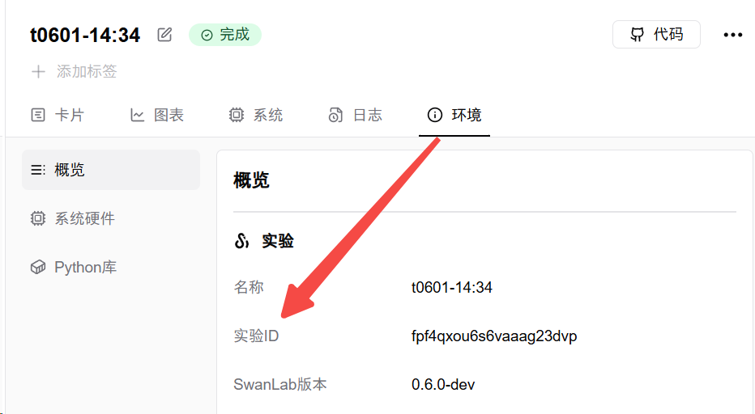

# swanlab.OpenApi

基于 SwanLab 云端功能, 在 SDK 端提供访问 **开放 API（OpenAPI）** 的能力, 允许用户通过编程方式在本地环境中操作云端 **实验/项目/工作空间** 资源。


通过开放 API 的形式, 用户可以在本地编程环境中:

- 获取实验数据、个人信息、工作空间信息、项目列表等
- 进行实验的自动管理（如查询、组织、元数据编辑等）
- 更方便地与其他工具集成（如 CI/CD、实验调度等）

利用好此特性可极大提升 SDK 的灵活性和可扩展性, 方便构建高级用法或扩展体系

## 支持的API列表

下表列出了SwanLab OpenAPI支持的所有方法，点击API名称可跳转到详细说明：

| API名称 | 分类 | 功能描述 | Ready |
|---------|------|----------|------|
| [`list_workspaces`](#list-workspaces) | WorkSpace | 获取当前用户的所有工作空间(组织)列表 | ✅ |
| [`list_projects`](#list-projects) | Project | 获取指定工作空间下的所有项目列表 | ✅ |
| [`delete_project`](#delete-project) | Project | 删除一个项目 | ✅ |
| [`list_experiments`](#list-experiments) | Experiment | 获取指定项目下的所有实验列表 | ✅ |
| [`get_experiment`](#get-experiment) | Experiment | 获取一个实验的详细信息（实验名、配置、环境等） | ✅ |
| [`get_summary`](#get-summary) | Experiment | 获取一个实验的Summary信息，包含实验跟踪指标的最终值和最大最小值 | ✅ |
| get_metrics | Experiment | 获取一个实验指标的值 | 🚧 |
| [`delete_experiment`](#delete-experiment) | Experiment | 删除一个实验 | ✅ |


## 介绍

> 前置条件：需要在编程环境下登录过SwanLab账号。

要使用 SwanLab 的开放 API, 只需实例化一个 `OpenApi` 对象。

```python
from swanlab import OpenApi

my_api = OpenApi() # 使用本地登录信息
print(my_api.list_workspaces().data) # 获取当前用户的工作空间列表
```

如果你需要获取其他用户的数据：
```python
from swanlab import OpenApi

other_api = OpenApi(api_key='other_api_key') # 使用另一个账户的api_key
print(other_api.list_workspaces().data)
```


具体来说, **OpenApi**的认证逻辑如下：

1. 如果显式提供了`api_key`参数, 则优先使用该`api_key`进行身份认证, 可以在[这里](https://swanlab.cn/space/~/settings)查看自己的 API 密钥；
2. 否则,使用本地的认证信息。

## 常用参数

### 实验ID `exp_id`

实验的唯一标识符**CUID**, 即`exp_id`, 可通过`list_experiments`方法获取对应的`cuid`字段

要查看某一个实验的CUID, 可在云端版网页的"环境"标签页查看"实验ID"一行, 点击即可复制此实验的CUID



### 工作空间名 `username`

工作空间名即`username`, 用于标识用户所在的工作空间:

- 若为个人空间, `username`即为用户的用户名
- 若为组织空间, `username`为该组织的组织ID

`username`可以通过`list_workspaces`方法获取, 返回的工作空间列表中每个元素的`username`字段即为工作空间名

一般的, 若在开放API调用中不指定`username`, 则**默认**为当前用户的个人空间

## 模型定义

在使用开放 API 时, 获取到的部分云端资源组成较为复杂, 如实验、项目等, 难以用简单的Python数据类型表示

因此, 这些资源在开放API的返回值中被定义为了对象, 支持 IDE 的自动补全与类型检查, 从而方便用户进行操作

例如, 要获取一个实验对象的开始时间, 可以用:

```python
api_response: ApiResponse = my_api.get_experiment(project="project1", exp_cuid="cuid1")
my_exp: Experiment = api_response.data
created_time: str = my_exp.createdAt
```

或者, 要获取一个项目对象所属工作空间的名字, 可以用:

```python
api_response: ApiResponse = my_api.list_projects()
my_project: Project = api_response.data[0]
workspace_name: str = my_project.group["name"]
```

对于一个模型, 其属性可通过以下三种方式访问:

- `my_exp.createdAt`
- `my_exp["createdAt"]`
- `my_exp.get("createdAt")`

> Note: 模型可以通过字典风格访问, 但不是真正的字典, 可以通过`my_exp_dict: Dict = my_exp.model_dump()`获取此时模型对应的字典

### API 响应 `ApiResponse`

开放 API 方法返回`swanlab.api.openapi.types.ApiResponse`对象, 包含以下字段:

| 字段 | 类型 |描述 |
| --- | --- | --- |
| `code` | `int` | HTTP 状态码 |
| `errmsg` | `str` | 错误信息, 如果状态码不为`2XX`则非空 |
| `data` | `Any` | 返回的具体数据, 下面API文档中提到的返回值即为该字段 |

### 实验模型 `Experiment`

实验对象的类型为`swanlab.api.openapi.types.Experiment`, 包含以下字段:

| 字段 | 类型 | 描述 |
| --- | --- | --- |
| `cuid` | `str` | 实验CUID, 唯一标识符 |
| `name` | `str` | 实验名 |
| `description` | `str` | 实验描述 |
| `state` | `str` | 实验状态, `FINISHED` 或 `RUNNING` |
| `show` | `bool` | 显示状态 |
| `createdAt` | `str` | 创建时间, 格式如 `2024-11-23T12:28:04.286Z` |
| `finishedAt` | `str` | 完成时间, 格式如 `2024-11-23T12:28:04.286Z`, 若不存在则为 None |
| `user` | `Dict[str, str]` | 实验创建者, 包含 `username` 与 `name` |
| `profile` | `dict` | 详细包含了实验的所有配置信息, 如用户自定义配置与Python运行环境等 |

### 项目模型 `Project`

项目对象的类型为`swanlab.api.openapi.types.Project`, 包含以下字段:

| 字段 | 类型 | 描述 |
| --- | --- | --- |
| `cuid` | `str` | 项目CUID, 唯一标识符 |
| `name` | `str` | 项目名 |
| `description` | `str` | 项目描述 |
| `visibility` | `str` | 可见性, `PUBLIC` 或 `PRIVATE` |
| `createdAt` | `str` | 创建时间, 格式如 `2024-11-23T12:28:04.286Z` |
| `updatedAt` | `str` | 更新时间, 格式如 `2024-11-23T12:28:04.286Z` |
| `group` | `Dict[str, str]` | 工作空间信息, 包含 `type`, `username`, `name` |
| `count` | `Dict[str, int]` | 项目的统计信息, 如实验个数, 协作者数量等 |

## OpenAPIs

每个开放 API 都是`OpenApi`对象的一个方法

下面是所有可用的SwanLab 开放 API

### WorkSpace

#### `list_workspaces`

获取当前用户的所有工作空间(组织)列表。

**返回值**

`data` `(List[Dict])`: 用户加入的工作空间列表, 每个元素是一个字典, 包含工作空间的基础信息:

| 字段 | 类型 | 描述 |
| --- | --- | --- |
| `name` | `str` | 工作空间名称 |
| `username` | `str` | 工作空间唯一标识(用于组织相关的 URL) |
| `role` | `str` | 用户在该工作空间中的角色, 为 `OWNER` 或 `MEMBER` |

**示例**

::: code-group

```python [获取工作区列表]
from swanlab import OpenApi
my_api = OpenApi()

my_api.list_workspaces().data
"""
[
    {
        "name": "workspace1",
        "username": "kites-test3",
        "role": "OWNER"
    },
    {
        "name": "hello-openapi",
        "username": "kites-test2",
        "role": "MEMBER"
    }
]
"""
```

```python [获取第一个工作区名称]
from swanlab import OpenApi
my_api = OpenApi()

my_api.list_workspaces().data[0]["name"]
"""
"workspace1"
"""
```

```python [获取响应状态码]
from swanlab import OpenApi
my_api = OpenApi()

my_api.list_workspaces().code
"""
200
"""
```

:::

<br>

### Experiment

#### `list_experiments`

获取指定项目下的所有实验列表

**方法参数**

| 参数  | 类型 | 描述 |
| --- | --- | --- |
| `project` | `str` | 项目名 |
| `username` | `str` | 工作空间名, 默认为用户个人空间 |

**返回值**

`data` `(List[Experiment])`: 包含实验[(Experiment)](#实验模型-experiment)对象的列表

**示例**

::: code-group

```python [获取实验列表]
my_api.list_experiments(project="project1").data
"""
[
    {
        "cuid": "cuid1",
        "name": "experiment1",
        "description": "Description 1",
        "state": "RUNNING",
        "show": true,
        "createdAt": "2024-11-23T12:28:04.286Z",
        "finishedAt": null,
        "user": {
            "username": "kites-test3",
            "name": "Kites Test"
        },
        "profile": {
            "config": {
                "lr": 0.001,
                "epochs": 10
            }
        }
    },
    ...
]
"""
```

```python [获取第一个实验的CUID]
my_api.list_experiments(project="project1").data[0].cuid
"""
"cuid1"
"""
```

```python [获取第一个实验的名称]
my_api.list_experiments(project="project1").data[0].name
"""
"experiment1"
"""
```

:::

<br>

#### `get_experiment`

获取一个实验的详细信息

**方法参数**

| 参数 | 类型 | 描述 |
| --- | --- | --- |
| `project` | `str` | 项目名 |
| `exp_id` | `str` | 实验CUID, 唯一标识符, 可通过`list_experiments`获取, 也可在云端版实验"环境"标签页查看 |
| `username` | `str` | 工作空间名, 默认为用户个人空间 |

**返回值**

`data` `(Experiment)`: 返回一个实验[(Experiment)](#实验模型-experiment)类型的对象, 包含实验的详细信息

**示例**

::: code-group

```python [获取实验信息]
my_api.get_experiment(project="project1", exp_id="cuid1").data
"""
{
    "cuid": "cuid1",
    "name": "experiment1",
    "description": "This is a test experiment",
    "state": "FINISHED",
    "show": true,
    "createdAt": "2024-11-23T12:28:04.286Z",
    "finishedAt": "2024-11-25T15:56:48.123Z",
    "user": {
        "username": "kites-test3",
        "name": "Kites Test"
    },
    "profile": {
        "conda": "...",
        "requirements": "...",
        ...
    }
}
"""
```

```python [获取实验的状态]
my_api.get_experiment(project="project1", exp_id="cuid1").data.state
"""
"FINISHED"
"""
```

```python [获取实验的创建者用户名]
my_api.get_experiment(project="project1", exp_id="cuid1").data.user["username"]
"""
"kites-test3"
"""
```

:::

<br>

#### `delete_experiment`

删除一个实验

**方法参数**
| 参数 | 类型 | 描述 |
| --- | --- | --- |
| `project` | `str` | 项目名 |
| `exp_id` | `str` | 实验CUID, 唯一标识符, 可通过`list_experiments`获取, 也可在云端版实验"环境"标签页查看 |
| `username` | `str` | 工作空间名, 默认为用户个人空间 |

**返回值**
`data` `(dict)`: 空字典, 仅表示删除操作成功

**示例**

::: code-group

```python [删除实验]
my_api.delete_experiment(project="project1", exp_id="cuid1")
```

:::

<br>

#### `get_summary`

获取一个实验的概要信息, 包含实验跟踪指标的最终值和最大最小值, 以及其对应的步数

**方法参数**

| 参数 | 类型 | 描述 |
| --- | --- | --- |
| `project` | `str` | 项目名 |
| `exp_id` | `str` | 实验CUID, 唯一标识符, 可通过`list_experiments`获取, 也可在云端版实验"环境"标签页查看 |
| `username` | `str` | 工作空间名, 默认为用户个人空间 |

**返回值**

`data` `(Dict[str, Dict])`: 返回一个字典, 包含实验的概要信息

字典中的每个键是一个指标名称, 值是一个结构如下的字典:

| 字段 | 类型 | 描述 |
| --- | --- | --- |
| `step` | `int` | 最后一个步数 |
| `value` | `float` | 最后一个步数的指标值 |
| `min` | `Dict[str, float]` | 最小值对应的步数和指标值 |
| `max` | `Dict[str, float]` | 最大值对应的步数和指标值 |


**示例**

::: code-group

```python [获取实验概要信息]
my_api.get_summary(project="project1", exp_id="cuid1").data
"""
{
    "loss": {
        "step": 47,
        "value": 0.1907215012216071,
        "min": {
            "step": 33,
            "value": 0.1745886406861026
        },
        "max": {
            "step": 0,
            "value": 0.7108771095136294
        }
    },
    ...
}
"""
```


```python [获取指标的最大值]
my_api.get_summary(project="project1", exp_id="cuid1").data["loss"]["max"]["value"]
"""
0.7108771095136294
"""
```

```python [获取指标最小值所在步]
my_api.get_summary(project="project1", exp_id="cuid1").data["loss"]["min"]["step"]
"""
33
"""
```
:::

<br>

### Project

#### `list_projects`

获取指定工作空间下的所有项目列表

**方法参数**

| 参数  | 类型 | 描述 |
| --- | --- | --- |
| `username` | `str` | 工作空间名, 默认为用户个人空间 |
| `detail` | `bool` | 是否项目统计信息, 默认为 True |

**返回值**

`data` `(List[Project])`: 包含项目[(Project)](#项目模型-project)对象的列表

**示例**

::: code-group

```python [获取项目列表]
my_api.list_projects().data
"""
[
    {
        "cuid": "project1",
        "name": "Project 1",
        "description": "Description 1",
        "visibility": "PUBLIC",
        "createdAt": "2024-11-23T12:28:04.286Z",
        "updatedAt": null,
        "group": {
            "type": "PERSON",
            "username": "kites-test3",
            "name": "Kites Test"
        },
        "count": {
            "experiments": 4,
            "contributors": 1,
            "children": 0,
            "runningExps": 0
        }
    },
    ...
]
"""
```

:::

#### `delete_project`

删除一个项目

**方法参数**

| 参数 | 类型 | 描述 |
| --- | --- | --- |
| `project` | `str` | 项目名 |
| `username` | `str` | 工作空间名, 默认为用户个人空间 |

**返回值**

`data` `(dict)`: 空字典, 仅表示删除操作成功

**示例**

::: code-group

```python [删除项目]
my_api.delete_project(project="project1")
```

:::

<br>