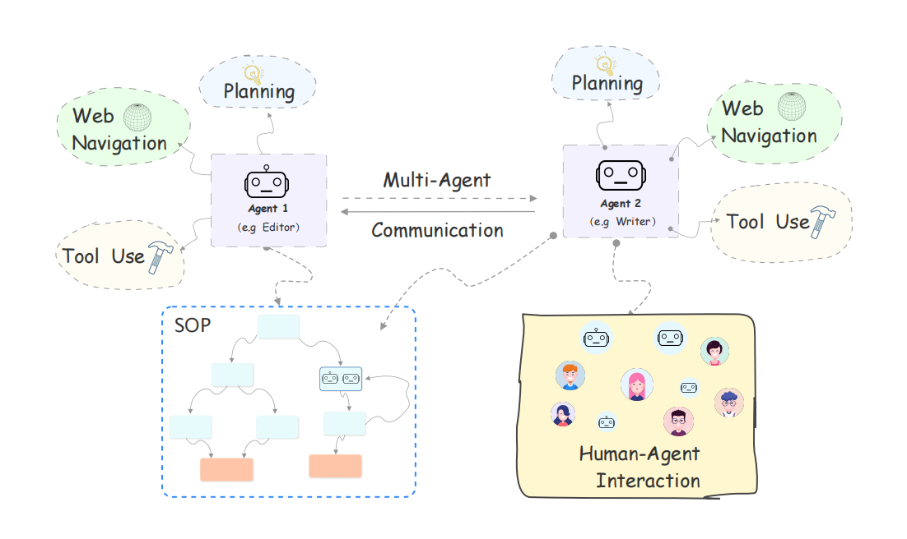

## 多Agents

在大模型领域，多 agents 指的是多个具备独立能力的 “智能体” 协同工作的系统。每个 agent 就像一个专业助手，有自己的技能范围，它们通过沟通协作完成复杂任务，而不是单个模型单打独斗。

这类系统的应用场景很广，比如复杂数据分析时，数据收集 agent 负责找资料，分析 agent 处理数据，总结 agent 生成报告；或者在电商运营中，选品 agent 推荐商品，客服 agent 处理咨询，营销 agent 制定推广方案，形成完整工作流。

该图出自[Agents: An Open-source Framework for Autonomous Language Agents](https://arxiv.org/pdf/2309.07870v3)，图中SOP（标准作业流程）是多 agents 运行的关键。它就像提前设定好的 “工作手册”，明确每个 agent 的职责、操作步骤和协作规则。比如客户投诉处理的 SOP 会规定：先由接待 agent 记录问题，再转交对应领域的专业 agent 解决，最后由质检 agent 确认结果，确保流程规范高效，避免混乱。

多 agents 与提示词的关系紧密又有区别。提示词是用户对单个模型的指令，而多 agents 系统中，提示词不仅有用户给的初始需求，还包括 agents 之间的 “内部指令”。用户只需给出最终目标提示，系统会自动生成每个 agent 的任务提示词。比如用户说 “写一份市场分析”，系统会拆解出给数据 agent 的 “收集行业数据” 提示、给分析 agent 的 “提炼趋势” 提示等，让提示词更精准地适配不同分工，既保留了提示词的引导作用，又通过多 agent 协作放大了其效果，让复杂任务处理更流畅。

# 提示词工程与上下文工程

上下文工程作为新出的概念，和提示词工程的区别简单来说是包含的关系，提示词工程$$\subse$$上下文工程。

Context Engineering（上下文工程 ），聚焦于大语言模型（[LLM](https://zhida.zhihu.com/search?content_id=260080027&content_type=Article&match_order=1&q=LLM&zhida_source=entity)）场景下，对“上下文（Context）”进行专业处理与优化的角色，核心是让LLM更高效、精准利用信息完成任务 。简单说，就是搭建、管理LLM“信息输入 - 处理”通道，让模型“聪明干活”。也包括了Prompt,RAG,FunctionCalling等内容。

这里的处理不仅包括对提示词内容的处理，让输出更加精准、符合预期，还可以从资源利用角度，比如显存的占用，更加高效运用现有资源。

提示词工程只处理提示词，上下文工程因为要处理上下文，因此历史记录、RAG、工具调用都归上下文工程管理，概念更偏向于Agent。

我们可以从下图中了解二者的关系：

1. 