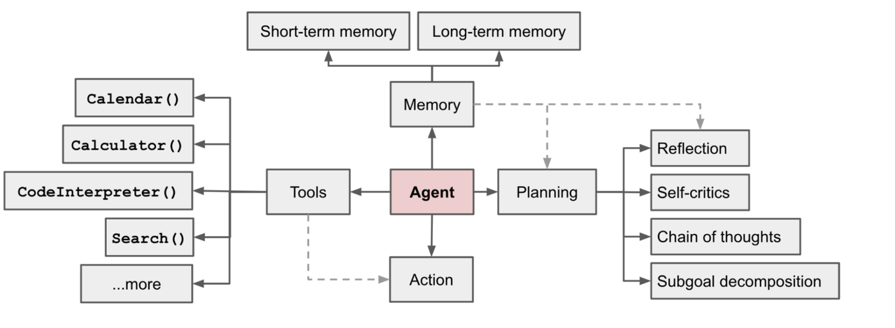

# Agent

在前面的例子中，我们学习了如何设计提示词完成各类任务，也包括简单的RAG检索，但是每一类任务都是基于我们与大模型的一问一答的互动，我们无形中把这种对话当成和“人”的对话，这样其实是限制了大模型能够做到的事情，毕竟“人”除了对话，也能决策、动手、反思等等，事实上大模型也能做到这些，而这就涉及到了另外一个专业词汇`agent`。

什么是`agent`？或者说什么是大模型`agent`？

大模型`agent`，作为一种人工智能体，是具备环境感知能力、自主理解、决策制定及执行行动能力的智能实体。简而言之，它是构建于大模型之上的计算机程序，能够模拟独立思考过程，灵活调用各类工具，逐步达成预设目标的智能存在。通俗点来说，大模型充当了大脑的部分，可以决策、感知、反思，但是真正的行动需要各类工具的辅助来达成各类目标。**将这些功能全部组合起来，以大模型为核心，就构成了agent。**

我们可以查看 OpenAI 研究员 Lilian Weng的个人博客文章[LLM Powered Autonomous Agents](https://lilianweng.github.io/posts/2023-06-23-agent/)，这篇博客不仅形象又具体的讲述了`agent`的结构，也对相关的研究做了总结，这里我们简单的分解下`agent`。

如上图所示，Agent 共由4个关键部分组成：规划（Planning）、记忆（Memory）、工具（Tools）、行动（Action），下面详细剖析。

1. 规划（Planning）

"规划"是agent的思维模型。类比人类，面对任务，我们先构思解决方案，拆解为子任务，评估工具，执行中反思调整，并考量终止时机。通过提示词工程，比如：ReAct、CoT 推理模式，可赋予agent类似思维模式，精准拆解复杂任务，依次经过大模型决策规划，从而分布解决问题，实现更准确的规划。

2. 记忆（Memory）

记忆，即信息的存储与回忆。agent可以模拟人类，人类对于记忆的保存有长期记忆，也有短期记忆，长期记忆通常来说规模较大，而且更多需要后期多次调用，比如用户信息、业务数据等，因此可以保存在数据库或者知识库中；短期记忆通常涉及临时对话信息，用于大模型上下文对话中，如果任务终止，那么短期记忆就会清空。

3. 工具（Tools）

agent需要依托工具来感知环境、执行决策等。对于感知环境，比如通常大模型的内部训练好的信息相比于时间和新闻的更新迭代差了很长时间的，最新的一些新闻、论文资料大模型是不清楚的，因此需要通过工具调用知识库或者链接等读取信息，才能做出回答，类似于RAG；执行决策就很好理解了，如果你需要大模型帮你定一张周六的餐厅的订单，在大模型检索好信息后，订票的操作需要调用链接完成，这一步就不是大模型能做的，而是要工具实现。

4. 行动（Action）

agent经过大模型的规划、记忆的读取、工具的调用，最终是要实现和用户的互动，完成用户的目标，也就是实现输入到输出的转化。比如：智能客服回复、查询天气预报、AI 机器人抓起物体等等。

经过对`agent`结构的拆解，我们知道构建一个agent需要做些什么，其中每一部分都需要利用提示词划定任务细节，从而更好的辅助大模型实现每一部分的细节。那么接下来，我们举一个简单的例子构建一个agent。

本节我们将会带大家实现函数调用、MCP的简单应用，并且讲述多Agents原理，下面是我们每一个章节的链接👇：

| 教程章节   | 状态 |  
|:--------|:------|
| [1.函数调用实战](./1.function_calling.md)   |  ✅  |
| [2.MCP应用实战](./2.mcp_usage.md)   | ✅  |
| [3.多Agents原理](./3.multi_agents.md)   | ✅   |