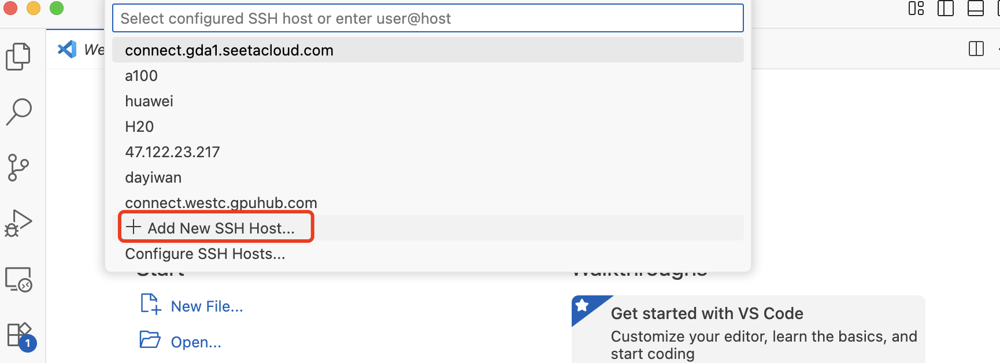

## 昇腾vLLM实践

本节我们将基于华为昇腾卡，创建新的容器实例，在镜像里使用vLLM框架完成完整的大模型推理服务的流程，我们复现的是第8节[合成instruct数据部分代码](../8、synthetic_data/3.data_generate_code.md)。


<div style="background:#c2efc2;color:#000;padding:12px 16px;border-left:4px solid #007500;">

<strong>
我们按照下面的步骤，就可以实现vLLM运行模型推理代码
</strong>

1. 在AutoDl上申请NPU服务器，租用新实例
2. JupyterLab & 本地VScode IDE运行
3. 配置完整环境
4. 基于vLLM框架运行代码
</div>

### 1、在AutoDl上租用容器实例


> 下面的内容在[官方文档](https://www.autodl.com/docs/env/)可以阅读

***AutoDl是什么？***

[AutoDL](https://www.autodl.com/home)的目标是为用户提供稳定可靠、价格公道的GPU算力，让GPU不再成为数据科学家道路上的拦路石。

<div style="background:#e7f5ff;color:#000;padding:12px 16px;border-left:4px solid #74c0fc;">
 AutoDl算力市场有<a href="https://www.autodl.com/market/list" target="_blank" rel="noopener">昇腾系列NPU</a>，本次教程我们使用910B2来实现模型的推理服务
</div>

---

***容器实例是什么?***

容器实例是使用Docker技术进行资源划分与隔离Container，拥有相比虚机实例性能损失少，效率高等优点。

<div style="background:#e7f5ff;color:#000;padding:12px 16px;border-left:4px solid #74c0fc;">
容器实例内不支持使用Docker，如需使用Docker请联系客服租用裸金属服务器。（裸金属服务器整机包月起租。）
</div>

---

***实例的目录***

在实例中查看磁盘使用情况请在终端中执行：`source /root/.bashrc`


---

**具体步骤**

首先，我们在算力市场选择[华为昇腾服务器](https://www.autodl.com/market/list)。


> 其中GPU数量可以根据情况选择，因为我们就运行一个3B的Qwen模型，不需要太多算力，选择一个GPU就好。


然后，需要注意的是，我们选择镜像的时候选择基础镜像中的PyTorch 2.5.1版本，里面都有下载好的PyTorch环境，我们只需要安装vllm、modelscope或者transformers即可。


> 然后开机，我们就开启了一个新的容器实例


### 2、JupyterLab & 本地VScode IDE运行

**(1).JupyterLab**

点击下面的`JupyterLab`在线使用notebook编写代码


我们在下面的`其他`部分可以新建python文件


在线使用比较方便，我们按照习惯就好，如果本地编写代码有些需要注意的地方。

**(2).本地VScode IDE运行**

> 如果对本地IDE用顺手的朋友可以远程连到本地，后续代码编写都一样，就是前期需要连接下，这里我们用VScode展示

首先将SSH登陆指令输入到VScode的连接命令处，根据指引填写到`.config`文件中即可





### 3、配置完整环境

> 因为基础镜像里可能缺少一些我们需要的函数库，因此可能需要补全环境后在运行

**1.激活conda**

配置环境前需要激活conda命令，你能使用 conda activate 切换虚拟环境，激活后使用`base`环境即可。


运行下面的代码👇：

```bash
source ~/miniconda3/bin/activate
```

**2.安装环境**

我们先运行下面的代码👇：

```bash
pip install modelscope
pip install fire
pip install rouge_score
```

---

<div style="background:#e7f5ff;color:#000;padding:12px 16px;border-left:4px solid #74c0fc;">

<strong>
然后对于vllm，除了本身的vllm库之外，我们还需要安装vllm-ascend。
</strong>

vLLM Ascend（vllm-ascend）是一个社区维护的硬件插件，用于在 Ascend NPU 上无缝运行 vLLM。</br>

这是 vLLM 社区中支持 Ascend 后端的推荐方法。它遵循 [RFC] 中概述的原则：硬件可插拔，提供硬件可插拔接口，将 **Ascend NPU**与 vLLM 的集成分离。</br>

通过使用 vLLM Ascend 插件，流行的开源模型，包括 Transformer-like、Mixture-of-Expert、Embedding、Multi-modal LLM 可以在 **Ascend NPU** 上无缝运行。</br>

简单的理解，相当于增加了1个插头转换器，使得大模型部署可以用vllm在Ascend NPU上推理运行。</br>
</div>

正常情况下，在安装vLLM与vLLM-Ascend之前，需要安装CANN，因为目前的容器中，已经提前安装好了，所以就跳过这个手动安装CANN的环节，直接从源代码安装[1]。

```bash
# Install vLLM
git clone --depth 1 --branch v0.7.3 https://github.com/vllm-project/vllm
cd vllm
VLLM_TARGET_DEVICE=empty pip install . --extra-index https://download.pytorch.org/whl/cpu/

# Install vLLM Ascend
git clone  --depth 1 --branch v0.7.3rc1 https://github.com/vllm-project/vllm-ascend.git
cd vllm-ascend
pip install -e . --extra-index https://download.pytorch.org/whl/cpu/
```

然后我们可以用`pip show vllm`检查下是否安装成功


### 4、基于vLLM框架运行代码

具体代码运行直接参考第8节[合成instruct数据部分代码](../8、synthetic_data/3.data_generate_code.md)即可，因为运行流程完全相同。


## 实例监控

如果想检查过程中NPU、GPU、CPU等使用情况，可以直接使用`实例监控`观测。


在终端我们也可以看到GPU等使用情况


---

## 参考文献

[1].[太好了，vLLM已支持华为昇腾910B,半小时可部署Deepseek](https://zhuanlan.zhihu.com/p/1888978873061986509)

