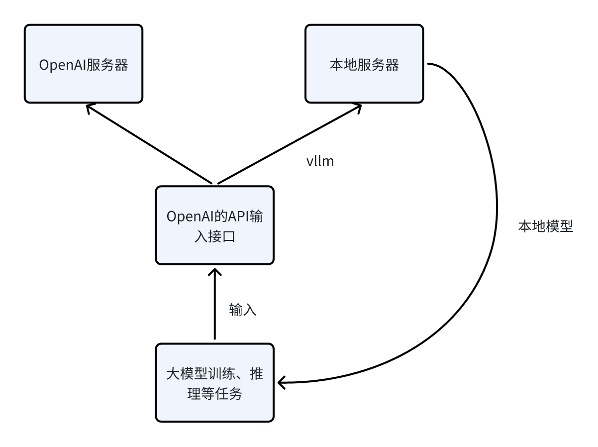
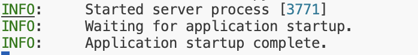
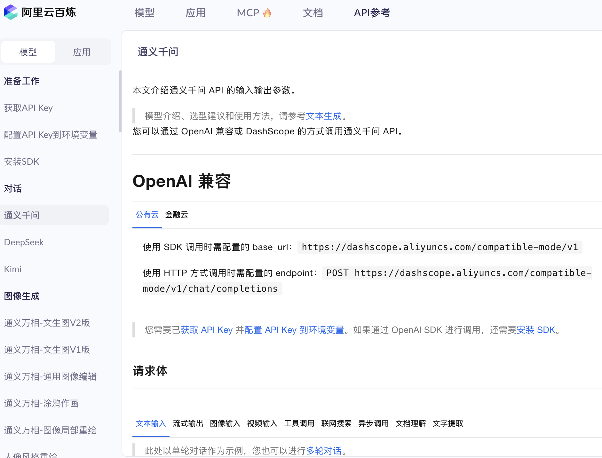
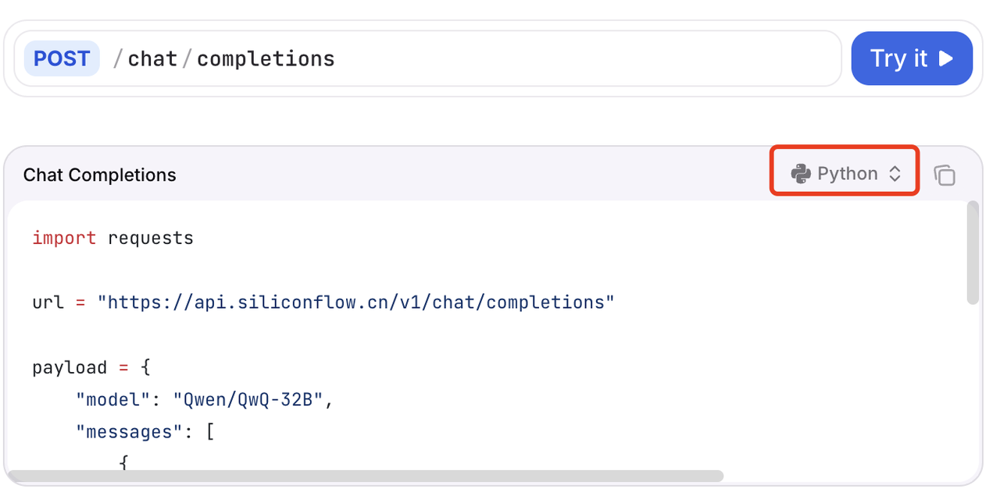

# 环境安装和模型使用方式

## 💻如何在本地电脑运行

要在本地运行代码，你需要先安装某个版本的Python。

然后，克隆仓库：

```bash
git clone https://github.com/828Tina/PromptEngineeringCourse
cd PromptEngineeringCourse
```


## ⚙️安装Miniconda

[Miniconda](https://www.anaconda.com/docs/getting-started/miniconda/main) 是一个轻量级安装器，用于安装 Conda、Python 以及一些包。Conda 是一个包管理器，方便你设置和切换不同的 Python 虚拟环境和包。它也适合安装那些无法通过 pip 获取的包。

请根据自己的设备安装对应的版本。

安装好Miniconda后需要激活环境，激活后才能使用conda命令

```bash
source ~/miniconda/bin/activate
```

确认所有内容都准备好后，就可以开始学习了！

---

## 📝环境配置

### 硬件条件

如果将模型保存到本地运行，经过我们多次实验，我们发现Qwen系列模型规模较小的一些模型（集中于3B以下），回答质量都不算上乘，因此教程里大多使用的是3B、4B等规模的模型，当然，如果使用API调用的方法，可以使用更大规模的模型，比如7B，甚至32B等。

不过，如果在本地运行，由于都没有使用量化技术，对于GPU的要求在20GB左右，一块3090足矣，如果是更小的模型，那么要求也可以降低。

>  本教程基于英伟达芯片进行各个实验。

### 环境搭建

1. python>=3.9
2. pytorch：在[官网](https://pytorch.org/)安装最新版本即可，需要注意的是2.5版本bug较多，不建议使用
3. 其他的python库：transformers、modelscope、vllm等

安装命令：

```python
# 创建环境
conda create -n test python=3.10

# pytorch
pip3 install torch torchvision torchaudio --index-url https://download.pytorch.org/whl/cu118

# 其他
pip install -U transformers modelscope
```


## 🛠️模型运行平台准备

### HuggingFace

如果将模型保存在***本地***，可以使用Huggingface提供的推理代码，在后续的举例中，如果没有特殊说明，我们都会使用Qwen系列模型作为基线模型，关于推理代码，我们使用Qwen官网提供的[推理代码](https://www.modelscope.cn/models/Qwen/Qwen2.5-7B-Instruct)

```python
### 加载模型
from modelscope import AutoModelForCausalLM, AutoTokenizer

model_name_or_path = 'Qwen/Qwen2.5-3B'  # 替换为你下载的模型路径
tokenizer = AutoTokenizer.from_pretrained(model_name_or_path)
model = AutoModelForCausalLM.from_pretrained(model_name_or_path,device_map='auto', torch_dtype='auto')

### 提示词
prompt = "Hello, Who are you?"

### 推理代码
messages = [
    {"role": "user", "content": prompt}
]
text = tokenizer.apply_chat_template(
    messages,
    tokenize=False,
    add_generation_prompt=True
)

model_inputs = tokenizer([text], return_tensors="pt").to(model.device)

generated_ids = model.generate(
    **model_inputs,
    max_new_tokens=512,
)
generated_ids = [
    output_ids[len(input_ids):] for input_ids, output_ids in zip(model_inputs.input_ids, generated_ids)
]

response = tokenizer.batch_decode(generated_ids, skip_special_tokens=True)[0]
print(response)
```

我们所使用的所有的对话模板均和标准对话模板一致，也就是prompt中包含三个不同的角色：`system`、`user` 和 `assistant`。其中 `system` 不是必需的，但有助于设定 `assistant` 的整体行为，帮助模型了解用户的需求，并根据这些需求提供相应的响应。上面的示例仅包含一条 `user` 消息，你可以使用 `user` 消息直接作为 prompt。为简单起见，本指南所有示例（除非明确提及）将仅使用 `user` 消息来作为 `Qwen` 模型的 prompt。上面示例中 `assistant` 的消息是模型的响应。你还可以定义 `assistant` 消息来传递模型所需行为的示例。

不过，在后面的示例中，会有推理型模型，我们使用Qwen3系列模型，其推理代码可以在[官网](https://huggingface.co/Qwen/Qwen3-4B)找到，其实唯一的区别仅在是否开启思考模块，也就是将`enable_thinking`设置为True或者False，其他基本一致。

### vLLM

`vLLM`是伯克利大学[LMSYS](https://zhida.zhihu.com/search?content_id=238989790&content_type=Article&match_order=1&q=LMSYS&zhida_source=entity)组织开源的大语言模型高速推理框架，旨在极大地提升实时场景下的语言模型服务的吞吐与内存使用效率。`vLLM`是一个快速且易于使用的库，用于 LLM 推理和服务，可以和HuggingFace 无缝集成。vLLM利用了全新的注意力算法「PagedAttention」，有效地管理注意力键和值。

vllm在吞吐量方面，vLLM的性能比[HuggingFace Transformers](https://zhida.zhihu.com/search?content_id=238989790&content_type=Article&match_order=1&q=HuggingFace+Transformers&zhida_source=entity)(HF)高出 24 倍，文本生成推理（TGI）高出3.5倍。

简单点说就是vllm框架的推理速度很快，但是显存占用较高，同样的3B模型，本地推理可能只需要15GB左右，而vllm框架则需要37GB。

首先，我们需要在环境里安装vllm库:

```bash
pip install -U vllm
```

然后我们使用Python代码运行，这对离线批量推理非常方便。

我们在使用的时候主要参考的是推理时兼容OpenAI接口的情况，详细可以参考[中文文档](https://vllm.hyper.ai/docs/inference-and-serving/openai_compatible_server)。原理其实很简单，如下图所示，我们本来使用openai的各项服务，通过预设openai的API接口连接openai的服务器，然后使用相应的模型，但是我们如果希望使用本地模型，不希望去使用openai 的服务器准备的模型，因为很有可能因为网络连接的问题导致无法使用模型，那么我们可以使用vllm框架，输入仍是openai的API接口，因为vllm相当于模仿OpenAI搞了另外的路径，然后创建一个独立的后端服务，进而我们就可以使用本地的模型啦。

简单来说vllm相当于使用的仍然是OpenAI的API接口，但是会适配本地模型的调用，本地模型在推理的时候相当于发送一个API请求，绕过了OpenAI的接口。



具体用法可以参考[Qwen模型的vllm用法](https://qwen.readthedocs.io/zh-cn/latest/deployment/vllm.html)。另外，也可以从[官网](https://docs.vllm.ai/en/latest/index.html)获得更加详细的信息。我们简单讲述下我们教程里的使用步骤。

1. 在本地默认端口跑本地模型

开启一个终端，运行下面的代码

```Bash
vllm serve /your/path/of/model
```

当出现下面的提示的时候，表示已经开启对应的服务。



然后我们需要再开启一个终端页面。

2. 开启新的终端页面运行各个代码

在新的终端页面，我们就可以跑我们对应的服务了，需要注意的是，我们使用大模型来进行推理的时候可以使用[openai的prompt的API的接口](https://openai.apifox.cn/api-55352401)或者[messages对应的API接口](https://openai.apifox.cn/api-67883981)等，输入接口参考给出的文档即可，讲起来比较抽象，我们看下代码例子：

*模型生成回答的代码* ：

```python
results = utils.openai_completion(
            prompts=batch_inputs,
            model_name=model_name,
            batch_size=request_batch_size,
            decoding_args=decoding_args,
            # logit_bias={"50256": -100},  # prevent the <|endoftext|> token from being generated
        )
```

*对应的工具utils的* *openai_completion函数*：

```Python
def openai_completion(
    prompts: Union[str, Sequence[str], Sequence[dict[str, str]], dict[str, str]],
    decoding_args: OpenAIDecodingArguments,
    model_name="text-davinci-003",
    sleep_time=2,
    batch_size=1,
    max_instances=sys.maxsize,
    max_batches=sys.maxsize,
    return_text=False,
    **decoding_kwargs,
):
……
……
    completion_batch = client.completions.create(
                prompt=prompt_batch, **shared_kwargs
            )
    choices = completion_batch.choices
    
……
……
```

`completion_batch = client.completions.create`的内容其实使用的就是openai库中的推理问答的函数。

经过这些步骤后，我们在运行推理服务的时候就能充分利用GPU资源，高效完成各项推理任务。

如果不太理解具体如何做，在下面的教程中按照步骤运行相应的文件，不明白原理的可以参考我们的代码。

> 我们还有基于昇腾NPU的vllm[教程](./1.huawei.md)


### API

上面的选择或多或少都对你的硬件条件要求较高，当然，经验丰富的你可能会选择大模型量化，在更低的精度、更低的显存占用、更快的推理速度等来实现推理，但是或许我们会有更好的选择，比如调用API。

大模型的 API 调用，简单来说，是指开发者或用户通过应用程序编程接口（API） 与大模型进行交互，从而利用大模型的能力完成特定任务的进程，这些大模型无需部署到本地，你使用的资源其实是这些厂商提供的服务集群，不仅推理速度快，而且并不占用显存，不过每个模型会有费用的消耗，不一定能免费使用。

1. **阿里百炼**

或者我们也可以使用阿里百炼云平台，其中Qwen系列模型都是最新的，而且性价比也还可以，具体如何使用可以参考[API文档](https://bailian.console.aliyun.com/?spm=5176.12818093_47.resourceCenter.1.223c2cc96V9eQn&tab=api#/api/?type=model&url=https%3A%2F%2Fhelp.aliyun.com%2Fdocument_detail%2F2712576.html)，文档内容非常详细，在此就不再赘述如何使用。



2. **硅基流动**

那我们简单找一个网站，比如[硅基流动](https://cloud.siliconflow.cn/sft-d1n0sv33jrms738gmgpg/models)，很多10B以下的小模型可以免费使用，而更大的模型的费用也不是很高，那我们找到Qwen3-8B的模型来实验下：


我们选择[API文档](https://docs.siliconflow.cn/cn/api-reference/chat-completions/chat-completions)，里面就有详细的创建文本对话请求的教程，我们使用Chat Completions的Python版本，



将代码复制，其中的`model`更改为我们需要的模型，要记住，只能是硅基流动的模型广场里有的模型，没有上架的模型会报错。然后其中的`Authorization`需要我们的api_key，`messages`可以进行多轮对话，具体的推理代码可以在我们的代码中找到。


