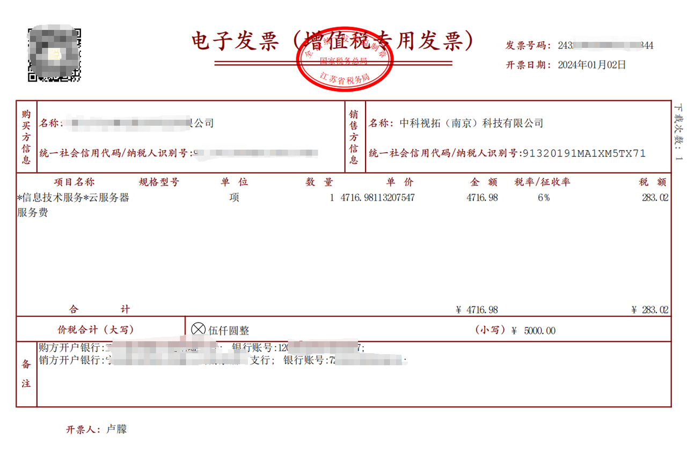
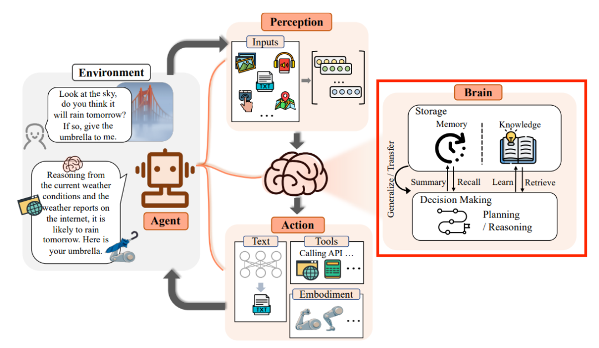
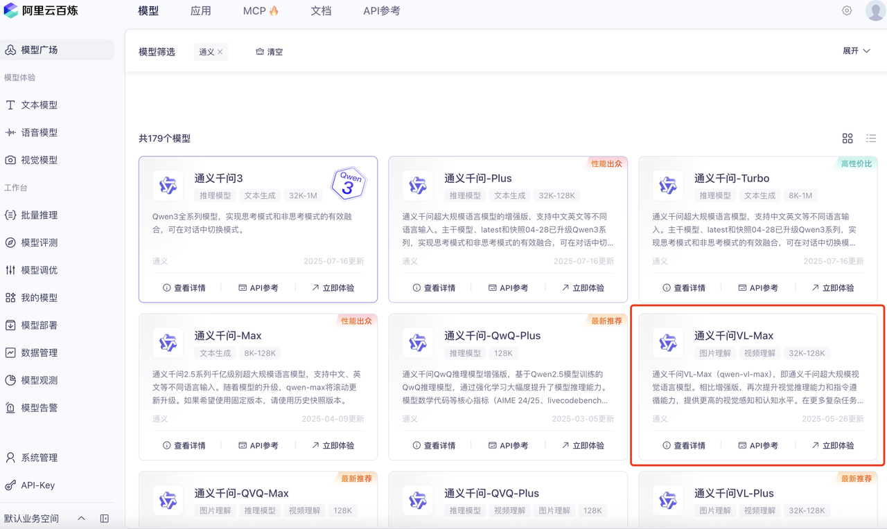
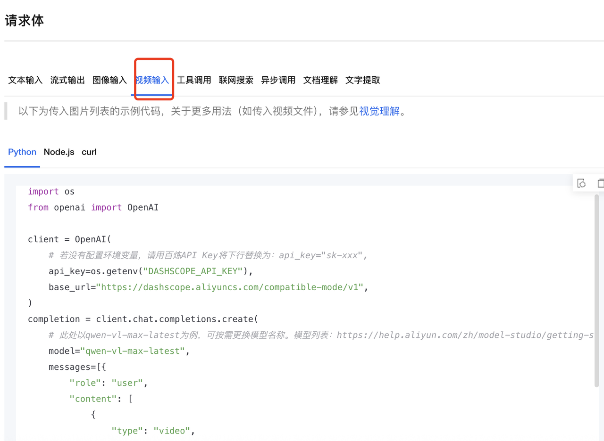

# 多模态提示词

多模态模型能够同时理解、处理、生成文字、图像、语音、视频等多种信息，多模态模型大致分为理解型模型和生成类模型，其中理解型模型输入多模态信息，输出是文字类型，而生成类模型输入可以是多模态信息，输出也是多模态类，比如让模型生成一张“阳光下的彩虹”的图像，多模态生成类模型就能够生成精美的图像。

简单来说，单模态模型仅有文字，相当于人类仅能对话，看不到图像、听不到声音、说不出话，多模态模型相当于赋予模型人类的五感，它不仅能够去认识我们的这个文字，还能听懂我们的语音，看到我们的图片，理解我们的视频。

本节我们将针对多模态模型设计提示词，当输入是由文字、图像、视频、音频等多种模态组成的信息时，如何引导AI生成我们理想的结果。

使用的模型为Qwen系列模型，其中图像和视频都由Qwen2.5-vl模型实现。关于推理代码，我们可以从[modelscope官网](https://www.modelscope.cn/models/Qwen/Qwen2.5-VL-7B-Instruct)得知。

## 图像理解

对于多模态模型，提示词的设计需要注意下面几点：

1. 准确清楚
2. 必要情况下，对图像进行标记

首先是**清楚的表达**，比如你在分析一张发票的时候，如果仅仅需要金额数据，但是没有表达清楚，那么可能默认输出所有的数据，比如：

*提示词* ：



```Plain
请提取发票中的信息，并按照json格式输出
```

*结果* ：

```Plain
{
  "发票号码": "243xxxx344",
  "开票日期": "2024年01月02日",
  "购买方信息": {
    "名称": "xxx有限公司",
    "统一社会信用代码/纳税人识别号": "xxxx"
  },
  "销售方信息": {
    "名称": "中科视拓(南京)科技有限公司",
    "统一社会信用代码/纳税人识别号": "91320191MA1XM5TX71"
  },
  "项目名称": "*信息技术服务*云服务器服务费",
  "规格型号": "",
  "单位": "项",
  "数量": "1",
  "单价": "4716.98113207547",
  "金额": "4716.98",
  "税率/征收率": "6%",
  "税额": "283.02",
  "合计": "￥4716.98",
  "价税合计": "伍仟圆整 (小写): ￥5000.00",
  "备注": {
    "购方开户银行": "中国工商银行股份有限公司南京xxx支行",
    "银行账号": "120xxxx7",
    "销方开户银行": "中国工商银行股份有限公司南京xxx支行",
    "银行账号": "7"
  }
}
```

*准确的提示词* ：

```Plain
请提取发票中的给出的合计的金额，并按照json格式输出
```

*结果* ：

```Plain
{
  "合计金额": "4716.98"
}
```

其次，如果图像中元素过多，可以对我们需要询问的对象**单独框出**，然后让模型理解问题，比如：




*提示词* ：

```Plain
请你解释红框中的原理
```

*回答* ：

<details>
<summary>点击展开完整回答内容</summary>


```Plain
红框部分展示了大脑的内部工作原理，具体包括记忆、知识存储、决策制定和推理等过程。以下是这些部分的详细解释：

1. **记忆（Memory）**：
   - 大脑通过感知输入的信息来形成记忆。这些信息可以是视觉、听觉或其他感官输入。
   - 记忆存储在大脑的不同区域，例如海马体负责短期记忆，而杏仁体则与情绪记忆有关。

2. **知识（Knowledge）**：
   - 知识是从记忆中提取并组织起来的信息。它包括事实、规则、经验和技能等。
   - 知识可以通过学习（Learn）获得，并且可以被存储在大脑的长期记忆中。

3. **决策制定（Decision Making）**：
   - 决策制定是基于记忆和知识的过程，涉及到对信息进行评估和选择。
   - 这个过程通常涉及多个步骤，包括问题识别、信息收集、分析、评估和选择行动方案。

4. **推理（Reasoning）**：
   - 推理是使用已有的知识和信息来推导出新的结论或解决方案的过程。
   - 它可以是演绎推理（从一般到特殊），也可以是归纳推理（从特殊到一般）。

5. **生成/转移（Generate/Transfer）**：
   - 生成是指将新信息添加到记忆库中，或者创建新的知识结构。
   - 转移则是指将已有的知识应用到新的情境中，以便做出适当的决策或采取行动。

6. **总结（Summary）**：
   - 总结是对大量信息进行简化和概括的过程，以便更好地理解和处理。
   - 这有助于提高决策效率和准确性。

7. **回忆（Recall）**：
   - 回忆是从记忆中提取特定信息的过程。
   - 这对于解决问题和执行任务至关重要。

8. **学习（Learn）**：
   - 学习是指通过经验获取新知识和技能的过程。
   - 这可以通过观察、实践和反馈等方式实现。

9. **检索（Retrieve）**：
   - 检索是从记忆中找到所需信息的过程。
   - 这对于快速响应和解决问题非常重要。

综上所述，红框部分展示了大脑如何通过记忆、知识、决策制定和推理等过程来进行信息处理和决策制定。这些过程相互关联，共同构成了大脑的功能基础。
```

</details>

<div style="background:#e7f5ff;color:#000;padding:12px 16px;border-left:4px solid #74c0fc;">
可以看到模型仅对于红框中的内容进行了分析和翻译，然后给出结果，这样框出指定位置然后提出问题的方式比修改提示词再询问要更加准确。
</div>

## 视频分析

多模态模型也可以用来分析视频，不过在实际使用的时候，由于视频需要的资源都比较多，因此本地推理时显存占用一般承受不起，所以本节我们使用API接口实现，我们使用[阿里云百炼平台](https://bailian.console.aliyun.com/console?tab=model#/model-market)，通过调用视觉模型的API接口在本地做一个demo：

1. 选择模型

首先，我们在[模型广场](https://bailian.console.aliyun.com/console?tab=model#/model-market)中找到Qwen-VL系列模型，本次我们选择Max，



点击**API参考**，然后找到视频输入



不过该部分仅涉及视频中某帧对应的图像的分析，而不是连贯的视频的分析，如果想分析完整的视频，需要去[视觉理解](https://bailian.console.aliyun.com/console?tab=doc#/api/?type=model&url=https%3A%2F%2Fhelp.aliyun.com%2Fdocument_detail%2F2845871.html%2380dbf6ca8fh6s)中找到对应的API调用代码，其中接口和OpenAI兼容，我们只需要输入对应的视频的链接即可：

```Python
### 视频推理
import os
from openai import OpenAI

client = OpenAI(
    # 若没有配置环境变量，请用百炼API Key将下行替换为：api_key="sk-xxx",
    api_key="sk-",
    base_url="https://dashscope.aliyuncs.com/compatible-mode/v1",
)
completion = client.chat.completions.create(
    model="qwen-vl-max-latest",
    messages=[
        {"role": "system",
         "content": [{"type": "text","text": "You are a helpful assistant."}]},
        {"role": "user","content": [{
            # 直接传入视频文件时，请将type的值设置为video_url
            # 使用OpenAI SDK时，视频文件默认每间隔0.5秒抽取一帧，且不支持修改，如需自定义抽帧频率，请使用DashScope SDK.
            "type": "video_url",            
            "video_url": {"url": "https://help-static-aliyun-doc.aliyuncs.com/file-manage-files/zh-CN/20241115/cqqkru/1.mp4"}},
            {"type": "text","text": "这段视频的内容是什么?"}]
         }]
)
print(completion.choices[0].message.content)
```

*回答* ：

```Plain
这段视频展示了一位年轻女性的特写镜头。她有着短发，面带微笑，看起来非常开心和友好。她的穿着是一件粉色的针织开衫搭配白色的内搭，整体风格显得很清新自然。背景模糊，但可以看出是在户外，可能是一个校园或住宅区。

视频中的女性表情生动，笑容灿烂，给人一种温暖和愉快的感觉。她的目光时而直视镜头，时而微微侧头，展现出不同的神态。整个视频传达出一种积极向上的氛围，可能是用于宣传、教育或其他正面主题的内容。

此外，视频右上角有“通义·AI合成”的字样，表明这段视频可能是通过人工智能技术合成的。
```

至此，已完成了视频分析的任务。


## 音频分析

音频多模态大模型在短短两年间完成了从“听懂字”到“听懂声”的跨越。早期系统沿用ASR-TTS链路：先将语音转文字，再由LLM生成文本，最后合成语音。该方案成熟、易训，却丢失了音色、情绪、环境噪声等非符号信息，也无法回答“这段笑声是苦笑还是讪笑”这类需要声学特征的问题。新一代端到端音频大模型直接对离散化的声学token进行建模，把语音、音乐、环境声统一压缩成共享语义空间。训练时，模型同时预测下一帧声学token和对应的文本token，实现跨模态对齐；推理时，可直接以声学条件做prompt，输出声学token后流式解码为波形，无需显式文字。其难点在于计算量：一秒音频可对应数百个声学token，需引入RVQ降采样、稀疏注意力、局部-全局双层Transformer等技巧，才能将上下文拉到分钟级。实际落地中，两种路线并非互斥。客服、导航等对精度敏感、延迟容忍高的场景仍倾向ASR-TTS，可控且易纠错；社交、创作、情感陪伴类应用更青睐端到端声学LLM，可保留副语言信息并生成更自然的韵律。未来趋势是“可路由混合架构”：系统先用轻量听写模型判断是否需要保留声学细节，简单请求走文本LLM，复杂情感请求走声学LLM，实现成本与体验的动态平衡。


