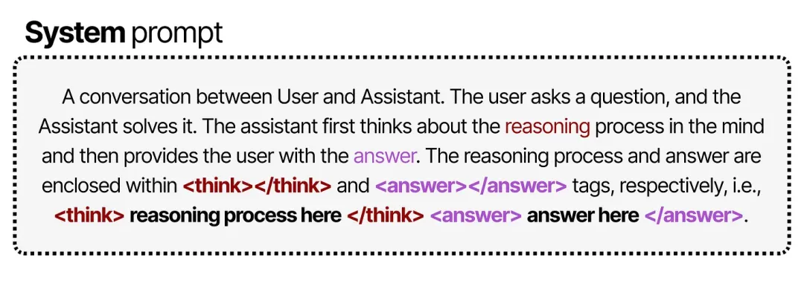
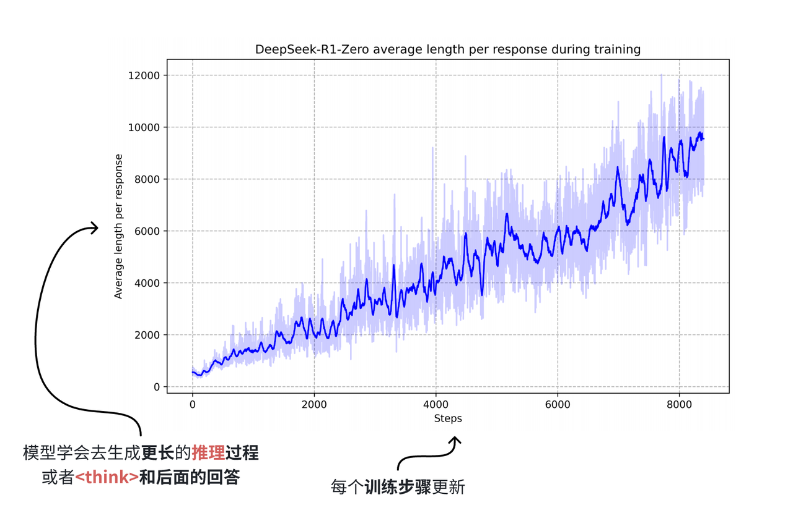

## 为什么需要合成数据？

在了解为什么需要合成数据前，我们先简单了解下何为“合成数据”。

合成数据（Synthetic Data）是指用算法、生成模型或仿真程序“造”出来的数据，它模仿真实世界数据的统计分布和结构，但并不直接来源于真实观测，在此教程里，合成数据是由大模型根据不同的提示词生成的数据。

为什么需要合成数据，其实核心的核心是数据的`质量问题`，我们知道，对于大模型来说，优秀的大模型往往需要经过预训练、后训练，后训练包含微调、强化训练等，关于每个阶段训练使用的数据，其`数据质量`对于每个阶段来说有些微的不同，不过每个阶段的共同点是都需要数据的`丰富度`。

下面我们针对每个阶段的合成数据进行细致的分析，讨论为什么需要合成数据。


### 预训练阶段的合成数据

我们知道，早期的大模型（204年前），大模型的性能提升着重于预训练阶段，早期提到的[Scaling Law法则](https://arxiv.org/pdf/2001.08361/1000)中，我们得知，模型规模、数据规模和模型性能之间呈现幂律增长的趋势，当模型参数量和训练数据规模同时增长的时候，模型性能有稳定的提升。下图展示了Scaling Law的图表原理[1]：


因此在当时的学者看来，训练数据越多，模型就能越大，模型表现就能越好，这不难理解，就跟人类18岁以前的学习一样，15-18岁必然比12岁左右懂得知识多，理解也会更深刻。

在大模型发展的早期，OpenAI的GPT系列模型可谓是AI领域的领头羊，其中GPT-3，后面经过后训练得到的GPT-3.5不仅拥有超大规模的参数量（175B，当然现在的模型参数量甚至有1TB，但在当时已经是模型规模的极限），而且在零样本/少样本领域能力突出，拥有2k多tokens窗口的上下文理解能力，在各个领域的应用都非常显著。而能拥有如此强大的通用性能力，和预训练阶段庞大的数据规模密不可分，在GPT-3的论文里[Language Models are Few-Shot Learners](https://proceedings.neurips.cc/paper_files/paper/2020/file/1457c0d6bfcb4967418bfb8ac142f64a-Paper.pdf)，作者给出GPT-3的训练数据分布[2]：


根据Scaling Law法则得知，这个规模的数据对应的模型规模175B已经是模型性能提升的极限，而在[洪永淼、汪寿阳：ChatGPT 与大模型将对经济学研究范式产生什么影响?](https://mp.weixin.qq.com/s?__biz=MzI0NzY3MzkzNw==&mid=2247485830&idx=1&sn=5a4111e768b12233909d1af0b096a1f4#:~:text=ChatGPT的第一个版本GPT-1，其参数数量为1.17亿，这是非常庞大的数量。在GPT-2版本中，模型参数数量从1.17亿上升到15亿，训练数据也增加了。在GPT-3版本中，参数数量达到1750亿个，并使用大约2%2F3互联网数据、整个维基百科以及2个大型图书馆数据进行训练。)一文中指出，GPT-3的预训练模型使用大约2/3互联网数据、整个维基百科以及2个大型图书馆数据进行训练，由于数据需要经过去重、清洗，事实上，GPT-3预训练使用的互联网数据规模基本是能获取的数据规模极限，因此模型规模也没有再有提升的空间。

但是我们知道对于科学的探索是无止境的，在数据和模型规模都到达瓶颈的情况下，如何提升模型性能呢？

[Textbooks Are All You Need](https://arxiv.org/pdf/2306.11644)这篇论文思考在预训练阶段如果对数据质量提升，能否提升模型性能。

作者给出的答案是肯定的，并且开创性的在论文中提出，预训练阶段“教科书”级数据能够给模型带来非常不错的提升，并且认为后面的大模型的发展取决于合成数据，当然从现在看来，这并不是模型发展的未来，在2025年的今天，模型发展到了后训练阶段。不过即便如此，在当今社会，合成数据仍然是各个AI行业不可或缺的一环。

我们接着回到论文的讨论，作者认为，在预训练阶段，数据集的质量集中在`多样性`、`去除噪声`以及`教科书`。

`1、多样性`：

这一点其实很好理解，所有的大模型在预训练阶段既要保证数据主题的广泛性，要涵盖尽可能多的知识点，也要保证数据不会有明显的重复。

重复数据对于模型训练来说基本是毁灭性的打击，如果数据中存在大量重复内容（例如同一篇文章被多次收录），模型会优先 “记住” 这些重复信息，而非学习背后的通用模式，泛化能力降低，同时会人为放大某类信息的占比，导致模型误以为这类信息更重要或更常见。

`2、去除噪声`：

我们知道训练大规模语言模型，预训练数据大多来源于互联网数据，在互联网中存在大量会干扰模型学习有效规律、导致模型学到错误模式或者降低泛化能力的内容，比如网页中存在的各种营销类文本、HTML 标签（如<div><p>）、表格乱码，同时可能存在大量无意义内容，比如很多的随机字符如 （“qwertyuiop”）、重复堆砌的短句（如 “加油加油加油……”）、空白或乱码（如 “�￥%”）。

在常见任务示例中，我们使用Qwen2.5-base模型有可能会出现大量无意义重复表情包，这很有可能是预训练数据集中存在的噪声未被及时清理并且训练过拟合。因此去除噪声是保证数据质量的又一关键要素。

不过需要注意的是，高质量的判定并不包含Toxic信息，也就是有毒内容，因为即便是涉及安全类信息，只要不是重复性高、多样化程度低的数据其实都算高质量数据，而有毒内容的剔除往往是后训练阶段处理。

`3、教科书数据`：

其实我认为这一概念的提出和当时学者对于大模型的定位有关，在攻克了自然语言处理任务后，大模型充当问答辅助工具或者对话工具，而如果跟现实联系起来，大模型就很像是经验丰富的“老师”，那要想成为这样的老师，学习“教科书”数据显然能够大幅度提升模型的能力，但是这类数据在网络上其实并不多，大多数还是类似于科普类专业数据。即便将所有的“教科书”数据提取出来并数据清洗去重，得到的结果其实也有偏向，比如数学类比较多，文学类比较少，这样训练出来的模型很有可能发生过拟合的现象。

基于此，Phi论文[3]的作者认为可以用大模型合成“教科书”数据，一来GPT-3拥有广泛的知识储备和问答能力，合成的数据自然在`多样性`上不会有问题，并且合成的`噪声`也不会很多；其次因为强大的零样本/少样本学习能力，模型能够很好的理解提示词并生成高质量的回答，只要设定好对应的`受众群体`，比如对于面向年幼儿童的教科书，内容需要使用非常简单、日常的语言和短句，以便10岁左右的孩子能够轻松理解；对于面向专业人士和研究人员的教科书，内容则需要深入探讨主题，包括对最新研究成果和领域内辩论的批判性分析；而对于面向高中生的教科书，内容需要平衡教育的严谨性和可访问性。使用的语言和例子应该能够与青少年学生产生共鸣，同时激发他们对日常生活相关性的好奇心。对于不同的`受众群体`，提示词的构建也会有相应的调整，在[huggingface的博客](https://huggingface.co/blog/zh/cosmopedia)中提到了*少儿、专业人士和研究人员以及高中生生成相同主题的教科书的提示：*[4]


而面对不同的群体，哪怕是同一个知识点，不同群体之间的关联度其实很低，你将化学元素周期表跟小孩子讲，他们大概率连字都不认识，而对于高中生而言，这只不过是他们日常试题的一部分，因此这样生成的数据，即便背后的知识一致，也不会导致重复性数据，从而训练过拟合，而这样生成的数据，规模是成倍增长的，并且由于大部分知识可以从网络知识中获取，那么“教科书”数据可以确保数据质量和规模。

不过，为了保证模型不会完全在“教课”这一条路上走到黑，Phi的作者将网络数据和教科书数据混合训练模型，成果相当不错，不过模型规模只有3B，因为Scaling Law法则的影响，毕竟数据规模就那么大，模型规模也大不到哪里去。那我们就提出疑问了，既然“教科书”数据这么强，何不把所有的网络数据改造成合成数据？这样数据规模扩大了，那模型规模不也能接着扩大？

答案是不行。事实上预训练阶段模型训练的其实是“常识”，对于网络数据源，其中的专业知识类是必不可少的，如果转换成“教科书”，训练出来的模型就会偏向于各个阶段的教育，这其实也是一种降低泛化能力的行为。那如果将“教科书”数据和大规模网络数据混合呢？

答案也是不行，因为就像是数学类比较多，文学类比较少的这种有明确占比的网络中的教科书数据，如果只是简单的叠加这类数据，事实上是增加“教科书”数据的占比，那么模型训练的结果必然是偏向于这一类的，从而导致通用泛化能力降低。

讲了这么多，其实对于预训练阶段，使用大模型合成数据确实能够提升模型的整体性能，而这类数据需要注意`多样性`、`去除噪声`以及可以适当采用`教科书数据`，这些都是保证预训练阶段数据质量的关键。


### 微调阶段的合成数据

在理解微调阶段为什么需要合成数据前，我们先需要知道为什么大模型需要微调、微调阶段需要什么样的数据。

大模型经过预训练后，已经具备了基础的语言理解和生成能力，但这些能力更多是通用层面的。在实际应用中，不同场景对模型的要求千差万别，比如企业需要模型能精准处理法律合同审查，金融机构希望模型能高效分析市场动态，医疗机构则期待模型能辅助疾病诊断。这时候，**微调就成了让大模型 “术业有专攻” 的关键步骤**，通过在特定任务或领域的数据上进一步训练，让模型适配具体需求，提升在目标场景下的性能。

而微调的效果，很大程度上取决于数据的质量和适配性。微调阶段对数据有着明确且严苛的要求。首先，**数据质量必须足够高**，需要准确、规范、无歧义，避免错误信息误导模型学习。其次，在格式上，微调数据基本以问答格式为主，因为这种格式能直接对应模型的交互场景，让模型学习到 “输入问题→输出答案” 的映射逻辑。对于更复杂的场景，多轮对话格式的数据也必不可少，它能帮助模型理解上下文关联，提升连续交互能力。

更重要的是，微调数据往往需要专注于某一特定领域，比如法律、金融、医学等。以法律领域为例，可能需要大量 “如何认定合同无效”“离婚财产分割的法律依据是什么” 这类专有问答数据；金融领域则需要 “股票期权的风险如何评估”“企业债券发行的流程是什么” 等专业内容。这些领域专有问答数据，是让模型掌握专业知识、形成领域思维的核心素材。

然而，现实情况是网上这类高质量的领域专有问答数据非常稀少。早期获得这类数据更多的依赖于人工标注，但是面对日益扩大的模型规模和任务需求，人工标注不仅耗时耗力，而且人工标注多多少少都会有偏向性从而无法保证数据的`丰富度`，因此最初大家都在往预训练阶段发力。

随着[Stanford Alpaca: An Instruction-following LLaMA Model](https://arxiv.org/pdf/2212.10560)论文发布，由预训练GPT-3通过设定的提示词合成指令数据，然后清洗、去重等，最终用合成的指令数据对Llama模型进行微调，得到的Llama-Instruct模型在各个测试数据上都取得了不错的效果。

下面我们详细解释论文中数据是如何生成的。


上图是Alpaca论文中的数据集合成完整流程[5]，完整的数据合成流程分为四步，分别是1）生成任务指令，2）判断指令是否属于分类任务，3）采用输入优先或输出优先的方式进行实例生成，4）过滤低质量数据

1. 生成任务指令：首先需要人工编写多个种子任务，这些种子任务其实就是正常的问答，不过要添加任务主题，还有任务类型，比如下面的[例子](https://github.com/tatsu-lab/stanford_alpaca/blob/main/seed_tasks.jsonl)：

```json
{
    "id": "seed_task_0", 
    "name": "breakfast_suggestion", 
    "instruction": "Is there anything I can eat for a breakfast that doesn't include eggs, yet includes protein, and has roughly 700-1000 calories?", 
    "instances": [{"input": "", "output": "Yes, you can have 1 oatmeal banana protein shake and 4 strips of bacon. The oatmeal banana protein shake may contain 1/2 cup oatmeal, 60 grams whey protein powder, 1/2 medium banana, 1tbsp flaxseed oil and 1/2 cup watter, totalling about 550 calories. The 4 strips of bacon contains about 200 calories."}], 
    "is_classification": false}
```

`name`是主题，`is_classification`判断任务类型是否属于分类任务。论文中给出的种子数量仅有175条，这些种子任务目的是为了后续模型生成的时候有参照的模板，类似于`few-shot`的例子部分。由于任务种类较少，因此第一步是让大模型模仿并扩展任务指令，从任务池中采样8个任务，其中6个是种子任务的，2个是新生成的（任务池随着每次迭代更新数据，因此后续会有新生成的指令任务），


作为few-shot的例子部分，从task9开始让大模型生成新的task和instruction作为新的指令[5]，然后生成、数据过滤、去重清洗、加入到任务池中反复执行，从而扩展了大量的任务指令。

2. 判断指令是否属于分类任务：分类任务要先生成output，也就是标签，再生成input；不是分类任务的话先生成input再生成output（分类任务先生成标签是为了确保input不会偏离标签，因为本身由于instruction 的不同，模型生成的input有偏向，先生成了output确保生成的input不会偏离output标签；非分类任务由于output是跟着input走的，而不是像label一样是固定的，因此先生成input然后输出output）。这里需要注意的是，input和output都是GPT-3生成的，因为你的目标是生成数据集，而不是和模型问答。

3. 采用输入优先或输出优先的方式进行实例生成：第二步判断了是否属于分类任务，当明确了任务类型后，就能使用大模型生成对应任务类型的数据，比如我们看个例子：

   ```text
   # 分类任务
   
   Given the classification task definition and the class labels, generate an input that
   corresponds to each of the class labels. If the task doesn’t require input, just generate the
   correct class label.
   
   Task: Classify the sentiment of the sentence into positive, negative, or mixed.
   
   Output(Class label): mixed
   Input(Sentence): I enjoy the flavor of the restaurant but their service is too slow.
   
   Output(Class label): Positive
   Input(Sentence): I had a great day today. The weather was beautiful and I spent time with friends.
   
   Output(Class label): Negative
   Input(Sentence): I was really disappointed by the latest superhero movie. I would not recommend it.
   
   # 非分类任务
   
   Instruction: Given an address and city, come up
   with the zip code.
   Input:
   Address: 123 Main Street, City: San Francisco
   Output: 94105
   ```

4. 过滤低质量数据：这一步通过过滤、去重等操作，将新的数据投放到数据池作为后续的数据生成数据池。过滤用的是指令过滤，方法是计算新生成的指令与现有指令之间的相似性（如ROUGE-L相似度）。如果新指令与现有指令的相似度超过某个阈值（如0.7），则认为该指令是重复的，将其过滤掉；关键词过滤检查指令中是否包含某些特定关键词（如“image”、“picture”、“graph”等），这些关键词通常表示任务超出了语言模型的处理范围；重复性检查生成的实例是否与现有实例完全相同，或者输入相同但输出不同；质量检查通过启发式规则（如指令长度、输入长度、输出长度等）来识别无效或低质量的生成内容。例如，指令过长或过短，输出是输入的重复等。

<div style="background:#e7f5ff;color:#000;padding:12px 16px;border-left:4px solid #74c0fc;">   综上所述，在微调阶段，合成数据是非常重要的，因为大模型合成的指令数据不仅在质量上有所保障，并且可以弥补人工标注的弊端，合成大量数据。<br/></div>


### 具备“思考过程”的合成数据

“思考能力”其实是近一年左右逐渐发展的概念，主要应用于后训练阶段，希望模型在具备基本的问答能力的同时，多加一个思考模块，这个思想是从DeepSeek-R1爆火开始。

具备“思考能力”数据集，顾名思义，在原始问答对基础上，增加了思考模块的数据。在前文我们提到随着模型规模的扩大，互联网数据几乎被全部用于预训练，即使有合成数据的帮助，在2024年也到了瓶颈，而2025年年初，DeepSeek凭借R1模型爆火了一把，R1凭借其独特的思考模块和能力，还有独特的训练方式，稳居当时开源模型的榜首，而也正是因为其思考能力，让合成数据再一次突破了数据规模的瓶颈，在原始问答对基础上只是增加think部分，模型性能就有很大的提升，尤其表现在数学推理等任务当中。

“思考型”数据基本只能由合成数据构成，因为互联网基本不会存在这种数据，而人工标注也基本不可能，简单的问答对或许还有实现的希望，增加或错或对的思考过程，基本只能由大模型本身的生成能力才能实现。

在DeepSeek-R1发布的[技术报告](https://arxiv.org/pdf/2501.12948)中，R1的基线模型是DeepSeek-V3，经过多步合成数据，通过微调的方式对V3进行微调，从而获得R1，而合成的数据大部分是V3通过GRPO强化学习方式生成的推理数据，外加少部分非推理数据，使得V3具备思考能力，具体的流程可参考下图[6]：


其中我们所说的“思考型”数据，在R1的整体生成流程中，GRPO强化学习阶段，模型生成而来，然后用生成的数据对V3进行微调，最终得到的R1。

在GRPO阶段，从V3到R1-Zero的过程中，DeepSeek团队对system提示词加以改造：



上图是GRPO过程中提示词的内容[7]，可以看到，虽然提示中明确要求在 `<think>` 标签内写出推理过程，但并未对推理过程的具体形式做任何规定。

在强化学习阶段，他们基于规则设计了两类奖励：

1. **准确度奖励（Accuracy rewards）**：通过测试答案的正确性来给予奖励。
2. **格式奖励（Format rewards）**：对使用 `<thinking>` 和 `<answer>` 标签的行为给予奖励。

对于那些导致答案正确的所有决策——无论是特定的 token 序列还是推理步骤——都会在训练中获得使其更有可能被采纳的权重调整。

而对于那些导致答案错误的所有决策，则会在训练中获得使其更不可能被采纳的权重调整。


有意思的是，该提示并没有给出 `<think>` 过程应当如何呈现的示例，只是要求在 `<think>` 标签内进行思考，无需更多细节。通过向模型提供与思维链（Chain-of-Thought）相关的间接奖励，模型逐渐自主学会：当推理过程更长、更复杂时，答案更可能是正确的。



通过这样的训练流程，研究人员发现，模型能够自发地探索出最优的链式推理模式，并展现出如自我反思、自我验证等高级推理能力。

不过，这种做法仍存在一个显著缺陷：其输出的可读性不佳，而且有时会混用多种语言，这是仅用强化学习导致的弊端，没有微调阶段对回答模式加以限制，推理时错误的概率就会比较高。为了解决这个问题，团队转而研究另一种思路，在后续GRPO学习中添加了语言类的奖励信号，同时因为V3-Base强大的生成能力，通过V3-Base合成的“思考型”数据作为微调时所用的微调数据，对预训练模型进行微调，就能让模型快速学会这种思考方式。

总结下来，“思考型”数据只能由模型生成，当然质量问题是基础，不过可能模型生成的“思考型”数据也不一定质量很高，因为可能存在大量重复思考过程，更重要的是，现有的数据中基本没有包含思考过程的数据。

因此合成数据对于提高模型思考推理能力是必要的，想要让模型具备思考能力，要么通过强化训练自己合成数据自己微调，这对于模型的规模要求较高，因为小规模模型不一定有强大的能力；要么通过知识蒸馏，把大模型具备的思考能力迁移到小规模模型中。


---

### 参考资料

[1].[Scaling Laws for Neural Language Models](https://arxiv.org/pdf/2001.08361)


[2].[GPT-1, GPT-2, GPT-3, GPT-3.5, GPT-4论文内容解读](https://blog.csdn.net/BGoodHabit/article/details/130134446?ops_request_misc=%257B%2522request%255Fid%2522%253A%25226ee3a9ef15f6a61581e883f22d069f12%2522%252C%2522scm%2522%253A%252220140713.130102334.pc%255Fblog.%2522%257D&request_id=6ee3a9ef15f6a61581e883f22d069f12&biz_id=0&utm_medium=distribute.pc_search_result.none-task-blog-2~blog~first_rank_ecpm_v1~rank_v31_ecpm-1-130134446-null-null.nonecase&utm_term=gpt&spm=1018.2226.3001.4450)

[3].[Textbooks Are All You Need II: phi-1.5 technical report](https://arxiv.org/pdf/2309.05463)

[4].[Cosmopedia: how to create large-scale synthetic data for pre-training](https://huggingface.co/blog/zh/cosmopedia)

[5].[Stanford Alpaca: An Instruction-following LLaMA Model](https://arxiv.org/pdf/2212.10560)

[6].[基于Qwen模型在SwanLab上复现DeepSeek-R1-Zero](https://zhuanlan.zhihu.com/p/24304658839)

[7].[A Visual Guide to Reasoning LLMs](https://newsletter.maartengrootendorst.com/p/a-visual-guide-to-reasoning-llms)


