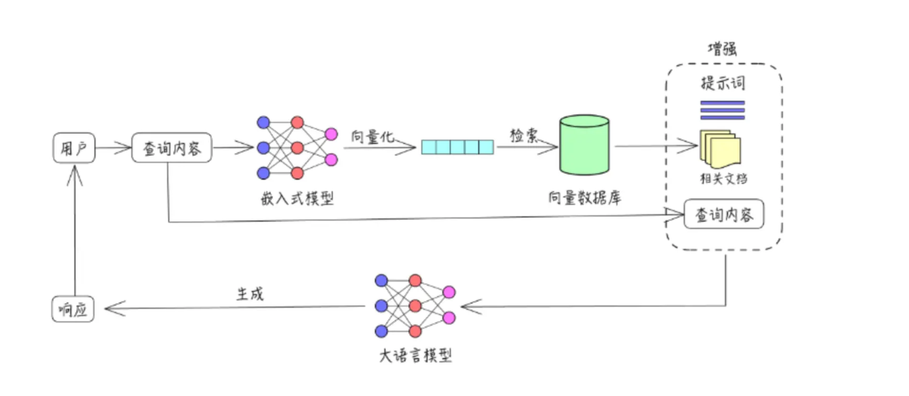
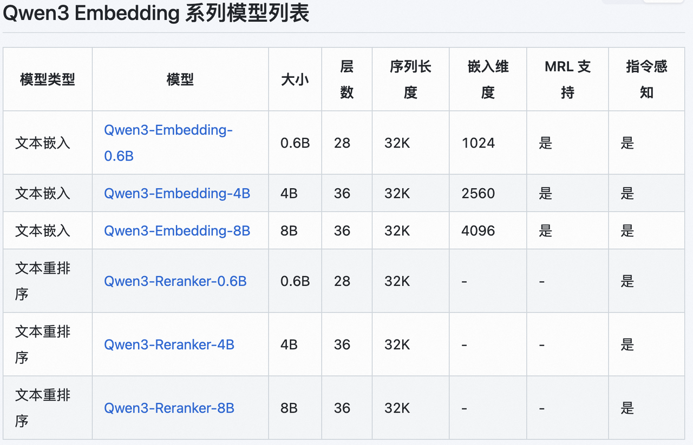

# RAG检索

当我们向大模型询问大模型不知道的知识的时候，大模型可能会因为“幻觉”即使不知道答案，毕竟大模型在训练时候使用过的数据集通常来说不会紧跟时事训练，大部分的知识在预训练阶段灌输，在微调阶段进行回答的调试。因此大模型会胡乱用相似的知识为我们做出回答，但是很明显不会是我们想要的，那有什么方法是可以不用随时训练大模型就能让大模型回答正确呢？答案是RAG。

大模型 RAG（检索增强生成）是一种结合大语言模型与检索技术的混合系统，其核心原理是在生成回答前，先从外部知识库中检索与问题相关的信息，再将这些精准信息作为上下文输入大模型，辅助其生成回答，**大模型只充当了回答的角色**。这种模式的优势显著，既能增强回答的准确性，有效减少大模型常见的 “幻觉” 问题，又能利用最新数据弥补模型训练数据的滞后性，同时降低对模型参数量的依赖以节省计算成本。不过，RAG 也存在一定劣势，检索质量直接决定结果优劣，高度依赖知识库的完整性与准确性；在多轮对话中上下文管理较为复杂，容易出现信息冗余或遗漏；且对长文档的处理效率较低，可能因检索范围有限而遗漏关键内容。

我们可以看下RAG原理：



我们简单的把RAG过程分割成三个部分，根据RAG的英文全称是Retrieval-Augmented Generation，理论上应该分割成`检索`、`增强`、`生成`，不过`检索`部分可以类比成`存储+检索`，多加了一个词，是不是原理就更清晰了呢？我们拆分下：

1. `存储+检索`：将文档内容分割、转换成向量格式、检索相似性较高的文档切片
2. `增强`：设计提示词，将用户的问题+文档切片内容结合作为查询内容
3. `生成`：使用大模型对`增强`后的提示词生成响应

简单讲完RAG原理，虽然感觉听懂了，但是还是有点抽象对吗？那么我们接下来用一个简单的代码示例来完整讲述RAG：

## 构建向量数据库

首先我们构建一个向量数据库，用来存储文档切片转换成的向量内容。该数据库函数包含添加向量、检索向量两部分功能，其中检索向量我们需要使用embedding模型计算向量相似度，embedding模型我们使用`Qwen3-embedding`模型，Qwen3提供了0.6B、4B、8B等，由于我们就是简单做一个RAG，因此我们使用最小的0.6B模型，对资源消耗不是很高，大约2-3GB的显存占用，但是注意，不要重复运行加载代码，显存会累积占用，多次运行加载代码会耗费很多资源。

话不多说，我们看下代码：

```Python
### 1、加载embedding模型
from sentence_transformers import SentenceTransformer

embedding_model_path = "/your/path/of/Qwen3-Embedding-0.6B"
embedding_model = SentenceTransformer(embedding_model_path)
```

<div style="background:#fff3cd;color:#000;padding:12px 16px;border-left:4px solid #ffeaa7;">   ⚠️ 加载模型的代码不能重复运行，否则会累积显存 </div>

```Python
### 2、构建向量数据库
import numpy as np
from typing import List, Dict, Optional

class VectorStorage:
    """简单向量存储类，仅负责向量的存储功能"""
    
    def __init__(self):
        """初始化向量存储"""
        self.vectors = []  # 存储向量
        self.metadata = []  # 存储向量对应的元数据
        self.dim = None  # 向量维度
    
    def add(self, vector: List[float], metadata: Optional[Dict] = None) -> int:
        """
        添加向量到存储
        
        参数:
            vector: 要添加的向量
            metadata: 向量相关的元数据
            
        返回:
            向量在存储中的索引
        """
        
        # 检查向量维度
        if self.dim is None:
            self.dim = len(vector)
        elif len(vector) != self.dim:
            raise ValueError(f"向量维度必须为{self.dim}")
        
        # 保存向量和元数据
        self.vectors.append(vector)
        self.metadata.append(metadata or {})
        
        # 返回向量索引
        return len(self.vectors) - 1
    
    def get(self, index: int) -> tuple[np.ndarray, dict]:
        """
        获取指定索引的向量和元数据
        
        参数:
            index: 向量索引
            
        返回:
            元组 (向量, 元数据)
        """
        if 0 <= index < len(self.vectors):
            return self.vectors[index], self.metadata[index]
        raise IndexError("索引超出范围")
    def search(self, query: str, k: int = 2) -> List[tuple[int, float, dict]]:
        """        搜索最相似的向量
        参数:
            query_vector: 查询向量
            k: 返回的相似向量数量
        返回:
            包含元组的列表，每个元组格式为 (索引, 相似度, 元数据)
        """
        # 输入的文本转换成向量格式
        query_vector = embedding_model.encode([query], prompt_name="query")

        # 计算相似度
        similarities = embedding_model.similarity(query_vector, self.vectors)
        similarities = similarities.squeeze()
        
        # 限制 k 值不超过向量总数
        k = min(k, len(self.vectors))
        
        # 获取最相似的 k 个向量的索引（使用 PyTorch 方法）
        top_k_values, top_k_indices = similarities.topk(k, largest=True)
        
        # 返回结果（将张量转换为 Python 列表）
        return [
        (top_k_indices[i].item(), top_k_values[i].item(), self.metadata[top_k_indices[i].item()])
        for i in range(k)
        ]

    def __len__(self) -> int:
        """返回存储中向量的数量"""
        return len(self.vectors)
```

其中`add`是添加向量的部分，`search`是检索向量，`get`仅是确定下每一个序号对应的向量内容，不参与实际使用。

我们存入一个向量内容：

```Python
### 存入向量数据库
vb= VectorStorage()

query="你好"
query_vector=[1,2,3]

# 添加到向量数据库中
vb.add(query_vector,{"index":1,"chunk":query})

# 我们查看下向量
vector1, meta1 = vb.get(1)
print(f"向量1: {vector1}, 元数据: {meta1}")

# 获取向量数量
print(f"存储的向量数量: {len(vb)}")
```

*回答* ：

```Plain
向量1: [1,2,3], 元数据: {"index":1,"chunk":"你好"}
存储的向量数量: 1
```

非常好！你现在已经成功构建了一个向量数据库，那么接下来我们来学习如何处理文档，因为通常来说，文档的内容都会很长，将其转换为向量显然不合理，因为每一个embedding模型能够处理的文本长度都是有限的，比如Qwen3的embedding模型：



能够处理的序列长度为32K，超过这个长度就无法词嵌入了，因此我们要对文档进行分块处理。如何处理我们接着往下看。


## 文档分块处理

前面我们知道，首先embedding能够处理的文本长度有限。其次呢，如果不分块，一段文字的内容过多，显然我们检索出来的文本可能包含内容会很多很杂，但是我们希望结果会更精准些，比如，如果我要问一条新闻里张三做了什么事情，但是如果检索出来的切片里不仅有张三做的事情，还有李四、王五、赵六等等，大模型就需要做额外的判断，那么生成的时候效率就会降低。

因此我们可以按照句号来划分、或者按照字数来划分，比如500字分成一条信息，我们举一个简单的例子：

```Python
### 3、文档加载和分块
import PyPDF2
from typing import List, Tuple, Dict
import re

def read_pdf(file_path: str) -> str:
    """
    读取PDF文件内容
    
    参数:
        file_path: PDF文件路径
        
    返回:
        PDF文件中的文本内容
    """
    try:
        with open(file_path, 'rb') as file:
            reader = PyPDF2.PdfReader(file)
            text = ""
            for page in reader.pages:
                text += page.extract_text()
            return text
    except Exception as e:
        print(f"读取PDF文件时出错: {e}")
        return ""

def split_pdf(text, max_len=200):
    # 按句子优先分割
    chunks = re.split(r'[。！？]', text)
    # 合并短句到200字以内
    result, buf = [], ""
    for s in chunks:
        if len(buf + s) <= max_len:
            buf += s
        else:
            if buf: result.append(buf)
            buf = s
    if buf: result.append(buf)
    return result

file_path = "./liulangdiqiu2.pdf"
chunks = split_pdf(read_pdf(file_path), max_len=200)
chunks
```

该例中，我们按照。！？为优先划分，200字为次优先限制，将一个简单的文本划分了7条信息：

<details>
<summary>完整信息</summary>

```Plain
['《流浪地球2》是由郭帆执导的科幻灾难电影，于2023年上映，故事围绕《流浪地球》\n前作展开，以计划建造1万座行星发动机的时代为背景\n在不远的未来，太阳急速衰老膨胀，即将吞噬太阳系，地球面临灭顶之灾为应对危机，地\n球各国成立联合政府，提出数百个自救计划，其中“移山计划”“方舟计划”“逐月计划”\n和“数字生命计划”进入论证阶段',
 '“移山计划”由中国提出，旨在建造1万座行星\n发动机推动地球前往新家园；“方舟计划”是美国提议的在地球同步轨道建立空间站以带\n领人类逃离；“逐月计划”由俄罗斯提出，想改造月球为逃生舱，后因月球结构等问题并\n入“移山计划”；“数字生命计划”则是将人类意识数字化，实现永生，但最终被伦理委\n员会禁止经过考量，“移山计划”被选定，人类开始着手建造行星发动机，同时准备建\n造卫星发动机以放逐月球，摆脱月球引力',
 '\n然而，计划推进过程中危机四伏2044年，太空电梯基地遭遇危机，处在9万公里高度\n的方舟空间站爆炸坠落，引发连锁反应，导致太空电梯基地被摧毁，流浪地球计划面临重大\n挑战影片中，满腔赤诚的刘培强（吴京饰）历经层层考验成为航天员大队的一员，他与韩\n朵朵（王智饰）在此过程中相知相恋，而刘培强也在后续故事中为了地球和家人，不断经历\n着艰难抉择与挑战',
 '\n另一边，量子科学家图恒宇（刘德华饰）则与“数字生命计划”紧密相关他致力于将女\n儿图丫丫的意识数字化，即使该计划被禁止，他也未放弃在一系列意外后，图恒宇自己也\n意外进入数字世界，以一种特殊的方式继续参与到拯救地球的行动中，他在数字空间中的经\n历，也为影片增添了一层神秘的“元宇宙”色彩',
 '\n联合政府中国代表周喆直（李雪健饰）则在国际舞台上，为“移山计划”的推进四处奔走，\n面对各方压力和危机，他始终坚定信念，相信人类能够团结起来拯救地球，展现出了强大的\n责任感与使命感\n随着故事发展，月球发动机建造完成，但却因未知原因被启动，月球开始向地球逼近，引发\n了全球性的灾难，地震、海啸等灾害频发，人类再次面临生死考验为了阻止月球撞击地球，\n人类决定启动行星发动机，利用其推力将月球推离',
 '在这一过程中，无数普通人与主角们一\n起，克服了重重困难，最终成功放逐月球，为地球开启流浪之旅奠定了基础',
 '\n《流浪地球2》通过展现刘培强、图恒宇、周喆直等众多角色的经历，以及全球人类在末\n日危机下的挣扎与抗争，呈现了一个宏大而震撼的科幻世界，探讨了人类面对绝境时的生存\n选择、亲情、责任与勇气等主题，传达出“人类命运共同体”理念和“没有人的文明，\n毫无意义”的深刻内涵，以其壮观的视效和动人的情节，成为中国科幻电影的重要代表作']
```

</details>

这里我简单的用《流浪地球2》的新闻作为例子，总长只有1000多字，按照上面的代码，我们分成了7条信息。

那么知道了如何对文档进行分块，我们需要将分块后的文档切片按顺序保存到向量数据库里，由于要保存成向量格式，因此需要使用embedding模型实现词嵌入的转换，然后将向量保存。

我们看下实现代码：

```Python
### 4、载入向量数据库
vb = VectorStorage()

embedding_pdf = embedding_model.encode(chunks, prompt_name="document")

for i,emb in enumerate(embedding_pdf):
    vb.add(emb, {"index": i, "chunk": chunks[i]})

# 获取向量数量
print(f"存储的向量数量: {len(vb)}")
存储的向量数量: 7
```

好了，到这里我们已经成功将分割后的文档保存在向量数据库里，接下来我们要实现`检索`功能，这个是RAG比较重要的环节。

## 检索向量

关于`检索`，最重要的是根据用户的问题找到相似度最高的几个对应的文档切片，最重要的当然就是相似度计算，原始的我们通常采用余弦相似度，不过Qwen3提供了embedding模型直接可以计算相似度，我们可以在其[官网](https://www.modelscope.cn/models/Qwen/Qwen3-Embedding-0.6B)找到推理代码，为了方便起见，我们使用`sentence-transformers`库来实现相似度计算，代码如下：

```Python
from sentence_transformers import SentenceTransformer

# Load the model
model = SentenceTransformer("Qwen/Qwen3-Embedding-0.6B")

# The queries and documents to embed
queries = [
    "What is the capital of China?",
    "Explain gravity",
]
documents = [
    "The capital of China is Beijing.",
    "Gravity is a force that attracts two bodies towards each other. It gives weight to physical objects and is responsible for the movement of planets around the sun.",
]


query_embeddings = model.encode(queries, prompt_name="query")
document_embeddings = model.encode(documents)

# Compute the (cosine) similarity between the query and document embeddings
similarity = model.similarity(query_embeddings, document_embeddings)
print(similarity)
```

然后我们根据检测出来相似度最高的**两条信息**作为最终的文档内容，当然你也可以把选出来的文档切片数量扩大，能确保模型收到的信息完整一些，不过最好不要太多，一般**5条信息**以内就可以，信息太多，模型处理速度也会下降，生成效率就会降低。

至于如何检索，我们使用向量数据库里的`search`函数：

```Python
### 5、检索向量数据库
query="《流浪地球2》是由谁导演的？"

results = vb.search(query, k=2)
print(results)
```

*回答* ：

```JSON
[(0, 0.8075547814369202, {'index': 0, 'chunk': '《流浪地球2》是由郭帆执导的科幻灾难电影，于2023年上映，故事围绕《流浪地球》\n前作展开，以计划建造1万座行星发动机的时代为背景\n在不远的未来，太阳急速衰老膨胀，即将吞噬太阳系，地球面临灭顶之灾为应对危机，地\n球各国成立联合政府，提出数百个自救计划，其中“移山计划”“方舟计划”“逐月计划”\n和“数字生命计划”进入论证阶段'}), 
(6, 0.7484183311462402, {'index': 6, 'chunk': '\n《流浪地球2》通过展现刘培强、图恒宇、周喆直等众多角色的经历，以及全球人类在末\n日危机下的挣扎与抗争，呈现了一个宏大而震撼的科幻世界，探讨了人类面对绝境时的生存\n选择、亲情、责任与勇气等主题，传达出“人类命运共同体”理念和“没有人的文明，\n毫无意义”的深刻内涵，以其壮观的视效和动人的情节，成为中国科幻电影的重要代表作'})]
```

那么你已经完成了检索部分的任务，接下来，我们将讲述`增强和生成`部分的任务。


## 提示词增强

这一部分简单来说是通过构建提示词将大模型指令与检索的信息结合用于后续大模型生成任务实现，具体而言，通过调整提示词结构，明确要求模型优先基于检索到的向量数据库内容生成回答，限定对外部知识的依赖范围；同时，在提示词中加入逻辑引导（如 “对比上下文信息”“引用具体内容”），促使模型更精准地关联检索结果与问题，减少脱离知识库的 “幻觉” 输出。

此外，提示词可规范回答格式（如标注信息来源），强化模型对检索内容的利用效率，从而提升回答的准确性与可靠性。

比如，我们将检索的信息和提示词指令结合：

*提示词* ：

```Python
### 6、提示词增强
query=query
context = "\n".join([f"{i+1}. {result[2]['chunk']}" for i, result in enumerate(results)])

prompt=f"""
你是一个非常专业的AI智能助手，请你根据下面的“问题”，结合给出的“文本”内容，生成合理的回答，如果文本中没有相关内容，请回答“无法回答”。
问题: {query}
文本: {context}
回答:
"""

print(prompt.format(query=query, context=context))
```

*回答* ：

```Plain
你是一个非常专业的AI智能助手，请你根据下面的“问题”，结合给出的“文本”内容，生成合理的回答，如果文本中没有相关内容，请回答“无法回答”。
问题: 《流浪地球2》是由谁导演的？
文本: 1. 《流浪地球2》是由郭帆执导的科幻灾难电影，于2023年上映，故事围绕《流浪地球》
前作展开，以计划建造1万座行星发动机的时代为背景
在不远的未来，太阳急速衰老膨胀，即将吞噬太阳系，地球面临灭顶之灾为应对危机，地
球各国成立联合政府，提出数百个自救计划，其中“移山计划”“方舟计划”“逐月计划”
和“数字生命计划”进入论证阶段
2. 
《流浪地球2》通过展现刘培强、图恒宇、周喆直等众多角色的经历，以及全球人类在末
日危机下的挣扎与抗争，呈现了一个宏大而震撼的科幻世界，探讨了人类面对绝境时的生存
选择、亲情、责任与勇气等主题，传达出“人类命运共同体”理念和“没有人的文明，
毫无意义”的深刻内涵，以其壮观的视效和动人的情节，成为中国科幻电影的重要代表作
回答:
```

规范了提示词后，相信大模型生成的结果会更加准确。


## 大模型生成

这部分内容呢就是老生常谈的推理部分了，有了提示词后，直接让模型生成对应的结果，如果问的问题和文档切片不相关，大模型就会明确说“无法回答”，能有效避免大模型幻觉，具体推理代码在前面的章节中有提到，我们使用的是huggingface的对应推理代码，这里我们只展示提示词部分内容：

*提示词* ：

```Plain
你是一个非常专业的AI智能助手，请你根据下面的“问题”，结合给出的“文本”内容，生成合理的回答，如果文本中没有相关内容，请回答“无法回答”。
问题: 《流浪地球2》是由谁导演的？
文本: 1. 《流浪地球2》是由郭帆执导的科幻灾难电影，于2023年上映，故事围绕《流浪地球》
前作展开，以计划建造1万座行星发动机的时代为背景
在不远的未来，太阳急速衰老膨胀，即将吞噬太阳系，地球面临灭顶之灾为应对危机，地
球各国成立联合政府，提出数百个自救计划，其中“移山计划”“方舟计划”“逐月计划”
和“数字生命计划”进入论证阶段
2. 
《流浪地球2》通过展现刘培强、图恒宇、周喆直等众多角色的经历，以及全球人类在末
日危机下的挣扎与抗争，呈现了一个宏大而震撼的科幻世界，探讨了人类面对绝境时的生存
选择、亲情、责任与勇气等主题，传达出“人类命运共同体”理念和“没有人的文明，
毫无意义”的深刻内涵，以其壮观的视效和动人的情节，成为中国科幻电影的重要代表作
回答:
```

*回答* ：

```Plain
《流浪地球2》是由郭帆执导的。
```

如果问的问题和文档无关呢？

*提示词* ：

```Plain
你是一个非常专业的AI智能助手，请你根据下面的“问题”，结合给出的“文本”内容，生成合理的回答，如果文本中没有相关内容，请回答“无法回答”。
问题: 《黑客帝国》是由谁导演的？
文本: 1. 《流浪地球2》是由郭帆执导的科幻灾难电影，于2023年上映，故事围绕《流浪地球》
前作展开，以计划建造1万座行星发动机的时代为背景
在不远的未来，太阳急速衰老膨胀，即将吞噬太阳系，地球面临灭顶之灾为应对危机，地
球各国成立联合政府，提出数百个自救计划，其中“移山计划”“方舟计划”“逐月计划”
和“数字生命计划”进入论证阶段
2. 
另一边，量子科学家图恒宇（刘德华饰）则与“数字生命计划”紧密相关他致力于将女
儿图丫丫的意识数字化，即使该计划被禁止，他也未放弃在一系列意外后，图恒宇自己也
意外进入数字世界，以一种特殊的方式继续参与到拯救地球的行动中，他在数字空间中的经
历，也为影片增添了一层神秘的“元宇宙”色彩
回答:
```

*回答* ：

```Plain
无法回答。根据提供的文本内容，没有提到《黑客帝国》这部电影及其导演信息。文本主要描述了《流浪地球2》的相关信息以及一个科幻灾难电影的故事梗概。
```

因为在检索向量部分，我们并没有限制检索分数，因此会将排名前两个的文档切片全部作为提示词部分，虽然和《黑客帝国》没有任何关系，而为了回复效率，我们当然可以给检索限制一个分数，比如0.5以上才能作为输出，这样一旦出现差异过大的，大模型就能直接“无法回答”，无需再分析文本。


