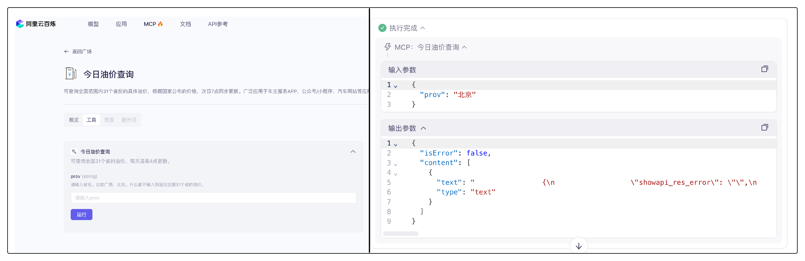

提示词工程

## 

## 

## 环境安装和平台准备

### 

#

#

##
##

##

##

##

##

##

##

##

##

##


##

## 常见任务示例

#

#

#

#

#

#

#

#

#

#

#

#

#
#

#

## 合成数据

#

#

#### 微调阶段的合成数据

在理解微调阶段为什么需要合成数据前，我们先需要知道为什么大模型需要微调、微调阶段需要什么样的数据。

大模型经过预训练后，已经具备了基础的语言理解和生成能力，但这些能力更多是通用层面的。在实际应用中，不同场景对模型的要求千差万别，比如企业需要模型能精准处理法律合同审查，金融机构希望模型能高效分析市场动态，医疗机构则期待模型能辅助疾病诊断。这时候，**微调就成了让大模型 “术业有专攻” 的关键步骤**，通过在特定任务或领域的数据上进一步训练，让模型适配具体需求，提升在目标场景下的性能。

而微调的效果，很大程度上取决于数据的质量和适配性。微调阶段对数据有着明确且严苛的要求。首先，**数据质量必须足够高**，需要准确、规范、无歧义，避免错误信息误导模型学习。其次，在格式上，微调数据基本以问答格式为主，因为这种格式能直接对应模型的交互场景，让模型学习到 “输入问题→输出答案” 的映射逻辑。对于更复杂的场景，多轮对话格式的数据也必不可少，它能帮助模型理解上下文关联，提升连续交互能力。

更重要的是，微调数据往往需要专注于某一特定领域，比如法律、金融、医学等。以法律领域为例，可能需要大量 “如何认定合同无效”“离婚财产分割的法律依据是什么” 这类专有问答数据；金融领域则需要 “股票期权的风险如何评估”“企业债券发行的流程是什么” 等专业内容。这些领域专有问答数据，是让模型掌握专业知识、形成领域思维的核心素材。

然而，现实情况是网上这类高质量的领域专有问答数据非常稀少。早期获得这类数据更多的依赖于人工标注，但是面对日益扩大的模型规模和任务需求，人工标注不仅耗时耗力，而且人工标注多多少少都会有偏向性从而无法保证数据的`丰富度`，因此最初大家都在往预训练阶段发力。

随着[Stanford Alpaca: An Instruction-following LLaMA Model](https://arxiv.org/pdf/2212.10560)论文发布，由预训练GPT-3通过设定的提示词合成指令数据，然后清洗、去重等，最终用合成的指令数据对Llama模型进行微调，得到的Llama-Instruct模型在各个测试数据上都取得了不错的效果。

下面我们详细解释论文中数据是如何生成的。


完整的数据合成流程分为四步，分别是1）生成任务指令，2）判断指令是否属于分类任务，3）采用输入优先或输出优先的方式进行实例生成，4）过滤低质量数据

1. 生成任务指令：首先需要人工编写多个种子任务，这些种子任务其实就是正常的问答，不过要添加任务主题，还有任务类型，比如下面的[例子](https://github.com/tatsu-lab/stanford_alpaca/blob/main/seed_tasks.jsonl)：

```json
{
    "id": "seed_task_0", 
    "name": "breakfast_suggestion", 
    "instruction": "Is there anything I can eat for a breakfast that doesn't include eggs, yet includes protein, and has roughly 700-1000 calories?", 
    "instances": [{"input": "", "output": "Yes, you can have 1 oatmeal banana protein shake and 4 strips of bacon. The oatmeal banana protein shake may contain 1/2 cup oatmeal, 60 grams whey protein powder, 1/2 medium banana, 1tbsp flaxseed oil and 1/2 cup watter, totalling about 550 calories. The 4 strips of bacon contains about 200 calories."}], 
    "is_classification": false}
```

`name`是主题，`is_classification`判断任务类型是否属于分类任务。论文中给出的种子数量仅有175条，这些种子任务目的是为了后续模型生成的时候有参照的模板，类似于`few-shot`的例子部分。由于任务种类较少，因此第一步是让大模型模仿并扩展任务指令，从任务池中采样8个任务，其中6个是种子任务的，2个是新生成的（任务池随着每次迭代更新数据，因此后续会有新生成的指令任务），


作为few-shot的例子部分，从task9开始让大模型生成新的task和instruction作为新的指令，然后生成、数据过滤、去重清洗、加入到任务池中反复执行，从而扩展了大量的任务指令。

2. 判断指令是否属于分类任务：分类任务要先生成output，也就是标签，再生成input；不是分类任务的话先生成input再生成output（分类任务先生成标签是为了确保input不会偏离标签，因为本身由于instruction 的不同，模型生成的input有偏向，先生成了output确保生成的input不会偏离output标签；非分类任务由于output是跟着input走的，而不是像label一样是固定的，因此先生成input然后输出output）。这里需要注意的是，input和output都是GPT-3生成的，因为你的目标是生成数据集，而不是和模型问答。

3. 采用输入优先或输出优先的方式进行实例生成：第二步判断了是否属于分类任务，当明确了任务类型后，就能使用大模型生成对应任务类型的数据，比如我们看个例子：

   ```text
   # 分类任务
   
   Given the classification task definition and the class labels, generate an input that
   corresponds to each of the class labels. If the task doesn’t require input, just generate the
   correct class label.
   
   Task: Classify the sentiment of the sentence into positive, negative, or mixed.
   
   Output(Class label): mixed
   Input(Sentence): I enjoy the flavor of the restaurant but their service is too slow.
   
   Output(Class label): Positive
   Input(Sentence): I had a great day today. The weather was beautiful and I spent time with friends.
   
   Output(Class label): Negative
   Input(Sentence): I was really disappointed by the latest superhero movie. I would not recommend it.
   
   # 非分类任务
   
   Instruction: Given an address and city, come up
   with the zip code.
   Input:
   Address: 123 Main Street, City: San Francisco
   Output: 94105
   ```

4. 过滤低质量数据：这一步通过过滤、去重等操作，将新的数据投放到数据池作为后续的数据生成数据池。过滤用的是指令过滤，方法是计算新生成的指令与现有指令之间的相似性（如ROUGE-L相似度）。如果新指令与现有指令的相似度超过某个阈值（如0.7），则认为该指令是重复的，将其过滤掉；关键词过滤检查指令中是否包含某些特定关键词（如“image”、“picture”、“graph”等），这些关键词通常表示任务超出了语言模型的处理范围；重复性检查生成的实例是否与现有实例完全相同，或者输入相同但输出不同；质量检查通过启发式规则（如指令长度、输入长度、输出长度等）来识别无效或低质量的生成内容。例如，指令过长或过短，输出是输入的重复等。

<div style="background:#e7f5ff;color:#000;padding:12px 16px;border-left:4px solid #74c0fc;">   综上所述，在微调阶段，合成数据是非常重要的，因为大模型合成的指令数据不仅在质量上有所保障，并且可以弥补人工标注的弊端，合成大量数据。<br/></div>

#### 具备“思考过程”的合成数据

“思考能力”其实是近一年左右逐渐发展的概念，主要应用于后训练阶段，希望模型在具备基本的问答能力的同时，多加一个思考模块，这个思想是从DeepSeek-R1爆火开始。

具备“思考能力”数据集，顾名思义，在原始问答对基础上，增加了思考模块的数据。在前文我们提到随着模型规模的扩大，互联网数据几乎被全部用于预训练，即使有合成数据的帮助，在2024年也到了瓶颈，而2025年年初，DeepSeek凭借R1模型爆火了一把，R1凭借其独特的思考模块和能力，还有独特的训练方式，稳居当时开源模型的榜首，而也正是因为其思考能力，让合成数据再一次突破了数据规模的瓶颈，在原始问答对基础上只是增加think部分，模型性能就有很大的提升，尤其表现在数学推理等任务当中。

“思考型”数据基本只能由合成数据构成，因为互联网基本不会存在这种数据，而人工标注也基本不可能，简单的问答对或许还有实现的希望，增加或错或对的思考过程，基本只能由大模型本身的生成能力才能实现。

在DeepSeek-R1发布的[技术报告](https://arxiv.org/pdf/2501.12948)中，R1的基线模型是DeepSeek-V3，经过多步合成数据，通过微调的方式对V3进行微调，从而获得R1，而合成的数据大部分是V3通过GRPO强化学习方式生成的推理数据，外加少部分非推理数据，使得V3具备思考能力，具体的流程可参考下图：


其中我们所说的“思考型”数据，在R1的整体生成流程中，GRPO强化学习阶段，模型生成而来，然后用生成的数据对V3进行微调，最终得到的R1。

在GRPO阶段，从V3到R1-Zero的过程中，DeepSeek团队对system提示词加以改造：


可以看到，虽然提示中明确要求在 `<think>` 标签内写出推理过程，但并未对推理过程的具体形式做任何规定。

在强化学习阶段，他们基于规则设计了两类奖励：

1. **准确度奖励（Accuracy rewards）**：通过测试答案的正确性来给予奖励。
2. **格式奖励（Format rewards）**：对使用 `<thinking>` 和 `<answer>` 标签的行为给予奖励。

对于那些导致答案正确的所有决策——无论是特定的 token 序列还是推理步骤——都会在训练中获得使其更有可能被采纳的权重调整。

而对于那些导致答案错误的所有决策，则会在训练中获得使其更不可能被采纳的权重调整。


有意思的是，该提示并没有给出 `<think>` 过程应当如何呈现的示例，只是要求在 `<think>` 标签内进行思考，无需更多细节。通过向模型提供与思维链（Chain-of-Thought）相关的间接奖励，模型逐渐自主学会：当推理过程更长、更复杂时，答案更可能是正确的。


通过这样的训练流程，研究人员发现，模型能够自发地探索出最优的链式推理模式，并展现出如自我反思、自我验证等高级推理能力。

不过，这种做法仍存在一个显著缺陷：其输出的可读性不佳，而且有时会混用多种语言，这是仅用强化学习导致的弊端，没有微调阶段对回答模式加以限制，推理时错误的概率就会比较高。为了解决这个问题，团队转而研究另一种思路，在后续GRPO学习中添加了语言类的奖励信号，同时因为V3-Base强大的生成能力，通过V3-Base合成的“思考型”数据作为微调时所用的微调数据，对预训练模型进行微调，就能让模型快速学会这种思考方式。

总结下来，“思考型”数据只能由模型生成，当然质量问题是基础，不过可能模型生成的“思考型”数据也不一定质量很高，因为可能存在大量重复思考过程，更重要的是，现有的数据中基本没有包含思考过程的数据。

因此合成数据对于提高模型思考推理能力是必要的，想要让模型具备思考能力，要么通过强化训练自己合成数据自己微调，这对于模型的规模要求较高，因为小规模模型不一定有强大的能力；要么通过知识蒸馏，把大模型具备的思考能力迁移到小规模模型中。

### 各个阶段的合成数据举例

关于合成数据，发展至今，已经是一个很成熟的领域，不仅在Huggingface社区中有大量的文章以及开源的合成数据集，对于各个企业、研究团队，私有合成数据也有成熟的经验，本节以Huggingface社区中开源的论文和数据集举例说明预训练、微调以及推理数据的样式。

#### 预训练数据

由于Phi论文中并没有明确提及如何合成的数据，huggingface团队为复现[Phi-1.5](https://arxiv.org/abs/2309.05463)过程中所遇到的挑战及其解决方案，构建了包含数十亿词元的合成数据集[cosmopedia](https://huggingface.co/datasets/HuggingFaceTB/cosmopedia)，当然还有采样了100k条数据的[cosmopedia-100k](https://huggingface.co/datasets/HuggingFaceTB/cosmopedia-100k)。


该数据集首先在网络上收集大量数据，其中`seed_data`就代表词源信息，然后由于受众群体`audience`的不一样，根据不同的任务类型`format`，提示词`prompt`会进行相应的构建，然后利用GPT-3.5生成相应的回答，也就是我们最终需要预训练数据`text`。

我们可以用Qwen2.5-3B-Instruct模型进行一波尝试，就比如采用cosmopedia数据第一条中的prompt转换成中文形式输出相应的预训练数据：

*提示词* ：

```Plain
以下是一个网页的摘录：

#贴现率计算器

由博士候选人Tibor Pál创建

Arturo Barrantes和Adena Benn评论

由博士候选人Tibor Pál创建
Arturo Barrantes和Adena Benn评论
基于Cipra， T.金融与保险公式（2010）的研究
最后更新:2023年2月2日

我们创建了这个贴现率计算器来帮助您估计给定支付流的贴现率。更具体地说，您可以计算给定现值和未来值的贴现率，也可以计算附加支付流（例如年金）的贴现率。

请继续阅读并了解以下内容：
•贴现率的定义是什么？
•贴现率公式是什么？
•如何计算贴现率？
要通过贴现率计算现值，您可能需要查看我们的现值计算器。

贴现率的定义是什么？

贴现率是贴现现金流量（DCF）分析中用于确定未来现金流量现值的利率。贴现率是一个重要的比较基础，因为它是

创建一个与上面的片段相关的教育片段，目标受众是小学生。不应该使用像电磁学和集成这样复杂的大学课程，因为小学通常不会教这些课程。如果这就是这个片段的内容，那就找一个更简单的科学替代方法来解释，并使用日常示例。例如，如果主题是“线性代数”，你可以讨论如何将物体排成一行或列来帮助解决难题。

避免使用专业术语和LaTeX，只讨论简单的小学水平的主题。马上开始教育部分。
```

*数据* ：

```Plain
好的，让我们为小学生们设计一个关于贴现率的简单教育片段。我们可以用一些日常生活中熟悉的概念来解释这个概念。

大家好！今天我们要聊聊一个有趣的概念——贴现率。想象一下，你有一笔钱存起来，比如你的压岁钱，或者从爸爸妈妈那里得到的零花钱。这些钱放在口袋里不动，随着时间的推移，它们会变多吗？当然不会，因为它们只是在银行里放着，银行会给你一点小利息作为回报。这个小利息就是贴现率！

### 贴现率的定义

贴现率就像是银行给你的“租金”。当你把钱存到银行里时，银行会给你一定的利息，这个利息就叫做贴现率。如果你把钱存得越久，银行就会给你越多的利息。所以，贴现率就像是一把尺子，用来测量你的钱随着时间的增长。

### 贴现率公式

虽然这个公式可能看起来有点复杂，但其实很好理解。贴现率公式可以帮助我们算出未来某一天，这笔钱会变成多少。比如，如果你现在有10元钱，银行给你1%的贴现率，那么一年后你就有10元 + 1元 = 11元。这就像你在银行存了一年的钱，银行给了你1元的利息。

### 如何计算贴现率

假设你有一个好朋友，他答应过你一年后送你一个玩具，这个玩具现在值50元。为了公平起见，你想知道这个玩具在未来一年内会变成多少钱，这样才能决定现在是否应该把100元存下来。这里，你就可以用贴现率来计算。

1. 首先，你需要知道这个玩具现在的价值（称为现值），也就是50元。
2. 然后，你需要知道你希望这个玩具在未来的价值（称为未来值），比如100元。
3. 最后，你用贴现率来算出这个玩具在未来一年内会变成多少钱。

### 小练习

想象一下，你现在有10元钱，你想存到银行里，让银行给你一定的贴现率，让你的钱变多。假设银行给你2%的贴现率，一年后你会有多少钱呢？（答案：10元 + 10元 × 2% = 10元 + 0.2元 = 10.2元）

好了，今天的分享就到这里啦！记住，贴现率就像是银行给你的“租金”，帮你把现在的东西变成未来的东西。希望你下次听到这个词时，能立刻想到这个有趣的概念哦！
```

而如果我们将提示词中关于受众群体更改为专业人员，情况又会如何，下面的例子仍采用上述提示词，前半部分完全相同，因此以省略符号替代：

*提示词* ：

```Plain
……

创建一个与上面的片段相关的教育片段，目标受众是专业研究人员，他们学习了关于这些课程的内容，可以用专业术语来进行科普。
请马上开始教育部分。
```

*数据* ：

```Plain
## 贴现率及其在金融与保险中的应用

### 贴现率的定义

贴现率（Discount Rate）在金融与保险领域具有重要地位，它是一种用来衡量未来现金流价值的比率。在进行投资决策、评估项目收益或是评估资产价值时，贴现率被广泛应用于现值（Present Value, PV）的计算。贴现率本质上是一个折现率，它表示了将未来一定时期内的一系列现金流折算到现在时点的价值。

在贴现现金流（Discounted Cash Flow, DCF）分析中，贴现率通常被视为一项无风险收益率，用于调整预期未来现金流至当前的价值。贴现率的高低直接影响到现金流现值的大小，从而对投资决策产生重大影响。

### 贴现率公式

贴现率的核心计算公式为：
\[ PV = \frac{CF}{(1+r)^n} \]
其中，
- \( PV \) 是现值，
- \( CF \) 是未来某时刻的现金流，
- \( r \) 是贴现率（折现率），
- \( n \) 是时间（通常以年为单位）。

通过上述公式，我们可以计算出某一特定未来时刻的现金流在当前时点的价值。在实际操作中，为了简化计算过程，有时会采用复利贴现率，即：
\[ PV = CF \times (1 + r)^{-n} \]

### 如何计算贴现率

在金融模型中，贴现率的选择对最终结果至关重要。通常情况下，贴现率的选择会基于市场条件、行业标准或特定项目的预期风险水平。对于投资者而言，贴现率一般由投资者的风险承受能力和预期回报率决定；而对于企业而言，则可能基于其资本成本或机会成本来设定。

贴现率的确定可以利用多种方法，包括但不限于：
1. **加权平均资本成本（WACC）**：这是综合考虑不同资本来源成本的一种方法，常用于企业内部项目评估。
2. **风险调整贴现率（Risk-Adjusted Discount Rate, RADR）**：这种方法考虑了特定项目的风险溢价，使得贴现率能够反映项目的额外风险。
3. **市场贴现率**：基于当前市场的整体风险偏好来设定贴现率，适用于一些标准化的项目评估。

### 现值计算器的应用

为了方便计算，我们提供了一个贴现率计算器，该工具可以帮助您根据给定的现值、未来值以及附加支付流（如年金）来计算相应的贴现率。通过现值计算器，您可以更直观地理解贴现率在实际应用中的重要性及其如何影响现金流的价值评估。
```

从上述提示词的举例类比可以看出，同样的数据源，当提示词中受众目标更改，最终生成的预训练数据完全不同，相互之间关联度很低，专业人员所面对的一大堆公式，在受众群体是小学生时一点都没有提到，那么数据重复性就无从谈起，而且由于是大模型合成的数据，生成的文案在质量上有所保障，同时也可以确保规模，哪怕是3100k条数据也能保证多样性。

#### 微调数据

但是微调虽然要求的数据规模不大， 但是对质量的要求很高。我们在前文已经分析了生成微调数据的完整流程，而生成的数据集就是我们在入门大模型微调时经常使用的数据集[Alpaca](https://huggingface.co/datasets/tatsu-lab/alpaca)，总计52k条数据，所有的数据都是由GPT-3预训练模型生成，如果想复现生成数据集的代码，查看[官方给的代码](https://github.com/tatsu-lab/stanford_alpaca/blob/main/generate_instruction.py)即可。

一般的，指令微调的数据集包含三个部分：指令、输入、输出：

```Plain
instruction：指令
input：输入
output：输出
```

我们看下经典的Alpaca数据集格式：


其中每一部分含义如下：

- `instruction`：描述模型应执行的任务。52K 条指令中的每一条都是唯一的。
- `input`：可选的上下文或任务输入。例如，当指令为“总结以下文章”时，输入就是文章本身。大约 40% 的示例包含输入。
- `output`：由`text-davinci-003`（GPT-3）模型来生成的指令的答案。
- `text`：`instruction`，`input`并使用作者用于微调其模型的[提示模板](https://github.com/tatsu-lab/stanford_alpaca#data-release)`output`进行格式化。

#### 推理数据

虽然DeepSeek技术报告中的80w条数据并未开源，但是训练数据的格式基本包含下面三个部分：

```Plain
input：请说说三原色分别是什么
reasoning_content：好的，用户……
content：三原色分别是……
```

其中：

- `input`：问答对中的问题部分
- `reasoning_content`：这部分是模型的思考部分，其实在输出中由**<think></think>**特殊字符包裹的部分，里面包含模型的推理、反思等内容，是一段非常长的文本
- `content`：该部分是模型的最终输出内容，也包含在输出中，通常在**</think>**特殊字符后面，作为模型给出的标准回答，模型在输出的时候可以通过对话模板自动检测出特殊字符，从而提取模型最终的输出

我们可以在huggingface社区中找到开源的[基于R1生成的SFT数据](https://huggingface.co/datasets/Congliu/Chinese-DeepSeek-R1-Distill-data-110k)：


该数据集为中文开源蒸馏满血R1的数据集，数据集中不仅包含math数据，还包括大量的通用类型数据，总数量为110K。

由于强化学习对资源要求比较高，并且训练时间通常非常漫长，想要通过GPRO在小模型上复现R1其实不太现实，因此如果想快速实现R1的功能，可以采用蒸馏的方法，该数据集可以很好的实现在小模型上蒸馏R1的能力，有兴趣的朋友可以利用该数据集对小模型比如Qwen系列7B以下的模型进行SFT，从而让规模较小的模型实现思考推理能力。

### 实现合成数据代码举例

经过前文的理论知识的补充，我们对每个阶段是否需要合成数据，以及各个阶段的合成数据有了基本的了解，那么下面我们就通过简单的代码实现由大模型合成各个阶段的合成数据让大家有更深刻的理解。

#### 预训练数据

其实构建Phi模型的团队在论文[1] [2]里仅说明了数据集的构成来源以及数量，但是并没有详细说明数据的内容、如何处理数据的，因此Huggingface团队生成含数十亿词元的合成数据集以复现 [Phi-1.5](https://arxiv.org/abs/2309.05463) 过程中所遇到的挑战及其解决方案，由此最终创建了 [Cosmopedia](https://huggingface.co/datasets/HuggingFaceTB/cosmopedia) 合成数据集[3]。该团队根据论文中提供的信息，从网络以及各个教育平台获得“种子数据”，然后由“种子数据”通过大模型合成扩大到3000万条的规模。

该团队获得的“种子数据源”分别是网络数据和教育数据，其中网络数据占比最高，高达83%，还有纯粹的教育数据由16%，最后还有其他少量指令数据。


该huggingface团队还提供了复现代码[4]，其中将合成步骤简单总结为三步，分别是：

1. 合成prompt
2. 根据prompt生成数据
3. 数据筛选、去重等

我们提供了简易的生成代码，链接[在这](https://gitlab.115lab.club:9000/lixinyu/prompt_engineering_tutorial/-/tree/main/5.synthetic_data/pretrain_data_generation?ref_type=heads)，代码构成如下：

```Plain
pretrain_data_generation/
├── generation.py             # 数据生成
├── utils.py                  # openai接口设计以及其他工具等
├── data/                     # 生成的数据保存地址
└── data_process/               # 数据处理
    ├── minhash_logs/           # 生成的哈希去重log
    ├── minhash_results/        # 哈希去重结果
    ├── data_depulication.py    # 数据去重
    └── data_format_conversion.py  # 数据格式转换
```

下面我们按照步骤依次执行：

##### 1、合成prompt

由于数据集包含大量的网络数据，但是huggingface团队提供的比如生成web网络数据的prompt的[代码](https://github.com/huggingface/cosmopedia/blob/main/prompts/web_samples/build_web_prompts.py#L48)里，数据集无法获取，不过该合成prompt的思想还是提示词+网络数据（上下文），具体的prompt可以参考[官方的提示词](https://github.com/huggingface/cosmopedia/blob/main/prompts/web_samples/build_web_prompts.py#L6)：

*提示词模板：*

```Plain
"wikihow":
"""Here is an extract from a webpage: "<INSERT_EXTRACT>".

Write a long and very detailed tutorial that could be part of WikiHow whose title is related to the extract above<ADD_TOPIC>. Include in depth explanations for each step and how it helps achieve the desired outcome, inluding key tips and guidelines. 
Ensure clarity and practicality, allowing readers to easily follow and apply the instructions. Do not use images.""",
 
```

`<INSERT_EXTRACT>`是网络数据放入的地方。

为了方便起见，我们直接获取[HuggingFaceTB/cosmopedia-100k](https://huggingface.co/datasets/HuggingFaceTB/cosmopedia-100k)的prompt就行（因为我们只需要学习如何生成的思想，具体操作可以查阅网络数据填充对应的地方批量生成prompt）。

我们下载数据集到本地，可以使用`modelscope`下载数据集到本地

```Bash
modelscope download --dataset swift/cosmopedia-100k data/train-00000-of-00002.parquet --local_dir ./dir
```

然后查看第一条数据：


我们使用prompt作为我们后续生成的模板即可。

##### 2、根据prompt生成数据

为快速、高效的生成数据，我们采用vllm框架实现，使用Qwen2.5-3B-Base模型，在开头环境安装和平台准备中，我们提醒道，因为vllm把本地的GPU完全利用，因此显存占用会比较高，3B的模型需要37-38GB左右，如果资源受限，可以使用更小的模型尝试，不过生成效果就不一定很好了。

我们先开启vllm，模型采用本地保存的模型地址：

```Bash
vllm serve /home/lixinyu/weights/Qwen2.5-3B
```

然后运行生成代码：

```Bash
python generation.py
```

<div style="background:#fff3cd;color:#5b3200;padding:12px 16px;border-left:4px solid #ffeaa7;">   ⚠️ <strong>注意</strong><br/>   不过需要注意的是，我们仅为了提供示例，下载.parquet格式数据，读取的时候也针对.parquet格式，如果你采用的是完整数据，请<strong>调整下面的代码</strong>： </div>


我们的例子中只生成了20条数据，只需要两分钟时间，生成结果如下：


接下来我们看下如何处理数据。

##### 3、数据筛选、去重等

首先关于数据筛选，huggingface团队给出的[HuggingFaceTB/cosmopedia-100k](https://huggingface.co/datasets/HuggingFaceTB/cosmopedia-100k)数据集已经经过了筛选环节，我们只是使用筛选后的数据集进行生成，因此这里不多赘述，有兴趣了解的朋友可以查看[官方给出的web数据筛选代码](https://github.com/huggingface/cosmopedia/blob/main/prompts/web_samples/filter_and_classify_clusters.py)，其实就是预设题目筛选，我们主要来实现数据去重。

cosmopedia团队利用[datatrove库](https://github.com/huggingface/datatrove)中的Minhash实现数据去重，[代码在此](https://github.com/huggingface/cosmopedia/tree/main/deduplication)，然后我们的代码在这👉[ours](https://github.com/828Tina/PromptEngineeringCourse/tree/main/5.synthetic_data/pretrain_data_generation)。

因为我们不需要Slurm集群来实现大规模数据去重，仅仅实现少量数据，因此我们使用本地的服务器就行，对于官方代码中的所有`SlurmPipelineExecutor`改成`LocalPipelineExecutor`，具体原理可参考[datatrove的本地pipeline](https://github.com/huggingface/datatrove?tab=readme-ov-file#localpipelineexecutor)设置。

这段代码通过 Minhash 算法，也就是哈希去重的方法实现文本去重，哈希去重通过将任意长度文本转化为固定长度哈希值，既能大幅压缩数据规模，又能利用 “相同文本生成相同哈希值” 的特性快速判断重复，避免直接比对原始文本的冗余计算。其计算速度快且存储成本低，非常适合海量数据场景，像 Minhash 这类算法还能捕捉文本相似性，不仅检测完全重复，还能识别高度相似内容。同时，结合分桶、聚类等策略可进一步减少比对次数，显著提升大规模数据处理的效率，最终实现高效、精准的重复内容识别与过滤。

整个流程分四个阶段完成重复检测与过滤。

- 首先配置 Minhash 参数，包括哈希精度、桶数量和每个桶的哈希数，这些参数直接影响去重精度和效率。MinhashDedupSignature 组件为每条英文文本数据生成独特签名然后保存，签名作为文本的紧凑表示，在保留特征的同时减少数据量，且通过多进程并行处理提升效率。
- 第二阶段进行签名分桶匹配，从签名文件夹读取数据，按配置的桶数量将相似签名文本归入同一桶中。这种分桶策略缩小了后续比较范围，避免全量两两比对，大幅提高处理效率。
- 第三阶段基于桶结果聚类，从桶文件夹读取数据，将重复文本聚合成簇，确定需移除的重复数据 ID，明确重复文本对象，为最终过滤做准备。
- 第四阶段完成重复过滤：这一阶段再次读取原始数据，指定文本字段为 “generated_text”（我们的数据保存到这里，当然也可以命名其他字段）；然后依据 remove_ids 信息过滤重复数据，被移除数据由 exclusion_writer 保存到 removed 文件夹，剩余非重复数据单独保存。

运行下面的代码👇：

```bash
python data_depulication.py
```


当看到上图表示完成数据去重，并且成功保存好数据，保存好的文件是gz压缩包，我们可以执行下面的代码👇，将压缩包文件转换成jsonl文件，这样你就完成了最终的数据去重操作。

```Bash
python data_format_conversion.py
```

其实从上面的结果中，我们可以知道，所有数据都没有重复的，这是当然的，因为：

1. 我们的数据量很少，仅作为例子，20条数据想重复都比较难
2. 我们随机从100k条（当然我们只下载了50k条）数据，从中随机选择20条prompt，主题重复的概率极低，那生成的数据的重复的概率也很低

<div style="background:#e8f5e9;color:#000;padding:12px 16px;border-left:4px solid #81c784;">
  ✅ 我们完成所有的步骤仅为了完整实现利用大模型实现预训练合成数据的操作，如果要进行大规模数据合成需要收集<strong>足量的种子源数据（互联网数据）</strong>，然后参考我们的教程的思想。
</div>

[1].[Textbooks Are All You Need](https://arxiv.org/pdf/2306.11644)

[2].[Textbooks Are All You Need II: phi-1.5 technical report](https://arxiv.org/pdf/2309.05463)

[3].[Cosmopedia: how to create large-scale synthetic data for pre-training](https://huggingface.co/blog/zh/cosmopedia)

[4].https://github.com/huggingface/cosmopedia?tab=readme-ov-file

#### 微调数据

关于微调数据的合成，提供了完整的合成instruct数据的[代码](https://github.com/tatsu-lab/stanford_alpaca/tree/main)，完整的生成流程我们在前文已经讲过，我们再简单总结下：

1. 生成任务指令
2. 判断指令是否属于分类任务
3. 采用输入优先或输出优先的方式进行实例生成
4. 过滤低质量数据

完整的四步在[生成代码](https://github.com/tatsu-lab/stanford_alpaca/blob/main/generate_instruction.py)里，具体看`generate_instruction_following_data`部分，基本按照生成流程的顺序实现，openai对应的API接口处理代码在[工具](https://github.com/tatsu-lab/stanford_alpaca/blob/main/utils.py)里，代码原理也很简单，我们就不再赘述。

我们提供了简易的生成代码，链接[在这](https://gitlab.115lab.club:9000/lixinyu/prompt_engineering_tutorial/-/tree/main/5.synthetic_data/instruct_data_gengeration?ref_type=heads)，代码构成如下：

```Plain
instruct_data_gengeration/
├── generate_instruction.py            # 数据生成
├── utils.py                           # openai接口设计以及其他工具等
├── prompt.txt                         # 生成instruction的提示词
├── seed_tasks.jsonl                   # 种子任务
└── data/                              # 生成的数据保存地址
```

不过因为我们仍然用vllm框架来实现高效生成数据的方法，而官方的代码时间有点久，很多包进行了更新，不一定适配原始的代码，因此我们把需要改动的地方着重强调下。

因为我们希望使用本地保存的模型，重点是[model_name_or_path](https://github.com/tatsu-lab/stanford_alpaca/blob/main/generate_instruction.py#L114)换成我们的**本地的模型地址**，无论是本地模型Qwen还是默认的GPT系列的text-davinci-003，其实都适配OpenAI的JSON输入接口，因此[该函数的整体逻辑](https://github.com/tatsu-lab/stanford_alpaca/blob/main/utils.py#L39)不需要进行修改，但是由于openai这个包有更新，细节部分需要修改。

1. 首先是[openai的Completion](https://github.com/tatsu-lab/stanford_alpaca/blob/main/utils.py#L106)换成了`openai.OpenAI.completions`，这里需要注意。
2. 其次是我们没有走openai的调用API的方法，走的是本地服务器，因此需要把url改成本地的端口地址，一般情况下，默认是8000，代码如下：

```Python
client = openai.OpenAI(
    # defaults to os.environ.get("OPENAI_API_KEY")
    api_key="EMPTY",
    base_url="http://127.0.0.1:8000/v1",
)
```

因此第一步的completions需要改成如下形式：

```Python
completion_batch = client.completions.create(prompt=prompt_batch, **shared_kwargs)
```

1. 最后[openai删掉了openai_object](https://github.com/tatsu-lab/stanford_alpaca/blob/main/utils.py#L13)，不过这一步基本只是规定输出格式，因此直接删掉所有关联的代码即可

具体的修改好的代码可以参考👉[ours](https://github.com/828Tina/PromptEngineeringCourse/tree/main/5.synthetic_data/instruct_data_gengeration)

我们运行下面的代码，就可以合成微调数据了：

```Python
python -m generate_instruction generate_instruction_following_data \
  --output_dir ./data \
  --num_instructions_to_generate 10 \
  --model_name="/home/lixinyu/weights/Qwen2.5-3B" \
  --request_batch_size 2
```

合成的数据如下：


<div style="background:#e8f5e9;color:#000;padding:12px 16px;border-left:4px solid #81c784;">
  ✅ 这里我们看下，most_similar_instructions后面有很多的分数，avg_similarity_score也有，我们简单讲述每个分数的含义：</br>
	1. most_similar_instructions的分数：数值是ROUGE-L 分数（范围 0-1），表示<strong>新生成的指令与已有指令中最相似的 10 条指令</strong>（num_instructions_to_generate）之间的相似度。</br>
	2. avg_similarity_score的分数：是<strong>所有已有指令与新指令</strong>相似度的平均值</br>
</div>

#### 推理数据

由于推理数据需要本身就具备思考过程的模型来实现，我们所熟悉的deepseek-r1还有Qwen3都有思考模块，我们选择Qwen3，为什么选择Qwen而不是DeepSeek，因为我们使用阿里百炼平台通过调用API的形式调用模型来生成数据，Qwen3能快点，DeeSeek-R1有点慢而已，用R1也绝对没有任何问题。

我们提供了简易的生成代码，链接[在这](https://gitlab.115lab.club:9000/lixinyu/prompt_engineering_tutorial/-/tree/main/5.synthetic_data/inference_data_generation?ref_type=heads)，代码构成如下：

```Plain
instruct_data_gengeration/
├── generate.py            # 数据生成
└── data/                  # 生成的数据保存地址
```

为方便起见，我们直接选择[alpaca中文版](https://huggingface.co/datasets/llm-wizard/alpaca-gpt4-data-zh)的指令和输入作为整体的输入数据，让Qwen3去生成思考+回答，作为我们的推理数据。我们简单分成下面两步：

1. 下载Alpaca数据
2. 调用Qwen3生成推理数据

我们直接运行下面的代码，就可以完整的生成推理数据：

```Python
python generation.py 
```

因为我们只是举例说明，我们只生成了10条数据，批量生成数据的话可以修改数量。


## RAG检索

当我们向大模型询问大模型不知道的知识的时候，大模型可能会因为“幻觉”即使不知道答案，毕竟大模型在训练时候使用过的数据集通常来说不会紧跟时事训练，大部分的知识在预训练阶段灌输，在微调阶段进行回答的调试。因此大模型会胡乱用相似的知识为我们做出回答，但是很明显不会是我们想要的，那有什么方法是可以不用随时训练大模型就能让大模型回答正确呢？答案是RAG。

大模型 RAG（检索增强生成）是一种结合大语言模型与检索技术的混合系统，其核心原理是在生成回答前，先从外部知识库中检索与问题相关的信息，再将这些精准信息作为上下文输入大模型，辅助其生成回答，**大模型只充当了回答的角色**。这种模式的优势显著，既能增强回答的准确性，有效减少大模型常见的 “幻觉” 问题，又能利用最新数据弥补模型训练数据的滞后性，同时降低对模型参数量的依赖以节省计算成本。不过，RAG 也存在一定劣势，检索质量直接决定结果优劣，高度依赖知识库的完整性与准确性；在多轮对话中上下文管理较为复杂，容易出现信息冗余或遗漏；且对长文档的处理效率较低，可能因检索范围有限而遗漏关键内容。

我们可以看下RAG原理：


我们简单的把RAG过程分割成三个部分，根据RAG的英文全称是Retrieval-Augmented Generation，理论上应该分割成`检索`、`增强`、`生成`，不过`检索`部分可以类比成`存储+检索`，多加了一个词，是不是原理就更清晰了呢？我们拆分下：

1. `存储+检索`：将文档内容分割、转换成向量格式、检索相似性较高的文档切片
2. `增强`：设计提示词，将用户的问题+文档切片内容结合作为查询内容
3. `生成`：使用大模型对`增强`后的提示词生成响应

简单讲完RAG原理，虽然感觉听懂了，但是还是有点抽象对吗？那么我们接下来用一个简单的代码示例来完整讲述RAG：

### 构建向量数据库

首先我们构建一个向量数据库，用来存储文档切片转换成的向量内容。该数据库函数包含添加向量、检索向量两部分功能，其中检索向量我们需要使用embedding模型计算向量相似度，embedding模型我们使用`Qwen3-embedding`模型，Qwen3提供了0.6B、4B、8B等，由于我们就是简单做一个RAG，因此我们使用最小的0.6B模型，对资源消耗不是很高，大约2-3GB的显存占用，但是注意，不要重复运行加载代码，显存会累积占用，多次运行加载代码会耗费很多资源。

话不多说，我们看下代码：

```Python
### 1、加载embedding模型
from sentence_transformers import SentenceTransformer

embedding_model_path = "/your/path/of/Qwen3-Embedding-0.6B"
embedding_model = SentenceTransformer(embedding_model_path)
```

<div style="background:#fff3cd;color:#000;padding:12px 16px;border-left:4px solid #ffeaa7;">   ⚠️ 加载模型的代码不能重复运行，否则会累积显存 </div>

```Python
### 2、构建向量数据库
import numpy as np
from typing import List, Dict, Optional

class VectorStorage:
    """简单向量存储类，仅负责向量的存储功能"""
    
    def __init__(self):
        """初始化向量存储"""
        self.vectors = []  # 存储向量
        self.metadata = []  # 存储向量对应的元数据
        self.dim = None  # 向量维度
    
    def add(self, vector: List[float], metadata: Optional[Dict] = None) -> int:
        """
        添加向量到存储
        
        参数:
            vector: 要添加的向量
            metadata: 向量相关的元数据
            
        返回:
            向量在存储中的索引
        """
        
        # 检查向量维度
        if self.dim is None:
            self.dim = len(vector)
        elif len(vector) != self.dim:
            raise ValueError(f"向量维度必须为{self.dim}")
        
        # 保存向量和元数据
        self.vectors.append(vector)
        self.metadata.append(metadata or {})
        
        # 返回向量索引
        return len(self.vectors) - 1
    
    def get(self, index: int) -> tuple[np.ndarray, dict]:
        """
        获取指定索引的向量和元数据
        
        参数:
            index: 向量索引
            
        返回:
            元组 (向量, 元数据)
        """
        if 0 <= index < len(self.vectors):
            return self.vectors[index], self.metadata[index]
        raise IndexError("索引超出范围")
    def search(self, query: str, k: int = 2) -> List[tuple[int, float, dict]]:
        """        搜索最相似的向量
        参数:
            query_vector: 查询向量
            k: 返回的相似向量数量
        返回:
            包含元组的列表，每个元组格式为 (索引, 相似度, 元数据)
        """
        # 输入的文本转换成向量格式
        query_vector = embedding_model.encode([query], prompt_name="query")

        # 计算相似度
        similarities = embedding_model.similarity(query_vector, self.vectors)
        similarities = similarities.squeeze()
        
        # 限制 k 值不超过向量总数
        k = min(k, len(self.vectors))
        
        # 获取最相似的 k 个向量的索引（使用 PyTorch 方法）
        top_k_values, top_k_indices = similarities.topk(k, largest=True)
        
        # 返回结果（将张量转换为 Python 列表）
        return [
        (top_k_indices[i].item(), top_k_values[i].item(), self.metadata[top_k_indices[i].item()])
        for i in range(k)
        ]

    def __len__(self) -> int:
        """返回存储中向量的数量"""
        return len(self.vectors)
```

其中`add`是添加向量的部分，`search`是检索向量，`get`仅是确定下每一个序号对应的向量内容，不参与实际使用。

我们存入一个向量内容：

```Python
### 存入向量数据库
vb= VectorStorage()

query="你好"
query_vector=[1,2,3]

# 添加到向量数据库中
vb.add(query_vector,{"index":1,"chunk":query})

# 我们查看下向量
vector1, meta1 = vb.get(1)
print(f"向量1: {vector1}, 元数据: {meta1}")

# 获取向量数量
print(f"存储的向量数量: {len(vb)}")
```

*回答* ：

```Plain
向量1: [1,2,3], 元数据: {"index":1,"chunk":"你好"}
存储的向量数量: 1
```

非常好！你现在已经成功构建了一个向量数据库，那么接下来我们来学习如何处理文档，因为通常来说，文档的内容都会很长，将其转换为向量显然不合理，因为每一个embedding模型能够处理的文本长度都是有限的，比如Qwen3的embedding模型：


能够处理的序列长度为32K，超过这个长度就无法词嵌入了，因此我们要对文档进行分块处理。如何处理我们接着往下看。

### 文档分块处理

前面我们知道，首先embedding能够处理的文本长度有限。其次呢，如果不分块，一段文字的内容过多，显然我们检索出来的文本可能包含内容会很多很杂，但是我们希望结果会更精准些，比如，如果我要问一条新闻里张三做了什么事情，但是如果检索出来的切片里不仅有张三做的事情，还有李四、王五、赵六等等，大模型就需要做额外的判断，那么生成的时候效率就会降低。

因此我们可以按照句号来划分、或者按照字数来划分，比如500字分成一条信息，我们举一个简单的例子：

```Python
### 3、文档加载和分块
import PyPDF2
from typing import List, Tuple, Dict
import re

def read_pdf(file_path: str) -> str:
    """
    读取PDF文件内容
    
    参数:
        file_path: PDF文件路径
        
    返回:
        PDF文件中的文本内容
    """
    try:
        with open(file_path, 'rb') as file:
            reader = PyPDF2.PdfReader(file)
            text = ""
            for page in reader.pages:
                text += page.extract_text()
            return text
    except Exception as e:
        print(f"读取PDF文件时出错: {e}")
        return ""

def split_pdf(text, max_len=200):
    # 按句子优先分割
    chunks = re.split(r'[。！？]', text)
    # 合并短句到200字以内
    result, buf = [], ""
    for s in chunks:
        if len(buf + s) <= max_len:
            buf += s
        else:
            if buf: result.append(buf)
            buf = s
    if buf: result.append(buf)
    return result

file_path = "./liulangdiqiu2.pdf"
chunks = split_pdf(read_pdf(file_path), max_len=200)
chunks
```

该例中，我们按照。！？为优先划分，200字为次优先限制，将一个简单的文本划分了7条信息：

```Plain
['《流浪地球2》是由郭帆执导的科幻灾难电影，于2023年上映，故事围绕《流浪地球》\n前作展开，以计划建造1万座行星发动机的时代为背景\n在不远的未来，太阳急速衰老膨胀，即将吞噬太阳系，地球面临灭顶之灾为应对危机，地\n球各国成立联合政府，提出数百个自救计划，其中“移山计划”“方舟计划”“逐月计划”\n和“数字生命计划”进入论证阶段',
 '“移山计划”由中国提出，旨在建造1万座行星\n发动机推动地球前往新家园；“方舟计划”是美国提议的在地球同步轨道建立空间站以带\n领人类逃离；“逐月计划”由俄罗斯提出，想改造月球为逃生舱，后因月球结构等问题并\n入“移山计划”；“数字生命计划”则是将人类意识数字化，实现永生，但最终被伦理委\n员会禁止经过考量，“移山计划”被选定，人类开始着手建造行星发动机，同时准备建\n造卫星发动机以放逐月球，摆脱月球引力',
 '\n然而，计划推进过程中危机四伏2044年，太空电梯基地遭遇危机，处在9万公里高度\n的方舟空间站爆炸坠落，引发连锁反应，导致太空电梯基地被摧毁，流浪地球计划面临重大\n挑战影片中，满腔赤诚的刘培强（吴京饰）历经层层考验成为航天员大队的一员，他与韩\n朵朵（王智饰）在此过程中相知相恋，而刘培强也在后续故事中为了地球和家人，不断经历\n着艰难抉择与挑战',
 '\n另一边，量子科学家图恒宇（刘德华饰）则与“数字生命计划”紧密相关他致力于将女\n儿图丫丫的意识数字化，即使该计划被禁止，他也未放弃在一系列意外后，图恒宇自己也\n意外进入数字世界，以一种特殊的方式继续参与到拯救地球的行动中，他在数字空间中的经\n历，也为影片增添了一层神秘的“元宇宙”色彩',
 '\n联合政府中国代表周喆直（李雪健饰）则在国际舞台上，为“移山计划”的推进四处奔走，\n面对各方压力和危机，他始终坚定信念，相信人类能够团结起来拯救地球，展现出了强大的\n责任感与使命感\n随着故事发展，月球发动机建造完成，但却因未知原因被启动，月球开始向地球逼近，引发\n了全球性的灾难，地震、海啸等灾害频发，人类再次面临生死考验为了阻止月球撞击地球，\n人类决定启动行星发动机，利用其推力将月球推离',
 '在这一过程中，无数普通人与主角们一\n起，克服了重重困难，最终成功放逐月球，为地球开启流浪之旅奠定了基础',
 '\n《流浪地球2》通过展现刘培强、图恒宇、周喆直等众多角色的经历，以及全球人类在末\n日危机下的挣扎与抗争，呈现了一个宏大而震撼的科幻世界，探讨了人类面对绝境时的生存\n选择、亲情、责任与勇气等主题，传达出“人类命运共同体”理念和“没有人的文明，\n毫无意义”的深刻内涵，以其壮观的视效和动人的情节，成为中国科幻电影的重要代表作']
```

这里我简单的用《流浪地球2》的新闻作为例子，总长只有1000多字，按照上面的代码，我们分成了7条信息。

那么知道了如何对文档进行分块，我们需要将分块后的文档切片按顺序保存到向量数据库里，由于要保存成向量格式，因此需要使用embedding模型实现词嵌入的转换，然后将向量保存。

我们看下实现代码：

```Python
### 4、载入向量数据库
vb = VectorStorage()

embedding_pdf = embedding_model.encode(chunks, prompt_name="document")

for i,emb in enumerate(embedding_pdf):
    vb.add(emb, {"index": i, "chunk": chunks[i]})

# 获取向量数量
print(f"存储的向量数量: {len(vb)}")
存储的向量数量: 7
```

好了，到这里我们已经成功将分割后的文档保存在向量数据库里，接下来我们要实现`检索`功能，这个是RAG比较重要的环节。

### 检索向量

关于`检索`，最重要的是根据用户的问题找到相似度最高的几个对应的文档切片，最重要的当然就是相似度计算，原始的我们通常采用余弦相似度，不过Qwen3提供了embedding模型直接可以计算相似度，我们可以在其[官网](https://www.modelscope.cn/models/Qwen/Qwen3-Embedding-0.6B)找到推理代码，为了方便起见，我们使用`sentence-transformers`库来实现相似度计算，代码如下：

```Python
from sentence_transformers import SentenceTransformer

# Load the model
model = SentenceTransformer("Qwen/Qwen3-Embedding-0.6B")

# The queries and documents to embed
queries = [
    "What is the capital of China?",
    "Explain gravity",
]
documents = [
    "The capital of China is Beijing.",
    "Gravity is a force that attracts two bodies towards each other. It gives weight to physical objects and is responsible for the movement of planets around the sun.",
]


query_embeddings = model.encode(queries, prompt_name="query")
document_embeddings = model.encode(documents)

# Compute the (cosine) similarity between the query and document embeddings
similarity = model.similarity(query_embeddings, document_embeddings)
print(similarity)
```

然后我们根据检测出来相似度最高的**两条信息**作为最终的文档内容，当然你也可以把选出来的文档切片数量扩大，能确保模型收到的信息完整一些，不过最好不要太多，一般**5条信息**以内就可以，信息太多，模型处理速度也会下降，生成效率就会降低。

至于如何检索，我们使用向量数据库里的`search`函数：

```Python
### 5、检索向量数据库
query="《流浪地球2》是由谁导演的？"

results = vb.search(query, k=2)
print(results)
```

*回答* ：

```JSON
[(0, 0.8075547814369202, {'index': 0, 'chunk': '《流浪地球2》是由郭帆执导的科幻灾难电影，于2023年上映，故事围绕《流浪地球》\n前作展开，以计划建造1万座行星发动机的时代为背景\n在不远的未来，太阳急速衰老膨胀，即将吞噬太阳系，地球面临灭顶之灾为应对危机，地\n球各国成立联合政府，提出数百个自救计划，其中“移山计划”“方舟计划”“逐月计划”\n和“数字生命计划”进入论证阶段'}), 
(6, 0.7484183311462402, {'index': 6, 'chunk': '\n《流浪地球2》通过展现刘培强、图恒宇、周喆直等众多角色的经历，以及全球人类在末\n日危机下的挣扎与抗争，呈现了一个宏大而震撼的科幻世界，探讨了人类面对绝境时的生存\n选择、亲情、责任与勇气等主题，传达出“人类命运共同体”理念和“没有人的文明，\n毫无意义”的深刻内涵，以其壮观的视效和动人的情节，成为中国科幻电影的重要代表作'})]
```

那么你已经完成了检索部分的任务，接下来，我们将讲述`增强和生成`部分的任务。

### 提示词增强

这一部分简单来说是通过构建提示词将大模型指令与检索的信息结合用于后续大模型生成任务实现，具体而言，通过调整提示词结构，明确要求模型优先基于检索到的向量数据库内容生成回答，限定对外部知识的依赖范围；同时，在提示词中加入逻辑引导（如 “对比上下文信息”“引用具体内容”），促使模型更精准地关联检索结果与问题，减少脱离知识库的 “幻觉” 输出。

此外，提示词可规范回答格式（如标注信息来源），强化模型对检索内容的利用效率，从而提升回答的准确性与可靠性。

比如，我们将检索的信息和提示词指令结合：

*提示词* ：

```Python
### 6、提示词增强
query=query
context = "\n".join([f"{i+1}. {result[2]['chunk']}" for i, result in enumerate(results)])

prompt=f"""
你是一个非常专业的AI智能助手，请你根据下面的“问题”，结合给出的“文本”内容，生成合理的回答，如果文本中没有相关内容，请回答“无法回答”。
问题: {query}
文本: {context}
回答:
"""

print(prompt.format(query=query, context=context))
```

*回答* ：

```Plain
你是一个非常专业的AI智能助手，请你根据下面的“问题”，结合给出的“文本”内容，生成合理的回答，如果文本中没有相关内容，请回答“无法回答”。
问题: 《流浪地球2》是由谁导演的？
文本: 1. 《流浪地球2》是由郭帆执导的科幻灾难电影，于2023年上映，故事围绕《流浪地球》
前作展开，以计划建造1万座行星发动机的时代为背景
在不远的未来，太阳急速衰老膨胀，即将吞噬太阳系，地球面临灭顶之灾为应对危机，地
球各国成立联合政府，提出数百个自救计划，其中“移山计划”“方舟计划”“逐月计划”
和“数字生命计划”进入论证阶段
2. 
《流浪地球2》通过展现刘培强、图恒宇、周喆直等众多角色的经历，以及全球人类在末
日危机下的挣扎与抗争，呈现了一个宏大而震撼的科幻世界，探讨了人类面对绝境时的生存
选择、亲情、责任与勇气等主题，传达出“人类命运共同体”理念和“没有人的文明，
毫无意义”的深刻内涵，以其壮观的视效和动人的情节，成为中国科幻电影的重要代表作
回答:
```

规范了提示词后，相信大模型生成的结果会更加准确。

### 大模型生成

这部分内容呢就是老生常谈的推理部分了，有了提示词后，直接让模型生成对应的结果，如果问的问题和文档切片不相关，大模型就会明确说“无法回答”，能有效避免大模型幻觉，具体推理代码在前面的章节中有提到，我们使用的是huggingface的对应推理代码，这里我们只展示提示词部分内容：

*提示词* ：

```Plain
你是一个非常专业的AI智能助手，请你根据下面的“问题”，结合给出的“文本”内容，生成合理的回答，如果文本中没有相关内容，请回答“无法回答”。
问题: 《流浪地球2》是由谁导演的？
文本: 1. 《流浪地球2》是由郭帆执导的科幻灾难电影，于2023年上映，故事围绕《流浪地球》
前作展开，以计划建造1万座行星发动机的时代为背景
在不远的未来，太阳急速衰老膨胀，即将吞噬太阳系，地球面临灭顶之灾为应对危机，地
球各国成立联合政府，提出数百个自救计划，其中“移山计划”“方舟计划”“逐月计划”
和“数字生命计划”进入论证阶段
2. 
《流浪地球2》通过展现刘培强、图恒宇、周喆直等众多角色的经历，以及全球人类在末
日危机下的挣扎与抗争，呈现了一个宏大而震撼的科幻世界，探讨了人类面对绝境时的生存
选择、亲情、责任与勇气等主题，传达出“人类命运共同体”理念和“没有人的文明，
毫无意义”的深刻内涵，以其壮观的视效和动人的情节，成为中国科幻电影的重要代表作
回答:
```

*回答* ：

```Plain
《流浪地球2》是由郭帆执导的。
```

如果问的问题和文档无关呢？

*提示词* ：

```Plain
你是一个非常专业的AI智能助手，请你根据下面的“问题”，结合给出的“文本”内容，生成合理的回答，如果文本中没有相关内容，请回答“无法回答”。
问题: 《黑客帝国》是由谁导演的？
文本: 1. 《流浪地球2》是由郭帆执导的科幻灾难电影，于2023年上映，故事围绕《流浪地球》
前作展开，以计划建造1万座行星发动机的时代为背景
在不远的未来，太阳急速衰老膨胀，即将吞噬太阳系，地球面临灭顶之灾为应对危机，地
球各国成立联合政府，提出数百个自救计划，其中“移山计划”“方舟计划”“逐月计划”
和“数字生命计划”进入论证阶段
2. 
另一边，量子科学家图恒宇（刘德华饰）则与“数字生命计划”紧密相关他致力于将女
儿图丫丫的意识数字化，即使该计划被禁止，他也未放弃在一系列意外后，图恒宇自己也
意外进入数字世界，以一种特殊的方式继续参与到拯救地球的行动中，他在数字空间中的经
历，也为影片增添了一层神秘的“元宇宙”色彩
回答:
```

*回答* ：

```Plain
无法回答。根据提供的文本内容，没有提到《黑客帝国》这部电影及其导演信息。文本主要描述了《流浪地球2》的相关信息以及一个科幻灾难电影的故事梗概。
```

因为在检索向量部分，我们并没有限制检索分数，因此会将排名前两个的文档切片全部作为提示词部分，虽然和《黑客帝国》没有任何关系，而为了回复效率，我们当然可以给检索限制一个分数，比如0.5以上才能作为输出，这样一旦出现差异过大的，大模型就能直接“无法回答”，无需再分析文本。

## Agent

在前面的例子中，我们学习了如何设计提示词完成各类任务，也包括简单的RAG检索，但是每一类任务都是基于我们与大模型的一问一答的互动，我们无形中把这种对话当成和“人”的对话，这样其实是限制了大模型能够做到的事情，毕竟“人”除了对话，也能决策、动手、反思等等，事实上大模型也能做到这些，而这就涉及到了另外一个专业词汇`agent`。

什么是`agent`？或者说什么是大模型`agent`？

大模型`agent`，作为一种人工智能体，是具备环境感知能力、自主理解、决策制定及执行行动能力的智能实体。简而言之，它是构建于大模型之上的计算机程序，能够模拟独立思考过程，灵活调用各类工具，逐步达成预设目标的智能存在。通俗点来说，大模型充当了大脑的部分，可以决策、感知、反思，但是真正的行动需要各类工具的辅助来达成各类目标。**将这些功能全部组合起来，以大模型为核心，就构成了agent。**

我们可以查看 OpenAI 研究员 Lilian Weng的个人博客文章[LLM Powered Autonomous Agents](https://lilianweng.github.io/posts/2023-06-23-agent/)，这篇博客不仅形象又具体的讲述了`agent`的结构，也对相关的研究做了总结，这里我们简单的分解下`agent`。


如上图所示，Agent 共由4个关键部分组成：规划（Planning）、记忆（Memory）、工具（Tools）、行动（Action），下面详细剖析。

1. 规划（Planning）

"规划"是agent的思维模型。类比人类，面对任务，我们先构思解决方案，拆解为子任务，评估工具，执行中反思调整，并考量终止时机。通过提示词工程，比如：ReAct、CoT 推理模式，可赋予agent类似思维模式，精准拆解复杂任务，依次经过大模型决策规划，从而分布解决问题，实现更准确的规划。

2. 记忆（Memory）

记忆，即信息的存储与回忆。agent可以模拟人类，人类对于记忆的保存有长期记忆，也有短期记忆，长期记忆通常来说规模较大，而且更多需要后期多次调用，比如用户信息、业务数据等，因此可以保存在数据库或者知识库中；短期记忆通常涉及临时对话信息，用于大模型上下文对话中，如果任务终止，那么短期记忆就会清空。

3. 工具（Tools）

agent需要依托工具来感知环境、执行决策等。对于感知环境，比如通常大模型的内部训练好的信息相比于时间和新闻的更新迭代差了很长时间的，最新的一些新闻、论文资料大模型是不清楚的，因此需要通过工具调用知识库或者链接等读取信息，才能做出回答，类似于RAG；执行决策就很好理解了，如果你需要大模型帮你定一张周六的餐厅的订单，在大模型检索好信息后，订票的操作需要调用链接完成，这一步就不是大模型能做的，而是要工具实现。

4. 行动（Action）

agent经过大模型的规划、记忆的读取、工具的调用，最终是要实现和用户的互动，完成用户的目标，也就是实现输入到输出的转化。比如：智能客服回复、查询天气预报、AI 机器人抓起物体等等。

经过对`agent`结构的拆解，我们知道构建一个agent需要做些什么，其中每一部分都需要利用提示词划定任务细节，从而更好的辅助大模型实现每一部分的细节。那么接下来，我们举一个简单的例子构建一个agent。

### 函数调用

大模型的函数调用（Function calling），其实就是工具调用，在整个`agent`的结构中，工具的调用是很重要的一环，在感知环境和执行大模型给出的决策时都充当了重要的角色，下面我们利用天气查询的函数调用来举例说明。

在函数调用中，我们使用大模型目的是为了让它判断出用户当前的问题是否触及了“查询天气”、“查询时间”等情况，最终输出的是调用的函数名字，通过对应函数中搜索天气的举动，得到准确的天气数据，由于这些数据多而繁杂，可以将其交给大模型加工处理，最终就能输出成我们需要的对话。


那么首先我们来设计工具函数，这里仅举例，因此没有调用天气API，如果想深入了解如何操作，可以查看[阿里云平台](https://help.aliyun.com/zh/model-studio/qwen-function-calling)并且查看如何利用API调用天气数据。

1. 定义工具函数

*代码* ：

```Python
# 模拟查询天气，不用API调用，直接输出{地点}今天是{天气}
def get_current_weather(arguments):
    # 定义备选天气选项（固定好的）
    weather_conditions=["晴天", "阴天", "小雨", "大雨", "雪天", "多云"]
    # 随机选择一个天气
    weather = random.choice(weather_conditions)
    # 获取地点信息
    location = arguments["location"]
    # 输出内容
    return f"{location}今天是{weather}"

# 模拟查询当前时间工具，不使用API调用，直接输出现在是{时间}
def get_current_time(arguments):
    # 获取当前时间
    now = datetime.now()
    # 格式化时间为字符串
    current_time = now.strftime("%Y年%m月%d日 %H:%M:%S")
    # 输出内容
    return f"现在是{current_time}"
```

2. 创建tools数组

人类在选择工具之前，需要对工具有全面的了解，包括工具的功能、何时使用以及输入参数等。大模型也需要这些信息才能更准确地选择工具。通常来说，对于现在的大模型都会有对应的对话模板，其中会添加Function Calling的模板转换，那么我们只需要按照json模板要求的格式对输入参数处理即可，具体的json模板可以在[Qwen官网](https://qwen.readthedocs.io/zh-cn/latest/framework/function_call.html)找到，其他的模型可能会有不同，需要查找对应的官网文档教程来设计，这里我们仅看Qwen的json格式模板：

```JSON
{
    "type": "function",
    "function": {
        "name": "get_current_weather",
        "description": "当你想查询指定城市的天气时非常有用。",
        "parameters": {
            "type": "object",
            "properties": {
                "location": {
                    "type": "string",
                    "description": "城市或县区，比如北京市、杭州市、余杭区等。",
                }
            },
            "required": ["location"]
        }
    }
}
```

其中：

- `type`字段固定为`"function"`；
- `function`字段为 Object 类型；
  - `name`字段为自定义的工具函数名称，建议使用与函数相同的名称，如`get_current_weather`或`get_current_time`；
  - `description`字段是对工具函数功能的描述，大模型会参考该字段来选择是否使用该工具函数。
  - **`parameters`**字段是对工具函数入参的描述，类型是 Object ，大模型会参考该字段来进行入参的提取。如果工具函数不需要输入参数，则无需指定`parameters`参数。
    - `type`字段固定为`"object"`；
    - `properties`字段描述了入参的名称、数据类型与描述，为 Object 类型，Key 值为入参的名称，Value 值为入参的数据类型与描述；
    - `required`字段指定哪些参数为必填项，为 Array 类型。

**`parameters`**是我们需要的主要的参数设置，比如天气就需要“location”，股票需要“company”，新闻需要“name”、“time”、“matter”等等，名称随你设置，但是一般都需要`type`，并且你需要设置下哪个参数是必须要大模型提供的，也就是`required`。

3. 融入对话模板

尽管在[创建 tools 数组](https://help.aliyun.com/zh/model-studio/qwen-function-calling#b7c8a0e72a9d0)时已经对工具的作用与何时使用工具进行了描述，但在 System Message 中强调何时调用工具通常会提高工具调用的准确率。也就是说我们需要对message中的system进行修改：

*提示词* ：

```Plain
你是一个很有帮助的助手。如果用户提问关于天气的问题，请调用 ‘get_current_weather’ 函数;
如果用户提问关于时间的问题，请调用‘get_current_time’函数。
请以友好的语气回答问题。
```

然后我们从[apply_chat_template](https://github.com/huggingface/transformers/blob/main/src/transformers/tokenization_utils_base.py#L1522)中看到，tools需要列表格式，其中包含函数调用的json模板，需要多少函数就写多少即可，然后在模板中添加，我们可以看下输出的效果：

*代码* ：

```Python
text = tokenizer.apply_chat_template(
    messages,
    tokenize=False,
    add_generation_prompt=True,
    tools=tools,
)
```

*输出* ：

```Plain
<|im_start|>system
你是一个很有帮助的助手。如果用户提问关于天气的问题，请调用 ‘get_current_weather’ 函数;
     如果用户提问关于时间的问题，请调用‘get_current_time’函数。
     请以友好的语气回答问题。

# Tools

You may call one or more functions to assist with the user query.

You are provided with function signatures within <tools></tools> XML tags:
<tools>
{"type": "function", "function": {"name": "get_current_weather", "description": "当你想查询指定城市的天气时非常有用。", "parameters": {"type": "object", "properties": {"location": {"type": "string", "description": "城市或县区，比如北京市、杭州市、余杭区等。"}}, "required": ["location"]}}}
{"type": "function", "function": {"name": "get_current_time", "description": "当你想知道现在的时间时非常有用。"}}
</tools>

For each function call, return a json object with function name and arguments within <tool_call></tool_call> XML tags:
<tool_call>
{"name": <function-name>, "arguments": <args-json-object>}
</tool_call><|im_end|>
<|im_start|>user
你好，今天天气如何<|im_end|>
<|im_start|>assistant
```

可以看到function calling部分在模板中体现，而一旦我们问到天气、时间相关的问题的时候，就能触发相应的函数，最终模型输出的是调用的是具体哪一个函数名称，当然如果我们询问触及多个函数，也会返回多个函数，那么话不多说，我们下面看下实际效果：

4. 运行

*提示词* ：

```Plain
北京现在天气如何？
```

*输出* ：

```Plain
<tool_call>
{"name": "get_current_weather", "arguments": {"location": "北京市"}}
</tool_call>
```

如果触及多个函数呢？

*提示词* ：

```Plain
你好，现在几点了，北京天气如何
```

*回答* ：

```Plain
<tool_call>
{"name": "get_current_time", "arguments": {}}
</tool_call>
<tool_call>
{"name": "get_current_weather", "arguments": {"location": "北京市"}}
</tool_call>
```

当然，模型给出的仅是需要调用的函数名称，我们还需要调用对应的函数运行，比如天气、时间，会给出具体的数据列表，而这往往不好直接输出，这时可以将给出的数据交给大模型进行进一步的处理：

*提示词* ：

```Plain
用户提问的内容是你好，现在几点了，北京天气如何
模型给出的回答是[{'name': 'get_current_time', 'arguments': {}, 'output': '现在是2025年07月17日 16:25:05'}, {'name': 'get_current_weather', 'arguments': {'location': '北京市'}, 'output': '北京市今天是晴天'}]
请你根据用户提问的内容和模型给出的回答，组合成合适的回答用来回答用户的问题。
```

*回答* ：

```Plain
您好！现在是2025年07月17日 16:25:05。同时，根据最新的天气信息，北京市今天是晴天。如果您还有其他问题需要了解的，欢迎随时询问！
```

那么很好！你已经成功完成了函数调用的整个流程，这其实是agent中工具起到的作用，贯穿了agent的整个流程。

下面我们提供了几个案例，有兴趣的小伙伴可以尝试实现，需要注意的是对于实时更新的一些资料，使用函数调用会有很好的效果，因为可以有效的避免大模型幻觉。

那么什么时候需要函数调用，什么时候没必要用函数调用，我们用一句话来理解，“能用规则 100% 搞定的，就别劳驾大模型；凡是输入语义多变、输出结构复杂、需要动态组合外部能力的场景，就上函数调用。”

### MCP

MCP全名是Model Context Protocol，也就是模型上下文协议，2024年11月底，由 Anthropic 推出的一种开放标准，旨在统一大模型与外部数据源和工具之间的通信协议。MCP 的主要目的在于解决当前 AI 模型因数据孤岛限制而无法充分发挥潜力的难题，MCP 使得 AI 应用能够安全地访问和操作本地及远程数据，为 AI 应用提供了连接万物的接口。

在大模型领域里，简单说就是能让多个模型像搭积木一样配合工作的平台。它能把不同功能的模型（比如擅长聊天的、分析图片的）整合到一起，让它们分工合作解决复杂问题。比如用户问一个需要文字生成又要图片分析的问题时，MCP 会自动调合适的模型来处理，不用人工一个个操作。这样做的好处很明显，既能发挥每个模型的长处，又能快速应对多样需求，还能节省重复开发的功夫，让大模型的应用更灵活、效率更高，普通用户不用懂技术也能用好各种模型能力。

听上去MCP好像跟函数调用，也就是Function Calling也没什么区别啊，事实上MCP可以当作是函数调用的延伸，不过函数调用需要你多次配置大模型完成相应的步骤，但是MCP直接省掉这些步骤，比如查询一次车票，你只需要输入你需要查询的信息，这些信息可以隐藏在一句话里，经过MCP会直接输出结果，而不需要函数调用过程中繁琐的步骤，同时也可以调用多个MCP服务，只要输入检测出来对应的信息，经过处理后就能调用对应的MCP从而得到响应。

我们看一个简单的例子，在这个例子中，我们使用[阿里云百炼平台中的MCP广场](https://bailian.console.aliyun.com/?tab=mcp#/mcp-market)，选择三个MCP服务，分别是当日油价、当日高铁车票、还有论文查询三个比较常用的功能，下面我们一步一步来实现：

1. 开通MCP服务

首先，我们想要`当日油价`、`当日高铁车票`、还有`论文查询`这三个功能的话，我们需要在MCP广场找到对应的服务并且开通。


有些服务在开通的时候需要输入敏感信息，这些需要创建 KMS 凭据加密这些信息，但是本例中选择的三个都不需要，可以直接开通。

2. MCP服务添加到智能体中

然后我们将开通好的MCP服务嵌入到我们准备的智能体中，在[百炼应用管理](https://bailian.console.aliyun.com/?tab=app#/app-center)中找到智能体应用功能，创建一个新的智能体应用：


在智能体配置中，我们可以设置我们的提示词指令，让模型能够更加精准的从我们的话中判断对应的信息：


*提示词* ：

```Plain
# 角色
你是一位优秀的人工智能助手，擅长处理和回答各种问题，并能够通过查询MCP（Memory and Context Processing）来获取相关信息。

## 技能
### 技能 1: 回答用户问题
- **任务**：根据用户提出的问题，提供准确且详细的答案。
  - 如果问题可以直接回答，直接给出答案。
  - 如果问题需要查询MCP中的信息，请先进行查询，然后将查询到的信息进行加工处理后回答用户。

### 技能 2: 查询MCP
- **任务**：当用户的问题需要更多信息支持时，调用MCP进行查询。
  - 根据用户的问题，确定需要查询的具体内容。
  - 使用MCP工具获取相关信息。
  - 对查询到的信息进行加工处理，确保答案准确、简洁且易于理解。

### 技能 3: 信息加工处理
- **任务**：对从MCP中查询到的信息进行加工处理，以便更好地回答用户问题。
  - 摘取关键信息，去除冗余部分。
  - 将信息整理成条理清晰的答案。
  - 确保答案的准确性和相关性。

## 限制
- 只回答与用户问题相关的内容。
- 在使用MCP查询信息时，确保只查询与用户问题相关的信息。
- 始终保持答案的准确性和简洁性，避免提供过多无关信息。
- 在加工处理信息时，确保不改变信息的原意，保持信息的准确性。
```

智能体在回答时可以调用多个 MCP 服务，你可以根据自身需要，同时添加至多 20个 **MCP 服务**。


上面我们开通了三个服务，所以直接从`已开通`的服务找起。

3. 使用添加好MCP服务的智能体进行对话

然后我们就可以试试看我们的提问是否都用上了MCP了：


如果是正常对话，不涉及MCP的场景，模型会正常输出，但是一旦涉及模型无法回答的内容，而刚好我们嵌入的MCP服务能够帮助提供信息，模型就会调用相应的服务，并且将回答整理、精炼，给出我们想要的答案。



右图是油价MCP的调用情况，需要注意，每一个MCP都有对应的输入和输出接口，我们从左图中看到，查询油价只需要一个输入参数，也就是全国31省份的名称，大模型会从我们的话中提取省份名称信息，然后给出对应的答案。这个例子比较简单，我们看下稍微复杂一点的。


*提示词* ：

```Plain
你能告诉我明天北京到上海的高铁动车都有哪些吗？需要出发时间从早到晚排列，只告诉我早上9点到15点之间的列车信息
```

*回答* ：

```Plain
根据查询结果，明天（2025年7月19日）从北京到上海的高铁和动车信息如下，仅展示早上9点到15点之间的列车：
G3（实际车次：24000000G30B）
出发站：北京（BJP）
到达站：上海（SHH）
出发时间：07:40
到达时间：12:32
历时：04:52
二等座：有票，673元
商务座：剩余2张票，2350元
G3（实际车次：24000000G30B）
出发站：北京南（VNP）
到达站：上海（SHH）
出发时间：08:00
到达时间：12:32
历时：04:32
二等座：无票
商务座：剩余2张票，2337元
G111（实际车次：240000G1111I）
出发站：北京南（VNP）
到达站：上海虹桥（AOH）
出发时间：08:16
到达时间：14:11
历时：05:55
一等座：有票，1060元
二等座：有票，662元
商务座：剩余10张票，2318元
G113（实际车次：240000G1131E）
出发站：北京南（VNP）
到达站：上海虹桥（AOH）
出发时间：08:39
到达时间：15:01
历时：06:22
一等座：有票，1028元
二等座：有票，644元
商务座：剩余8张票，2314元
以上是符合您要求的时间段内的高铁和动车信息。如果您需要更详细的座位信息或购票帮助，请告诉我！
```

当我们查询车票的时候，会调用多个接口，这些接口都是12306车票查询中的接口，我们找到MCP广场中12306车票查询的服务工具：


我们使用到的三个接口在右图中，分别是显示时间、定位每个城市到底有哪些车站、根据车站名称搜索对应时间的车票信息，不过我们在实际使用的时候不需要经过这么多步的输入，根据信息的传递，我们发现其实该MCP输入接口只需要时间、你的出发地点、你的终点站是哪里就可以了，这些信息需要在你的问话中出现，而且对于城市名称，最好不要是“北京站”、“成都站”这种，直接写“北京”、“成都”这种城市名称即可，否则大模型可能会识别错误。

4. API调用

那么完成了上面说的步骤后，我们可以通过API渠道转换成python语言，在本地运行，我们找到[接口文档](https://bailian.console.aliyun.com/?tab=api#/api/?type=app&url=https%3A%2F%2Fhelp.aliyun.com%2Fdocument_detail%2F2846133.html)


按照文档中提供的信息，我们就实现在本地运行该agent，并且也可以调用MCP服务了。

*代码* ：

```Python
import os
from http import HTTPStatus
from dashscope import Application

response = Application.call(
    # 若没有配置环境变量，可用百炼API Key将下行替换为：api_key="sk-xxx"。但不建议在生产环境中直接将API Key硬编码到代码中，以减少API Key泄露风险。
    api_key="sk-",
    app_id='9f0',# 替换为实际的应用 ID
    prompt='请告诉我今天北京的油价是多少？')

if response.status_code != HTTPStatus.OK:
    print(f'request_id={response.request_id}')
    print(f'code={response.status_code}')
    print(f'message={response.message}')
    print(f'请参考文档：https://help.aliyun.com/zh/model-studio/developer-reference/error-code')
else:
    print(response)
```

*输出* ：

```Plain
{"status_code": 200, "request_id": "……", "code": "", "message": "", "output": {"text": "根据查询结果，今天（2025年7月18日）北京市的油价如下：\n\n- 92号汽油：6.79元/升  \n- 95号汽油：7.73元/升  \n- 98号汽油：9.23元/升  \n- 0号柴油：6.95元/升  \n\n以上价格仅供参考，实际以加油站为准。", "finish_reason": "stop", "session_id": "……", "thoughts": null, "doc_references": null}, "usage": {"models": [{"model_id": "qwen3-8b", "input_tokens": 6771, "output_tokens": 115}]}}
```

`text`中的内容就是我们需要的结果。

还有一个关于论文的查找，相对来说就比较简单，该服务既可以批量查找论文，如下图左图所示，也可以根据你提供的论文ID查找对应的下载链接，如下图右图所示。


在对话中如果我要找一个论文的下载地址，不用再去费力搜索，直接提问大模型，它就会给你答案：


### 多Agents

在大模型领域，多 agents 指的是多个具备独立能力的 “智能体” 协同工作的系统。每个 agent 就像一个专业助手，有自己的技能范围，它们通过沟通协作完成复杂任务，而不是单个模型单打独斗。

这类系统的应用场景很广，比如复杂数据分析时，数据收集 agent 负责找资料，分析 agent 处理数据，总结 agent 生成报告；或者在电商运营中，选品 agent 推荐商品，客服 agent 处理咨询，营销 agent 制定推广方案，形成完整工作流。


该图出自[Agents: An Open-source Framework for Autonomous Language Agents](https://arxiv.org/pdf/2309.07870v3)，图中SOP（标准作业流程）是多 agents 运行的关键。它就像提前设定好的 “工作手册”，明确每个 agent 的职责、操作步骤和协作规则。比如客户投诉处理的 SOP 会规定：先由接待 agent 记录问题，再转交对应领域的专业 agent 解决，最后由质检 agent 确认结果，确保流程规范高效，避免混乱。

多 agents 与提示词的关系紧密又有区别。提示词是用户对单个模型的指令，而多 agents 系统中，提示词不仅有用户给的初始需求，还包括 agents 之间的 “内部指令”。用户只需给出最终目标提示，系统会自动生成每个 agent 的任务提示词。比如用户说 “写一份市场分析”，系统会拆解出给数据 agent 的 “收集行业数据” 提示、给分析 agent 的 “提炼趋势” 提示等，让提示词更精准地适配不同分工，既保留了提示词的引导作用，又通过多 agent 协作放大了其效果，让复杂任务处理更流畅。

# 提示词工程与上下文工程

上下文工程作为新出的概念，和提示词工程的区别简单来说是包含的关系，提示词工程$$\subse$$上下文工程。

Context Engineering（上下文工程 ），聚焦于大语言模型（[LLM](https://zhida.zhihu.com/search?content_id=260080027&content_type=Article&match_order=1&q=LLM&zhida_source=entity)）场景下，对“上下文（Context）”进行专业处理与优化的角色，核心是让LLM更高效、精准利用信息完成任务 。简单说，就是搭建、管理LLM“信息输入 - 处理”通道，让模型“聪明干活”。也包括了Prompt,RAG,FunctionCalling等内容。

这里的处理不仅包括对提示词内容的处理，让输出更加精准、符合预期，还可以从资源利用角度，比如显存的占用，更加高效运用现有资源。

提示词工程只处理提示词，上下文工程因为要处理上下文，因此历史记录、RAG、工具调用都归上下文工程管理，概念更偏向于Agent。

我们可以从下图中了解二者的关系：

1. 


