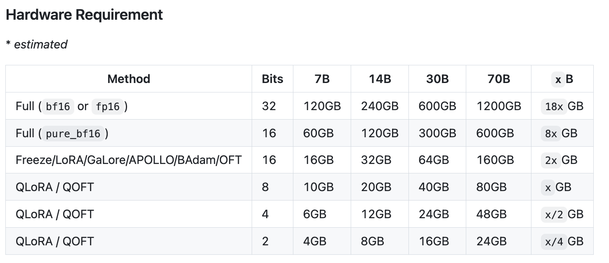
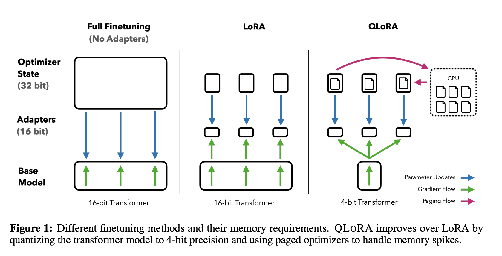
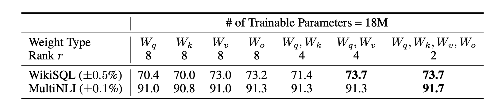
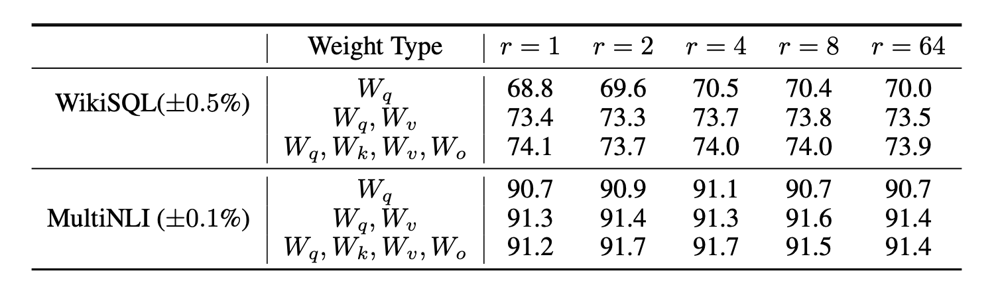
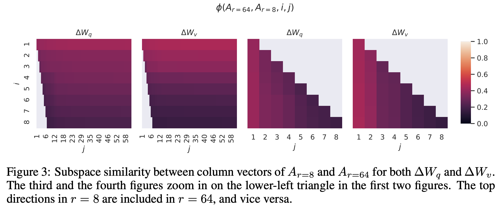
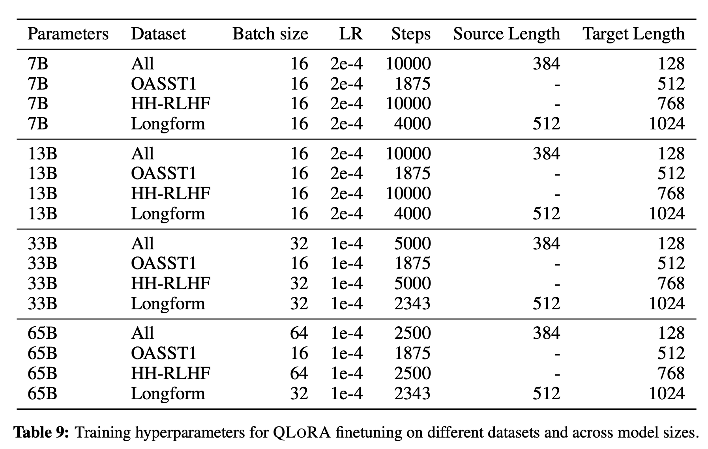

# 重温LoRA的原理，对比LoRA和QLoRA

## 简介

随着越来越多的小伙伴入门AI、大模型、大模型的训练等等，如果对各种原理一知半解的去搞，其实也能搞出名堂，毕竟训练框架基本都有，调调参、改改代码、跑跑训练就能完成整个流程（笔者差不多就是这种）。

但是这样的学习毕竟是浅显的，所以从本节开始笔者时不时会去考古些训练的细节，把自己的想法跟大家分享，有差强人意的地方也欢迎指正😄。

本节会讲下LoRA还有QLoRA的原理与对比等，笔者提出下面的一些问题，我会跟着问题来思考这些原理🤔。

1. LoRA属于“部分参数微调”，LoRA团队指出该方法比“全参量微调”以及其他的微调方式都要更高效，效果更好，那么具体是为什么呢？
2. 对于“全参量微调”、LoRA、QLoRA我们通常使用哪个比较好？有没有什么说法？
3. QLoRA的原理？
4. LoRA针对那些模型层微调效果比较好？为什么？QLoRA呢？
5. LoRA一般设置参数的时候多少比较合适？QLoRA呢？

作者：情感机器实验室研究员-李馨雨

## Q&A

### 问题一：LoRA微调效果相比于传统的微调方式为什么要更好？

LoRA全称是低秩适应（Low-Rank Adaptation），本质是参考了Adapt Tuning也就是适配器（Adapter）微调的方法进行了优化，避免了由于适配器存在的推理延迟问题。同时也是部分参数微调的方法，相比于全参量微调训练更加高效。

因此分别和全参量微调、Adapt Tuning对比他们的原理有什么不同。资料的话考古了下LoRA微调那篇。

> 参考资料：[《LORA: LOW-RANK ADAPTATION OF LARGE LANGUAGE MODELS》](https://arxiv.org/pdf/2106.09685)

**部分参数微调（包含LoRA、适配器微调等）   VS    全参量微调**

我做了一个表格，简单记录下对比的结果

|   阶段   | 是否冻结参数 |    训练参数范围    | 数据规模 |     目的     |
| :------: | :----------: | :----------------: | :------: | :----------: |
|  预训练  |      否      |      所有参数      |   巨大   |   通用能力   |
| 全参微调 |      否      |      所有参数      |   较小   |   任务适应   |
| 部分微调 |      是      | 少量新增或选定参数 |   较小   | 高效任务适应 |

全参量微调我们可以从下面的公式分析：
$$
\max _{\Phi} \sum_{(x, y) \in \mathcal{Z}} \sum_{t=1}^{|y|} \log \left(P_{\Phi}\left(y_{t} \mid x, y_{<t}\right)\right)
$$

- $(x,y)$：“上下文 - 目标”对格式的训练数据
- $(x,y) \in \mathcal{Z}$​：遍历数据集中的每一个 “上下文 - 目标” 对
- $y_{<t}$​：目标序列y中第t个 token 之前的所有 token（即 “前序 token”）
- $x,y_{<t}$：给定 “上下文x” 和 “目标前序 token$y_{<t}$”的条件
- $P_{\Phi}\left(y_{t} \mid x, y_{<t}\right)$：在模型参数为$\Phi$的条件下，给定 “上下文x” 和 “目标前序 token$y_{<t}$”的条件,预测出目标第t个 token$y_t$​的概率分布
- $\max _{\Phi}$：全量微调时，模型所有参数（记为$\Phi$）会沿着梯度方向更新，最终找到使目标函数最大的参数组合$\Phi$

> **简单点说就是**：
>
> 1. 训练的目标是根据前文预测下一个生成的token的概率
> 2. 预训练后模型的参数量是$\Phi$=需要训练的参数量也是$\Phi$

因此对于现在比如0.5B、1.5B、3B等模型，用全参量微调还是可以实现的，本身参数量少的话模型本身能力不强，全参量微调不仅可以全面提高模型性能，而且对资源的占用也不是很高。

但是如果遇到32B、70B甚至175B（GPT-3），那全参量微调不仅会降低模型的泛化能力，训练或者部署都对资源的要求很高，一般都是对资源很充足的团队使用，如果资源有限，并不建议。

---


对于部分参数微调根据下面的公式分析：
$$
\max _{\Theta} \sum_{(x, y) \in \mathcal{Z}} \sum_{t=1}^{|y|} \log \left(p_{\Phi_{0}+\Delta \Phi(\Theta)}\left(y_{t} \mid x, y_{<t}\right)\right)
$$

- $\Phi_0$：冻结的原始预训练模型参数，是所有下游任务共享的 “基础模型权重”，避免全量微调中 “每个任务一套全量参数” 的问题
- $\Theta$：注入的低秩分解矩阵（A 和 B），可训练的小规模参数集合，规模远小于预训练模型全量参数
- $\Delta \Phi(\Theta)$：由$\Theta$编码生成的任务专属参数增量，$\Phi_0+\Delta \Phi(\Theta)$构成适配后模型的总参数
- $p_{\Phi_{0}+\Delta \Phi(\Theta)}(y_{t} \mid x, y_{<t})$：在 “初始冻结权重 + 参数增量” 的模型参数配置下，给定 “上下文x” 和 “目标前序 token$y_{<t}$”的条件,预测出目标第t个 token$y_t$​的概率分布

> **简单点说就是**：
>
> 1. 训练的目标是根据前文预测下一个生成的token的概率
> 2. 预训练后模型的参数量是$\Phi$，但是需要训练的参数量是$ \Theta $，远小于预训练模型的参数量

训练的不是原始的全部参数，而是只有部分参数，因此无论模型多大，都可以使用部分参数微调的方法，相比于全参微调对资源的要求低很多，而且在某些情况下和全参微调的效果差不了太多。不过如果对于模型性能有较高的要求，还是全参量微调比较合适。

---

<div style="background:#e9ffee;color:#000;padding:12px 16px;border-left:4px solid #3eaf56;">
  &emsp;&emsp;因此综上所述，全参量微调就是在原始的预训练模型参数基础上进行微调，<strong>部分参数微调需要冻结原始参数，微调部分参数最后和原始参数合并</strong>。<br/>
	&emsp;&emsp;部分参数微调比较节省资源，而且如果数据集质量比较高，训练超参数选的对，在一些情况下其实和全参微调也不会差很多。
</div>

**LoRA微调   VS   适配器微调**

LoRA微调其实是适配器（Adapter）微调的变体，是用来解决适配器微调带来的诸多问题的，问题如下：

1. 改变了模型结构，插入新的小型子网络（适配器层），与原模型绑定，多任务部署需要维护多个适配器层实例
2. 推理时由于多了一部分，需要额外的计算步骤，无法与原模型并行计算，有额外的推理延迟

这些问题看着比较抽象，放个图对比下其实就很清楚了。

<div style="display:flex;justify-content:center;">
  <figure style="text-align:center;margin:0;">
    
    <figcaption>lora和adapter对比</figcaption>
  </figure>
</div>

从图中就可以看到，LoRA微调其实不插入新网络层，而是对预训练模型中的**关键权重矩阵（如注意力模块的 Q/K/V 投影矩阵）** 引入**低秩分解扰动**，其中权重更新为图中右侧紫色的部分。

如果预训练权重矩阵我们叫$W_0$，那么权重的更新量就是$\Delta W$，$\Delta W=BA$，其中$A$时是降维矩阵（训练前采用随机高斯分布初始化），$B$是升维矩阵（训练前采用零初始化）。实际训练时，我们不去训练$W_0$，而是训练$A$和$B$，参数规模通常为原模型的 0.1%~1%；推理时直接将$W_0$和$\Delta W$​合并，因此不改变原模型结构。而且我们存储的时候可以直接存储不同任务的低秩矩阵权重信息，因此部署成本也比较低，切换任务时加载对应低秩矩阵合并即可。

LoRA模型的前向传播对应的公式为：
$$
h=W_0x+\Delta Wx=W_0x+B\cdot Ax
$$
但是对于适配器微调的模型，会在自注意力模块（以及 MLP 模块）与后续的残差连接（residual connection）之间插入适配器层（adapter layers），当然后续也有很多的变体，比如在MLP层插入，但是本质还是修改了原始的模型结构。这样不仅每次部署需要完整的模型信息，因为需要保留对应的适配器结构，对于多任务来说，可能需要部署维护多个模型（因为不同任务就得训练一次），部署成本大大提高，而且由于多增加了一段结构，推理的时候前向传播就得多计算一段，会有推理延迟。

现在基本部分参数微调用的LoRA还有其变体占绝大多数，adapter的已经很少了，很多比较方便的框架，比如transformers、llamafactory等用LoRA也比较方便，**因此如果想上手微调的话，LoRA系列的就行**。下面总结下LoRA的优势👇：

1. 可以针对不同的下游任务构建小型 LoRA 模块，从而在共享预训练模型参数基础上有效地切换下游任务。
2. LoRA 使用自适应优化器（Adaptive Optimizer），不需要计算梯度或维护大多数参数的优化器状态，训练更有效、硬件门槛更低。
3. LoRA 使用简单的线性设计，在部署时将可训练矩阵与冻结权重合并，不存在推理延迟。
4. LoRA 与其他方法正交，可以组合。

### 问题二：实际使用的时候我们应该具体用哪种方法微调？

<div style="background:#e5f6ff;color:#000;padding:12px 16px;border-left:4px solid #1fb0ff;">
  &emsp;&emsp;在实践当中，可以考虑3B以下的模型使用全参量微调，虽然对训练资源要求较高，但是效果较好。<br/>
  &emsp;&emsp;而如果资源有限，并且模型的参数量较大的情况下，LoRA微调比较好。<strong>其他的微调方式除非LoRA的变体，否则就不太推荐了</strong>。<br/>
</div>


下面我用表格列了一个适合使用的场景（仅为建议，实际需要根据训练数据量、任务领域、训练资源等进行选择）

| 训练方式   | 推荐模型参数量M | 训练数据规模 | 显存占用大小（单卡）/GB |
| ---------- | --------------- | ------------ | ----------------------- |
| 全参量微调 | $\le 3B$        |              | $15到20倍M$             |
| LoRA       | $\le 70B$       |              | $2到5倍M$               |
| QLoRA      | $\le 70B$       |              | $\le2倍M$               |

对于显存占用，具体也可以看下llamafactory官方给出的[数据](https://github.com/hiyouga/LLaMA-Factory)：

<div style="display:flex;justify-content:center;">
  <figure style="text-align:center;margin:0;">
    
    <figcaption>大模型微调显存占用数据</figcaption>
  </figure>
</div>
<div style="background:#fffed7;color:#000;padding:12px 16px;border-left:4px solid #fbb85d;">
  <strong>注意⚠️</strong><br/>
1. QLoRA本质是LoRA的量化版本，虽然很节省资源，但是会掉模型性能，因此在选择微调方式的时候，需要根据实际训练目标调整。<br/>
2. 如果工程上对模型的回答的准确性以及性能上有要求，在资源充足的情况下最好用全参量微调，也就是直接SFT的方式。
</div>

### 问题三：QLoRA的原理具体是？量化的是哪个部分？

QLoRA其实就是LoRA的量化版本，Q表示Quantized（量化），具体针对LoRA的一些问题：

1. 参数空间小: LORA中参与训练的参数量较少，解空间较小，效果相比全量微调有一定的差距
2. 微调大模型成本高: 对干上百亿参数量的模型，LORA微调的成本还是很高。
3. 精度损失:针对第二点，可以采用int8或int4量化，进一步对模型基座的参数进行压缩。但是又会引发精度损失的问题，降低模型性能**（训练之后量化，损失精度）**

QLoRA针对LoRA的这些痛点提出了解决方案，那么QLoRA具体是量化了哪一部分？是预训练模型参数？还是LoRA训练的那部分？量化多少位的数据类型？下面详细解释。

> 参考资料：《[QLORA: Efficient Finetuning of Quantized LLMs](https://arxiv.org/pdf/2305.14314)》

论文里65B的LLaMA模型FP16微调需要780GB的显存占用，但是如果使用QLoRA的话，只需要<48GB的显存占用，并且精度保持在原来微调的95%以上，训练效率显著提升。

QLoRA总共涉及了下面的三个技术：

1. **4-bit NormalFloat（4bit分位量化）:** QLORA包含一种低精度存储数据类型 (通常为4bit) 和一种计算数据类型(通常为BF16)。在实践中，QLORA权重张量使用时，需要将将张量去量化为BF16，然后在16位计算精度下进行矩阵乘法运算。模型本身用4bit加载，训练时把数值反量化到bf16后进行训练。
2. **Double Quantization（双重量化）:** 对第一次量化后的那些常量再进行一次量化，减少存储空间。相比于当前的模型量化方法，更加节省显存空间。
3. **Paged Optimizers（分页优化器）:** 防止梯度检查点（gradient checkpointing）过程中出现的内存峰值导致内存不足错误（OOM），这类错误在以往一直使得大型模型难以在单台机器上进行微调。该功能的工作方式类似于 CPU 内存和磁盘之间的常规内存分页。使用此功能为优化器状态 (Optimizer)分配分页内存，然后在 GPU 内存不足时将其自动卸载到 CPU 内存，并在优化器更新步骤需要时将其加载回 GPU 内存。

<div style="display:flex;justify-content:center;">
  <figure style="text-align:center;margin:0;">
    
    <figcaption>qlora的原理</figcaption>
  </figure>
</div>

<div style="background:#e5f6ff;color:#000;padding:12px 16px;border-left:4px solid #1fb0ff;">
  用一句话解释就是：<br/>
  <strong>QLoRA 是一种在微调过程中进一步减少内存占用的技术。在反向传播过程中，QLoRA将预训练的权重从FP16量化为4bit降低训练的显存，并使用分页优化器来处理内存峰值。</strong>
</div>

首先对于预训练模型，在反向传播训练过程中从原来的FP16精度训练量化到4bit，量化方法采用NF（NormalFloat），NF其实是Quantile Quantization的优化变体。那么什么是 Quantile Quantization？

假设我们要把参数量化到4bit，那在4bit的情况下我们呢最多可以使用的数字就是 2^4 也就是16个。我们最简单的量化方法一般是取最接近的那个值，或者直接 round。

但是这样做的话其实没有充分利用我们有的数位，很有可能大部分原始数值都被量化到同一个4bit数上了，原本有的差异或者说信息在这个量化过程中就丢掉了。

更极端的情况，假如原始的float32浮点数都在0上下波动，可能量化完全变成零，那就没有意义了。

所以如何才能充分利用我们仅剩的16个数？最直观的想法就是，我把所有数字由小到大排列，再分成十六等分，最小的一块映射到量化后的第一个数，第二块映射到量化后的第二个数，以此类推。

这样做原始数据在量化后的数字上分布就是均匀的。这样的做法就是Quantile Quantization。

这里的Quantile意思是分位，我们平常说的中位数，四分之一位数，都是一种分位。既然现在我们只有十六个数，我们可以做一个map，key$\in [0,15]$，value 则是能最低化量化误差的浮点数。存储的时候只存储 key，计算的时候使用value来计算。出于计算方便考量，可以下面这个公式计算出合适的value。
$$
q_{i}=\frac{1}{2}\left(Q_{X}\left(\frac{i}{2^{k}+1}\right)+Q_{X}\left(\frac{i+1}{2^{k}+1}\right)\right)
$$
但是如果每一位都计算一遍，对于内存的消耗太大，因此NF是对其的优化。论文指出，预训练的参数基本上是符合均值为0的正态分布的，因此可以直接缩放到指定的范围内，在文章中使用的是 [-1, 1] 的范围。

接着它的做法是，把正态分布$N(0,1)$按quatile quantization的方法找出$2^k$个量化值，再缩放到 [-1, 1] 范围，以此进行量化。这样的做法存在一个缺点，0这个值可能会被映射到一个不为零的数值上，损失了0的特殊性质。

为了解决这点，文章改进了这个方法，用两个$2^{k-1}$的[0, 1]的范围分别代表正负0~1，再去掉重叠的一个0值，组成最终的数据范围。
然后对于量化，还有个细节，就是QLoRA采用了分块量化（Block-wise Quantization），这主要因为量化是将输入从信息含量更高的表示形式离散化为信息含量更低的表示形式的过程。其常见做法是将高位数据类型转换为低位数据类型，例如从 32 位浮点数转换为 8 位整数（8-bit Integers）。为确保低位数据类型的整个数值范围都能被利用，通常会以输入元素（通常组织为张量（tensor））的绝对最大值（absolute maximum）为基准进行归一化，将输入数据类型重新缩放到目标数据类型的范围内。

但是这种方法存在一个问题：若输入张量中出现幅值较大的值（即异常值），则量化区间（特定的比特组合）无法被充分利用，部分区间内量化的数值会很少甚至没有。为解决异常值问题，一种常用方法是将输入张量分割成多个块（block），对每个块进行独立量化，且每个块都有其专属的量化常数c。

虽然分块能解决异常值的问题，但是仍然存在有额外的负担，例如，若权重矩阵$W$使用32位精度的量化常数且块大小设为64，那么量化常数平均每参数会增加\(32/64 = 0.5\)位的内存占用，对于 4bit 量化来说额外的0.5bit相当于多12.5%的显存耗用。而双重量化技术则有助于降低量化常数的内存开销。

对c再进行一次量化，考虑到c一般出现异常值的概率较小，使用256作为block大小再量化一次c得到8bit的$c'$。

改进过后每个参数的额外消耗为：**8/64 + 32/(64 \* 256) = 0.127 bit**，相比于没有二次量化的结果来说，内存占用少了将近3/4，有效的提高了训练效率。

最后利用NVIDIA统一内存的特性为优化器状态（optimizer states）分配分页内存：当 GPU 内存不足时，这些优化器状态会自动驱逐（evicted）到 CPU 内存中；而当优化器更新步骤（optimizer update step）需要使用这些内存时，它们又会被分页回（paged back）GPU 内存，这样可以可以有效减少 GPU 显存的峰值占用。

### 问题四：LoRA需要针对哪些模型层微调？QLoRA呢？

总的来说，LoRA可以针对多个模型层来进行微调，我在下面列了表格：

|                  | 权重矩阵                   | 具体的模型层                               |
| ---------------- | -------------------------- | ------------------------------------------ |
| **注意力机制层** | $W_q,W_k,W_v,W_o$          | **`q_proj`**，k_proj，**`v_proj`**，o_proj |
| **前馈网络层**   | $W_{up},W_{down},W_{gate}$ | up_proj，down_proj，gate_proj              |
| 词嵌入层         | $W_e$                      | embed_tokens                               |
| 其他层           | -                          | lm_head                                    |

在实际使用当中，通常只会用到**`注意力机制层`**和**`前馈网络层`**，这是因为这些层是模型中参数较多且对任务适应性影响较大的部分。通过对这些层进行低秩适应，可以在保持模型性能的同时显著减少微调所需的参数数量和计算资源。

> 但是**`注意力机制层`**和**`前馈网络层`**有多个模型层，需要全部用到微调当中吗？
>
> 答案并不是，一般微调$W_q,W_k$就够了，很多教程默认的也是这两个层，除非有特殊情况，才会修改成其他的模型层，一般也是在此基础上添加模型层。

在LoRA那篇论文里，作者做过非常详细的消融实验，结果如下：

<div style="display:flex;justify-content:center;">
  <figure style="text-align:center;margin:0;">
    
    <figcaption>LoRA消融实验结果</figcaption>
  </figure>
</div>

如果是单独的$W_q$或者$W_k$，效果都会大打折扣，有$W_v、W_o$或者包含其权重矩阵的组合时，效果都比较高，其中$W_q和W_v$的组合与全部的注意力机制层的微调效果差不了太多。

<div style="background:#e5f6ff;color:#000;padding:12px 16px;border-left:4px solid #1fb0ff;">
所以在很多的框架中，LoRA的参数设置的时候基本都是Q和V对应的权重矩阵，代码里表示如下：
</div>

  ```python
  from peft import LoraConfig
  lora_config = LoraConfig(
        ……
        target_modules=['q_proj', 'v_proj'],
    )
  ```

原因的话，笔者分析应该是自注意力的本质是通过Q与K的交互计算注意力分布（“关注输入的哪些部分”），再通过V矩阵将注意力分布转化为最终的上下文表征。注意力的公式如下
$$
Attention (Q,K,V)=softmax(\frac{Q \cdot  K^T}{\sqrt{d}})\cdot  V
$$
其中Q决定了应该“如何提问”，模型基于下游任务需求，调整对输入序列的查询方式，会直接影响注意力的分配逻辑。

然后V决定了模型应该“如何整合信息”，在计算好注意力分数后，将被关注的输入部分转化为任务相关的语义表征，从而直接影响输出质量。

相比之下，K更多是对输入的固定编码（“提供被查询的键”），其适应性需求较低；而输出投影矩阵则更偏向于对注意力结果的线性转换，微调优先级低于Q和 V。而且由于KVcache的应用，计算的时候只有Q在不断的变换，剩下的K、V部分权重信息会缓存起来，从而重复使用，微调的时候Q部分对于整体的推理效果更加关键，因此事实上有些教程里，微调的时候只会微调$W_q$。

同时，因为Q和V的参数规模通常小于模型整体参数，仅微调二者可在控制参数总量的同时，精准捕捉下游任务的核心需求。实验表明，即使采用低秩适配，Q和V的组合也能覆盖任务所需的关键信息，无需调整全部权重。

---

QLoRA沿用了 LoRA 核心的低秩更新机制，主要训练的矩阵与 LoRA 类似，聚焦于模型中对任务适配关键的模块，尤其常见于 Transformer 架构的注意力层，具体包括注意力机制中的**查询（Q）矩阵和值（V）矩阵**相关的低秩矩阵（即 LoRA 中的低秩分解矩阵 A 和 B），同时冻结经过 4-bit 量化的原始预训练模型权重。

### 问题五：LoRA微调的参数应该怎么设置？QLoRA呢？

由于我们在设置参数的时候需要考虑多个参数：

1. r
2. lora_alpha
3. lora_dropout
4. bias

我想对于lora_dropout和bias应该没什么纠结的，直接按照默认值来就行，因为这两个参数只是影响正则化的，防止模型训练过拟合，但是对于`r`还有`lora_alpha`怎么设置有点疑问，下面详细解释下：

`lora_alpha`我们用$\alpha$来替代，$\alpha$只是一个**人为设定的常数**，和$r$组合作为LoRA公式的缩放系数$scale=\frac{\alpha}{r}$
$$
h=W_0x+scale \cdot \Delta Wx=W_0x+\frac{\alpha}{r} \cdot BAx
$$
本身$\alpha$没什么含义，但是给低秩更新做一次**数值缩放**，和$r$组合构成的系数对微调的性能有影响，比如如果令$\alpha=16$，如果$r分别是2，8，16$，那么对应的系数就是$8，2，1$。

[官方的代码](https://github.com/microsoft/LoRA/blob/main/loralib/layers.py#L50)里原理一致：

```python
……
self.lora_A = nn.Parameter(self.weight.new_zeros((r, num_embeddings)))
self.lora_B = nn.Parameter(self.weight.new_zeros((embedding_dim, r)))
self.scaling = self.lora_alpha / self.r
……
……
result += (after_A @ self.lora_B.transpose(0, 1)) * self.scaling
```

<div style="background:#e5f6ff;color:#000;padding:12px 16px;border-left:4px solid #1fb0ff;">
因此结论是，选好了r之后，根据需要设定一个scale，得到alpha的值即可，做消融实验的时候，如果要调整r的值，alpha也要跟着变动保持scale不变。
</div>

那么r应该如何选呢？

**答案是[1,8]范围内2的幂次方即可，比如1，2，4，8都可以，大一点的值也可以，但是没必要，因为效果差不多的同时，需要消耗更多的资源。**

我们可以看下LoRA作者实验的结果：

<div style="display:flex;justify-content:center;">
  <figure style="text-align:center;margin:0;">
    
    <figcaption>LoRA消融实验结果</figcaption>
  </figure>
</div>

$r=8$的时候，效果和$r=64$基本一致，甚至更强。

按照作者的意思是，**$r=8$学到的8个主方向，几乎全部被$r=64$​的前8–10个方向涵盖。换句话说，低秩LoRA微调学到的核心方向，基本上就是高秩LoRA微调的核心方向，即使高秩微调有多个学习方向，但是影响模型性能的基本就是前面的部分。因此低秩微调不会丢掉关键的子空间。**

<div style="display:flex;justify-content:center;">
  <figure style="text-align:center;margin:0;">
    
    <figcaption>r分别为8、64时的模型影响</figcaption>
  </figure>
</div>
---

在QLoRA的那篇文章里，给出的超参数$r=64，alpha=16$，但是我感觉应该根据实际情况来设置，实际上**LoRA怎么设置的，QLoRA设置成同样的秩还有alpha即可**，因为本质都是LoRA。

但是其他的超参数需要根据数据集以及下游任务来设置，论文里给出了一些参考：

<div style="display:flex;justify-content:center;">
  <figure style="text-align:center;margin:0;">
    
    <figcaption>qlora的超参数参考举例</figcaption>
  </figure>
</div>


# 后续待更

后续会补充大模型LoRA还有QLoRA微调的实战教程，敬请期待……
