# 一文带你熟悉lora微调各类参数，轻松上手deepseek模型微调(全过程代码+结果对比)


## 📝简介

在大模型的微调过程中，`LoRA`（低秩适配）参数设置是提升训练效率和性能的关键。通过减少需更新的参数量，`LoRA`能够在维持模型性能的同时显著降低计算成本。然而，`LoRA`并非唯一影响训练效果的因素。诸如学习率、批次大小以及优化器（如AdamW）等参数同样在微调过程中起着至关重要的作用。学习率决定了模型每次更新的幅度，批次大小则影响了每次训练中样本的处理量，而优化器则确保模型参数的平稳更新。
了解并灵活调整这些训练参数，不仅能帮助你在微调过程中得心应手，更能快速提升训练效果。本文将通过使用多轮对话数据集进行微调实验，帮助你深入了解微调的核心原理，并提供一套完整的操作指南。
在本教程中，你将学习到：

1. 如何进行`LoRA参数`的设置，并掌握在不同任务中的应用。
2. 训练过程中如何合理调整学习率、批次大小等关键参数，以优化模型性能。
3. 多轮对话数据集的微调方法和原理，为你提供实践的基础。

本实验基于transformers和openMind均已实现本次微调，代码均可在github链接上查看。

通过本次实验，你不仅能够完成多轮对话数据的微调，还能掌握这些方法，并将其迁移到其他微调实验中，独立进行高效的模型调优。

---

## 📚链接资料

作者信息：情感机器实验室研究员-李馨雨  邮箱：[wind.340171@gmail.com](wind.340171@gmail.com)

数据集：[心理大模型微调数据集地址](https://github.com/SmartFlowAI/EmoLLM/blob/main/datasets/data_pro.json)

模型地址：[deepseek-llm-chat-7B](https://www.modelscope.cn/models/deepseek-ai/deepseek-llm-7b-chat)

代码地址：[github](https://github.com/828Tina/deepseek-llm-7B-chat-lora-ft)

可视化工具SwanLab项目地址：[SwanLab结果可视化](https://swanlab.cn/@LiXinYu/deepseek-llm-7b-chat-finetune/overview)

魔乐社区友情链接：[https://modelers.cn/](https://modelers.cn/)

> 魔乐社区是一个综合性的人工智能平台，它提供了应用使能开发套件，支持各大模型社区，具备海量模型/数据托管能力，并提供在线推理体验服务。该平台还支持接入内容审核、病毒扫描等服务，助力平台伙伴快速构建社区，并对外提供模型/数据集托管和在线推理体验服务。openMind开发套件提供模型训练、微调、评估、推理等全流程开发能力，开发者可以通过简单的API接口实现微调、推理等任务，显著缩短开发周期。


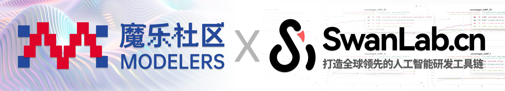

---
👉 **SwanLab官方文档：**

用户指南，可以快速上手<span style="color: #0000FF;">SwanLab</span>：🚀[快速开始 | SwanLab官方文档](https://docs.swanlab.cn/guide_cloud/general/quick-start.html)

应用案例：[入门实验 | SwanLab官方文档](https://docs.swanlab.cn/examples/mnist.html)

---

## 💻多轮对话数据构建

多轮对话微调其实和单轮对话(或者说指令数据)差不多，在我看来其实类似于多个指令数据的组合，单轮对话数据处理的时候只需要处理输入和输出即可，训练的时候输入置为-100，输出不变，而多轮对话微调数据集以及标签的构造方法，有三种常见方法，下面将详细介绍。

**训练不充分**

第一种方法是，只把最后一轮机器人的回复作为要学习的标签，其它地方作为语言模型概率预测的condition，无需学习，赋值为-100，忽略这些地方的loss。

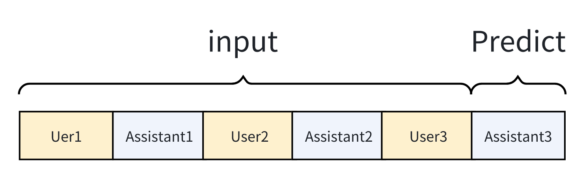

```python
inputs = <user1> <assistant1> <user2> <assistant2> <user3> <assistant3>
labels = <-100> <-100> <-100> <-100> <-100> <assistant3>
```

这种方法由于没有对中间轮次机器人回复的信息进行学习，因此存在着严重的信息丢失，是非常不可取的。

**训练不高效**

第二种方法是，把一个多轮对话拆解，构造成多条样本，以便对机器人的每轮回复都能学习。

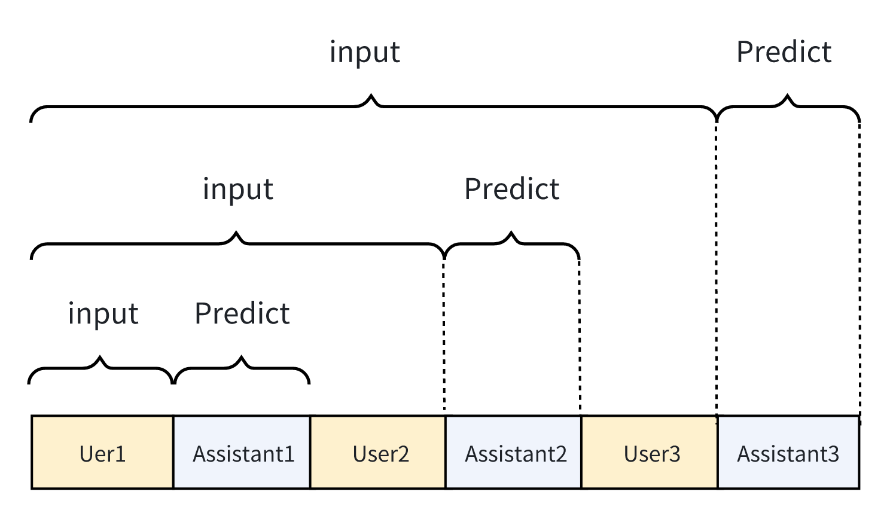

```python
inputs1 = <user1> <assistant1> 
labels1 = <-100> <assistant1>

inputs2 = <user1> <assistant1> <user2> <assistant2> 
labels2 = <-100> <-100> <-100> <assistant2> 

inputs3 = <user1> <assistant1> <user2> <assistant2> <user3> <assistant3>
labels3 = <-100> <-100> <-100> <-100> <-100> <assistant3>
```

这种方法充分地利用了所有机器人的回复信息，但是非常低效，模型会有大量的重复计算。

**合适的数据组合方式**

第三种方法是，直接构造包括多轮对话中所有机器人回复内容的标签，充分地利用了所有机器人的回复信息，同时也不存在拆重复计算，非常高效。目前大部分微调框架用的都是这个组合方式。

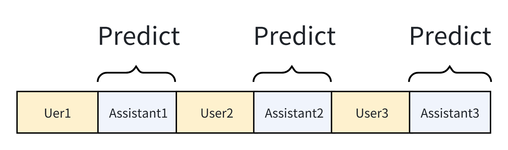

```python
inputs = <user1> <assistant1> <user2> <assistant2> <user3> <assistant3>
labels = <-100> <assistant1> <-100> <assistant2> <-100> <assistant3>
```

我们为什么可以直接构造多轮对话样本？难道将第二轮和第三轮对话内容加入 inputs 中不会干扰模型对第一轮对话的学习吗？

答案是：不会。原因在于，作为一种语言模型，LLM（大语言模型）采用的是基于注意力机制的结构，其中的自注意力机制（Self-Attention） 在处理输入时，具有天然的局部性约束。具体来说，LLM 在处理每一个输入时，使用掩码注意力（Masked Attention）来确保每个位置的预测只依赖于前面已经生成的内容，而不会提前“看到”后续的对话轮次。

也就是说，尽管输入数据中包含了多轮对话的信息，模型在进行每一轮对话的生成时，仅会关注当前回合的上下文，而不受后续轮次内容的影响。这样，第一轮的对话内容与后续轮次的对话并不会相互干扰，从而保持了学习的纯粹性。通过这种机制，模型能够有效地在多轮对话的框架下进行训练，同时保证每轮对话的独立性和准确性。

> 简而言之，LLM 能够通过其掩码机制在多轮对话中进行“局部”学习，每次生成的内容都仅与当前上下文相关，而不会受到其他轮次的干扰。

---
## ⚙️各实验参数原理

### 📌lora参数

LoRA（Low-Rank Adaptation）是一种针对大型语言模型的微调技术，旨在降低微调过程中的计算和内存需求。其核心思想是通过引入低秩矩阵来近似原始模型的全秩矩阵，从而减少参数数量和计算复杂度。

在LoRA中，原始模型的全秩矩阵被分解为低秩矩阵的乘积。具体来说，对于一个全秩矩阵W，LoRA将其分解为两个低秩矩阵A和B的乘积，即W ≈ A * B。其中，A和B的秩远小于W的秩，从而显著减少了参数数量。

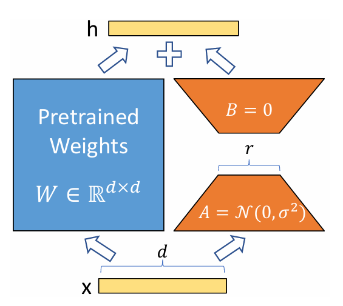

上图为 LoRA 的实现原理，其实现流程为：
1. 在原始预训练语言模型旁边增加一个旁路，做降维再升维的操作来模拟内在秩；
2. 用随机高斯分布初始化 A，用零矩阵初始化B，训练时固定预训练模型的参数，只训练矩阵 A 与矩阵 B ；
3. 训练完成后，将 B 矩阵与 A 矩阵相乘后合并预训练模型参数作为微调后的模型参数。

公式表示为：

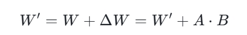

其中，W是原始的权重矩阵，A是一个尺寸为d*r的矩阵，B是一个尺寸为r*d'的矩阵，r是低秩矩阵的秩。通过这种分解，原始矩阵W的更新仅由A和B的乘积决定。进一步地，LoRA引入了一个缩放因子α，使得更新公式为：


那么在实际使用的时候，我们如何确定lora参数？这些参数的变化对实验结果产生什么影响？模型具体哪些部分参数需要使用lora？等等这些问题，我们应该如何应对？下面我将详细介绍。

**LoraConfig各个参数设置**

`peft`（Parameter-Efficient Fine-Tuning）库是一个用于高效微调大规模预训练模型的工具，旨在减少训练时的计算和存储成本，同时保持模型性能。它通过引入LoRA、Adapter等技术，使得只需调整部分参数即可实现有效的微调。`LoraConfig`是`peft`库中的一个配置类，用于设置LoRA相关的超参数，如低秩矩阵的秩、缩放因子等，它帮助用户定制LoRA微调的细节，优化训练过程的效率和效果。

```python
from peft import LoraConfig, TaskType

lora_config = LoraConfig(
        r=16,
        lora_alpha=32,
        lora_dropout=0.05,
        bias="none",
        target_modules=['up_proj', 'gate_proj', 'q_proj', 'o_proj', 'down_proj', 'v_proj', 'k_proj'],
        task_type=TaskType.CAUSAL_LM,
        inference_mode=False  # 训练模式
    )
```

**1. target_modules**

`target_modules`是 LoRA（Low-Rank Adaptation）中的关键参数，用于指定模型中需要插入低秩矩阵调整的模块。LoRA 的核心思想是通过对预训练模型中的特定层进行低秩矩阵插入，实现参数高效微调而无需修改原始权重。对于语言模型，通常选择影响权重更新较大的模块，例如`q_proj`和`k_proj`（负责查询和键的变换），`v_proj`（值的变换），以及`o_proj`（输出投影）等。这些模块主要集中在自注意力和前馈网络中，通过插入的低秩矩阵调整这些模块的权重，使模型在保持原始能力的同时适应新任务，极大减少微调的计算和存储开销。

具体如下，我们使用deepseek观察模型每一层具体都是什么：

```python
# 查看模型层的代码如下
# 本文使用的是大模型的通用对话功能，因此导入AutoModelForCausalLM查看

from transformers import AutoModelForCausalLM

model = AutoModelForCausalLM.from_pretrained(model_name)
print(model)
```

```python
LlamaForCausalLM(
  (model): LlamaModel(
    (embed_tokens): Embedding(102400, 4096)
    (layers): ModuleList(
      (0-29): 30 x LlamaDecoderLayer(
        (self_attn): LlamaSdpaAttention(
          (q_proj): Linear(in_features=4096, out_features=4096, bias=False)
          (k_proj): Linear(in_features=4096, out_features=4096, bias=False)
          (v_proj): Linear(in_features=4096, out_features=4096, bias=False)
          (o_proj): Linear(in_features=4096, out_features=4096, bias=False)
          (rotary_emb): LlamaRotaryEmbedding()
        )
        (mlp): LlamaMLP(
          (gate_proj): Linear(in_features=4096, out_features=11008, bias=False)
          (up_proj): Linear(in_features=4096, out_features=11008, bias=False)
          (down_proj): Linear(in_features=11008, out_features=4096, bias=False)
          (act_fn): SiLU()
        )
        (input_layernorm): LlamaRMSNorm((4096,), eps=1e-06)
        (post_attention_layernorm): LlamaRMSNorm((4096,), eps=1e-06)
      )
    )
    (norm): LlamaRMSNorm((4096,), eps=1e-06)
    (rotary_emb): LlamaRotaryEmbedding()
  )
  (lm_head): Linear(in_features=4096, out_features=102400, bias=False)
)
```

可以看到deepseek模型也是采取的Llama模型结构，那么具体哪些层会参与lora微调呢？下面将详细介绍

**1. Attention层**

- **Self-attention层**: 这些层通常对模型性能影响较大。LoRA会被应用于自注意力的查询（q_proj）、键（k_proj）、值（v_proj）和输出（o_proj）投影矩阵。这些矩阵包含了大量的可训练参数，因此是LoRA微调的理想目标。

- **LlamaSdpaAttention中的矩阵：**
  
  - `q_proj`:查询投影
  - `k_proj`:键投影
  - `v_proj`:值投影
  - `o_proj`:输出投影

- **Rotary Embedding**：虽然在一些实现中会对嵌入进行微调，但通常LoRA不会直接用于rotary_emb，因为它通常是固定的。

**2. MLP层**

- **MLP层中的Gate、Up和Down投影**：
  - `gate_proj`：控制门投影
  - `up_proj`：上升投影
  - `down_proj`：下降投影
- MLP层的Gate、Up和Down投影通常涉及大量的可训练参数，因此对这些投影进行LoRA微调，可以在不显著增加计算负担的情况下优化模型表现。通过低秩适应，LoRA能够在减少参数量的同时，增强模型对复杂模式的适应能力。这些曾在**处理非线性变换时起到重要作用**，通常也是LoRA微调的目标。

**3. LayerNorm层**

- **RMSNorm**: 在Llama中使用的是LlamaRMSNorm（Root Mean Square Layer Normalization），它与标准的LayerNorm不同，但也可以通过LoRA微调。虽然这部分常常不会进行微调，但如果需要微调，通常会集中在注意力层和MLP层上。

**4.Embedding层**

- `embed_tokens`：如果对词嵌入有需要进行微调，LoRA也可以应用于嵌入矩阵。尤其在词汇量较大的情况下，嵌入矩阵的参数量非常庞大，这样进行LoRA微调也可以获得一定的性能提升。

**5. 线性层（lm_head）**

- `lm_head`：在模型输出时，`lm_head`是从隐藏层到词汇表的最后一层线性转换。通常，LoRA不会直接应用于输出层，但在某些微调场景下，可以将LoRA应用于该层以调整模型输出。

> **📝**总结**：
>
> 一般来说，LoRA微调会集中在以下层：
> 
> - Attention层的查询、键、值和输出投影（`q_proj`, `k_proj`, `v_proj`, `o_proj`）
> - MLP层的`gate_proj`、`up_proj`和`down_proj`
> - 可能在某些场景下微调`embed_tokens`和`lm_head`
> 
> 通过这种方式，LoRA能够有效减少参数量和计算成本，同时保持微调的效果。

### r、alpha、dropout

在模型微调的过程中，r、alpha和dropout是常见的超参数，用于优化模型训练和提升其泛化能力。
- `r`：通常用于LoRA（Low-Rank Adaptation）方法中，表示低秩矩阵的秩值。r决定了微调时使用的低秩矩阵的维度，较小的r可以减少参数数量，从而提高训练效率，但可能牺牲一定的模型表现。较小的r（例如 8-32）适用于较小模型或需要较低资源的情况，而较大的r（例如 64-128）适用于更大规模的模型。
- `alpha`：是LoRA中的一个超参数，用来控制低秩矩阵的缩放因子。通过调整alpha，可以平衡低秩矩阵的影响，使模型能够在微调过程中保持足够的表达能力。16-32 是比较常见的选择，较大的alpha值通常会增加模型的表达能力，但也可能增加训练难度。
- `Dropout`：是一种正则化技术，通过在训练过程中随机丢弃神经网络中的部分神经元来防止过拟合。dropout率控制丢弃的概率，较高的dropout率有助于减少模型的复杂度，从而提升其在新数据上的泛化能力。对于大多数任务，0.2-0.3 是比较常见的取值，较低的dropout值（如 0.1）适合于较小的模型，而较高的dropout值（如 0.4-0.5）适合于较大的网络，尤其是在防止过拟合时。


> **📝**总结**：
> 
> - r：通常选择 **8-128**，根据任务和模型规模调整。
> - alpha：常见值在 **16-64**，推荐 **16-32**。
> - Dropout：常见值在 **0.1-0.5**，推荐 **0.2-0.3**。

### task_type

在`LoraConfig`中的`task_type`是一个指定模型任务类型的参数，它帮助LoRA配置不同的微调策略，以适应特定的任务需求。`task_type`可以有多个选项，通常包括以下几种类型：

**1、CAUSAL_LM**

自回归语言建模任务，模型基于输入的部分文本（上下文）来预测下一个词，适用于生成任务，如文本生成和语言建模。

**2、SEQ_CLS**

文本分类任务，模型将整个输入文本分类到某个类别。常见的应用包括情感分析、垃圾邮件检测、新闻分类等。

**3、SEQ_2_SEQ_LM**

序列到序列的语言建模任务。该任务类型处理输入序列并生成一个输出序列。通常用于机器翻译、文本摘要等任务。

**4、TOKEN_CLS**

标记分类任务，模型为输入文本的每个标记（通常是词或子词）分配一个类别标签。常见应用包括命名实体识别（NER）、词性标注（POS）、依存句法分析等。

**5、QUESTION_ANS**

问答任务，模型根据输入的问题和上下文，提取答案。常见应用包括阅读理解、基于文档的问答等。

**6、FEATURE_EXTRACTION**

特征提取任务，模型提取输入数据的隐藏状态（通常是编码器的输出），这些隐藏状态可以用于下游任务，如聚类、分类或作为其他任务的输入特征。比如给定一段文本，模型输出该文本的向量表示，这些向量可以用于情感分析、推荐系统或相似度计算等任务。

### bias

在`LoraConfig` 配置中，`bias`参数用于指定 LoRA 微调时如何处理偏置（bias）项。具体来说，这个参数控制了在低秩适应中，是否保留或者修改偏置项。LoRA微调一般会将权重矩阵拆分成低秩矩阵来减少训练时的计算开销，但偏置项通常会保留或处理得不同。

`bias`参数的常见选项：

1. **"none"**：不对偏置项进行微调，也就是说，偏置项保持原样，不参与LoRA的低秩适应过程。这是默认选项，表示不修改偏置项，保持原有权重。
2. **"all"**：对所有的偏置项进行微调，这意味着LoRA不仅会对权重矩阵进行低秩适应，还会对偏置项进行相应的调整。
3. **"lora_only"**：仅对LoRA引入的低秩矩阵中的偏置项进行微调。即在LoRA的低秩变换部分，偏置项会被包含在内，并进行优化。

> **为什么选择 "none" 作为 bias 的值？**
> 
> 在许多LoRA微调的实现中，偏置项通常被认为是模型的一个稳定部分，尤其是在进行低秩微调时，可能并不需要对它们进行调整。使用 "none" 的选择意味着微调过程只会集中在权重矩阵的低秩部分，而不涉及偏置项的变动，这有助于减少额外的计算和参数调节，保持模型的原始结构。

### 其他参数

1、根据任务配置
- use_rslora (bool): 是否使用Rank-Stabilized LoRA。这个方法有时可以提高训练效果，尤其是在低秩情况下。若不需要，可以保持False。
- init_lora_weights (bool | Literal["gaussian", "olora", "pissa", "loftq"]): 初始化LoRA权重的方式。常用的初始化方式是"gaussian"，但如果有特殊需求，也可以选择其他选项。
- modules_to_save (list[str]): 除LoRA层外需要保存的其他模块，通常用于在分类任务中保存最后的分类层等。
- layers_to_transform (list[int] | int): 选择要转换的层，适用于大规模模型，可以选择特定层进行微调。默认会选择整个模型进行LoRA微调。
- layers_pattern (list[str] | str): 用于指定层模式名称，与layers_to_transform结合使用，用于选择模型中的特定层。

2、特定需求使用

- use_dora (bool): 启用Weight-Decomposed LoRA（DoRA）。这个选项通常用于进一步优化低秩适应，但会引入额外的计算开销。如果不需要，可以保持False。
- layer_replication (list[tuple[int, int]]): 用于层扩展，适用于希望通过复制层来扩展模型的情况。如果不涉及此类操作，可以忽略。
- runtime_config (LoraRuntimeConfig): 用于设置运行时配置，通常是自动处理的，除非有特殊需要，否则不需要更改。

3、不常用

- megatron_config (dict): 仅当使用Megatron架构时需要，若不使用Megatron框架，通常不需要设置。
- megatron_core (str): 同上，适用于Megatron核心模块。

## 📌训练参数

### Trainer

一般来说，我们在训练的时候可以直接使用transformers或者其他的比如PyTorch的Lightning的训练器配置，当然也有些github上自己封装的或者基于这两个继续封装的Trainer，那么具体我们应该使用哪种比较好呢？

其实单从使用量来看的话，应该是HuggingFace的Transformers更胜一筹，社区更活跃，很多的开源微调大模型用的也都是HuggingFace的Transformers，它也是率先支持微调LLaMa模型。不过由于其更新的时候变化比较多，当版本差的有点多的时候可能会出现bug，应该是老版本的兼容不了新的一些库吧。

Trainer 简单来说就是封装了 PyTorch 的训练过程，包括前向传播、反向传播和参数更新等等步骤，咱们只需要设计模型（copy），调参（炼丹）就行，高级点的Trainer就是加上了各种的功能，比如日志记录，断点重训，训练方式与精度，支持各种分布式训练框架像原生、Apex、Deepspeed和Fairscale，支持自定的回调函数等等。
常用的参数如下：

```python
trainer = Trainer(
        model=model,
        args=train_args,
        train_dataset=train_dataset,
        data_collator=data_collator,
        callbacks=[swanlab_callback],
        )
```

**常用的参数：**

1. model (PreTrainedModel 或 torch.nn.Module, 可选)：要进行训练、评估或预测的实例化后模型，如果不提供，必须传递一个 model_init来初始化一个模型。
2. **args (TrainingArguments, 可选)：训练的参数**，如果不提供，就会使用默认的TrainingArguments 里面的参数，其中 output_dir 设置为当前目录中的名为 "tmp_trainer" 的目录。
3. train_dataset (torch.utils.data.Dataset 或 torch.utils.data.IterableDataset, 可选)：用于训练的数据集，如果是torch.utils.data.Dataset，则会自动删除模型的 forward() 方法不接受的列。
4. eval_dataset (Union[torch.utils.data.Dataset, Dict[str, torch.utils.data.Dataset]), 可选)：同上，用于评估的数据集，如果是字典，将对每个数据集进行评估，并在指标名称前附加字典的键值。
5. data_collator (DataCollator, 可选)：用于从 train_dataset 或 eval_dataset 中构成batch的函数，如果未提供tokenizer，将默认使用 default_data_collator()；如果提供，将使用 DataCollatorWithPadding 。
6. callbacks (TrainerCallback 列表, 可选)：自定义回调函数，如果要删除使用的默认回调函数，要使用 Trainer.remove_callback() 方法。这里可以选择可视化工具回调函数来观测实验过程。

**不常用的参数：**

1. model_init (Callable[[], PreTrainedModel], 可选)：用于实例化要使用的模型的函数，如果提供，每次调用 train() 时都会从此函数给出的模型的新实例开始。
2. preprocess_logits_for_metrics (Callable[[torch.Tensor, torch.Tensor], torch.Tensor], 可选)：用于指定一个函数，这个函数在每次评估步骤（evaluation step）前，其实就是在进入compute_metrics函数前对模型的输出 logits 进行预处理。接受两个张量（tensors）作为参数，一个是模型的输出 logits，另一个是真实标签（labels）。然后返回一个经过预处理后的 logits 张量，给到compute_metrics函数作为参数。
3. compute_metrics (Callable[[EvalPrediction], Dict], 可选)：用于在评估时计算指标的函数，必须接受 EvalPrediction 作为入参，并返回一个字典，其中包含了不同性能指标的名称和相应的数值，一般是准确度、精确度、召回率、F1 分数等。
4. optimizers (Tuple[torch.optim.Optimizer, torch.optim.lr_scheduler.LambdaLR], 可选)：用于指定一个包含优化器和学习率调度器的元组（Tuple），这个元组的两个元素分别是优化器
（torch.optim.Optimizer）和学习率调度器（torch.optim.lr_scheduler.LambdaLR），默认会创建一个基于AdamW优化器的实例，并使用 get_linear_schedule_with_warmup() 函数创建一个学习率调度器。

其中**args (TrainingArguments, 可选)**需要额外注意，因为它包含了epochs、batch_size等各种训练参数设置，是非常重要的环节，比如本文在进行实验的时候对这些参数加以设置：

```python
train_args = TrainingArguments(
    output_dir=output_dir,
    per_device_train_batch_size=2,
    gradient_accumulation_steps=8,
    logging_steps=1,
    num_train_epochs=3,
    save_steps=5000,
    learning_rate=2e-5,
    save_on_each_node=True,
    gradient_checkpointing=True,
    report_to=None,
    seed=42,
    optim="adamw_torch",
    fp16=True,
    bf16=False,
    remove_unused_columns=False,
)
```

其中fp16、gradient_checkpointing、gradient_accumulation_steps等都可以减少显存压力，而per_device_train_batch_size可能会增加显存压力，但是训练完后的效果可能会更好，在设置这些参数的时候需要根据自身条件合理分配。下面我将详细列举这些参数的含义，并且列举出比较重要的参数。

### TrainingArguments（常用的参数）

#### 影响显存的参数设置

1. **per_device_train_batch_size**：用于指定训练的每个GPU/XPU/TPU/MPS/NPU/CPU的batch，每个训练步骤中每个硬件上的样本数量。较大的batch size会增加显存的占用。
2. **per_device_eval_batch_size**：用于指定评估的每个GPU/XPU/TPU/MPS/NPU/CPU的batch，每个评估步骤中每个硬件上的样本数量。较大的batch size会增加显存的占用。
3. **gradient_accumulation_steps**：用于指定在每次更新模型参数之前，梯度积累的更新步数。通过梯度积累可以在多个batch上累积梯度，然后更新模型参数，这可以在显存不够的情况下执行大batch的反向传播，但会增加显存的使用。
4. **eval_accumulation_steps**：指定在执行评估时，模型会累积多少个预测步骤的输出张量，然后才将它们从GPU/NPU/TPU移动到CPU上。默认是整个评估的输出结果将在GPU/NPU/TPU上累积，然后一次性传输到CPU，速度更快，但占显存。
5. max_grad_norm：指定梯度剪裁的最大梯度范数，可以防止梯度爆炸，但剪裁操作可能会增加显存的使用。
6. **gradient_checkpointing**：是否开启梯度检查点，这会在训练期间释放不再需要的中间结果以减小内存占用，但它会使训练变慢。这个参数会影响显存的使用，因为它涉及到保存中间激活值。
7. **bf16、fp16**：这些参数用于指定是否使用bf16或fp16进行混合精度训练，而不是fp32训练。使用更低的精度可以减少显存的使用。二者只能使用其一，如果fp16设置为True的话，bf16就只能设置为False，反之亦然。

#### 输出模型保存参数

1. **output_dir (str)**：用于指定模型checkpoint和最终结果的输出目录。
2. **save_steps（int）**：每过多少步保存一次模型。
3. **save_on_each_node (bool, 可选, 默认为 False)**：在进行多节点分布式训练时，是否在每个节点上保存checkpoint，还是仅在主节点上保存。注意如果多节点使用的是同一套存储设备，比如都是外挂的同一个nas，开启后会报错，因为文件名称都一样。

#### 可视化工具参数配置

1. **report_to（str）**：可视化工具的选择。由于swanlab没有直接与transformers集成，而是以回调函数的方式与transformers集成，因此这里需要设置为None，在Trainer里直接设置回调函数来配置可视化工具。
2. **logging_strategy (str, 可选, 默认为"steps")**：训练过程中采用的日志记录策略。可选包括：
    "no"：在训练过程中不记录任何日志。
    "epoch"：在每个epoch结束时记录日志。
    "steps"：根据logging_steps参数记录日志。
3. **logging_steps（int）**：如果logging_strategy="steps"，则此参数为每多少步记录一次步骤。这里最好把步数设置的少一点，不然swanlab有可能曲线会很多步才会更新一次，并且如果两步之间时间间隔太长，swanlab可能无法记录。

#### 训练参数设置

1. **learning_rate (float, 可选, 默认为 5e-5)**：指定AdamW优化器的初始学习率。这个值在训练前设置的时候不能过大，也不能过小，不然都可能会使得实验结果无法收敛到合适的值。
2. **num_train_epochs（float，默认3.0）**：训练的总的epoch数，一个epoch是将数据集全部训练跑完一次。
3. seed (int, 可选, 默认为42)：当模型表现不佳或者出现意外的行为时，使用固定的随机种子可以帮助研究人员和开发人员复现问题，从而更容易地进行调试和问题定位。
4. **lr_scheduler_type (str, 可选, 默认为"linear")**：用于指定学习率scheduler的类型，根据训练的进程来自动调整学习率。详细见：
  
   - **"linear"：线性学习率scheduler，学习率以线性方式改变。适用于大多数任务，尤其是预训练模型时，经常采用这种衰减方式。

   - "cosine"：余弦学习率scheduler，学习率以余弦形状的方式改变。特别适用于循环训练。

   - "constant"：常数学习率，学习率在整个训练过程中保持不变。当你想要保持固定的学习率时，可以使用此调度器。

   - "polynomial"：多项式学习率scheduler，学习率按多项式函数的方式变化。适用于需要逐渐减小学习率的任务，能够提供平滑的学习率变化。

   - "exponential"：指数学习率scheduler，学习率以指数方式改变。适用于对模型精度要求较高且不希望学习率过高的情况。

5. warmup_ratio (float, 可选, 默认为0.0)：用于指定线性热身占总训练步骤的比例，线性热身是一种训练策略，学习率在开始阶段从0逐渐增加到其最大值（通常是设定的学习率），然后在随后的训练中保持不变或者按照其他调度策略进行调整。如果设置为0.0，表示没有热身。
6. warmup_steps (int,可选, 默认为0)：这个是直接指定线性热身的步骤数，这个参数会覆盖warmup_ratio，如果设置了warmup_steps，将会忽略warmup_ratio。


# 🚀实际项目代码+结果演示


> **💡写在前面**
> 
> 本次实验同时适配transformers和openMind，由于openMind缺少数据处理的函数，下面实验手动添加即可，其他部分和基于transformers的代码一致。

**基本概念**

1、[openMind Library](https://modelers.cn/docs/zh/openmind-library/0.9.1/overview.html)--->[Huggingface Transformers](https://huggingface.co/docs/transformers/index)

openMind Library类似于transformers的大模型封装工具，其中就有AutoModelForSequenceClassification、AutoModelForCausalLM等等模型加载工具以及像TrainingArguments参数配置工具等等，原理基本一样，不过对NPU适配更友好些。

> openMind Library是一个深度学习开发套件，通过简单易用的API支持模型预训练、微调、推理等流程。openMind Library通过一套接口兼容PyTorch和MindSpore等主流框架，同时原生支持昇腾NPU处理器，同时openMind Library可以和PEFT、DeepSpeed等三方库配合使用，来加速模型微调效率。


2、[魔乐社区](https://modelers.cn/)--->[HuggingFace](https://modelers.cn/)

魔乐社区类似于huggingface这种模型托管社区，里面除了torch的模型还有使用MindSpore实现的模型。transformers可以直接从huggingface获取模型或者数据集，openMind也是一样的，可以从魔乐社区获取模型和数据集。

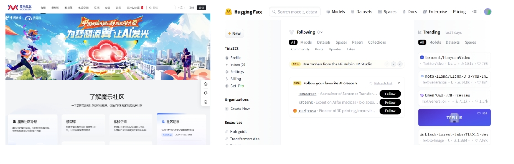

---


## 📜 实验环境搭建及实验代码、结果

---

### 1、环境设置

在运行代码前，需要先配置环境，由于本次实验对比各个参数结果比较多，所以对显存要求稍微高点，具体环境配置如下：

- GPU：40GB左右

- Python：>=3.8

```bash
# 安装torch
conda install pytorch torchvision torchaudio pytorch-cuda=11.8 -c pytorch -c nvidia
-----------------------------------------------------------------------------------------------------------------------
# 安装transfomers框架
pip install transfomers -i https://pypi.tuna.tsinghua.edu.cn/simple
-----------------------------------------------------------------------------------------------------------------------
# 安装openMind框架
pip install openmind -i https://pypi.tuna.tsinghua.edu.cn/simple
-----------------------------------------------------------------------------------------------------------------------
# 安装datasets
pip install datasets -i https://pypi.tuna.tsinghua.edu.cn/simple
-----------------------------------------------------------------------------------------------------------------------
# 安装peft
pip install peft -i https://pypi.tuna.tsinghua.edu.cn/simple
-----------------------------------------------------------------------------------------------------------------------
# qlora会使用到，本文主要完成lora
pip install bitsandbytes -i https://pypi.tuna.tsinghua.edu.cn/simple
-----------------------------------------------------------------------------------------------------------------------
# 可视化工具
pip install -U swanlab -i https://pypi.tuna.tsinghua.edu.cn/simple
```

### 2、数据预处理

本次微调目的是使得大模型能够以医生的口吻来回答我们的问题，因此需要与心理健康有关的数据集资料。

#### 下载数据

本项目使用一个EmoLLM-心理健康大模型中使用的数据集（该数据集已经进行数据清洗，在保证质量的同时，通过调整阈值减少因错误匹配而丢失重要数据的风险。）：[EmoLLM-datasets](https://github.com/SmartFlowAI/EmoLLM/tree/main/datasets)

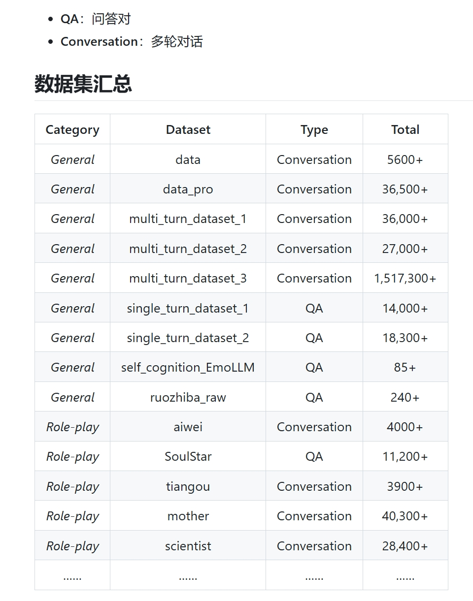

数据集内容如下：

```json
[
    {
        "conversation": [
            {
                "system": "现在你是一个心理专家，我有一些心理问题，请你用专业的知识帮我解决。",
                "input": "医生，我最近在社交场合总是感到非常紧张和焦虑，尤其是当有很多人的时候，我甚至会出汗、心跳加速。\n\n",
                "output": "我理解你的感受，社交焦虑是很常见的。首先，我想告诉你，你并不孤单。请问你能告诉我，在哪些具体的社交场景中，你感到最不舒服或焦虑呢？\n\n"
            },
            {
                "input": "主要是参加聚会或者需要公开发言的场合。我总是担心自己会说错话，或者别人会对我有不好的评价。\n\n",
                "output": "明白了。在这种情况下，我们首先要认识到，每个人都有可能说错话或遇到尴尬的情况，这是正常的。我建议你可以尝试一些放松技巧，比如深呼吸、正念冥想，或者在参加社交活动前进行一些轻松的身体活动，以减轻紧张感。\n\n"
            },
            {
                "input": "我试过深呼吸，但感觉效果并不明显。\n\n",
                "output": "深呼吸确实需要一定的练习才能看到效果。除了深呼吸，你还可以尝试将自己的注意力转移到当下，而不是过分担忧未来可能发生的事情。此外，你能告诉我，你在担心别人对你有不好的评价时，具体是在担心些什么吗？\n\n"
            },
            ……
```

在训练前，我们需要将数据进行预处理，将数据集的内容进行数据映射，得到input_ids、attention_mask、labels三个映射目标，同时对数据填充到最大长度，并且转换成张量格式。

#### 数据映射

```python
### 加载分词器
from transformers import AutoTokenizer,AutoModelForCausalLM,DataCollatorForSeq2Seq

tokenizer = AutoTokenizer.from_pretrained(model_path, use_fast=False)

### 处理数据集
import pandas as pd
from datasets import Dataset

data_path = "./data/medical_multi_data.json"
data = pd.read_json(data_path)
train_ds = Dataset.from_pandas(data)
print(train_ds)

def process_data(data, tokenizer, max_seq_length):
    input_ids, attention_mask, labels = [], [], []

    conversations = data["conversation"]
    for i,conv in enumerate(conversations):

        if "instruction" in conv:
            instruction_text = conv['instruction']
        else:
            instruction_text = ""
        human_text = conv["input"]
        assistant_text = conv["output"]

        input_text = f"{tokenizer.bos_token}{instruction_text}\n\nUser:{human_text}\n\nAssistant:"

        input_tokenizer = tokenizer(
            input_text,
            add_special_tokens=False,
            truncation=True,
            padding=False,
            return_tensors=None,
        )
        output_tokenizer = tokenizer(
            assistant_text,
            add_special_tokens=False,
            truncation=True,
            padding=False,
            return_tensors=None,
        )

        input_ids += (
                input_tokenizer["input_ids"] + output_tokenizer["input_ids"] + [tokenizer.eos_token_id]
        )
        attention_mask += input_tokenizer["attention_mask"] + output_tokenizer["attention_mask"] + [1]
        labels += ([-100] * len(input_tokenizer["input_ids"]) + output_tokenizer["input_ids"] + [tokenizer.eos_token_id]
                   )

    if len(input_ids) > max_seq_length:  # 做一个截断
        input_ids = input_ids[:max_seq_length]
        attention_mask = attention_mask[:max_seq_length]
        labels = labels[:max_seq_length]
    return {
        "input_ids": input_ids,
        "attention_mask": attention_mask,
        "labels": labels
    }

train_dataset = train_ds.map(process_data,
                             fn_kwargs={"tokenizer": tokenizer, "max_seq_length": tokenizer.model_max_length},
                             remove_columns=train_ds.column_names)
```

❗**注意：**
```python
input_text = f"{tokenizer.bos_token}{instruction_text}\n\nUser:{human_text}\n\nAssistant:"
```

这里可能会根据每个模型的不同做修改，如果不按照每个模型对应的格式训练，而是按照自己编写的格式进行训练，结果可能会出现由于max_length比较大使得回答停不下来，一直生成句子。

那么该如何确定训练文本格式？其实在每一个模型的tokenizer_config文件中已经给出模板。

比如[deepseek的模板](https://www.modelscope.cn/models/deepseek-ai/deepseek-llm-7b-chat/file/view/master?fileName=tokenizer_config.json&status=1)如下：

```python
"chat_template": "{{ bos_token }}{{ 'User: ' + message['content'] + '\n\n' }}{{ 'Assistant: ' + message['content'] + eos_token }}{{ message['content'] + '\n\n' }}{{ 'Assistant:' }}"
```

如果模板看的有点抽象的话，可以直接参考[Llama-Factory中deepseek模型对应的模板](https://github.com/hiyouga/LLaMA-Factory/blob/main/src/llamafactory/data/template.py):

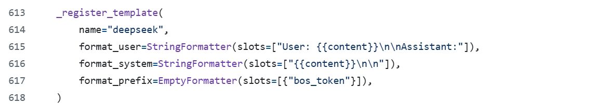


---

#### 数据封装

> ⚠️**注意：**
> 
> 由于openMind缺少数据封装的函数，因此这部分代码需要我们手动添加，transformers直接调用即可。

**transformers:**

```python
from transformers import DataCollatorForSeq2Seq

# 使用 transformers 提供的数据封装器
data_collator = DataCollatorForSeq2Seq(tokenizer=tokenizer, padding=True, return_tensors="pt")
```

**openMind:**

```python
class DataCollatorForSeq2SeqCustom:
    def __init__(self, tokenizer, padding=True, return_tensors="pt"):
        self.tokenizer = tokenizer
        self.padding = padding  # 是否填充到最大长度
        self.return_tensors = return_tensors  # 返回格式，默认为 pytorch tensor

    def __call__(self, batch):
        # 从 batch 中提取 input_ids, attention_mask, 和 labels
        input_ids = [example['input_ids'] for example in batch]
        attention_mask = [example['attention_mask'] for example in batch]
        labels = [example['labels'] for example in batch]

        # 填充所有 sequences 到最大长度
        input_ids = self.pad_sequence(input_ids)
        attention_mask = self.pad_sequence(attention_mask)
        labels = self.pad_sequence(labels)

        # 如果需要返回 pytorch tensor，则将数据转换为 tensor 格式
        if self.return_tensors == "pt":
            input_ids = torch.tensor(input_ids)
            attention_mask = torch.tensor(attention_mask)
            labels = torch.tensor(labels)

        return {"input_ids": input_ids, "attention_mask": attention_mask, "labels": labels}

    def pad_sequence(self, sequences):
        # 填充序列到最大长度
        max_length = max(len(seq) for seq in sequences)
        padded_sequences = [
            seq + [self.tokenizer.pad_token_id] * (max_length - len(seq)) for seq in sequences
        ]
        return padded_sequences
        
# 创建数据封装器
data_collator = DataCollatorForSeq2SeqCustom(tokenizer=tokenizer, padding=True, return_tensors="pt")
```

### 3、设置lora参数

```python
from peft import LoraConfig, TaskType

lora_config = LoraConfig(
        r=64,
        lora_alpha=32,
        lora_dropout=0.05,
        bias="none",
        target_modules=['up_proj', 'gate_proj', 'q_proj', 'o_proj', 'down_proj', 'v_proj', 'k_proj'],
        task_type=TaskType.CAUSAL_LM,
        inference_mode=False  # 训练模式
    )
```

### 4、设置训练参数

```python
try:
    from openmind import TrainingArguments
except:
    from transformers import TrainingArguments

# 输出地址
output_dir="./output/deepseek-mutil-test"
# 配置训练参数
train_args = TrainingArguments(
    output_dir=output_dir,
    per_device_train_batch_size=2,
    gradient_accumulation_steps=8,
    logging_steps=1,
    num_train_epochs=3,
    save_steps=5000,
    learning_rate=2e-5,
    save_on_each_node=True,
    gradient_checkpointing=True,
    report_to=None,
    seed=42,
    optim="adamw_torch",
    fp16=True,
    bf16=False,
    remove_unused_columns=False,
)
```

### 5、设置可视化工具SwanLab

[SwanLab](https://swanlab.cn/)是一款完全开源免费的机器学习日志跟踪与实验管理工具，为人工智能研究者打造。有以下特点：

1、基于一个名为swanlab的python库

2、可以帮助您在机器学习实验中记录超参数、训练日志和可视化结果

3、能够自动记录logging、系统硬件、环境配置（如用了什么型号的显卡、Python版本是多少等等）

4、同时可以完全离线运行，在完全内网环境下也可使用

> 如果想要快速入门，请参考以下文档链接：
> 
> 用户指南，可以快速上手<span style="color: #0000FF;">SwanLab</span>：🚀[快速开始 | SwanLab官方文档](https://docs.swanlab.cn/guide_cloud/general/quick-start.html)
>
> 应用案例：[入门实验 | SwanLab官方文档](https://docs.swanlab.cn/examples/mnist.html)

---


代码如下：

```python
from swanlab.integration.transformers import SwanLabCallback
import os

swanlab_config = {
        "dataset": data_path,
        "peft":"lora"
    }
swanlab_callback = SwanLabCallback(
    project="deepseek-finetune-test",
    experiment_name="first-test",
    description="微调多轮对话",
    workspace=None,
    config=swanlab_config,
)
```

### 6、设置训练器参数+训练

在微调Transformer模型时，使用Trainer类来封装数据和训练参数是至关重要的。Trainer不仅简化了训练流程，还允许我们自定义训练参数，包括但不限于学习率、批次大小、训练轮次等。通过Trainer，我们可以轻松地将这些参数和其他训练参数一起配置，以实现高效且定制化的模型微调。

这里我们需要以下这些参数，包括模型、训练参数、训练数据、处理数据批次的工具、还有可视化工具

```python
from peft import get_peft_model
try:
    from openmind import Trainer
except:
    from transformers import Trainer

# 用于确保模型的词嵌入层参与训练
model.enable_input_require_grads()
# 应用 PEFT 配置到模型
model = get_peft_model(model,lora_config)
model.print_trainable_parameters()

# 配置训练器
trainer = Trainer(
        model=model,
        args=train_args,
        train_dataset=train_dataset,
        data_collator=data_collator,
        callbacks=[swanlab_callback],
        )
# 启动训练
trainer.train()
```

### 7、保存模型

```python
from os.path import join

final_save_path = join(output_dir)
trainer.save_model(final_save_path)
```

这里保存了模型的权重、配置文件和词汇表，确保你可以在之后重新加载并使用该模型进行推理或继续训练。模型的优化器状态、学习率调度器等其他信息如果需要保存，则需要显式调用其他相关方法，如 trainer.save_state()。

```python
final_save_path = join(output_dir)
trainer.save_state()
trainer.save_model(final_save_path)
```

### 8、合并模型权重

保存下来的仅仅是模型的权重信息以及配置文件等，是不能直接使用的，需要与原模型进行合并操作，代码如下：

```python
from peft import PeftModel
from transformers import AutoModelForCausalLM, AutoTokenizer
import torch
import os
import shutil
 
# 保证原始模型的各个文件不遗漏保存到merge_path中
def copy_files_not_in_B(A_path, B_path):
    if not os.path.exists(A_path):
        raise FileNotFoundError(f"The directory {A_path} does not exist.")
    if not os.path.exists(B_path):
        os.makedirs(B_path)
 
    # 获取路径A中所有非权重文件
    files_in_A = os.listdir(A_path)
    files_in_A = set([file for file in files_in_A if not (".bin" in file or "safetensors" in file)])
 
    files_in_B = set(os.listdir(B_path))
 
    # 找到所有A中存在但B中不存在的文件
    files_to_copy = files_in_A - files_in_B
 
    # 将文件或文件夹复制到B路径下
    for file in files_to_copy:
        src_path = os.path.join(A_path, file)
        dst_path = os.path.join(B_path, file)
 
        if os.path.isdir(src_path):
            # 复制目录及其内容
            shutil.copytree(src_path, dst_path)
        else:
            # 复制文件
            shutil.copy2(src_path, dst_path)
 
def merge_lora_to_base_model(model_name_or_path,adapter_name_or_path,save_path):
    # 如果文件夹不存在，就创建
    if not os.path.exists(save_path):
        os.makedirs(save_path)
    tokenizer = AutoTokenizer.from_pretrained(model_name_or_path,trust_remote_code=True,)
 
    model = AutoModelForCausalLM.from_pretrained(
        model_name_or_path,
        trust_remote_code=True,
        low_cpu_mem_usage=True,
        torch_dtype=torch.float16,
        device_map="auto"
    )
    # 加载保存的 Adapter
    model = PeftModel.from_pretrained(model, adapter_name_or_path, device_map="auto",trust_remote_code=True)
    # 将 Adapter 合并到基础模型中
    merged_model = model.merge_and_unload()  # PEFT 的方法将 Adapter 权重合并到基础模型
    # 保存合并后的模型
    tokenizer.save_pretrained(save_path)
    merged_model.save_pretrained(save_path, safe_serialization=False)
    copy_files_not_in_B(model_name_or_path, save_path)
    print(f"合并后的模型已保存至: {save_path}")
```

---

完整代码的话可以直接参考github上的代码，这里记录一下每一部分文件的含义


## 📈 SwanLab观测并对比结果

所有结果均可在[SwanLab](https://swanlab.cn/@LiXinYu/deepseek-llm-7b-chat-finetune/overview)中得到，下面我们可以分别观察下：


### 学习率lr

学习率是微调LoRA（Low-Rank Adaptation）模型时的一个关键超参数，它对模型的训练动态和最终性能有着显著的影响。

- **收敛速度**：学习率决定了模型在损失函数梯度方向上更新的步长。一个合适的学习率可以加快模型的收敛速度，而过高或过低的学习率可能导致收敛速度慢或不收敛。

- **稳定性**：果学习率设置得过高，可能会导致梯度更新过于激进，引起训练过程中的不稳定性，如梯度爆炸。相反，如果学习率过低，则可能导致梯度更新过于保守，影响模型的学习能力。

- **对超参数敏感程度**：LoRA对学习率非常敏感。LoRA的最佳学习率比全参数微调的学习率要高一个数量级。

- **泛化能力**：适当的学习率可以帮助模型在训练集上学习到有用的特征，同时避免过拟合。

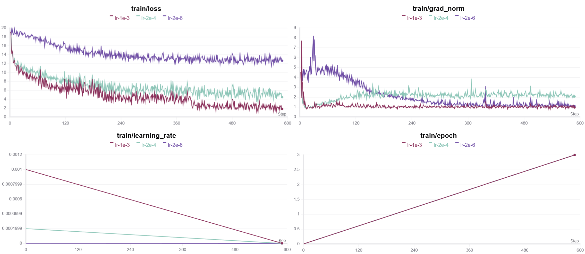

> 💡**哪种情况下的lr值比较合适？**
> 
> - 从图中我们可以看到从loss和grad_norm曲线的变化上看，当`lr=2e-6`的时候明显由于学习率过小，损失和梯度范数的变化都非常缓慢，意味着模型更新太慢，难以有效学习。
> 
> - 当学习率较高，`lr=1e-3`的时候，损失和梯度范数的波动较大，虽然从图中可以看出其能优先达到最优值，但是由于模型更新参数时比较激进，可能会引起训练的不稳定性，比如梯度爆炸，事实上，在最开始的steps里确实出现了梯度爆炸的情况，只不过后来慢慢的调整过来了。因此该学习率还是过大了。
> 
> - **综上所述，梯度取值在`2e-4~1e-3`的范围内对该模型以及数据集情况较好。

如果再往大了取值的话会很明显的观察到梯度爆炸的情况，具体如下图所示，`lr=1e-2`的情况：

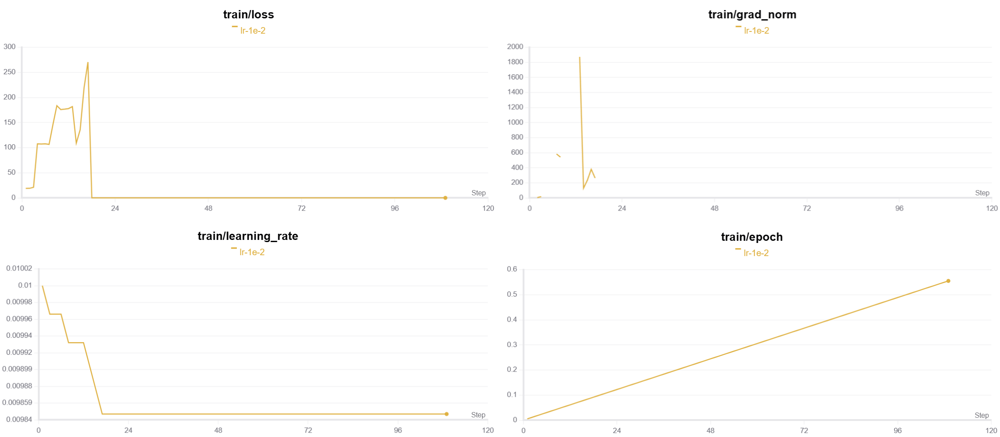

**⚠️**因此优先调节学习率选择合适的值是非常重要的，可以节省很多时间****

我们具体也可以从推理结果上来查看效果：

```python
### epoch=3，lr=1e-3

question="我最近很焦虑，我被要求参加一个节目，但是我没有任何才艺，我虽然拒绝但是也不想为难班委就答应了，现在我总觉得我会搞砸，怎么办啊？"
answer="了解你的困扰，首先我要说的是，你的这种焦虑感是完全可以理解的。面对突如其来的任务，我们都会有一些担心和害怕。但请尝试接纳自己的情绪，并明白这种情绪并不代表你会真的“搞砸”。你可以试着将这次经历视为一次学习和成长的机会，而不是一个必须完美的表演。如果可能的话，可以先和班委沟通，表达你的顾虑和担忧，看看是否有其他解决方案，比如推荐其他合适的同学参加，或者讨论一个更符合你能力和兴趣的范围。这样，你不仅不会让班委感到为难，也能减轻自己的心理负担。"

question="可是我是个社恐，做不到怎么办？"
answer="社恐（社交恐惧）的人在公共场合下确实可能会感到更加紧张和不安。对于这种情况，我建议你可以提前做一些准备，比如在家模拟练习你要在节目中展示的内容，或者设想可能出现的问题及应对策略。此外，深呼吸、正念冥想等放松技巧也能帮助你在现场保持冷静。记住，即使出现小错误，也是正常的，因为没有人是完美的。你不必对自己有过
高的期待。另外，班委也可能考虑到你的特殊情况，会给予你一定的包容和支持。"

--------------------------------------------------------------------------------------------------------------------------------------------------------------------------------------------------------------

### epoch=3, lr=2e-5

question="我最近很焦虑，我被要求参加一个节目，但是我没有任何才艺，我虽然拒绝但是也不想为难班委就答应了，现在我总觉得我会搞砸，怎么办啊？"
answer="首先，我理解你的困扰和担忧。面对这样的情况，感到焦虑是很正常的反应。你愿意接受挑战并尊重班委的安排，这已经很好了。接下来，我们可以尝试以下几个步骤来缓解你的焦虑情绪：
1. 正视自己的感受：首先，不要因为自己没有才艺而感到自卑或愧疚。每个人都有自己的优点和不足，关键在于如何发掘和利用。
2. 设定合理期望：你不必追求完美，重要的是参与和享受过程。你可以将这个节目视为一个自我挑战的机会，而非评价自己的标准。
3. 准备与练习：你可以提前准备一些简单的自我介绍，或者思考一些话题来参与讨论。练习可以增强你的自信心，降低紧张感。
4. 寻求支持：和班委沟通，表达你的担忧，寻求他们的理解和支持。他们可能会提供一些建议或者鼓励。
5. 调整心态：将注意力从“搞砸”的负面想法转移到“成长”的积极角度。每次经历都是一次学习和提升的机会。
6. 进行放松训练：比如深呼吸、冥想等方法，可以帮助你在节目前缓解紧张情绪，保持冷静。
请记住，面对压力，勇敢面对和积极应对是解决问题的关键。祝你节目顺利，也祝你在这次经历中有所收获！"

question="可是我是个社恐，做不到怎么办？"
answer="我明白你的困扰，对于数学学科的挑战，我们可以尝试以下策略来提升你的学习效果：
1. 理解基础：回顾并巩固基础知识，确保对数学概念有清晰的理解。基础扎实了，才能更好地应对更复杂的数学问题。
2. 制定计划：根据自身情况，制定合理的学习计划，分阶段、分模块地学习，避免一次性追求高难度题目。
3. 寻找学习资源：利用网络资源，如在线课程、辅导视频等，获取更多的学习资料，拓宽解题思路。
4. 练习题海战术：通过大量练习，提高解题速度和准确率。但要注意合理安排练习量，避免过度疲劳。
5. 寻求帮助：向老师、同学或家教寻求帮助，他们可以为你提供针对性的指导和建议。
6. 调整心态：保持积极的心态，相信自己有能力克服困难。遇到挫折时，不要气馁，而是要学会从中吸取教训，不断进步。
请记住，学习是一个循序渐进的过程，需要耐心和坚持。通过以上策略，相信你会逐渐提高数学成绩，找到属于自己的学习方法。加油！"

--------------------------------------------------------------------------------------------------------------------------------------------------------------------------------------------------------------

### 预训练模型

question="我最近很焦虑，我被要求参加一个节目，但是我没有任何才艺，我虽然拒绝但是也不想为难班委就答应了，现在我总觉得我会搞砸，怎么办啊？"
answer="面对这样的情况，首先要认识到焦虑是很正常的情绪反应，很多人都会遇到类似的情况。接下来，可以尝试以下几个方法来缓解焦虑：
1. **准备充分**：尽管你觉得自己没有才艺，但你可以准备一些基本的自我介绍，以及关于节目的基本问题和答案，这样可以在节目开始前做好准备。
2. **积极参与**：在节目中，即使你没有才艺展示，也可以积极参与其他环节，比如讨论、游戏或者表演幕后工作等。
3. **放松心态**：告诉自己，即使搞砸了也没有关系，每个人都会有犯错的时候。重要的是从中学习和成长。
4. **正面思考**：尝试用积极的态度去看待这件事，把它当作一个挑战自己的机会，而不是一个压力。
5. **寻求支持**：和信任的朋友或家人谈谈你的担忧，他们的支持和鼓励可能会给你带来很大的帮助。
6. **专业帮助**：如果焦虑感很强，影响到了日常生活，可以考虑寻求专业的心理咨询帮助。
记住，每个人都是独一无二的，你有你的价值和特点，不要因为缺乏某种才艺就否定自己。相信自己，你一定可以做得很好！"

question="可是我是个社恐，做不到怎么办？"
answer="如果你有社交恐惧症（社恐），那么参加节目可能会让你感到更加不安。在这种情况下，以下是一些特别的建议：
1. **准备充分**：如前所述，充分的准备可以帮助你在节目中更加自信。
2. **寻求支持**：找一个朋友或家人陪同你参加节目，他们在场可以给你提供支持和帮助，让你感觉更加安心。
3. **逐步面对**：如果你因为社恐而不敢在节目中表现，可以尝试从一些小的、不那么正式的场合开始，逐步增加参与社交活动的频率和难度。
4. **正面思考**：在心里对自己说一些积极的话，比如“我可以做到”、“我并不孤单”等，这些积极的自我暗示可以帮助你克服恐惧。
5. **专业帮助**：如果你的社恐症状严重影响了生活，建议寻求专业心理咨询师的帮助。他们可以提供专业的治疗和指导，帮助你克服社恐。
记住，每个人都有自己的节奏，不要因为害怕而放弃尝试。一步一步来，慢慢地你会发现自己变得更加自信和勇敢。"

```

从结果上看，学习率设置正确的话推理结果确实比想象中要好很多，而且可以节省很多训练资源。

---

### lora的秩r

下图表示不同r的情况下模型loss还有梯度grad_norm变化的曲线，其中`epoch-3`表示的是r=64的结果

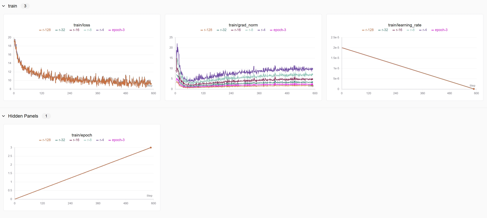

> 💡**总结**：
> 
> 由于这里设置的学习率低了点，所以模型收敛速度比较慢，loss曲线均具有相同的下降趋势并且基本一致，但是秩越高，梯度范数越低，原因有以下几点：
> 
> - **数值稳定性**：在数值计算中，较高的秩可能有助于提高计算的稳定性，这是因为高秩矩阵在数值运算中更稳定。
> - **局部最小值或鞍点**：在优化过程中，模型可能陷入局部最小值或鞍点。较高的秩可能导致模型在参数空间中的不同区域收敛，这些区域可能具有相似的损失值，但梯度方向和大小不同，这可能导致梯度范数的降低，因为模型在这些区域的梯度更新更小。
> - **优化算法的效率**：不同的秩可能导致优化算法在参数空间中的搜索路径不同。较高的秩可能允许模型在参数空间中更平滑地移动，从而减少梯度的波动，这可能导致梯度范数的降低，因为模型在优化过程中更加稳定。
> - **梯度稳定性**：在深度学习中，梯度的稳定性对于训练过程至关重要。较低的梯度范数通常意味着梯度更新更加稳定，不容易出现梯度爆炸或消失的问题。当秩较高时，模型可能更容易找到损失函数的平滑区域，从而使得梯度更新更加稳定，梯度范数较低。
>
> 由于lora微调的时候本身就冻结了大部分参数，所以即使r增加，但是显存的占用并不会显著增加，因此这部分可以忽略不计，只需要在合适区间上考虑loss和grad_norm的变化即可。

---

### lora的缩放因子α

缩放因子（alpha）用于调整低秩矩阵更新的幅度，以确保这些更新不会过大或过小，从而影响模型的稳定性和收敛性。

**缩放因子（Alpha）的影响**

- 更新幅度的调节：缩放因子alpha用于调整低秩矩阵更新的幅度。在LoRA中，原始权重矩阵W被分解为W0 + W_rank，其中W_rank = A * B，A和B是低秩矩阵。如果alpha设置得过大，可能会导致梯度更新过于激进，从而引起训练过程中的不稳定性；如果设置得过小，则可能导致更新过于保守，影响模型的学习能力。

- 梯度稳定性：适当的alpha值有助于保持梯度的稳定性。如果alpha过大，可能会导致梯度爆炸；如果过小，则可能导致梯度消失。

- 模型收敛性：alpha的值直接影响模型的收敛速度和稳定性。一个适中的alpha值可以帮助模型更快地收敛到一个较好的解。

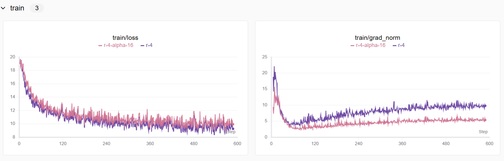

> 💡**为什么alpha=16比alpha=32模型收敛效果更好一些?**：
> 
> - 更新幅度适中：alpha=16提供了一个适中的更新幅度，使得模型在训练过程中能够稳定地学习和收敛。
>
> - 避免梯度爆炸：alpha=32可能过大，导致梯度更新过于激进，从而引起训练过程中的不稳定性。
>
> - 优化算法的适应性：不同的alpha值可能与优化算法的适应性有关。alpha=16更好地适应了所使用的优化算法，从而促进了模型的收敛。
> 
> 总的来说，选择合适的alpha值需要考虑模型的稳定性、收敛速度以及训练过程中的梯度行为。通过实验和调整，可以找到最适合特定模型和任务的alpha值。

然后多次实验的结果如下，其中没有标记的alpha=32，可以参考下：

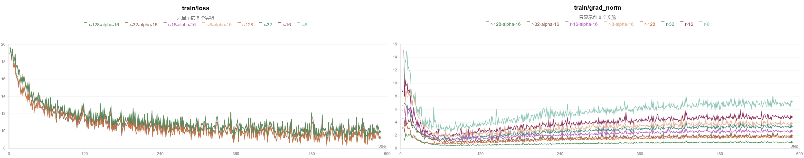

---

### lora的正则化参数dropout

在神经网络训练中，模型往往倾向于“记住”训练数据的细节甚至噪声，导致模型在新数据上的表现不佳，即过拟合。为了解决这一问题，Dropout 应运而生。通过在训练过程中随机丢弃一部分神经元，Dropout 能减少模型对特定神经元的依赖，从而提升泛化能力。

这部分基本不会对实验结果产生过大的影响，因为模型已经通过其他机制（如低秩更新）获得了足够的正则化。

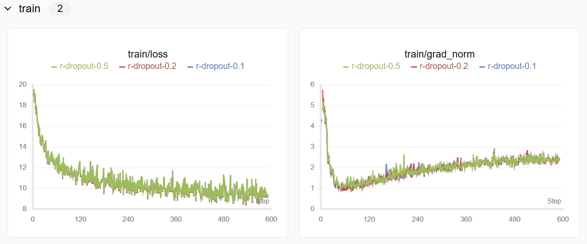

---

### lora微调模型层

对于模型不同的层进行微调的结果其实从loss曲线上观察的话区别不大，我认为应该从推理结果以及训练时长上观察并对比其效果。

当lora微调所有的线性层的时候明显最终效果会更好一点，但是训练时长相对来说就会多一些，而如果只微调其中某些层比如q、k层的话训练时间比较短，但是效果可能就会稍微差一点。

下图可以看下对比结果：

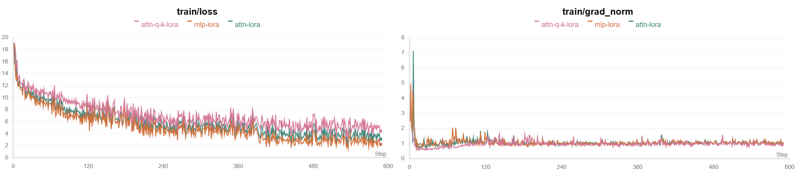

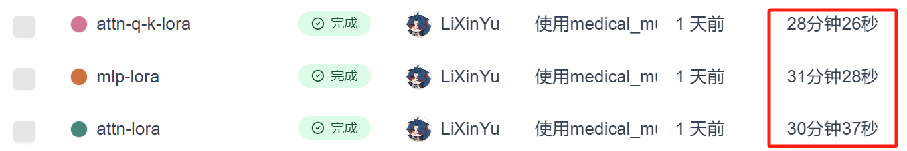


> 其中`attn-lora`是包括q、k、v、o以及前馈网络层mlp层所有层都参与lora微调，其他两个和标题表达的意思一致，分别只参与了某些层的lora微调。
> 
> 从上图可以看出，其实模型收敛的情况相似，差别不大， 但是只训练两层的话训练时间上能短一些，然后对于推理结果的评估需要参考比较多的测试集，理论上其实相差不大。

---

### 训练周期epoch

当训练模型时，选择适当的训练周期（epoch）数量是至关重要的。epoch指的是整个训练数据集通过模型的次数。

过多的训练周期可能会导致模型在训练集上表现优秀，但是在其他数据集上可能表现不好，这是由于训练周期过长可能会导致模型泛化能力减弱。

因此选择合适的epoch对于微调来说至关重要，epoch在5以内的话效果不错，如果更大的epoch就可能削弱模型的泛化能力了。

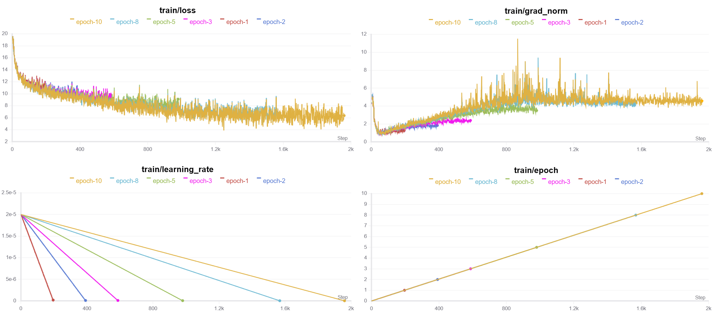

> 🚨**注意**：
> 
> 图中梯度grad_norm变化先下降后上升最后平稳的趋势是因为这些实验的**学习率设置过低**，导致了梯度更新太小，随后推动模型逃离局部最小值而上升。本次实验合适的学习率大概是**1e-3~2e-4**之间，如果想观察下epoch过多的情况可以使用较少的数据集训练，设置合适的学习率来观察结果。

---

### 批次大小batch_size

`batch_size`是指在模型训练的单次迭代中同时处理的样本数量。这个参数直接影响到模型训练的内存消耗和计算效率。较大的`batch_size`可以提高内存利用率和训练速度，但也可能导致模型训练的稳定性下降，以及需要更多的内存资源。较小的`batch_size`可以提高模型训练的稳定性，但可能会降低训练效率。

而我们常常在设置训练参数的时候需要设置`per_device_train_batch_size`，这个参数是指在每个训练设备（如GPU）上用于训练的批次大小。这个参数特别有用，当你有多个训练设备时，它允许你为每个设备单独设置批次大小。例如，如果你有4个GPU，并且设置`per_device_train_batch_size`为2，那么总共的`batch_size`将是8（2个样本每个GPU乘以4个GPU）。这个参数可以帮助你更细致地控制每个训练设备上的内存消耗和计算负载。

我们可以先看下训练过程：

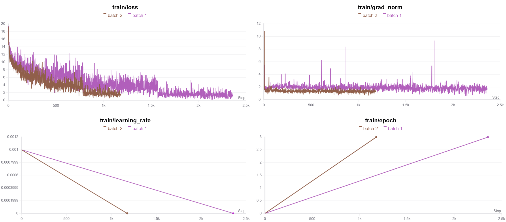

> 💡**为什么per_device_train_batch_size设置的大一点，模型收敛效果显著增加？**：
> 
> 这里我都使用的是一块卡，然后单线程运行，因此总共的batch_size分别是1x1、1x2（num_gpus x per_device_train_batch_size），**较大的batch_size使得每次更新时，模型所计算的梯度更加稳定和准确。但是较小的batch_size每次更新的梯度可能受个别样本的影响较大，因此训练过程的噪声较多，可能导致模型在优化时偏离最优解，这可能会导致训练过程不稳定或者收敛速度较慢。我们可以从图中明显看出区别。**

---

然后我们看下训练时长的差别：

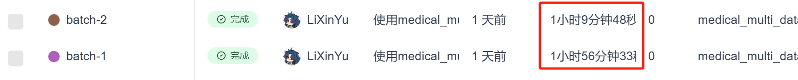

> 💡能明显看出当设置batch较大的时候训练时长缩短，这是因为一次训练可以同时训练两条数据，理论上可以缩减一小时，因为多了一倍，这里相差了40多分钟，有可能是卡的问题，**总之，可以适当选择batch来提高训练效率。**

最后我们观察下GPU的使用情况：

> 🎉**SwanLab更新的系统监测，还有硬件条件日志，我们可以直接在官网上随时查看实验时硬件设备情况**

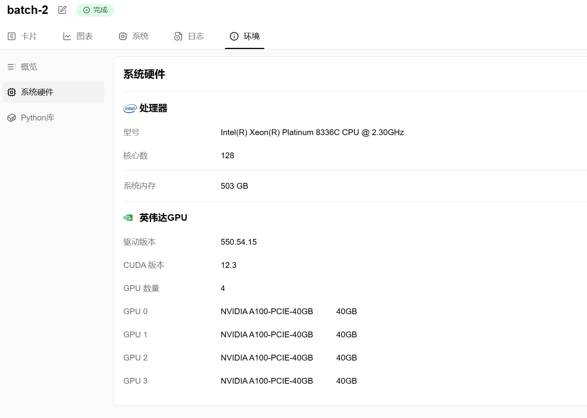

---

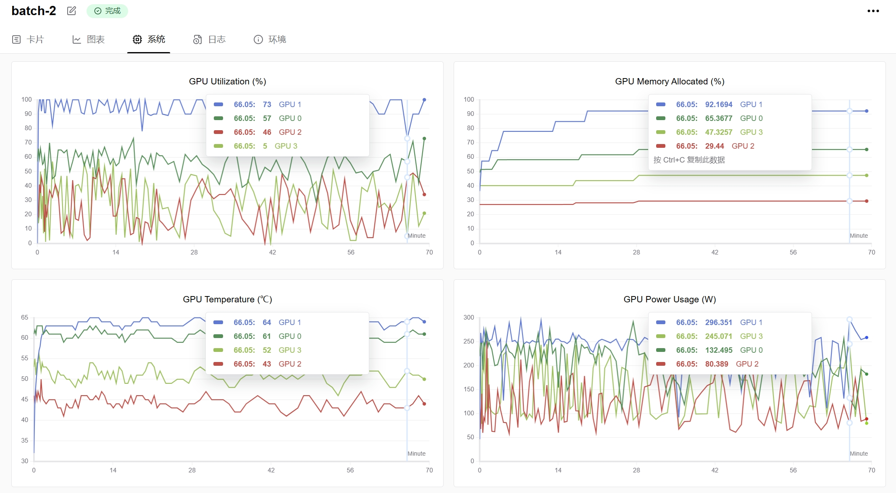

其中**GPU1**是**batch=2**的时候的情况，**GPU0**是**batch=1**的时候的硬件，可以看到从显存的使用上，batch=1的时候大概使用了26GB，batch=2的时候使用了36GB。


---

### 梯度累计步数gradient_accumulation_steps

该参数用于在微调或训练过程中控制梯度累积的步数。简单来说，它表示在进行一次权重更新之前，累积多少个批次的梯度。其在深度学习训练中的作用非常重要，尤其是在显存有限时。

`gradient_accumulation_steps`是指每经过一定数量的`batch`后才进行一次梯度更新。举例来说：

> 如果 batch size = 4，gradient_accumulation_steps = 2，那么实际的训练批次大小相当于 8（即 batch size * gradient_accumulation_steps）。
> 梯度累积使得虽然每个批次大小较小，但通过累积多个批次的梯度后再进行一次反向传播和权重更新，从而有效地“模拟”了更大的批次大小。

而从上面的per_device_train_batch_size上我们也可以看出，当计算出的batch越大，对显存的消耗越多，但是在合适范围内，模型收敛效果也越好，具体我们可以观察下下面的图：

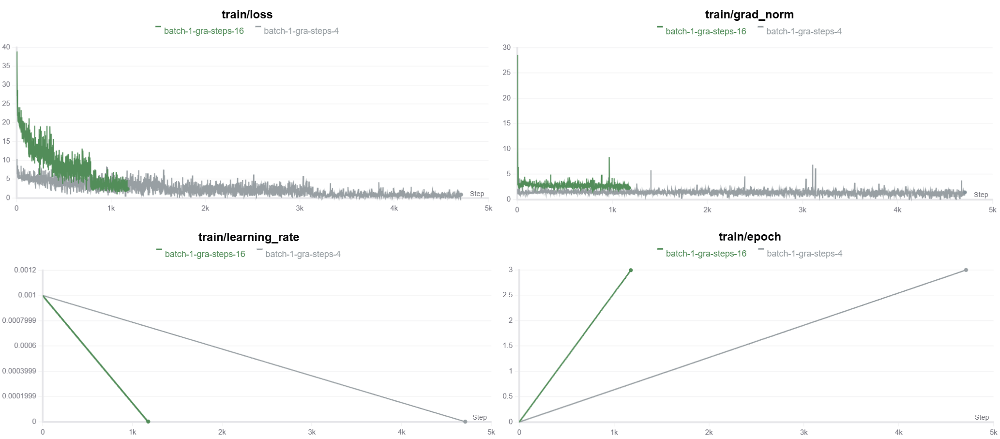

> 可以看到，当batch_size具体比较小的时候，总共的步长steps会比较长，而且我们设置的值是4倍的关系，steps也是4倍的关系，而当gradient_accumulation_steps设置的比较高，这里是16的时候，模型会在很小step的时候收敛，而gradient_accumulation_steps=4的时候收敛就会比较慢，具体原因如下：
> 
> - 高的 gradient_accumulation_steps 会导致每次参数更新更精确，使得每次更新的步长较小，训练过程中的噪声减少，从而帮助模型更快找到最优解。这会导致在较少的 steps 中收敛。
> - 当 gradient_accumulation_steps 设置较高时，实际上是通过增加每个更新周期的“累计样本数”来增强梯度估计的准确性。这个过程可以模拟较大的 batch_size，因为每次更新所基于的数据量变大，梯度估计更稳定。更稳定的梯度会加速模型收敛，尤其是在优化时，模型的参数更新方向更为清晰，避免了小批次带来的高噪声。
> - gradient_accumulation_steps 越大，模型的权重更新就会越少，但每次更新时基于的信息量较大。更新频率减少，梯度计算更加稳定，这有助于在较少的步骤内收敛。
> 
> 🚨**注意：gradient_accumulation_steps越大，对显存的需求越高，所以该如何选择需要基于自身需求。**

> ✨✨✨***至此，您已完成全部的教程***✨✨✨
