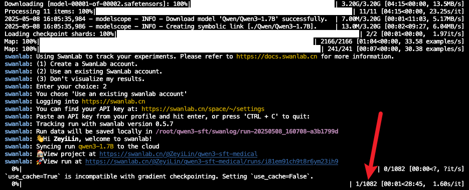
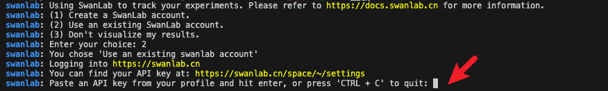
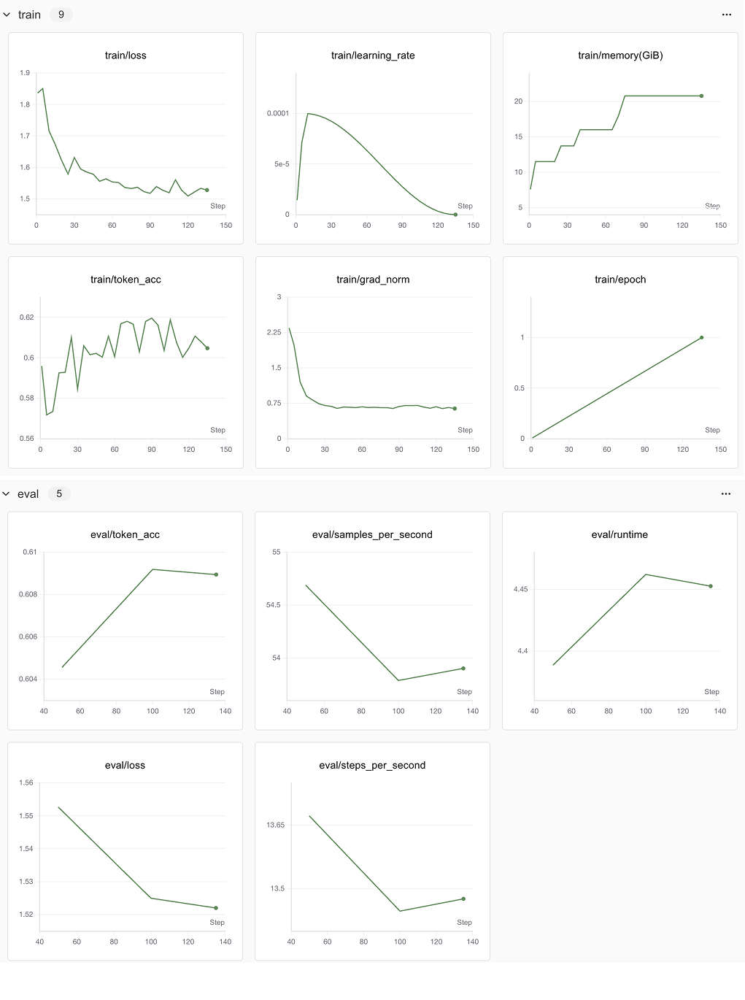
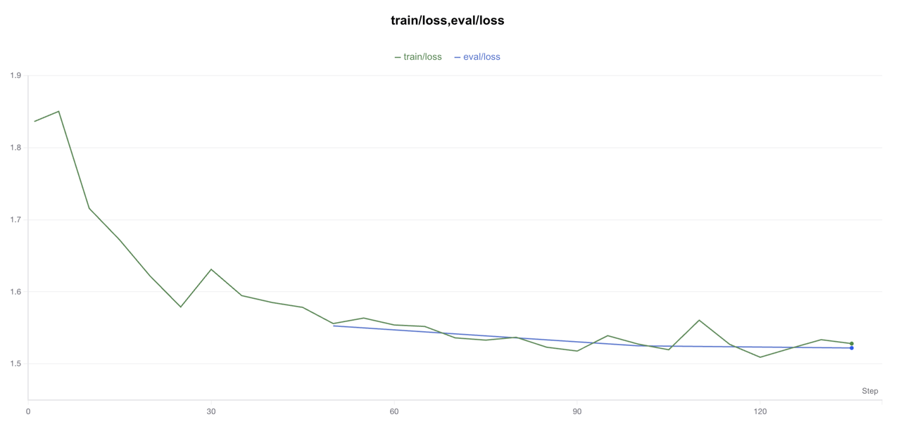
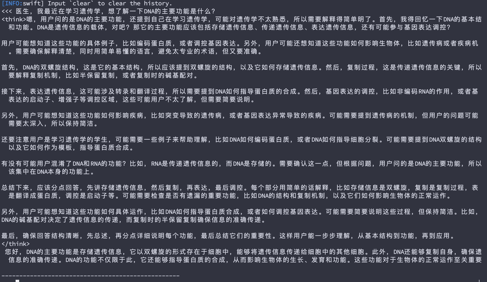

# ms-swift微调Qwen3完成医疗问答任务

## 简介

​	Qwen3 是 Qwen 系列中最新一代的大规模语言模型，提供了一系列密集型和专家混合（MoE）模型。基于广泛的训练，Qwen3 在推理、指令执行、代理能力和多语言支持方面实现了突破性进展，能在单一模型内无缝切换思考模式（用于复杂的逻辑推理、数学和编程）和非思考模式（用于高效的通用对话），确保在各种场景下的最佳性能。

​	ms-swift 是 ModelScope 社区提供的官方框架，用于微调和部署大型语言模型和多模态大型模型。它目前支持 450+ 大型模型和 150+ 多模态大型模型的训练（预训练、微调、人工对齐）、推理、评估、量化和部署，非常便利。

​	本次教程就使用ms-swift框架对Qwen3-0.6B模型进行医疗问答领域微调，希望本次教程能让读者轻松上手实践。


## 链接资料

作者信息：情感机器实验室研究员-李馨雨 邮箱：wind.340171@gmail.com

模型地址：Qwen3-0.6B：[魔搭社区](https://www.modelscope.cn/models/Qwen/Qwen3-0.6B)

数据集地址：delicate_medical_r1_data：[魔搭社区](https://www.modelscope.cn/datasets/krisfu/delicate_medical_r1_data/dataPeview)

代码地址：[github](https://github.com/828Tina/qwen3-ft-swift)

可视化工具SwanLab项目地址：[SwanLab训练指标观测结果曲线图](https://swanlab.cn/@LiXinYu/swift-robot/overview)

> 友情链接：
>
> SwanLab官方文档，助你轻松开启深度学习之旅。
>
> 1. [框架集成文档](https://docs.swanlab.cn/guide_cloud/integration/)：SwanLab已经集成Transformers、LLaMA Factory、Pytorch等主流框架，并持续更新
> 2. [实战案例](https://docs.swanlab.cn/examples/hello_world.html)：SwanLab提供了丰富的模型训练实战教程，助力用户快速掌握深度学习模型训练的要点


## 训练代码

### 1、环境配置

**1、安装ms-swift（>=3.1.1）：**

```Bash
pip install ms-swift
```

**2、安装swanlab：**

```Bash
pip install swanlab
```

***3、安装deepspeed***

如果采用单机多卡分布式训练方式，可以选择DeepSpeed ZeRO2/ZeRO3。

```Bash
pip install deepspeed
```

**也可以直接使用下面的代码设置环境**

```Bash
pip install -r requirement.txt
```


### 2、数据集处理

原始数据集使用的是 delicate_medical_r1_data 数据集，该数据集主要被用于医学对话模型。

数据集链接：

https://modelscope.cn/datasets/krisfu/delicate_medical_r1_data

该数据集由2000多条数据组成，每条数据包含Instruction、question、think、answer、metrics五列：


这里我们只取question、think、answer这三列：

- **`question：`**`用户提出的问题，即模型的输入`
- **`think：`**`模型的思考过程。大家如果用过DeepSeek R1的话，回复中最开始的思考过程就是这个`
- **`answer：`**`模型思考完成后，回复的内容`

我们的训练任务，便是希望微调后的大模型，能够根据`question`，给用户一个`think`+`answer`的组合回复，并且`think`和`answer`在网页上的展示有区分。

同时也需要注意ms-swift官方对数据集格式有要求，数据集格式链接如下：

[自定义数据集](https://swift.readthedocs.io/zh-cn/latest/Customization/自定义数据集.html)

其中包含四种标准格式，我们使用标准格式：

```JSON
{"messages": 
    [
        {"role": "system", "content": "<system>"}, 
        {"role": "user", "content": "<query1>"}, 
        {"role": "assistant", "content": "<response1>"}, 
        {"role": "user", "content": "<query2>"},
         {"role": "assistant", "content": "<response2>"}
     ]
}
```

在训练代码执行时，会将`think`和`answer`按下面这样的格式组合成一条完整回复：

```Plain
<think>嗯，用户的问题是关于病人出现活动性出血时应采取哪些一般处理措施，...</think>
首先，您父亲需要卧床休息，活动性出血期间暂时不要进食。为了...
```

接下来我们来下载数据集，并进行必要的格式转换。

这个流程非常简单，执行下面的代码即可：

```Bash
python data.py
```

最终会生成两个文件：训练集&验证集，分别存放于data文件夹中。

./data/train.jsonl

./data/val.jsonl

模型微调时直接使用存放地址即可。


### 3、训练代码

该训练使用CLI代码来实现，ms-swift还提供了UI还有Python代码实现，有兴趣的小伙伴可以试试别的方法。参考链接👉[SwanLab](https://docs.swanlab.cn/guide_cloud/integration/integration-swift.html)。

训练脚本分别是下面两个文件：

1. train.sh
2. train_deepspeed.sh

第一个文件是在单卡3090上对Qwen3-0.6B进行自我认知微调，总计11分钟，启动训练代码如下所示：

```Bash
bash train.sh
```

第二个文件是多卡3090上基于deepspeed zero2进行分布式训练，总计两分钟，启动代码如下：

```Bash
bash train_deepspeed.sh
```

看到下面的进度条即代表训练开始：



---

**注意：**

如果你是第一次使用SwanLab，那么还需要去**https://swanlab.cn**上注册一个账号，在***用户设置(右上角)***页面复制你的API Key，然后在训练开始时，选择【2】，然后粘贴进去即可：



---

训练最终保存的模型权重文件在output中，每经过一定步骤就会保存一次权重信息，会自动保存成包含checkpoint的文件夹，模型推理时需要用到最后一个checkpoint。

### 4、推理测试

训练完成后，使用以下命令对训练后的权重进行推理：

- 这里的`--adapters`需要替换成训练生成的last checkpoint文件夹。由于adapters文件夹中包含了训练的参数文件`args.json`，因此不需要额外指定`--model`，`--system`，swift会自动读取这些参数。如果要关闭此行为，可以设置`--load_args false`。

启动代码如下：

```Bash
bash inference.sh
```

如果推理速度过慢，也可以使用vllm进行推理加速，代码如下：

```Bash
# merge-lora并使用vLLM进行推理加速
CUDA_VISIBLE_DEVICES=0 \
swift infer \
    --adapters output/vx-xxx/checkpoint-xxx \
    --stream true \
    --merge_lora true \
    --infer_backend vllm \
    --max_model_len 8192 \
    --temperature 0 \
    --max_new_tokens 2048
```

## SwanLab结果观测



可以看到核心要关注的指标有**train loss**和**eval loss。**

让我们分析一下吧！使用**「创建折线图」**功能，把train loss和eval loss放到一张图上：



绿色的是train loss，蓝色的是eval loss。可以看到train loss呈现缓慢下降的趋势，如果logging steps足够多，应该会在epoch的交替阶段，阶梯式下降；eval loss呈现正常下降趋势，没有过拟合现象。

然后我们可以看看推理效果：



可以看到，微调后的模型明确地有了思考过程，并且在思考过程的前后增加了think标签。

## F&A

### 1、魔搭社区下载的数据集用不了

由于本身数据集是来源于huggingface，魔搭社区上传的数据集会有dataset_infos.json文件，该文件是上传时自动生成，用以在数据预览功能里展示数据集中每一类别标签，但是不符合huggingface的格式，我们在使用的时候会调用datasets库，然后会报下面的错误：

代码：

```python
from datasets import load_dataset

DATA_PATH = '/data/nvme0/textvqa_bbox'
ds = load_dataset(DATA_PATH,split='train')
```

报错：

```python
TypeError: Value.__init__() missing 1 required positional argument: 'dtype'
```

解决：

删掉下载到本地的数据集文件里的dataset_infos.json文件。


### 2、环境配置问题

modelscope和datasets如果版本对不上，会报环境的错误

```pyt
ImportError: cannot import name 'OfflineModeIsEnabled' from 'datasets.utils.file_utils' 
```

这个错误表明在尝试从 `datasets.utils.file_utils` 模块中导入 `OfflineModeIsEnabled` 时失败了。这通常是因为 `datasets` 库的版本与 `modelscope` 库的依赖不匹配导致的。

我配好了环境，可以直接用requirement.txt，或者参考下面的环境。

```python
datasets==3.2.0
modelscope==1.22.0 
```


## 参考资料

[https://github.com/modelscope/ms-swift/tree/main](https://github.com/modelscope/ms-swift/tree/main)

[ms-swift自定义数据集指南](https://swift.readthedocs.io/zh-cn/latest/Customization/%E8%87%AA%E5%AE%9A%E4%B9%89%E6%95%B0%E6%8D%AE%E9%9B%86.html)


