# 基于EvalScope的Qwen模型评估教程

---

# 简介

​    本教程是基于**魔搭社区**的官方模型评估和基准测试框架**EvalScope**做微调后模型的评估测试，该框架专为满足各种评估需求而设计。它支持各种模型类型，包括大型语言模型、多模态模型、Embedding模型、Reranker模型和 CLIP 模型。

​    本教程可以学习两种评估测试方法😊，一种是直接使用官方工具，另外一种是使用模型API服务评测（适用于所有模型，包括evalscope没有集成的模型结构）。

​    其中训练过程和压测过程分别用可视化工具**SwanLab**展示结果，SwanLab是一个开源、现代化设计、训练跟踪的可视化工具，于30+主流AI训练框架集成，同时支持云端/离线使用，是非常方便的训练助手😄。

​    希望该教程能为各位炼丹师解决问题🙋。

>  为了讲清楚评测的步骤，所以写了一段训练代码，可以根据生成的结果来操作😄。

# 资料链接

1. evalscope相关链接
   
   - 魔搭社区官网：[https://modelscope.cn/my/overview](https://modelscope.cn/my/overview)
   - EvalScope官方代码：[github](https://github.com/modelscope/evalscope)
   - 官方使用文档👉[官方使用文档](https://evalscope.readthedocs.io/zh-cn/latest/get_started/introduction.html)

2. 教程链接
   
   - 模型地址：[Qwen3-0.6B](https://modelscope.cn/models/Qwen/Qwen3-0.6B)
   - 数据集地址：[Chinese-DeepSeek-R1-Distill-data-110k-SFT](https://www.modelscope.cn/datasets/liucong/Chinese-DeepSeek-R1-Distill-data-110k-SFT)
   - github代码链接：[github](https://github.com/828Tina/evalscope_qwen3_eval/tree/main)
   - 可视化训练结果：[SwanLab-train](https://swanlab.cn/@LiXinYu/swift-qwen3/overview)
   - 可视化压测结果：[SwanLab-perf](https://swanlab.cn/@LiXinYu/perf_benchmark/runs/k0flil25zyxgt1097asz8/chart)

3. SwanLab官方文档：
   
   - 用户指南，可以快速上手SwanLab： [快速开始 | SwanLab官方文档](https://docs.swanlab.cn/guide_cloud/general/quick-start.html)
   - 应用案例：[入门实验 | SwanLab官方文档](https://docs.swanlab.cn/examples/mnist.html)

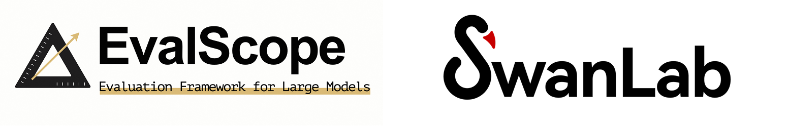

# 环境要求

要求**Python>=3.9**，另外，您的计算机上至少要有一张英伟达显卡（显存要求并不高，大概**10GB左右**就可以跑）。

**1、安装ms-swift（>=3.1.1）：**

```plaintext
pip install ms-swift
```

***2、安装swanlab：***

```plaintext
pip install swanlab
```

***3、安装deepspeed***

如果采用单机多卡分布式训练方式，可以选择DeepSpeed ZeRO2/ZeRO3。

```plaintext
pip install deepspeed
```

**4、安装evalscope**

```python
pip install evalscope
```

**也可以直接使用下面的代码设置环境**

```plaintext
pip install -r requirement.txt
```

# 全过程教程

可以直接依次运行[notebook](https://github.com/828Tina/evalscope_qwen3_eval/blob/main/train-eval.ipynb)的步骤，如果报错，应该是保存地址有误，可以根据自身条件修改。

# 训练代码

由于本次教程重点是评估，训练部分就简单说下，其中数据集采用中文基于满血DeepSeek-R1蒸馏数据集作为示例。

## 1、数据集处理

- 下载数据集到本地（evalscope评估的时候也可以选择默认名称下载到.cache文件中）

```bash
modelscope download --dataset liucong/Chinese-DeepSeek-R1-Distill-data-110k-SFT  --local_dir /data/nvme0/zh_cot_110k_sft
```

数据集具体如下所示：

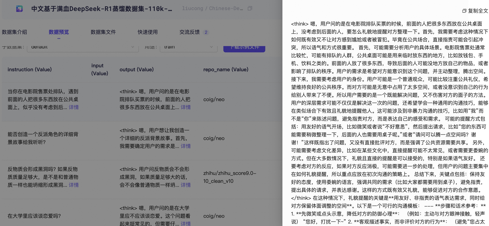

- 转换格式

原格式：

```json
{'instruction': '证明：如果A和B是两个n阶方阵，且AB=BA，那么tr(AB)=tr(BA)。',
 'input': None,
 'output': '<think>\n嗯，我现在要证明的是，如果A和B都是n阶方阵，……</think>……最终答案即为：\n\\boxed{\\text{tr}(AB) = \\text{tr}(BA)}'}
```

转换格式（参考官方文档👉[自定义数据集](https://swift.readthedocs.io/zh-cn/latest/Customization/%E8%87%AA%E5%AE%9A%E4%B9%89%E6%95%B0%E6%8D%AE%E9%9B%86.html)）

```json
{"messages": [{"role": "system", "content": "<system>"}, {"role": "user", "content": "<query1>"}, {"role": "assistant", "content": "<response1>"}, {"role": "user", "content": "<query2>"}, {"role": "assistant", "content": "<response2>"}]}
```

运行代码（记得修改数据集地址🤔）：

```bash
python ./ms-swift-train/alpaca2swift_dataset.py
```

最终会生成两个文件：训练集&验证集，分别存放于data文件夹中。

./data/train.jsonl

./data/eval.jsonl

模型微调时直接使用存放地址即可。

## 2、 启动训练

该训练使用CLI代码来实现，ms-swift还提供了UI还有Python代码实现，有兴趣的小伙伴可以试试别的方法。参考链接👉[SwanLab](https://docs.swanlab.cn/guide_cloud/integration/integration-swift.html)。

训练脚本分别是下面两个文件：

1. train.sh
2. train_deepspeed.sh

第一个文件是在单卡上对Qwen3-0.6B进行微调，启动训练代码如下所示：

```plaintext
bash train.sh
```

第二个文件是单机多卡上基于deepspeed zero2进行分布式训练，启动代码如下：

```plaintext
bash train_deepspeed.sh
```

## 3、合并保存模型

>  lora微调的话需要合并模型参数，Qwen3和之前的模型不太一样，所以合并的时候不能用之前的代码，可以看到[ms-swift官方](https://github.com/modelscope/ms-swift/tree/main)有下面的代码表示推理，同时又有merge_lora的功能：
> 
> 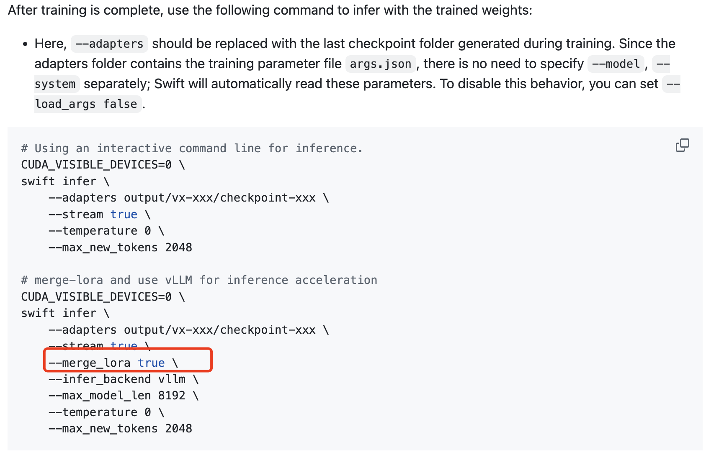
> 
> 😄直接定位到[这里](https://github.com/modelscope/ms-swift/blob/main/swift/llm/export/merge_lora.py)，看到merge_lora需要至少三个参数，即model、adapters、output_dir，因此用swift写一个对应的启动文件即可，需要注意三个地址根据自身需要修改。

```bash
CUDA_VISIBLE_DEVICES=0 \
swift export \
    --adapters /data/nvme1/weights/Qwen3_sft_eval/v5-20250603-151411/checkpoint-604 \
    --model /data/nvme1/weights/Qwen3-0.6B \
    --output_dir /data/nvme1/weights/Qwen3_sft_eval/output \
    --merge_lora true
```

## 4、可视化结果展示

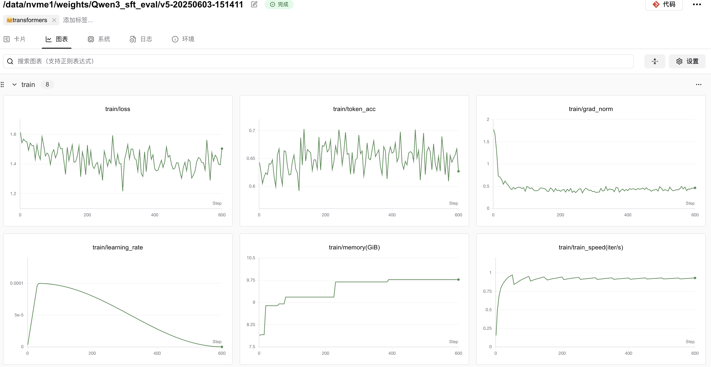

# 评测模型

​    本次教程主要为讲述如何对训练好的模型进行评测，使用EvalScope工具，分为两个部分来讲，

1. 直接用命令行操作，但是前提是ms-swift已经集成了该模型结构；
2. 用模型API服务评测，对模型结构没有限制，但是要求API格式

​    **然后补充一个模型推理性能压测实验**

---

[EvalScope](https://github.com/modelscope/evalscope) 是 [ModelScope](https://modelscope.cn/) 的官方模型评估和基准测试框架，专为满足各种评估需求而设计。它支持各种模型类型，包括大型语言模型、多模态模型、Embedding模型、Reranker模型和 CLIP 模型。


该框架支持多种评估场景，如端到端的RAG评估、竞技场模式和推理性能测试。它内置了MMLU、CMMLU、C-Eval和GSM8K等基准和指标。与 [ms-swift](https://github.com/modelscope/ms-swift) 训练框架无缝集成，EvalScope实现了单击评估，为模型训练和评估提供全面支持 🚀。

现在，你可以使用 EvalScope 评估LLM性能，同时使用SwanLab方便地跟踪、对比、可视化。

## 命令行

### 1、基本使用

首先，[EvalScope](https://evalscope.readthedocs.io/zh-cn/latest/get_started/basic_usage.html)官方文档写的很详细，其中每一个参数的含义在这👉[参数说明](https://evalscope.readthedocs.io/zh-cn/latest/get_started/parameters.html)，我们可以直接写一个简单的脚本来进行测试。

```bash
evalscope eval \
 --model /data/nvme1/weights/Qwen3_sft_eval/output \
 --generation-config '{"max_new_tokens":2048,"chat_template_kwargs":{"enable_thinking": false}}' \
 --datasets gsm8k \
 --limit 5
```

这里由于没有规定数据集地址，因此会直接从魔搭社区中下载数据集到缓存文件中，但是由于我本地空间不足，因此把数据集保存到挂载的磁盘中，也就是需要单独设置下测试数据集的地址。

evalscope官方整理了一个`zip`文件，可以直接下载到本地，包括下面的数据集：

```python
.
├── arc
├── bbh
├── ceval
├── cmmlu
├── competition_math
├── general_qa
├── gsm8k
├── hellaswag
├── humaneval
├── mmlu
├── race
├── trivia_qa
└── truthful_qa
```

对于这部分数据集，执行以下命令：

```bash
wget https://modelscope.oss-cn-beijing.aliyuncs.com/open_data/benchmark/data.zip
unzip data.zip
```

解压后的数据集在：`/path/to/workdir/data` 目录下，该目录在后续步骤将会作为`local_path`参数的值传入。

```bash
evalscope eval \
 --model /data/nvme1/weights/Qwen3_sft_eval/output \
 --generation-config '{"max_new_tokens":2048,"chat_template_kwargs":{"enable_thinking": false}}' \
 --datasets gsm8k \
 --dataset-args '{"gsm8k":{"local_path":"/data/nvme0/evaldata/data/gsm8k"}}' \
 --work-dir /data/nvme0/evaldata/qwen3-110k \
 --limit 100
```

> ⚠️注意⚠️
> 
> **gsm8k的数据集评测时默认的prompt_template为Question: {query}\nLet's think step by step\nAnswer:。测试过后发现enable_thinking设置为false比true要高些，所以可以默认为false，但是其他的没有cot提示的测试集可以设置为true，尤其是数学推理的时候**

如果设置了多个数据集，可以参考下面的脚本：

```bash
evalscope eval \
 --model /data/nvme1/weights/Qwen3_sft_eval/output \
 --generation-config '{"max_new_tokens":2048,"chat_template_kwargs":{"enable_thinking": true}}' \
 --datasets chinese_simpleqa ceval cmmlu bbh \
 --dataset-args '{"chinese_simpleqa":{"local_path":"/data/nvme0/evaldata/data/chineseqa"}, "ceval":{"local_path":"/data/nvme0/evaldata/data/ceval"},"cmmlu":{"local_path":"/data/nvme0/evaldata/data/cmmlu"},"bbh":{"local_path":"/data/nvme0/evaldata/data/bbh"}}' \
 --work-dir /data/nvme0/evaldata/qwen3-110k \
 --limit 100
```

我比较习惯json格式传入，也可以用*key=value*传入，比如：

```bash
# 例如用key=value形式传入
--model-args revision=master,precision=torch.float16,device_map=auto
--generation-config do_sample=true,temperature=0.5
```

### 2、结果展示

首先，由于模型很小，而且设置的max_new_tokens不算很长，因此显存占用不高：

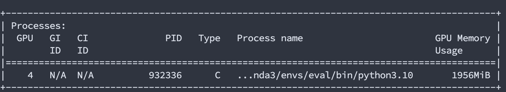

其次，记录的日志(/your/path/of/qwen3-110k/2025xxxx_16xxxx/logs/eval_log.log)可以展示最终结果，其中，关于gsm8k的测试结果如下所示：

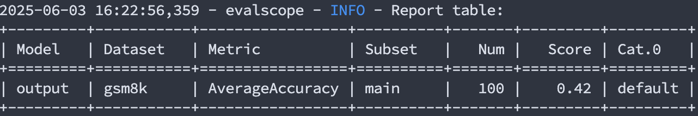

原模型的测试结果如下：

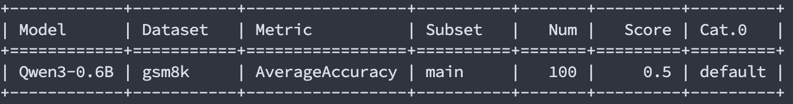

准确度的降低有可能是因为微调的数据集本身不是数学问答类，而且是中文数据集微调，而gsm8k是英文数据集。

其他的数据集如下所示，可以用别的数据集进行测试，测试结果如下：

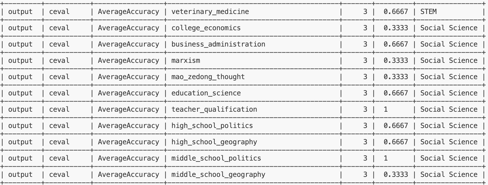

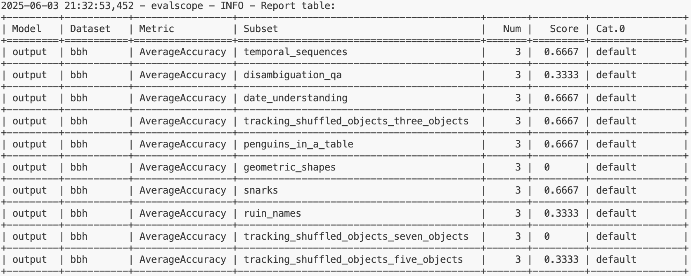

## 模型API服务评测

当然，如果遇到新的模型结构（如llada）或者模型更新的时候对结构有修改而evalscope还没有集成的话，可以考虑采用该方法对模型进行测评，该方法难点在于如何设置模型API服务地址，其他的和上述代码没有什么区别。

官方文档说指定模型**API服务地址(api_url)和API Key(api_key)**，评测部署的模型API服务，*此时`eval-type`参数必须指定为`service`*；

然后使用以下命令评测模型API服务：

```bash
evalscope eval \
 --model qwen2.5 \
 --api-url http://127.0.0.1:8801/v1/chat/completions \
 --api-key EMPTY \
 --eval-type service \
 --datasets gsm8k \
 --limit 10
```

这里要求客户发送请求和服务器返回信息都要符合openai要求的格式。

下面我们来看看如何设置--api-url。

### 1、设置模型API

代码：[url.py](https://github.com/828Tina/evalscope_qwen3_eval/blob/main/evalscope-eval/api_model/url.py)，参考了[GLM4官方代码](https://github.com/THUDM/GLM-4/blob/main/inference/glm4v_server.py#L283)

其实这一步也很简单，只需要下面三个步骤思路：

1. **接收用户请求**：用户通过发送一个 POST 请求到 `http://127.0.0.1:25001/v1/chat/completions`，提交一个包含对话信息的 JSON 数据，例如用户的问题或指令。
2. **处理请求并生成回复**：服务器接收到请求后，使用加载好的模型和分词器对用户输入的内容进行处理，通过生成函数生成模型的回答，并将回答格式化为规定的 OpenAI API 格式。
3. **返回结果**：服务器将生成的回答以 JSON 格式返回给用户，用户可以通过客户端接收并查看模型生成的文本内容。

而要想实现这三步，可以参考[FastAPI](https://fastapi.tiangolo.com/zh/tutorial/first-steps/#api_1)，思考如何设置API来规定用户请求的输入和服务器响应的输出。

> **FastAPI** 使用定义 API 的 **OpenAPI** 标准将你的所有 API 转换成`模式`(`模式`是对事物的一种定义或描述。它并非具体的实现代码，而只是抽象的描述)。在**`API模式`**下，OpenAI是一种规定如何定义 API 模式的规范。`模式`的定义包括你的 API 路径，以及它们可能使用的参数等等。

基本**接收用户请求**和**返回结果**都是基于openai的请求响应的原理，**处理请求并生成回复**部分理解成用大模型进行推理对话就行，用每个模型自带的readme里提到的推理代码即可，我们来看下各个部分处理的代码。

***1.处理请求并生成回复***

其实就是将[Qwen3给的推理代码](https://www.modelscope.cn/models/Qwen/Qwen3-0.6B)直接搬运😉，就是需要发送一个 POST 请求到 `http://127.0.0.1:25001/v1/chat/completions`，其他的代码不变。

```python
######################
# 处理请求并生成
######################
@app.post("/v1/chat/completions", response_model=ChatCompletionResponse)
async def chat_completions(request: ChatCompletionRequest):
    """
    该部分代码是将SFT模型部署到FastAPI上，并提供一个API接口，用于处理用户输入的文本，并返回模型生成的文本。

    1. 首先，定义了两个全局变量：model 和 tokenizer，分别用于加载和处理模型。
    2. 然后从request中提取信息，用于后续的模型推理生成，也就是将处理部分在服务器上
    """
    global model,tokenizer

    # 默认参数
    enable_thinking: bool = False
    # openai格式输入
    messages = request.messages
    temperature = request.temperature if request.temperature is not None else 0.8
    max_tokens = request.max_tokens if request.max_tokens is not None else 2048

    # 将输入消息转换为模型输入格式
    text = tokenizer.apply_chat_template(
    messages,
    tokenize=False,
    add_generation_prompt=True,
    enable_thinking=enable_thinking # 是否启用思考模式
    )

    # 编码输入文本
    model_inputs = tokenizer([text], return_tensors="pt").to(model.device)

    # 生成响应
    with torch.no_grad():
        generation_ids = model.generate(
                                        **model_inputs,
                                        temperature=temperature,
                                        max_new_tokens=max_tokens,
                                        )
    output_ids = generation_ids[0][len(model_inputs.input_ids[0]):].tolist() 
    # 解码输出文本
    response_texts = tokenizer.decode(output_ids, skip_special_tokens=True).strip("\n")
    # 构建响应对象
    choices = [
        ChatCompletionResponseChoice(
            index=0,
            message=ChatMessageResponse(role="assistant", content=response_texts)
        )
    ]
    # 计算使用信息
    usage = UsageInfo()
    # 如果是流式响应，则使用streaming的格式
    response = ChatCompletionResponse(
        model=request.model,
        object="chat.completion",
        choices=choices,
        usage=usage,
        )
    return response
```

***2、处理请求并生成回复***

这里需要注意输入格式要按照OpenAI要求的API格式即可，请求参数不知道的小伙伴可以参考👉[Chat Completions](https://openai.apifox.cn/api-67883981)

```python
# 定义OpenAI的content格式
class TextContent(BaseModel):
    type: Literal["text"]
    text: str

# 定义OpenAI的content格式
ContentItem = Union[TextContent]

# 定义OpenAI的message格式
class ChatMessageInput(BaseModel):
    role: Literal["user", "assistant", "system"]
    content: Union[str, List[ContentItem]]
    name: Optional[str] = None

class DeltaMessage(BaseModel):
    role: Optional[Literal["user", "assistant", "system"]] = None
    content: Optional[str] = None

# 定义OpenAI的api格式的模型输入
class ChatCompletionRequest(BaseModel):
    model: str
    messages: List[ChatMessageInput]
    temperature: Optional[float] = 0.8
    top_p: Optional[float] = 0.8
    max_tokens: Optional[int] = None
    stream: Optional[bool] = False
```

***3、返回结果***

服务器将生成的回答以 JSON 格式返回给用户，和2一样，需要规定输出格式，输出格式[在这](https://openai.apifox.cn/api-67883981).

```python
# 定义OpenAI的api格式的输出message相映格式
class ChatMessageResponse(BaseModel):
    role: Literal["assistant"]
    content: str = None
    name: Optional[str] = None

# 定义OpenAI的api格式的输出chattemplate选择
class ChatCompletionResponseChoice(BaseModel):
    index: int
    message: ChatMessageResponse
class ChatCompletionResponseStreamChoice(BaseModel):
    index: int
    delta: DeltaMessage

class UsageInfo(BaseModel):
    prompt_tokens: int = 0
    total_tokens: int = 0
    completion_tokens: Optional[int] = 0

# 定义OpenAI的api格式的模型输出
class ChatCompletionResponse(BaseModel):
    model: str
    object: Literal["chat.completion", "chat.completion.chunk"]
    choices: List[Union[ChatCompletionResponseChoice, ChatCompletionResponseStreamChoice]]
    created: Optional[int] = Field(default_factory=lambda: int(time.time()))
    usage: Optional[UsageInfo] = None
```

先运行下面的代码连接服务端口

```bash
python ./evalscope-eval/api_model/url.py 
```

再开启一个新的terminal运行下面的代码

```bash
bash ./evalscope-eval/api_model/eval_api_eval.sh
```

> 需要注意--api-url参数，要根据url中写的端口来写，比如--api-url http://127.0.0.1:25001/v1/chat/completions。

### 2、结果展示

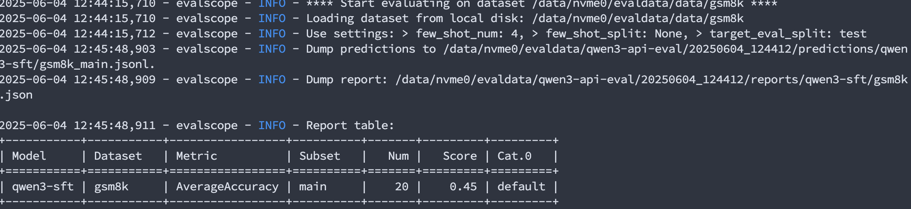

## 模型推理性能压测

模型推理性能压测是一种评估机器学习模型在实际运行环境中性能的方法。它主要关注模型在处理输入数据并生成预测结果时的效率和稳定性。压测的目的是确保模型在面对预期或超出预期的负载时仍能保持良好的性能。

> **为什么进行性能压测？**
> 
> 1. **性能评估**：了解模型在不同负载下的性能表现，包括响应时间、吞吐量等。
> 2. **瓶颈识别**：识别可能影响模型性能的瓶颈，如计算资源（CPU、GPU）、内存、网络带宽等。
> 3. **稳定性测试**：确保模型在长时间运行或高负载下不会崩溃或出现性能急剧下降。
> 4. **资源优化**：根据压测结果优化资源分配，提高资源利用率，降低成本。
> 5. **容量规划**：帮助预测所需的计算资源，以便为未来的扩展做好准备。

输出指标参考如下：

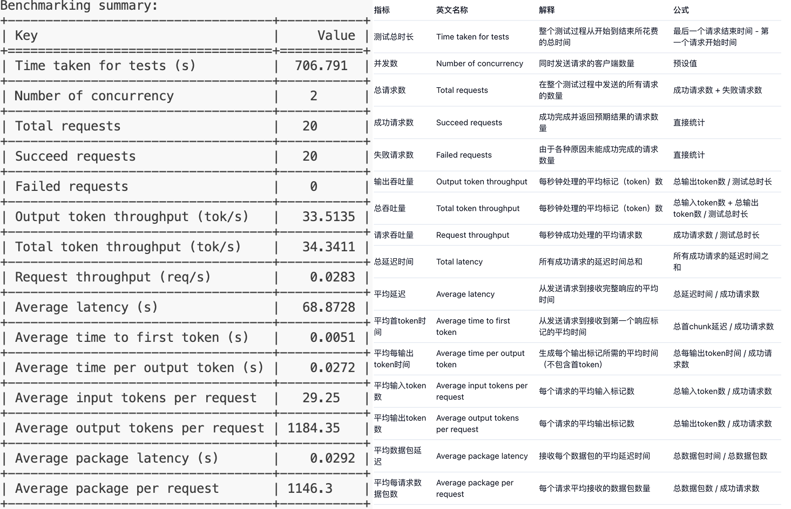

---

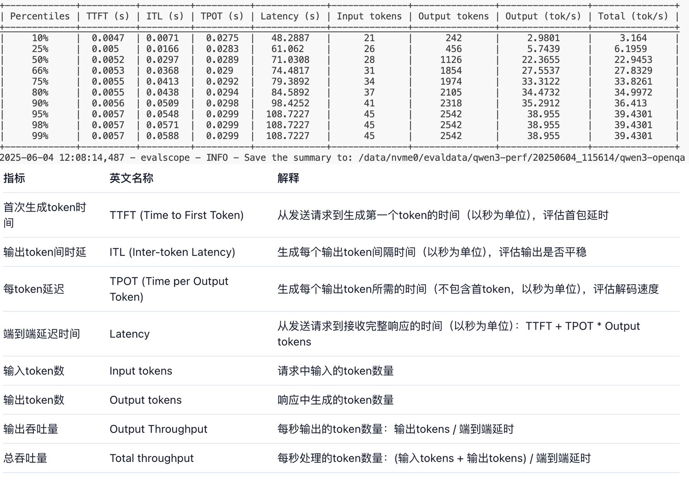

可视化使用只需要添加两个参数即可，我们可以从[swanlab要求参数](https://github.com/modelscope/evalscope/blob/main/evalscope/perf/arguments.py#L163)可以看到只需要修改swanlab-api-key和name即可。

```bash
--swanlab-api-key 'swanlab_api_key'
--name 'name_of_swanlab_log'
```

启动代码如下：

```bash
export CUDA_VISIBLE_DEVICES=0
evalscope perf \
 --model '/data/nvme1/weights/Qwen3_sft_eval/output' \
 --dataset openqa \
 --number 20 \
 --parallel 2 \
 --swanlab-api-key 'your swanlab api key' \
 --name 'qwen3-openqa' \
 --temperature 0.9 \
 --outputs-dir '/data/nvme0/evaldata/qwen3-perf' \
 --api local
```

或者直接运行下面的代码：

```bash
bash evalscope-eval/swanlab/perf.sh
```

### 结果展示

**SwanLab压测结果展示**

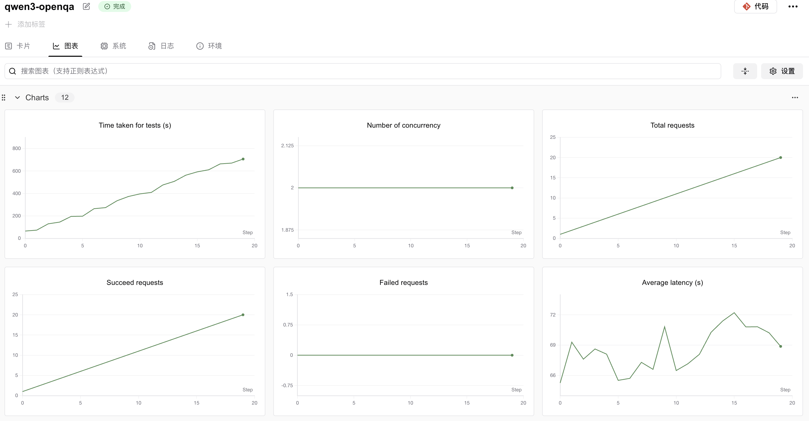

**log结果展示**

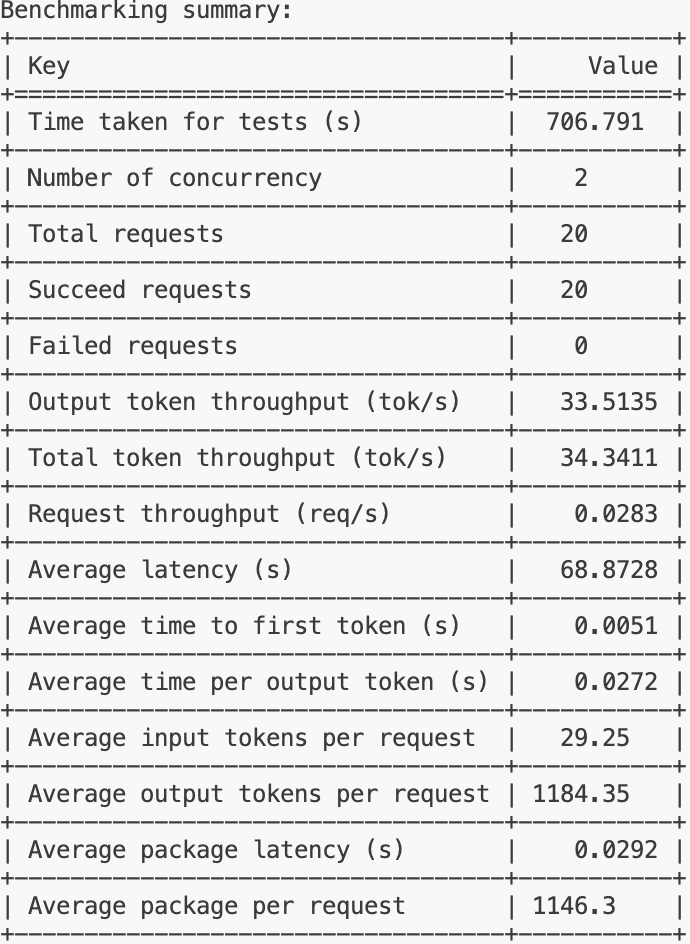

综合来看，这个模型在处理单个请求时的延迟较高，请求吞吐量较低，这可能意味着在当前配置下，模型的性能表现不佳，特别是在需要快速响应的场景中。可能需要对模型进行优化，或者在部署时考虑增加资源以提高性能。


表格展示了模型在不同负载下的性能表现，特别是在高负载下的性能瓶颈。模型在处理输入和生成输出时的时间相对稳定，但在高负载下的延迟显著增加，这可能会影响用户体验。因此，可能需要对模型进行优化，或者在部署时考虑增加资源以提高性能。

# F&A

## 1、魔搭社区下载的数据集用不了

由于本身数据集是来源于huggingface，魔搭社区上传的数据集会有dataset_infos.json文件，该文件是上传时自动生成，用以在数据预览功能里展示数据集中每一类别标签，但是不符合huggingface的格式，我们在使用的时候会调用datasets库，然后会报下面的错误：

代码：

```python
from datasets import load_dataset

DATA_PATH = '/data/nvme0/textvqa_bbox'
ds = load_dataset(DATA_PATH,split='train')
```

报错：

```python
TypeError: Value.__init__() missing 1 required positional argument: 'dtype'
```

解决：

删掉下载到本地的数据集文件里的dataset_infos.json文件。

# 参考链接

- [https://github.com/THUDM/GLM-4/tree/main](https://github.com/THUDM/GLM-4/tree/main)
- [https://evalscope.readthedocs.io/zh-cn/latest/get_started/introduction.html](https://evalscope.readthedocs.io/zh-cn/latest/get_started/introduction.html)
- [https://docs.swanlab.cn/](https://docs.swanlab.cn/)
- [https://zhuanlan.zhihu.com/p/27059073229](https://zhuanlan.zhihu.com/p/27059073229)
- [https://openai.apifox.cn/api-67883981](https://openai.apifox.cn/api-67883981)
- [https://github.com/modelscope/evalscope/tree/main](https://github.com/modelscope/evalscope/tree/main)
- [https://qwen.readthedocs.io/zh-cn/latest/deployment/openllm.html](https://qwen.readthedocs.io/zh-cn/latest/deployment/openllm.html)
- [https://github.com/QwenLM/Qwen3?tab=readme-ov-file](https://github.com/QwenLM/Qwen3?tab=readme-ov-file)
- [https://fastapi.tiangolo.com/zh/tutorial/first-steps/#openapijson](https://fastapi.tiangolo.com/zh/tutorial/first-steps/#openapijson)
