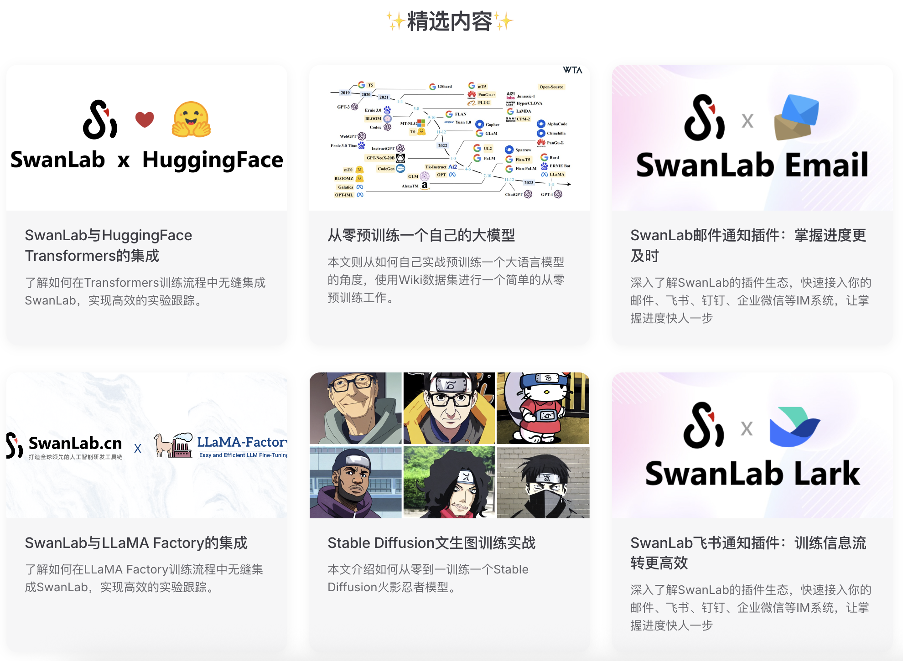
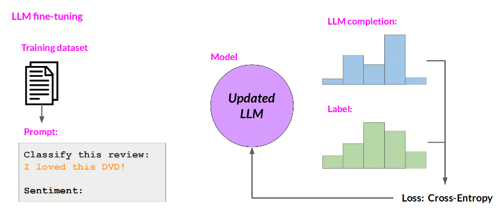
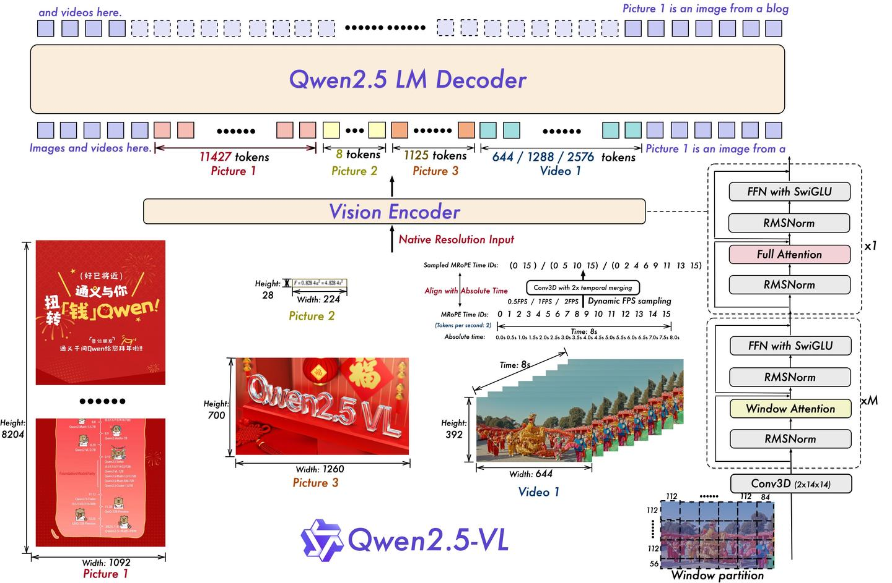
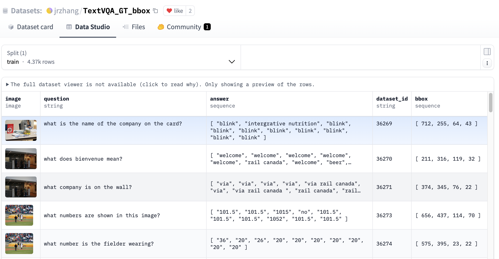
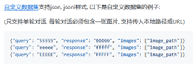
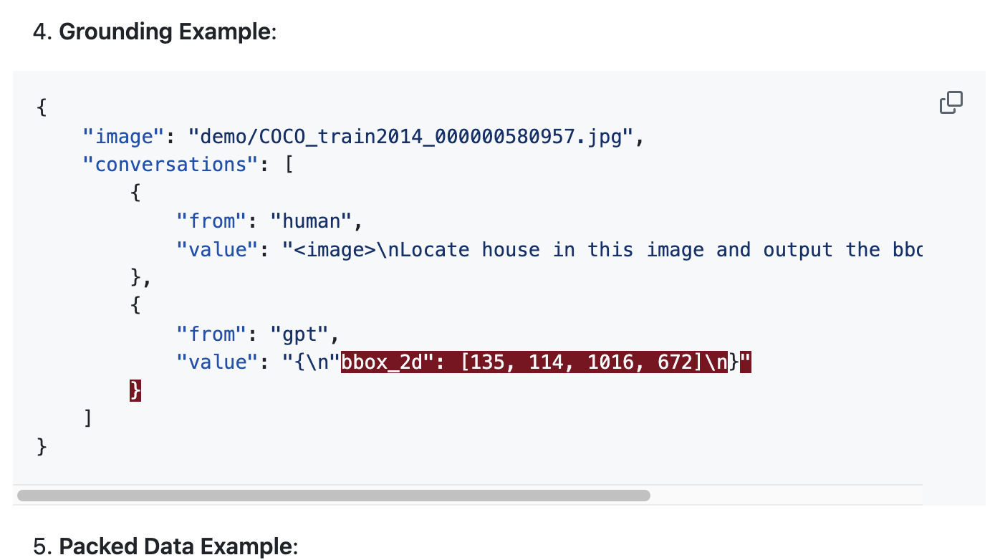
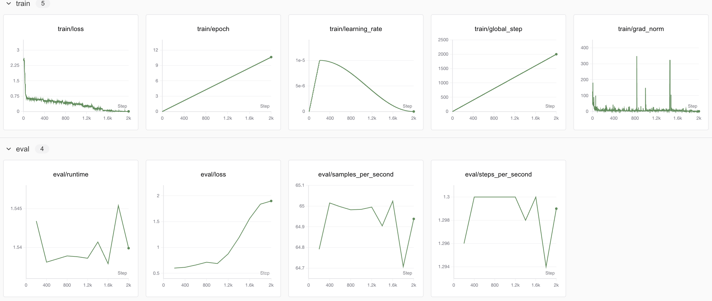
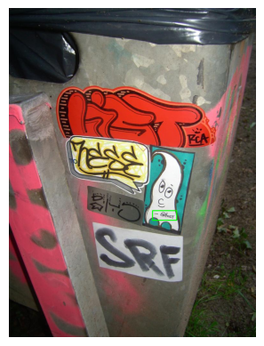

# Qwen2.5-VL模型目标检测（Grounding）任务领域微调教程

## 📝简介

​	在目标检测领域，众多神经网络模型早已凭借其卓越的性能，实现了精准的目标检测与目标分割效果。然而，随着多模态模型的崛起，其在图像分析方面展现出的非凡能力，为该领域带来了新的机遇。多模态模型不仅能够深入理解图像内容，还能将这种理解转化为文本形式输出，极大地拓展了其应用场景。鉴于此，本文旨在打造一份详尽的教程，指导读者如何通过对主流多模态大模型进行微调，来实现目标检测任务。以Qwen2.5-VL为例，凭借其强大的多模态分析能力，无需从头开始，利用大量数据进行预训练来构建新模型，仅通过微调即可高效地实现目标检测功能，为该领域的发展提供一种全新的思路与方法。


## 📚链接资料

作者信息：情感机器实验室研究员-李馨雨 邮箱：wind.340171@gmail.com

模型地址：Qwen2.5-VL-3B-Instruct：[huggingface](https://huggingface.co/Qwen/Qwen2.5-VL-3B-Instruct)|[魔搭社区（下面的模型下载使用，而且比较方便）](https://www.modelscope.cn/models/Qwen/Qwen2.5-VL-3B-Instruct)

数据集地址：TextVQA_GroundingTask_bbox：[huggingface](https://huggingface.co/datasets/jrzhang/TextVQA_GT_bbox)|[魔搭社区](https://www.modelscope.cn/datasets/Tina12345/textVQA_groundingtask_bbox)

代码地址：[github](https://github.com/828Tina/textvqa_grounding_task_qwen2.5-vl-ft)

可视化工具SwanLab项目地址：[SwanLab训练指标观测结果曲线图](https://swanlab.cn/@LiXinYu/qwen2.5-vl-sft-grounding/overview)

> 友情链接：
>
> SwanLab官方文档，助你轻松开启深度学习之旅。
>
> 1. [框架集成文档](https://docs.swanlab.cn/guide_cloud/integration/)：SwanLab已经集成Transformers、LLaMA Factory、Pytorch等主流框架，并持续更新
> 2. [实战案例](https://docs.swanlab.cn/examples/hello_world.html)：SwanLab提供了丰富的模型训练实战教程，助力用户快速掌握深度学习模型训练的要点




## 💻训练任务设置

### 1、训练方法简介



1. **部分参数微调**：部分参数微调是一种在预训练模型基础上进行针对性调整的策略。它仅对模型的一部分参数进行更新，而保持其他参数不变。这种方法的优点是

   - 计算成本相对较低，因为它不需要对整个模型的所有参数进行优化。这使得部分参数微调在资源有限的情况下更加可行，例如在单个GPU上或在内存受限的环境中。

   - 可以减少过拟合的风险，因为它限制了模型的调整范围，避免了对训练数据的过度拟合。
   - `缺点`是可能无法充分利用预训练模型的全部潜力，因为只有部分参数得到了优化。这可能导致模型在某些复杂任务上的性能不如全参数微调。

2. **全参数微调**：全参数微调是一种直接且直观的方法，它允许模型在微调过程中对所有参数进行更新。

   - 这种方法的优势在于能够充分利用预训练模型的知识，并针对特定任务进行精细调整，从而在许多任务上达到最优性能。
   - `缺点`是计算成本高，尤其是在模型参数量巨大的情况下。全参数微调需要大量的GPU内存和计算资源，这在多模型部署和实时应用中可能成为瓶颈。


### 2、选用模型简介

- Qwen2.5-vl技术报告论文地址：[[Qwen2.5-VL Technical Report](https://arxiv.org/pdf/2502.13923)]
- 代码地址：[[Qwen2.5-VL](https://github.com/QwenLM/Qwen2.5-VL)]



​	多模态模型主要由**视觉编码器（Vision Encoder）、语言模型（LM）和多模态融合模块（Connector）**三块构成，和Qwen2-VL一样，Qwen2.5-VL并没有巨大的Connector，仅用一个MLP完成特征投影。打印模型结构如下：

```python
### 代码表示
MODEL_PATH = '/data/nvme1/weights/Qwen2_5-VL-3B-Instruct'

from transformers import Qwen2_5_VLForConditionalGeneration, AutoTokenizer, AutoProcessor, Qwen2_5_VLForConditionalGeneration
from qwen_vl_utils import process_vision_info

model = Qwen2_5_VLForConditionalGeneration.from_pretrained(
    MODEL_PATH, torch_dtype="auto", device_map="auto"
)
print(model)
```

结果如下：

```python
Qwen2_5_VLForConditionalGeneration(
  (visual): Qwen2_5_VisionTransformerPretrainedModel(
    (patch_embed): Qwen2_5_VisionPatchEmbed(
      (proj): Conv3d(3, 1280, kernel_size=(2, 14, 14), stride=(2, 14, 14), bias=False)
    )
    (rotary_pos_emb): Qwen2_5_VisionRotaryEmbedding()
    (blocks): ModuleList(
      (0-31): 32 x Qwen2_5_VLVisionBlock(
        (norm1): Qwen2RMSNorm((1280,), eps=1e-06)
        (norm2): Qwen2RMSNorm((1280,), eps=1e-06)
        (attn): Qwen2_5_VLVisionSdpaAttention(
          (qkv): Linear(in_features=1280, out_features=3840, bias=True)
          (proj): Linear(in_features=1280, out_features=1280, bias=True)
        )
        (mlp): Qwen2_5_VLMLP(
          (gate_proj): Linear(in_features=1280, out_features=3420, bias=True)
          (up_proj): Linear(in_features=1280, out_features=3420, bias=True)
          (down_proj): Linear(in_features=3420, out_features=1280, bias=True)
          (act_fn): SiLU()
        )
      )
    )
    (merger): Qwen2_5_VLPatchMerger(
      (ln_q): Qwen2RMSNorm((1280,), eps=1e-06)
      (mlp): Sequential(
        (0): Linear(in_features=5120, out_features=5120, bias=True)
        (1): GELU(approximate='none')
        (2): Linear(in_features=5120, out_features=2048, bias=True)
      )
    )
  )
  (model): Qwen2_5_VLModel(
    (embed_tokens): Embedding(151936, 2048)
    (layers): ModuleList(
      (0-35): 36 x Qwen2_5_VLDecoderLayer(
        (self_attn): Qwen2_5_VLSdpaAttention(
          (q_proj): Linear(in_features=2048, out_features=2048, bias=True)
          (k_proj): Linear(in_features=2048, out_features=256, bias=True)
          (v_proj): Linear(in_features=2048, out_features=256, bias=True)
          (o_proj): Linear(in_features=2048, out_features=2048, bias=False)
          (rotary_emb): Qwen2_5_VLRotaryEmbedding()
        )
        (mlp): Qwen2MLP(
          (gate_proj): Linear(in_features=2048, out_features=11008, bias=False)
          (up_proj): Linear(in_features=2048, out_features=11008, bias=False)
          (down_proj): Linear(in_features=11008, out_features=2048, bias=False)
          (act_fn): SiLU()
        )
        (input_layernorm): Qwen2RMSNorm((2048,), eps=1e-06)
        (post_attention_layernorm): Qwen2RMSNorm((2048,), eps=1e-06)
      )
    )
    (norm): Qwen2RMSNorm((2048,), eps=1e-06)
    (rotary_emb): Qwen2_5_VLRotaryEmbedding()
  )
  (lm_head): Linear(in_features=2048, out_features=151936, bias=False)
)
```

​	Qwen2.5-VL-3B-Instruct 基于 Qwen2.5 架构，其参数量达到 30 亿级别，专为指令微调而设计。该模型在预训练阶段，通过海量文本和图像数据学习通用的语言和视觉知识，能够理解并生成自然语言文本，同时处理与文本相关的图像信息，实现多模态交互。在指令微调过程中，Qwen2.5-VL-3B-Instruct 针对特定的指令任务进行了优化，使其能够更好地理解和执行人类的指令，如问答、文本生成、图像描述等。它在多模态任务上展现出色的性能，能够将图像内容与文本语义相结合，生成准确且富有逻辑的回答。此外，该模型还具备一定的推理能力和创造力，能够在处理复杂任务时提供有价值的见解和解决方案。

下载代码：

```bash
modelscope download --model Qwen/Qwen2.5-VL-3B-Instruct  --local_dir /data/nvme1/weights/Qwen/Qwen2.5-VL-3B-Instruct
```


### 3、数据集简介

​	TextVQA_GT_bbox 是 Hugging Face 上的一个视觉问答（VQA）数据集，专注于文本相关的视觉问答任务，来源于 [TextVQA](https://textvqa.org/dataset/) ，并`提供目标边界框`信息。该数据集包含图像、与图像相关的问题以及对应的答案，边界框信息帮助模型精准定位图像中的文本内容，从而提高回答问题的准确性。该数据集选择[TextVQA](https://textvqa.org/dataset/) 中单目标检测的问答，保留5000个样本中的4370个。

​	本次教程的任务目标是利用问题和目标边界框信息来对Qwen2.5-VL-3B-Instruct模型进行微调，数据集样式如下：



​	论文《[MLLMs Know Where to Look: Training-free Perception of Small Visual Details with Multimodal LLMs](https://arxiv.org/pdf/2502.17422)》中使用该数据集用于研究MLLM的注意力模式。

下载代码：

```bash
modelscope download --dataset Tina12345/textVQA_groundingtask_bbox  --local_dir /data/nvme0/textvqa_bbox
```


### 4、训练框架选择


​	**Hugging Face Transformers** 是一个基于 Python 的开源库，广泛应用于自然语言处理（NLP）任务。该框架提供了大量预训练的语言模型（如 BERT、GPT、T5、RoBERTa、DistilBERT 等），并支持使用 PyTorch 和 TensorFlow 两种主流深度学习框架进行模型的微调与部署。

​	Transformers 库的核心优势在于其统一且简洁的接口设计，使得研究人员和开发者可以快速实现文本分类、命名实体识别、问答系统、文本生成等多种 NLP 任务。此外，它集成了 Hugging Face Model Hub ，这是一个包含数万个社区贡献模型的平台，用户可直接加载已有模型或上传自定义模型，便于模型共享与复用。

​	在性能方面，Transformers 支持混合精度训练、分布式训练以及 ONNX 导出等功能，适用于从研究原型到工业级部署的全流程开发。结合 Datasets、Tokenizers、Accelerate 等配套库，Hugging Face 构建了一个完整的 NLP 开发生态系统，极大提升了模型开发与实验迭代的效率。

参考材料：https://huggingface.co/docs/transformers/index


## 📜 数据集准备

首先，该数据集可以从huggingface上直接下载，代码如下：

```python
from datasets import load_dataset

# Login using e.g. `huggingface-cli login` to access this dataset
ds = load_dataset("jrzhang/TextVQA_GT_bbox")
```

如果huggingface无法使用，也可以选择魔搭社区，将数据集下载到本地，可以使用下面的代码，也可以使用命令行下载：

代码下载：

```python
from modelscope.msdatasets import MsDataset
ds =  MsDataset.load('Tina12345/textVQA_groundingtask_bbox', subset_name='default', split='train', cache_dir="./data")
```

命令行下载：

```bash
modelscope download --dataset Tina12345/textVQA_groundingtask_bbox  --local_dir /data/nvme0/textvqa_bbox
```

> **⚠️注意：**
>
> 使用魔搭社区下载数据集，会出现F&A的1、魔搭社区下载的数据集用不了的问题，解答在这里👉1、魔搭社区下载的数据集用不了

下载好后，把数据集稍加改造，保存成jsonl格式的文件，以便后续训练。

原数据集格式为：

```json
{
    'image': <PIL.JpegImagePlugin.JpegImageFile image mode=RGB size=1024x681 at 0x7FA58E1DB340>, 
    'question': 'what is the name of the company on the card?', 
    'answer': ['blink', 'intergrative nutrition', 'blink', 'blink', 'blink', 'blink', 'blink', 'blink', 'blink', 'blink'], 
    'dataset_id': '36269', 
    'bbox': [712.0, 255.0, 64.0, 43.0]
}
```

我们只需要其中的image、question、bbox部分，可以将这三部分保存，其中question代表user部分的提问，bbox代表的是assistant部分的回答，我参考了[swift的数据格式:query-response格式](https://github.com/modelscope/ms-swift/blob/main/docs/source/Customization/%E8%87%AA%E5%AE%9A%E4%B9%89%E6%95%B0%E6%8D%AE%E9%9B%86.md)。



原数据集的bbox为[x1,y1,w,h]的格式，训练保存的bbox修改成[x1,y1,x2,y2]的格式，最终保存成以下格式：

```json
{"image": ["./data/test/003001.jpg"], "query": "what is written on the ghost?", "response": "{\"bbox_2d\": [460, 635, 513, 669]}"}
```

其中需要注意的是，qwen对于grounding的训练任务有相应的模板，链接在这👉[Qwen2.5-vl-finetune](https://github.com/QwenLM/Qwen2.5-VL/blob/main/qwen-vl-finetune/README.md)，因此上述的"{\"bbox_2d\": [460, 635, 513, 669]}"其实是参考了官方的**Grounding Example**，



数据集转化代码保存到scripts/convert2sft_format.py中，代码如下：

```python
"""
将数据集格式转换成多模态模型监督微调格式，格式如下所示，保存文件格式为jsonl格式：
{
    "image": "demo/COCO_train2014_000000580957.jpg",
    "conversations": [
        {
            "from": "human",
            "value": "<image>\nLocate house in this image and output the bbox coordinates in JSON format."
        },
        {
            "from": "gpt",
            "value": "{\n"bbox_2d": [135, 114, 1016, 672]\n}"
        }
    ]
}
该格式是参考qwen2.5-vl-finetune文件中提到的Grounding Example所示。

原数据集格式为：
{
    'image': <PIL.JpegImagePlugin.JpegImageFile image mode=RGB size=1024x681 at 0x7FA58E1DB340>, 
    'question': 'what is the name of the company on the card?', 
    'answer': ['blink', 'intergrative nutrition', 'blink', 'blink', 'blink', 'blink', 'blink', 'blink', 'blink', 'blink'], 
    'dataset_id': '36269', 
    'bbox': [712.0, 255.0, 64.0, 43.0]
}

"""


import json
import os
from tqdm import tqdm
from datasets import load_dataset
import math

"""
Qwen2.5-VL使用绝对协调为调整大小的图像。对于原始绝对坐标，应该乘以调整大小的高度和宽度，然后除以其原始高度和宽度。
具体代码官网给了，链接：https://github.com/QwenLM/Qwen2.5-VL/blob/main/qwen-vl-finetune/tools/process_bbox.ipynb
可以参考官方的链接
"""

# This is the resize function of Qwen2.5-VL
def smart_resize(
    height: int, width: int, factor: int = 28, min_pixels: int = 56 * 56, max_pixels: int = 14 * 14 * 4 * 1280
):
    """Rescales the image so that the following conditions are met:
    1. Both dimensions (height and width) are divisible by 'factor'.
    2. The total number of pixels is within the range ['min_pixels', 'max_pixels'].
    3. The aspect ratio of the image is maintained as closely as possible.
    """
    if height < factor or width < factor:
        raise ValueError(f"height:{height} or width:{width} must be larger than factor:{factor}")
    elif max(height, width) / min(height, width) > 200:
        raise ValueError(
            f"absolute aspect ratio must be smaller than 200, got {max(height, width) / min(height, width)}"
        )
    h_bar = round(height / factor) * factor
    w_bar = round(width / factor) * factor
    if h_bar * w_bar > max_pixels:
        beta = math.sqrt((height * width) / max_pixels)
        h_bar = math.floor(height / beta / factor) * factor
        w_bar = math.floor(width / beta / factor) * factor
    elif h_bar * w_bar < min_pixels:
        beta = math.sqrt(min_pixels / (height * width))
        h_bar = math.ceil(height * beta / factor) * factor
        w_bar = math.ceil(width * beta / factor) * factor
    return h_bar, w_bar


def convert_to_qwen25vl_format(bbox, orig_height, orig_width, factor=28, min_pixels=56*56, max_pixels=14*14*4*1280):
    new_height, new_width = smart_resize(orig_height, orig_width, factor, min_pixels, max_pixels)
    scale_w = new_width / orig_width
    scale_h = new_height / orig_height
    
    x1, y1, x2, y2 = bbox
    x1_new = round(x1 * scale_w)
    y1_new = round(y1 * scale_h)
    x2_new = round(x2 * scale_w)
    y2_new = round(y2 * scale_h)
    
    x1_new = max(0, min(x1_new, new_width - 1))
    y1_new = max(0, min(y1_new, new_height - 1))
    x2_new = max(0, min(x2_new, new_width - 1))
    y2_new = max(0, min(y2_new, new_height - 1))
    
    return [x1_new, y1_new, x2_new, y2_new]


def convert_to_sft_format(data_path,save_path,type='train'):
    # 加载数据集
    dataset = load_dataset(data_path,split='train')

    # 每个数据保存到一个jsonl文件中，并且图片的话要另外放到一起
    if not os.path.exists(save_path):
        os.makedirs(save_path)

    # 创建 JSONL 文件
    jsonl_file = os.path.join(save_path, f"{type}.jsonl")
    with open(jsonl_file, 'w', encoding='utf-8') as jsonl_out:
        # 遍历数据集并保存图片，其他的部分信息保存成jsonl文件
        for idx,sample in tqdm(enumerate(dataset),total=len(dataset)):
            if type == 'train':
                if idx >= 3000:  # 判断是否处理到3000条数据
                    break
            elif type == 'test':
                # 判断是否处理到3001到3100条数据
                if idx < 3000 or idx >= 3100:
                    continue
            # 保存图片
            image = sample['image']
            # 生成文件名（格式为 000001.jpg, 000002.jpg 等）
            filename = f"{idx + 1:06d}.jpg"  # 使用 6 位数字格式化文件名
            jpg_path = os.path.join(save_path, type)
            if not os.path.exists(jpg_path):
                os.makedirs(jpg_path)
            output_path = os.path.join(jpg_path, filename)
            # 保存图片
            image.save(output_path)

            # 保存其他信息
            # 坐标信息
            old_bbox = sample['bbox']
            #### 这里需要将坐标转换成Qwen2.5-VL的坐标格式   
            image_width, image_height = image.size
            x1, y1, w, h = old_bbox
            new_bboxes = [x1, y1, x1 + w, y1 + h]
            # 转换坐标
            qwen25_bboxes = convert_to_qwen25vl_format(new_bboxes, image_height, image_width)
            bbox_dict = {"bbox_2d": qwen25_bboxes}
            formatted_json = json.dumps(bbox_dict, indent=None)
            data = {
                "image":[output_path],
                "query":sample['question'],
                "response":formatted_json,
            }

            # 将数据写入 JSONL 文件
            # 将每条数据写入 JSONL 文件
            jsonl_out.write(json.dumps(data, ensure_ascii=False) + '\n')

    print(f"All images and data have been saved to {save_path} and {jsonl_file}")

# 示例调用
convert_to_sft_format(data_path='/home/lixinyu/data/textvqa_bbox', save_path='./data', type='test')
```

其中图像保存到data/train中，train.jsonl保存到data文件夹中，同时还有测试集数据也同样保存到test中，只是在输入的type根据需要修改成“train”或者“test”即可。

> 🚨🚨🚨🚨**注意**🚨🚨🚨🚨
>
> ---
>
> Qwen官方提供了一段代码👉[Qwen2.5VL转换bbox代码](https://github.com/QwenLM/Qwen2.5-VL/blob/main/qwen-vl-finetune/tools/process_bbox.ipynb)，很容易被忽略（我之前就忽略了😳，还好有好心人提醒），那就是Qwen2.5VL原版代码转换bbox的过程，因为Qwen2.5Vl输入的图像进入VisionMLP会自动rescale，如果不按照官方的对坐标进行修改的话，推理的结果是错误的，或者说是没对齐的。
>
> ---

我随便找了数据集的一条数据，

```json
## 该数据是我之前错误格式下保存的，我们主要看下bbox
{
    "image": [
        "./data/test/003003.jpg"
    ],
    "query": "what numbered album is the photo from?",
    "response": "{\"bbox_2d\": [948.0, 633.0, 59.0, 21.0]}"
}
```

在图中的位置如下所示


然后经过官方代码转换后的bbox坐标如下所示：

```python
## 缩放图了之后观察坐标值和图像的对应关系
import math

# This is the resize function of Qwen2.5-VL
def smart_resize(
    height: int, width: int, factor: int = 28, min_pixels: int = 56 * 56, max_pixels: int = 14 * 14 * 4 * 1280
):
    """Rescales the image so that the following conditions are met:
    1. Both dimensions (height and width) are divisible by 'factor'.
    2. The total number of pixels is within the range ['min_pixels', 'max_pixels'].
    3. The aspect ratio of the image is maintained as closely as possible.
    """
    if height < factor or width < factor:
        raise ValueError(f"height:{height} or width:{width} must be larger than factor:{factor}")
    elif max(height, width) / min(height, width) > 200:
        raise ValueError(
            f"absolute aspect ratio must be smaller than 200, got {max(height, width) / min(height, width)}"
        )
    h_bar = round(height / factor) * factor
    w_bar = round(width / factor) * factor
    if h_bar * w_bar > max_pixels:
        beta = math.sqrt((height * width) / max_pixels)
        h_bar = math.floor(height / beta / factor) * factor
        w_bar = math.floor(width / beta / factor) * factor
    elif h_bar * w_bar < min_pixels:
        beta = math.sqrt(min_pixels / (height * width))
        h_bar = math.ceil(height * beta / factor) * factor
        w_bar = math.ceil(width * beta / factor) * factor
    return h_bar, w_bar


def convert_to_qwen25vl_format(bbox, orig_height, orig_width, factor=28, min_pixels=56*56, max_pixels=14*14*4*1280):
    new_height, new_width = smart_resize(orig_height, orig_width, factor, min_pixels, max_pixels)
    scale_w = new_width / orig_width
    scale_h = new_height / orig_height
    
    x1, y1, x2, y2 = bbox
    x1_new = round(x1 * scale_w)
    y1_new = round(y1 * scale_h)
    x2_new = round(x2 * scale_w)
    y2_new = round(y2 * scale_h)
    
    x1_new = max(0, min(x1_new, new_width - 1))
    y1_new = max(0, min(y1_new, new_height - 1))
    x2_new = max(0, min(x2_new, new_width - 1))
    y2_new = max(0, min(y2_new, new_height - 1))
    
    return [x1_new, y1_new, x2_new, y2_new]


new_bboxes = [x1, y1, x1+w, y1+h]
print(f"新的坐标是{new_bboxes}")
print(f"转换后的坐标是{convert_to_qwen25vl_format(new_bboxes, image.shape[0], image.shape[1])}")
```

输出结果：

新的坐标是[948, 633, 1007, 654] 

转换后的坐标是[959, 628, 1019, 649]

⚠️这一步是必须要有的，详细代码可以参考仓库中的./scripts/convert2sft_format.py文件。

## 🚀微调代码

### 1、环境设置

- 硬件信息概览：[概览](https://swanlab.cn/@LiXinYu/qwen2.5-vl-sft-grounding/runs/j426nezsim58am8gwrhb0/environment/overview)

​	**GPU：**8 * NVIDIA H20 96GB

​	**CPU：**AMD EPYC 9K84 96-Core Processor 

​	**操作系统：**TencentOS Server 3.1 (Final)

​	**python版本：**3.10.17

- python训练环境：

  ```txt
  modelscope
  qwen_vl_utils
  transformers
  peft
  diffusers
  torch==2.5.1 
  torchvision==0.20.1 
  torchaudio==2.5.1
  swanlab
  deepspeed
  ```


> 实测3090也行，8*3090 24GB也可以运行，不过后续的参数需要调整


### 2、数据预处理

可以说该步骤是大模型微调的核心，很容易出现报错bug，这里注意两点，只要这两点能做好，剩下的部分就不难了，这两点都是Trainer中出现的。

- train_dataset：数据集，并且是Dataset格式，也就是huggingface能读懂的格式
- data_collator：用于处理数据的批量组合和预处理，确保数据能够以正确的格式输入到模型中。包括填充（Padding）、张量转换（Tensor Conversion）、截断（Truncation）等

代码位于vision_datacollator.py中，具体怎么做我们看看下面的详细讲解。

**1、train_dataset**

最重要的就是格式对应上就行，transformers库是huggingface开源的专门用于处理大模型训练和推理等的函数库，为了确保数据能够被模型正确加载和处理，数据必须符合特定的格式。这种格式通常是 `Dataset` 对象，这是由 Hugging Face 的 `datasets` 库提供的一个类，用于表示和操作数据集。

```python
DatasetDict({
    train: Dataset({
        features: ['image', 'query', 'response'],
        num_rows: 3000
    })
    test: Dataset({
        features: ['image', 'query', 'response'],
        num_rows: 100
    })
})
```

该部分代码如下：

```python
 ################
  # Dataset
  ################
  # 1、读取保存的jsonl文件，使用datasets.load_dataset生成的数据集即是Dataset格式，符合hf使用标准格式
  train_dataset = datasets.load_dataset("json", data_files=data_args.train_dataset_name)
  test_dataset = datasets.load_dataset("json", data_files=data_args.test_dataset_name)
  # 2、创建 DatasetDict，这部分只是为了后续读取测试数据方便，因此把train和test放在一起
  raw_dataset = datasets.DatasetDict({
    "train": train_dataset["train"],
    "test": test_dataset["train"]
  })
  print(raw_dataset)
  # 3、固定数据集格式用于后面批处理数据集
  def preporocess_textvqa(example):
    return {
      "image": example["image"],
      "user": example["query"],
      "assistant": example["response"],
    }

  raw_dataset = raw_dataset.map(
    preporocess_textvqa,
    remove_columns=raw_dataset["train"].column_names,
    desc="Preprocessing textvqa dataset",
  )
  
  
# 4、Trainer数据集调用
train_dataset=raw_dataset["train"],
eval_dataset=(
            raw_dataset["test"] if training_args.eval_strategy != "no" else None
        ),
```

**2、data_collator**

由于本次教程涉及坐标的缩放，因此需要自己写data_collator部分，通过调整数据集格式来用于模型训练。

1. 缩放图像的大小

因为原数据集的坐标对应的图都是不同的大小，而且图像一般都比较大，多模态大模型一般在训练阶段对于图像的大小有要求，比如256\*256、512\*512等，而原图的大小不一，因此需要统一下图像大小，代码如下：

```python
# 缩放图像的大小，同时因为grounding任务，需要同时缩放坐标
def resize_with_max_side(image, max_side_length):
    # 获取原始尺寸
    width, height = image.size
    # 计算缩放比例
    scale = min(max_side_length / width, max_side_length / height)
    # 计算新的尺寸
    new_width = int(width * scale)
    new_height = int(height * scale)
    # 调整图像大小
    resized_image = image.resize((new_width, new_height), Image.Resampling.LANCZOS)
    return resized_image, scale
```

2. 缩放坐标数据

因为图像缩放了，因此坐标位置也要缩放到新的图像的对应位置，代码如下：

```python
def resize_bbox(bbox, scale):
    # 缩放矩形框坐标
    return [int(coord * scale) for coord in bbox]
```

3. 构建数据集的input_ids

根据上面两步调整的代码如下，需要分别把统一的image、question、answer输出：

```python
question = example["user"]
answer = example["assistant"]
# 需要读取图像，需要确保是RGB图像
image_path = example['image'][0]
image = Image.open(image_path)
# 输出缩放后的图像以及缩放倍率
image, scale = resize_with_max_side(
  image, max_side_length=self.max_img_side_length
)
# 缩放answer的坐标值
# answer是一个json字符串，解析成字典
answer = json.loads(answer)
answer = {"bbox_2d": resize_bbox(answer["bbox_2d"],scale)}
# 转化新的answer
answer = json.dumps(answer, indent=None)
```

根据得到的image、question、answer经过大模型加载为tokens格式：

```python
prompt = "Please enclose the corresponding positions using coordinate boxes. Examples of coordinate value formats: [x1,y1,x2,y2]"
question = '<image>\n'+ question+prompt
messages = [
  {
    "role": "user",
    "content": [
      {"type": "image"},
      {"type": "text", "text": question},
    ],
  }
]
prompt = self.processor.tokenizer.apply_chat_template(
  messages, tokenize=False, add_generation_prompt=True
)
answer = f"{answer}<|im_end|>\n"
input_ids = self.processor(
  images=[image],
  text=prompt + answer,
  return_tensors="pt",
  max_length=self.max_seq_length,
  truncation=False,
  padding=False,
)
answer_ids = self.processor.tokenizer(
  answer, add_special_tokens=False, return_tensors="pt"
)
ignore_ids_len = len(input_ids["input_ids"][0]) - len(
  answer_ids["input_ids"][0]
)
input_ids["labels"] = torch.cat(
  [
    torch.tensor([IGNORE_INDEX] * ignore_ids_len).unsqueeze(0),
    answer_ids["input_ids"],
  ],
  dim=1,
)
```

增加position_ids

```python
position_ids, _ = self.get_rope_index_2(
  self.processor.image_processor.merge_size,
  input_ids["input_ids"],
  input_ids["image_grid_thw"],
)
input_ids["position_ids"] = position_ids
```

填充至最大seq_length

```python
# padding
if len(input_ids["labels"]) < self.max_seq_length:
  input_ids["input_ids"] = torch.cat(
    [
      input_ids["input_ids"],
      torch.tensor(
        [self.processor.tokenizer.pad_token_id]
        * (self.max_seq_length - len(input_ids["input_ids"]))
      ).unsqueeze(0),
    ],
    dim=1,
  )
  input_ids["labels"] = torch.cat(
    [
      input_ids["labels"],
      torch.tensor(
        [IGNORE_INDEX]
        * (self.max_seq_length - len(input_ids["labels"]))
      ).unsqueeze(0),
    ],
    dim=1,
  )
  input_ids["attention_mask"] = input_ids["input_ids"].ne(
    self.processor.tokenizer.pad_token_id
  )
  # padding position_ids
  pad_length = self.max_seq_length - input_ids["position_ids"].shape[2]
  input_ids["position_ids"] = torch.nn.functional.pad(
    input_ids["position_ids"], (0, pad_length), "constant", 1
  )
```

如果超过长度部分进行截断truncate

```python
# truncate
if len(input_ids["input_ids"][0]) > self.max_seq_length:
  input_ids["input_ids"] = input_ids["input_ids"][
    :, : self.max_seq_length
  ]
  input_ids["labels"] = input_ids["labels"][:, : self.max_seq_length]
  input_ids["attention_mask"] = input_ids["attention_mask"][
    :, : self.max_seq_length
  ]
  input_ids["position_ids"] = input_ids["position_ids"][
    :, : self.max_seq_length
  ]
```

最终得到所有的input_ids

```python
batch_input_ids = {
  "input_ids": torch.cat(
    [input_ids["input_ids"] for input_ids in batch_input_ids], dim=0
  ),
  "attention_mask": torch.cat(
    [input_ids["attention_mask"] for input_ids in batch_input_ids], dim=0
  ),
  "labels": torch.cat(
    [input_ids["labels"] for input_ids in batch_input_ids], dim=0
  ),
  "pixel_values": torch.cat(
    [input_ids["pixel_values"] for input_ids in batch_input_ids], dim=0
  ),
  "image_grid_thw": torch.cat(
    [input_ids["image_grid_thw"] for input_ids in batch_input_ids], dim=0
  ),
  "position_ids": torch.cat(
    [input_ids["position_ids"] for input_ids in batch_input_ids], dim=1
  ),
}
return batch_input_ids
```

***该部分整体代码***

```python
from typing import Optional, Tuple
import copy

import transformers
import torch

from PIL import Image
import json

IGNORE_INDEX = -100

# 缩放图像的大小，同时因为grounding任务，需要同时缩放坐标
def resize_with_max_side(image, max_side_length):
    # 获取原始尺寸
    width, height = image.size
    # 计算缩放比例
    scale = min(max_side_length / width, max_side_length / height)
    # 计算新的尺寸
    new_width = int(width * scale)
    new_height = int(height * scale)
    # 调整图像大小
    resized_image = image.resize((new_width, new_height), Image.Resampling.LANCZOS)
    return resized_image, scale

def resize_bbox(bbox, scale):
    # 缩放矩形框坐标
    return [int(coord * scale) for coord in bbox]


class Qwen2_5VLCollator:

    def __init__(
        self, processor, max_seq_length=1024, max_img_side_length=1024, **kwargs
    ):
        self.processor = processor
        # to fix bug in Qwen2.5VL
        self.processor.tokenizer.chat_template =  "<|im_start|>system\nYou are a helpful assistant.<|im_end|>\n<|im_start|>{{ message['role'] }}\n{{ message['content'] }}<|im_end|>\nPicture {{ image_count.value }}: <|vision_start|><|image_pad|><|vision_end|>Video {{ video_count.value }}: <|vision_start|><|video_pad|><|vision_end|>{{ content['text'] }}<|im_end|>\n<|im_start|>assistant\n"
        self.max_seq_length = max_seq_length
        self.max_img_side_length = max_img_side_length

    def __call__(self, examples):
        batch_input_ids = []
        for example in examples:
            # 根据数据集格式来，数据集格式如下：
            """
            {"image": ["./data/train/000001.jpg"], "query": "what is the name of the company on the card?", "response": "{\n  \"bbox_2d\": [\n    712.0,\n    255.0,\n    64.0,\n    43.0\n  ]\n}"}
            """
            question = example["user"]
            answer = example["assistant"]
            # 需要读取图像，需要确保是RGB图像
            image_path = example['image'][0]
            image = Image.open(image_path)
            # 输出缩放后的图像以及缩放倍率
            image, scale = resize_with_max_side(
                image, max_side_length=self.max_img_side_length
            )
            # 缩放answer的坐标值
            # answer是一个json字符串，解析成字典
            answer = json.loads(answer)
            answer = {"bbox_2d": resize_bbox(answer["bbox_2d"],scale)}
            # 转化新的answer
            answer = json.dumps(answer, indent=None)
            # 这了不知道是否需要添加prompt
            prompt = "Please enclose the corresponding positions using coordinate boxes. Examples of coordinate value formats: [x1,y1,x2,y2]"
            question = '<image>\n'+ question+prompt
            messages = [
                {
                    "role": "user",
                    "content": [
                        {"type": "image"},
                        {"type": "text", "text": question},
                    ],
                }
            ]
            prompt = self.processor.tokenizer.apply_chat_template(
                messages, tokenize=False, add_generation_prompt=True
            )
            answer = f"{answer}<|im_end|>\n"
            input_ids = self.processor(
                images=[image],
                text=prompt + answer,
                return_tensors="pt",
                max_length=self.max_seq_length,
                truncation=False,
                padding=False,
            )
            answer_ids = self.processor.tokenizer(
                answer, add_special_tokens=False, return_tensors="pt"
            )
            ignore_ids_len = len(input_ids["input_ids"][0]) - len(
                answer_ids["input_ids"][0]
            )
            input_ids["labels"] = torch.cat(
                [
                    torch.tensor([IGNORE_INDEX] * ignore_ids_len).unsqueeze(0),
                    answer_ids["input_ids"],
                ],
                dim=1,
            )
            # position_ids
            position_ids, _ = self.get_rope_index_2(
                self.processor.image_processor.merge_size,
                input_ids["input_ids"],
                input_ids["image_grid_thw"],
            )
            input_ids["position_ids"] = position_ids

            # padding
            if len(input_ids["labels"]) < self.max_seq_length:
                input_ids["input_ids"] = torch.cat(
                    [
                        input_ids["input_ids"],
                        torch.tensor(
                            [self.processor.tokenizer.pad_token_id]
                            * (self.max_seq_length - len(input_ids["input_ids"]))
                        ).unsqueeze(0),
                    ],
                    dim=1,
                )
                input_ids["labels"] = torch.cat(
                    [
                        input_ids["labels"],
                        torch.tensor(
                            [IGNORE_INDEX]
                            * (self.max_seq_length - len(input_ids["labels"]))
                        ).unsqueeze(0),
                    ],
                    dim=1,
                )
                input_ids["attention_mask"] = input_ids["input_ids"].ne(
                    self.processor.tokenizer.pad_token_id
                )
                # padding position_ids
                pad_length = self.max_seq_length - input_ids["position_ids"].shape[2]
                input_ids["position_ids"] = torch.nn.functional.pad(
                    input_ids["position_ids"], (0, pad_length), "constant", 1
                )

            # truncate
            if len(input_ids["input_ids"][0]) > self.max_seq_length:
                input_ids["input_ids"] = input_ids["input_ids"][
                    :, : self.max_seq_length
                ]
                input_ids["labels"] = input_ids["labels"][:, : self.max_seq_length]
                input_ids["attention_mask"] = input_ids["attention_mask"][
                    :, : self.max_seq_length
                ]
                input_ids["position_ids"] = input_ids["position_ids"][
                    :, : self.max_seq_length
                ]
            # batching
            batch_input_ids.append(input_ids)

        batch_input_ids = {
            "input_ids": torch.cat(
                [input_ids["input_ids"] for input_ids in batch_input_ids], dim=0
            ),
            "attention_mask": torch.cat(
                [input_ids["attention_mask"] for input_ids in batch_input_ids], dim=0
            ),
            "labels": torch.cat(
                [input_ids["labels"] for input_ids in batch_input_ids], dim=0
            ),
            "pixel_values": torch.cat(
                [input_ids["pixel_values"] for input_ids in batch_input_ids], dim=0
            ),
            "image_grid_thw": torch.cat(
                [input_ids["image_grid_thw"] for input_ids in batch_input_ids], dim=0
            ),
            "position_ids": torch.cat(
                [input_ids["position_ids"] for input_ids in batch_input_ids], dim=1
            ),
        }
        return batch_input_ids

    def get_rope_index_2(
        self,
        spatial_merge_size: Optional[int] = 2,
        input_ids: Optional[torch.LongTensor] = None,
        image_grid_thw: Optional[torch.LongTensor] = None,
        video_grid_thw: Optional[torch.LongTensor] = None,
        second_per_grid_ts: Optional[torch.Tensor] = None,
        attention_mask: Optional[torch.Tensor] = None,
    ) -> Tuple[torch.Tensor, torch.Tensor]:
        """
        Calculate the 3D rope index based on image and video's temporal, height and width in LLM.

        Explanation:
            Each embedding sequence contains vision embedding and text embedding or just contains text embedding.

            For pure text embedding sequence, the rotary position embedding has no difference with mordern LLMs.
            Examples:
                input_ids: [T T T T T], here T is for text.
                temporal position_ids: [0, 1, 2, 3, 4]
                height position_ids: [0, 1, 2, 3, 4]
                width position_ids: [0, 1, 2, 3, 4]

            For vision and text embedding sequence, we calculate 3D rotary position embedding for vision part
            and 1D rotary position embeddin for text part.
            Examples:
                Assume we have a video input with 3 temporal patches, 2 height patches and 2 width patches.
                input_ids: [V V V V V V V V V V V V T T T T T], here V is for vision.
                vision temporal position_ids: [0, 0, 0, 0, 1, 1, 1, 1, 2, 2, 2, 2]
                vision height position_ids: [0, 0, 1, 1, 0, 0, 1, 1, 0, 0, 1, 1]
                vision width position_ids: [0, 1, 0, 1, 0, 1, 0, 1, 0, 1, 0, 1]
                text temporal position_ids: [3, 4, 5, 6, 7]
                text height position_ids: [3, 4, 5, 6, 7]
                text width position_ids: [3, 4, 5, 6, 7]
                Here we calculate the text start position_ids as the max vision position_ids plus 1.

        Args:
            input_ids (`torch.LongTensor` of shape `(batch_size, sequence_length)`):
                Indices of input sequence tokens in the vocabulary. Padding will be ignored by default should you provide
                it.
            image_grid_thw (`torch.LongTensor` of shape `(num_images, 3)`, *optional*):
                The temporal, height and width of feature shape of each image in LLM.
            video_grid_thw (`torch.LongTensor` of shape `(num_videos, 3)`, *optional*):
                The temporal, height and width of feature shape of each video in LLM.
            attention_mask (`torch.Tensor` of shape `(batch_size, sequence_length)`, *optional*):
                Mask to avoid performing attention on padding token indices. Mask values selected in `[0, 1]`:

                - 1 for tokens that are **not masked**,
                - 0 for tokens that are **masked**.

        Returns:
            position_ids (`torch.LongTensor` of shape `(3, batch_size, sequence_length)`)
            mrope_position_deltas (`torch.Tensor` of shape `(batch_size)`)
        """
        image_token_id = 151655
        video_token_id = 151656
        vision_start_token_id = 151652
        mrope_position_deltas = []
        if input_ids is not None and (
            image_grid_thw is not None or video_grid_thw is not None
        ):
            total_input_ids = input_ids
            if attention_mask is None:
                attention_mask = torch.ones_like(total_input_ids)
            position_ids = torch.ones(
                3,
                input_ids.shape[0],
                input_ids.shape[1],
                dtype=input_ids.dtype,
                device=input_ids.device,
            )
            image_index, video_index = 0, 0
            for i, input_ids in enumerate(total_input_ids):
                input_ids = input_ids[attention_mask[i] == 1]
                image_nums, video_nums = 0, 0
                vision_start_indices = torch.argwhere(
                    input_ids == vision_start_token_id
                ).squeeze(1)
                vision_tokens = input_ids[vision_start_indices + 1]
                image_nums = (vision_tokens == image_token_id).sum()
                video_nums = (vision_tokens == video_token_id).sum()
                input_tokens = input_ids.tolist()
                llm_pos_ids_list: list = []
                st = 0
                remain_images, remain_videos = image_nums, video_nums
                for _ in range(image_nums + video_nums):
                    if image_token_id in input_tokens and remain_images > 0:
                        ed_image = input_tokens.index(image_token_id, st)
                    else:
                        ed_image = len(input_tokens) + 1
                    if video_token_id in input_tokens and remain_videos > 0:
                        ed_video = input_tokens.index(video_token_id, st)
                    else:
                        ed_video = len(input_tokens) + 1
                    if ed_image < ed_video:
                        t, h, w = (
                            image_grid_thw[image_index][0],
                            image_grid_thw[image_index][1],
                            image_grid_thw[image_index][2],
                        )
                        image_index += 1
                        remain_images -= 1
                        ed = ed_image
                    else:
                        t, h, w = (
                            video_grid_thw[video_index][0],
                            video_grid_thw[video_index][1],
                            video_grid_thw[video_index][2],
                        )
                        video_index += 1
                        remain_videos -= 1
                        ed = ed_video
                    llm_grid_t, llm_grid_h, llm_grid_w = (
                        t.item(),
                        h.item() // spatial_merge_size,
                        w.item() // spatial_merge_size,
                    )
                    text_len = ed - st

                    st_idx = (
                        llm_pos_ids_list[-1].max() + 1
                        if len(llm_pos_ids_list) > 0
                        else 0
                    )
                    llm_pos_ids_list.append(
                        torch.arange(text_len).view(1, -1).expand(3, -1) + st_idx
                    )

                    t_index = (
                        torch.arange(llm_grid_t)
                        .view(-1, 1)
                        .expand(-1, llm_grid_h * llm_grid_w)
                        .flatten()
                    )
                    h_index = (
                        torch.arange(llm_grid_h)
                        .view(1, -1, 1)
                        .expand(llm_grid_t, -1, llm_grid_w)
                        .flatten()
                    )
                    w_index = (
                        torch.arange(llm_grid_w)
                        .view(1, 1, -1)
                        .expand(llm_grid_t, llm_grid_h, -1)
                        .flatten()
                    )
                    llm_pos_ids_list.append(
                        torch.stack([t_index, h_index, w_index]) + text_len + st_idx
                    )
                    st = ed + llm_grid_t * llm_grid_h * llm_grid_w

                if st < len(input_tokens):
                    st_idx = (
                        llm_pos_ids_list[-1].max() + 1
                        if len(llm_pos_ids_list) > 0
                        else 0
                    )
                    text_len = len(input_tokens) - st
                    llm_pos_ids_list.append(
                        torch.arange(text_len).view(1, -1).expand(3, -1) + st_idx
                    )

                llm_positions = torch.cat(llm_pos_ids_list, dim=1).reshape(3, -1)
                position_ids[..., i, attention_mask[i] == 1] = llm_positions.to(
                    position_ids.device
                )
                mrope_position_deltas.append(
                    llm_positions.max() + 1 - len(total_input_ids[i])
                )
            mrope_position_deltas = torch.tensor(
                mrope_position_deltas, device=input_ids.device
            ).unsqueeze(1)
            return position_ids, mrope_position_deltas
        else:
            if attention_mask is not None:
                position_ids = attention_mask.long().cumsum(-1) - 1
                position_ids.masked_fill_(attention_mask == 0, 1)
                position_ids = (
                    position_ids.unsqueeze(0)
                    .expand(3, -1, -1)
                    .to(attention_mask.device)
                )
                max_position_ids = position_ids.max(0, keepdim=False)[0].max(
                    -1, keepdim=True
                )[0]
                mrope_position_deltas = max_position_ids + 1 - attention_mask.shape[-1]
            else:
                position_ids = (
                    torch.arange(input_ids.shape[1], device=input_ids.device)
                    .view(1, 1, -1)
                    .expand(3, input_ids.shape[0], -1)
                )
                mrope_position_deltas = torch.zeros(
                    [input_ids.shape[0], 1],
                    device=input_ids.device,
                    dtype=input_ids.dtype,
                )

            return position_ids, mrope_position_deltas
        

################
# Data collator map
################
vision_data_collator_map = {
    "Qwen2_5VLCollator": Qwen2_5VLCollator,
}
```

### 3、参数设置

***1、初始化模型、数据、训练参数***

因为像model_name_or_path可能需要多次修改，但是在代码里修改太麻烦了，因此我们可以使用脚本文件进行修改，前提需要对参数进行初始化，代码如下：

```python
## 参数设置

################
# Model arguments
################
@dataclass
class ModelArguments:
    auto_model_class: Optional[str] = field(
        default="AutoModelForCausalLM",
        metadata={
            "help": (
                "The auto model class to use for the model. Default is AutoModelForCausalLM."
            )
        },
    )
    model_name_or_path: Optional[str] = field(
        default=None,
        metadata={
            "help": "Path to pretrained model or model identifier from huggingface.co/models."
        },
    )
    processor_name_or_path: Optional[str] = field(
        default=None,
        metadata={
            "help": "Path to pretrained processor or processor identifier from huggingface.co/models."
        },
    )
    trust_remote_code: Optional[bool] = field(
        default=True,
        metadata={
            "help": "Whether to trust the remote code when loading the model and processor. default is True."
        },
    )
    torch_dtype: Optional[str] = field(
        default="bfloat16",
        metadata={"help": "The torch dtype to use for the model. Default is bfloat16."},
    )

    def __post_init__(self):
        if self.processor_name_or_path is None:
            self.processor_name_or_path = self.model_name_or_path

################
# datasets arguments
################
@dataclass
class DataTrainingArguments:
    """
    Arguments pertaining to what data we are going to input our model for training and eval.
    """

    train_dataset_name: Optional[str] = field(
        default=None,
        metadata={"help": "The name of the train dataset to use (via the datasets library)."},
    )
    test_dataset_name: Optional[str] = field(
        default=None,
        metadata={"help": "The name of the test dataset to use (via the datasets library)."},
    )
    data_collator: Optional[str] = field(
        default="vision_data_collator",
        metadata={
            "help": (
                "The data collator to use for the dataset. Default is vision_data_collator."
            )
        },
    )
    max_seq_length: Optional[int] = field(
        default=1024,
        metadata={
            "help": (
                "The maximum total input sequence length after tokenization. Sequences longer "
                "than this will be truncated, sequences shorter will be padded."
            )
        },
    )
    max_image_side: Optional[int] = field(
        default=256,
        metadata={
            "help": ("The size of the image to use for the dataset. Default is 224.")
        },
    )

################
# lora arguments
################
@dataclass
class LoraArguments:
    use_lora: bool = False
    r: int = 8
    lora_alpha: int = 32
    target_modules: List[str] = field(default_factory=lambda: ["q_proj", "v_proj"])
    bias = "none"
    task_type: str = "CAUSAL_LM"
    lora_dropout: float = 0.05
    inference_mode: bool = False
```

其中因为本次训练采用全参数微调，因此lora arguments没用上，有兴趣的小伙伴可以尝试下lora微调。

***2、脚本文件设置***

本次教程采用单机多卡分布式训练，因此脚本文件有点多有点乱，下行代码首先展示如何整体使用这些脚本文件，然后会一一讲解。

```bash
bash scripts/sft_vqa_8gpu-z2.sh configs/SFT_Qwen2_5-VL-3B-Instruct_vqa.yaml
```

- scripts/sft_vqa_8gpu-z2.sh：

  ```bash
  ########################################################
  # train sft.py with 8gpu in deepspeed zero2 bf16
  ########################################################
  accelerate launch \
      --num_processes 8 \
      --main_process_port 25001 \
      --config_file configs/deepspeed_bf16_zero2.yaml \
      sft.py \
      --config $1
  ```

  该脚本使用使用 `accelerate` 工具来管理多GPU训练过程，指定使用8个GPU进行训练。训练任务通过 `deepspeed` 的 `zero2` 优化策略和 `bf16`（bfloat16）浮点格式来提高效率和性能。脚本加载配置文件 `deepspeed_bf16_zero2.yaml`，该文件定义了分布式训练的各项参数。训练任务的主入口是 `sft.py` 文件，接受一个外部参数 `config`，这个参数指定训练任务的配置文件和其他相关参数。

  如果GPU数量有变，可以修改num_processes部分，其他部分不变。

- configs/deepspeed_bf16_zero2.yaml：

```yaml
compute_environment: LOCAL_MACHINE
debug: false
deepspeed_config:
  deepspeed_multinode_launcher: standard
  gradient_clipping: 1.0
  offload_optimizer_device: none
  offload_param_device: none
  zero3_init_flag: false
  zero_stage: 2
distributed_type: DEEPSPEED
downcast_bf16: 'no'
machine_rank: 0
main_training_function: main
mixed_precision: 'bf16'
num_machines: 1
num_processes: 8
rdzv_backend: static
same_network: true
tpu_env: []
tpu_use_cluster: false
tpu_use_sudo: false
use_cpu: false
```

该脚本文件定义了使用 DeepSpeed 进行分布式训练的配置，基本都是默认参数，不需要改内部参数。

- configs/SFT_Qwen2_5-VL-3B-Instruct_vqa.yaml：

```yaml
# 模型设置，参数设置参考 trl.ModelConfig
model_name_or_path: /home/jiangqiushan/test/models/Qwen2.5-VL-3B-Instruct
auto_model_class: "Qwen2_5_VLForConditionalGeneration"
torch_dtype: bfloat16

# 数据集设置，参数设置参考 sft.DataTrainingArguments
train_dataset_name: ./data/train.jsonl
test_dataset_name: ./data/test.jsonl
preprocessing_num_workers: 1
data_collator: "Qwen2_5VLCollator"
max_seq_length: 256

# 训练设置，参数设置参考 transformers.TrainingArguments trl.SFTConfig
## 训练超参数
seed: 2025
data_seed: 2025
remove_unused_columns: False  # 此处需要指定为false
## batchsize、训练次数相关
per_device_train_batch_size: 1
gradient_accumulation_steps: 1
max_steps: 2000
## 学习率相关
learning_rate: 1.0e-5
lr_scheduler_type: cosine
warmup_ratio: 0.1
## 训练效率相关
gradient_checkpointing: false
bf16: true
bf16_full_eval: true
## 验证输出
eval_strategy: steps
eval_steps: 0.1
## 结果输出+日志日志设置
output_dir: /home/jiangqiushan/test/models/SFT_Qwen2_5-VL-3B-Instruct_vqa
save_steps: 0.2
save_total_limit: 1
report_to: swanlab
logging_first_step: true
logging_steps: 0.001
```

该脚本文件参数基本就是上述说的模型、数据、训练参数设置，可以根据训练需求修改相应的参数。

> 💡注意：
>
> 由于本次教程固定max_steps，因此最终的epoch会很大，会有过拟合的现象，如果想要使用epoch，可以单独设置。


### 4、模型训练&保存

下面是模型训练和保存代码，在sft.py文件中保存。

```python
def main(data_args, training_args, model_args, lora_args):
    ################
    # Prepare something
    ################
    output_dir = training_args.output_dir
    dir_path, model_name = os.path.split(output_dir)
    new_model_name = device_type + "_" + model_name
    training_args.output_dir = os.path.join(dir_path, new_model_name)
    training_args.run_name = new_model_name
    set_seeds(training_args.seed)

    ################
    # Model init kwargs & Tokenizer
    ################
    # load processor
    processor = AutoProcessor.from_pretrained(
        pretrained_model_name_or_path=model_args.processor_name_or_path,
        trust_remote_code=model_args.trust_remote_code,
        local_files_only=True,
    )
    # load and construct model
    model_class = getattr(transformers, model_args.auto_model_class)  # 动态加载模型类
    if model_class is None:
        raise ValueError(f"Model class {model_args.auto_model_class} is not available.")
    model = model_class.from_pretrained(
        pretrained_model_name_or_path=model_args.model_name_or_path,
        torch_dtype=getattr(torch, model_args.torch_dtype),
        trust_remote_code=model_args.trust_remote_code,
        local_files_only=True,
    )
    if lora_args.use_lora:
        lora_config = LoraConfig(
            r=lora_args.r,
            lora_alpha=lora_args.lora_alpha,
            target_modules=lora_args.target_modules,
            lora_dropout=lora_args.lora_dropout,
            bias=lora_args.bias,
        )
        model = get_peft_model(model, lora_config)

    ################
    # Dataset
    ################
    train_dataset = datasets.load_dataset("json", data_files=data_args.train_dataset_name)
    test_dataset = datasets.load_dataset("json", data_files=data_args.test_dataset_name)
    # 创建 DatasetDict
    raw_dataset = datasets.DatasetDict({
        "train": train_dataset["train"],
        "test": test_dataset["train"]
    })
    print(raw_dataset)
    # data formatting
    def preporocess_textvqa(example):
        return {
            "image": example["image"],
            "user": example["query"],
            "assistant": example["response"],
        }

    raw_dataset = raw_dataset.map(
        preporocess_textvqa,
        remove_columns=raw_dataset["train"].column_names,
        desc="Preprocessing textvqa dataset",
    )
    data_collator = vision_data_collator_map[data_args.data_collator](
        processor=processor,
        max_seq_length=data_args.max_seq_length,
        max_img_side_length=data_args.max_image_side,
    )

    ################
    # Training
    ################
    last_checkpoint = None  # load last checkpoint if available
    if (
        os.path.isdir(training_args.output_dir)
        and not training_args.overwrite_output_dir
    ):
        last_checkpoint = get_last_checkpoint(training_args.output_dir)
        if last_checkpoint is None and len(os.listdir(training_args.output_dir)) > 0:
            raise ValueError(
                f"Output directory ({training_args.output_dir}) already exists and is not empty. "
                "Use --overwrite_output_dir to overcome."
            )
        print(
            f"Checkpoint detected, resuming training at {last_checkpoint}. To avoid this behavior, change "
            "the `--output_dir` or add `--overwrite_output_dir` to train from scratch."
        )
        # Initialize our Trainer
    trainer = Trainer(
        model=model,
        args=training_args,
        train_dataset=raw_dataset["train"],
        eval_dataset=(
            raw_dataset["test"] if training_args.eval_strategy != "no" else None
        ),
        data_collator=data_collator,
    )
    trainer.train(resume_from_checkpoint=last_checkpoint)
    trainer.save_model(training_args.output_dir)


if __name__ == "__main__":
    dataclass_types = (
        DataTrainingArguments,
        TrainingArguments,
        ModelArguments,
        LoraArguments,
    )
    parser = TrlParser(dataclass_types)
    data_args, training_args, model_args, lora_args = parser.parse_args_and_config()
    main(data_args, training_args, model_args, lora_args)
	
```


### 5、完整代码

git代码👉[[textvqa_grounding_task_qwen2.5-vl-ft](https://github.com/828Tina/textvqa_grounding_task_qwen2.5-vl-ft)](https://github.com/828Tina/textvqa_grounding_task_qwen2.5-vl-ft)

代码总览如下：

```python
project/
├── configs/
│   ├── deepspeed_bf16_zero2.yaml
│   ├── deepspeed_bf16_zero3.yaml
│   └── SFT_Qwen2_5-VL-3B-Instruct_vqa.yaml
├── scripts/
│   ├── merge_model.py
│   ├── convert2sft_format.py
│   ├── download_data.sh
│   ├── download_model.sh
│   ├── download_dayiwan.sh
│   └── sft_vqa_8gpu-z2.sh
├── README.md
├── requirements.txt
├── sft.py
├── utils.py
└── vision_datacollator.py
```

运行顺序如下：

```bash
# 1、下载模型和数据集
bash download_data.sh
bash download_model.sh

# 2、数据预处理，并保存到本地
python scripts/convert2sft_format.py

# 3、修改超参数，地址为./configs/SFT_Qwen2_5-VL-3B-Instruct_vqa.yaml
# 主要是修改其中的模型地址和保存地址等
# 开启训练
bash scripts/sft_vqa_4gpu-z2.sh configs/SFT_Qwen2_5-VL-3B-Instruct_vqa.yaml
```


## 📈SwanLab可视化结果

链接在这👉[SwanLab](https://swanlab.cn/@LiXinYu/qwen2.5-vl-sft-grounding/runs/j426nezsim58am8gwrhb0/chart)




## 📌微调模型后推理测试

推理代码其实我是参考了魔搭社区Qwen2.5VL的官方推理代码所写，由于本次教程最终实现了全参微调，因此不需要合并操作，具体代码如下，需要注意的是，model需要的模型地址为训练好的模型地址（checkpoint-xxx文件地址），也就是文本生成部分；processor需要的是基线模型地址，也就是Qwen2.5-VL-3B-Instruct的保存地址，因为该部分主要用于处理图像，而我们的微调过程主要是对文本生成部分的训练。

代码链接👉[推理代码](https://github.com/828Tina/textvqa_grounding_task_qwen2.5-vl-ft/blob/main/scripts/inference.py)

运行下面的代码：

```bash
python inference.py
```

> 💡注意：
>
> 前面说了在输入到Qwen模型前对bbox进行了处理，这里推理的时候我们需要处理回来，就是从Qwen官方要求的bbox_format转换回原始的bbox格式，这里确实麻烦了点😮‍💨。

得到下面的结果：

```text
模型输出：
{"bbox_2d": [446, 630, 521, 660]}
```

然后我们将坐标放在图像上看看是否准确

代码如下：

```python
# 先读取一个图片然后观察坐标
import cv2
import numpy as np
import matplotlib.pyplot as plt
import json

EXAMPLE_IMAGE_PATH = "./data/test/003001.jpg"
EXAMPLE_TEXT_PATH = "./data/test.jsonl"

# 读取 JSONL 文件并查找符合条件的数据
def find_data_with_image_path(file_path, image_path):
    with open(file_path, 'r', encoding='utf-8') as file:
        for line in file:
            try:
                data = json.loads(line)  # 解析每一行的 JSON 数据
                # 检查是否存在键 "image" 且其值是一个列表，且列表的第一个元素是 EXAMPLE_IMAGE_PATH
                if 'image' in data and isinstance(data['image'], list) and data['image'][0] == image_path:
                    return data
            except json.JSONDecodeError as e:
                print(f"解析 JSON 时出错: {e}")
                continue
    return None

# 调用函数并输出结果
result = find_data_with_image_path(EXAMPLE_TEXT_PATH, EXAMPLE_IMAGE_PATH)
if result:
    print("找到符合条件的数据：")
    print(json.dumps(result, indent=4, ensure_ascii=False))
else:
    print("未找到符合条件的数据。")

print("-"*20)
# 读取图像，然后看看图像的大小和坐标的对应关系
image = cv2.imread(EXAMPLE_IMAGE_PATH)
print(f"图像大小是{image.shape}")

### 所以坐标的话应该是[左上角x, 左上角y, 宽度, 高度]
x1, y1, x2, y2 = [446, 630, 521, 660]
cv2.rectangle(image, (x1, y1), (x2, y2), (0, 255, 0), 2)

image = cv2.cvtColor(image, cv2.COLOR_BGR2RGB)

plt.imshow(image)
plt.axis('off')
plt.show()
```

可以看到



可以看到坐标位置还是比较准确的。

## ⚙️F&A

### 1、魔搭社区下载的数据集用不了

由于本身数据集是来源于huggingface，魔搭社区上传的数据集会有dataset_infos.json文件，该文件是上传时自动生成，用以在数据预览功能里展示数据集中每一类别标签，但是不符合huggingface的格式，我们在使用的时候会调用datasets库，然后会报下面的错误：

代码：

```python
from datasets import load_dataset

DATA_PATH = '/data/nvme0/textvqa_bbox'
ds = load_dataset(DATA_PATH,split='train')
```

报错：

```python
TypeError: Value.__init__() missing 1 required positional argument: 'dtype'
```

解决：

删掉下载到本地的数据集文件里的dataset_infos.json文件。


## 参考资料

[https://github.com/QwenLM/Qwen2.5-VL/tree/main](https://github.com/QwenLM/Qwen2.5-VL/tree/main)

[https://github.com/huggingface/trl](https://github.com/huggingface/trl)

[https://github.com/huggingface/transformers](https://github.com/huggingface/transformers)

[https://www.modelscope.cn/datasets/Tina12345/textVQA_groundingtask_bbox/summary](https://www.modelscope.cn/datasets/Tina12345/textVQA_groundingtask_bbox/summary)

[https://huggingface.co/datasets/jrzhang/TextVQA_GT_bbox](https://huggingface.co/datasets/jrzhang/TextVQA_GT_bbox)

[https://github.com/modelscope/ms-swift/tree/main](https://github.com/modelscope/ms-swift/tree/main)

[ms-swift自定义数据集指南](https://swift.readthedocs.io/zh-cn/latest/Customization/%E8%87%AA%E5%AE%9A%E4%B9%89%E6%95%B0%E6%8D%AE%E9%9B%86.html)

[Qwen2.5-VL Technical Report](https://arxiv.org/abs/2502.13923#:~:text=We%20introduce%20Qwen2.5-VL%2C%20the%20latest%20flagship%20model%20of,advancements%20in%20both%20foundational%20capabilities%20and%20innovative%20functionalities)

[多模态大模型应用实践（一）- 利用微调 LLaVA 实现高效酒店图片分类](https://aws.amazon.com/cn/blogs/china/multimodal-large-model-application-practice-part-one/)


