# 用CosyVoice2实现派蒙语音的微调

[](https://github.com/Akshay090/svg-banners)

作者信息：情感机器实验室研究员-李馨雨 邮箱：wind.340171@gmail.com

代码：[https://github.com/828Tina/cosyvoice-paimon-sft](https://github.com/828Tina/cosyvoice-paimon-sft)

数据集：[https://www.modelscope.cn/datasets/aihobbyist/Genshin_Dataset](https://www.modelscope.cn/datasets/aihobbyist/Genshin_Dataset)

模型：[https://www.modelscope.cn/models/iic/CosyVoice2-0.5B](https://www.modelscope.cn/models/iic/CosyVoice2-0.5B)

SwanLab结果：[https://swanlab.cn/@LiXinYu/cosyvoice-sft/overview](https://swanlab.cn/@LiXinYu/cosyvoice-sft/overview)

本次模型训练的数据集来源于`ModelScope`上`AI Hobbyist`提供的原神语音数据集，特此感谢作者🙏

<div style="display:flex;justify-content:center;">
  <figure style="text-align:center;margin:0;">
    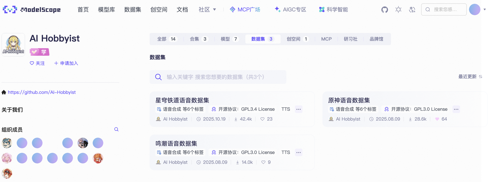
  </figure>
</div>

## 简介

<div style="display:flex;justify-content:center;">
  <figure style="text-align:center;margin:0;">
    
  </figure>
</div>

一直以来我们的教程基本都是自然语言领域的训练，多模态领域也基本就是图像相关，很少研究音频模型，本次教程我们就研究研究如何来训练一波音频模型。

模型我们选择通义实验室发布的CosyVoice2模型来微调原神中的派蒙语音，我们会非常详细地按照步骤教会大家如何训练CosyVoice。并且作者也会写出自己对于CosyVoice原理的理解，希望能帮到各位读者。

> 特此声明：本次教程仅作为AI模型训练，数据集均来自开源数据集。

派蒙是《原神》的标志性角色，也是旅行者在提瓦特大陆的伙伴与向导。她有着白色齐肩发与蓝色眼睛，身披带星空纹理的小披风，以漂浮姿态伴旅行者左右。她是被旅行者从水中钓起后结伴同行的。

<div style="display:flex;justify-content:center;">
  <figure style="text-align:center;margin:0;">
    
  </figure>
</div>

派蒙活泼贪吃，还总被旅行者调侃为 “应急食品”。剧情里旅行者大多沉默，常由她代为沟通推进对话，同时她会指引方向、提供任务线索和世界背景，帮旅行者熟悉提瓦特。

**👏下面我们就来听听派蒙的声音，另外各位读者可以试听下训练前后的效果。下面两个表分别是游戏内派蒙真实语音，然后是用CosyVoice2的原始模型和用派蒙语音微调之后的模型生成的音频的效果对比表（CosyVoice3是后来加入的训练前零样本语音克隆结果，没做训练）。**

<h3 style="padding: 12px 16px; margin: 0; text-align: center; color: #050505ff; border-bottom: 1px solid #787878ff; width: 100%; font-size: 22px;">游戏内派蒙语音</h3>
<table style="width: 100%; border-collapse: collapse;">
  <thead>
    <tr>
      <th style="padding: 12px 15px; text-align: center; border: 1px solid #e0e0e0; background: #ecececff; font-weight: 600; min-width: 200px; font-size: 16px;color: #050505ff">游戏内文本</th>
      <th style="padding: 12px 15px; text-align: center; border: 1px solid #e0e0e0; background: #ecececff; font-weight: 600; min-width: 400px; font-size: 16px; color: #050505ff">音频效果演示</th>
    </tr>
  </thead>
  <tbody>
    <tr>
      <td style="padding: 12px 15px; text-align: center; border: 1px solid #e0e0e0; background: #fff; font-size: 14px;"><strong>文本内容</strong>：等等，算起来…今天是不是就是连续打工的第三天了？现在正是午饭时间！</td>
      <td style="padding: 12px 15px;  border: 1px solid #e0e0e0; word-wrap: break-word; word-break: break-word; background: #fff;">
        <audio controls style="width: 100%; max-width: 400px; margin-bottom: 8px;">
          <source src="https://github.com/828Tina/cosyvoice-paimon-sft/raw/main/examples/audios/examples/gamevoice/1_7265.wav" type="audio/wav">
        </audio><br>
      </td>
    </tr>
    <tr>
      <td style="padding: 12px 15px; text-align: center; border: 1px solid #e0e0e0; background: #ecececff; font-size: 14px;"><strong>文本内容</strong>：累死了，除了打工就是打工，我的身体已经彻底透支了啊…</td>
      <td style="padding: 12px 15px; border: 1px solid #e0e0e0; word-wrap: break-word; word-break: break-word; background: #ecececff;">
        <audio controls style="width: 100%; max-width: 400px; margin-bottom: 8px;">
          <source src="https://github.com/828Tina/cosyvoice-paimon-sft/raw/main/examples/audios/examples/gamevoice/1_7264.wav" type="audio/wav">
        </audio> <br>
      </td>
    </tr>
    <tr>
      <td style="padding: 12px 15px; text-align: center; border: 1px solid #e0e0e0; background: #fff; font-size: 14px;"><strong>文本内容</strong>：那种地方不太可能会有人吧？</td>
      <td style="padding: 12px 15px; border: 1px solid #e0e0e0; word-wrap: break-word; word-break: break-word; background: #fff;">
        <audio controls style="width: 100%; max-width: 400px; margin-bottom: 8px;">
          <source src="https://github.com/828Tina/cosyvoice-paimon-sft/raw/main/examples/audios/examples/gamevoice/1_6834.wav" type="audio/wav">
        </audio> <br>
      </td>
    </tr>
    <tr>
      <td style="padding: 12px 15px; text-align: center; border: 1px solid #e0e0e0; background: #ecececff; font-size: 14px;"><strong>文本内容</strong>：似乎都是些常见的魔术道具，没有我们要找的线索…我们再往深处看看吧！</td>
      <td style="padding: 12px 15px; border: 1px solid #e0e0e0; word-wrap: break-word; word-break: break-word; background: #ecececff;">
        <audio controls style="width: 100%; max-width: 400px; margin-bottom: 8px;">
          <source src="https://github.com/828Tina/cosyvoice-paimon-sft/raw/main/examples/audios/examples/gamevoice/1_10002.wav" type="audio/wav">
        </audio> <br>
      </td>
    </tr>
  </tbody>
</table>

<div style="min-width: 600px;">
  <h3 style="padding: 12px 16px; margin: 0; text-align: center; color: #050505ff; border-bottom: 1px solid #787878ff; width: 100%; font-size: 22px;">音频效果对照表（全是派蒙）</h3>
  <div style="overflow-x: auto; width: 100%;">
    <table style="width: 100%; border-collapse: collapse; min-width: 1200px;">
      <thead>
        <tr style="background: #f5f5f5;">
          <th style="padding: 8px 12px; text-align: left; border: 1px solid #e0e0e0; text-align: center;color: #050505ff; font-size: 16px;background-color: #ecececff">Text</th>
          <th style="padding: 8px 12px; text-align: left; border: 1px solid #e0e0e0; text-align: center;color: #050505ff; font-size: 16px;background-color: #ecececff">CosyVoice2 After SFT</th>
          <th style="padding: 8px 12px; text-align: left; border: 1px solid #e0e0e0; text-align: center;color: #050505ff; font-size: 16px;background-color: #ecececff">CosyVoice2 Before SFT</th>
          <th style="padding: 8px 12px; text-align: left; border: 1px solid #e0e0e0; text-align: center;color: #050505ff; font-size: 16px;background-color: #ecececff">CosyVoice3</th>
        </tr>
      </thead>
      <tbody>
        <tr>
          <td style="padding: 8px 12px; border: 1px solid #e0e0e0;word-wrap: break-word; word-break: break-all; min-width: 250px;"><strong>游戏内文本：</strong>欸！蒙德城的修女还能负责抓捕可疑人士的吗？！</td>
          <td style="padding: 8px 12px; border: 1px solid #e0e0e0;"><audio controls style="width: 280px;"> <source src="https://github.com/828Tina/cosyvoice-paimon-sft/raw/main/examples/audios/examples/cosyvoice2sft/paimon_sft_inference_0.wav" type="audio/wav">  </audio></td>
          <td style="padding: 8px 12px; border: 1px solid #e0e0e0; "><audio controls style="width: 280px;"> <source src="https://github.com/828Tina/cosyvoice-paimon-sft/raw/main/examples/audios/examples/cosyvoice2/zero_shot_0.wav" type="audio/wav">  </audio></td>
          <td style="padding: 8px 12px; border: 1px solid #e0e0e0;"><audio controls style="width: 280px;"> <source src="https://github.com/828Tina/cosyvoice-paimon-sft/raw/main/examples/audios/examples/cosyvoice3/zero_shot_0.wav" type="audio/wav">  </audio></td>
        </tr>
        <tr>
          <td style="padding: 8px 12px; border: 1px solid #e0e0e0;word-wrap: break-word; word-break: break-all; min-width: 250px; background-color: #ecececff"><strong>现实文本：</strong>现代科技让世界变得更加紧密相连。</td>
          <td style="padding: 8px 12px; border: 1px solid #e0e0e0; background-color: #ecececff"><audio controls style="width: 280px;"> <source src="https://github.com/828Tina/cosyvoice-paimon-sft/raw/main/examples/audios/examples/cosyvoice2sft/paimon_sft_inference_1.wav" type="audio/wav">  </audio></td>
          <td style="padding: 8px 12px; border: 1px solid #e0e0e0; background-color: #ecececff"><audio controls style="width: 280px;"> <source src="https://github.com/828Tina/cosyvoice-paimon-sft/raw/main/examples/audios/examples/cosyvoice2/zero_shot_1.wav" type="audio/wav">  </audio></td>
          <td style="padding: 8px 12px; border: 1px solid #e0e0e0; background-color: #ecececff"><audio controls style="width: 280px;"> <source src="https://github.com/828Tina/cosyvoice-paimon-sft/raw/main/examples/audios/examples/cosyvoice3/zero_shot_1.wav" type="audio/wav">  </audio></td>
        </tr>
        <tr>
          <td style="padding: 8px 12px; border: 1px solid #e0e0e0;word-wrap: break-word; word-break: break-all; min-width: 250px;"><strong>情绪化文本：</strong>啊啊啊！真是让人生气！他怎么可以这样说！我明明不是那样的人！</td>
          <td style="padding: 8px 12px; border: 1px solid #e0e0e0;"><audio controls style="width: 280px;"> <source src="https://github.com/828Tina/cosyvoice-paimon-sft/raw/main/examples/audios/examples/cosyvoice2sft/paimon_sft_inference_2.wav" type="audio/wav">  </audio></td>
          <td style="padding: 8px 12px; border: 1px solid #e0e0e0;"><audio controls style="width: 280px;"> <source src="https://github.com/828Tina/cosyvoice-paimon-sft/raw/main/examples/audios/examples/cosyvoice2/zero_shot_2.wav" type="audio/wav">  </audio></td>
          <td style="padding: 8px 12px; border: 1px solid #e0e0e0;"><audio controls style="width: 280px;"> <source src="https://github.com/828Tina/cosyvoice-paimon-sft/raw/main/examples/audios/examples/cosyvoice3/zero_shot_2.wav" type="audio/wav">  </audio></td>
        </tr>
        <tr>
          <td style="padding: 8px 12px; border: 1px solid #e0e0e0;word-wrap: break-word; word-break: break-all; min-width: 250px;background-color: #ecececff"><strong>方言文本：</strong>用四川话说：走哦兄弟，楼下新开的火锅店巴适得板，味道绝了，我们整起，保证吃得你肚皮圆滚滚！</td>
          <td style="padding: 8px 12px; border: 1px solid #e0e0e0;background-color: #ecececff"><audio controls style="width: 280px;"> <source src="https://github.com/828Tina/cosyvoice-paimon-sft/raw/main/examples/audios/examples/cosyvoice2sft/instruction_zero_shot.wav" type="audio/wav">  </audio></td>
          <td style="padding: 8px 12px; border: 1px solid #e0e0e0;background-color: #ecececff"><audio controls style="width: 280px;"> <source src="https://github.com/828Tina/cosyvoice-paimon-sft/raw/main/examples/audios/examples/cosyvoice2/instruction_zero_shot.wav" type="audio/wav">  </audio></td>
          <td style="padding: 8px 12px; border: 1px solid #e0e0e0;background-color: #ecececff"><audio controls style="width: 280px;"> <source src="https://github.com/828Tina/cosyvoice-paimon-sft/raw/main/examples/audios/examples/cosyvoice3/cosyvoice3-instruct.wav" type="audio/wav">  </audio></td>
        </tr>
        <tr>
          <td style="padding: 8px 12px; border: 1px solid #e0e0e0;word-wrap: break-word; word-break: break-all; min-width: 250px;"><strong>跨语言文本：</strong>Has the author of my issue seen it?</td>
          <td style="padding: 8px 12px; border: 1px solid #e0e0e0;"><audio controls style="width: 280px;"> <source src="https://github.com/828Tina/cosyvoice-paimon-sft/raw/main/examples/audios/examples/cosyvoice2sft/cross_lingual_zero_shot_0.wav" type="audio/wav">  </audio></td>
          <td style="padding: 8px 12px; border: 1px solid #e0e0e0;"><audio controls style="width: 280px;"> <source src="https://github.com/828Tina/cosyvoice-paimon-sft/raw/main/examples/audios/examples/cosyvoice2/cross_lingual_zero_shot_0.wav" type="audio/wav">  </audio></td>
          <td style="padding: 8px 12px; border: 1px solid #e0e0e0;"><audio controls style="width: 280px;"> <source src="https://github.com/828Tina/cosyvoice-paimon-sft/raw/main/examples/audios/examples/cosyvoice3/fine_grained_control.wav" type="audio/wav">  </audio></td>
        </tr>
      </tbody>
    </table>
  </div>
</div>

> 因为作者在写这篇教程的时候，CosyVoice3才发布不久，因此作者便去尝试了下Cosyvoice3的零样本语音克隆，由于官方作者可能还没上传完代码，因此训练的任务等之后有机会会补上，这里仅做零样本推理语音克隆做参考。

## CosyVoice原理

目前CosyVoice论文已经出到了3，本次教程重点针对1和2来讲述，3的话简单说明一下，大体结构和前两个类似，因此本次教程重点是讲述CosyVoice的整体架构理论。

首先是第一篇👉[《CosyVoice: A Scalable Multilingual Zero-shot Text-to-speech Synthesizer based on Supervised Semantic Tokens》](https://funaudiollm.github.io/pdf/CosyVoice_v1.pdf)。

这篇讲述TTS原理的文章核心解决一个问题：**零样本语音克隆**

CosyVoice在多语言语音生成、零样本语音生成、跨语言语音克隆和指令跟随功能方面表现出色，在推理时仅需要提供少量参考，就可以模仿其音色和语气，生成新的文本对应的音频。

<div style="display:flex;justify-content:center;">
  <figure style="text-align:center;margin:0;">
    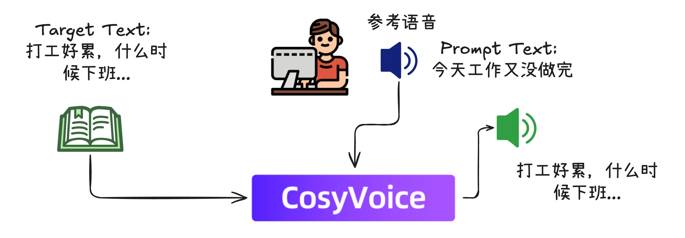
  </figure>
</div>

那么CosyVoice具体是怎么做到的？

在我看来其实主要解决了三个问题：

1. `首次引入监督式Speech tokens`：解决了传统无监督tokens缺乏语义关联性和文本对齐性的问题，提升零样本语音克隆的内容一致性和说话人相似度。
2. `x-vector分离语义与音色`：支持零样本上下文学习、跨语言语音克隆，通过指令微调实现说话人身份、情感、副语言特征（如笑声、重音）的精细控制。
3. `提出CosyVoice高效架构`：融合LLM与条件流匹配模型（OT-CFM），构建端到端TTS系统，无需额外音素器和强制对齐器。LLM负责文本到语义 tokens的生成，OT-CFM模型实现tokens到语音的合成，兼顾训练 / 推理效率与合成质量。

<div style="display:flex;justify-content:center;">
  <figure style="text-align:center;margin:0;">
    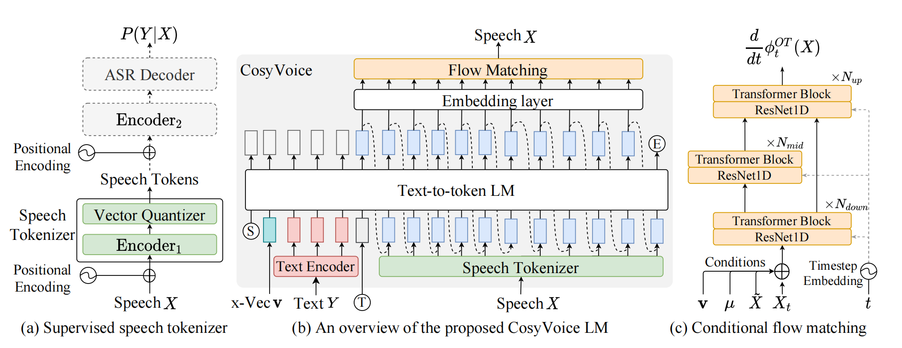
  </figure>
</div>

这张图是cosyVoice的架构原理图，从左到右我认为就是我上面说的三个问题的解决，（a）是Speech Tokenizer训练原理，用于生成包含语义信息的Speech Tokens；（b）是整体的训练和推理的原理，其中`x-vector`就是输入的参考音色，让生成的语音包含说话人(speaker)的语音特色；（c）则是Flow Matching模型将LLM生成的speech tokens转换成对应的梅尔频谱图，后续将梅尔频谱图通过声码器转换成实际语音。

**Speech Tokenizer**

首先我们来看Speech Tokenizer部分，这部分是在ASR模型编码器中插入向量量化层VQ，将连续的语音信号转换成离散的包含语义信息的tokens。

<div style="display:flex;justify-content:center;">
  <figure style="text-align:center;margin:0;">
    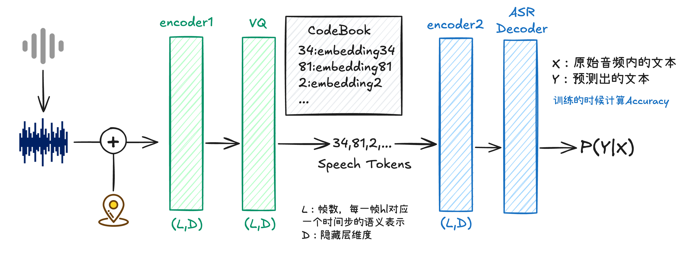
  </figure>
</div>

输入的SpeechX是已经将音频转换成梅尔频谱图，比如帧数有L，对应的梅尔频谱带长度为$D_{mel}$，经过位置编码和Encoder1处理后，可获得具有上下文感知特征的表示H：

$$H=Encoder_1(PosEnc(X))$$

该过程赋予每一帧$h_l$语义表征，理论上H的维度应该是$(L,D_{hidden})$，但是为了计算方便并提升特征抽象层的语义信息，适应后续自回归生成长度等，或许会在其中加入一些卷积层，降低L的长度，不过为了表述方便，我们当作没有经过这些变化，输出维度就是$(L,D)$。

在经过VQ层之前，我们需要了解一些概念，论文中提到了CodeBook，模型在训练的时候就是通过每一帧$h_l$的语义表征和CodeBook中的特征信息做最短欧几里得距离计算并得到CodeBook中对应特征信息代表的索引作为token，然后CodeBook中的向量通过指数移动平均（EMA）来更新。那么CodeBook是什么呢？

这里我认为类似于代表语音tokens的字典，每个字典中的序号背后可能都是一个向量表示，和自然语言处理的vocab我认为没什么区别，无非这个是表示语音的。

我们令CodeBook=C，其中$C=\{c_1,c_2,...,c_{4096}\}$，假设字典有4096这么多的信息，然后VQ层来求的最短的欧几里得距离：

$$\mu_l=VQ(h_l,C)=arg \min_{c_n \in C}\left \| h_l-c_n \right \|_2 $$

其中$\mu_l$为CodeBook中的编号，就是$n_i$。

CodeBook中的向量训练前初始化，然后经过上述的计算，通过EMA实现向量更新：

$$c_{\mu_l}:=\alpha c_{\mu _l}+(1-\alpha)h_l$$

我们最终得到的Speech Tokens其实就是序号，这些序号对应CodeBook中的向量表示，我们可以表示为：

$$Speech Tokens=\{\mu_1,\mu_2,...,\mu_L\}$$

$$\bar{H}=\{c_{\mu_1},c_{\mu_2},...,c_{\mu_L}\} $$

这里需要注意，我们在推理的时候，到Speech Tokens这一步就停止了，但是在预训练中训练Tokenizer的阶段，我们需要$\bar{H}$做后续的操作，也就是ASR的解码阶段，通过生成预测出的文本和原始文本对比，这一步做监督训练，让训练出的CodeBook中的向量能够包含语义信息。我们详细解释：

首先$\bar{H}$经过Encoder2，因为我们最终要预测文本，因此它需要将离散tokens序列映射到更易于文本对齐的表示空间，便于CTC或自回归解码，因此需要Encoder2阶段通过自注意力机制重新建立帧之间的长程依赖关系，修复因量化损失的信息，进一步编码和强化已经由Encoder1提取、并由VQ离散化后的语义表示，使其更适合下游的ASR解码任务。用公式表示：

$$\tilde{H}=Encoder_2(PosEnc(\bar{H}))$$

经过Encoder2处理后，接续一个基于Transformer架构的自动语音识别解码器，用于预测文本标签的后验概率。

$$P(Y|X)=ASRDecoder(\tilde{H},Y^{Z-1})$$

在完成上述ASR监督训练后，我们便得到了一个能够将语音高效编码为具有明确语义信息的离散token序列的Speech Tokenizer。这一Tokenizer在推理时仅需运行至Speech Tokens生成步骤，即可输出紧凑且富含内容的语义表示序列。

这些Speech Tokens构成了CosyVoice后续语音合成的核心中间表示。在合成阶段，LLM将以文本编码和说话人嵌入为条件，自回归地预测出对应的Speech Token序列。

**CosyVoice LM**

对于Text-to-token LM部分，本质是根据prompt自回归生成后续的speech tokens，因此对于该阶段，最重要的其实就是prompt的构建，和怎么生成tokens的，其实理解起来也很简单，论文中已经给出：

<div style="display:flex;justify-content:center;">
  <figure style="text-align:center;margin:0;">
    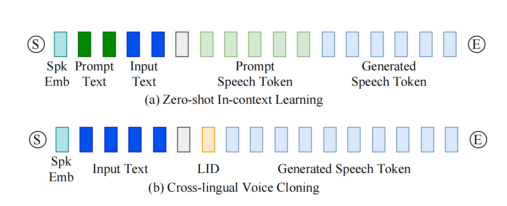
  </figure>
</div>

如果要做zero-shot推理，那么提示词部分是参考语音的txt和你要生成音频的txt，生成部分中会直接先给出参考语音，然后模型会生成后面的tokens，而如果是不需要参考语音的任务，比如微调后的模型输出、跨语言输出等任务，那么输入的prompt仅为你要生成音频的txt，模型会根据你给出的prompt生成对应的speech tokens。

下面我们看下具体生成原理：

对于LLM而言，序列构建是最关键的事项，其构建方式如下：

$$[S , v, \{\bar y_u\}_{u \in [1:U]}, T, \{\mu_l\}_{l\in [1:L]}]$$

v代表说话人音色代表的embedding，$\{\bar y_u\}_{u \in [1:U]}$表示你希望输出的音频对应的文本转换成的特征向量$\bar Y$，原始的待合成文本为$Y$，那么

$$\bar Y=TextEncoder(BPE(Y))=\{\bar y_u\}_{u \in [1:U]}$$

原始待合成文本$Y$通过Byte Pair Encoding (BPE)分词器转换为子词token，再通过文本编码器TextEncoder映射为连续向量。这里本质是为了提供待合成文本的语义内容，作为LLM生成语音token的条件输入。

然后T表示Turn of Speech Token，是语音转折符，标记文本编码结束和speech token开始生成的位置。T是为了明确分隔文本与语音两部分，引导 LLM 在接收到此 token 后开始生成speech token。

$\{\mu_l\}_{l\in [1:L]}$代表语音语义token序列，长度是L，无论是训练还是推理，这部分都是需要模型去预测并生成的部分，是由$S^3 tokenizer$从训练语音中提取得到（训练时）或由 LLM 预测生成（推理时）。

需要注意的是，对于零样本推理：

- 输入 = 参考语音信息（文本 + tokens + 说话人嵌入） + 目标文本
- 输出 = 目标文本对应的语音 tokens（模型自回归生成）

这种方式使模型能够从少量参考示例中学习音色与风格，并推广到新的文本内容，实现**零样本语音克隆**。

**Flow Matching**

经过LLM的文本到语音tokens生成，我们得到了包含语义信息的离散token序列。然而，要合成最终可听的语音波形，还需要将这些tokens转换回连续的声学特征表示——梅尔频谱图。CosyVoice采用了最优传输条件流匹配（Optimal-Transport Conditional Flow Matching，OT-CFM）模型来完成这一关键转换。

Flow Matching是一种基于连续时间归一化流的生成模型，相比传统的扩散概率模型，它在训练和推理效率上具有显著优势，同时能生成高质量样本。在CosyVoice中，OT-CFM的目标是学习从简单先验分布（如高斯噪声）到真实梅尔频谱分布的概率密度路径，并以生成的语音tokens、说话人嵌入等作为条件。

具体而言，给定一个由高斯噪声初始化的梅尔频谱样本$X_0 \sim \mathcal{N}(0,I)$和目标梅尔频谱$X_1$，OT-CFM通过定义一条直线路径，也就是最优传输路径连接两者：

$$\phi_t^{OT}(X_0,X_1)=(1-(1-\sigma)t)X_0+tX_1$$

其中时间步$t\in[0,1]$，$\sigma$是一个常数用于稳定训练，相应的向量场为：

$$\omega_t(\phi_t^{OT}|X_1)=X_1-(1-\sigma)X_0$$

模型通过神经网络$NN_{\theta}$学习匹配这个向量场，条件信息包括说话人嵌入v、speech tokens{\mu_l}以及部分mask的梅尔频谱$\tilde{X}_1$。

为了进一步提升生成质量，CosyVoice引入了无分类引导CFG技术，在训练时以一定概率丢弃条件信息，十模型同时学习条件与无条件生成；在推理阶段通过引导强度$\beta$调整条件与无条件预测的加权来增强条件控制效果：

$$\tilde{v}_t=(1+\beta)\cdot v_t(条件)-\beta\cdot v_t(无条件)$$

在推理阶段，OT-CFM从高斯噪声$X_0$出发，沿学习到的概率流逐步解算ODE，最终生成符合目标音色和语义内容的梅尔频谱$X_1$。该频谱随后由HiFi-GAN声码器转换成高质量波形，完成从文本到语音的端到端合成。

**CosyVoice2**

论文地址👉[CosyVoice 2: Scalable Streaming Speech Synthesis with Large Language Models](https://arxiv.org/abs/2412.10117)，CosyVoice2是在CosyVoice的基础上做出的优化，整体结构并没有改变，我这里总结以下几点：

1. `CodeBook的利用率提升至100%`：优化Speech Tokenizer中VQ层，替换成有限标量量化FSQ（finite scalar quantization）
2. `简化LM结构`：复用Qwen2.5等预训练LLM，移除冗余模块，让模型更轻量高效。
3. `支持流式/非流式统一合成`：Cosyvoice2的核心idea是实现流式合成，即边输入文本边合成语音。
4. `设计块感知flow match模型`：块感知flow match模型设计了4种mask策略，可根据需求选择，不同的mask策略可以平衡延迟与生成质量。

<div style="display:flex;justify-content:center;">
  <figure style="text-align:center;margin:0;">
    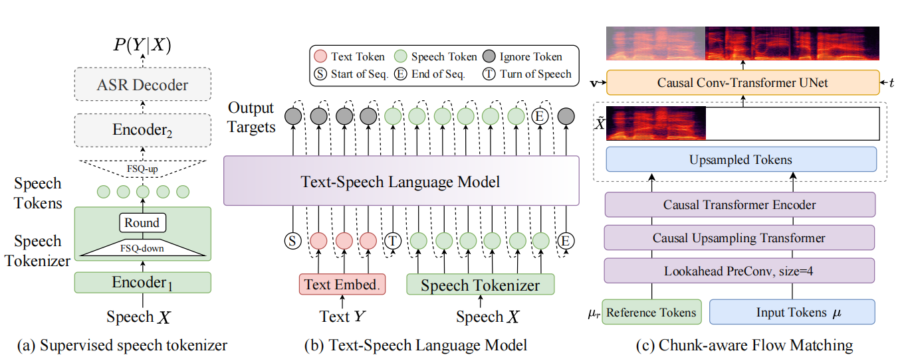
  </figure>
</div>

**CodeBook的利用率提升至100%**

对于Supervised speech tokenizer，在FSQ模块中，中间表示H首先被投影到一个D维低秩空间，每个维度的值通过有界舍入操作被量化到[−K, K]区间。

量化后的低维向量$\bar{h_i}$按照$(2K+1)$进制计算为整数索引$\mu_i$：

$$\mu_i = \sum_{j=0}^{D-1}\bar{h}_{i,j}\cdot (2K+1)^j$$

随后，量化后的低秩表示$\bar{H}$被重新投影回原始维度$\tilde{H}$，以供后续模块使用。

在之前的向量量化（VQ）中，模型用一个包含几千个“语音单词”的码本去匹配每一帧语音，就像从一本厚厚的词典里找一个最接近的词。但问题是，这本词典里很多词几乎从没用过，真正被频繁使用的只有少数几个。

而有限标量量化（FSQ）换了一种思路：它不直接找整个词，而是把语音特征拆成几个维度（比如8个），每个维度只用一个很小的整数（比如-1,0,1）来表示。通过组合这些整数，就能唯一确定一个语音token。这种方式就像用“坐标”来定位，而不是去“查词典”。

由于每个维度都必须被使用，而且所有可能的整数组合都会出现，因此码本的每一个“位置”都会被充分利用，利用率自然达到100%。这不仅让语音表示更紧凑、信息更完整，也让后续的语音合成更准确、更自然——因为每个token都承载了实实在在的语义信息，没有“闲置”或“浪费”的编码。

**简化LM结构**

<div style="display:flex;justify-content:center;">
  <figure style="text-align:center;margin:0;">
    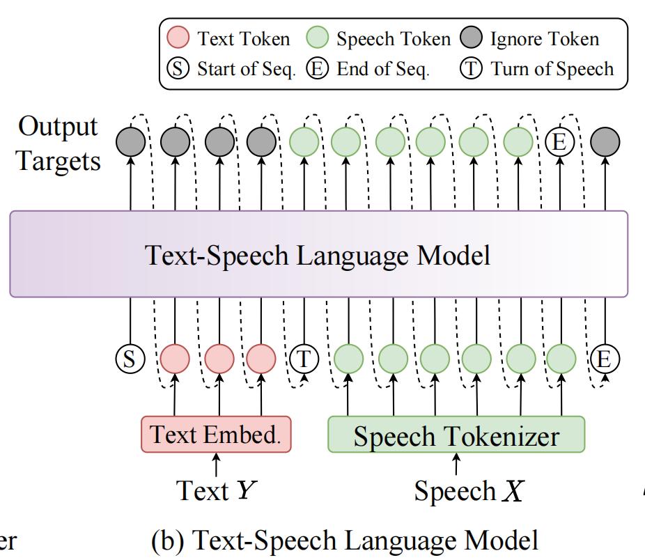
  </figure>
</div>

在CosyVoice 2中，语言模型（LM）部分进行了大幅简化，主要体现在以下两点：

1. 移除了文本编码器和说话人嵌入：原版CosyVoice使用独立的文本编码器将文本映射到语义空间，并引入说话人嵌入向量控制音色。新版直接复用预训练大语言模型（Qwen2.5），利用其强大的语义理解能力自然对齐文本与语音token，无需额外编码模块。说话人信息改由后续Flow Matching模型单独处理，避免信息混淆。

2. 统一流式与非流式架构：通过设计混合序列（文本token与语音token按比例交错），同一LM即可支持流式生成（边输入边合成）和非流式生成（整句合成）。这消除了为不同模式训练独立模型的需求，大幅简化部署结构。

我们知道在第一代CosyVoice中，text-to-speech的输入是有说话人嵌入的，也就是会引入说话人的音色等信息，但是如果利用流式生成，就会导致可能前一个N块中最后生成的第M个语音token表示高音，然后后续的就会连续高音，而不是自然发音，或者也会出现边界的突变现象。
那么如何解决这个问题呢？

***答案是解耦***

既然由于包含了音色导致生成的语音tokens会有不连贯的现象，那么我干脆在text-to-tokens就不做音色处理，只做文本内容和语义信息传递，音色交给flow模型控制。

那么这样做就可以保证，在生成speech tokens阶段不会受到音色干扰导致语音的不连贯，

而且我们可以将语音tokens生成频率调整，论文中25Hz生成，每块语音tokens15个大概为0.6秒，足够小的时间即使有不连贯的，基本听起来没有太大差别。

简言之，CosyVoice 2通过去除冗余模块和统一生成模式，实现了更轻量、更灵活且性能更强的语音合成架构。

**支持流式/非流式统一合成**

这个是CosyVoice2中最核心的改动，相比于Cosyvoice1中需要输入完整的文本和参考语音，等生成完speech tokens才能去做后续的tokens转梅尔频谱然后生成音频，整个过程需要花费很长时间，

于是CosyVoice2针对1中的统一生成，采用流式和非流式综合的方式，使得模型在推理时，如果选择流式生成，可以不用等完整的生成tokens，只要有一步分tokens就能够转成语音，然后一步一步完成音频结果的生成，以后做交互提供了便利。

具体我们看下如何生成：

<div style="display:flex;justify-content:center;">
  <figure style="text-align:center;margin:0;">
    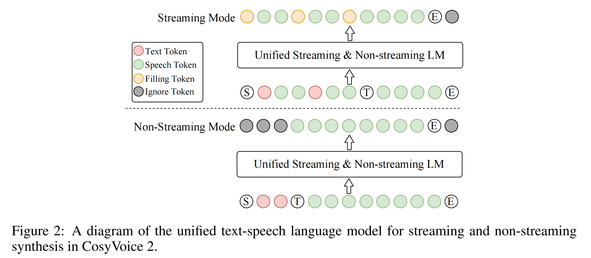
  </figure>
</div>

在流式模式下，论文中按照预设的N:M比例混合文本标记与语音标记，即每N个文本标记后跟随M个语音标记。当下一标记为文本标记时，模型需预测填充标记（而非文本标记），这表示在推理阶段应拼接后续N个文本标记。当文本标记耗尽后，"语音转换"标记T与剩余语音标记将按序拼接，最终形成流式模式下的混合文本-语音标记序列。

我们举个例子：

```
参数: N=5, M=15
文本: "今天天气真好我们出去玩吧" (10个token)
语音: 需要生成100个token

推理流程：
1. 初始状态: remaining_text=10, current_position=0
2. 输入前5个token: [今][天][天][气][真]
3. 模型生成15个语音token
4. 模型预测下一个token → 填充标记 ✓ (因为remaining_text=5>0)
5. 系统添加下5个token: [好][我][们][出][去]
   remaining_text=0, current_position=10
6. 模型生成15个语音token  
7. 模型预测下一个token → <TURN> ✓ (因为remaining_text=0)
8. 模型生成剩余85个语音token直到<EOS>
```

对于输入的文本，按照N、N、N、……、<=N、无；的长度分割，对应N应该生成的语音tokens为M、M、M、……M、剩余语音。

每个N文本让模型生成M个语音后，如果当前表示的文本长度还没有超过全部的文本长度，那么就生成一个“填充标记”提示模型还需要在生成语音tokens
就这样到最后一个不足N个的文本时，生成对应M个语音tokens以及剩余的所有的tokens，然后由于当前文本长度已经超过完整文本长度了，因此最后不用再生成填充标记，而是添加T标记，提示模型要自主生成后续剩余语音tokens.

ICL和SFT的不同在于SFT不需要参考语音和参考文本，但是整体的streaming生成逻辑是一样的。


**设计块感知flow match模型**

<div style="display:flex;justify-content:center;">
  <figure style="text-align:center;margin:0;">
    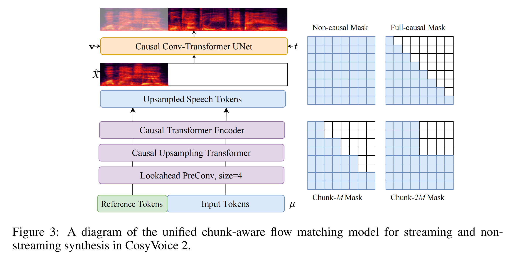
  </figure>
</div>

传统 Flow Matching 模型在生成梅尔频谱时通常需要完整的语音 token 序列作为条件，这导致其无法支持流式合成——必须等待所有语音 token 生成完毕才能开始声学特征的解码。为了突破这一限制，CosyVoice 2 提出了块感知因果流匹配模型（Chunk-aware Causal Flow Matching），其核心思想是将流匹配过程分块化与因果化，使其能够基于局部语音 token 片段逐步生成对应的梅尔频谱块。

实现这一能力的关键在于对模型中注意力机制的掩码（Mask）进行精心设计。CosyVoice 2 共定义了四种掩码策略，每种策略对应不同的上下文感知范围，从而在生成质量与推理延迟之间提供灵活的权衡：

1. 非因果掩码（Non-causal Mask）：允许模型在生成当前帧时，关注输入序列的所有过去和未来帧。这种掩码用于非流式（离线）模式，能够获取最完整的全局信息，从而生成质量最高、韵律最自然的语音，但无法满足低延迟要求。

2. 全因果掩码（Full-causal Mask）：生成当前帧时，仅允许关注该帧之前的所有帧（过去上下文），严格禁止看到任何未来信息。这种掩码提供了最低的生成延迟，适用于对实时性要求极高的场景（如实时语音对话），但由于上下文信息最受限，生成质量通常有一定牺牲。

3. 块-M掩码（Chunk-M Mask）：这是一种折衷方案。模型在生成当前帧时，除了可以访问所有过去帧，还能额外看到未来 M 帧 的信息。这模拟了流式合成中“适度向前看”的能力。该掩码特别适用于流式生成的首个语音块，能在可接受的额外延迟内，显著提升开头部分语音的自然度和稳定性。

4. 块-2M掩码（Chunk-2M Mask）：在块-M掩码的基础上，将可感知的未来上下文扩展至 2M 帧。这进一步逼近了离线模式的生成质量，通常用于流式合成中后续的语音块生成。由于在生成后续块时，前面的音频已经输出，允许稍长的“向前看”延迟对整体体验影响较小，却能换来整体合成质量的显著提升。

在训练阶段，模型会随机抽样使用这四种掩码之一，使得单一模型同时学会了如何处理不同范围的上下文。这种设计带来两大优势：一是部署简化，一个模型即可应对多种延迟要求的场景；二是隐式自蒸馏，在训练中，能够看到更多上下文的掩码（如块-2M）其学习到的特征和生成模式，会间接地帮助看到较少上下文的掩码（如全因果）提升表现，实现了知识在模型内部的迁移。

**CosyVoice3**

论文地址👉[CosyVoice 3: Towards In-the-wild Speech Generation via Scaling-up and Post-training](https://arxiv.org/abs/2505.17589)

由于CosyVoice3才刚出不久，作者还没来得及做训练等，因此这里参考[CosyVoice三部曲深度解析【论文精读】](https://www.bilibili.com/opus/1136165016148377601)，仅简单讲述下优化的点：

1. 提出多任务监督语音tokenizer，融合多模态信息：基于大尺度语音理解模型 MinMo，引入有监督多任务学习（ASR、语言识别、情感识别、音频事件检测、说话人分析）构建语音 tokenizer。相较于 CosyVoice 2 使用的 ASR 模型，MinMo 在 140 万小时语音数据上预训练，具备更强的跨任务泛化能力；tokenizer 输出的离散 token 不仅包含语义信息，还融合了情感、口音、语种等多维副语言特征，显著提升合成语音的韵律自然度与风格可控性。

2. 引入可微分奖励优化DiffRO，提升生成鲁棒性：通过类似 ASR 的 Token2Text 模型生成后验概率作为奖励信号，结合 Gumbel-Softmax 采样与 KL 散度约束，在提升内容一致性的同时保持生成稳定性；进一步支持多任务奖励建模（MTR），实现对情感、音频质量等多属性的联合优化。

3. 数据规模扩展至100万小时，覆盖9种语言和18种方言：训练数据从万小时级扩展至 100 万小时，涵盖 9 种主流语言与 18 种汉语方言/口音，覆盖电商、导航、教育、对话、朗诵等多种领域与文本格式。

4. 模型参数增至1.5B，增强复杂文本理解能力：更大容量的语言模型增强了对复杂文本、多音词与长尾表达的理解能力；DiT 架构简化了模型结构，去除冗余的文本编码与长度规整模块，通过插值解决帧率不匹配问题，提升训练效率与生成质量。

5. 支持发音修复和文本归一化，适配真实场景：支持混合输入单词与音素，通过替换单音字/词为拼音/音素构建辅助训练集，提升对多音词与罕见词的发音准确性。指令跟随数据扩展至 5,000 小时，覆盖 100+ 种风格（情感、语速、方言、角色扮演等），支持自然语言指令与细粒度标签控制。

6. 构建全新评估基准 CV3-Eval，推动野外场景语音生成评测：提出针对零样本语音合成的多语言、多场景评估基准，包含多语言语音克隆、跨语言克隆、情感克隆等客观任务，以及表达性语音克隆、语音续写、方言克隆等主观任务。

<div style="display:flex;justify-content:center;">
  <figure style="text-align:center;margin:0;">
    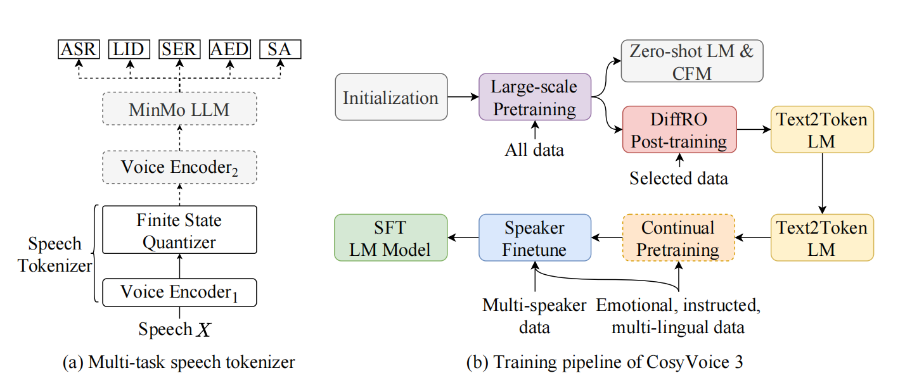
  </figure>
</div>


前两个模型难以处理方言混杂，网络热词和噪声环境。

cosyvoice3的核心idea是通过大规模数据和多任务学习，让TTS模型适应野外场景，如上图所示，多任务监督tokenizer在原有语义基础上，融合里情绪识别SER，语言识别LID等任务信息，让tokens不仅携带文字含义，还包括开心，四川方言等风格特征。

数据规模从10万小时扩展至100万小时，相当于让模型读遍全球书籍，见过更多罕见表达。

1.5B参数的LLM增强了语义理解能力，可处理多音词。

可微分奖励DiffRO是另一突破。通过ASR模型的识别结果作为反馈，自动修正发音错误。就像让模型自己听自己说的话并纠错，在噪声环境中也能保持清晰。

*Cosyvoice的演进呈现3个清晰方向：*

WER性能提升

1. 内容一致性提升，这得益于从监督tokens到多任务tokens的技术升级，让语音和文本的对齐越来越精准

2. 场景扩展：从仅支持非流式合成适合新闻播报，到cosyvoice2的流式，非流式统一支持实时对话，再到cosyvoice3的真实场景适配，支持方言，噪声环境。模型参数从0.5B到1.5B。VQ到FSQ再到增强FSQ，逐步释放语音细节的表达能力，这是音质提升的关键。

下面是三个模型的优化对比一览：

<div style="display:flex;justify-content:center;">
  <figure style="text-align:center;margin:0;">
    
  </figure>
</div>

## 零样本推理

关于零样本推理，既可以参考官方给出的[代码](https://github.com/FunAudioLLM/CosyVoice/blob/main/example.py)，也可以直接运行我给出的`inference.sh`，直接运行下面的代码，就可以直接生成零样本推理结果，以及如果你有微调后的模型，可以利用微调后的模型进行推理，生成音频。

```bash
bash inference.sh
```

这里说明下参数含义：

**零样本推理**

如果仅进行零样本推理，注意脚本中的进程设置为0:

```bash
stage=0
stop_stage=0
```

参数含义分别如下：

- `--tts_text`:你需要模型生成的文本内容对应的地址，需要注意的是内部有以下标签：

```json
{
  "paimon":{
      "zero-shot": [
      "卖唱的怎么又跑去喝酒了！",
    ],
    "cross-lingual": [
      "Hello, my name is Paimon. I am a character from the game Genshin Impact. I love to explore the world with my traveler friend."
    ],
    "instruction-zero-shot": {
      "instruction":"用广东话说这句话",
      "text":"我觉得璃月的火锅很好吃！"
    },
    "sft_inference":[
      "卖唱的怎么又跑去喝酒了！",
    ]
  }
}
```

`paimon`:你的说话人身份，这里按照名字来识别会比较方便

`zero-shot`:推理类型为零样本生成对应的文本

`cross-lingual`:推理类型为跨语言生成对应的文本

`instruction-zero-shot`:推理类型为方言生成对应的文本

`sft_inference`:推理类型为微调后的模型推理文本

- `--model_dir`:你的模型地址，这里用原始模型地址

- `--spk_id`:说话人身份，这里为`paimon`

- `--test_data_dir`:参考声线对应的数据地址

- `--example_id`:参考声线数据的编号，比如`1_4`中的4

- `--target_sr`:采样频率

- `--result_dir`:推理结果保存地址

- `--task_type`:推理类型

> 注意：CosyVoice支持的多语言类型仅为中文、英文、日文、韩文、中文方言（粤语、四川话、上海话、天津话、武汉话等）这些，CosyVoice3支持的更多些

**微调后推理**

如果是微调后模型推理，需要注意进程设置为1:

```
stage=1
stop_stage=1
```

参数和零样本推理基本一致，只有一个参数需要注意：

- `emb_path`:这个为说话人对应的embedding，我设置为对训练数据取平均后的embedding，也就是`./data/train/spk2embedding.pt`文件地址，如果你希望用单独的一个数据对应的embedding，可以替换`spk2embedding.pt`为`utt2embedding.pt`。

> 注意⚠️：在运行这个代码前，最好确保run.sh中的进程4已经运行，不然找不到对应模型地址。

## 完整代码

完整的代码其实用的是官方给的[example](https://github.com/FunAudioLLM/CosyVoice/tree/main/examples/libritts/cosyvoice2)，只要环境和配置设置正确，直接可以用，不过我对其进行了一点小小的改造🤏，具体的我们下面详细讲述。

### 1. 环境安装

- 克隆代码

```bash
git clone --recursive https://github.com/828Tina/cosyvoice-paimon-sft.git
cd cosyvoice-paimon-sft
git submodule update --init --recursive
```

- 安装环境

```bash
pip install -r requirements.txt -i https://mirrors.aliyun.com/pypi/simple/ --trusted-host=mirrors.aliyun.com
```

- 要求：
1. $5090个数 \ge 2$
2. `Pytorch` $\ge$ 2.7，CUDA适应自己的版本，我的是12.8

<div style="background:#e7f8ff;color:#000;padding:12px 16px;border-left:4px solid #20c0ff;">
本次教程我们使用5090来训练模型，由于cosyvoice这个模型也比较早了，当时的pytorch版本没有那么高，没有什么bug，但是5090安装的驱动CUDA适配的pytorch版本较高，就导致我实际在跑的时候报了很多bug，下面我会依次说明都出了哪些问题并如何解决。（我的代码应该是可以直接用的，但是如果报环境错误，可以根据下面给出的信息来查看是否是对应的bug）
</div>

---

**环境安装Bug汇总**

1. 缺少一个模型库`whisper`

在实际跑训练代码的时候，在数据集预处理阶段中，可能会报下面的错误：

```bash
AttributeError: module 'whisper' has no attribute 'log_mel_spectrogram'
```

这可能是`whisper`版本错了，但是安装的时候要注意，库的名字全称是`openai-whisper`，我们直接在[Releases](https://github.com/openai/whisper/releases)中找到最新的，运行下面的代码（`requirements.txt`我已经修改，所以可能不会报这个错误，但是如果在数据集预处理阶段有问题，可以来查看是否是这个库的问题）：

```bash
pip install openai-whisper==v20250625
```

2. `Pytorch`版本问题

我用的GPU是RTX 5090，如果按照cosyvoice官方给的`requirements.txt`直接安装环境，会有如下错误：

```bash
The current PyTorch install supports CUDA capabilities sm_50 sm_60 sm_70 sm_75 sm_80 sm_86 sm_90.
If you want to use the NVIDIA GeForce RTX 5090 GPU with PyTorch, please check the instructions at https://pytorch.org/get-started/locally/

  warnings.warn(
/home/lxy/miniconda3/envs/tts/lib/python3.10/site-packages/torch/cuda/__init__.py:235: UserWarning: 
NVIDIA GeForce RTX 5090 with CUDA capability sm_120 is not compatible with the current PyTorch installation.
The current PyTorch install supports CUDA capabilities sm_50 sm_60 sm_70 sm_75 sm_80 sm_86 sm_90.
If you want to use the NVIDIA GeForce RTX 5090 GPU with PyTorch, please check the instructions at https://pytorch.org/get-started/locally/
```

这个警告的核心问题是PyTorch 安装版本与 RTX 5090 显卡的 CUDA 算力不兼容：RTX 5090 的 CUDA 算力为 `sm_120`，而当前安装的 PyTorch 仅支持 `sm_50/sm_60/sm_70/sm_75/sm_80/sm_86/sm_90` 这些旧算力版本，无法适配该显卡的新算力规格。

这个问题其实主要集中于比较新的GPU中，如果想要解决，升级 PyTorch 到支持 `sm_120` 的版本（需匹配对应 CUDA Toolkit 和显卡驱动），或从源码编译 PyTorch 并指定 `sm_120` 算力，确保与 RTX 5090 的硬件规格适配。具体可以查看这个👉[CUDA GPU Compute Capability](https://developer.nvidia.com/cuda/gpus)

<div style="display:flex;justify-content:center;">
  <figure style="text-align:center;margin:0;">
    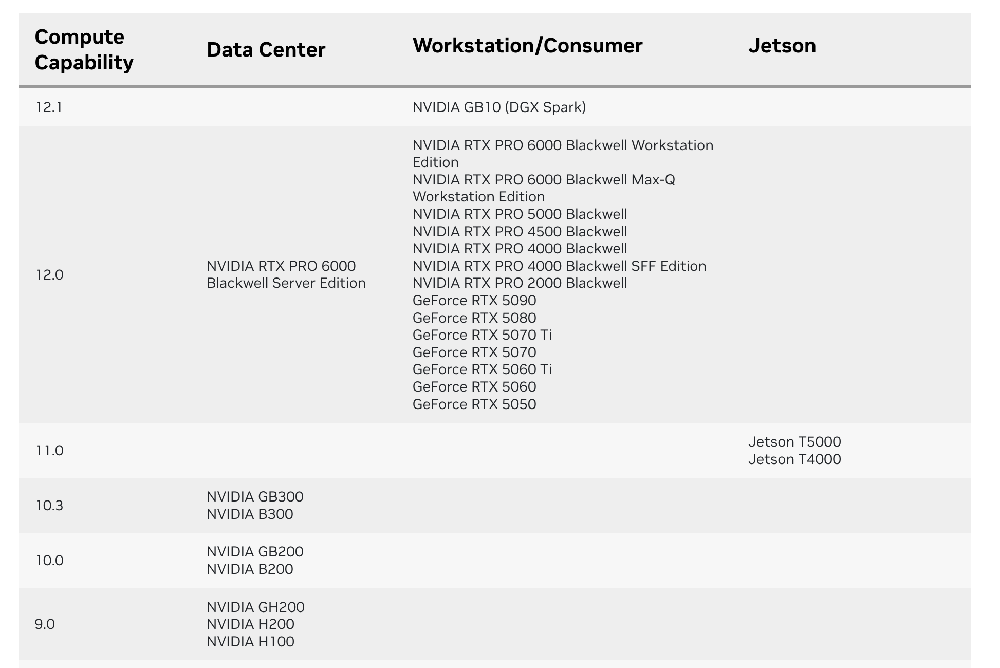
  </figure>
</div>

**由于我们的驱动CUDA安装版本为12.8，因此我们选择直接升级`Pytorch`版本到能够有匹配的算力版本，由于我没有找到具体的`Pytorch`算力支持表，因此我是直接试出来的，要求`Pytorch`版本为2.8--cuda128，对应的`torchvision`和`torchaudio`也选择匹配的版本就行。**

3. `torchaudio`安装不完整

上面`Pytorch`安装完后，可能会报下面的错误：

<div style="display:flex;justify-content:center;">
  <figure style="text-align:center;margin:0;">
    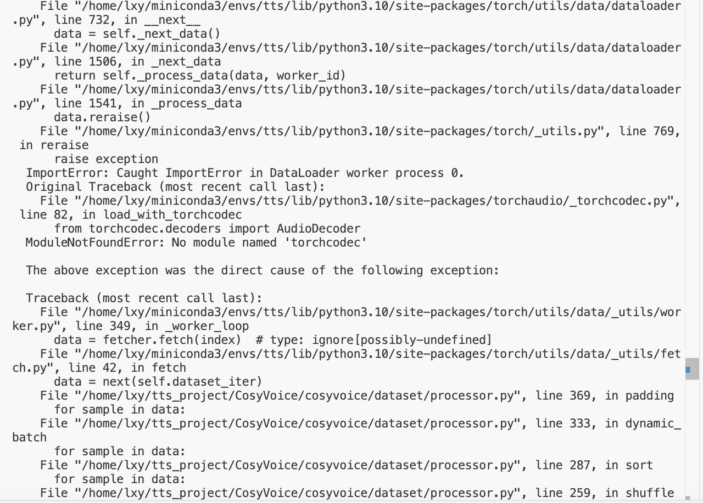
  </figure>
</div>

这是因为缺少`torchcodec`模块：在数据加载器（Dataloader）工作进程中，`torchaudio的_torchcodec.py`文件尝试导入`AudioDecoder`类，但系统找不到名为`torchcodec`的模块，触发了`ModuleNotFoundError`。

这个模块缺失导致数据加载流程中断，进而引发后续的迭代（如shuffle/sort/dynamic_batch等数据预处理步骤）无法正常执行。

问题根源是`torchaudio`安装不完整（`torchcodec`是其依赖组件），或当前环境中`torchaudio`版本与 `PyTorch` 不兼容，需重新安装匹配版本的`torchcodec`以补全依赖模块。

**我们的解决办法是直接安装对应的`torchcodec`**

```bash
pip install --pre torchcodec \
  --index-url https://download.pytorch.org/whl/nightly/cu128
```

如果遇到比如pytorch和torchcodec版本不匹配的问题，可以参考这个链接：[https://github.com/meta-pytorch/torchcodec?tab=readme-ov-file#installing-cpu-only-torchcodec](https://github.com/meta-pytorch/torchcodec?tab=readme-ov-file#installing-cpu-only-torchcodec)

4. 代码问题

其实严格来说，这个并不是代码问题，单纯是因为`CosyVoice`时间比较早，当时的`Pytorch`和现在相比有一点点不太一样...如果直接运行官方的`run.sh`会报下面的错误：

<div style="display:flex;justify-content:center;">
  <figure style="text-align:center;margin:0;">
    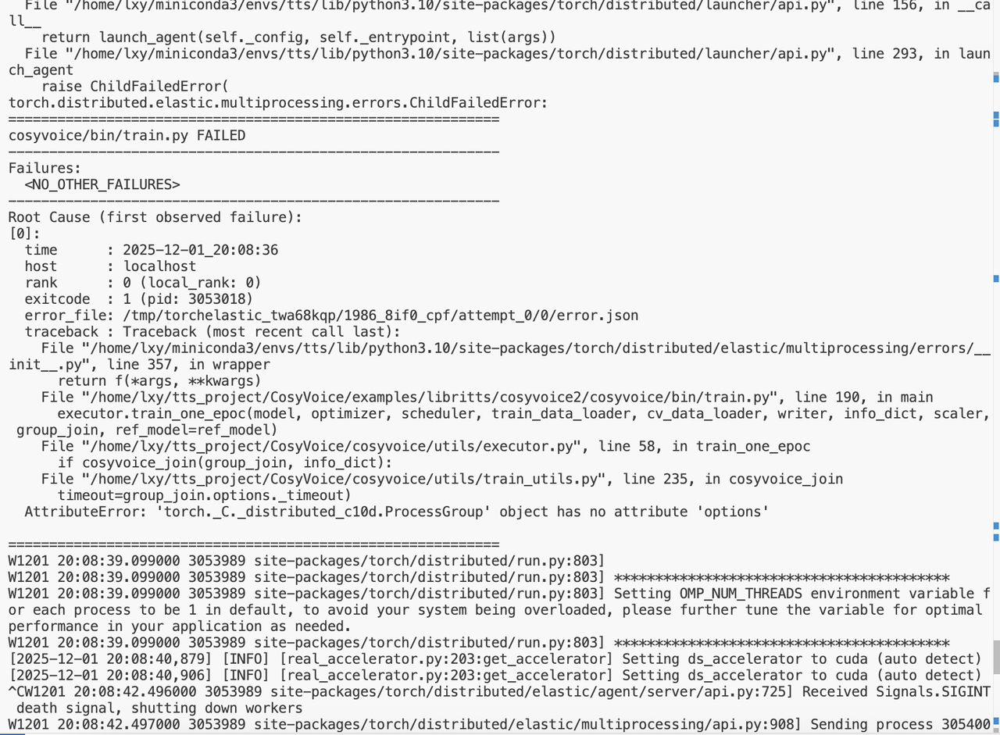
  </figure>
</div>

定位到指定地点：

```python
try:
    # dist.monitored_barrier(group=group_join,
    #                        timeout=group_join.options._timeout)
```

因为前面已经将`Pytorch`改成了高版本2.8，`options`已经被删掉了，在官方的文档中并没有看到这个参数👉[Pytorch Docs](https://docs.pytorch.org/docs/stable/distributed.html#torch.distributed.new_group)，那么这个问题我们只能从原理入手：

我们找到[monitored_barrier](https://docs.pytorch.org/docs/stable/distributed.html#torch.distributed.monitored_barrier)，原理如下：

torch.distributed.monitored_barrier 是一个 集体阻塞式同步原语，在分布式进程组内提供 `可配置超时 + 失败报告` 的能力。其核心语义为：

1. 全局屏障
   所有属于 group 的 ranks 必须调用该函数并到达同步点，否则整个集体操作永远不会完成。
2. 超时监测
   通过 timeout 参数设定最大阻塞时间；若在该时间内任意 rank 未能完成握手，则抛出 RuntimeError 并 立即中断所有参与者，防止因个别 rank 挂起导致的 分布式死锁。
3. 失败定位
   由 rank 0 担任协调者，负责收集各 rank 的握手消息；超时后会在 rank 0 侧生成详细的失败日志，指出未响应的 rank 列表，便于调试定位。
4. 使用约束
   - 只能在 NCCL / GLOO / MPI 等支持点对点通信的后端使用；
   - 非零 rank 在函数内部执行 send/recv 与 rank 0 握手；
   - rank 0 执行 all-reduce-like 的握手计数，因而函数返回前会 阻塞 host 线程；
   - 由于涉及 host-side 同步，性能开销大，仅推荐用于 调试、负载均衡检测、checkpoint 一致性校验 等场景。

综上，monitored_barrier 在保持 barrier 语义的同时，增加了 `超时控制 + 故障报告` 机制，是分布式训练中诊断`rank`间同步异常的重要工具。

🤔总之，这里本质就是一个超时检测，具体要设定一个时间，那么我直接设置一个足够多的固定时间即可：

```python
# we try to join all rank in both ddp and deepspeed mode, in case different rank has different lr
# 固定 30 秒，或从环境变量读
timeout = datetime.timedelta(seconds=30)   # ← 直接构造
try:
    # dist.monitored_barrier(group=group_join,
    #                        timeout=group_join.options._timeout)
    dist.monitored_barrier(group=group_join, timeout=timeout)
    return False
```

然后就可以解决问题了😄。

5. `No module named 'matcha'`

先执行下面的代码：

```
cd cosyvoice-paimon-sft
git submodule update --init --recursive
```

如果不行，请检查`path.sh`文件，查看里面的地址是否正确，我写的绝对地址，所以需要填写你的项目绝对地址：

```bash
# NOTE(kan-bayashi): Use UTF-8 in Python to avoid UnicodeDecodeError when LC_ALL=C
export PYTHONIOENCODING=UTF-8
export PYTHONPATH=/home/lxy/tts_project/cosyvoice-paimon-sft:/home/lxy/tts_project/cosyvoice-paimon-sft/third_party/Matcha-TTS:$PYTHONPATH
```

### 2. 数据处理

数据处理这一步，其实官方已经给出了脚本，在`run.sh`中的前4步，同时我自己加了一步，用于存储embedding信息到模型文件中，具体如下所示：

```bash
data_dir=/data/tts-data/paimon_4k
pretrained_model_dir=/data/tts-models/cosyvoice2-0.5b
output_model_dir=/data/tts-models/cosyvoice2-0.5b-paimon

if [ ${stage} -le 0 ] && [ ${stop_stage} -ge 0 ]; then
  echo "Data preparation, prepare wav.scp/text/utt2spk/spk2utt"
  # 下面的文件夹要换成我们自己的数据集名称
  for x in test train; do
    mkdir -p data/$x
    python local/prepare_data.py --src_dir $data_dir/$x --des_dir data/$x
  done
fi

# 存成 utt2embedding.pt 和 spk2embedding.pt，后面做说话人相关任务（区分、聚类、多说话人 TTS 等）直接拿来用。
if [ ${stage} -le 1 ] && [ ${stop_stage} -ge 1 ]; then
  echo "Extract campplus speaker embedding, you will get spk2embedding.pt and utt2embedding.pt in data/$x dir"
  for x in test train; do
    tools/extract_embedding.py --dir data/$x \
      --onnx_path $pretrained_model_dir/campplus.onnx
  done
fi

# 把每条语音（≤30 s）喂进一个 ONNX 版的 「 Whisper-风格语音离散化 tokenizer 」，输出一串整数编号（speech token）
if [ ${stage} -le 2 ] && [ ${stop_stage} -ge 2 ]; then
  echo "Extract discrete speech token, you will get utt2speech_token.pt in data/$x dir"
  for x in test train; do
    tools/extract_speech_token.py --dir data/$x \
      --onnx_path $pretrained_model_dir/speech_tokenizer_v2.onnx
  done
fi

# 把准备好的数据整理成训练时需要的 parquet 格式，方便后续大规模分布式训练时高效读取
if [ ${stage} -le 3 ] && [ ${stop_stage} -ge 3 ]; then
  echo "Prepare required parquet format data, you should have prepared wav.scp/text/utt2spk/spk2utt/utt2embedding.pt/spk2embedding.pt/utt2speech_token.pt"
  for x in test train; do
    mkdir -p data/$x/parquet
    tools/make_parquet_list.py --num_utts_per_parquet 1000 \
      --num_processes 10 \
      --src_dir data/$x \
      --des_dir data/$x/parquet
  done
fi

# 我自己加了步骤4，也要一起运行
# 保存一个spk2info.pt文件到指定的文件夹
spk_id=paimon # 你指定的说话人编号，这里我用名字替代
if [ ${stage} -le 4 ] && [ ${stop_stage} -ge 4 ]; then
  echo "Save your speaker embedding as spk2info.pt"
  for model in llm flow llm_flow; do
    python tools/save_spk2info.py \
      --spk_id $spk_id \
      --origin_model_dir $pretrained_model_dir \
      --target_model_dir $output_model_dir/$model \
      --emb_path data/train/spk2embedding.pt
  done
fi

```

核心在于序号`1`和序号`2`，分别是我们在原理中讲到的`speaker-vector`也就是`embedding`，和`speech-tokens`。其中`speech-tokens`是`llm`模型训练的时候预测出来对照计算loss和accuracy的部分，而`speaker-vector`用在`flow`模型的训练中，用于匹配说话人音色。`speaker-vector`后续也可以作为推理使用。

而如果想要运行这段代码，你的数据集要符合一些要求，说起来比较抽象，我直接展示下你需要喂给脚本中的数据集格式：

```python
├── your data_dir/
│   ├── test/
│   │   ├── 1_1.wav
│   │   ├── 1_1.normalized.txt
│   │   ├── 1_2.wav
│   │   ├── 1_2.normalized.txt
│   │   ├── 1_3.wav
│   │   ├── 1_3.normalized.txt
│   │   └── ...
│   └── train/
│       ├── 1_1.wav
│       ├── 1_1.normalized.txt
│       ├── 1_2.wav
│       ├── 1_2.normalized.txt
│       ├── 1_3.wav
│       ├── 1_3.normalized.txt
│       └── ...
```

其中`test`和`train`分别是验证集和训练集，名字其实并不是必要的，但是要和脚本`for x in test train; do`中的名字保持一致。

**当然最重要的是，`.wav`和`.normalized.txt`内容一定要对应，否则训练的时候可能会出现乱码。**

OK啊，我们知道要喂给脚本的数据集具体长什么样子，那么我们来简单的处理一波：

首先，我们从魔搭社区中选择[原神语音数据集](https://www.modelscope.cn/datasets/aihobbyist/Genshin_Dataset)，因为这是个集合了所有角色的语音包，太大了，所以，我们选择我们需要的角色，这里你当然可以选择其他自己喜欢的角色，但是由于我们的教程是派蒙语音，所以我们选择派蒙语音包，点击直接下载👉[派蒙语音包](https://pan.acgnai.top/d/datasets/%E5%8E%9F%E7%A5%9E/%E4%B8%AD%E6%96%87/%E6%B4%BE%E8%92%99.7z?sign=Xj4ykQUYkiq6mz0aa4ntMJYzCPGURSxlE7bQFd4Zk9Y=:0)。

<div style="display:flex;justify-content:center;">
  <figure style="text-align:center;margin:0;">
    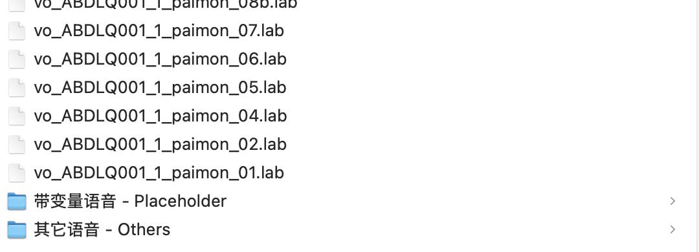
  </figure>
</div>

解压缩了之后大概是这样，其中带变量语音是包含旅行者名字的特殊字符`{NICKNAME}`（当然可能有其他的特殊字符，这里不过多赘述）。其他语音是一些语气对应的音频，比如叹气的声音但是没有文本的那种。

如果数据足够多，我们就不需要带变量语音和其他语音，只用正常的语音数据即可，这里就只用正常语音，其他的不用的直接删掉就行。

然后由于数据集中wav和txt（lab文件）分开了，我们需要按照顺序保存成上面我们说的样子，也就是一一对应，原理很简单，只要找名字一样的文件就行，不过这里为了方便，我直接提供了预处理代码，只要输入对应的数据地址就行：

```bash
python ./tools/data_save_process.py \
    --spk_id paimon \
    --orig_data_path your original data path \
    --target_data_path your target data path
```

大致结果如下：

<div style="display:flex;justify-content:center;">
  <figure style="text-align:center;margin:0;">
    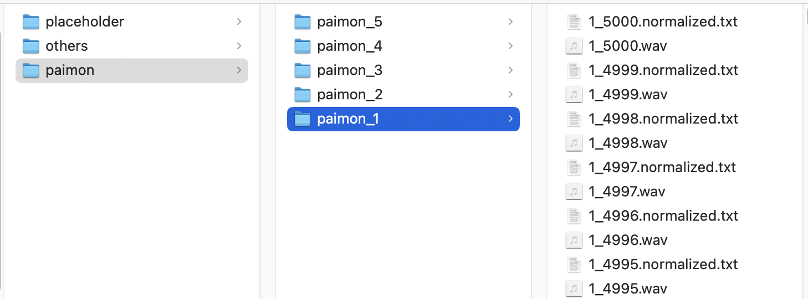
  </figure>
</div>

我们训练的时候用其中5000条就行，也就是一个文件夹里的数据足够，再多了除了增加训练时间外没什么必要。

然后训练的时候可以按照9:1的比例分割数据作为`train`和`test`，这里为了方便，我直接用前4000条数据集作为训练集，后400条作为验证集，然后按照之前说的`your data_dir`里保存这两部分数据集，用`data_dir`地址使用脚本里前5步（这里多了一步也就是最后一步是我写的，用于`swanlab`每一个epoch展示音频结果使用，本质也就是将`spk2embedding.pt`中的信息保存到模型文件中）

你会分别得到下面说的文件，**注意：如果有些文件没有，请务必检查是哪一步没保存下来，下面所有的文件后续训练都要使用，因此不能缺少任何一个文件。**

<div style="display:flex;justify-content:center;">
  <figure style="text-align:center;margin:0;">
    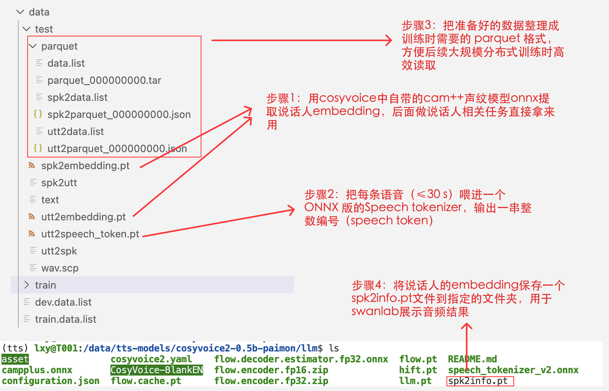
  </figure>
</div>

只要上述所代表的训练集和验证集里这些文件都有，那么接下来你就可以开始训练了😄。

### 3. 训练代码

由于`Cosyvoice`官方已经给出了训练脚本👉[run.sh](https://github.com/FunAudioLLM/CosyVoice/blob/main/examples/libritts/cosyvoice2/run.sh#L55)，其中步骤5是训练部分，步骤6其实是对生成的结果求平均，训练阶段可以步骤5和步骤6按顺序来。但是由于我们进行了简单的改造，所以实际运行我们自己的代码即可👉[ours](https://github.com/828Tina/cosyvoice-paimon-sft/blob/main/run.sh#L86)

我们修改`run.sh`的开头，然后运行`run.sh`训练模型：

```bash
### 修改训练脚本run.sh
# 只训练
stage=5
stop_stage=5
...

# 训练+取平均保存模型权重
stage=5
stop_stage=6
...

# 修改模型地址
pretrained_model_dir=/data/tts-models/cosyvoice2-0.5b
output_model_dir=/data/tts-models/cosyvoice2-0.5b-paimon
...

# 指定训练的卡
CUDA_VISIBLE_DEVICES=your GPU id
...
```

另外，超参数设置在`./conf/cosyvoice2-paimon.yaml`中，我们需要修改的仅为`train_conf`和`swan`部分，其中`train_conf`为超参数，`swan`为训练观测参数。在`run.sh`中记得设置`--config conf/cosyvoice2-paimon.yaml`。

<div style="background:#e7f8ff;color:#000;padding:12px 16px;border-left:4px solid #20c0ff;">
很凑巧的是，在写这篇教程的时候，cosyvoice3发布了😂，我们检查了代码，发现有如下修改：<br>
1. 模型地址在脚本中修改了<br>
2. 对于cosyvoice部分，主要是加入了instruct的处理<br>
3. flow模型做了比较多的修改<br>
我先去训练一波看看效果如何，等训练好了会更新文档
</div>

<div style="display:flex;justify-content:center;">
  <figure style="text-align:center;margin:0;">
    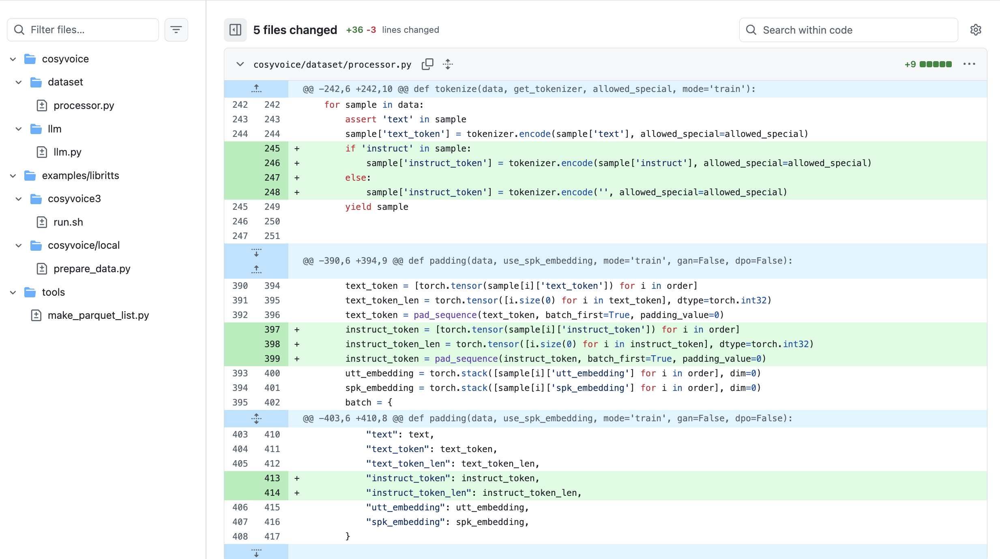
  </figure>
</div>

```bash
### 启动训练
bash run.sh
```

### 4. SwanLab设置

官方使用的是`tensorboard`来观测loss等变化，为了方便起见，我们选择一个能直接在线观察train loss变化，并且可以直接在线听训练过程中产生的音频的`SwanLab`，我们对代码进行一点改造。

在`./utils/train_utils.py`中找到`tensorboard`使用的地方，然后将tensorboard生成的log迁移到`swanlab`中：

```python
from torch.utils.tensorboard import SummaryWriter
import swanlab

...

def init_summarywriter(args,swan_config):
    writer = None
    if int(os.environ.get('RANK', 0)) == 0:
        swanlab.login(api_key=swan_config['api_key'])
        swanlab.init(
            project=swan_config['project_name'],
            experiment_name=swan_config['experiment_name'],
            description=swan_config['description'],
            config=args.__dict__
        )
        swanlab.sync_tensorboard_torch()
        os.makedirs(args.model_dir, exist_ok=True)
        writer = SummaryWriter(args.tensorboard_dir)
    return writer
```

然后在`run.sh`中添加一个新的键`swan`，需要设置如下参数：

```yaml
# swanlab
swan:
    api_key: your swanlab api_key
    project_name: paimon-cosyvoice
    experiment_name: cosyvoice2-paimon-llm+flowtrain
    description: paimon dataset llm+flow training
```

> 如果为了不想每次输入`api_key`导致信息泄露，可以删掉该参数，在外部只要最开始`login`一次就行

**SwanLab**有一个功能`Audio`，可以直接在网页端上传并听音频文件，因此我们需要设置在每个epoch结束后，保存模型并进行推理，生成音频播放到`SwanLab`中，代码我已经给出。

**实际训练的时候，不需要读者做什么操作，只需要运行训练脚本即可，但是如果想了解具体原理，可以看下面的内容。**

首先我们需要确定模型训练时保存每次模型权重的位置：

[https://github.com/828Tina/cosyvoice-paimon-sft/blob/main/cosyvoice/utils/executor.py#L192](https://github.com/828Tina/cosyvoice-paimon-sft/blob/main/cosyvoice/utils/executor.py#L192)

确认了代码地址之后，我们就可以补充后续的代码。

因为每个epoch会保存checkpoint，我们需要将每一个.pt文件转换成对应模型训练的权重文件llm.pt&flow.pt。

```python
# 保存的模型地址：exp/cosyvoice2/llm...
save_model_dir = info_dict['model_dir']
# 将当前的保存好的模型名称转换成llm.pt或者flow.pt并保存，原始模型不能覆盖
# 要先读取，然后保存
current_checkpoint_name = f"{model_name}.pt"
# 具体的保存的新的模型的地址：exp/cosyvoice2/llm/torch_ddp/epoch_{}_whole.pt
current_checkpoint_path = os.path.join(save_model_dir, current_checkpoint_name)
state_dict = torch.load(current_checkpoint_path, map_location='cpu')
if 'model' in state_dict:
    state_dict = state_dict['model']
state_dict = {k: v for k, v in state_dict.items() if k not in {'epoch', 'step'}}
# 新名字
# 模型名字，要根据模型类型来确定，llm、flow
model_type = info_dict['model']
target_model_name = f"{model_type}.pt"
target_model_path = os.path.join(save_model_dir, target_model_name)
# 改名字，但是原始模型不能覆盖,新的地址：exp/cosyvoice2/llm/torch_ddp/llm.pt
torch.save(state_dict, target_model_path)
```

然后把llm.pt&flow.pt转移到我们的`output_model_dir`文件中替换原始的权重文件。

```python
# 最终的目标模型地址：/data/tts-models/cosyvoice2-0.5b-mydeimos/llm
final_target_model_path = os.path.join(info_dict['target_model_path'],model_type)
# 具体旧的模型的地址，但是最终是新模型的保存地址:/data/tts-models/cosyvoice2-0.5b-mydeimos/llm/llm.pt
final_model_path = os.path.join(final_target_model_path, target_model_name)
# 替换
shutil.copyfile(target_model_path, final_model_path)
```

最后根据我们的模型地址，使用`CosyVoice`给出的`sft`后对应的推理函数`inference_sft`（不是零样本推理）推理生成音频文件，上传到`swanlab`中即可。

具体效果如下：

<div style="display:flex;justify-content:center;">
  <figure style="text-align:center;margin:0;">
    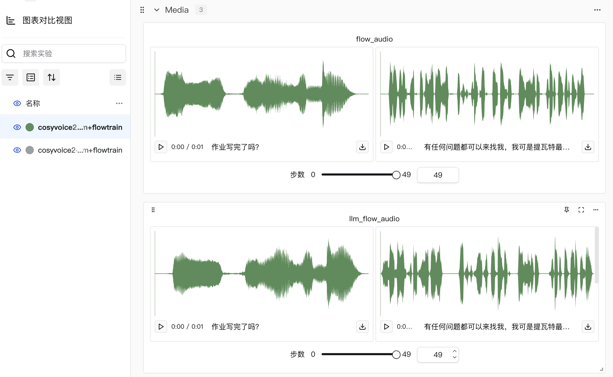
  </figure>
</div>

> 补充说明：作者在训练的时候发现少量的steps对应的loss等信息并没有记录到网页端，这并不是因为SwanLab丢失数据，而是在tensorboard记录中可能由于网络波动导致的数据丢失，不过因为steps通常足够多，并且实际训练的时候没有丢失某些steps，而是因为log上传信息的时候没把信息上传上去，因此不会对模型有影响。

## SwanLab观测结果

本次实验我们总共进行了两个模型的训练，分别是`llm`和`flow`模型，然后在训练`flow`模型的时候，除了展示本来`flow`模型的音频效果，还补充了`llm`和`flow`训练后权重组合的音频效果。

可以直接看完整结果，并且可以在线听👉[https://swanlab.cn/@LiXinYu/cosyvoice-sft/overview](https://swanlab.cn/@LiXinYu/cosyvoice-sft/overview)

**仅llm训练的曲线图和音频结果**

<div style="display:flex;justify-content:center;">
  <figure style="text-align:center;margin:0;">
    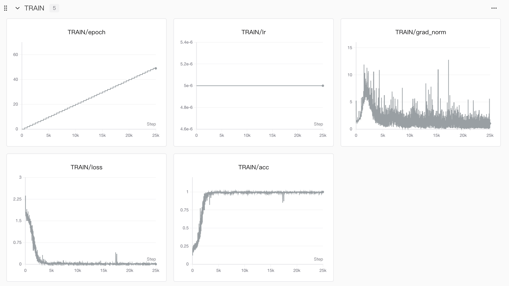
  </figure>
</div>

<div style="display:flex;justify-content:center;">
  <figure style="text-align:center;margin:0;">
    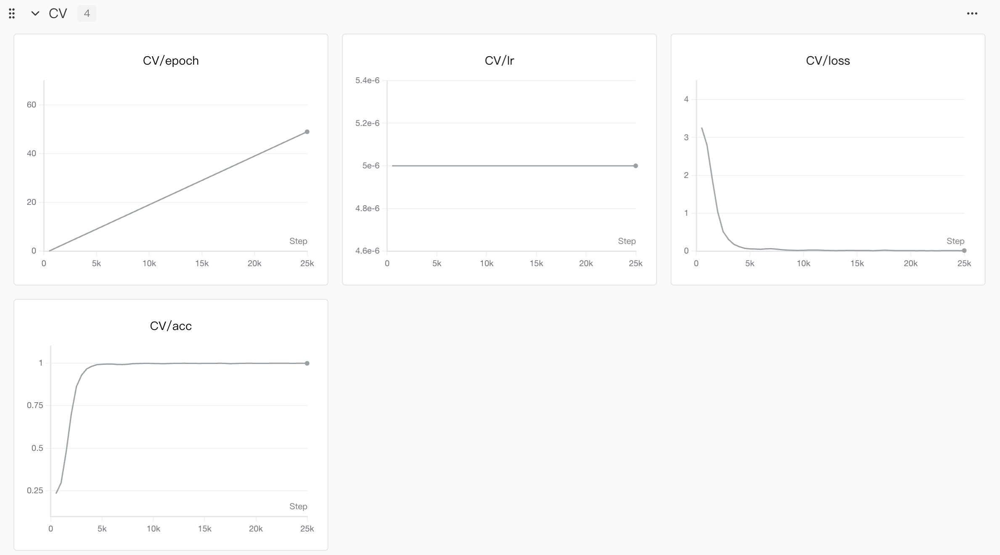
  </figure>
</div>

<div style="display:flex;justify-content:center;">
  <figure style="text-align:center;margin:0;">
    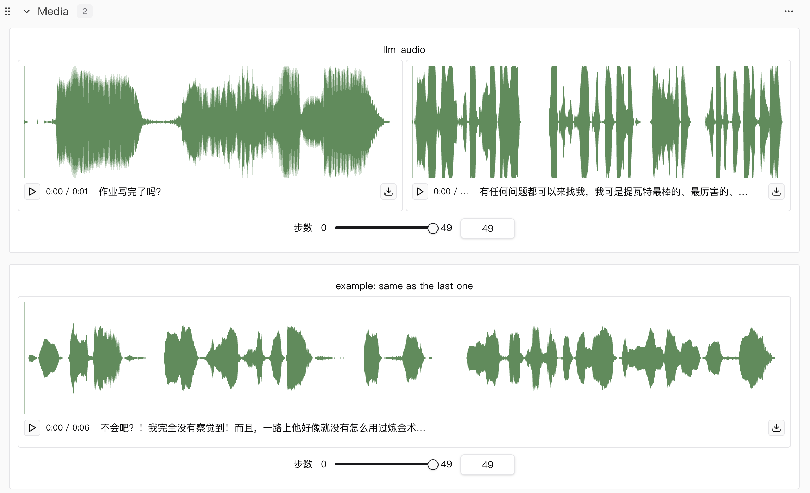
  </figure>
</div>

**flow训练的曲线图和音频结果**

<div style="display:flex;justify-content:center;">
  <figure style="text-align:center;margin:0;">
    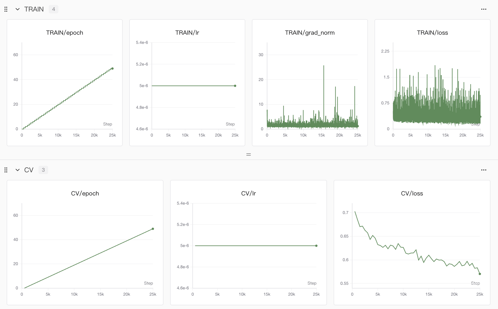
  </figure>
</div>

<div style="display:flex;justify-content:center;">
  <figure style="text-align:center;margin:0;">
    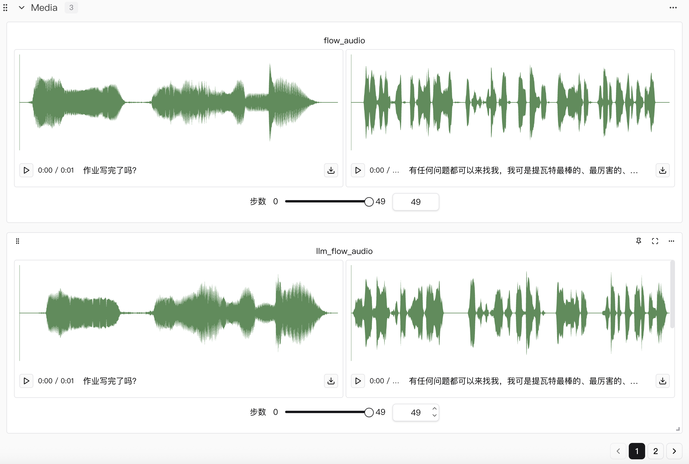
  </figure>
</div>

其中`Train`就是训练集训练的过程，`CV`可以理解为每个`epoch`完成后进行验证集做前向传播的过程。

这里需要注意几点⚠️：

1. 对于准确度`acc`，只有`llm`才有，`flow`是没有的，这是因为`llm`其实是根据输入的文本预测对应语音的speech tokens，这个tokens其实就可以理解为字典里的编号，那么离散的编号数字当然可以求准确度，同时也保证在反向传播过程中结合loss提升模型训练的效果。`flow`模型理论上是根据speech tokens生成对应的梅尔频谱图，这种非离散状态的输出无法做准确度计算，因此只有loss。
2. `flow`里有个`llm_flow`的效果展示，这是我做的一点小改动🤏，用于在`llm`训练好后，在`flow`训练的时候可以同时对比只有`flow`微调以及两个都微调后音频效果，方便随时观察音频效果变化。
3. `example: same as the last one`这个是我在训练数据中随便找了一个数据作为参考，因为可能有些读者并没有玩过原神，不清楚派蒙的声音，因此做了个对比。

## 微调效果测试

在进行推理的时候，我们需要将说话人对应的音色`embedding`作为输入，用`instruct_sft`来生成对应目标文本的音频文件，而如果只微调`llm`或者`flow`单独一个模型，效果并不是很好，这是因为单独一个分别有自己的任务要完成。

- `llm`聚焦 “文本与音频的语义、指令对齐”，不直接学习声学细节：
  
  1. 文本到语义令牌的映射：将输入文本（含自然语言指令）转化为离散的 speech tokens，确保内容一致性（比如文本 “开心地打招呼” 对应包含 “开心” 情绪倾向的语义令牌）。
  2. 指令解析与执行逻辑：学习理解 “用粤语说”“快速朗读” 等指令，将指令信息编码到语义令牌中，为后续声学生成提供高层指导。
  3. 语言与格式适配：掌握多语言语法、文本归一化规则（如数字、符号的口语化转换），以及多音字、生僻词的发音逻辑（通过发音修复模块辅助）。

- `flow`模型聚焦 “将语义令牌转化为真实音频波形”，核心学习目标是声学细节的生成与还原：
  
  1. 声学特征建模：基于 speech tokens，生成对应的 Mel 频谱（音频的核心声学特征），涵盖频率分布、时长匹配等基础声学属性。
  2. 环境与噪声适配：学习处理真实场景中的噪声、背景音，生成符合场景的自然音频（比如还原参考音频的轻微背景噪声）。
  3. 细粒度声学控制：响应 LLM 传递的指令信息，调整语速、音量等声学参数（如 “快速朗读” 对应更快的帧生成节奏）。

我们简单总结下📖：

| 模型组件 | 核心学习目标         | 是否学习音频韵律/音色/语调 | 角色定位     |
|:----:|:-------------- |:-------------- |:-------- |
| llm  | 文本-语义-指令对齐     | 否（仅传递高层倾向信息）   | 内容与指令理解者 |
| flow | 声学细节生成、个性化特征还原 | 是（主导学习）        | 音频生成执行者  |

如果文字表述比较抽象的话，可以听下下面展示出来的音频结果，分别是单独模型组件和两个模型组件一起作用时的结果。

| 微调方案         | 音频效果演示 & 对应自定义文本                                                                                                                                                                                                                                             |
| ------------ | ------------------------------------------------------------------------------------------------------------------------------------------------------------------------------------------------------------------------------------------------------------ |
| 仅llm微调后      | <audio controls style="width: 400px;"> <source src="https://github.com/828Tina/cosyvoice-paimon-sft/raw/main/examples/audios/single_example/paimon_sft_inference_llm.wav" type="audio/wav">  </audio> <br> **文本内容**：有任何问题都可以来找我，我可是提瓦特最棒的、最厉害的、知道的最多的向导！     |
| 仅flow微调后     | <audio controls style="width: 400px;"> <source src="https://github.com/828Tina/cosyvoice-paimon-sft/raw/main/examples/audios/single_example/paimon_sft_inference_flow.wav" type="audio/wav">  </audio> <br> **文本内容**：有任何问题都可以来找我，我可是提瓦特最棒的、最厉害的、知道的最多的向导！    |
| llm和flow都微调后 | <audio controls style="width: 400px;"> <source src="https://github.com/828Tina/cosyvoice-paimon-sft/raw/main/examples/audios/single_example/paimon_sft_inference_llmflow.wav" type="audio/wav">  </audio> <br> **文本内容**：有任何问题都可以来找我，我可是提瓦特最棒的、最厉害的、知道的最多的向导！ |

说实话，关于派蒙的语音，仅`llm`就比较像，这个是将训练后的`llm.pt`替换原始的`llm.pt`，其他的不变，而这样的推理结果比较像原始音频的主要原因大概率是预训练阶段就有派蒙的数据，因此模型早就记住了派蒙的语音特征，这点在零样本推理中尤为明显，我们使用某个音频作为参照，用零样本推理生成一段派蒙语音对比下。

其中零样本推理使用的是完全没有微调过的原始模型，SFT则是将`llm`和`flow`都微调过后的结果。下面依次展示原始训练数据中的派蒙语音和零样本推理、微调音频效果对照表。

<table style="width: 100%; border-collapse: collapse;">
  <thead>
    <tr>
      <th style="padding: 12px 15px; text-align: center; border: 1px solid #e0e0e0; background: #f8f8f8; font-weight: 600; min-width: 150px; font-size: 16px;">原始数据编号</th>
      <th style="padding: 12px 15px; text-align: left; border: 1px solid #e0e0e0; background: #f8f8f8; font-weight: 600; min-width: 480px; font-size: 16px; ">音频效果演示 & 游戏文本</th>
    </tr>
  </thead>
  <tbody>
    <tr>
      <td style="padding: 12px 15px; text-align: center; border: 1px solid #e0e0e0; background: #fff; font-size: 16px;">1_4</td>
      <td style="padding: 12px 15px;  border: 1px solid #e0e0e0; word-wrap: break-word; word-break: break-word; background: #fff;">
        <audio controls style="width: 100%; max-width: 400px; margin-bottom: 8px;">
          <source src="https://github.com/828Tina/cosyvoice-paimon-sft/raw/main/examples/audios/paimon_inference/train_data/1_4.wav" type="audio/wav">
        </audio> <br>
        <strong>文本内容</strong>：说起来刚刚就一直听到「阿贝多先生」，他也是蒙德城的炼金术士吗？
      </td>
    </tr>
    <tr>
      <td style="padding: 12px 15px; text-align: center; border: 1px solid #e0e0e0; background: #fafafa; font-size: 16px;">1_12</td>
      <td style="padding: 12px 15px; border: 1px solid #e0e0e0; word-wrap: break-word; word-break: break-word; background: #fafafa;">
        <audio controls style="width: 100%; max-width: 400px; margin-bottom: 8px;">
          <source src="https://github.com/828Tina/cosyvoice-paimon-sft/raw/main/examples/audios/paimon_inference/train_data/1_12.wav" type="audio/wav">
        </audio> <br>
        <strong>文本内容</strong>：没什么没什么，只是平时他总是站在这里，有点奇怪而已。
      </td>
    </tr>
  </tbody>
</table>

---

<!-- 外层容器：控制滚动+基础样式（兼容大部分平台） -->

<div style="overflow-x: auto; max-width: 100%; border: 1px solid #cdccccff;">
<!-- 标题嵌入容器内 -->
  <h3 style="padding: 12px 16px; margin: 0; text-align: center; color: #333; border-bottom: 1px solid #787878ff;">零样本&微调音频效果对照表</h3>
  <!-- 表格：标准化写法，避免渲染异常 -->
  <table style="width: 100%; border-collapse: collapse; min-width: 800px;">
    <!-- 表头 -->
    <thead>
      <tr style="background: #f5f5f5;">
        <th style="padding: 8px 12px; text-align: left; border: 1px solid #e0e0e0;">Text</th>
        <th style="padding: 8px 12px; text-align: left; border: 1px solid #e0e0e0;">Zero-Shot</th>
        <th style="padding: 8px 12px; text-align: left; border: 1px solid #e0e0e0;">SFT(llm+flow)</th>
      </tr>
    </thead>
    <!-- 表体 -->
    <tbody>
      <tr>
        <td style="padding: 8px 12px; border: 1px solid #e0e0e0;word-wrap: break-word; word-break: break-all; max-width: 230px;">卖唱的怎么又跑去喝酒了！</td>
        <td style="padding: 8px 12px; border: 1px solid #e0e0e0;"><audio controls style="width: 280px;"> <source src="https://github.com/828Tina/cosyvoice-paimon-sft/raw/main/examples/audios/paimon_inference/zero-shot/zero_shot_0.wav" type="audio/wav">  </audio></td>
        <td style="padding: 8px 12px; border: 1px solid #e0e0e0;"><audio controls style="width: 280px;"> <source src="https://github.com/828Tina/cosyvoice-paimon-sft/raw/main/examples/audios/paimon_inference/llm_flow/paimon_sft_inference_0.wav" type="audio/wav">  </audio></td>
      </tr>
      <tr>
        <td style="padding: 8px 12px; border: 1px solid #e0e0e0;word-wrap: break-word; word-break: break-all; max-width: 230px;">你知道昨天那个新闻吗？</td>
        <td style="padding: 8px 12px; border: 1px solid #e0e0e0;"><audio controls style="width: 280px;"> <source src="https://github.com/828Tina/cosyvoice-paimon-sft/raw/main/examples/audios/paimon_inference/zero-shot/zero_shot_1.wav" type="audio/wav">  </audio></td>
        <td style="padding: 8px 12px; border: 1px solid #e0e0e0;"><audio controls style="width: 280px;"> <source src="https://github.com/828Tina/cosyvoice-paimon-sft/raw/main/examples/audios/paimon_inference/llm_flow/paimon_sft_inference_1.wav" type="audio/wav">  </audio></td>
      </tr>
      <tr>
        <td style="padding: 8px 12px; border: 1px solid #e0e0e0;word-wrap: break-word; word-break: break-all; max-width: 230px;">音频大模型是用海量声音数据训练、能一次性听懂生成说话音乐噪声的“万能声学大脑”。</td>
        <td style="padding: 8px 12px; border: 1px solid #e0e0e0;"><audio controls style="width: 280px;"> <source src="https://github.com/828Tina/cosyvoice-paimon-sft/raw/main/examples/audios/paimon_inference/zero-shot/zero_shot_2.wav" type="audio/wav">  </audio></td>
        <td style="padding: 8px 12px; border: 1px solid #e0e0e0;"><audio controls style="width: 280px;"> <source src="https://github.com/828Tina/cosyvoice-paimon-sft/raw/main/examples/audios/paimon_inference/llm_flow/paimon_sft_inference_2.wav" type="audio/wav">  </audio></td>
      </tr>
    </tbody>
  </table>
</div>

以上三段文字都是我写的自定义文本：

- 第一条是贴合原神派蒙会说的话（当然不排除可能在游戏里真的说过😂，如果有，可以当作用训练数据作为参考）；
- 第二条表示疑问的语气；
- 第三条直接完全脱离原神游戏里的内容，以陈述句形式来展示效果

可以从实际效果长听出，零样本推理其实已经具备了一点派蒙的声线和说话习惯，但是相比于真实声线，其实还是差很多的。而微调过后的模型，对于派蒙声音的模仿就要好得多，如此也可以证明微调的效果。

> 如果想要更真实的数据支撑推理的效果，可以参考👉[https://github.com/FunAudioLLM/CV3-Eval](https://github.com/FunAudioLLM/CV3-Eval)，这是官方发布的针对CosyVoice3的模型推理效果评测，应该对CosyVoice2也可以用，我之后有时间研究下，这里先放个未完待续...

## 参考文献

[1]. [https://developer.nvidia.com/cuda/gpus](https://developer.nvidia.com/cuda/gpus)

[2]. [https://github.com/FunAudioLLM/CosyVoice/tree/main/examples/libritts/cosyvoice2](https://github.com/FunAudioLLM/CosyVoice/tree/main/examples/libritts/cosyvoice2) 

[3]. [https://funaudiollm.github.io/pdf/CosyVoice_v1.pdf](https://funaudiollm.github.io/pdf/CosyVoice_v1.pdf)

[4]. [https://arxiv.org/abs/2412.10117](https://arxiv.org/abs/2412.10117)

[5]. [CosyVoice三部曲深度解析【论文精读】](https://www.bilibili.com/opus/1136165016148377601)