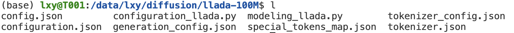
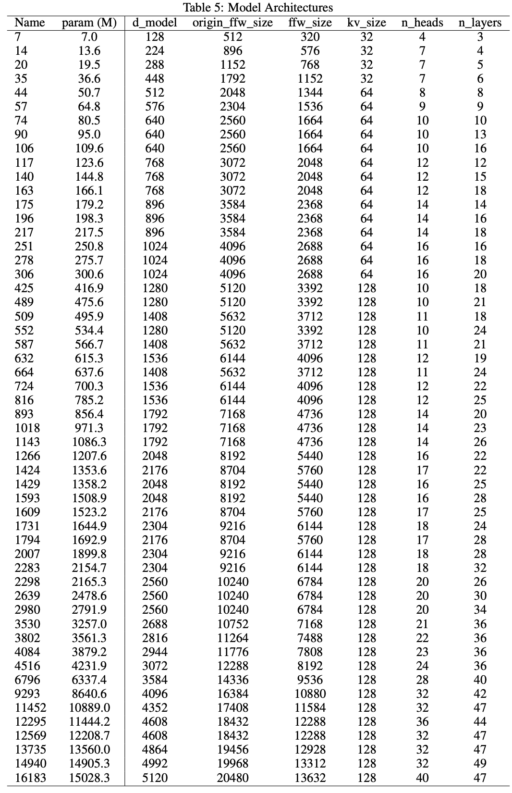
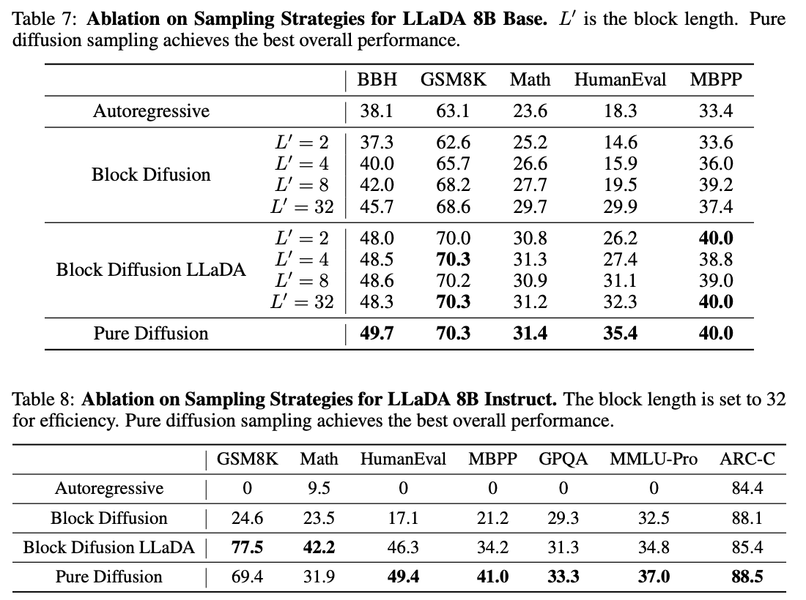

# LLaDA模型预训练与微调实战

<div style="display:flex;justify-content:center;">
  <figure style="text-align:center;margin:0;">
    
  </figure>
</div>

> 作者信息：情感机器实验室研究员-李馨雨  
> 邮箱：wind.340171@gmail.com

**📚资料**

- **代码**：[llada-pretrian-sft](https://github.com/828Tina/llada-pretrain-sft)
- **数据集**：[pretrain](https://www.modelscope.cn/datasets/allenai/c4)，[sft](https://www.modelscope.cn/datasets/AI-ModelScope/alpaca-gpt4-data-zh)
- **模型**：[llada-8b](https://www.modelscope.cn/models/GSAI-ML/LLaDA-8B-Base)
- **SwanLab**：[llada-swanlab](https://swanlab.cn/@LiXinYu/llada-sft/overview)

本次教程代码源于[dllm](https://github.com/ZHZisZZ/dllm)，里面有完整的llada模型预训练以及微调方法，在此感谢作者开源llada训练框架🙏。

<div style="display:flex;justify-content:center;">
  <figure style="text-align:center;margin:0;">
    
  </figure>
</div>

## 目录

[[toc]]

## 简介

缺图

在前面的章节中，我们展示了很多关于自回归模型的训练方法，哪怕是多模态模型，其中LLM部分也是基于自回归模型的（第六章）。在我们的课程里并没有完整的关于diffusion模型，也就是扩散模型的训练方法。本次教程我们就来实现diffusion模型的预训练以及微调，其中**微调为核心，预训练仅做尝试以及验证相关论文中的论点即可。**

其中扩散模型我们选择LLaDA模型，微调数据集还是采用经典的instruct数据集alpaca，预训练数据集经过多次试验，我们采用C4数据集来进行训练。


## LLaDA原理

### LLaDA原文解读

### DS模型训练scaling law论文解读

### 总结

## 完整训练

### 1. 环境安装

- 克隆代码

```bash
git clone https://github.com/828Tina/llada-pretrain-sft.git
cd llada-pretrain-sft
```

- 安装环境

```bash
pip install -r requirements.txt -i https://mirrors.aliyun.com/pypi/simple/
```

- 硬件要求

1. $5090个数 \ge 1$
2. `Pytorch` $\ge$ 2.7，CUDA适应自己的版本，我的是12.8

<div style="background:#e7f8ff;color:#000;padding:12px 16px;border-left:4px solid #20c0ff;">
由于5090是比较新的GPU，安装环境的时候会有比较多的问题，我在<a href="http://localhost:5173/course/llm_train_course/07-audio/1.cosyvoice-sft/README.html#_1-%E7%8E%AF%E5%A2%83%E5%AE%89%E8%A3%85" target="_blank" rel="noopener">CosyVoice</a>一篇中已经汇总了解决办法，可以前往查看。
</div>

### 2. 数据处理

在简介中我们强调，SFT是核心，因此我会按照SFT需要的数据集格式来讲述，预训练其实遵循的是同样的步骤，只不过预训练需要的是text数据而已。

首先我们需要下载数据集，我希望用本地的数据集来完成本次微调，参考了[datasets](https://huggingface.co/docs/datasets/process#save)关于数据保存和使用的代码，觉得以 `Arrow` 格式保存到本地磁盘然后读取的方式更方便，`Arrow` 是未压缩的，因此重新加载速度更快，非常适合本地磁盘使用和临时缓存。

上述过程主要使用`save_to_disk`和`load_from_disk`保存和加载数据集，不过如果磁盘空间有限，建议还是直接用`load_dataset`。

<div style="background:#e7f8ff;color:#000;padding:12px 16px;border-left:4px solid #20c0ff;">如果想直接预处理数据集的小伙伴，可以直接运行<a href="https://github.com/828Tina/llada-pretrain-sft/blob/main/data.ipynb"target="_blank" rel="noopener">notebook</a>中的代码，原理步骤如下：
</div>

**SFT训练**下载数据格式参考Alpaca数据集格式:

```python
Dataset({
    features: ['instruction', 'input', 'output'],
    num_rows: 48818
})
```

然后需要转换成gpt的对话格式，也就是messages：

```python
{
    "messages": [
        {"role": "user", "content": prompt},
        {"role": "assistant", "content": response},
    ]
}
```

最后用tokenizer转换成tokens形式：

```python
Dataset({
    features: ['input_ids', 'labels', 'prompt_len'],
    num_rows: 48818
})
```

然后保存成Arrow格式到本地磁盘，等训练时可以直接调用。

对于预训练数据集，只要下载的数据集里有`text`标签，可以直接保存到本地不用转换，代码如下：

```python
from datasets import load_dataset

data_path='/data/lxy/diffusion/data/c4-en/en.noblocklist'
c4_dataset=load_dataset(data_path,split='train')

output_path='/data/lxy/diffusion/data/c4-en-train'
c4_dataset.save_to_disk(output_path)
```

预训练之所以可以直接保存text形式内容，是因为在数据预处理阶段直接自动转换成tokens格式，而SFT由于我有个参数`load_preprocessed_data`设置为`True`了（官方默认为False），导致不会自动转换tokens，我不想改源代码，因此直接把数据集在下载阶段就转换好保存的。

*我们看下`dllm`的关于数据处理部分的代码：*

**pretrain**

```python
dataset = dllm.data.load_pt_dataset(
          data_args.dataset_args,
          streaming=data_args.streaming,
          load_preprocessed_data=data_args.load_preprocessed_data,
      )
      dataset = dataset.map(
          functools.partial(
              dllm.utils.tokenize_and_group,
              tokenizer=tokenizer,
              text_field=data_args.text_field,
              seq_length=data_args.max_length,
              insert_eos=data_args.insert_eos,
              drop_tail=data_args.drop_tail,
          ),
          batched=True,
          remove_columns=dataset["train"].column_names,
          **({} if data_args.streaming else {"num_proc": data_args.num_proc}),
          **({} if data_args.streaming else {"desc": "Mapping dataset to PT format"}),
      )
```

**SFT**

```python
dataset = dllm.data.load_sft_dataset(
          data_args.dataset_args,
          load_preprocessed_data=data_args.load_preprocessed_data,
      )
      if not data_args.load_preprocessed_data:
          map_fn = partial(
              dllm.utils.default_mdlm_sft_map_fn,
              tokenizer=tokenizer,
              mask_prompt_loss=data_args.mask_prompt_loss,
          )
          dataset = dataset.map(
              map_fn,
              num_proc=data_args.num_proc,
              desc="Mapping dataset to SFT format",
          )
```


<div style="background:#ffeae4ff;color:#000;padding:12px 16px;border-left:4px solid #fc592cff;">
<strong>注意：</strong>
训练的时候看下最终交给Trainer的datasets内容是否是tokens就行，dllm的Trainer继承父类Transformers的Trainer，因此如何使用不再赘述。
</div>


### 3. 训练代码

本次教程核心是学会微调，数据集采用经典Alpaca数据集，预训练采用部分C4英文数据集。我们希望教程能够教会完整的训练流程以及测试流程，因此数据集均采用经典通用的数据集。

我将分成两个模块来，为了符合正常的训练流程，教程依次是预训练和微调，代码地址👉[ours](https://github.com/828Tina/llada-pretrain-sft/tree/main)

另外，如果有小伙伴想对比自回归模型和掩码扩散模型的区别，可以训练llama模型或者qwen模型作为对比。之所以可以训练llama模型来对比是因为llada的主体部分其实是llama结构，然后掩码不采用自回归模型的上三角形式，我们在[模型文件](https://www.modelscope.cn/models/GSAI-ML/LLaDA-8B-Base/file/view/master/modeling_llada.py?status=1#L659)中可以看到：

```python
# Modify: MDM set causal to False.
return F.scaled_dot_product_attention(
    q,
    k,
    v,
    attn_mask=attn_mask,
    dropout_p=dropout_p,
    is_causal=False,
)
```

其中`is_causal`设置为False，不采用自回归模型的掩码形式。

并且我们还可以从[参数配置](https://www.modelscope.cn/models/GSAI-ML/LLaDA-8B-Base/file/view/master/config.json?status=1#L18)文件中看到：

```json
"block_group_size": 1,
"block_type": "llama",
"d_model": 4096,
```

主体的block采用`llama`结构，那么采用`llama`模型对比是很合适的。

而`qwen`作为比较通用的模型，我们经常使用，采用标准自回归模型结构，因此也可以作为对比模型测试对比效果。

那么接下来我们就开始训练吧，由于我已经整理过代码，因此可以直接运行脚本文件实现，下面简要说下每个文件的含义和用法：

```python
├── configs
│   ├── llada-8b-sft.yaml
│   ├── llada-100M-pt.yaml
│   ├── qwen2.5-7b-alpaca.yaml
│   ├── ddp.yaml
│   ├── zero2.yaml
│   └── ...
├── dllm
├── scripts
│   ├── train-sft.sh
│   ├── train-pt.sh
│   ├── train-qwen.sh
│   ├── eval.sh
│   └── ...
├── examples
│   ├── llada
│   │   ├── pt.py
│   │   ├── sft.py
│   │   ├── chat.py
│   │   └── sample.py
│   ├── qwen
│   │   ├── sft.py
│   │   ├── chat.py
│   │   └── utils.py
```

- `configs`：包含训练超参数设置、deepspeed分布式训练参数设置等
- `scripts`：训练启动文件、eval启动文件等
- `examples`：核心微调、预训练训练代码等

#### 预训练

预训练和微调的训练方式可能会稍微有点不一样，原因如下：

1. 教程仅做为示例，核心还是微调
2. 我想验证下[Diffusion Beats Autoregressive in Data-Constrained Settings](https://arxiv.org/pdf/2507.15857)这篇文章的观点，因此会采用小参数量的模型，和少规模tokens的数据集作为训练资源

💡从原因上大家也能看出，和微调不一样的是，**`小参数量模型`** 作为基座模型。那么如何构建`小参数量模型`呢？

其实很简单，预训练模型其实就是构建好框架后，喂大量的数据集让模型学会如何生成内容，而训练前是没有权重文件的，或者说用不上权重文件的。因此想要构建小参数量模型，直接把`config`文件以及`tokenizer`相关文件下载下来就行，类似于`*.safetensors`这样的文件直接不用下载。然后我们修改`config.json`中的参数，让最终算出来的参数量达到我们要的量级就行，我使用的模型是100M大小。

下面跟着我的代码按步骤实现：

**1. 下载文件**

由于我们核心为微调，在微调代码中已经包含了下载llada-8b模型的步骤，因此如果要构建一个100M的模型，把llada-8b中**去除** `*.safetensors`的所有的文件复制到新的文件夹中，命名成`llada-100M`就行。

<div style="display:flex;justify-content:center;">
  <figure style="text-align:center;margin:0;">
    
  </figure>
</div>

**2. 修改参数**

对于如何修改参数，[论文](https://arxiv.org/pdf/2507.15857)中给出了对应的参数量，如下图所示：

<div style="display:flex;justify-content:center;">
  <figure style="text-align:center;margin:0;">
    
  </figure>
</div>

但是我在实践的时候发现总是会超过表格中的参数，这可能是由于`vocab_size`以及其他的一些参数导致的，因此表格中参数仅做参考，我设置的参数如下所示：

```json
{
  "activation_type": "silu",
  "alibi": false,
  "alibi_bias_max": 8.0,
  "architectures": [
    "LLaDAModelLM"
  ],
  "attention_dropout": 0.0,
  "attention_layer_norm": false,
  "attention_layer_norm_with_affine": true,
  "auto_map": {
    "AutoConfig": "configuration_llada.LLaDAConfig",
    "AutoModelForCausalLM": "modeling_llada.LLaDAModelLM",
    "AutoModel": "modeling_llada.LLaDAModelLM"
  },
  "bias_for_layer_norm": false,
  "block_group_size": 1,
  "block_type": "llama",
  "d_model": 448,
  "embedding_dropout": 0.0,
  "embedding_size": 126464,
  "eos_token_id": 126081,
  "flash_attention": false,
  "include_bias": false,
  "include_qkv_bias": false,
  "init_cutoff_factor": null,
  "init_device": "meta",
  "init_fn": "mitchell",
  "init_std": 0.02,
  "input_emb_norm": false,
  "layer_norm_type": "rms",
  "layer_norm_with_affine": true,
  "mask_token_id": 126336,
  "max_sequence_length": 1024,
  "mlp_hidden_size": 768,
  "mlp_ratio": 2,
  "model_type": "llada",
  "multi_query_attention": null,
  "n_heads": 7,
  "n_kv_heads": 7,
  "n_layers": 6,
  "pad_token_id": 126081,
  "precision": "amp_bf16",
  "residual_dropout": 0.0,
  "rms_norm_eps": 1e-05,
  "rope": true,
  "rope_full_precision": true,
  "rope_theta": 10000.0,
  "scale_logits": false,
  "transformers_version": "4.46.3",
  "use_cache": false,
  "vocab_size": 126464,
  "weight_tying": false
}
```

通过计算得到总参数量：

```python
from transformers import AutoConfig, AutoModelForCausalLM
import torch

config = AutoConfig.from_pretrained("/data/lxy/diffusion/llada-100M",trust_remote_code=True)

with torch.device("meta"):
    model = AutoModelForCausalLM.from_config(config)   # 只建形状，不占内存

print(model.num_parameters())

# 124327616
```

然后预训练启动代码如下：

```bash
bash scripts/train-pt.sh
```

对应超参数设置为`configs/llada-100M-pt.yaml`，具体的参数设置如下：

```yaml
# ModelArguments
model_name_or_path: /data/lxy/diffusion/llada-100M

# DataArguments
dataset_args: /data/lxy/diffusion/data/c4-en-shuffled[train:1000_000,test:1000]
text_field: text
streaming: false
num_proc: 8
drop_tail: true
max_length: 1024
load_preprocessed_data: true
insert_eos: true
random_length_ratio: 0.01

# TrainingArguments
output_dir: /data/lxy/diffusion/output/llada-pt-c4-500Mtokens-epoch-1
run_name: llada-pt-c4-500Mtokens-epoch-1
learning_rate: 3.0e-4
warmup_steps: 2000
# num_train_epochs: 1
max_steps: 10
per_device_train_batch_size: 2
per_device_eval_batch_size: 2
gradient_accumulation_steps: 8
logging_steps: 20
eval_strategy: steps
eval_steps: 200
save_steps: 1000
save_total_limit: 2
```

需要注意的是，`warmup_steps`需要根据数据量以及训练轮次来设置固定值，2000步的预热比较合适。其他的参数设置和微调参数设置相同。

#### 微调

在下载好模型并且数据集预处理后，运行下面的代码即可：

```bash
bash scripts/train-sft.sh
```

如果要修改超参数等，那么对`configs/llada-8b-sft.yaml`的内容进行修改：

```yaml
# ModelArguments
model_name_or_path: /data/lxy/diffusion/llada-8b
lora: true
target_modules: all-linear
r: 32
lora_alpha: 64
lora_dropout: 0.05

# DataArguments
dataset_args: /data/lxy/diffusion/data/alpaca-zh-gpt[train:2000,test:200]
num_proc: 8
max_length: 1024
load_preprocessed_data: true


# TrainingArguments
output_dir: /data/lxy/diffusion/output/llada-gpu1-epoch-test
report_to: swanlab
run_name: llada-alpaca-zh-epoch-test
learning_rate: 3.0e-4
warmup_ratio: 0.1
# num_train_epochs: 1
max_steps: 10
per_device_train_batch_size: 2
per_device_eval_batch_size: 2
gradient_accumulation_steps: 8
logging_steps: 2
eval_strategy: steps
eval_steps: 200
save_steps: 1000
save_total_limit: 2
```

有些地方需要注意：

1. `dataset_args`是你的数据集保存地址，由于我下面的`load_preprocessed_data`设置为`true`，也就是提前处理了数据集的意思，因此保存的数据集内容要求是tokens形式。
2. 最好将`max_steps`改成`num_train_epochs`，然后微调2-3个epoch即可。如果是`max_steps`最好提前计算下选择多少steps较为合适。
3. `SwanLab`是我们的训练观测工具，由于`dllm`继承了`Transformers`父类，而且`Transformers`已经集成`SwanLab`，因此我们直接令`report_to=swanlab`，唯一需要注意的是，如果想修改项目名称的话，需要提前设置环境变量，我在这里进行设置👉[project](https://github.com/828Tina/llada-pretrain-sft/blob/main/dllm/utils/configs.py#L7)


#### *Qwen

本次教程选择`Qwen`模型作为`llada`模型的对比模型，用`Qwen`模型进行预训练和微调，分别和`llada`模型对比预训练和微调效果。

其中预训练和`llada`一样，设置一个100M参数量的模型来进行训练，步骤和`llada`的一样，只不过要运行下面的代码：

```bash
缺代码
```

其次是微调，对于`Qwen`模型的微调我们已经设置了很多教程，如果有兴趣的小伙伴可以查看我的另外一篇专门讲[lora训练](https://docs.swanlab.cn/course/llm_train_course/03-sft/7.deepseek-lora/README.html)的文章，这里只需要运行下面的启动文件就行：

```bash
bash scripts/train-qwen.sh
```

超参数设置在`configs/qwen2.5-7b-alpaca.yaml`

> 该部分仅作为llada模型结果的对比

## SwanLab观测结果


## 结果测试

对于训练得到的结果，可以直接进行`chat`推理对话，或者也可以使用`ceval`、`cmmlu`等数据批量测试并得到结果数据。

### 单次推理对话

我们先看下如何推理，在推理前，我们先合并模型参数，微调用的lora微调，需要合并参数，但是如果是全参量微调，不用在意这一步：

```bash
python /home/lxy/diffusion_project/llada-sft/examples/llada/merge.py \
        --lora_path /data/lxy/diffusion/output/llada-gpu1-epoch-3/checkpoint-final \
        --base_model_path /data/lxy/diffusion/llada-8b \
        --merge_path /data/lxy/diffusion/output/merge-llada-8b-alpaca-zh-gpt-epoch-3
```

然后如果要单次推理，要使用`chat.py`文件，运行下面的代码：

```bash
CUDA_VISIBLE_DEVICES=0 python -u examples/llada/chat.py \
    --model_name_or_path /data/lxy/diffusion/output/llada-lora \
    --steps 128 \
    --max_length 128 \
    --block_size 32
```

- `steps`：在扩散模型的反向生成过程中，从 `t=1（全掩码）`到 `t=0（无掩码）`需要执行的迭代次数。每一步对应一个离散的 `t` 值，模型在该步骤预测掩码位置的内容。

    - steps越大：生成质量通常更高，因为更多迭代允许更精细的调整，但推理速度越慢。

    - steps越小：推理越快，但可能牺牲生成质量。

- `block_size`：在使用块扩散采样策略时，每个块（block） 的长度。

    - block_size = 生成长度（如1024）：相当于纯扩散采样，一次性生成整个序列。

    - block_size = 1：相当于完全自回归采样，逐词生成。

    - block_size 介于两者之间：半自回归采样，平衡速度和质量。

论文验证了在`block_size=32`的时候，和纯扩散模型效果差不多，因此这样设置：

<div style="display:flex;justify-content:center;">
  <figure style="text-align:center;margin:0;">
    
  </figure>
</div>

### 批量测试

我已经根据`dllm`的代码设计了测试用的脚本，运行下面的代码就可以进行测试：

```bash
bash scripts/eval-llada.sh
```

或者运行下面的代码：

```bash
export PYTHONPATH=../:$PYTHONPATH             
export HF_ALLOW_CODE_EVAL=1                 # Allow code evaluation
export HF_DATASETS_TRUST_REMOTE_CODE=True   # For cmmlu dataset

export TORCH_NCCL_ASYNC_ERROR_HANDLING=1    # Enable async error handling for multi-GPU communication to avoid deadlocks
export NCCL_DEBUG=warn                      # Show NCCL warnings for better diagnosis without flooding logs
export TORCH_DISTRIBUTED_DEBUG=DETAIL       # Provide detailed logging for PyTorch distributed debugging

CUDA_VISIBLE_DEVICES=0 accelerate launch --num_processes 1 \
    dllm/pipelines/llada/eval.py \
    --tasks cmmlu \
    --model llada \
    --apply_chat_template \
    --output_path /data/lxy/diffusion/eval/llada/llada-cmmlu/llada-8b-epoch-3/test \
    --log_samples \
    --max_batch_size 4 \
    --model_args "pretrained=/data/lxy/diffusion/output/merge-llada-8b-alpaca-zh-gpt-epoch-3,is_check_greedy=False,mc_num=1,max_length=1024,steps=256,block_size=64,cfg=0.0"
```

如果要进行别的task测试任务，修改其中的`tasks`即可，需要注意的是，dllm使用`lm_eval`来测试的，因此`tasks`要选择该框架中有的，具体可以查看👉[tasks列表](https://github.com/EleutherAI/lm-evaluation-harness/tree/main/lm_eval/tasks)

## 参考文献


