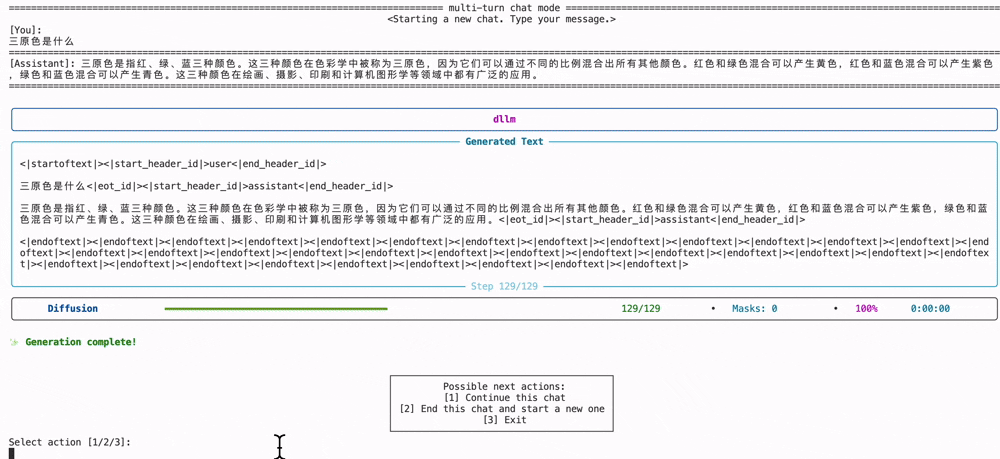
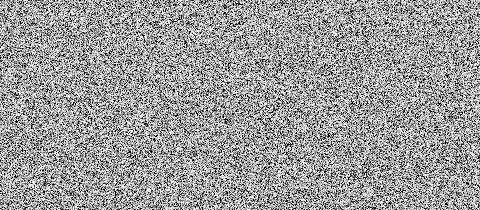

# LLaDA模型预训练与微调实战

<div style="display:flex;justify-content:center;">
  <figure style="text-align:center;margin:0;">
    
  </figure>
</div>

> 作者信息：情感机器实验室研究员-李馨雨  
> 邮箱：wind.340171@gmail.com

**📚资料**

- **代码**：[llada-pretrian-sft](https://github.com/828Tina/llada-pretrain-sft)
- **数据集**：[pretrain](https://www.modelscope.cn/datasets/allenai/c4)，[sft](https://www.modelscope.cn/datasets/AI-ModelScope/alpaca-gpt4-data-zh)
- **模型**：[llada-8b](https://www.modelscope.cn/models/GSAI-ML/LLaDA-8B-Base)
- **SwanLab**：[llada-swanlab](https://swanlab.cn/@LiXinYu/llada-sft/overview)

本次教程代码源于[dllm](https://github.com/ZHZisZZ/dllm)，里面有完整的llada模型预训练以及微调方法，在此感谢作者开源llada训练框架🙏。

<div style="display:flex;justify-content:center;">
  <figure style="text-align:center;margin:0;">
    
  </figure>
</div>

## 目录

[[toc]]

## 简介

缺图

在前面的章节中，我们展示了很多关于自回归模型的训练方法，哪怕是多模态模型，其中LLM部分也是基于自回归模型的（第六章）。在我们的课程里并没有完整的关于diffusion模型，也就是扩散模型的训练方法。本次教程我们就来实现diffusion模型的预训练以及微调，其中**微调为核心，预训练仅做尝试以及验证相关论文中的论点即可。**

其中扩散模型我们选择LLaDA模型，微调数据集还是采用经典的instruct数据集alpaca，预训练数据集经过多次试验，我们采用C4数据集来进行训练。


## LLaDA原理

### LLaDA原文解读

### diffusion模型训练scaling law论文解读

### 总结

## 完整训练

### 1. 环境安装

- 克隆代码

```bash
git clone https://github.com/828Tina/llada-pretrain-sft.git
cd llada-pretrain-sft
```

- 安装环境

```bash
pip install -r requirements.txt -i https://mirrors.aliyun.com/pypi/simple/
```

- 硬件要求

1. $5090个数 \ge 2$
2. `Pytorch` $\ge$ 2.7，CUDA适应自己的版本，我的是12.8

<div style="background:#e7f8ff;color:#000;padding:12px 16px;border-left:4px solid #20c0ff;">
由于5090是比较新的GPU，安装环境的时候会有比较多的问题，我在<a href="http://localhost:5173/course/llm_train_course/07-audio/1.cosyvoice-sft/README.html#_1-%E7%8E%AF%E5%A2%83%E5%AE%89%E8%A3%85" target="_blank" rel="noopener">CosyVoice</a>一篇中已经汇总了解决办法，可以前往查看。
</div>

### 2. 数据处理


### 3. 训练代码


#### 预训练


#### 微调


## SwanLab观测结果

## 结果测试

## 参考文献


