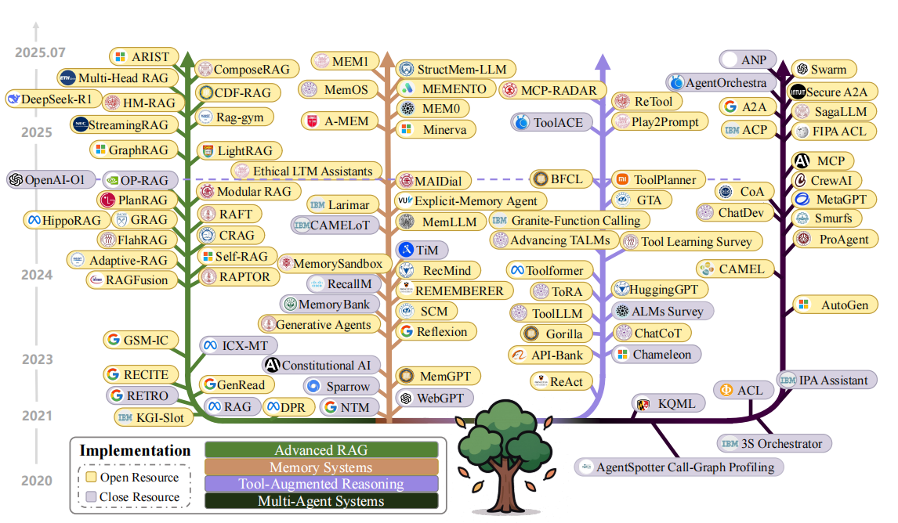

# 前言

在学习提示词工程之前，我们提出一个疑问，为什么需要提示词工程？对于这个问题，我们需要从提示词的发展说起。

以 BERT 为代表的预训练模型掀起了一场技术变革，彼时主流的技术范式是 “预训练 - 微调”：研究者们先在大规模通用语料上训练出基础模型，再针对具体任务（如文本分类、情感分析）在小规模标注数据上进行微调，通过调整模型参数来适配特定场景。这种模式虽然在众多任务中取得了优异效果，但也存在明显局限 —— 对标注数据的强依赖使得它在低资源场景中难以施展，且不同任务需要单独微调，模型的通用性受到制约。

提示词能很好的解决这个问题。预训练后的大模型本身是具备零样本回答能力的[1]，在没有举任何例子的情况下只要多一句`Let's think step by step`，模型就能自主思考，无需微调，不过需要注意的是，大模型在高参数量的时候效果会很好，当参数量较少的时候，即便再怎么调整提示词，模型都不一定能完美表达正确的意思，这源于大模型的涌现能力[2]，简单点说，如果一个大模型本身比较“笨”，那你再怎么问、再怎么修改提示词，人家也回答不出来。

而随着大语言模型技术的不断成熟，“预训练 - 提示 - 预测” [3]这一范式逐渐成为主流，这也让提示词的价值被彻底释放。就像我们前面说的，大模型在预训练阶段已经吸收了海量知识，提示词就像是一把钥匙，能把这些知识激活并引导到具体任务中。比如面对一道复杂的数学题，直接问答案可能会出错，但加上 “请分步骤推导” 这样的提示，模型就能顺着逻辑一步步拆解问题，这正是提示词对模型思维的引导作用。

这种无需微调就能解决问题的特性，让提示词在实际应用中变得越来越重要。要知道，不是所有场景都有足够的标注数据来做微调，也不是所有团队都有能力承担微调的成本。这时候，一句精准的提示词就能让大模型在零样本或少样本的情况下完成任务，大大降低了使用门槛。但我们也要清楚，提示词的效果和模型本身的能力紧密相关。只有当模型参数量达到一定规模，涌现出足够强的理解和推理能力时，提示词才能发挥最大作用。要是模型本身 “底子薄”，哪怕提示词设计得再精巧，也很难得到理想的结果。

提示词工程应运而生。它不是简单的文字组合，而是要结合模型特性、任务需求来设计提示策略。怎么让提示词更清晰地传达任务目标？怎么通过提示规避模型的常见错误？怎么在不同模型上调整提示方式以获得最佳效果？这些都是提示词工程要解决的问题。也正因如此，学习提示词工程，其实就是学会如何更好地和大模型 “沟通”，让这一强大的技术工具真正为我们所用，这也是我们深入研究它的意义所在。

✅ <strong>我们的所有代码均可在 <a href="https://github.com/828Tina/PromptEngineeringCourse" target="_blank" rel="noopener">GitHub</a> 查看。</strong>

## 提示词工程与上下文工程

上下文工程作为新出的概念，和提示词工程的区别简单来说是包含的关系，提示词工程 $\subset$ 上下文工程。

Context Engineering（上下文工程 ），聚焦于大语言模型（[LLM](https://zhida.zhihu.com/search?content_id=260080027&content_type=Article&match_order=1&q=LLM&zhida_source=entity)）场景下，对“上下文（Context）”进行专业处理与优化的角色，核心是让LLM更高效、精准利用信息完成任务 。简单说，就是搭建、管理LLM“信息输入 - 处理”通道，让模型“聪明干活”。也包括了Prompt,RAG,FunctionCalling等内容。

这里的处理不仅包括对提示词内容的处理，让输出更加精准、符合预期，还可以从资源利用角度，比如显存的占用，更加高效运用现有资源。

提示词工程只处理提示词，上下文工程因为要处理上下文，因此历史记录、RAG、工具调用都归上下文工程管理，概念更偏向于Agent。

我们可以从下图中了解二者的关系：

- Prompt Engineering（提示词工程）主要是激发LLM做好单一件事情，适合处理流程简单的工作。
- Context Engineering（上下文工程）是利用LLM处理更加复杂，更加系统的任务，更加符合这个智能Agent的时代。

在最新的Context Engineering综述[5]中详细解释了Context Engineering的概念，文章搜集了1400多篇论文资料，对上下文工程的每一个模块做了详细的概述，作者将上下文工程分为三个部分，分别是**上下文检索与生成（Context Retrieval and Generation）、上下文处理（Context Processing）、上下文管理（Context Management）**。简单来说：
- **`上下文检索与生成（Context Retrieval and Generation）`**：为模型搜集和构建合适的上下文内容
- **`上下文处理（Context Processing）`**：优化模型对已获取的上下文信息进行加工、变换和优化
- **`上下文管理（Context Management）`**：对上下文进行高效的存储、记忆和优化 

我们来详细的说明每一部分运用的知识组件。

1、**`上下文检索与生成（Context Retrieval and Generation）`**

“上下文检索与生成”侧重于为模型搜集和构建合适的上下文内容，文中指出上下文检索的基础是提示词工程与上下文生成。

- `提示词工程`通过精准指令引导模型思考，比如加入 “让我们一步步思考” 的引导语，或提供示例问答，这本质上是通过语言设计推动模型走向正确推理方向。
- 更关键的是`外部知识检索`。由于大模型的预训练知识固定，必须通过外部获取新信息增强上下文。检索增强生成（RAG）技术就是典型应用：在回答前从文档库或数据库中调取相关资料插入上下文，让回答有据可依，大幅降低编造概率。关键词搜索、向量匹配等技术能将最新知识 “喂给” 模型。
- 复杂场景还需要`动态上下文拼装`。智能助手需整合用户档案、对话记录、知识库文章等分散信息，通过程序或代理自动构建 “上下文工厂管道”，将原始信息加工成模型可直接使用的输入内容。

2、**`上下文处理（Context Processing）`**

“上下文处理”关注对已获取的上下文信息进行加工、变换和优化 。当上下文很长或信息结构复杂时，直接塞给模型可能效率低下甚至无法处理，此时需要在输入模型前进行预处理。

- `长上下文处理`是核心挑战。传统 Transformer 对长文本敏感，研究者提出高效注意力机制（如 FlashAttention）、分块滑动窗口、递归总结等技术，可在窗口限制内处理百万级内容。例如将一本书逐级摘要压缩，既适配模型长度又保留关键信息。
- `自我优化与适应`则利用模型自身能力改进上下文，比如插入分步解析或中间结论，让模型先 “反思” 再作答；通过自我纠错逐步逼近正确结果，提升复杂推理准确性。
- `多模态上下文处理`需将图像、音频等非文本信息编码为模型可理解的形式。如图像问答中，用视觉模型提取图片要点并转化为文字描述，再融入文本上下文。多模态大模型（如 GPT-4V）正推动这一领域发展。
- 结构化信息整合强调利用知识图谱、表格等结构化数据，将杂乱文本转化为清单式要点，或通过代码转换格式，让模型更易吸收逻辑化数据。

3、**`上下文管理（Context Management）`**

“上下文管理”关注的是对上下文进行高效的存储、记忆和优化 。随着交互进行，模型累积的上下文会越来越庞大，如何在有限窗口内保留关键信息、丢弃无用信息，并在需要时快速提取，这是上下文管理要解决的问题。

- `硬约束`下的取舍需通过上下文压缩技术平衡信息量：多轮对话中总结早期内容为要点，或即时压缩用户大段文本，让后续调用仅参考精华，避免窗口浪费和噪音干扰。
- `层次化记忆体`系类似计算机缓存设计：近期对话存于短期工作记忆，久远重要内容归档至长期记忆（向量数据库、文件等），需用时通过检索提取。外部存储扩展了模型 “记忆容量”，实现跨会话持续记忆。
- `上下文优化`通过重排序（重要内容后置，契合模型注意力偏好）、格式优化（改为问答形式）、噪音过滤等技术提升有效性。高级技巧还包括调整信息排布适配模型注意力模式，或生成辅助信息作为隐藏上下文。
- 最后值得一提的，是上下文管理的应用场景 。在对话智能体中，做好上下文管理意味着模型能“记住”用户先前提过的偏好、不再重复询问已知信息，从而提供连贯的多轮服务。在工具调用场景，良好的上下文管理可通过状态变量跟踪已调用工具的结果，让模型避免重复调用或使用过期信息。在多人会话或多代理系统中，则需要管理各方的上下文视野，决定哪些信息对谁可见、如何在Agents之间共享。由此可见，上下文管理是构建复杂 **Memory System 和 Agent System**的基础，其效果直接决定了模型交互的连贯性和智能水平 。

在实际工程中，上述基础组件通常会集成到完整的系统架构中，从而打造出功能强大的智能应用。当前比较典型的上下文工程系统实现主要有以下几类 ：检索增强生成（RAG）、记忆系统、工具增强推理和多智能体系统。论文详细整理了每个类别都有哪些已经发表的工作。

它们各自侧重于不同的应用场景，但都利用了上下文工程的理念，将相关信息/工具动态注入模型上下文来提升性能。下面我们详细解释下。

1. 检索增强生成（RAG）
我们在前文提到，RAG为了解决大模型幻觉问题，将外部知识检索融入到模型生成过程中，简单说，RAG 模型在回答用户请求时，会先根据请求内容从知识库中`检索`相关资料，将这些资料和原始提问一起提供给 LLM，然后由 LLM 生成结合了这些资料的回答。这样模型的知识不再局限于训练参数中固有的内容，还可以`动态访问`最新的、领域专门的信息。

2. 记忆系统（Memory Systems）
`记忆系统`致力于让模型拥有`持续的、跨会话的记忆能力`。它通过引入外部或内部的记忆模块，使模型可以“记住”过去的信息，并在需要时将其作为上下文提供给模型。传统的 LLM 在完成一次回答后状态即清空，无法自行记忆先前对话或交互。而一个上下文工程良好的记忆系统，则会持久存储与用户交互或任务相关的内容，并在后续交互中检索召回，形成一种长短期记忆结合的机制。

3. 工具增强推理（Tool-Integrated Reasoning）
`工具增强`推理是指让模型能够调用外部工具或API来协助完成任务，并将这些`工具使用过程的结果纳入上下文`。这一机制使 LLM 从被动的“文本生成者”升级为可以与外界交互的“主动智能体”。通过上下文工程，我们可以在提示中嵌入工具的使用说明和接口文档，然后当模型决定使用某个工具时，由外部程序实际执行该工具，将返回结果再注入模型上下文供其后续处理。

4. 多智能体系统（Multi-Agent Systems）
当一个任务过于复杂或需要不同技能时，往往会引入`多个智能体（Agents）协同工作`。这就产生了多智能体系统，其核心在于通过上下文工程来`协调多个模型间的交流与分工`。在这种架构下，不再是单一LLM面对一切，而是多个LLM（或混合了工具的Agent）各司其职、互相通信，共同完成目标。
多智能体系统的一个关键是通信协议和语言的设计。Agent 间交流的消息本质上也是上下文的一部分。上下文工程需要制定统一的消息格式、角色定义和交互规则，以确保 Agent 彼此理解。

其次，多Agent系统需要`编排与调度机制`。即在一个复杂任务中，如何决定下一个该由哪个Agent发言，或者某个Agent何时该暂停等待他人结果。这可以由固定脚本实现，也可以交给一个“控制Agent”通过上下文信息（比如任务完成度）来动态判断。

---

## 参考文献

[1].[Large Language Models are Zero-Shot Reasoners](https://arxiv.org/pdf/2205.11916)

[2].[Emergent Abilities of Large Language Models](https://arxiv.org/pdf/2206.07682)

[3].[Pre-train, Prompt, and Predict: A Systematic Survey of Prompting Methods in Natural Language Processing](https://dl.acm.org/doi/pdf/10.1145/3560815)

[4].[Context Engineering(上下文工程)——大模型Agent时代非常值得学习的概念](https://zhuanlan.zhihu.com/p/1926063515296315200)

[5].[A Survey of Context Engineering for Large Language Models](https://arxiv.org/abs/2507.13334)