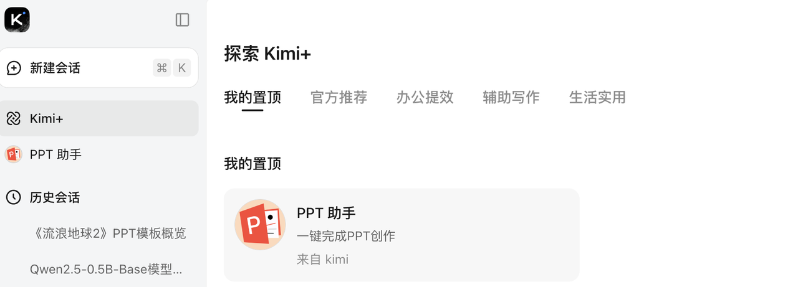
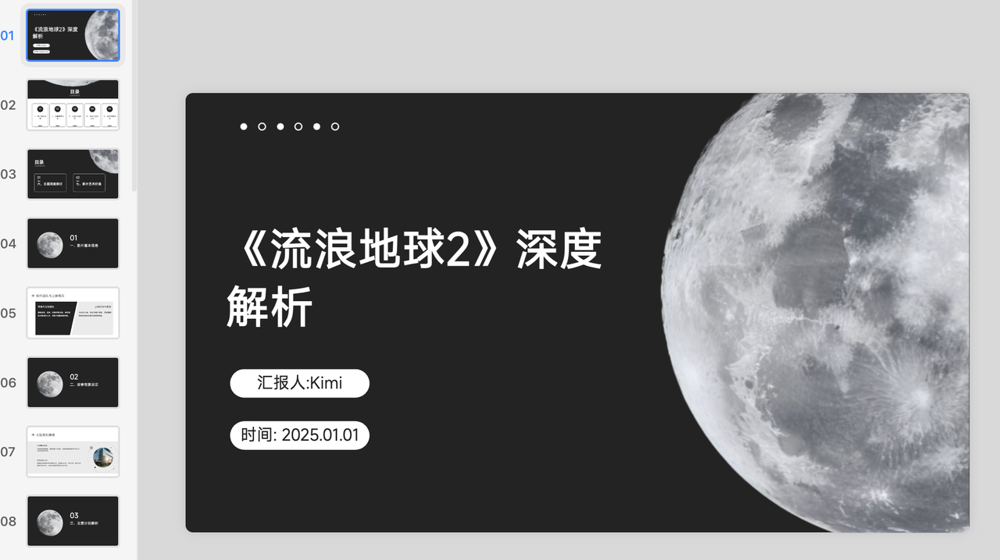

# 3.3 提示词要素

提示词（Prompt）是向大语言模型传递任务指令的文本，其设计质量直接影响模型输出的效果，提示词，尤其是指令的构建需要注意一些核心要素，掌握了这些核心要素，大模型就能够不经过微调训练等得到符合预期的回复。


## 明确任务类型

要非常具体地说明你希望模型执行的指令和任务。提示越具描述性和详细，结果越好。特别是当你对生成的结果或风格有要求时，这一点尤为重要。不存在什么特定的词元（tokens）或关键词（tokens）能确定带来更好的结果。更重要的是要有一个具有良好格式和描述性的提示词。事实上，在提示中提供示例对于获得特定格式的期望输出非常有效。

- 使用动词（如 “总结”“生成”“解释”“翻译”）明确任务类型。 示例：

```Plain
❌ "北京的天气"
✅ "请生成一篇关于北京天气的简短报告"
```

- 限定输出格式：指定所需的输出形式（如 JSON、列表、诗歌）。 示例：

```Plain
请以JSON格式列出三个编程语言及其特点：
```


## 明确任务目标

在明确了任务类型，比如是问答类型的话，你可能需要对任务目标加以约束，比如让大模型做什么、不做什么。下面我们举个例子。

大模型由于知识广泛，回答问题的时候发散性思维比较强，因此有时候的回答会带有他的分析，比如我们想要计算一个简单的数学问题，并且只想要得到结果的数字：

*提示词* ：

```Plain
请你计算出3*13的结果
```

*回答* ：

```Plain
3乘以13的结果是39。
```

可以看到结果往往是一句话，但是我们希望只有数字，那么我们可以在原有以示词的基础上进行修改：

*提示词* ：

```Plain
请你计算出3*13的结果，仅输出结果，不要输出任何其他内容。
```

*回答* ：

```Plain
39
```

这里设计提示词的技巧是，让大模型知道要做什么，不要做什么，同时把目标明确，这样（说要做什么）更加的具体，并且聚焦于（有利于模型生成良好回复的）细节上。


## 提供上下文信息

- 提供充足的文本信息或者背景知识，这点在文本摘要、信息提取任务中尤为重要

示例：

```Plain
上下文：2025年7月8日，国家航天局宣布，嫦娥七号探测器计划于2026年发射，将开展月球南极环境与资源勘查。据悉，嫦娥七号将搭载4台国际合作载荷，包括与欧洲空间局合作的月表负离子分析仪。
输入数据：仅告诉嫦娥七号的发射时间
```

- 当使用少样本提示的时候，需要补充些例子作为前文信息

示例：

```Plain
Q: 苹果公司成立于哪一年？  
A: 1976  

Q: 爱因斯坦获得诺贝尔奖是在哪一年？  
A:
```


## 结构化提示词

我们在使用提示词的时候往往会直接把文本、问题等一股脑全部输入到大模型的输入中，但是实际上我们可以通过严格控制提示词的格式来提升模型输出的质量，因为结构化的提示词汇更具可控性，尤其是在需要精确格式或复杂任务的场景中。

想象一下，如果输入的新闻数据是以下格式：

```Plain
2025年7月8日，国家航天局宣布，嫦娥七号探测器计划于2026年发射，将开展月球南极环境与资源勘查。据悉，嫦娥七号将搭载4台国际合作载荷，包括与欧洲空间局合作的月表负离子分析仪。
```

如果询问嫦娥七号的降落地点，模型需要回顾上下文，然后给出“降落地点是月球南极”这样的回答，这并不标准，但是如果输入数据是这样的json格式：

```JSON
{"事件类型": "科技新闻","时间": ["2025年7月8日", "2026年"],"地点": ["月球南极"],"组织": ["国家航天局", "欧洲空间局"],"关键数据": ["4台"]}
```

那么想要得到“月球南极”这样的答案无疑是容易的，这是输入的上下文的结构化，而如果对于提示词本身，也可以做结构化改造。

不过json格式的改造对于提示词来说还是有点难度，我们通常使用markdown格式来结构化。Markdown 是一种轻量级标记语言，常用于格式化文本（如表格、列表、代码块）。结构化提示词可以使用 Markdown 语法来表达，但核心是 “结构化” 的思想，而非特定语言。

我们举一个例子：

*提示词* ：

```Plain
# 任务：提取电影信息
请从以下文本中提取关键信息，按要求填写：

## 待分析文本
"电影《流浪地球3》将于2027年春节上映，导演是郭帆，主演包括吴京和刘德华，票房预期50亿。"

## 提取要求
- 类型：______
- 上映时间：______
- 导演：________
- 主演：______
- 票房预期：______

## 输出格式
直接填写上述空白，保持列表结构。
```

*回答* ：

```Plain
- 类型：电影
- 上映时间：2027年春节
- 导演：郭帆
- 主演：吴京, 刘德华
- 票房预期：50亿
```

这个例子用 `#` 标题区分任务模块，用 `-` 列表明确提取项，用 `##` 分隔不同内容块，是典型的 Markdown 结构化提示词，简洁且格式清晰。

好了，我们已经学会了提示词的结构和要素，在接下来的章节中，我们将尝试更高级的提示词使用技巧。


## 复杂任务拆解

大模型和人类一样，哪怕在现实生活中，如果Leader给你分配了一个比较复杂、内容较多的任务，经验丰富的你大概率会先列出任务细节，也就是大纲，然后对着大纲的每一步进行细化，比如实验步骤、完成时间、分配员工等，细化完后就开始每一步的完成细节了。大模型也是同样，比如做一个统计公司研发投入计划、资源配置等要素的PPT，如果你仅仅是把财务报表数据、整体PPT风格、要完成的目标交给大模型，大模型估计会给你一个乱七八糟的PPT出来，但是如果你先用大模型根据你的要求生成PPT的内容模板，然后再让大模型根据你的模板生成对应风格的PPT，那么显然最终的效果和你预计的目标就会更加接近。

*提示词* ：

```Plain
## 文本内容：
《流浪地球 2》是由郭帆执导的科幻灾难电影，于 2023 年上映，故事围绕《流浪地球》前作展开，以计划建造 1 万座行星发动机的时代为背景。

在不远的未来，太阳急速衰老膨胀，即将吞噬太阳系，地球面临灭顶之灾。为应对危机，地球各国成立联合政府，提出数百个自救计划，其中 “移山计划”“方舟计划”“逐月计划” 和 “数字生命计划” 进入论证阶段。“移山计划” 由中国提出，旨在建造 1 万座行星发动机推动地球前往新家园；“方舟计划” 是美国提议的在地球同步轨道建立空间站以带领人类逃离；“逐月计划” 由俄罗斯提出，想改造月球为逃生舱，后因月球结构等问题并入 “移山计划”；“数字生命计划” 则是将人类意识数字化，实现永生，但最终被伦理委员会禁止。经过考量，“移山计划” 被选定，人类开始着手建造行星发动机，同时准备建造卫星发动机以放逐月球，摆脱月球引力。

然而，计划推进过程中危机四伏。2044 年，太空电梯基地遭遇危机，处在 9 万公里高度的方舟空间站爆炸坠落，引发连锁反应，导致太空电梯基地被摧毁，流浪地球计划面临重大挑战。影片中，满腔赤诚的刘培强（吴京饰）历经层层考验成为航天员大队的一员，他与韩朵朵（王智饰）在此过程中相知相恋，而刘培强也在后续故事中为了地球和家人，不断经历着艰难抉择与挑战。

另一边，量子科学家图恒宇（刘德华饰）则与 “数字生命计划” 紧密相关。他致力于将女儿图丫丫的意识数字化，即使该计划被禁止，他也未放弃。在一系列意外后，图恒宇自己也意外进入数字世界，以一种特殊的方式继续参与到拯救地球的行动中，他在数字空间中的经历，也为影片增添了一层神秘的 “元宇宙” 色彩。

联合政府中国代表周喆直（李雪健饰）则在国际舞台上，为 “移山计划” 的推进四处奔走，面对各方压力和危机，他始终坚定信念，相信人类能够团结起来拯救地球，展现出了强大的责任感与使命感。

随着故事发展，月球发动机建造完成，但却因未知原因被启动，月球开始向地球逼近，引发了全球性的灾难，地震、海啸等灾害频发，人类再次面临生死考验。为了阻止月球撞击地球，人类决定启动行星发动机，利用其推力将月球推离。在这一过程中，无数普通人与主角们一起，克服了重重困难，最终成功放逐月球，为地球开启流浪之旅奠定了基础。

《流浪地球 2》通过展现刘培强、图恒宇、周喆直等众多角色的经历，以及全球人类在末日危机下的挣扎与抗争，呈现了一个宏大而震撼的科幻世界，探讨了人类面对绝境时的生存选择、亲情、责任与勇气等主题，传达出 “人类命运共同体” 理念和 “没有人的文明，毫无意义” 的深刻内涵，以其壮观的视效和动人的情节，成为中国科幻电影的重要代表作。

## 任务：
请从上述文本中提取出主要信息，然后写出PPT模板，按照markdown格式输出
```

*回答* ：

~~~Plain
以下是一个基于《流浪地球 2》的主要信息创建的PPT模板，采用Markdown格式展示：

```markdown
# 《流浪地球 2》概览

## 基本信息
- 导演：郭帆
- 上映时间：2023年
- 类型：科幻灾难片

## 故事背景
- 太阳急速衰老膨胀，即将吞噬太阳系，地球面临灭顶之灾。
- 各国联合政府提出多种自救计划，包括：
  - 移山计划：中国提出的建造1万座行星发动机推动地球前往新家园。
  - 方舟计划：美国提出的在地球同步轨道建立空间站以带领人类逃离。
  - 逐月计划：俄罗斯提出的改造月球为逃生舱，后并入移山计划。
  - 数字生命计划：将人类意识数字化，实现永生，但最终被伦理委员会禁止。

## 主要计划及进展
- **移山计划**：中国提出，中国开始建造1万座行星发动机。
- **卫星发动机**：同时建造用于放逐月球，摆脱月球引力。
- **方舟计划**：美国提出，建立在地球同步轨道上的空间站。
- **逐月计划**：俄罗斯提出，改造月球为逃生舱。
- **数字生命计划**：将人类意识数字化，实现永生。

## 挑战与危机
- **太空电梯基地危机**：2044年，太空电梯基地遭遇危机，方舟空间站爆炸坠落，引发连锁反应，导致基地被摧毁。
- **月球发动机启动**：月球发动机建造完成，因未知原因被启动，月球开始向地球逼近，引发全球性灾难。
- **行星发动机启动**：为阻止月球撞击地球，人类决定启动行星发动机，将月球推离。

## 角色介绍
- **刘培强**：吴京饰，航天员大队成员，与韩朵朵相知相恋，面对抉择和挑战。
- **图恒宇**：刘德华饰，量子科学家，致力于将女儿的意识数字化，最终进入数字世界。
- **周喆直**：李雪健饰，联合政府中国代表，为“移山计划”推进四处奔走。

## 主题探讨
- **人类命运共同体**：展现人类团结一致面对绝境。
- **生存选择、亲情、责任与勇气**：探讨人类在末日危机下的挣扎与抗争。
- **没有人的文明，毫无意义**：传达深刻内涵。

## 结论
《流浪地球 2》以其壮观的视效和动人的情节，成为中国科幻电影的重要代表作。
```

这个PPT模板简洁明了地展示了《流浪地球 2》的主要信息，帮助观众快速了解剧情背景、角色和主题等核心内容。
~~~

这样我们就简单生成了一个模板，接下来我们把它丢给Kimi的PPT一键生成，我们可以在Kimi的工具栏里找到



选择合适的模板风格，我们就能快速获得PPT了，



不过，很显然如果直接让大模型生成模板也可以，但是由于没有拆解成小任务依次执行，一旦其中某一步需要修改，重新让模型生成是一个很耗时耗力的过程，因此学会拆解复杂任务能够帮助模型更好的理解任务目标以及实现。


