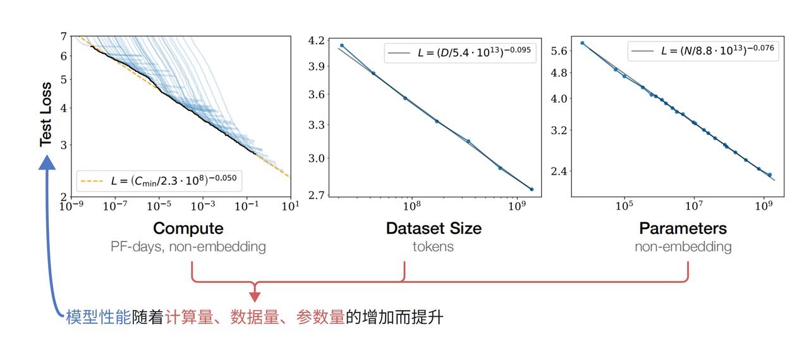
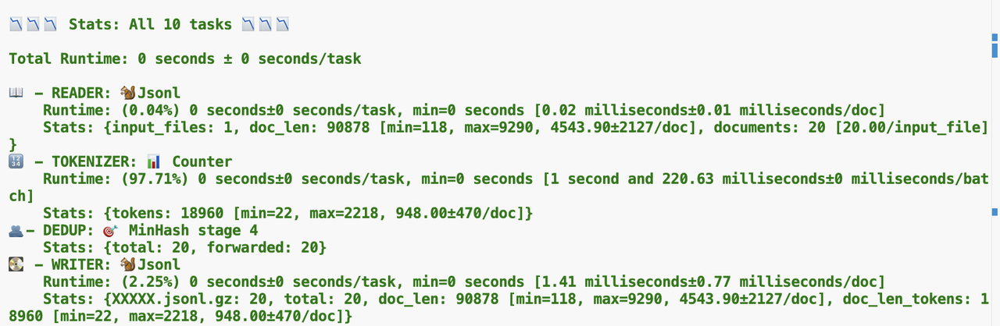

# 预训练阶段的合成数据

## 预训练阶段合成数据的重要性

我们知道，早期的大模型（204年前），大模型的性能提升着重于预训练阶段，早期提到的[Scaling Law法则](https://arxiv.org/pdf/2001.08361/1000)中，我们得知，模型规模、数据规模和模型性能之间呈现幂律增长的趋势，当模型参数量和训练数据规模同时增长的时候，模型性能有稳定的提升。下图展示了Scaling Law的图表原理[1]：

<div style="display:flex;justify-content:center;">
  <figure style="text-align:center;margin:0;">
    
    <figcaption>Scaling Law原理图</figcaption>
  </figure>
</div>


因此在当时的学者看来，训练数据越多，模型就能越大，模型表现就能越好，这不难理解，就跟人类18岁以前的学习一样，15-18岁必然比12岁左右懂得知识多，理解也会更深刻。

在大模型发展的早期，OpenAI的GPT系列模型可谓是AI领域的领头羊，其中GPT-3，后面经过后训练得到的GPT-3.5不仅拥有超大规模的参数量（175B，当然现在的模型参数量甚至有1TB，但在当时已经是模型规模的极限），而且在零样本/少样本领域能力突出，拥有2k多tokens窗口的上下文理解能力，在各个领域的应用都非常显著。而能拥有如此强大的通用性能力，和预训练阶段庞大的数据规模密不可分，在GPT-3的论文里[Language Models are Few-Shot Learners](https://proceedings.neurips.cc/paper_files/paper/2020/file/1457c0d6bfcb4967418bfb8ac142f64a-Paper.pdf)，作者给出GPT-3的训练数据分布[2]：

<div style="display:flex;justify-content:center;">
  <figure style="text-align:center;margin:0;">
    
    <figcaption>GPT-3的训练数据分布</figcaption>
  </figure>
</div>


根据Scaling Law法则得知，这个规模的数据对应的模型规模175B已经是模型性能提升的极限，而在[洪永淼、汪寿阳：ChatGPT 与大模型将对经济学研究范式产生什么影响?](https://mp.weixin.qq.com/s?__biz=MzI0NzY3MzkzNw==&mid=2247485830&idx=1&sn=5a4111e768b12233909d1af0b096a1f4#:~:text=ChatGPT的第一个版本GPT-1，其参数数量为1.17亿，这是非常庞大的数量。在GPT-2版本中，模型参数数量从1.17亿上升到15亿，训练数据也增加了。在GPT-3版本中，参数数量达到1750亿个，并使用大约2%2F3互联网数据、整个维基百科以及2个大型图书馆数据进行训练。)一文中指出，GPT-3的预训练模型使用大约2/3互联网数据、整个维基百科以及2个大型图书馆数据进行训练，由于数据需要经过去重、清洗，事实上，GPT-3预训练使用的互联网数据规模基本是能获取的数据规模极限，因此模型规模也没有再有提升的空间。

但是我们知道对于科学的探索是无止境的，在数据和模型规模都到达瓶颈的情况下，如何提升模型性能呢？

[Textbooks Are All You Need](https://arxiv.org/pdf/2306.11644)这篇论文思考在预训练阶段如果对数据质量提升，能否提升模型性能。

作者给出的答案是肯定的，并且开创性的在论文中提出，预训练阶段“教科书”级数据能够给模型带来非常不错的提升，并且认为后面的大模型的发展取决于合成数据，当然从现在看来，这并不是模型发展的未来，在2025年的今天，模型发展到了后训练阶段。不过即便如此，在当今社会，合成数据仍然是各个AI行业不可或缺的一环。

我们接着回到论文的讨论，作者认为，在预训练阶段，数据集的质量集中在`多样性`、`去除噪声`以及`教科书`。

`1、多样性`：

这一点其实很好理解，所有的大模型在预训练阶段既要保证数据主题的广泛性，要涵盖尽可能多的知识点，也要保证数据不会有明显的重复。

重复数据对于模型训练来说基本是毁灭性的打击，如果数据中存在大量重复内容（例如同一篇文章被多次收录），模型会优先 “记住” 这些重复信息，而非学习背后的通用模式，泛化能力降低，同时会人为放大某类信息的占比，导致模型误以为这类信息更重要或更常见。

`2、去除噪声`：

我们知道训练大规模语言模型，预训练数据大多来源于互联网数据，在互联网中存在大量会干扰模型学习有效规律、导致模型学到错误模式或者降低泛化能力的内容，比如网页中存在的各种营销类文本、HTML 标签（如`<div>`、`<p>`）、表格乱码，同时可能存在大量无意义内容，比如很多的随机字符如 （“qwertyuiop”）、重复堆砌的短句（如 “加油加油加油……”）、空白或乱码（如 “�￥%”）。

在常见任务示例中，我们使用Qwen2.5-base模型有可能会出现大量无意义重复表情包，这很有可能是预训练数据集中存在的噪声未被及时清理并且训练过拟合。因此去除噪声是保证数据质量的又一关键要素。

不过需要注意的是，高质量的判定并不包含Toxic信息，也就是有毒内容，因为即便是涉及安全类信息，只要不是重复性高、多样化程度低的数据其实都算高质量数据，而有毒内容的剔除往往是后训练阶段处理。

`3、教科书数据`：

其实我认为这一概念的提出和当时学者对于大模型的定位有关，在攻克了自然语言处理任务后，大模型充当问答辅助工具或者对话工具，而如果跟现实联系起来，大模型就很像是经验丰富的“老师”，那要想成为这样的老师，学习“教科书”数据显然能够大幅度提升模型的能力，但是这类数据在网络上其实并不多，大多数还是类似于科普类专业数据。即便将所有的“教科书”数据提取出来并数据清洗去重，得到的结果其实也有偏向，比如数学类比较多，文学类比较少，这样训练出来的模型很有可能发生过拟合的现象。

基于此，Phi论文[3]的作者认为可以用大模型合成“教科书”数据，一来GPT-3拥有广泛的知识储备和问答能力，合成的数据自然在`多样性`上不会有问题，并且合成的`噪声`也不会很多；其次因为强大的零样本/少样本学习能力，模型能够很好的理解提示词并生成高质量的回答，只要设定好对应的`受众群体`，比如对于面向年幼儿童的教科书，内容需要使用非常简单、日常的语言和短句，以便10岁左右的孩子能够轻松理解；对于面向专业人士和研究人员的教科书，内容则需要深入探讨主题，包括对最新研究成果和领域内辩论的批判性分析；而对于面向高中生的教科书，内容需要平衡教育的严谨性和可访问性。使用的语言和例子应该能够与青少年学生产生共鸣，同时激发他们对日常生活相关性的好奇心。对于不同的`受众群体`，提示词的构建也会有相应的调整，在[huggingface的博客](https://huggingface.co/blog/zh/cosmopedia)中提到了*少儿、专业人士和研究人员以及高中生生成相同主题的教科书的提示：*[4]

<div style="display:flex;justify-content:center;">
  <figure style="text-align:center;margin:0;">
    
    <figcaption>少儿、专业人士和研究人员以及高中生生成相同主题的教科书的提示</figcaption>
  </figure>
</div>


而面对不同的群体，哪怕是同一个知识点，不同群体之间的关联度其实很低，你将化学元素周期表跟小孩子讲，他们大概率连字都不认识，而对于高中生而言，这只不过是他们日常试题的一部分，因此这样生成的数据，即便背后的知识一致，也不会导致重复性数据，从而训练过拟合，而这样生成的数据，规模是成倍增长的，并且由于大部分知识可以从网络知识中获取，那么“教科书”数据可以确保数据质量和规模。

不过，为了保证模型不会完全在“教课”这一条路上走到黑，Phi的作者将网络数据和教科书数据混合训练模型，成果相当不错，不过模型规模只有3B，因为Scaling Law法则的影响，毕竟数据规模就那么大，模型规模也大不到哪里去。那我们就提出疑问了，既然“教科书”数据这么强，何不把所有的网络数据改造成合成数据？这样数据规模扩大了，那模型规模不也能接着扩大？

答案是不行。事实上预训练阶段模型训练的其实是“常识”，对于网络数据源，其中的专业知识类是必不可少的，如果转换成“教科书”，训练出来的模型就会偏向于各个阶段的教育，这其实也是一种降低泛化能力的行为。那如果将“教科书”数据和大规模网络数据混合呢？

答案也是不行，因为就像是数学类比较多，文学类比较少的这种有明确占比的网络中的教科书数据，如果只是简单的叠加这类数据，事实上是增加“教科书”数据的占比，那么模型训练的结果必然是偏向于这一类的，从而导致通用泛化能力降低。

讲了这么多，其实对于预训练阶段，使用大模型合成数据确实能够提升模型的整体性能，而这类数据需要注意`多样性`、`去除噪声`以及可以适当采用`教科书数据`，这些都是保证预训练阶段数据质量的关键。

## 预训练数据举例

由于Phi论文中并没有明确提及如何合成的数据，huggingface团队为复现[Phi-1.5](https://arxiv.org/abs/2309.05463)过程中所遇到的挑战及其解决方案，构建了包含数十亿词元的合成数据集[cosmopedia](https://huggingface.co/datasets/HuggingFaceTB/cosmopedia)，当然还有采样了100k条数据的[cosmopedia-100k](https://huggingface.co/datasets/HuggingFaceTB/cosmopedia-100k)。

<div style="display:flex;justify-content:center;">
  <figure style="text-align:center;margin:0;">
    
    <figcaption>cosmopedia数据集示例</figcaption>
  </figure>
</div>


该数据集首先在网络上收集大量数据，其中`seed_data`就代表词源信息，然后由于受众群体`audience`的不一样，根据不同的任务类型`format`，提示词`prompt`会进行相应的构建，然后利用GPT-3.5生成相应的回答，也就是我们最终需要预训练数据`text`。

我们可以用Qwen2.5-3B-Instruct模型进行一波尝试，就比如采用cosmopedia数据第一条中的prompt转换成中文形式输出相应的预训练数据，点击可以查看完整数据：

<details>
<summary>目标受众是小学生时提示词与数据</summary>

*提示词* ：

```Plain
以下是一个网页的摘录：

#贴现率计算器

由博士候选人Tibor Pál创建

Arturo Barrantes和Adena Benn评论

由博士候选人Tibor Pál创建
Arturo Barrantes和Adena Benn评论
基于Cipra， T.金融与保险公式（2010）的研究
最后更新:2023年2月2日

我们创建了这个贴现率计算器来帮助您估计给定支付流的贴现率。更具体地说，您可以计算给定现值和未来值的贴现率，也可以计算附加支付流（例如年金）的贴现率。

请继续阅读并了解以下内容：
•贴现率的定义是什么？
•贴现率公式是什么？
•如何计算贴现率？
要通过贴现率计算现值，您可能需要查看我们的现值计算器。

贴现率的定义是什么？

贴现率是贴现现金流量（DCF）分析中用于确定未来现金流量现值的利率。贴现率是一个重要的比较基础，因为它是

创建一个与上面的片段相关的教育片段，目标受众是小学生。不应该使用像电磁学和集成这样复杂的大学课程，因为小学通常不会教这些课程。如果这就是这个片段的内容，那就找一个更简单的科学替代方法来解释，并使用日常示例。例如，如果主题是“线性代数”，你可以讨论如何将物体排成一行或列来帮助解决难题。

避免使用专业术语和LaTeX，只讨论简单的小学水平的主题。马上开始教育部分。
```

*数据* ：

```Plain
好的，让我们为小学生们设计一个关于贴现率的简单教育片段。我们可以用一些日常生活中熟悉的概念来解释这个概念。

大家好！今天我们要聊聊一个有趣的概念——贴现率。想象一下，你有一笔钱存起来，比如你的压岁钱，或者从爸爸妈妈那里得到的零花钱。这些钱放在口袋里不动，随着时间的推移，它们会变多吗？当然不会，因为它们只是在银行里放着，银行会给你一点小利息作为回报。这个小利息就是贴现率！

## 贴现率的定义

贴现率就像是银行给你的“租金”。当你把钱存到银行里时，银行会给你一定的利息，这个利息就叫做贴现率。如果你把钱存得越久，银行就会给你越多的利息。所以，贴现率就像是一把尺子，用来测量你的钱随着时间的增长。

## 贴现率公式

虽然这个公式可能看起来有点复杂，但其实很好理解。贴现率公式可以帮助我们算出未来某一天，这笔钱会变成多少。比如，如果你现在有10元钱，银行给你1%的贴现率，那么一年后你就有10元 + 1元 = 11元。这就像你在银行存了一年的钱，银行给了你1元的利息。

## 如何计算贴现率

假设你有一个好朋友，他答应过你一年后送你一个玩具，这个玩具现在值50元。为了公平起见，你想知道这个玩具在未来一年内会变成多少钱，这样才能决定现在是否应该把100元存下来。这里，你就可以用贴现率来计算。

1. 首先，你需要知道这个玩具现在的价值（称为现值），也就是50元。
2. 然后，你需要知道你希望这个玩具在未来的价值（称为未来值），比如100元。
3. 最后，你用贴现率来算出这个玩具在未来一年内会变成多少钱。

## 小练习

想象一下，你现在有10元钱，你想存到银行里，让银行给你一定的贴现率，让你的钱变多。假设银行给你2%的贴现率，一年后你会有多少钱呢？（答案：10元 + 10元 × 2% = 10元 + 0.2元 = 10.2元）

好了，今天的分享就到这里啦！记住，贴现率就像是银行给你的“租金”，帮你把现在的东西变成未来的东西。希望你下次听到这个词时，能立刻想到这个有趣的概念哦！
```

</details>


<details>
<summary>目标受众是专业人员时提示词与数据</summary>

而如果我们将提示词中关于受众群体更改为专业人员，情况又会如何，下面的例子仍采用上述提示词，前半部分完全相同，因此以省略符号替代：

*提示词* ：

```Plain
……

创建一个与上面的片段相关的教育片段，目标受众是专业研究人员，他们学习了关于这些课程的内容，可以用专业术语来进行科普。
请马上开始教育部分。
```

*数据* ：

```Plain
## 贴现率及其在金融与保险中的应用

## 贴现率的定义

贴现率（Discount Rate）在金融与保险领域具有重要地位，它是一种用来衡量未来现金流价值的比率。在进行投资决策、评估项目收益或是评估资产价值时，贴现率被广泛应用于现值（Present Value, PV）的计算。贴现率本质上是一个折现率，它表示了将未来一定时期内的一系列现金流折算到现在时点的价值。

在贴现现金流（Discounted Cash Flow, DCF）分析中，贴现率通常被视为一项无风险收益率，用于调整预期未来现金流至当前的价值。贴现率的高低直接影响到现金流现值的大小，从而对投资决策产生重大影响。

## 贴现率公式

贴现率的核心计算公式为：
\[ PV = \frac{CF}{(1+r)^n} \]
其中，
- \( PV \) 是现值，
- \( CF \) 是未来某时刻的现金流，
- \( r \) 是贴现率（折现率），
- \( n \) 是时间（通常以年为单位）。

通过上述公式，我们可以计算出某一特定未来时刻的现金流在当前时点的价值。在实际操作中，为了简化计算过程，有时会采用复利贴现率，即：
\[ PV = CF \times (1 + r)^{-n} \]

## 如何计算贴现率

在金融模型中，贴现率的选择对最终结果至关重要。通常情况下，贴现率的选择会基于市场条件、行业标准或特定项目的预期风险水平。对于投资者而言，贴现率一般由投资者的风险承受能力和预期回报率决定；而对于企业而言，则可能基于其资本成本或机会成本来设定。

贴现率的确定可以利用多种方法，包括但不限于：
1. **加权平均资本成本（WACC）**：这是综合考虑不同资本来源成本的一种方法，常用于企业内部项目评估。
2. **风险调整贴现率（Risk-Adjusted Discount Rate, RADR）**：这种方法考虑了特定项目的风险溢价，使得贴现率能够反映项目的额外风险。
3. **市场贴现率**：基于当前市场的整体风险偏好来设定贴现率，适用于一些标准化的项目评估。

## 现值计算器的应用

为了方便计算，我们提供了一个贴现率计算器，该工具可以帮助您根据给定的现值、未来值以及附加支付流（如年金）来计算相应的贴现率。通过现值计算器，您可以更直观地理解贴现率在实际应用中的重要性及其如何影响现金流的价值评估。
```

</details>


<div style="background:#e7f5ff;color:#000;padding:12px 16px;border-left:4px solid #74c0fc;">   从上述提示词的举例类比可以看出，同样的数据源，当提示词中受众目标更改，最终生成的预训练数据完全不同，相互之间关联度很低，专业人员所面对的一大堆公式，在受众群体是小学生时一点都没有提到，那么数据重复性就无从谈起，而且由于是大模型合成的数据，生成的文案在质量上有所保障，同时也可以确保规模，哪怕是3100k条数据也能保证多样性。<br></div>

## 合成预训练数据代码实践

其实构建Phi模型的团队在论文[5] [6]里仅说明了数据集的构成来源以及数量，但是并没有详细说明数据的内容、如何处理数据的，因此Huggingface团队生成含数十亿词元的合成数据集以复现 [Phi-1.5](https://arxiv.org/abs/2309.05463) 过程中所遇到的挑战及其解决方案，由此最终创建了 [Cosmopedia](https://huggingface.co/datasets/HuggingFaceTB/cosmopedia) 合成数据集[7]。该团队根据论文中提供的信息，从网络以及各个教育平台获得“种子数据”，然后由“种子数据”通过大模型合成扩大到3000万条的规模。

该团队获得的“种子数据源”分别是网络数据和教育数据，其中网络数据占比最高，高达83%，还有纯粹的教育数据由16%，最后还有其他少量指令数据。

<div style="display:flex;justify-content:center;">
  <figure style="text-align:center;margin:0;">
    
    <figcaption>cosmopedia数据集示例</figcaption>
  </figure>
</div>


该huggingface团队还提供了复现代码[8]，其中将合成步骤简单总结为三步，分别是：

1. 合成prompt
2. 根据prompt生成数据
3. 数据筛选、去重等

我们提供了简易的生成代码，链接[在这](https://gitlab.115lab.club:9000/lixinyu/prompt_engineering_tutorial/-/tree/main/5.synthetic_data/pretrain_data_generation?ref_type=heads)，代码构成如下：

```Plain
pretrain_data_generation/
├── generation.py             # 数据生成
├── utils.py                  # openai接口设计以及其他工具等
├── data/                     # 生成的数据保存地址
└── data_process/               # 数据处理
    ├── minhash_logs/           # 生成的哈希去重log
    ├── minhash_results/        # 哈希去重结果
    ├── data_depulication.py    # 数据去重
    └── data_format_conversion.py  # 数据格式转换
```

下面我们按照步骤依次执行：

### 1、合成prompt

由于数据集包含大量的网络数据，但是huggingface团队提供的比如生成web网络数据的prompt的[代码](https://github.com/huggingface/cosmopedia/blob/main/prompts/web_samples/build_web_prompts.py#L48)里，数据集无法获取，不过该合成prompt的思想还是提示词+网络数据（上下文），具体的prompt可以参考[官方的提示词](https://github.com/huggingface/cosmopedia/blob/main/prompts/web_samples/build_web_prompts.py#L6)：

*提示词模板：*

```Plain
"wikihow":
"""Here is an extract from a webpage: "<INSERT_EXTRACT>".

Write a long and very detailed tutorial that could be part of WikiHow whose title is related to the extract above<ADD_TOPIC>. Include in depth explanations for each step and how it helps achieve the desired outcome, inluding key tips and guidelines. 
Ensure clarity and practicality, allowing readers to easily follow and apply the instructions. Do not use images.""",
 
```

`<INSERT_EXTRACT>`是网络数据放入的地方。

为了方便起见，我们直接获取[HuggingFaceTB/cosmopedia-100k](https://huggingface.co/datasets/HuggingFaceTB/cosmopedia-100k)的prompt就行（因为我们只需要学习如何生成的思想，具体操作可以查阅网络数据填充对应的地方批量生成prompt）。

我们下载数据集到本地，可以使用`modelscope`下载数据集到本地

```Bash
modelscope download --dataset swift/cosmopedia-100k data/train-00000-of-00002.parquet --local_dir ./dir
```

然后查看第一条数据：


我们使用prompt作为我们后续生成的模板即可。


### 2、根据prompt生成数据

为快速、高效的生成数据，我们采用vllm框架实现，使用Qwen2.5-3B-Base模型，在开头环境安装和平台准备中，我们提醒道，因为vllm把本地的GPU完全利用，因此显存占用会比较高，3B的模型需要37-38GB左右，如果资源受限，可以使用更小的模型尝试，不过生成效果就不一定很好了。

我们先开启vllm，模型采用本地保存的模型地址：

```Bash
vllm serve /home/lixinyu/weights/Qwen2.5-3B
```

然后运行生成代码：

```Bash
python generation.py
```

<div style="background:#fff3cd;color:#5b3200;padding:12px 16px;border-left:4px solid #ffeaa7;">   ⚠️ <strong>注意</strong><br/>   不过需要注意的是，我们仅为了提供示例，下载.parquet格式数据，读取的时候也针对.parquet格式，如果你采用的是完整数据，请<strong>调整下面的代码</strong>： </div>


我们的例子中只生成了20条数据，只需要两分钟时间，生成结果如下：


接下来我们看下如何处理数据。


### 3、数据筛选、去重等

首先关于数据筛选，huggingface团队给出的[HuggingFaceTB/cosmopedia-100k](https://huggingface.co/datasets/HuggingFaceTB/cosmopedia-100k)数据集已经经过了筛选环节，我们只是使用筛选后的数据集进行生成，因此这里不多赘述，有兴趣了解的朋友可以查看[官方给出的web数据筛选代码](https://github.com/huggingface/cosmopedia/blob/main/prompts/web_samples/filter_and_classify_clusters.py)，其实就是预设题目筛选，我们主要来实现数据去重。

cosmopedia团队利用[datatrove库](https://github.com/huggingface/datatrove)中的Minhash实现数据去重，[代码在此](https://github.com/huggingface/cosmopedia/tree/main/deduplication)，然后我们的代码在这👉[ours](https://github.com/828Tina/PromptEngineeringCourse/tree/main/5.synthetic_data/pretrain_data_generation)。

因为我们不需要Slurm集群来实现大规模数据去重，仅仅实现少量数据，因此我们使用本地的服务器就行，对于官方代码中的所有`SlurmPipelineExecutor`改成`LocalPipelineExecutor`，具体原理可参考[datatrove的本地pipeline](https://github.com/huggingface/datatrove?tab=readme-ov-file#localpipelineexecutor)设置。

这段代码通过 Minhash 算法，也就是哈希去重的方法实现文本去重，哈希去重通过将任意长度文本转化为固定长度哈希值，既能大幅压缩数据规模，又能利用 “相同文本生成相同哈希值” 的特性快速判断重复，避免直接比对原始文本的冗余计算。其计算速度快且存储成本低，非常适合海量数据场景，像 Minhash 这类算法还能捕捉文本相似性，不仅检测完全重复，还能识别高度相似内容。同时，结合分桶、聚类等策略可进一步减少比对次数，显著提升大规模数据处理的效率，最终实现高效、精准的重复内容识别与过滤。

整个流程分四个阶段完成重复检测与过滤。

- 首先配置 Minhash 参数，包括哈希精度、桶数量和每个桶的哈希数，这些参数直接影响去重精度和效率。MinhashDedupSignature 组件为每条英文文本数据生成独特签名然后保存，签名作为文本的紧凑表示，在保留特征的同时减少数据量，且通过多进程并行处理提升效率。
- 第二阶段进行签名分桶匹配，从签名文件夹读取数据，按配置的桶数量将相似签名文本归入同一桶中。这种分桶策略缩小了后续比较范围，避免全量两两比对，大幅提高处理效率。
- 第三阶段基于桶结果聚类，从桶文件夹读取数据，将重复文本聚合成簇，确定需移除的重复数据 ID，明确重复文本对象，为最终过滤做准备。
- 第四阶段完成重复过滤：这一阶段再次读取原始数据，指定文本字段为 “generated_text”（我们的数据保存到这里，当然也可以命名其他字段）；然后依据 remove_ids 信息过滤重复数据，被移除数据由 exclusion_writer 保存到 removed 文件夹，剩余非重复数据单独保存。

运行下面的代码👇：

```bash
python data_depulication.py
```



当看到上图表示完成数据去重，并且成功保存好数据，保存好的文件是gz压缩包，我们可以执行下面的代码👇，将压缩包文件转换成jsonl文件，这样你就完成了最终的数据去重操作。

```Bash
python data_format_conversion.py
```

其实从上面的结果中，我们可以知道，所有数据都没有重复的，这是当然的，因为：

1. 我们的数据量很少，仅作为例子，20条数据想重复都比较难
2. 我们随机从100k条（当然我们只下载了50k条）数据，从中随机选择20条prompt，主题重复的概率极低，那生成的数据的重复的概率也很低

<div style="background:#e8f5e9;color:#000;padding:12px 16px;border-left:4px solid #81c784;">
  ✅ 我们完成所有的步骤仅为了完整实现利用大模型实现预训练合成数据的操作，如果要进行大规模数据合成需要收集<strong>足量的种子源数据（互联网数据）</strong>，然后参考我们的教程的思想。
</div>


## 参考文献

[1].[Scaling Laws for Neural Language Models](https://arxiv.org/pdf/2001.08361)

[2].[GPT-1, GPT-2, GPT-3, GPT-3.5, GPT-4论文内容解读](https://blog.csdn.net/BGoodHabit/article/details/130134446?ops_request_misc=%257B%2522request%255Fid%2522%253A%25226ee3a9ef15f6a61581e883f22d069f12%2522%252C%2522scm%2522%253A%252220140713.130102334.pc%255Fblog.%2522%257D&request_id=6ee3a9ef15f6a61581e883f22d069f12&biz_id=0&utm_medium=distribute.pc_search_result.none-task-blog-2~blog~first_rank_ecpm_v1~rank_v31_ecpm-1-130134446-null-null.nonecase&utm_term=gpt&spm=1018.2226.3001.4450)


[3].[Textbooks Are All You Need II: phi-1.5 technical report](https://arxiv.org/pdf/2309.05463)

[4].[Cosmopedia: how to create large-scale synthetic data for pre-training](https://huggingface.co/blog/zh/cosmopedia)

[5].[Textbooks Are All You Need](https://arxiv.org/pdf/2306.11644)

[6].[Textbooks Are All You Need II: phi-1.5 technical report](https://arxiv.org/pdf/2309.05463)

[7].[Cosmopedia: how to create large-scale synthetic data for pre-training](https://huggingface.co/blog/zh/cosmopedia)

[8].[https://github.com/huggingface/cosmopedia](https://github.com/huggingface/cosmopedia?tab=readme-ov-file)
