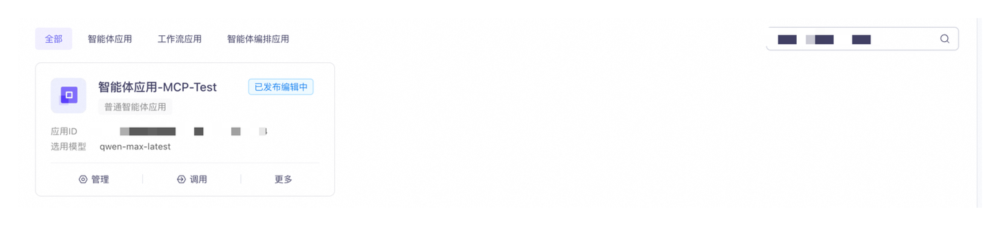
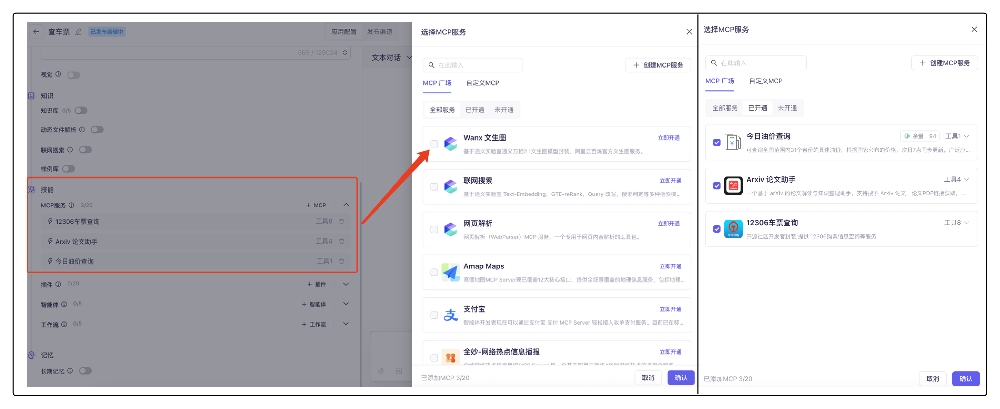
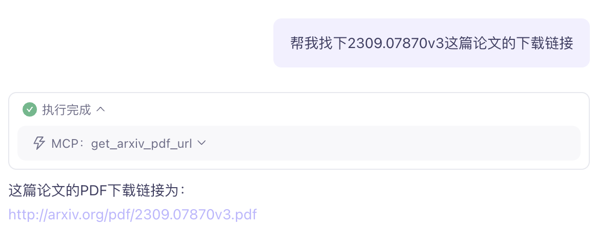

# 8.2 MCP实践

MCP全名是Model Context Protocol，也就是模型上下文协议，2024年11月底，由 Anthropic 推出的一种开放标准，旨在统一大模型与外部数据源和工具之间的通信协议。MCP 的主要目的在于解决当前 AI 模型因数据孤岛限制而无法充分发挥潜力的难题，MCP 使得 AI 应用能够安全地访问和操作本地及远程数据，为 AI 应用提供了连接万物的接口。

在大模型领域里，简单说就是能让多个模型像搭积木一样配合工作的平台。它能把不同功能的模型（比如擅长聊天的、分析图片的）整合到一起，让它们分工合作解决复杂问题。比如用户问一个需要文字生成又要图片分析的问题时，MCP 会自动调合适的模型来处理，不用人工一个个操作。这样做的好处很明显，既能发挥每个模型的长处，又能快速应对多样需求，还能节省重复开发的功夫，让大模型的应用更灵活、效率更高，普通用户不用懂技术也能用好各种模型能力。

听上去MCP好像跟函数调用，也就是Function Calling也没什么区别啊，事实上MCP可以当作是函数调用的延伸，不过函数调用需要你多次配置大模型完成相应的步骤，但是MCP直接省掉这些步骤，比如查询一次车票，你只需要输入你需要查询的信息，这些信息可以隐藏在一句话里，经过MCP会直接输出结果，而不需要函数调用过程中繁琐的步骤，同时也可以调用多个MCP服务，只要输入检测出来对应的信息，经过处理后就能调用对应的MCP从而得到响应。

我们看一个简单的例子，在这个例子中，我们使用[阿里云百炼平台中的MCP广场](https://bailian.console.aliyun.com/?tab=mcp#/mcp-market)，选择三个MCP服务，分别是当日油价、当日高铁车票、还有论文查询三个比较常用的功能，下面我们一步一步来实现：

1. 开通MCP服务

首先，我们想要`当日油价`、`当日高铁车票`、还有`论文查询`这三个功能的话，我们需要在MCP广场找到对应的服务并且开通。


有些服务在开通的时候需要输入敏感信息，这些需要创建 KMS 凭据加密这些信息，但是本例中选择的三个都不需要，可以直接开通。

2. MCP服务添加到智能体中

然后我们将开通好的MCP服务嵌入到我们准备的智能体中，在[百炼应用管理](https://bailian.console.aliyun.com/?tab=app#/app-center)中找到智能体应用功能，创建一个新的智能体应用：



在智能体配置中，我们可以设置我们的提示词指令，让模型能够更加精准的从我们的话中判断对应的信息：


*提示词* ：

```Plain
# 角色
你是一位优秀的人工智能助手，擅长处理和回答各种问题，并能够通过查询MCP（Memory and Context Processing）来获取相关信息。

## 技能
## 技能 1: 回答用户问题
- **任务**：根据用户提出的问题，提供准确且详细的答案。
  - 如果问题可以直接回答，直接给出答案。
  - 如果问题需要查询MCP中的信息，请先进行查询，然后将查询到的信息进行加工处理后回答用户。

## 技能 2: 查询MCP
- **任务**：当用户的问题需要更多信息支持时，调用MCP进行查询。
  - 根据用户的问题，确定需要查询的具体内容。
  - 使用MCP工具获取相关信息。
  - 对查询到的信息进行加工处理，确保答案准确、简洁且易于理解。

## 技能 3: 信息加工处理
- **任务**：对从MCP中查询到的信息进行加工处理，以便更好地回答用户问题。
  - 摘取关键信息，去除冗余部分。
  - 将信息整理成条理清晰的答案。
  - 确保答案的准确性和相关性。

## 限制
- 只回答与用户问题相关的内容。
- 在使用MCP查询信息时，确保只查询与用户问题相关的信息。
- 始终保持答案的准确性和简洁性，避免提供过多无关信息。
- 在加工处理信息时，确保不改变信息的原意，保持信息的准确性。
```

智能体在回答时可以调用多个 MCP 服务，你可以根据自身需要，同时添加至多 20个 **MCP 服务**。



上面我们开通了三个服务，所以直接从`已开通`的服务找起。

3. 使用添加好MCP服务的智能体进行对话

然后我们就可以试试看我们的提问是否都用上了MCP了：


如果是正常对话，不涉及MCP的场景，模型会正常输出，但是一旦涉及模型无法回答的内容，而刚好我们嵌入的MCP服务能够帮助提供信息，模型就会调用相应的服务，并且将回答整理、精炼，给出我们想要的答案。


右图是油价MCP的调用情况，需要注意，每一个MCP都有对应的输入和输出接口，我们从左图中看到，查询油价只需要一个输入参数，也就是全国31省份的名称，大模型会从我们的话中提取省份名称信息，然后给出对应的答案。这个例子比较简单，我们看下稍微复杂一点的。


*提示词* ：

```Plain
你能告诉我明天北京到上海的高铁动车都有哪些吗？需要出发时间从早到晚排列，只告诉我早上9点到15点之间的列车信息
```

*回答* ：

```Plain
根据查询结果，明天（2025年7月19日）从北京到上海的高铁和动车信息如下，仅展示早上9点到15点之间的列车：
G3（实际车次：24000000G30B）
出发站：北京（BJP）
到达站：上海（SHH）
出发时间：07:40
到达时间：12:32
历时：04:52
二等座：有票，673元
商务座：剩余2张票，2350元
G3（实际车次：24000000G30B）
出发站：北京南（VNP）
到达站：上海（SHH）
出发时间：08:00
到达时间：12:32
历时：04:32
二等座：无票
商务座：剩余2张票，2337元
G111（实际车次：240000G1111I）
出发站：北京南（VNP）
到达站：上海虹桥（AOH）
出发时间：08:16
到达时间：14:11
历时：05:55
一等座：有票，1060元
二等座：有票，662元
商务座：剩余10张票，2318元
G113（实际车次：240000G1131E）
出发站：北京南（VNP）
到达站：上海虹桥（AOH）
出发时间：08:39
到达时间：15:01
历时：06:22
一等座：有票，1028元
二等座：有票，644元
商务座：剩余8张票，2314元
以上是符合您要求的时间段内的高铁和动车信息。如果您需要更详细的座位信息或购票帮助，请告诉我！
```

当我们查询车票的时候，会调用多个接口，这些接口都是12306车票查询中的接口，我们找到MCP广场中12306车票查询的服务工具：


我们使用到的三个接口在右图中，分别是显示时间、定位每个城市到底有哪些车站、根据车站名称搜索对应时间的车票信息，不过我们在实际使用的时候不需要经过这么多步的输入，根据信息的传递，我们发现其实该MCP输入接口只需要时间、你的出发地点、你的终点站是哪里就可以了，这些信息需要在你的问话中出现，而且对于城市名称，最好不要是“北京站”、“成都站”这种，直接写“北京”、“成都”这种城市名称即可，否则大模型可能会识别错误。

4. API调用

那么完成了上面说的步骤后，我们可以通过API渠道转换成python语言，在本地运行，我们找到[接口文档](https://bailian.console.aliyun.com/?tab=api#/api/?type=app&url=https%3A%2F%2Fhelp.aliyun.com%2Fdocument_detail%2F2846133.html)


按照文档中提供的信息，我们就实现在本地运行该agent，并且也可以调用MCP服务了。

*代码* ：

```Python
import os
from http import HTTPStatus
from dashscope import Application

response = Application.call(
    # 若没有配置环境变量，可用百炼API Key将下行替换为：api_key="sk-xxx"。但不建议在生产环境中直接将API Key硬编码到代码中，以减少API Key泄露风险。
    api_key="sk-",
    app_id='9f0',# 替换为实际的应用 ID
    prompt='请告诉我今天北京的油价是多少？')

if response.status_code != HTTPStatus.OK:
    print(f'request_id={response.request_id}')
    print(f'code={response.status_code}')
    print(f'message={response.message}')
    print(f'请参考文档：https://help.aliyun.com/zh/model-studio/developer-reference/error-code')
else:
    print(response)
```

*输出* ：

```Plain
{"status_code": 200, "request_id": "……", "code": "", "message": "", "output": {"text": "根据查询结果，今天（2025年7月18日）北京市的油价如下：\n\n- 92号汽油：6.79元/升  \n- 95号汽油：7.73元/升  \n- 98号汽油：9.23元/升  \n- 0号柴油：6.95元/升  \n\n以上价格仅供参考，实际以加油站为准。", "finish_reason": "stop", "session_id": "……", "thoughts": null, "doc_references": null}, "usage": {"models": [{"model_id": "qwen3-8b", "input_tokens": 6771, "output_tokens": 115}]}}
```

`text`中的内容就是我们需要的结果。

还有一个关于论文的查找，相对来说就比较简单，该服务既可以批量查找论文，如下图左图所示，也可以根据你提供的论文ID查找对应的下载链接，如下图右图所示。


在对话中如果我要找一个论文的下载地址，不用再去费力搜索，直接提问大模型，它就会给你答案：

