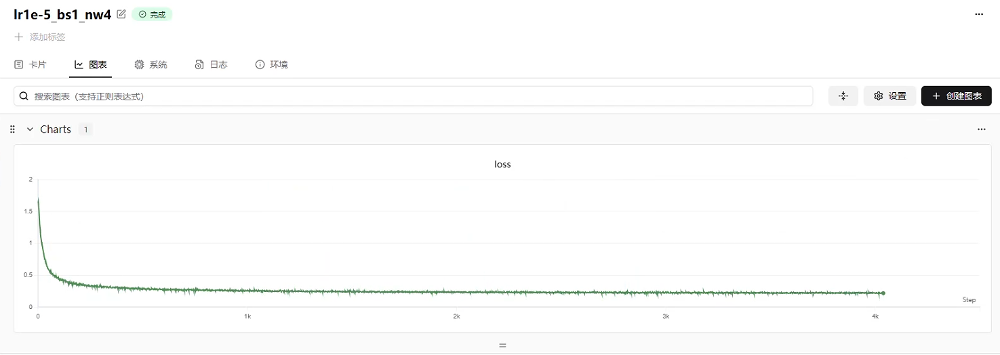
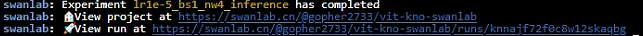
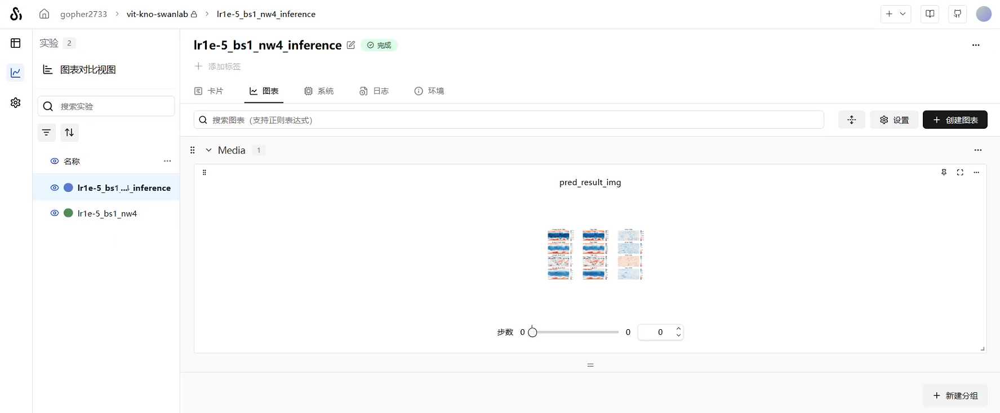
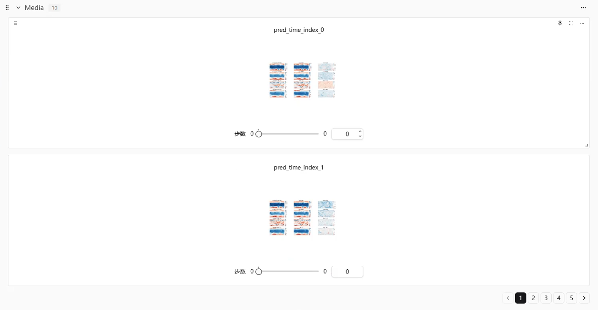

# Vit-KNO 气象预测


## 概述

天气与人类的生产生活、经济活动及社会运行息息相关。准确的天气预报不仅能在灾害天气中降低损失、保障安全，还能为能源、农业、交通、娱乐等行业带来可观收益。

传统的数值天气预报依赖气象卫星、观测台站和雷达等数据，通过求解复杂的大气动力学方程实现预测，但计算量巨大、耗时较长。相比之下，基于数据驱动的深度学习方法能显著降低计算成本，提高预测效率。

MindSpore Earth 是基于昇思 MindSpore 打造的地球科学智能套件，支持多时空尺度（短临、中期、长期）以及降水、台风等灾害性天气的 AI 预测，旨在为科研人员与教育用户提供高效、易用的智能气象预测软件。

本文展示如何在华为昇腾 NPU 上，结合 MindSpore 与 MindEarth 训练气象预测模型 ViT-KNO，并通过 SwanLab 实时记录训练指标与可视化结果。


## 环境与依赖

- **操作系统**: Ubuntu 22.04
- **编程语言**: Python 3.10
- **环境/依赖管理**: uv
- **计算卡配置**: 华为鲲鹏910B2x * 1卡， 64GB 显存
- **CANN**: 8.0.0
- **CPU**: 24 vCPU Kunpeng-920，220GB内存
- **深度学习框架**: MindSpore 2.6.0
- **科学计算框架**: MindEarth 0.3.0 / r0.7
- **实验管理与可视化**: SwanLab 平台

对于Mindspore的安装可参考 [Ascend NPU & MindSpore | SwanLab官方文档](https://docs.swanlab.cn/guide_cloud/integration/integration-ascend.html#安装mindspore) 。

安装 MindSpore Earth 库可参阅 [MindSpore Earth 0.3](https://www.mindspore.cn/mindearth/docs/zh-CN/r0.3/mindearth_install.html) 。

可在 [koopman_vit](https://gitee.com/mindspore/mindscience/tree/r0.7/MindEarth/applications/medium-range/koopman_vit) 获取 `ViT-KNO` 模型的源码，注意此处 gitee 分支版本是 r0.7，与Mindspore Earth 0.3版本对应。


## 获取数据集

本项目使用的是 [WeatherBench](https://download.mindspore.cn/mindscience/mindearth/dataset/WeatherBench_1.4_69/) 数据集，该数据集是一个主要用于中期天气预报和次季节至季节尺度天气预报研究的基准数据集。

在开始训练前，需要在 `vit_kno.yaml` 配置文件中修改 root_dir 参数，用于指定数据集的存放路径，默认是  `./dataset` 。完成配置后，项目将根据该路径加载训练与验证所需的数据文件。

数据集存放于 `./dataset` 目录下，其内部结构示例如下：

```sh
.
├── statistic
│   ├── mean.npy
│   ├── mean_s.npy
│   ├── std.npy
│   └── std_s.npy
├── train
│   └── 2015
├── train_static
│   └── 2015
├── train_surface
│   └── 2015
├── train_surface_static
│   └── 2015
├── valid
│   └── 2016
├── valid_static
│   └── 2016
├── valid_surface
│   └── 2016
├── valid_surface_static
│   └── 2016
```


## 目录结构

除数据集路径在 `vit_kno.yaml` 配置文件中指定，其他文件建议的项目结构如下：

```sh
.
├── vit_kno.yaml              # 模型与训练的配置文件
├── src/
│   ├── __init__.py           
│	├── callback.py
│	├── solver.py
│	├── utils.py
├── main.py          		  # 主训练脚本
└── summary/                  # SwanLab日志与Checkpoint存储目录,自动生成
```

**完整代码如下**

vit_kno.yaml：

```yaml
model:
  name: koopman_vit
  backbone: "ViTKNO"
  encoder_depth: 16
  # encoder_depth: 8
  # encoder_depth: 1
  encoder_network: False
  encoder_embed_dim: 768
  # encoder_embed_dim: 384
  # encoder_embed_dim: 192
  num_blocks: 16
  # num_blocks: 8
  # num_blocks: 1
  mlp_ratio: 4
  dropout_rate: 1.
data:
  name: "era5"
  root_dir: "/root/autodl-tmp/dataset"
  feature_dims: 69
  data_sink: False
  pressure_level_num: 13
  patch: True
  patch_size: 8
  batch_size: 1
  t_in: 1
  t_out_train: 1
  t_out_valid: 20
  t_out_test: 20
  valid_interval: 1
  test_interval: 1
  train_interval: 1
  pred_lead_time: 6
  data_frequency: 6
  train_period: [2015, 2015]
  valid_period: [2016, 2016]
  test_period: [2017, 2017]
  grid_resolution: 1.4
  num_workers: 4
optimizer:
  name: "adam"
  weight_decay: 0.0
  epochs: 100
  finetune_epochs: 10
  warmup_epochs: 1
  initial_lr: 0.005
summary:
  summary_dir: "./summary"
  valid_frequency: 200
  save_checkpoint_epochs: 1
  keep_checkpoint_max: 1
  plt_key_info: True
  key_info_timestep: [6,72,120]
  ckpt_path: ""
train:
  name: "oop"
  distribute: False
  amp_level: O2
  load_ckpt: False
```

src目录下的完整源代码存放于 MindScience 官方代码库的 Gitee 镜像中。具体路径为：`https://gitee.com/mindspore/mindscience/tree/r0.7/MindEarth/applications/medium-range/koopman_vit/src`

main.py:

```python
import os
import numpy as np
import matplotlib.pyplot as plt

from mindspore import context, Model
from mindspore import dtype as mstype
from mindspore.train import load_checkpoint, load_param_into_net
from mindspore.train import DynamicLossScaleManager
from mindspore import _checkparam as Validator
from mindspore.train.callback._callback import Callback, _handle_loss
from mindspore._c_expression import collect_host_info, get_clock_syscnt
from mindspore.train.callback import LossMonitor, TimeMonitor
from mindspore.train import CheckpointConfig, ModelCheckpoint

from mindearth.cell import ViTKNO
from mindearth.utils import load_yaml_config, create_logger, plt_global_field_data, make_dir
from mindearth.data import Dataset, Era5Data, SIZE_DICT
from mindearth.module import Trainer

from src.callback import EvaluateCallBack, InferenceModule, Lploss, CustomWithLossCell

import swanlab

context.set_context(mode=context.GRAPH_MODE, device_target="Ascend", device_id=0)

config = load_yaml_config('vit_kno.yaml')
config['model']['data_sink'] = True  # 是否使用data sink特性

config['train']['distribute'] = False  # 是否执行分布式任务
config['train']['amp_level'] = 'O2'  # 设置混合精度等级

config['data']['num_workers'] = 1  # 设置并行计算的进程数量
config['data']['h_size'], config['data']['w_size'] = SIZE_DICT[1.4]  # 设置气象分辨率参数

config['optimizer']['epochs'] = 100  # 设置epoch数量
config['optimizer']['finetune_epochs'] = 1  # 设置微调epoch数量
config['optimizer']['warmup_epochs'] = 1  # 设置预热epoch的数量
config['optimizer']['initial_lr'] = 0.00001  # 设置初始化学习率

config['summary']["summary_dir"] = './summary'  # 设置模型checkpoint的存储路径
make_dir(os.path.join(config['summary']["summary_dir"], "image"))
logger = create_logger(path=os.path.join(config['summary']["summary_dir"], "results.log"))

swanlab.init(
    project="vit-kno-swanlab",
    experiment_name="lr1e-5_bs1_nw4",
    config=config
)

data_params = config["data"]
model_params = config["model"]
compute_type = mstype.float32

model = ViTKNO(image_size=(data_params["h_size"], data_params["w_size"]),
               in_channels=data_params["feature_dims"],
               out_channels=data_params["feature_dims"],
               patch_size=data_params["patch_size"],
               encoder_depths=model_params["encoder_depth"],
               encoder_embed_dims=model_params["encoder_embed_dim"],
               mlp_ratio=model_params["mlp_ratio"],
               dropout_rate=model_params["dropout_rate"],
               num_blocks=model_params["num_blocks"],
               high_freq=True,
               encoder_network=model_params["encoder_network"],
               compute_dtype=compute_type)

loss_fn = Lploss()
loss_net = CustomWithLossCell(model, loss_fn)

"""SwanLabMonitor Callback class."""
class SwanLabMonitor(Callback):
    def __init__(self, per_print_times=10):
        super(SwanLabMonitor, self).__init__()
        Validator.check_non_negative_int(per_print_times)
        self._per_print_times = per_print_times

    def on_train_step_end(self, run_context):
        cb_params = run_context.original_args()
        collect_host_info("Callback", "LossMonitor", "train_epoch_end", start_time=get_clock_syscnt(), level=1)
        loss = _handle_loss(cb_params.net_outputs)
        totle_step_nums = cb_params.cur_step_num
        if cb_params.cur_step_num % self._per_print_times == 0:
            swanlab.log({"loss": loss}, print_to_console=True)

    def on_train_end(self, run_context):
        print("train end")
        swanlab.finish()


class ViTKNOEra5Data(Era5Data):
    def _patch(self, *args):
        """ Partition the data into patches. """
        x = args[0]
        if self.run_mode == 'valid' or self.run_mode == 'test':
            x = x.transpose(1, 0, 2, 3)
        return x

class ViTKNOTrainer(Trainer):
    r"""
    Self-defined forecast model inherited from `Trainer`.

    Args:
        config (dict): parameters for training.
        model (Cell): network for training.
        loss_fn (str): user-defined loss function.
        logger (logging.RootLogger): tools for logging.

    Supported Platforms:
        ``Ascend`` ``GPU``

    """
    def __init__(self, config, model, loss_fn, logger):
        super(ViTKNOTrainer, self).__init__(config, model, loss_fn, logger)
        self.pred_cb = self.get_callback()

    def get_data_generator(self):
        """
        Get train and valid dataset.

        Returns:
            Dataset, train dataset.
            Dataset, valid dataset.
        """
        train_dataset_generator = ViTKNOEra5Data(data_params=self.data_params, run_mode='train')
        valid_dataset_generator = Era5Data(data_params=self.data_params, run_mode='valid')
        return train_dataset_generator, valid_dataset_generator

    def get_callback(self):
        pred_cb = EvaluateCallBack(self.model, self.valid_dataset_generator, self.config, self.logger)
        return pred_cb

    def get_solver(self):
        loss_scale = DynamicLossScaleManager()
        solver = Model(self.loss_fn,
                       optimizer=self.optimizer,
                       loss_scale_manager=loss_scale,
                       amp_level=self.train_params['amp_level']
                       )
        return solver
        
        
    def train(self):
        """
        Execute model training.
        """
        callback_lst = [LossMonitor(), TimeMonitor(), SwanLabMonitor(per_print_times=10)]
        if self.pred_cb:
            callback_lst.append(self.pred_cb)
        if not self.train_params.get('distribute') or D.get_rank() == 0:
            callback_lst.append(self.ckpt_cb)
        if self.step == 1:
            self.solver.train(epoch=self.optimizer_params.get("epochs"),
                              train_dataset=self.train_dataset,
                              callbacks=callback_lst,
                              dataset_sink_mode=self.data_params.get('data_sink'))
        else:
            self.solver.train(epoch=self.optimizer_params.get("finetune_epochs"),
                              train_dataset=self.train_dataset,
                              callbacks=callback_lst,
                              dataset_sink_mode=self.data_params.get('data_sink'))

    def get_checkpoint(self):
        """
        Get the checkpoint callback of the model.

        Returns:
            Callback, The checkpoint callback of the model.
        """
        ckpt_file_name = "ckpt/step_{}".format(self.step)
        ckpt_dir = os.path.join(self.callback_params.get('summary_dir'), ckpt_file_name)
        make_dir(ckpt_dir)
        model_name = self.model_params.get('name')
        if self.train_params.get('distribute'):
            rank_id = D.get_rank()
            ckpt_name = "{}-device{}".format(model_name, rank_id)
        else:
            ckpt_name = model_name
        ckpt_config = CheckpointConfig(
            save_checkpoint_steps=self.callback_params.get("save_checkpoint_epochs") * self.steps_per_epoch,
            keep_checkpoint_max=self.callback_params.get("keep_checkpoint_max"))
        ckpt_cb = ModelCheckpoint(prefix=ckpt_name, directory=ckpt_dir, config=ckpt_config)
        return ckpt_cb
 

trainer = ViTKNOTrainer(config, model, loss_net, logger)
print("trainer.valid_dataset.get_dataset_size: ", trainer.valid_dataset.get_dataset_size())

trainer.train()
swanlab.finish()
```


## 启动训练与监视

在项目文件夹主目录下运行：

```sh
python main.py
```

在脚本中，可以通过 `swanlab.init()` 创建实验项目，并传入从yaml文件读入的config字典作为swanlab读取的超参数。

```python
import swanlab

swanlab.init(
    project="vit-kno-swanlab",
    experiment_name="lr1e-5_bs1_nw4",
    config=config
)
```

执行该代码后，`SwanLab` 将在云端或本地仪表盘中创建一个新实验，记录以下内容：

- 训练/验证损失曲线
- 模型参数（超参数）
- 运行日志与时间
- 可视化输出

**监视核心代码**

以下部分代码构造了一个继承 Callback 类的 `SwanLabMonitor` 类，其中的方法`on_train_step_end()` 实现了在每若干步(这里 `per_print_times=10` )使用`swanlab.log()`记录训练过程中的 loss 值。

```python
"""SwanLabMonitor Callback class."""
class SwanLabMonitor(Callback):
    def __init__(self, per_print_times=10):
        super(SwanLabMonitor, self).__init__()
        Validator.check_non_negative_int(per_print_times)
        self._per_print_times = per_print_times

    def on_train_step_end(self, run_context):
        cb_params = run_context.original_args()
        collect_host_info("Callback", "LossMonitor", "train_epoch_end", start_time=get_clock_syscnt(), level=1)
        loss = _handle_loss(cb_params.net_outputs)
        totle_step_nums = cb_params.cur_step_num
        if cb_params.cur_step_num % self._per_print_times == 0:
            swanlab.log({"loss": loss}, print_to_console=True)

    def on_train_end(self, run_context):
        print("train end")
        swanlab.finish()
```

再将上述类的实例传入`ViTKNOTrainer` 类的 `train()` 方法的 `Callback` 列表中，即可实现全局训练中每一步之后 loss 值的记录。

```python
def train(self):
    """
    Execute model training.
    """
    callback_lst = [LossMonitor(), TimeMonitor(), SwanLabMonitor(per_print_times=10)]
    if self.pred_cb:
        callback_lst.append(self.pred_cb)
    if not self.train_params.get('distribute') or D.get_rank() == 0:
        callback_lst.append(self.ckpt_cb)
    if self.step == 1:
        self.solver.train(epoch=self.optimizer_params.get("epochs"),
                          train_dataset=self.train_dataset,
                          callbacks=callback_lst,
                          dataset_sink_mode=self.data_params.get('data_sink'))
    else:
        self.solver.train(epoch=self.optimizer_params.get("finetune_epochs"),
                          train_dataset=self.train_dataset,
                          callbacks=callback_lst,
                          dataset_sink_mode=self.data_params.get('data_sink'))
```


## 查看训练监视结果

在训练过程中，`SwanLab` 仪表盘会显示：

- **Loss 曲线**：监控模型收敛情况

  

- **运行日志**：详细输出信息

  

- **实验总览**：全面展示模型信息

  


## 推理与指标可视化

`SwanLab` 仪表盘同样支持模型推理过程的可视化，便于直观展示关键指标。

**推理代码**

inference.py:

```python
import os
import numpy as np
import matplotlib.pyplot as plt

from mindspore import context
from mindspore import dtype as mstype
from mindspore.train import load_checkpoint, load_param_into_net

from mindearth.data import Dataset, Era5Data, SIZE_DICT
from mindearth.cell import ViTKNO
from mindearth.utils import load_yaml_config, create_logger, plt_global_field_data, make_dir

import swanlab

from src.callback import EvaluateCallBack, InferenceModule, Lploss, CustomWithLossCell

context.set_context(mode=context.GRAPH_MODE, device_target="Ascend", device_id=0)

config = load_yaml_config('vit_kno.yaml')
config['model']['data_sink'] = True  # 是否使用data sink特性

config['train']['distribute'] = False  # 是否执行分布式任务
config['train']['amp_level'] = 'O2'  # 设置混合精度等级

config['data']['num_workers'] = 1  # 设置并行计算的进程数量
config['data']['h_size'], config['data']['w_size'] = SIZE_DICT[1.4]  # 设置气象分辨率参数

config['optimizer']['epochs'] = 100  # 设置epoch数量
config['optimizer']['finetune_epochs'] = 1  # 设置微调epoch数量
config['optimizer']['warmup_epochs'] = 1  # 设置预热epoch的数量
config['optimizer']['initial_lr'] = 0.00001  # 设置初始化学习率

config['summary']["summary_dir"] = './summary'  # 设置模型checkpoint的存储路径
make_dir(os.path.join(config['summary']["summary_dir"], "image"))
logger = create_logger(path=os.path.join(config['summary']["summary_dir"], "results.log"))

swanlab.init(
    project="vit-kno-swanlab",
    experiment_name="lr1e-5_bs1_nw4_inference",
    config=config
)

data_params = config["data"]
model_params = config["model"]
compute_type = mstype.float32

model = ViTKNO(image_size=(data_params["h_size"], data_params["w_size"]),
               in_channels=data_params["feature_dims"],
               out_channels=data_params["feature_dims"],
               patch_size=data_params["patch_size"],
               encoder_depths=model_params["encoder_depth"],
               encoder_embed_dims=model_params["encoder_embed_dim"],
               mlp_ratio=model_params["mlp_ratio"],
               dropout_rate=model_params["dropout_rate"],
               num_blocks=model_params["num_blocks"],
               high_freq=True,
               encoder_network=model_params["encoder_network"],
               compute_dtype=compute_type)
params = load_checkpoint('./summary/ckpt/step_1/koopman_vit_4-100_404.ckpt')
load_param_into_net(model, params)

class FourCastNetInferenceModule(InferenceModule):
    def forecast(self, inputs):
        pred_lst = []
        for _ in range(self.t_out):
            pred, _ = self.model(inputs)
            pred_lst.append(pred)
            inputs = pred
        return pred_lst

inference_module = FourCastNetInferenceModule(model, config, logger)

class ViTKNOEra5Data(Era5Data):
    def _patch(self, *args):
        """ Partition the data into patches. """
        x = args[0]
        if self.run_mode == 'valid' or self.run_mode == 'test':
            x = x.transpose(1, 0, 2, 3)
        return x

def plt_data(pred, label, root_dir, index=0):
    """ Visualize the forecast results """
    std = np.load(os.path.join(root_dir, 'statistic/std.npy'))
    mean = np.load(os.path.join(root_dir, 'statistic/mean.npy'))
    std_s = np.load(os.path.join(root_dir, 'statistic/std_s.npy'))
    mean_s = np.load(os.path.join(root_dir, 'statistic/mean_s.npy'))

    # 将 pred 从 MindSpore Tensor 转换为 numpy 数组
    if hasattr(pred, 'asnumpy'):
        pred = pred.asnumpy()

    plt.figure(num='e_imshow', figsize=(100, 50), dpi=50)

    plt.subplot(4, 3, 1)
    plt_global_field_data(label, 'Z500', std, mean, 'Ground Truth')  # Z500
    plt.subplot(4, 3, 2)
    plt_global_field_data(pred, 'Z500', std, mean, 'Pred')  # Z500
    plt.subplot(4, 3, 3)
    plt_global_field_data(label - pred, 'Z500', std, mean, 'Error')  # Z500

    plt.subplot(4, 3, 4)
    plt_global_field_data(label, 'T850', std, mean, 'Ground Truth')  # T850
    plt.subplot(4, 3, 5)
    plt_global_field_data(pred, 'T850', std, mean, 'Pred')  # T850
    plt.subplot(4, 3, 6)
    plt_global_field_data(label - pred, 'T850', std, mean, 'Error')  # T850

    plt.subplot(4, 3, 7)
    plt_global_field_data(label, 'U10', std_s, mean_s, 'Ground Truth', is_surface=True)  # U10
    plt.subplot(4, 3, 8)
    plt_global_field_data(pred, 'U10', std_s, mean_s, 'Pred', is_surface=True)  # U10
    plt.subplot(4, 3, 9)
    plt_global_field_data(label - pred, 'U10', std_s, mean_s, 'Error', is_surface=True)  # U10

    plt.subplot(4, 3, 10)
    plt_global_field_data(label, 'T2M', std_s, mean_s, 'Ground Truth', is_surface=True)  # T2M
    plt.subplot(4, 3, 11)
    plt_global_field_data(pred, 'T2M', std_s, mean_s, 'Pred', is_surface=True)  # T2M
    plt.subplot(4, 3, 12)
    plt_global_field_data(label - pred, 'T2M', std_s, mean_s, 'Error', is_surface=True)  # T2M

    # 记录图像到SwanLab
    swanlab.log({"pred_result_img": swanlab.Image(plt)})
    # 使用SwanLab记录图像，就不必直接存储或是在jupyter notebook中展示
    # plt.savefig(f'pred_result.png', bbox_inches='tight')
    # plt.show()


test_dataset_generator = ViTKNOEra5Data(data_params=config["data"], run_mode='test')
test_dataset = Dataset(test_dataset_generator, distribute=False,
                       num_workers=config["data"]['num_workers'], shuffle=False)
test_dataset = test_dataset.create_dataset(config["data"]['batch_size'])


data = next(test_dataset.create_dict_iterator())
inputs = data['inputs']
labels = data['labels']
pred_time_index = 0
pred = inference_module.forecast(inputs)
pred = pred[pred_time_index]
ground_truth = labels[..., pred_time_index, :, :].asnumpy()


plt_data(pred, ground_truth, config['data']['root_dir'])
```

在`Swanlab`初始化和结束的时候，终端会输出包含 `SwanLab` 仪表盘链接的提示信息，点击链接即可打开仪表盘：



打开仪表盘后，可在“图表”页面查看推理过程中生成的所有可视化结果：




为便于实验管理，推理代码初始化时设置了与训练阶段相同的项目名称（`vit-kno-swanlab`），但使用了独立的实验名称。用户通过左侧栏可便捷地区分和切换不同实验。

当训练或推理过程需生成多张图表时，`SwanLab` 可实现图表的实时同步与查看。图片一经记录，即可在仪表盘中即时显示。




## 参考

- Mindspore官网：[昇思MindSpore | 全场景AI框架 | 昇思MindSpore社区](https://www.mindspore.cn/)

- Mindspore Earth ：[MindSpore Earth介绍 | MindSpore Earth 0.3 文档 | 昇思MindSpore社区](https://www.mindspore.cn/mindearth/docs/zh-CN/r0.3/index.html)

- ViT-KNO模型论文：[arxiv.org/pdf/2301.01104](https://arxiv.org/pdf/2301.01104)

- ViT-KNO模型源码：[mindscience: MindScience is scientific computing kits for various industries based on the converged MindSpore framework. - Gitee.com](https://gitee.com/mindspore/mindscience/tree/r0.7/MindEarth/applications/medium-range/koopman_vit)

- WeatherBench数据集：[Index of /mindscience/mindearth/dataset/WeatherBench_1.4_69/](https://download.mindspore.cn/mindscience/mindearth/dataset/WeatherBench_1.4_69/)

- WeatherBench介绍：[GitHub - guanqiyuan/WeatherBench](https://github.com/guanqiyuan/WeatherBench)

- SwanLab使用：[欢迎使用SwanLab | SwanLab官方文档](https://docs.swanlab.cn/guide_cloud/general/what-is-swanlab.html)

  
