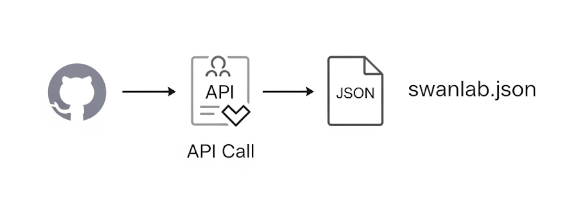
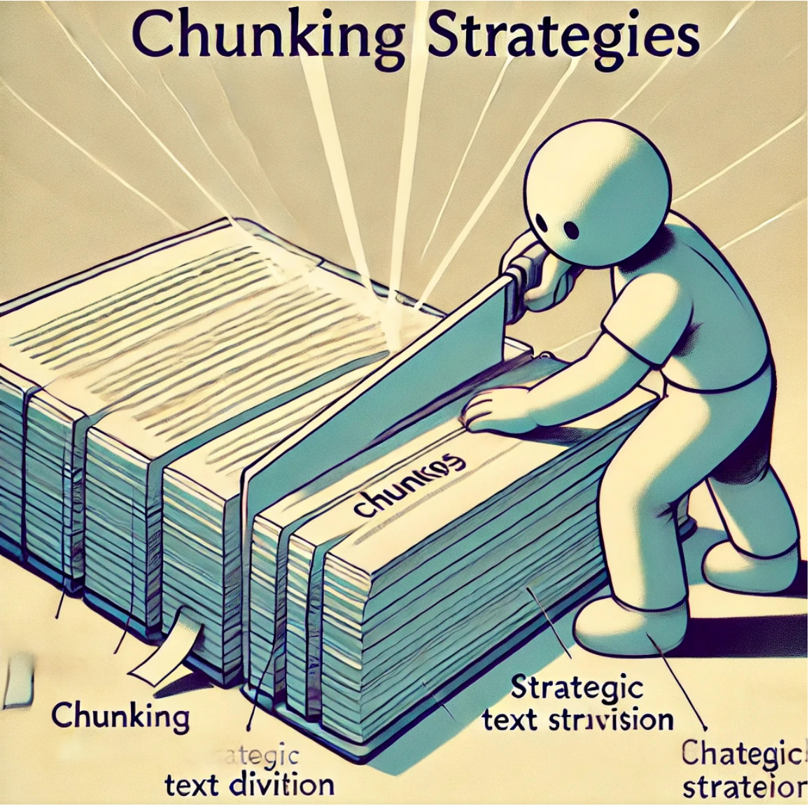
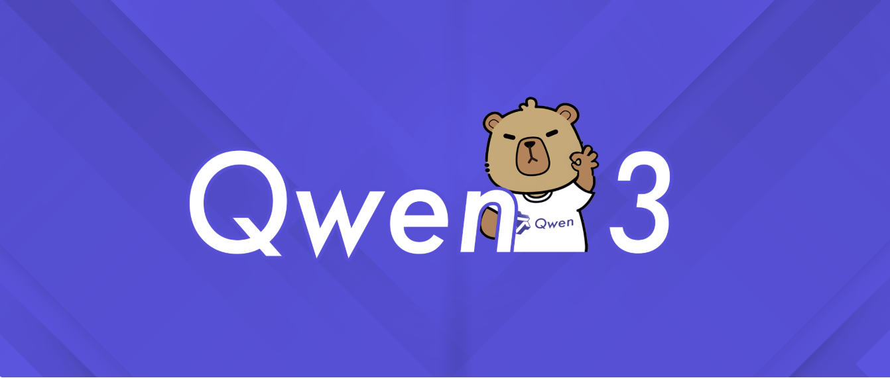

# 懒人专属：拖入文档=拥有AI文档助手？RAG怎么做？SwanLab文档助手方案开源了！（附详细代码）

**作者**：李晨 、王超  

**机构**：新疆大学丝路多语言认知计算国际合作联合实验室研究生、情感机器实习研究员

**联系邮箱**：lichen@stu.xju.edu.cn、wangchao@stu.xju.edu.cn

---

**"随着官方文档API的爆炸式增长，用户阅读较为困难，——今天，我们直接用**SwanLab**+**开箱即用的RAG框架**，带你30分钟搭建一个**服务级文档助手**（附完整源码和在线Demo，无需复杂配置，10分钟即可本地跑通！）**

AI文档助手在线体验链接：[https://chat.swanlab.cn/](https://chat.swanlab.cn/)

方案开源Github仓库链接：https://github.com/EmotionMachine/swanlab-rag

Swabnlab官方提示词课程链接:fire:：[https://docs.swanlab.cn/course/prompt_engineering_course/01-preface/README.html](https://docs.swanlab.cn/course/prompt_engineering_course/01-preface/README.html)

<div align="center">
  <figure>
  
  <figcaption>Swanlab官方文档Demo演示</figcaption>
  </figure>
</div>

## 摘要

在信息爆炸的时代，开发者需要快速从技术文档中获取准确信息。SwanLab官方文档内容丰富，但手动查找耗时且效率低下。**为了让开发者能够更快速、更精准地从SwanLab官方文档中获取信息**，我们开发了一款AI文档助手，基于**检索增强生成（RAG）架构**。

本文介绍了Swanlab官方文档助手的详细实现过程，不依赖任何现有Agent框架，妥妥“**纯手工打造**”。本文将会从数据准备、文档检索、模型生成三个方面去介绍。

<div align="center">
  <figure>
  
  <figcaption>Swanlab文档助手技术架构简介</figcaption>
  </figure>
</div>

------

## 目录
[[toc]]

## 数据准备

本节主要介绍**向量数据库**的详细构建方案。

### 文档检索

 AI助手的知识基础来源于最新、最全的官方文档。首先需要让 AI 拥有“阅读”所有 SwanLab 官方文档的能力。**GitHub作为开发者最熟悉的平台，降低学习成本**。笔者采用**GitHub API作为获取文档的主要技术，技术可信度为一方面，更重要的是确保获取到的资料具有实时性与完整性。**

实现过程**使用Python编写了一个网络爬虫脚本，通过调用 GitHub API，自动扫描 SwanLab 文档仓库，获取所有 Markdown 文件的元数据**，如标题、下载链接和对应的官网页面地址保存到`JSON`文件中。工作流程如下所示：

<div align="center">
  <figure>
  
  <figcaption>GitHub API 调用流程</figcaption>
  </figure>
</div>

​														

`swanlab.json`包含文件名、文档地址、网页地址和文档主题，具体如下所示：

```json
{
      "theme": "cli-swanlab-convert",
      "url": "https://raw.githubusercontent.com/SwanHubX/SwanLab-Docs/main/zh/api/cli-swanlab-convert.md",
      "html_url": "https://docs.swanlab.cn/api/cli-swanlab-convert.html",
      "title": "swanlab convert"
 }
```

### Github API及其使用方法

GitHub API 是一种用于与 GitHub 平台交互的编程接口，允许开发者通过编写代码来访问 GitHub 上的资源和数据。https://api.github.com/repos/ 是其中一个重要的端点，用户可以对 GitHub 上的代码仓库资源进行获取。

API 的核心功能是为用户提供一种以编程方式访问和操作 GitHub 平台数据的方法，而不是通过用户界面手动操作。通过 API工具，开发者可以获取仓库的详细信息，创建新仓库，修改现有仓库的设置，甚至删除仓库。

<div align="center">
  <figure>
  
  <figcaption>自动化Git仓库</figcaption>
  </figure>
</div>															

在代码中Github API的具体使用方法：

```python
#scrape_swanlab_docs_Internet.py

#认证与请求头，通过 Authorization: token {token} 请求头进行认证，提高 API 速率限制（未认证用户每小时 60 次请求，认证用户每小时 5000 次）。
github_token = ""  # 填写为你的GitHub Token
headers['Authorization'] = f'token {github_token}'  
# 使用requests 库配置重试机制
session = requests.Session()
response = session.get("https://api.github.com/rate_limit", headers=headers, timeout=60)
response.raise_for_status()
contents = response.json()

"""
检索
Args:
   repo_url (str): GitHub仓库目录URL（例如 'https://github.com/SwanHubX/SwanLab-Docs/tree/main/zh'）
   base_html_url (str): SwanLab文档网站根URL（例如 'https://docs.swanlab.cn'）
"""
for item in contents:
    if item['type'] == 'file' and item['name'].endswith('.md'):
        theme = item['name'].replace('.md', '')
        md_url = item['download_url']
        relative_path = md_url.split('/main/zh/')[-1]
        html_filename = filename_map.get(theme, theme)
        html_path = relative_path.replace(theme + '.md', html_filename + '.html')
        html_url = f"{base_html_url}/{html_path}"
        title = get_markdown_title(md_url, headers, session)

        docs.append({
            "theme": theme,
            "url": md_url,
            "html_url": html_url,
            "title": title
            })
            logger.info(
                f"{'  ' * depth}Added file: {theme}, Markdown: {md_url}, HTML: {html_url}, Title: {title}")
    elif item['type'] == 'dir':
           logger.info(f"{'  ' * depth}Entering directory: {item['path']}")
            scan_directory(item['url'], docs, depth + 1)                      
```

### 文档解析与分块合并

 在上一步我们得到了所有文档的“地址列表”（`JSON` 文件）。接下来，我们需要“按图索骥”，访问每一个链接，异步地抓取所有 Markdown 的原始内容，使用LLM对每个文档根据内容进行文档解析与分块处理，采取其重要部分用于构建知识库。

首先笔者先介绍一下分块策略毕竟笔者采用的具体分块策略，为什么需要分快？分块涉及将文本划分为可管理的单元或“块”，以实现高效处理。这种分割对于语义搜索、信息检索和生成式 AI 应用等任务都至关重要。每个块都保留上下文和语义完整性，以确保结果连贯。分块策略在检索增强生成（RAG）方法中起着至关重要的作用，它使文档能够被划分为可管理的部分，同时保持上下文。

<div align="center">
  <figure>
  
  <figcaption>Chunk策略示意图</figcaption>
  </figure>
</div>

在笔者实际的测试中，直接对长文本进行向量化存在诸多问题，存在语义信息的稀释、计算资源的耗费以及检索效率的降低等。将长文本进行合理的分块处理，成为构建高效向量数据库的前提。在可以提高检索准确率同时，也确保召回的内容与用户的查询意图更加契合，进而提升大模型生成答案的质量。最终笔者采取的方案为根据文档的二级标题进行分块处理，在引入宝贵的结构元数据同时，也实现了分块粒度的平衡，保持了语义的完整性和专注性。当用户的查询与某一子主题高度相关时，模型能够精准召回包含该标题和对应内容的文本块，避免了不相关信息的干扰，也提升了答案的可信度和可用性。在笔者不断的摸索中，检索效率和生成效果之间取得了理想的平衡。

将分块后的内容合并到一起，这样每个知识块都包含了相对完整的主题与内容。实现这个逻辑的代码也非常简单：

```python
# create_vector.py
def split_text(text: str, separator: str = "################") -> list[str]:
    """
    分割文本：根据指定的分隔符分割文本。
    """
    chunks = text.split(separator)
    # 过滤掉可能存在的空字符串
    return [chunk.strip() for chunk in chunks if chunk.strip()]
```

配置文件和分块提示词如`config.py`和`prompt.py`所示。在处理时，我们用一个特殊的分隔符 `################` 将文档内容按照二级标题的内容隔开，形成一个完整的Swanlab文档知识库。

```yaml
#config.yaml`
llm:
  api_type: "openai"  # 或 "groq" 等
  model: "Qwen/Qwen2.5-32B-Instruct"  # 或 "GPT-4o"等
  api_key: ""    #填写api_key
  base_url: ""  # LLM服务URL
#prompt.py
llm = LLM()
prompt = f"""
分析以下 Markdown 内容，把内容进行分块整理。
格式如下所示：
一级标题：(文档标题)
二级标题（文档二级标题）：内容
################
一级标题：(文档标题)
二级标题（文档二级标题）：内容
################
......
################
参考内容：{content}
"""
```

### 文档编码

现在我们有了一堆文本块，但计算机不理解文字，只懂数字。我们需要一个“翻译官”，把每个文本块翻译成一个由数字组成的“向量”（Vector）。这个过程就是 **Embedding**。

<div align="center">
  <figure>
  
  <figcaption>生成词向量</figcaption>
  </figure>
</div>																

调用API提供的 `Embedding` 模型来完成这个任务。调用的过程也相对比较简单，提供API_KEY和Base_URL等关键参数即可，具体实现方法如下代码所示。对于这样的每一个文本块，获得了一个`Embedding`后的向量。

```python
# create_vector.py
def get_embeddings_from_api(texts: list[str], batch_size: int = 16) -> list[list[float]]:
    all_embeddings = []
    headers = {
        "Authorization": f"Bearer {API_KEY}",
        "Content-Type": "application/json"
    }
    url = f"{BASE_URL.rstrip('/')}/embeddings"

    for i in range(0, len(texts), batch_size):
        batch = texts[i:i + batch_size]
        payload = {
            "model": EMBEDDING_MODEL,
            "input": batch
        }
        # ... 发起请求并获取返回的向量 ...
        response_data = response.json()
        batch_embeddings = [item['embedding'] for item in response_data['data']]
        all_embeddings.extend(batch_embeddings)

    return all_embeddings
```

拿到所有向量后，如何管理这些向量？笔者选择 Facebook 开源的 `FAISS` 库来构建一个向量数据库，支持快速处理大规模数据，并且支持在高维空间中进行相似性搜索。可以把`FAISS` 想象成一个专门为向量设计的高效“图书馆”，能极快地找到与给定向量最相似的几个向量。

至此，我们的“Swanlab官方文档向量知识库”已经完全准备就绪了！我们就可以进行文档检索了!

------

## 文档检索（RAG）

`RAG`（`Retrieval-Augmented Generation`，检索增强生成） 是一种结合了信息检索技术与语言生成模型的人工智能技术。该技术通过从外部知识库中检索相关信息，并将其作为提示（Prompt）输入给大型语言模型（LLMs），以增强模型处理知识密集型任务的能力，如问答、文本摘要、内容生成等。RAG模型由Facebook AI Research（FAIR）团队于2020年首次提出，并迅速成为大模型应用中的热门方案。

<div align="center">
  <figure>
  
  <figcaption>文档检索流程示意图</figcaption>
  </figure>
</div>												

数据准备是离线完成的，而问答检索则是用户与 AI 实时交互的过程。这个过程就像让 AI 进行一场“开卷考试”，我们先把相关的参考资料找出来，再让它根据这些官方资料来回答与解决用户问题。

### 检索出相关文档

当用户提出一个问题时，我们首先用和之前完全相同的 `Embedding` 模型，将用户的问题也转换成一个向量。我们拿着这个“问题向量”，采用混合检索（向量检索+关键词检索）的策略去 FAISS 向量数据库里进行搜索，命令它：“找出与我这个向量在空间距离上最接近文本块向量！"。至于为什么采用这种方式，会在混合检索中进行详细讨论分析。再此之前笔者先带领读者先回顾一下向量检索和关键词检索的核心逻辑。

<div align="center">
  <figure>
  
  <figcaption>FAISS向量数据库</figcaption>
  </figure>
</div>

#### 向量检索

`Faiss`（Facebook AI Similarity Search）是由 Facebook AI 团队开源的高效相似性搜索和聚类库，专为稠密向量的快速检索设计。它支持十亿级别的向量搜索，广泛应用于推荐系统、图像检索和自然语言处理等领域。

Faiss 提供多种算法来处理任意大小的向量集，支持高效的近似最近邻（ANN）搜索和聚类。其核心算法包括倒排索引（IVF）和乘积量化（PQ），并通过 GPU 加速进一步提升性能。最重要的原因，`Faiss` 提供了与 Python 的无缝接口，便于与 `Numpy` 集成的同时，也笔者在不使用任何架构使用纯`Python`提供了便捷。


<div align="center">
  <figure>
  
  <figcaption>FAISS</figcaption>
  </figure>
</div>

向量检索能够跨越字面障碍，理解用户的真实意图。即使用户的提问方式和文档的写法完全不同，只要意思相近，也能够轻易找到。能帮助用户发现他们没直接提问、但高度相关的内容，提供更具探索性的结果。

向量检索的实现如下所示：

```python
# chat_logic.py
# 1. 将用户问题转换为向量
query_embedding = self._get_query_embedding(question)
query_vector = np.array([query_embedding]).astype('float32')

# 2. 在FAISS中执行搜索，k=10表示寻找最相似的10个,可以动态调整
distances, indices = self.index.search(query_vector, k=10)

# 3. 根据返回的索引号，找到原始的文本块
retrieved_chunks = [self.index_to_chunk[str(i)] for i in indices[0]]
```

#### 关键词检索：

关键词检索（`Keyword Search`），也称为词法检索（`Lexical Search`），是一种基于精确词汇匹配的传统信息检索方法。

其核心机制依赖于倒排索引结构（Inverted Index），该结构由词汇表（Lexicon）和对应的发布列表（Posting List）组成，通过两者的映射关系实现高效查找。在处理流程上，首先进行查询解析，通过词法分析提取查询项，并可选地应用停用词过滤等技术优化检索过程。这种检索方式的特点在于对查询关键词与文档词汇的精确匹配，具有计算效率高、实现简单等优势。

```python
#使用正则表达式（re模块）进行关键词检索，同样选择寻找最相似的10个文本快
def _keyword_search(self, query:str, k: int = 10):
    keywords = [word for word in re.split(r'\W+', query.lower()) if word]
    if not keywords:
        return []

    all_chunks = list(self.index_to_chunk.values())
    chunk_scores = {}

    for chunk in all_chunks:
        score = 0
        chunk_lower = chunk.lower()
        for keyword in keywords:
            score += chunk_lower.count(keyword)

        if score > 0:
            chunk_scores[chunk] = score

    sorted_chunks = sorted(chunk_scores.items(), key=lambda item: item[1], reverse=True)
    return [chunk for chunk, score in sorted_chunks[:k]]
```

#### 混合检索

笔者采用混合检索（向量检索+关键词检索），核心原因这两种检索方式优势互补，向量检索的“智能”和“深度”来理解用户意图，同时用关键词检索的“精准”和“可靠”来抓住关键细节。能够实现1+1 > 2的效果，亦是当今构建先进RAG系统的主流和与最佳实践方式。

<div align="center">
  <figure>
  
  <figcaption>混合检索示意图</figcaption>
  </figure>
</div>										

采用混合检索技术的优势：

- 确保高召回率 (`Recall`): 混合检索能最大程度地确保所有可能相关的文档都被“召回”。向量检索负责召回那些“意思对”的文档，而关键词检索则像一张安全网，确保那些包含“特定关键词”的文档不被遗漏。
- 提升答案的精准度 (`Precision`): 通过向大模型提供一个既包含宏观概念理解、又包含微观关键细节的上下文，大模型能够基于更丰富、更无偏见的信息，生成更可靠、更精确的答案。
- 应对复杂查询场景:
  - 当用户提问模糊时：“我的实验结果好像不对劲”，向量检索能发挥巨大作用，找到关于“调试”、“数据异常”、“结果分析”等概念的文档。
  - 当用户提问精确时：“`swanlab.log` 函数怎么用？”，关键词检索能确保包含 `swanlab.log` 的文档被精准找到，而向量检索则能补充一些关于“如何记录日志”、“最佳实践”等相关上下文。

将两种检索出来的文本块进行去重处理：

```python
for chunk in all_retrieved:
    processed_chunk = chunk
    # 检查chunk是否为列表，如果是，则将其合并为字符串
    if isinstance(chunk, list):
        processed_chunk = "\n".join(chunk)
    # 确保处理后的chunk是字符串且不为空
    if isinstance(processed_chunk, str) and processed_chunk:
        combined_chunks[processed_chunk] = None
```

被检索出来的文本块，是为 LLM 精心准备的背景知识，也是解决用户问题最佳内容。

------

## 模型生成

### API选用与时延测试

API选用方面，为了提供给用户更好的体验，选用阿里云百炼API。

<div align="center">
  <figure>
  
  <figcaption></figcaption>
  </figure>
</div>

模型选用`Qwen3-30B`作为项目的LLM，考量的角度聚焦为指令遵循、生成质量与首`Token`响应时间三个方面。相较于其他模型的LLM模型，笔者在测试过程中发现`Qwen`系列在指令遵循更加精准。针对生成质量的稳定性，按理说参数量越大的模型稳定性越好，费用是硬伤。折中考量在测试中`Qwen3-30B`也能达到预期的效果（用户在使用的过程的可以选择适合的模型）。首`Token`响应关系到用户的体验，这里选用“**阿里云百炼平台**”，首token响应时间远远超出笔者的预期，平均响应时间控制在1s。

阿里云百炼地址：[大模型服务平台百炼_企业级大模型开发平台_百炼AI应用构建-阿里云](https://www.aliyun.com/product/bailian)

百炼平台上提供Qwen所有系列的模型，用户可以在上面选择合适的模型。

<div align="center">
  <figure>
  
  <figcaption></figcaption>
  </figure>
</div>

这里笔者使用**Evalscope**框架也对其进行时延测试，测试脚本如下：

```bash
evalscope perf \
 --parallel 1 \
 --url  https://dashscope.aliyuncs.com/compatible-mode/v1/chat/completions \
 --api-key "sk-3bd82fa09f5d4192ad345c2287e058a5"\
 --model qwen3-30b-a3b-instruct-2507 \
 --log-every-n-query 5 \
 --connect-timeout 6000 \
 --read-timeout 6000 \
 --max-tokens 2048 \
 --min-tokens 2048 \
 --api openai \
 --dataset openqa \
 --number 5\
 --swanlab-api-key "填入Swanlab_key完成推理可视化"\ 
 --stream
```

测试结果如下图所示：

| 吞吐量指标名称          | 值      |
| ----------------------- | ------- |
| 输出token吞吐量 (tok/s) | 91.8166 |
| 总token吞吐量 (tok/s)   | 95.4285 |
| 请求吞吐量 (req/s)      | 0.1235  |

| 延迟指标名称               | 值     |
| -------------------------- | ------ |
| 平均延迟 (秒)              | 8.0971 |
| 首token平均到达时间 (秒)   | 0.4173 |
| 每个输出token平均时间 (秒) | 0.0102 |
| 平均包延迟 (秒)            | 0.0403 |

快速使用阿里云百炼API示例：

```python
#配置API的相关参数
import os
from openai import OpenAI


client = OpenAI(
    # 若没有配置环境变量，请用百炼API Key将下行替换为：api_key="sk-xxx",
    api_key=os.getenv("DASHSCOPE_API_KEY"),
    base_url="https://dashscope.aliyuncs.com/compatible-mode/v1",
)

#Test
completion = client.chat.completions.create(
    # 模型列表：https://help.aliyun.com/zh/model-studio/getting-started/models
    model="qwen3-30b-a3b-instruct-2507",
    messages=[
        {"role": "system", "content": "You are a helpful assistant."},
        {"role": "user", "content": "你是谁？"},
    ],
    # Qwen3模型通过enable_thinking参数控制思考过程（开源版默认True，商业版默认False）
    # 使用Qwen3开源版模型时，若未启用流式输出，请将下行取消注释，否则会报错
    # extra_body={"enable_thinking": False},
)
```

### 构建Prompt

在笔者的实际测试中，发现直接把“背景知识”和“问题”扔给LLM的效果通常不好。下图是笔者在玩耍文生图模型过程中发现提示词的重要性。为此笔者精心设计一个“提示词（`Prompt`）"，相当于给 LLM设定好角色和答题格式。让LLM的回答更加人性化，条例清晰。

<div align="center">
  <figure>
  
  <figcaption>Prompt的重要性</figcaption>
  </figure>
</div>

笔者的 Prompt 模板大概是这样的：

```python
prompt = f"""
        # Role
        You are a documentation Q&A assistant for the SwanLab open-source project. SwanLab is a product developed by Emotion 				Machine (Beijing) Technology Co., Ltd.
        
        # Instructions
        1. Answer the [question] based on the provided [background knowledge]. If no relevant information is found, notify the 				user that no reference material was located and provide suggestions based on your existing knowledge.
        2. When answering, you may use some emojis in your narrative style to make it more human-like.
        3. After answering, you can guide the user to ask some related follow-up questions.
        4. If you encounter incomplete web addresses, please prepend "https://docs.swanlab.cn/" and replace ".md" with ".html".
        5. Also consider whether the user's [historical questions] are relevant to the current question and incorporate that 				into your response.
        
        ---
        [Historical Questions]
        {history_prompt}
        ---
        [Background Knowledge]
        {context}
        ---
        # Current Question
        [Question]
        {question}
        ---
        Your response:
        """
```

这个精心构造的 Prompt，将所有必要信息都提供给了大模型，引导它做出最准确与最全面的回答。最后LLM基于回答返回参考的文档用于前端展示。

### 模型生成

最后一步，将这个完整的 Prompt 发送给一个强大的大语言模型（本项目使用的LLM为阿里云百联提供的`qwen3-30b-a3b-instruct-2507`模型），它会综合所有信息，生成一段流畅、准确的回答。

<div align="center">
  <figure>
  
  <figcaption></figcaption>
  </figure>
</div>

还增加了一个小细节：从被检索到的知识块中返回的“一级标题”，并利用我们最早爬取到的 `html_url`，为用户生成一个可点击的“参考资料”列表，让答案更有权威性。为用户提供更多的参考与指南。

## 快速使用

Swanlab官网中提供两个文档助手入口，或者直接访问链接[SwanLab AI文档助手](https://chat.swanlab.cn/)，如下图所示（一个在导航栏右侧，一个在主界面）。用户在使用的过程种如遇BUG情况，请联系笔者反馈并提供您宝贵的意见。

<div align="center">
  <figure>
  
  <figcaption></figcaption>
  </figure>
</div>

测试中面对较为复杂的问题，文档助手能够准确回答问题，并且提供出准确的文档参考链接。

<div align="center">
  <figure>
  
  <figcaption></figcaption>
  </figure>
</div>

这里笔者问了一个非常刁钻的问题，文档中没有明确指出`leader`的联系方式，但是也能够在内容中总结出正确的联系方式。

<div align="center">
  <figure>
  
  <figcaption></figcaption>
  </figure>
</div>

