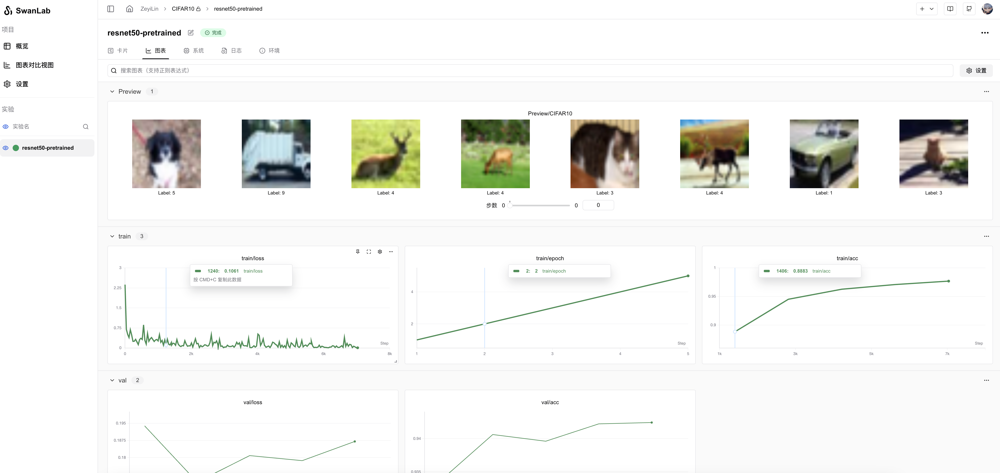

# CIFAR10 图像分类

:::info
图像分类、机器学习入门
:::

[](https://swanlab.cn/@ZeyiLin/CIFAR10/runs/5q3sh20ni2zs6p28ja8qm/chart)

## 概述

CIFAR-10是一个经典的图像分类数据集，包含60,000张32×32像素的彩色图像，分为10个类别（如飞机、汽车、鸟类等），其中50,000张用于训练，10,000张用于测试。


CIFAR-10常被用于图像分类训练任务。该任务是构建模型对输入图像进行10分类，输出每个类别的概率。由于图像分辨率低、背景复杂且数据量有限，该数据集常被用于测试模型的泛化能力和特征提取效果，成为深度学习入门基准。典型方法包括CNN（如ResNet、AlexNet），配合数据增强和交叉熵损失优化，最高准确率可达95%以上。CIFAR-10的轻量级特性使其广泛用于教学和研究，并衍生出更复杂的变体（如CIFAR-100）。

CIFAR-10 包含来自 10 个类别的图像。这些类别包括：

- 飞机 (airplane)
- 汽车 (automobile)
- 鸟类 (bird)
- 猫 (cat)
- 鹿 (deer)
- 狗 (dog)
- 青蛙 (frog)
- 马 (horse)
- 船 (ship)
- 卡车 (truck)

本案例主要：

- 使用`pytorch`进行[ResNet50](https://arxiv.org/abs/1512.03385)(残差神经网络)网络的构建、模型训练与评估
- 使用`swanlab` 跟踪超参数、记录指标和可视化监控整个训练周期

## 环境安装

本案例基于`Python>=3.8`，请在您的计算机上安装好Python。
环境依赖：
```
torch
torchvision
swanlab
```
快速安装命令：
```bash
pip install torch torchvision swanlab
```

## 完整代码

```python
import os
import random
import numpy as np
import torch
from torch import nn, optim, utils
from torchvision.datasets import CIFAR10
from torchvision.transforms import ToTensor, Compose, Resize, Lambda
import swanlab

def set_seed(seed=42):
    """设置所有随机种子以确保可重复性"""
    random.seed(seed)
    np.random.seed(seed)
    torch.manual_seed(seed)
    torch.cuda.manual_seed_all(seed)
    # 设置CUDA的随机种子
    if torch.cuda.is_available():
        torch.backends.cudnn.deterministic = True
        torch.backends.cudnn.benchmark = False

# 捕获并可视化前20张图像
def log_images(loader, num_images=16):
    images_logged = 0
    logged_images = []
    for images, labels in loader:
        # images: batch of images, labels: batch of labels
        for i in range(images.shape[0]):
            if images_logged < num_images:
                # 使用swanlab.Image将图像转换为wandb可视化格式
                logged_images.append(swanlab.Image(images[i], caption=f"Label: {labels[i]}", size=(128, 128)))
                images_logged += 1
            else:
                break
        if images_logged >= num_images:
            break
    swanlab.log({"Preview/CIFAR10": logged_images}) 


if __name__ == "__main__":
    # 设置随机种子
    set_seed(42)

    # 设置device
    try:
        use_mps = torch.backends.mps.is_available()
    except AttributeError:
        use_mps = False

    if torch.cuda.is_available():
        device = "cuda"
    elif use_mps:
        device = "mps"
    else:
        device = "cpu"

    # 初始化swanlab
    run = swanlab.init(
        project="CIFAR10",
        experiment_name="resnet50-pretrained",
        config={
            "model": "Resnet50",
            "optim": "Adam",
            "lr": 1e-4,
            "batch_size": 32,
            "num_epochs": 5,
            "train_dataset_num": 45000,
            "val_dataset_num": 5000,
            "device": device,
            "num_classes": 10,
        },
    )

    # 定义转换：调整大小并转换为3通道
    transform = Compose([
        ToTensor(),
        Resize((224, 224), antialias=True),  # ResNet期望224x224的输入
        # Lambda(lambda x: x.repeat(3, 1, 1))  # 将单通道转换为3通道
    ])

    # 设置训练集、验证集和测试集
    dataset = CIFAR10(os.getcwd(), train=True, download=True, transform=transform)
    
    # 确保划分数量正确
    total_size = len(dataset)  # 应该是50000
    train_dataset, val_dataset = utils.data.random_split(
        dataset, 
        [run.config.train_dataset_num, run.config.val_dataset_num],
        generator=torch.Generator().manual_seed(42)  # 保持划分的随机性一致
    )

    train_loader = utils.data.DataLoader(train_dataset, batch_size=run.config.batch_size, shuffle=True)
    val_loader = utils.data.DataLoader(val_dataset, batch_size=1, shuffle=False)

    # 初始化模型、损失函数和优化器
    if run.config.model == "Resnet18":
        from torchvision.models import resnet18
        model = resnet18(pretrained=True)
        model.fc = nn.Linear(model.fc.in_features, run.config.num_classes)
    elif run.config.model == "Resnet34":
        from torchvision.models import resnet34
        model = resnet34(pretrained=True)
        model.fc = nn.Linear(model.fc.in_features, run.config.num_classes)
    elif run.config.model == "Resnet50":
        from torchvision.models import resnet50
        model = resnet50(pretrained=True)
        model.fc = nn.Linear(model.fc.in_features, run.config.num_classes)
    elif run.config.model == "Resnet101":
        from torchvision.models import resnet101
        model = resnet101(pretrained=True)
        model.fc = nn.Linear(model.fc.in_features, run.config.num_classes)
    elif run.config.model == "Resnet152":
        from torchvision.models import resnet152
        model = resnet152(pretrained=True)
        model.fc = nn.Linear(model.fc.in_features, run.config.num_classes)

    model.to(torch.device(device))

    criterion = nn.CrossEntropyLoss()
    optimizer = optim.Adam(model.parameters(), lr=run.config.lr)

    # （可选）看一下数据集的前16张图像
    log_images(train_loader, 8)

    # 开始训练
    for epoch in range(1, run.config.num_epochs+1):
        swanlab.log({"train/epoch": epoch}, step=epoch)
        model.train()  # 确保模型处于训练模式
        train_correct = 0
        train_total = 0
        
        # 训练循环
        for iter, batch in enumerate(train_loader):
            x, y = batch
            x, y = x.to(device), y.to(device)
            optimizer.zero_grad()
            output = model(x)
            loss = criterion(output, y)
            loss.backward()
            optimizer.step()

            # 计算训练准确率
            _, predicted = torch.max(output, 1)
            train_total += y.size(0)
            train_correct += (predicted == y).sum().item()

            if iter % 40 == 0:
                print(
                    f"Epoch [{epoch}/{run.config.num_epochs}], Iteration [{iter + 1}/{len(train_loader)}], Loss: {loss.item()}"
                )
                swanlab.log({"train/loss": loss.item()}, step=(epoch - 1) * len(train_loader) + iter)

        # 记录每个epoch的训练准确率
        train_accuracy = train_correct / train_total
        swanlab.log({"train/acc": train_accuracy}, step=(epoch - 1) * len(train_loader) + iter)

        # 评估
        model.eval()
        correct = 0
        total = 0
        val_loss = 0
        with torch.no_grad():
            for batch in val_loader:
                x, y = batch
                x, y = x.to(device), y.to(device)
                output = model(x)
                # 计算验证损失
                loss = criterion(output, y)
                val_loss += loss.item()
                # 计算验证准确率
                _, predicted = torch.max(output, 1)
                total += y.size(0)
                correct += (predicted == y).sum().item()

        accuracy = correct / total
        avg_val_loss = val_loss / len(val_loader)
        swanlab.log({
            "val/acc": accuracy,
            "val/loss": avg_val_loss,
            }, step=(epoch - 1) * len(train_loader) + iter)
```

## 切换其他ResNet模型

上面的代码支持切换以下ResNet模型：
- ResNet18
- ResNet34
- ResNet50
- ResNet101
- ResNet152

切换方式非常简单，只需要将`config`的`model`参数修改为对应的模型名称即可，如切换为ResNet50：

```python (5)
    # 初始化swanlab
    run = swanlab.init(
        ...
        config={
            "model": "Resnet50",
        ...
        },
    )
```

- `config`是如何发挥作用的？ 👉 [设置实验配置](/guide_cloud/experiment_track/set-experiment-config)

## 效果演示

[](https://swanlab.cn/@ZeyiLin/CIFAR10/runs/5q3sh20ni2zs6p28ja8qm/chart)

