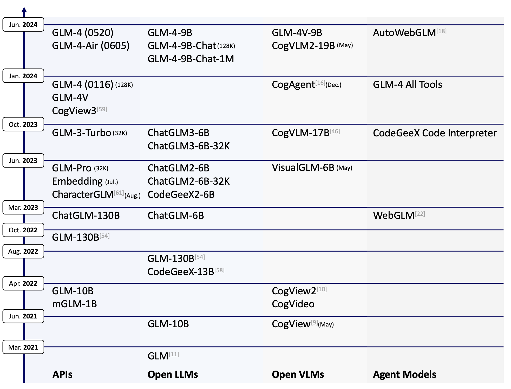
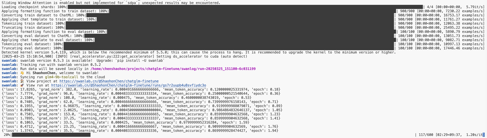
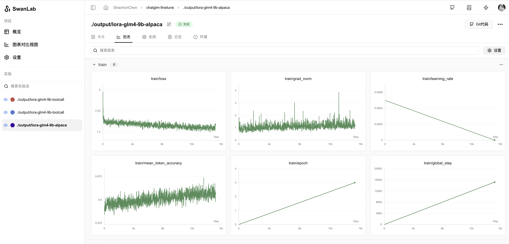
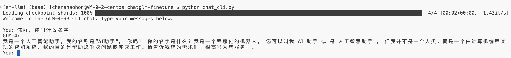

# 使用ChatGLM4进行大模型指令遵从微调（附代码和测试脚本）

作者：情感机器实验室-陈少宏 邮箱：<shaohon_chen@115lab.club>

## 摘要

本教程主要实现了一个大模型的指令遵从微调方法。为了便于实现，减少代码量，本文使用了🤗HuggingFace的TRL框架实现。该框架除了支持SFT外，对DPO、PPO、GRPO等流行的强化微调算法都有很好的支持。

虽然使用框架能够极大的减少工作量，但是不可避免的为新手学习带来了困扰。因此本教程会尽量附上完整的文档引用来帮助读者进一步学习框架。诚然从使用pytorch实现微调过程能够极大的提升对过程的理解，社区也有相当多优秀的项目。但是笔者仍推荐大家多使用框架来完成训练，这样可以减少大量的时间来让大家更专注于创新。

因此本教程建议对🤗HuggingFace Transformers框架有一定基础的读者阅读～。

注意：由于ChatGLM的模型相对较大，实际运行大概需要显存>=16G

🎉 **SwanLab被官方集成进入了🤗HuggingFace Transformers：** 如果本地环境安装了SwanLab会默认开启！也可以通过`report_to="swanlab"`开启训练跟踪。

## 目录

**目录：**

* [TRL包介绍+环境准备](#trl包介绍环境准备)

* [ChatGLM4介绍+模型准备](#ChatGLM4介绍+模型准备)

* [数据集准备](#数据集准备)

* [代码说明超参数调整](#代码说明超参数调整)

* [启动训练效果评测](#启动训练效果评测)

* [附件完整代码](#附件完整代码)

**参考资料：**

* 智谱AI官网：[https://www.zhipuai.cn/](https://www.zhipuai.cn/)

* ChatGLM-9B基座模型：[https://huggingface.co/THUDM/glm-4-9b-hf](https://huggingface.co/THUDM/glm-4-9b-hf/tree/main)

* ChatGLM-9B-Chat模型：[https://huggingface.co/THUDM/glm-4-9b-chat-hf](https://huggingface.co/THUDM/glm-4-9b-chat-hf/tree/main)

* Alpaca数据集中文版：[https://huggingface.co/datasets/llamafactory/alpaca_gpt4_zh](https://huggingface.co/datasets/llamafactory/alpaca_gpt4_zh)

* 本博客开源项目链接：[https://github.com/SwanHubX/glm4-finetune](https://github.com/SwanHubX/glm4-finetune)

* SwanLab训练日志查看：[https://swanlab.cn/@ShaohonChen/chatglm-finetune/](https://swanlab.cn/@ShaohonChen/chatglm-finetune/)

## TRL包介绍+环境准备


本教程使用[🤗HuggingFace TRL](https://huggingface.co/docs/trl/index)框架来完成微调代码的实现。TRL是一个强大且便于使用的微调框架，除了支持SFT外，也能轻松的通过接口调用DPO、PPO、GRPO等流行的强化微调算法。此外也完美兼容Transformers架构。

首先是安装本教程的环境，安装命令如下：

```bash
pip install transformers trl datasets peft swanlab
```

其中`transformers trl peft`用于模型的加载和训练，`datasets`用于导入数据集，`swanlab`用于对训练过程可视化跟踪。

下面列举一个简单的微调案例来介绍HF TRL框架的使用方法：

```python
from datasets import load_dataset
from trl import SFTConfig, SFTTrainer

dataset = load_dataset("stanfordnlp/imdb", split="train")   # 设置微调数据集，此处使用IMDB电影评论分类数据

training_args = SFTConfig(  # 设置微调参数
    max_length=512,
    output_dir="/tmp",
)
trainer = SFTTrainer(   # 设置模型，此处使用facebook的opt-350M，参数量比较小便于下载
    "facebook/opt-350m",
    train_dataset=dataset,
    args=training_args,
)
trainer.train() # 开始训练，流程和TRL一样
```

上面的代码来自HF官方文档[https://huggingface.co/docs/trl/sft_trainer](https://huggingface.co/docs/trl/sft_trainer)，增加了注释便于读者理解。

简单来说TRL包的使用方法和Transformers类似，不过多了两步：

* 导入`SFTConfig`模块，这个模块基于`transformers`的`TrainingArguments`，不过针对SFT引入了一点额外的参数，以及lora的支持参数

* 导入`SFTTrainer`模块，这个模块包含了SFT的代码实现，还有一些对`peft`的lora支持和数据集格式转换代码。

后文将完整的介绍如何使用TRL包完成大模型的指令遵从功能。

## ChatGLM4介绍+模型准备



GLM-4-9B是[智谱AI](https://www.zhipuai.cn/)推出的最新一代预训练模型GLM-4系列中的开源版本。ChatGLM发布了多个版本，其中GLM-4-9B是第四代基座模型，其微调版本GLM-4-9B-Chat具备网页浏览、代码执行、自定义工具调用（Function Call）和长文本推理（支持最大 128K 上下文）等高级功能。

本教程使用GLM-4-9B模型进行指令遵从功能微调，并使用SwanLab进行模型的结果跟踪。

⚠️注意：ChatGLM为了配合Huggingface Transformers更新，发布了两个版本权重`THUDM/glm-4-9b`和`THUDM/glm-4-9b-hf`，后者对应更为新版本的transformers，因此本教程使用后者的权重。

本教程以经提供好了下载模型的脚本，下载模型的方法如下：

```bash
huggingface-cli download --local-dir ./weights/glm-4-9b-hf THUDM/glm-4-9b-hf
```

模型将会下载在项目目录下的`./weights/glm-4-9b-hf`中

下面列举一个使用`transformers`加载ChatGLM模型并进行推理的代码：

```python
from transformers import AutoTokenizer, AutoModelForCausalLM
device = "cuda"
tokenizer = AutoTokenizer.from_pretrained("THUDM/glm-4-9b-chat-hf")
model = AutoModelForCausalLM.from_pretrained("THUDM/glm-4-9b-chat-hf").eval().to(device)
inputs = tokenizer.encode("我是ChatGLM，是", return_tensors="pt").to(device)
outputs = model.generate(inputs)
print(tokenizer.decode(outputs[0]))
```

由于是基座模型，没经过微调，因此模型只会完成`"我是ChatGLM，是"`这段文本的后续补全，运行后会生成如下代码：

```bash
Loading checkpoint shards: 100%|██████████| 4/4 [00:01<00:00,  2.35it/s]
[gMASK]<sop>我是ChatGLM，是人工智能助手。我是ChatGLM，是人工智能助手。我是ChatGLM，是人工智能助手
```

当然上面的例子是一个基座模型推理的例子，该模型只能进行文本生成，如果希望使用对话能力，还是需要加载已经微调好的对话模型，代码如下：

```python
from transformers import pipeline

messages = [
    {"role": "user", "content": "你是谁"},
]
pipe = pipeline("text-generation", model="THUDM/glm-4-9b-chat-hf")
print(pipe(messages))
```

此处我们换了种推理接口，直接使用pipeline完成推理，运行后将会生成如下信息

```bash
Loading checkpoint shards: 100%|██████████| 4/4 [00:01<00:00,  2.24it/s]
Device set to use cuda:0
[{'generated_text': [{'role': 'user', 'content': '你是谁'}, {'role': 'assistant', 'content': '\n我是一个人工智能助手，名为 ChatGLM。我是基于清华大学 KEG 实验室和'}]}]
```

使用`print(model)`将模型的结构打印出来，展示如下：

```text
GlmForCausalLM(
  (model): GlmModel(
    (embed_tokens): Embedding(151552, 4096, padding_idx=151329)
    (layers): ModuleList(
      (0-39): 40 x GlmDecoderLayer(
        (self_attn): GlmAttention(
          (q_proj): Linear(in_features=4096, out_features=4096, bias=True)
          (k_proj): Linear(in_features=4096, out_features=256, bias=True)
          (v_proj): Linear(in_features=4096, out_features=256, bias=True)
          (o_proj): Linear(in_features=4096, out_features=4096, bias=False)
        )
        (mlp): GlmMLP(
          (gate_up_proj): Linear(in_features=4096, out_features=27392, bias=False)
          (down_proj): Linear(in_features=13696, out_features=4096, bias=False)
          (activation_fn): SiLU()
        )
        (input_layernorm): GlmRMSNorm((4096,), eps=1.5625e-07)
        (post_attention_layernorm): GlmRMSNorm((4096,), eps=1.5625e-07)
      )
    )
    (norm): GlmRMSNorm((4096,), eps=1.5625e-07)
    (rotary_emb): GlmRotaryEmbedding()
  )
  (lm_head): Linear(in_features=4096, out_features=151552, bias=False)
)
```

可以看到GLM模型的层数达到了惊人的40层😂，因此本身使用Lora进行微调时其可训练参数会比其他模型大一些。

## 数据集准备

数据集我已经提前包括在了github项目当中，可以直接使用如下命令下载完整的实验代码

```bash
git clone https://github.com/SwanHubX/glm4-finetune.git
```

如果只想下载数据集，可以直接下载如下文件：

```bash
wget https://github.com/SwanHubX/glm4-finetune/blob/main/data/alpaca_gpt4_data_zh.json
```

也可以通过🤗huggingface上下载：[https://huggingface.co/datasets/llamafactory/alpaca_gpt4_zh](https://huggingface.co/datasets/llamafactory/alpaca_gpt4_zh)

## 代码说明+超参数调整

完整的微调代码公开在了GitHub上，使用如下命令即可下载

```bash
git clone https://github.com/SwanHubX/glm4-finetune.git
```

文章的附件中也有完整的实现代码[#代码附件](#附件完整代码)

本文接下来重点介绍各个代码的功能模块

加载模型的超参数设置，这里可以重点关注lora参数的设置，本文lora参数参考了ChatGLM官方微调代码的lora参数设置

这里要注意学习率为5e-4，如果是全量微调要小一个数量级。

```python
################
# Model kwargs
################
@dataclass
class ChatGLM4ModelConfig(ModelConfig):
    model_name_or_path: Optional[str] = field(
        default="./weights/glm-4-9b-hf",
        metadata={
            "help": "Model checkpoint for weights initialization. default used glm4"
        },
    )
    torch_dtype: Optional[str] = field(
        default="bfloat16",
        metadata={
            "help": "Override the default `torch.dtype` and load the model under this dtype.",
            "choices": ["auto", "bfloat16", "float16", "float32"],
        },
    )
    use_peft: bool = field(
        default=True,
        metadata={"help": "Whether to use PEFT for training. Default true"},
    )
    lora_r: int = field(
        default=8,
        metadata={"help": "LoRA R value."},
    )
    lora_alpha: int = field(
        default=32,
        metadata={"help": "LoRA alpha."},
    )
    lora_dropout: float = field(
        default=0.1,
        metadata={"help": "LoRA dropout."},
    )
    lora_target_modules: Optional[list[str]] = field(
        default_factory=lambda: ["q_proj", "k_proj", "v_proj"],
        metadata={"help": "LoRA target modules."},
    )
```

数据集超参数设置，这里比较简单，只是加载了本地的数据集

```python
################
# Datasets kwargs
################
@dataclass
class DataTrainingArguments:
    data_files: Optional[str] = field(
        default="./data/alpaca_gpt4_data_zh.json.json",
        metadata={"help": "The name of the dataset to use (via the datasets library)."},
    )
```

不过为了方便读者理解数据集长什么样，仍旧提供数据集展示脚本

```python
import datasets
raw_dataset=datasets.load_dataset("json", data_files="data/glaive_toolcall_zh_1k.json")
print(raw_dataset)
"""打印内容
DatasetDict({
    train: Dataset({
        features: ['instruction', 'input', 'output'],
        num_rows: 42677
    })
})
"""
```

可以看到数据一共有1000条，并且包括`'conversations', 'tools'`两个字段

进一步选取其中一条打印：

```python
print(raw_dataset["train"][0])
```

输出如下：

```json
{
    "instruction": "保持健康的三个提示。",
    "input": "",
    "output": "以下是保持健康的三个提示：\n\n1. 保持身体活动。每天做适当的身体运动，如散步、跑步或游泳，能促进心血管健康，增强肌肉力量，并有助于减少体重。\n\n2. 均衡饮食。每天食用新鲜的蔬菜、水果、全谷物和脂肪含量低的蛋白质食物，避免高糖、高脂肪和加工食品，以保持健康的饮食习惯。\n\n3. 睡眠充足。睡眠对人体健康至关重要，成年人每天应保证 7-8 小时的睡眠。良好的睡眠有助于减轻压力，促进身体恢复，并提高注意力和记忆力。"
}
```

这里大家会注意到为什么会有Instruct和input两部分。实际上早期针对指令遵从的研究是为了获得一个通用的任务处理模型（比如既能做翻译又能做计算这样），因此我们通常把对任务的描述放到instruct中，将实际的任务文本放在input中。
但是随着ChatGPT这种通用的AI助理出现，大家已经逐渐习惯直接下指令让其执行了。因此instruct和prompt的这种分离就显得没那么有必要了。实际上无论分离和不分离模型的本质都是根据前文补后文。因此分离不分离对模型的最终结果不会有太大影响，无非就是格式的不同。
现在的开源Chat大语言模型流行把“人设”放在“system prompt”中，把用户的指令放在input中，因此后文我们会将Alpaca数据集处理成更适应于主流Chat的格式。

ChatGLM提供的推荐输入微调数据结构如下：

```json
{
  "messages": [
    {
      "role": "user",
      "content": "类型#裤*材质#牛仔布*风格#性感"
    },
    {
      "role": "assistant",
      "content": "3x1的这款牛仔裤采用浅白的牛仔面料为裤身材质，其柔然的手感和细腻的质地，在穿着舒适的同时，透露着清纯甜美的个性气质。除此之外，流畅的裤身剪裁将性感的腿部曲线彰显的淋漓尽致，不失为一款随性出街的必备单品。"
    }
  ]
}
```

这里可能有一定经验的读者会说，不对呀，我们从0训练我们当然可以定义自己的数据结构。这么想是对的，但是让我们能够直接使用ChatGLM原生的`chat_template`，我还是建议咱们遵守chatglm官方定义的数据格式，这么做的话既能兼容ChatGLM的很多工具，又能充分利用官方定义的special_token。

我们可以通过HuggingFace上开源的`glm-4-9b-chat-hf`的`tokenizer_config.json`中可以找到他们的原生`chat_template`，下面的脚本提供一个打印`chat_template`的代码

```python
from transformers import AutoTokenizer, AutoModelForCausalLM
device = "cuda"
tokenizer = AutoTokenizer.from_pretrained("THUDM/glm-4-9b-chat-hf")
print(tokenizer.chat_template)
```

获取tokenizer配置的链接[https://huggingface.co/THUDM/glm-4-9b-chat-hf/blob/main/tokenizer_config.json](https://huggingface.co/THUDM/glm-4-9b-chat-hf/blob/main/tokenizer_config.json)

这里我们简单打印一下转换完成后数据集最终的一个效果，参考脚本如下：

```python
def formatting_func(example):
    """
    process data format
    """
    prompt = example["instruction"]
    if len(example["input"]) != 0:
        prompt += "\n\n" + example["input"]
    conversations = [
        {"role": "user", "content": prompt},
        {"role": "assistant", "content": example["output"]},
    ]
    output_text = tokenizer.apply_chat_template(
        conversation=conversations, tokenize=False
    )
    return output_text
```

输出效果如下，以下字段便是实际运用于模型微调时，输入给模型的数据样式：

```text
[gMASK]<sop><|user|>
保持健康的三个提示。<|assistant|>
以下是保持健康的三个提示：

1. 保持身体活动。每天做适当的身体运动，如散步、跑步或游泳，能促进心血管健康，增强肌肉力量，并有助于减少体重。

2. 均衡饮食。每天食用新鲜的蔬菜、水果、全谷物和脂肪含量低的蛋白质食物，避免高糖、高脂肪和加工食品，以保持健康的饮食习惯。

3. 睡眠充足。睡眠对人体健康至关重要，成年人每天应保证 7-8 小时的睡眠。良好的睡眠有助于减轻压力，促进身体恢复，并提高注意力和记忆力。
```

最后便是训练的超参数设置和训练过程的实现，这里由于数据规模比较小，我们训练600个steps，每个GPU实际batch大小为1*4：

```python
################
# Train kwargs
################
@dataclass
class MySFTConfig(SFTConfig):
    output_dir: Optional[str] = field(
        default="./output/lora-glm4-9b-alpaca",
        metadata={
            "help": "The output directory where the model predictions and checkpoints will be written. Defaults to 'lora-glm4-9b-toolcall' if not provided."
        },
    )
    num_train_epochs: float = field(
        default=3.0, metadata={"help": "Total number of training epochs to perform."}
    )
    per_device_train_batch_size: int = field(
        default=2,
        metadata={"help": "Batch size per GPU/TPU/MPS/NPU core/CPU for training."},
    )
    per_device_eval_batch_size: int = field(
        default=4,
        metadata={"help": "Batch size per GPU/TPU/MPS/NPU core/CPU for evaluation."},
    )
    gradient_accumulation_steps: int = field(
        default=1,
        metadata={
            "help": "Number of updates steps to accumulate before performing a backward/update pass."
        },
    )
    learning_rate: float = field(
        default=5e-4, metadata={"help": "The initial learning rate for AdamW."}
    )
    bf16: bool = field(
        default=True,
        metadata={
            "help": (
                "Whether to use bf16 (mixed) precision instead of 32-bit. Requires Ampere or higher NVIDIA"
                " architecture or using CPU (use_cpu) or Ascend NPU. This is an experimental API and it may change."
            )
        },
    )
    bf16_full_eval: bool = field(
        default=True,
        metadata={
            "help": (
                "Whether to use full bfloat16 evaluation instead of 32-bit. This is an experimental API and it may"
                " change."
            )
        },
    )
    max_seq_length: Optional[int] = field(
        default=512,
        metadata={
            "help": "Maximum length of the tokenized sequence. Sequences longer than `max_seq_length` are truncated "
            "from the right. If `None`, no truncation is applied. When packing is enabled, this value sets the "
            "sequence length."
        },
    )
    eval_strategy: Union[str] = field(
        default="steps",
        metadata={"help": "The evaluation strategy to use."},
    )
    eval_steps: Optional[float] = field(
        default=0.1,
        metadata={
            "help": (
                "Run an evaluation every X steps. Should be an integer or a float in range `[0,1)`. "
                "If smaller than 1, will be interpreted as ratio of total training steps."
            )
        },
    )
    logging_steps: float = field(
        default=10,
        metadata={
            "help": (
                "Log every X updates steps. Should be an integer or a float in range `[0,1)`. "
                "If smaller than 1, will be interpreted as ratio of total training steps."
            )
        },
    )
    save_steps: float = field(
        default=0.1,
        metadata={
            "help": (
                "Save checkpoint every X updates steps. Should be an integer or a float in range `[0,1)`. "
                "If smaller than 1, will be interpreted as ratio of total training steps."
            )
        },
    )
```

训练的流程这块如下,使用HF TRL后流程变得非常简洁。

```python
################
# Training
################
trainer = SFTTrainer(
    model=model_args.model_name_or_path,
    args=training_args,
    data_collator=None,
    train_dataset=raw_datasets["train"],
    eval_dataset=(
        raw_datasets["test"] if training_args.eval_strategy != "no" else None
    ),
    processing_class=tokenizer,
    peft_config=get_peft_config(model_args),
    formatting_func=formatting_func,
    callbacks=[SavePredictCallback()],
)
trainer.train()
```

## 启动训练+效果评测

本代码在实现训练时默认是开启[SwanLab](https://swanlab.cn)的。SwanLab被官方集成进入了🤗HuggingFace Transformers。可以通过`report_to="swanlab"`开启训练跟踪。如果本地环境安装了SwanLab会默认开启！

启动训练的命令如下：

```bash
python instruct_train.py
```

可以看到如下启动信息



如果没登录SwanLab可能会弹出登录提示，这里推荐选择1并在[https://swanlab.cn](https://swanlab.cn)完成注册。即可在线查看到训练进展。

登陆命令如下

```bash
swanlab login
```

点击打印出的链接即可通过看板查看训练日志：



通过配置`callback`，SwanLab还能自动记录模型的预测输出，代码和效果如下：

```python
################
# Print prediction text callback
################
class SavePredictCallback(TrainerCallback):
    def __init__(self, num_steps=10):
        self.num_steps = num_steps

    def on_save(self, args, state, control, model, processing_class, **kwargs):
        if state.is_world_process_zero:
            tokenizer = processing_class
            batch_test_message = [
                [{"role": "user", "content": "你好，告诉我你的名字。"}],
                [{"role": "user", "content": "告诉我1+2等于多少？"}],
            ]
            batch_inputs_text = tokenizer.apply_chat_template(
                batch_test_message,
                return_tensors="pt",
                return_dict=True,
                padding=True,
                padding_side="left",
                add_generation_prompt=True,
            ).to(model.device)

            # print(batch_inputs_text)
            outputs = model.generate(**batch_inputs_text, max_new_tokens=512)
            batch_reponse = tokenizer.batch_decode(
                outputs, skip_special_tokens=False
            )
            log_text_list = [swanlab.Text(response) for response in batch_reponse]
            swanlab.log({"Prediction": log_text_list}, step=state.global_step)
```


**多卡实验**

如果你的卡数比较多，推荐使用多卡训练来极大提升训练速度！首先安装huggingface accelerate和deepspeed来方便的开启zero2多卡训练：

```bash
pip install accelerate deepspeed
```

接下来使用如下命令来开启多卡训练（默认8GPU，可更改num_processes参数为实际卡数）：

```bash
accelerate launch --num_processes 8 --config_file configs/zero2.yaml train.py
```

关于zero2的详细设置在`configs/zero2.yaml`中。

模型将会保存在`output/lora-glm4-9b-alpaca`，由于笔者的硬盘空间有限，因此仅仅保存Lora权重，推理加载时也要记得加载原始模型。

**推理+效果对比**

可以通过使用如下命令进行命令行聊天：

```bash
bash chat_cli.py
```

效果如下，我个人感觉有点overfit，因此建议大家使用早一点的checkpoints来做推理：



## 附件：完整代码

完整代码如下，推荐还是通过使用github获得完整的代码

[https://github.com/SwanHubX/glm4-finetune](https://github.com/SwanHubX/glm4-finetune)

记得帮忙点个star🌟

```python
"""
Refer: https://huggingface.co/docs/trl/sft_trainer#add-special-tokens-for-chat-format for more advance tools
"""

import argparse
from typing import Optional, Union, List
from dataclasses import dataclass, field

import datasets
from transformers import AutoTokenizer, TrainerCallback
from trl import (
    ModelConfig,
    SFTConfig,
    SFTTrainer,
    TrlParser,
    get_kbit_device_map,
    get_peft_config,
    get_quantization_config,
)
import swanlab


################
# Model kwargs
################
@dataclass
class ChatGLM4ModelConfig(ModelConfig):
    model_name_or_path: Optional[str] = field(
        default="./weights/glm-4-9b-hf",
        metadata={
            "help": "Model checkpoint for weights initialization. default used glm4"
        },
    )
    torch_dtype: Optional[str] = field(
        default="bfloat16",
        metadata={
            "help": "Override the default `torch.dtype` and load the model under this dtype.",
            "choices": ["auto", "bfloat16", "float16", "float32"],
        },
    )
    use_peft: bool = field(
        default=True,
        metadata={"help": "Whether to use PEFT for training. Default true"},
    )
    lora_r: int = field(
        default=8,
        metadata={"help": "LoRA R value."},
    )
    lora_alpha: int = field(
        default=32,
        metadata={"help": "LoRA alpha."},
    )
    lora_dropout: float = field(
        default=0.1,
        metadata={"help": "LoRA dropout."},
    )
    lora_target_modules: Optional[list[str]] = field(
        default_factory=lambda: ["q_proj", "k_proj", "v_proj"],
        metadata={"help": "LoRA target modules."},
    )


################
# Datasets kwargs
################
@dataclass
class DataTrainingArguments:
    data_files: Optional[str] = field(
        default="./data/alpaca_gpt4_data_zh.json",
        metadata={"help": "The name of the dataset to use (via the datasets library)."},
    )


################
# Train kwargs
################
@dataclass
class MySFTConfig(SFTConfig):
    output_dir: Optional[str] = field(
        default="./output/lora-glm4-9b-alpaca",
        metadata={
            "help": "The output directory where the model predictions and checkpoints will be written. Defaults to 'lora-glm4-9b-toolcall' if not provided."
        },
    )
    num_train_epochs: float = field(
        default=3.0, metadata={"help": "Total number of training epochs to perform."}
    )
    per_device_train_batch_size: int = field(
        default=2,
        metadata={"help": "Batch size per GPU/TPU/MPS/NPU core/CPU for training."},
    )
    per_device_eval_batch_size: int = field(
        default=4,
        metadata={"help": "Batch size per GPU/TPU/MPS/NPU core/CPU for evaluation."},
    )
    gradient_accumulation_steps: int = field(
        default=1,
        metadata={
            "help": "Number of updates steps to accumulate before performing a backward/update pass."
        },
    )
    learning_rate: float = field(
        default=5e-4, metadata={"help": "The initial learning rate for AdamW."}
    )
    bf16: bool = field(
        default=True,
        metadata={
            "help": (
                "Whether to use bf16 (mixed) precision instead of 32-bit. Requires Ampere or higher NVIDIA"
                " architecture or using CPU (use_cpu) or Ascend NPU. This is an experimental API and it may change."
            )
        },
    )
    bf16_full_eval: bool = field(
        default=True,
        metadata={
            "help": (
                "Whether to use full bfloat16 evaluation instead of 32-bit. This is an experimental API and it may"
                " change."
            )
        },
    )
    max_seq_length: Optional[int] = field(
        default=512,
        metadata={
            "help": "Maximum length of the tokenized sequence. Sequences longer than `max_seq_length` are truncated "
            "from the right. If `None`, no truncation is applied. When packing is enabled, this value sets the "
            "sequence length."
        },
    )
    eval_strategy: Union[str] = field(
        default="steps",
        metadata={"help": "The evaluation strategy to use."},
    )
    eval_steps: Optional[float] = field(
        default=0.1,
        metadata={
            "help": (
                "Run an evaluation every X steps. Should be an integer or a float in range `[0,1)`. "
                "If smaller than 1, will be interpreted as ratio of total training steps."
            )
        },
    )
    logging_steps: float = field(
        default=10,
        metadata={
            "help": (
                "Log every X updates steps. Should be an integer or a float in range `[0,1)`. "
                "If smaller than 1, will be interpreted as ratio of total training steps."
            )
        },
    )
    save_steps: float = field(
        default=0.1,
        metadata={
            "help": (
                "Save checkpoint every X updates steps. Should be an integer or a float in range `[0,1)`. "
                "If smaller than 1, will be interpreted as ratio of total training steps."
            )
        },
    )


################
# Print prediction text callback
################
class SavePredictCallback(TrainerCallback):
    def __init__(self, num_steps=10):
        self.num_steps = num_steps

    def on_save(self, args, state, control, model, processing_class, **kwargs):
        if state.is_world_process_zero:
            tokenizer = processing_class
            batch_test_message = [
                [{"role": "user", "content": "你好，告诉我你的名字。"}],
                [{"role": "user", "content": "告诉我1+2等于多少？"}],
            ]
            batch_inputs_text = tokenizer.apply_chat_template(
                batch_test_message,
                return_tensors="pt",
                return_dict=True,
                padding=True,
                padding_side="left",
                add_generation_prompt=True,
            ).to(model.device)

            # print(batch_inputs_text)
            outputs = model.generate(**batch_inputs_text, max_new_tokens=512)
            batch_reponse = tokenizer.batch_decode(outputs, skip_special_tokens=False)
            log_text_list = [swanlab.Text(response) for response in batch_reponse]
            swanlab.log({"Prediction": log_text_list}, step=state.global_step)


def main(model_args, data_args, training_args):
    ################
    # Model init kwargs & Tokenizer
    ################
    quantization_config = get_quantization_config(model_args)
    model_kwargs = dict(
        trust_remote_code=model_args.trust_remote_code,
        attn_implementation=model_args.attn_implementation,
        torch_dtype=model_args.torch_dtype,
        use_cache=False if training_args.gradient_checkpointing else True,
        device_map=get_kbit_device_map() if quantization_config is not None else None,
        quantization_config=quantization_config,
    )
    training_args.model_init_kwargs = model_kwargs
    tokenizer = AutoTokenizer.from_pretrained(
        model_args.model_name_or_path,
        trust_remote_code=model_args.trust_remote_code,
        use_fast=True,
    )
    if tokenizer.pad_token is None:
        tokenizer.pad_token = tokenizer.eos_token
    if tokenizer.chat_template is None:
        tokenizer.chat_template = "[gMASK]<sop><|system|>\n你是一个名为 ChatGLM 的人工智能助手。你是基于智谱AI训练的语言模型 GLM-4 模型开发的，你的任务是针对用户的问题和要求提供适当的答复和支持。\n\n# 可用工具\n\n## {{ tool['function']['name'] }}\n\n{{ tool['function'] | tojson(indent=4) }}\n在调用上述函数时，请使用 Json 格式表示调用的参数。\n\n## python\n\n当你向 `python` 发送包含 Python 代码的消息时，该代码将会在一个有状态的 Jupyter notebook 环境中执行。\n`python` 返回代码执行的输出，或在执行 60 秒后返回超时。\n`/mnt/data` 将会持久化存储你的文件。在此会话中，`python` 无法访问互联网。不要使用 `python` 进行任何网络请求或者在线 API 调用，这些在线内容的访问将不会成功。\n\n## simple_browser\n\n你可以使用 `simple_browser` 工具。该工具支持以下函数：\n`search(query: str, recency_days: int)`：使用搜索引擎进行查询并显示结果，可以使用 `recency_days` 参数控制搜索内容的时效性。\n`mclick(ids: list[int])`：获取一系列指定 id 的页面内容。每次调用时，须选择3-10个页面。选择多个角度的页面，同时尽可能选择可信任的信息来源。考虑到部分页面是无法加载的，你也可以多打开一些可能有用的页面而不用担心内容过多。\n`open_url(url: str)`：打开指定的 URL。\n\n使用 `【{引用 id}†{引用文本}】` 来引用内容。\n\n操作步骤：1. 使用 `search` 来获得信息列表; 2. 使用 `mclick` 来获取指定 ID 页面的内容; 3. 根据获得的内容进行回复。在回复中应当引用信息来源。\n 如果用户提供了 URL，也可以用 `open_url` 直接打开页面。\n如果初次搜索结果没有找到合适的信息，也可以再次使用 `search` 进行搜索。\n\n## cogview\n\n如果用户的请求中包含了对图像的描述，你可以使用 `cogview` 来生成图像并展示给用户。你需要向 `cogview` 发送图像描述，规则：\n- 发送给 `cogview` 的消息必须使用英语。用户的中文描述必须完全翻译为英语。\n- 应当尽可能详细地描述图像生成的需求，需求描述约 100 英文单词。\n- 保持用户原始描述的意图。不要虚构内容或者没见过的人物。\n- 如无特殊说明，所在地为中国，持有中国立场并遵循中国社会主义价值观。<|{{ item['role'] }}|>{{ item['metadata'] }}\n{{ item['content'] }}<|assistant|>"
    ################
    # Dataset
    ################
    raw_datasets = datasets.load_dataset("json", data_files=data_args.data_files)
    raw_datasets = raw_datasets["train"].train_test_split(0.05)  # split train test data

    def formatting_func(example):
        """
        process data format
        """
        prompt = example["instruction"]
        if len(example["input"]) != 0:
            prompt += "\n\n" + example["input"]
        conversations = [
            {"role": "user", "content": prompt},
            {"role": "assistant", "content": example["output"]},
        ]
        output_text = tokenizer.apply_chat_template(
            conversation=conversations, tokenize=False
        )
        return output_text

    ################
    # Training
    ################
    trainer = SFTTrainer(
        model=model_args.model_name_or_path,
        args=training_args,
        data_collator=None,
        train_dataset=raw_datasets["train"],
        eval_dataset=(
            raw_datasets["test"] if training_args.eval_strategy != "no" else None
        ),
        processing_class=tokenizer,
        peft_config=get_peft_config(model_args),
        formatting_func=formatting_func,
        callbacks=[SavePredictCallback()],
    )
    trainer.train()

    # Save
    trainer.save_model(training_args.output_dir)


def make_parser(subparsers: argparse._SubParsersAction = None):
    dataclass_types = (ChatGLM4ModelConfig, DataTrainingArguments, MySFTConfig)
    if subparsers is not None:
        parser = subparsers.add_parser(
            "sft", help="Run the SFT training script", dataclass_types=dataclass_types
        )
    else:
        parser = TrlParser(dataclass_types)
    return parser


if __name__ == "__main__":
    parser = make_parser()
    model_args, data_args, training_args = parser.parse_args_and_config()
    main(model_args, data_args, training_args)
```
